---

title: 2021-10-30-Economist Graphs

author: ''

date: '2021-10-30'

slug: '2021-10-30'

categories: []

tags: []

subtitle: ''

summary: ''

authors: []

featured: no

image:

  caption: ''

  focal_point: ''

  preview_only: no

projects: []

---
### The world this week

#### [Politics](https://www.economist.com/the-world-this-week/2021/10/30/politics)
  
  

#### [Business](https://www.economist.com/the-world-this-week/2021/10/30/business)
  
  

#### [KAL’s cartoon](https://www.economist.com/the-world-this-week/2021/10/30/kals-cartoon)
  
  

### The world this week

#### [Politics](https://www.economist.com/the-world-this-week/2021/10/30/politics)
  
  

#### [Business](https://www.economist.com/the-world-this-week/2021/10/30/business)
  
  

#### [KAL’s cartoon](https://www.economist.com/the-world-this-week/2021/10/30/kals-cartoon)
  
  

### Leaders

##### Climate change

#### [COP-out](https://www.economist.com/leaders/2021/10/30/why-the-cop26-climate-summit-will-be-both-crucial-and-disappointing)
  
Such global gatherings remain the best forum to force change  

##### Coups in Africa

#### [With a putsch and a shove](https://www.economist.com/leaders/2021/10/28/the-armys-takeover-in-sudan-highlights-a-worrying-trend)
  
Jihadism and great-power competition are behind the rise in coups  

##### American taxes

#### [Capital pains](https://www.economist.com/leaders/2021/10/30/why-democrats-tax-plans-are-such-a-mess)
  
It is not just a fragile majority. It is also a lack of vision and leadership  

##### Chinese women

#### [Clouds over the sky](https://www.economist.com/leaders/2021/10/28/china-says-it-defends-womens-rights-so-why-attack-feminists)
  
If women are not allowed to organise, they will struggle to achieve equality  

##### Decentralised finance

#### [The fun in non-fungible](https://www.economist.com/leaders/2021/10/30/the-fun-in-non-fungible)
  
Our auction reveals the promise of decentralised finance—and some big problems  
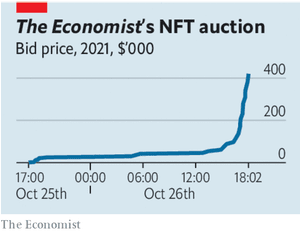  

### Letters

##### Letters to the editor

#### [On food technologies, Top Glove, malarial bed nets, Poland, liberals, email](https://www.economist.com/letters/2021/10/30/letters-to-the-editor)
  
A selection of correspondence  

### Briefing

##### Migration

#### [African odyssey](https://www.economist.com/briefing/2021/10/30/many-more-africans-are-migrating-within-africa-than-to-europe)
  
Some governments are trying to make moving easier  
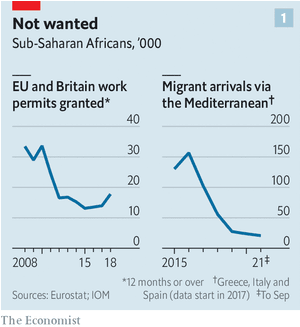  
  
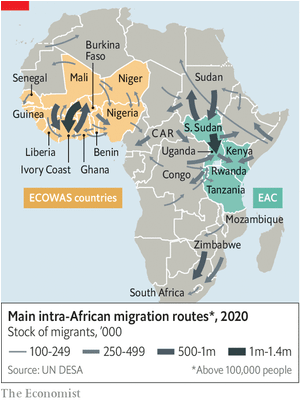  
  
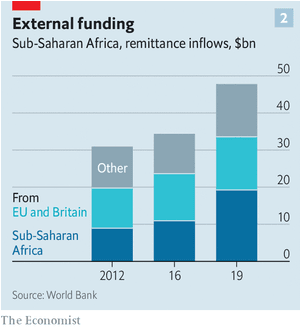  
  

### Europe

##### Turkey

#### [Autumn of the patriarch](https://www.economist.com/europe/2021/10/28/as-the-lira-tanks-so-does-the-stock-of-turkeys-president)
  
But it is too soon to write off Recep Tayyip Erdogan  
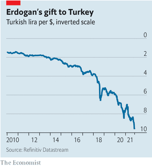  
  

##### The EU’s borders

#### [Wire transfer](https://www.economist.com/europe/2021/10/30/the-eu-is-being-asked-to-pay-for-border-fences-to-keep-migrants-out)
  
It is reluctant, but may have to comply  

##### Serbia

#### [A Balkans arms race](https://www.economist.com/europe/2021/10/30/serbia-is-on-a-shopping-spree-for-weapons)
  
And its neighbours don’t like it  
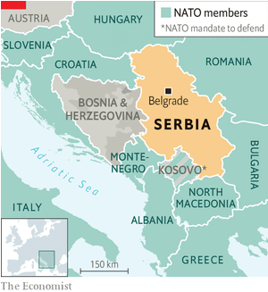  
  

##### French acronyms

#### [PFUE? LOL](https://www.economist.com/europe/2021/10/30/the-strange-french-addiction-to-acronyms)
  
Why make things simple when they can be complicated, then shortened?  

##### Russia

#### [The new Communists](https://www.economist.com/europe/2021/10/30/russias-once-tame-communist-party-is-becoming-an-opposition-force)
  
The Kremlin and the party’s own leader are worried  

##### Charlemagne

#### [Going nuclear](https://www.economist.com/europe/2021/10/30/nuclear-energy-united-europe-now-it-is-dividing-the-club)
  
France says it is green. Germany says it isn’t. France will win  

### Britain

##### Fiscal policy

#### [Farewell to austerity](https://www.economist.com/britain/rishi-sunaks-budget-marks-a-turn-to-big-state-conservatism/21805957)
  
British tax rates will rise to levels last seen in the 1950s  
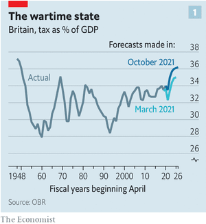  
  
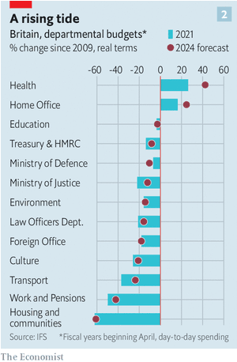  
  

##### The budget

#### [Something ventured](https://www.economist.com/britain/2021/10/30/ministers-roll-out-the-red-carpet-for-entrepreneurs-and-their-investors)
  
Lobbyists have been given everything on their wish-list  

##### Industry

#### [Battery bonanza](https://www.economist.com/britain/2021/10/30/whats-behind-the-great-british-battery-bonanza)
  
Explaining the rush of gigafactories  

##### Earnings

#### [Pay up](https://www.economist.com/britain/2021/10/30/britains-minimum-wage-is-catching-up-with-pre-pandemic-ambitions)
  
Another bold increase after a pause during the covid-19 pandemic  

##### Benin bronzes

#### [Coming home to roost](https://www.economist.com/britain/2021/10/30/a-bronze-chicken-looted-in-1897-is-flying-back-to-nigeria)
  
Where one goes, many others will follow  

##### Privacy

#### [Taking on the taxman](https://www.economist.com/britain/an-attempt-to-stop-britain-sharing-expats-data-with-uncle-sam/21805940)
  
Can “Jenny” succeed where data-protection watchdogs have failed?  

##### Bagehot

#### [Super-green Boris](https://www.economist.com/britain/2021/10/30/the-greening-of-boris-johnson)
  
The prime minister is gung-ho about climate change—perhaps too much so for his new voters  

### Middle East & Africa

##### Sudan

#### [The generals strike back](https://www.economist.com/middle-east-and-africa/sudans-democratic-transition-is-upended-by-a-second-coup-in-two-years/21805857)
  
The generals acted just months before they were due to hand power to civilians  
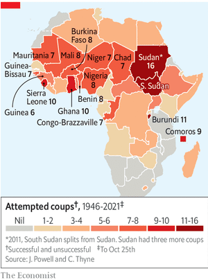  
  

##### African languages

#### [Free clicks](https://www.economist.com/middle-east-and-africa/2021/10/28/a-language-teaching-app-tests-tongues-with-zulu-and-xhosa)
  
Learning clicking sounds is tough, especially online  

##### The United Nations

#### [Expatonomics](https://www.economist.com/middle-east-and-africa/2021/10/30/how-un-staff-are-reshaping-african-cities)
  
Expensive lunch menus, high-end car washes and imported nibbles are some of the signs  

##### Countering Iran

#### [Diplomacy by other means](https://www.economist.com/middle-east-and-africa/israel-again-rattles-its-sabre-at-iran/21805921)
  
A military response is readied as hope for a nuclear deal fades  
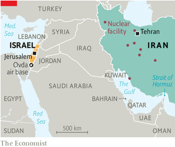  
  

##### Israel

#### [Bibi’s long bye-bye](https://www.economist.com/middle-east-and-africa/2021/10/30/netanyahus-shadow-starts-to-recede-in-israel)
  
An unlikely coalition is surpassing expectations. But a crucial vote looms  

### United States

##### Entrenched partisanship

#### [The Democrats’ disadvantage](https://www.economist.com/united-states/the-democrats-disadvantage/21805946)
  
The party faces long-term hurdles that will be hard to overcome  
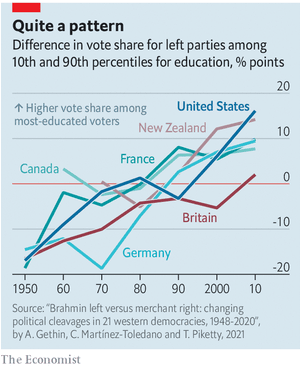  
  

##### Virginia’s next governor

#### [Down to the wire](https://www.economist.com/united-states/2021/10/30/the-message-from-our-model-for-virginias-gubernatorial-race)
  
Bad news for Democrats  
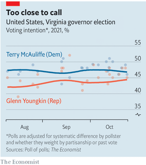  
  

##### Police and politics (1): Minneapolis

#### [A question of safety](https://www.economist.com/united-states/2021/10/30/george-floyds-city-votes-on-the-future-of-its-police-department)
  
Crunch time for the defunding debate  

##### Police and politics (2): Vaccine mandates

#### [Hands up, no shots](https://www.economist.com/united-states/2021/10/30/cops-hate-vaccine-mandates-and-the-city-leaders-imposing-them)
  
Hands up, no shots  

##### Narco-hippos

#### [Wallow on](https://www.economist.com/united-states/2021/10/30/pablo-escobars-hippos-lead-a-charge-for-animal-rights)
  
They can wallow on a while longer  

##### Prostitution

#### [Bringing sex work out of the shadows](https://www.economist.com/united-states/2021/10/30/how-to-bring-sex-work-out-of-the-shadows)
  
The debate over different approaches to decriminalisation  

##### Lexington

#### [No one loves Joe Biden](https://www.economist.com/united-states/2021/10/30/no-one-loves-joe-biden)
  
Americans elected the president to get rid of his predecessor. They’re not sure what else he can do  

### The Americas

##### Chile

#### [Fuelling the flames](https://www.economist.com/the-americas/2021/10/28/chile-once-considered-latin-americas-finland-is-in-trouble)
  
A constitutional convention, formed to battle populism, looks unlikely to help  
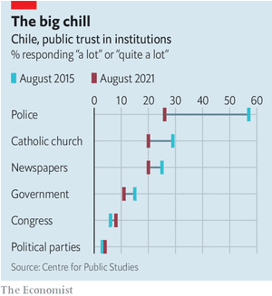  
  

##### Digital currencies

#### [Red, white and blue tape](https://www.economist.com/the-americas/2021/10/30/cubas-communist-regime-is-trying-to-control-crypto)
  
Digital currencies are a lifeline for ordinary Cubans  

##### Bello

#### [No-growth economics](https://www.economist.com/the-americas/2021/10/30/argentinas-government-has-fixed-the-price-of-1432-products)
  
But Peronism’s penchant for controls is holding the country back  

### Asia

##### South-East Asia

#### [ASEANgst](https://www.economist.com/asia/2021/10/30/south-east-asias-regional-club-faces-its-greatest-tests-yet)
  
Credibility trumps consensus as ASEAN attempts to remain relevant  
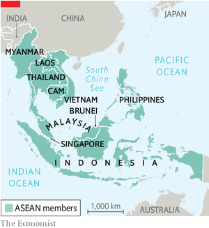  
  

##### Civil war in Myanmar

#### [In for the long haul](https://www.economist.com/asia/2021/10/30/rebels-fighting-myanmars-junta-are-doing-better-than-expected)
  
Nine months after a coup, the country is facing a long civil war  

##### Banyan

#### [BJP v Bollywood](https://www.economist.com/asia/2021/10/30/what-does-indias-government-have-against-bollywood)
  
The BJP is menacing the country’s film industry  

##### Emissions targets

#### [Zero effort](https://www.economist.com/asia/2021/10/30/australias-climate-policy-is-all-talk-and-no-trousers)
  
It relies too much on future technology and not enough on present action  
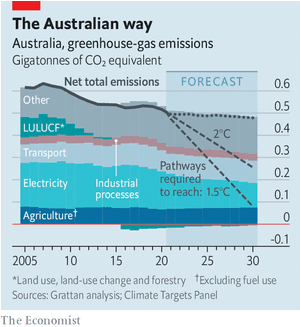  
  

##### Afghanistan’s economy

#### [The next crisis](https://www.economist.com/asia/2021/10/30/afghanistans-economy-is-collapsing)
  
More than half its people may go hungry this winter  

##### Japanese society

#### [The sun, the moon and the ponytail](https://www.economist.com/asia/a-long-delayed-royal-wedding-reveals-awkward-truths-about-japan/21805941)
  
Women are still badly treated, politics is out of sync with the people and the monarchy is dwindling  

### China

##### Feminism

#### [The long wait](https://www.economist.com/china/2021/10/30/a-row-about-toilets-reveals-a-lot-about-womens-place-in-china)
  
Progress is possible, but activism is discouraged  

##### Media controls

#### [All the news that’s fit to reprint](https://www.economist.com/china/2021/10/30/chinas-state-controlled-media-are-put-on-an-even-shorter-leash)
  
All the news sources that may be republished sound similar  

### International

##### Vaccine passports

#### [Hard pass](https://www.economist.com/international/why-vaccine-passports-are-causing-chaos/21805939)
  
The problem is with humans, not technology  
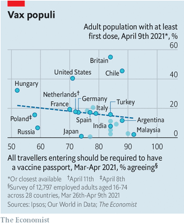  
  

### Special report

##### Stabilising the climate

#### [The biggest picture](https://www.economist.com/special-report/2021/10/27/the-agenda-for-the-cop-26-summit)
  
There has never been a collective human endeavour more ambitious than stabilising the climate. In this special report our journalists assess what it will take to meet the historic goals agreed on in Paris six years ago  
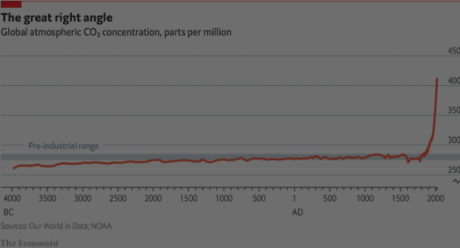  
  

##### State of play

#### [The Paris challenge](https://www.economist.com/special-report/2021/10/27/what-the-paris-agreement-of-2015-meant)
  
Replacing fossil fuels is becoming easier. But temperatures are still likely to rise too far  
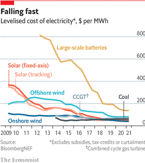  
  

##### The Asian century’s emissions

#### [Eastern approaches](https://www.economist.com/special-report/2021/10/27/how-asia-is-crucial-in-the-battle-against-climate-change)
  
Whether the climate can ever be stabilised depends largely on Asia  
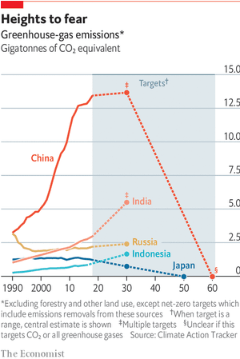  
  

##### Economics and energy

#### [Flows and fuel](https://www.economist.com/special-report/2021/10/27/the-economics-of-the-climate)
  
Energy choices shape economies—and could reshape them  
  
  
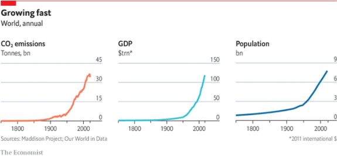  
  
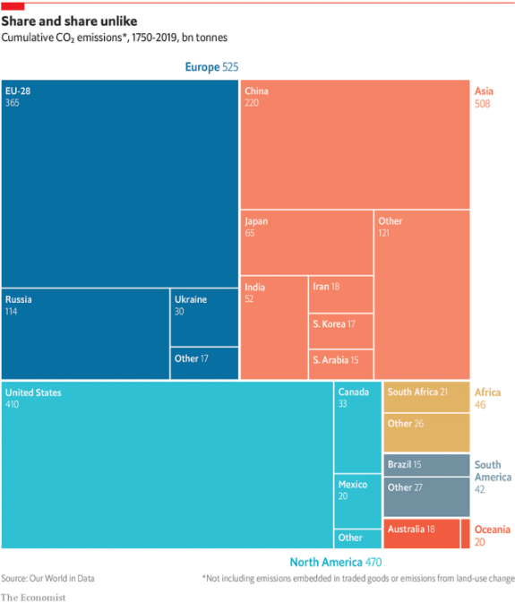  
  

##### Negative emissions

#### [If I could turn back time](https://www.economist.com/special-report/2021/10/27/why-the-world-needs-negative-emissions)
  
If negative emissions are to play a role in policy much more needs to be done to make them practically achievable  
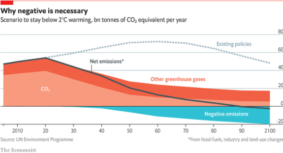  
  

##### Veils and ignorance

#### [Governing the atmosphere](https://www.economist.com/special-report/2021/10/27/governing-the-atmosphere)
  
Technologies which might stabilise the climate could do the reverse to international relations  

### Business

##### Tech earnings

#### [Cloudy with a dearth of chips](https://www.economist.com/business/2021/10/30/how-the-pandemic-has-changed-the-weather-in-the-technology-industry)
  
The cloud, hardware and competition are gaining in importance  
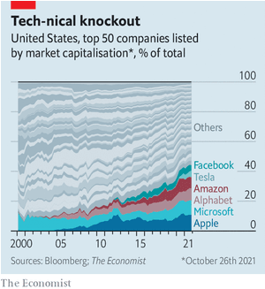  
  

##### Japanese corporate governance

#### [Poison-pill popping](https://www.economist.com/business/2021/10/30/will-japans-new-prime-minister-continue-to-reform-corporate-governance)
  
A hostile takeover should provide some clues  

##### Trouble brewing

#### [America Inc’s earning](https://www.economist.com/business/2021/10/30/worries-ahead-for-american-firms)
  
  

##### Retail subscription services

#### [Outside the box](https://www.economist.com/business/2021/10/30/the-rapid-growth-of-retail-subscription-services-could-be-coming-to-an-end)
  
Box-sellers are trying to adapt  

##### Shell

#### [Splitting time?](https://www.economist.com/business/2021/10/30/an-activist-investor-targets-shell)
  
The plan to break up an oil major  

##### Bartleby

#### [Into battle they don’t go](https://www.economist.com/business/2021/10/30/the-limits-to-the-lessons-of-army-leadership)
  
Life in uniform is very different from life in suits  

##### Schumpeter

#### [Mad Men v machines](https://www.economist.com/business/2021/10/30/the-three-unknowns-of-the-modern-ad-age)
  
For all its aura of precision, the digital-ad industry is as murky as ever  

### Finance & economics

##### Non-fungible tokens

#### [Through the looking glass](https://www.economist.com/finance-and-economics/2021/10/30/the-market-for-non-fungible-tokens-is-evolving)
  
The Economist joins the fray by auctioning an NFT of our cover  
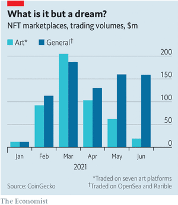  
  

##### Our auction

#### [The NFT party](https://www.economist.com/finance-and-economics/2021/10/30/how-our-nft-auction-went)
  
We raised around $420,000 for charity  
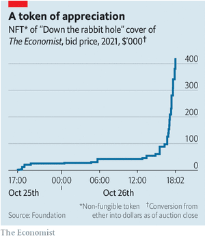  
  

##### Tax in America

#### [A tale of two profits](https://www.economist.com/finance-and-economics/2021/10/30/the-democrats-target-companies-with-giant-profits-but-tiny-tax-bills)
  
A minimum tax on corporate income seems alluring, but is likely to disappoint  

##### The energy crunch

#### [Perverse but persistent](https://www.economist.com/finance-and-economics/2021/10/30/as-energy-prices-spike-governments-reach-for-the-dirtiest-tool-in-the-box)
  
A new IMF study shows that fossil-fuel subsidies are a climate nightmare  
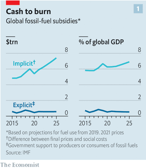  
  
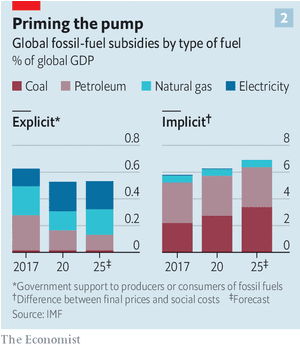  
  

##### Buttonwood

#### [Back with a vengeance](https://www.economist.com/finance-and-economics/2021/10/30/why-currency-volatility-could-make-a-comeback)
  
A decade of low inflation and interest rates smothered forex markets. Now consumer prices and rates are going up  

##### Housing in China

#### [The long wait for a tax everyone loves to hate](https://www.economist.com/finance-and-economics/2021/10/30/chinas-long-wait-for-a-tax-everyone-loves-to-hate)
  
The government will at last roll out a property tax  

##### Free exchange

#### [The pyjama revolution](https://www.economist.com/finance-and-economics/2021/10/30/remote-first-work-is-taking-over-the-rich-world)
  
A growing body of research hints at why  

### Science & technology

##### Private space stations

#### [Placing perches in the sky](https://www.economist.com/science-and-technology/private-space-stations-will-soon-be-in-orbit/21805944)
  
And with them, industry  

##### Avian reproduction

#### [No sex please, we’re condors](https://www.economist.com/science-and-technology/2021/10/30/no-sex-please-were-condors)
  
An endangered bird may sometimes reproduce without males  

##### Renewable energy

#### [A census of solar cells](https://www.economist.com/science-and-technology/an-accurate-tally-of-the-worlds-solar-power-stations/21805945)
  
The method should work for other energy infrastructure, too  
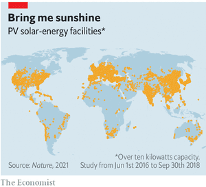  
  

### Books & arts

##### Human rights in China

#### [Xinjiang blues](https://www.economist.com/books-and-arts/2021/10/28/two-new-books-shed-light-on-the-plight-of-the-uyghurs)
  
Darren Byler documents life inside the prison camps. James Millward considers the repression as part of a broader history  

##### “The Potato Eaters”

#### [Earthy delights](https://www.economist.com/books-and-arts/2021/10/30/the-van-gogh-museum-showcases-a-rejected-early-masterpiece)
  
People hated “The Potato Eaters” when it was unveiled in 1885. Vincent van Gogh thought it was his best work  

##### Johnson

#### [Write like an Egyptian](https://www.economist.com/books-and-arts/2021/10/28/how-the-rosetta-stone-was-deciphered)
  
“The Writing of the Gods” is an entertaining account of a great intellectual achievement  

##### Europe in the 21st century

#### [Crisis management](https://www.economist.com/books-and-arts/2021/10/28/geert-mak-takes-stock-of-the-past-20-years-of-european-history)
  
Among the disasters and gloom are glimmers of hope  

##### British fiction

#### [Smoke and mirrors](https://www.economist.com/books-and-arts/2021/10/30/making-nice-is-a-gratifying-satire-of-the-internet-age)
  
Ferdinand Mount’s new novel revolves around a publicity agency in London  

### Economic & financial indicators

##### Indicators

#### [Economic data, commodities and markets](https://www.economist.com/economic-and-financial-indicators/2021/10/28/economic-data-commodities-and-markets)
  
  

### Graphic detail

##### Electric vehicles

#### [The grid’s the thing](https://www.economist.com/graphic-detail/2021/10/30/a-new-study-argues-that-insufficient-infrastructure-doomed-the-first-electric-cars)
  
With a more robust power grid, petrol-powered cars might have been a minority  
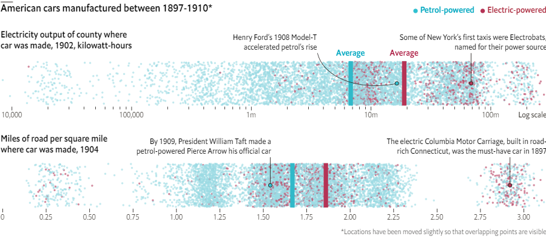  
  
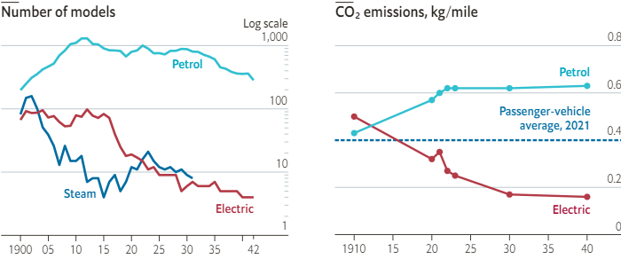  
  
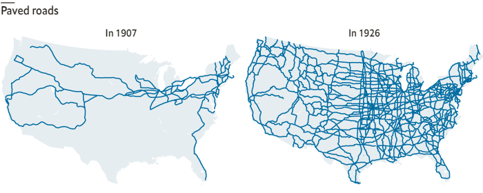  
  

### Obituary

##### Anne Saxelby

#### [Say cheese, America!](https://www.economist.com/obituary/2021/10/30/anne-saxelby-was-a-champion-of-artisan-farmers-and-their-wares)
  
The pioneering cheesemonger died on October 9th, aged 40  
