---

title: 2021-11-06-Economist Graphs

author: ''

date: '2021-11-06'

slug: '2021-11-06'

categories: []

tags: []

subtitle: ''

summary: ''

authors: []

featured: no

image:

  caption: ''

  focal_point: ''

  preview_only: no

projects: []

---
### The world this week

#### [Politics](https://www.economist.com/the-world-this-week/2021/11/06/politics)
  
  

#### [Business](https://www.economist.com/the-world-this-week/2021/11/06/business)
  
  

#### [KAL’s cartoon](https://www.economist.com/the-world-this-week/2021/11/06/kals-cartoon)
  
  

### The world this week

#### [Politics](https://www.economist.com/the-world-this-week/2021/11/06/politics)
  
  

#### [Business](https://www.economist.com/the-world-this-week/2021/11/06/business)
  
  

#### [KAL’s cartoon](https://www.economist.com/the-world-this-week/2021/11/06/kals-cartoon)
  
  

### Leaders

##### American politics

#### [One year on](https://www.economist.com/leaders/2021/11/06/the-calamity-facing-joe-biden-and-the-democrats)
  
The president needs to distance himself from his party’s left fringe  

##### Markets and inflation

#### [Bond traders stir](https://www.economist.com/leaders/2021/11/06/revolt-of-the-bond-traders)
  
The message from unruly fixed-income markets  
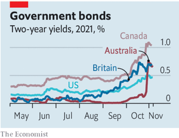  
  

##### Government in Britain

#### [Are rules for losers?](https://www.economist.com/leaders/2021/11/04/boris-johnson-treats-checks-and-balances-with-contempt)
  
He seems to think rules are for losers  

##### Climate change and investing

#### [The uses and abuses of green finance](https://www.economist.com/leaders/the-uses-and-abuses-of-green-finance/21806111)
  
Why the net-zero pledges of financial firms won’t save the world  
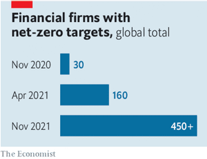  
  

##### Abiy’s abyss

#### [Act now to avert carnage in Ethiopia](https://www.economist.com/leaders/2021/11/04/act-now-to-avert-a-bloodbath-in-ethiopia)
  
As rebels march on the capital, ethnic persecution accelerates  

### Letters

##### Letters to the editor

#### [On Dave Chappelle, Spain, lorry drivers, carbon taxes, trees, our NFT auction](https://www.economist.com/letters/2021/11/06/letters-to-the-editor)
  
A selection of correspondence  

### Briefing

##### Social mobility in America

#### [Stuck in place](https://www.economist.com/briefing/2021/11/06/the-democrats-social-spending-package-cannot-repair-the-american-dream)
  
Social mobility has dropped precipitously  
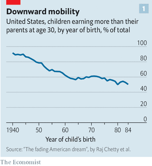  
  
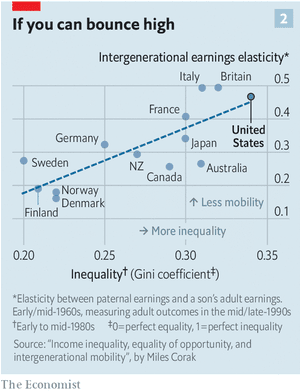  
  
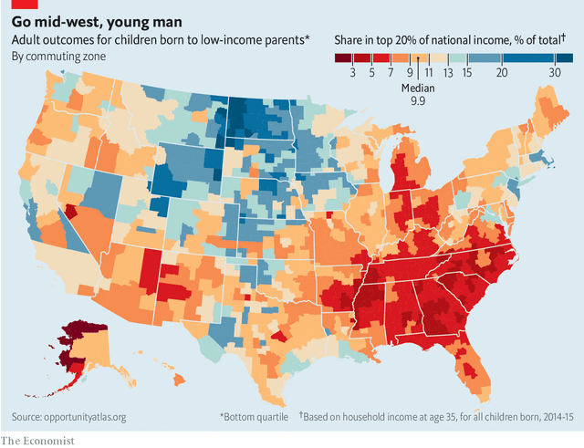  
  

### Europe

##### Italy

#### [The Mario magic](https://www.economist.com/europe/italys-new-prime-minister-has-had-a-good-first-nine-months/21806085)
  
But there is a lot left to do, and not much time to do it in  
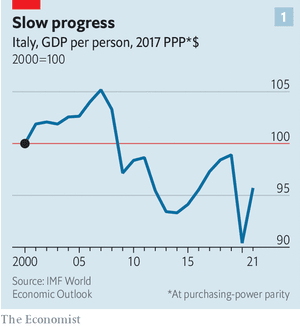  
  
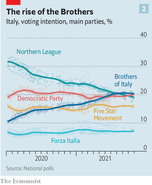  
  

##### Portugal

#### [The contraption crashes](https://www.economist.com/europe/2021/11/06/snap-elections-are-called-after-portugals-government-collapses)
  
Prime Minister António Costa struggled to govern with the hard left  

##### Global warming and food

#### [Hot cuisine](https://www.economist.com/europe/2021/11/06/how-might-climate-change-affect-european-gastronomy)
  
Say hello to pan-fried rabbitfish  

##### Georgia

#### [Heavy vetting](https://www.economist.com/europe/2021/11/04/bouncers-at-gay-clubs-in-georgia-screen-patrons-for-bigotry)
  
It is not easy to spot  

##### Germany’s Turks

#### [From guest worker to citizen?](https://www.economist.com/europe/2021/11/06/sixty-years-of-turkish-guest-workers-in-germany)
  
More are integrated, but two-thirds of adults are not German citizens  
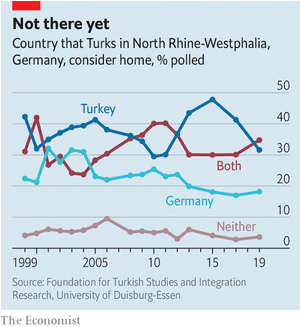  
  

##### Charlemagne

#### [Noisy neighbours](https://www.economist.com/europe/2021/11/06/why-britain-is-such-a-noisy-neighbour)
  
Post-Brexit rows with the EU are inevitable. They are not always serious  

### Britain

##### Political lobbying

#### [Tory sleaze, again](https://www.economist.com/britain/2021/11/06/britains-government-goes-to-disgraceful-lengths-to-protect-a-tory-mp)
  
Owen Paterson broke lobbying rules. To save him, it wanted to rewrite those rules  

##### Judicial independence

#### [Government v judges](https://www.economist.com/britain/2021/11/04/judicial-independence-is-under-threat-in-britain)
  
Tory claims that judges intrude too much into politics are wrong and dangerous  

##### Climate summitry

#### [COP26 flows over](https://www.economist.com/britain/2021/11/06/cop26-in-glasgow-gets-off-to-a-chaotic-start)
  
Success or failure depends on more than the host, and will be clear only in hindsight  

##### Smoking

#### [Vape nation](https://www.economist.com/britain/2021/11/04/britons-love-e-cigarettes-and-ministers-want-to-encourage-them)
  
How the country became an international outlier  
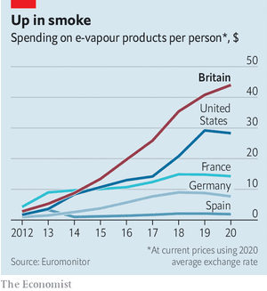  
  

##### Monetary policy

#### [Raising the roof](https://www.economist.com/britain/2021/11/06/higher-interest-rates-mean-more-expensive-mortgages)
  
But changes in the British housing market mute their effect  
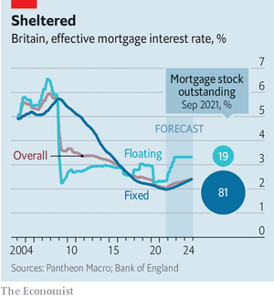  
  

##### Bagehot

#### [Blue Leviathan](https://www.economist.com/britain/2021/11/06/boris-johnsons-conservatives-plan-to-create-a-bigger-busier-state)
  
The government is increasingly activist, from raising taxes to stoking culture wars  

### Middle East & Africa

##### Ethiopia’s civil war

#### [A battle for the capital looms](https://www.economist.com/middle-east-and-africa/ethiopias-capital-is-under-threat/21806092)
  
Tigray’s rebels are on a roll  
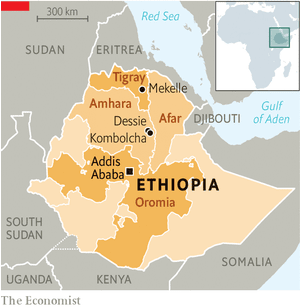  
  

##### South Africa

#### [Hegemon no more](https://www.economist.com/middle-east-and-africa/2021/11/06/south-africa-is-slowly-souring-on-its-ruling-party)
  
Local elections suggest the ANC will need coalitions to stay in charge  
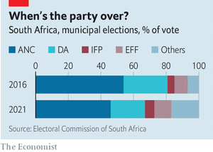  
  

##### Protecting the Congo basin

#### [Money for old trees](https://www.economist.com/middle-east-and-africa/as-leaders-pledge-to-protect-forests-gabon-points-to-how/21806081)
  
Trees in the Congo basin provide a service the world should pay for  
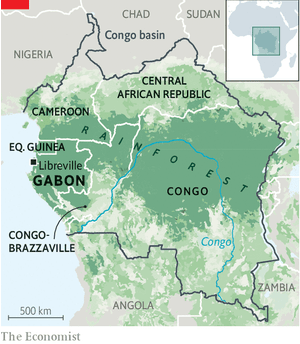  
  

##### Algeria, Morocco and Western Sahara

#### [The disputed desert](https://www.economist.com/middle-east-and-africa/2021/11/06/things-are-heating-up-in-western-sahara)
  
A desert dispute is aggravating the old rivalry between Algeria and Morocco  
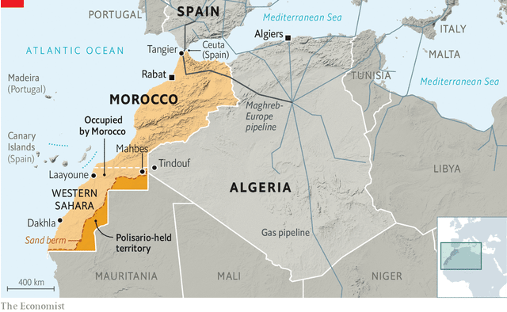  
  

### United States

##### American competitiveness

#### [The maths wars](https://www.economist.com/united-states/2021/11/06/americas-maths-wars)
  
How teaching multiplication tables became another victim of the political divide  

##### Off-year elections

#### [Physics for politics](https://www.economist.com/united-states/2021/11/06/democrats-suffer-a-thorough-drubbing-at-the-polls)
  
They lost power in Virginia and barely hung on in New Jersey, both Democrat-friendly states  

##### The Supreme Court

#### [Lawyers, guns and babies](https://www.economist.com/united-states/the-supreme-court-seems-poised-to-rule-against-texass-six-week-abortion-ban/21806077)
  
The latter ruling may hinge on a 14th century British statute  

##### Guns and religion

#### [No sympathy for the devil](https://www.economist.com/united-states/2021/11/06/belief-in-supernatural-evil-is-a-strong-predictor-of-pro-gun-beliefs)
  
The world seems a more threatening place to those who fear demons and hell  

##### Medicine and identity

#### [Portrait of a detransitioner](https://www.economist.com/united-states/2021/11/06/portrait-of-a-detransitioner-as-a-young-woman)
  
Carol has been a woman, a man and is a woman again. Her story has lessons for trans medicine  

##### Lexington

#### [Glenn Youngkin and Ivy League populism](https://www.economist.com/united-states/2021/11/04/glenn-youngkin-and-ivy-league-populism)
  
Virginia’s governor-elect is the latest Republican culture warrior with an expensive education  

### The Americas

##### Brazil

#### [From hero to villain](https://www.economist.com/the-americas/2021/11/06/brazil-wants-more-from-cop26-than-it-is-willing-to-give)
  
The government’s green rhetoric in Glasgow clashes with inaction at home  
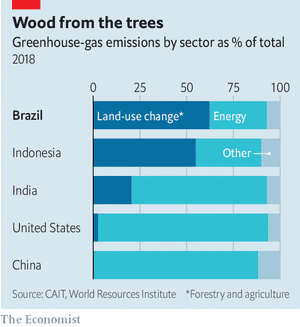  
  

##### Latin American TV

#### [1001 episodes](https://www.economist.com/the-americas/2021/11/06/turkish-telenovelas-are-thriving-in-latin-america)
  
Many viewers prefer epic love tales to gory local narco-dramas  

##### Bello

#### [Spooked by Venezuela](https://www.economist.com/the-americas/2021/11/06/revulsion-at-venezuela-is-fuelling-the-hard-right-in-latin-america)
  
By wrecking a country, a leftist regime inadvertently boosts support for the illiberal right  

### Asia

##### Pollution

#### [Baby, it’s toxic outside](https://www.economist.com/asia/2021/11/06/indias-toxic-air-is-its-most-immediate-environmental-problem)
  
Even as the country pledges climate action, its people are dying from breathing  
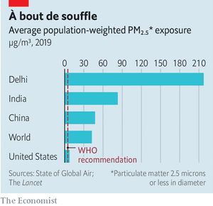  
  
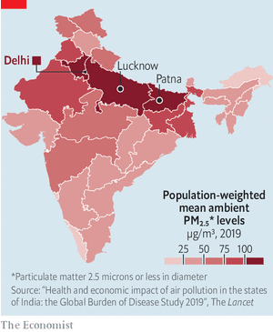  
  

##### Instagram and youth culture

#### [Hot shots](https://www.economist.com/asia/2021/11/06/why-young-south-koreans-are-posing-in-their-underwear)
  
To show off the time (and money) they have spent with personal trainers  

##### Bangladesh and India

#### [Spilling over](https://www.economist.com/asia/2021/11/06/bangladeshs-religious-minorities-are-under-attack)
  
The prime minister blames India’s Muslim-bashing for Hindu-bashing in her own country  

##### Japanese politics

#### [Wishy-washy](https://www.economist.com/asia/2021/11/04/japans-new-prime-minister-still-has-to-explain-what-he-stands-for)
  
Kishida Fumio handily led his party to re-election, but his agenda remains vague  

##### Banyan

#### [Mine for the taking](https://www.economist.com/asia/2021/11/06/mongolia-and-kyrgyzstan-struggle-with-the-curse-of-mineral-wealth)
  
Both countries are wrangling with miners on how to share benefits and costs  

### China

##### The Communist Party

#### [Control the present, control the past](https://www.economist.com/china/2021/11/06/xi-jinping-is-rewriting-history-to-justify-his-rule-for-years-to-come)
  
Who controls the present controls the past  

##### Military strategy

#### [An unpacific contest](https://www.economist.com/china/china-seeks-to-join-the-nuclear-big-league/21806104)
  
The Pentagon warns that China is fast building up its nukes, as well as its conventional forces, to confront America  

### International

##### Forests and climate change

#### [Up a tree](https://www.economist.com/international/the-world-should-prove-its-love-for-forests-by-putting-carbon-prices-on-them/21806086)
  
Without that, more trees may not mean less climate change  
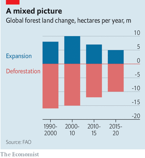  
  
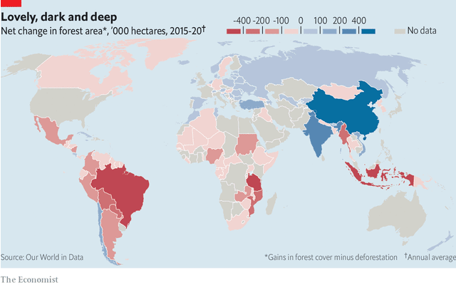  
  

### Business

##### Pricing power

#### [Passing the buck](https://www.economist.com/business/2021/11/06/pricing-power-is-highly-prized-on-wall-street)
  
At the moment there is a glut  
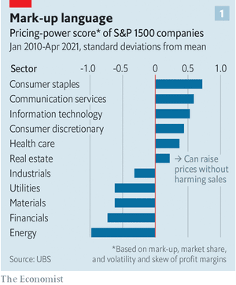  
  
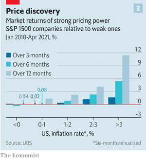  
  

##### American basketball and China

#### [The audacity of hoops](https://www.economist.com/business/2021/11/06/american-basketballs-tricky-relations-with-china)
  
Human-rights protests threaten profits  

##### Newspapers

#### [Paperchase](https://www.economist.com/business/2021/11/06/soaring-newsprint-costs-make-life-even-harder-for-newspapers)
  
It may accelerate the move online  

##### Amazon in Germany

#### [Strike season](https://www.economist.com/business/2021/11/06/a-big-german-union-fights-to-preserve-national-pay-standards)
  
But most Amazon workers are reluctant to join a strike  

##### The new face of old tech

#### [Reinvention as a service](https://www.economist.com/business/the-it-establishment-is-dressing-in-new-clothes/21806076)
  
But taking on the big tech firms will be hard  
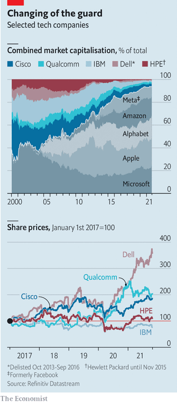  
  

##### Bartleby

#### [Why executives like the office](https://www.economist.com/business/2021/11/06/why-executives-like-the-office)
  
Blame a mixture of conditioning, carpets and concrete concerns  

##### Schumpeter

#### [The Gorgon knot](https://www.economist.com/business/2021/11/06/the-supermajors-have-an-lng-problem)
  
State-owned giants are squeezing them out of megaprojects  

### Finance & economics

##### America’s economy

#### [Inner strength](https://www.economist.com/finance-and-economics/even-after-a-weak-patch-americas-economy-is-still-in-high-gear/2180604)
  
High inflation, supply snarls—and strong growth momentum  
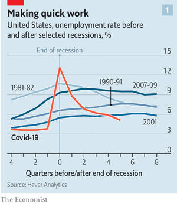  
  
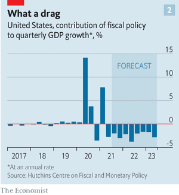  
  
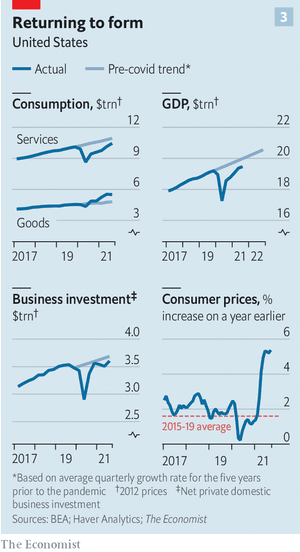  
  
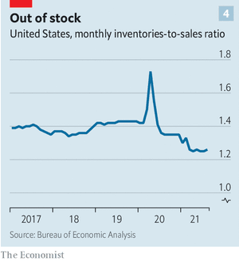  
  

##### Interest rates

#### [Bond markets v central banks](https://www.economist.com/finance-and-economics/the-bond-markets-v-central-banks/21806082)
  
Investors bet that policymakers will have to break their promises  
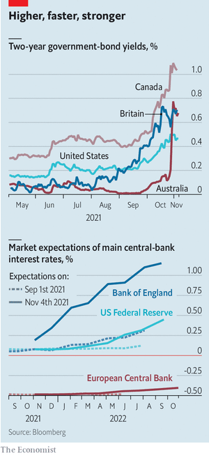  
  

##### Emerging markets

#### [Living the high life](https://www.economist.com/finance-and-economics/2021/11/06/cautionary-tales-from-high-inflation-emerging-economies)
  
What Brazil, Argentina and Turkey say about the importance of fiscal and monetary policy  
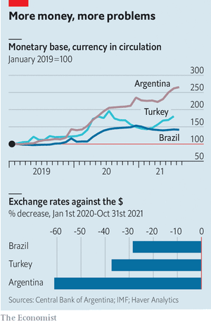  
  

##### Payments in Africa

#### [Turf wars](https://www.economist.com/finance-and-economics/2021/11/06/africas-fintech-firms-vie-for-domination)
  
As investment pours in, they are expanding across the continent and into new services  

##### Buttonwood

#### [Schrödinger’s markets](https://www.economist.com/finance-and-economics/2021/11/06/a-quantum-walk-down-wall-street)
  
Lessons for finance from 20th-century physics  

##### Free exchange

#### [The greedy-jobs gap](https://www.economist.com/finance-and-economics/2021/11/06/do-greedy-jobs-cause-the-gender-pay-gap)
  
Mothers’ careers suffer when parents maximise their combined income, says a new book  

### Science & technology

##### Greenhouse gases

#### [Set in green concrete](https://www.economist.com/science-and-technology/how-cement-may-yet-help-slow-global-warming/21806083)
  
It is a big source of emissions, but might one day be the reverse  
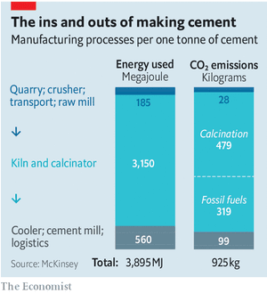  
  

##### Green aviation

#### [Liquid sunshine](https://www.economist.com/science-and-technology/plucking-aircraft-fuel-from-thin-air/21806091)
  
How to combine atmospheric CO2 and water to power aeroplanes  

##### Unimals

#### [Balls, sticks and the Baldwin effect](https://www.economist.com/science-and-technology/a-novel-way-to-optimise-robots/21806090)
  
It harks back to a 19th-century idea about evolution  

##### Animal migration

#### [Eel meet again](https://www.economist.com/science-and-technology/eels-are-guided-by-earths-magnetic-field/21806088)
  
They can tell its strength as well as its direction  

##### Funerary rituals

#### [Blood not so simple](https://www.economist.com/science-and-technology/a-funeral-mask-painted-with-human-blood/21806089)
  
Whether the donor was willing will forever remain unknown  

### Books & arts

##### Nationalism and revolution

#### [The day after the dream](https://www.economist.com/books-and-arts/2021/11/06/a-new-book-shows-how-the-greek-revolution-shaped-europe)
  
It inspired a wave of nationalism—and holds lessons for foreign intervention today  

##### Women and philosophy

#### [The moral of the story](https://www.economist.com/books-and-arts/2021/11/06/the-four-women-who-shook-up-philosophy)
  
A new book traces their pathbreaking friendships and careers  

##### Nigerian fiction

#### [Body blows](https://www.economist.com/books-and-arts/2021/11/06/after-50-years-wole-soyinka-has-returned-to-fiction)
  
The Nobel laureate’s new novel offers a bleak diagnosis of his country  

##### Books and social media

#### [Word of mouth](https://www.economist.com/books-and-arts/2021/11/06/booktok-has-passion-and-enormous-marketing-power)
  
Old-fashioned critics might not approve. But why should BookTok’s stars care?  

##### Edvard Munch

#### [Light in the darkness](https://www.economist.com/books-and-arts/2021/11/06/a-palatial-museum-of-edvard-munchs-art-opens-in-oslo)
  
MUNCH is one of the biggest museums anywhere devoted to a single artist  

### Economic & financial indicators

##### Indicators

#### [Economic data, commodities and markets](https://www.economist.com/economic-and-financial-indicators/2021/11/06/economic-data-commodities-and-markets)
  
  

### Graphic detail

##### Inflation

#### [The used-car conundrum](https://www.economist.com/graphic-detail/2021/11/06/a-handful-of-items-are-driving-inflation-in-america)
  
Our new measure shows that this portends lower inflation—but not enough for the Fed to lower its guard  
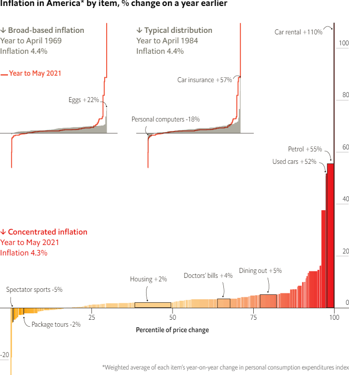  
  
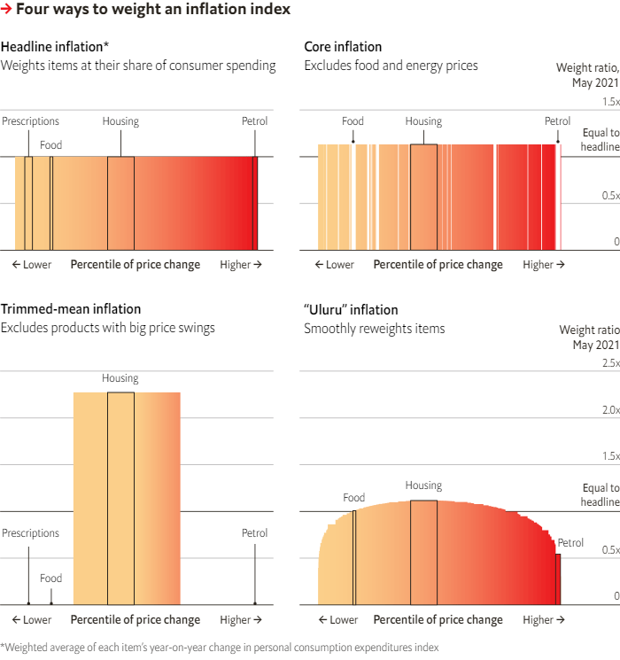  
  
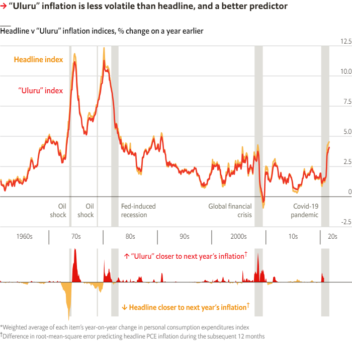  
  

### Obituary

##### Bernard Haitink

#### [Music, not words](https://www.economist.com/obituary/2021/11/06/bernard-haitink-believed-that-genius-should-speak-for-itself)
  
The great conductor died on October 21st, aged 92  
