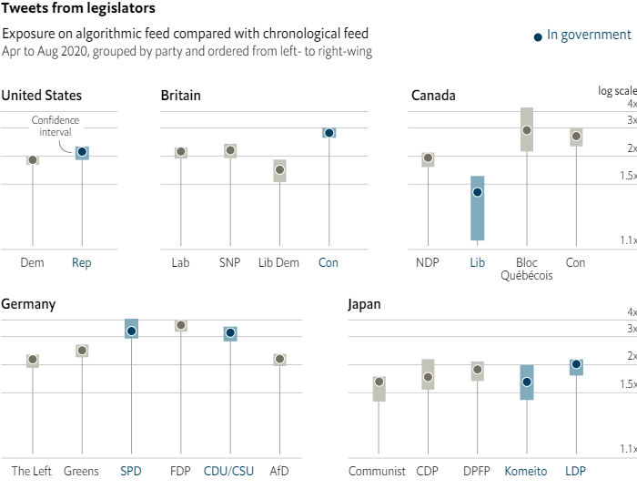

---
title: 2021-11-13-Economist Graphs
author: ''
date: '2021-11-13'
publishDate: '2021-11-16'
slug: 2021-11-13
categories: []
tags: []
subtitle: ''
summary: ''
authors: []
featured: no
image:
  caption: ''
  focal_point: ''
  preview_only: no
projects: []
---### 1. The world this week
#### 1.1 [Politics](https://www.economist.com/the-world-this-week/2021/11/13/politics)
  

#### 1.2 [Business](https://www.economist.com/the-world-this-week/2021/11/13/business)
  

#### 1.3 [KAL’s cartoon](https://www.economist.com/the-world-this-week/2021/11/13/kals-cartoon)
  

### 2. The world this week
#### 2.1 [Politics](https://www.economist.com/the-world-this-week/2021/11/13/politics)
  

#### 2.2 [Business](https://www.economist.com/the-world-this-week/2021/11/13/business)
  

#### 2.3 [KAL’s cartoon](https://www.economist.com/the-world-this-week/2021/11/13/kals-cartoon)
  

### 3. Leaders
#### 3.1 [A final choice](https://www.economist.com/leaders/2021/11/13/the-welcome-spread-of-assisted-dying)
**The end of life**  
But too many are still denied this basic freedom  

#### 3.2 [Putin’s new era of repression](https://www.economist.com/leaders/2021/11/13/russias-new-era-of-repression)
**Russia**  
It will lead to confrontation with the West  

#### 3.3 [War, drought, famine](https://www.economist.com/leaders/2021/11/13/the-world-must-act-now-to-stop-afghans-starving)
**Afghanistan**  
That means co-operating with the Taliban, as distasteful as that is  

#### 3.4 [China’s other debt problem](https://www.economist.com/leaders/2021/11/13/evergrande-is-not-the-only-looming-danger-in-chinas-financial-system)
**Evergrande and financial contagion**  
Crony capitalism has flourished among the country’s small and mid-tier banks  
  

#### 3.5 [The discreet charm of nuclear power](https://www.economist.com/leaders/2021/11/13/the-discreet-charm-of-nuclear-power)
**Energy**  
It makes fighting climate change a lot easier  

### 4. Letters
#### 4.1 [On economics, Balkan bridges, Shakespeare, mission statements, hydrogen, Facebook, French, Polexit](https://www.economist.com/letters/2021/11/13/letters-to-the-editor)
**Letters to the editor**  
A selection of correspondence  

### 5. Briefing
#### 5.1 [Manacled in Moscow](https://www.economist.com/briefing/2021/11/13/vladimir-putin-has-shifted-from-autocracy-to-dictatorship)
**Russian repression**  
And Russians across the country are feeling the heat  
  
  

### 6. Europe
#### 6.1 [Disoriented express](https://www.economist.com/europe/2021/11/13/how-trains-could-replace-planes-in-europe)
**EU railways**  
It won’t be easy  
  

#### 6.2 [Caught at the wire](https://www.economist.com/europe/2021/11/13/a-scheme-to-use-migrants-to-split-the-eu-is-likely-to-backfire)
**The Belarus-Poland border**  
Belarus is shipping Iraqis to the Polish border and trapping them there  
  

#### 6.3 [The arc of susceptibility](https://www.economist.com/europe/2021/11/13/eastern-european-countries-are-being-hit-by-a-wave-of-covid-deaths)
**Coronavirus in eastern Europe**  
But only where vaccination rates are poor  

#### 6.4 [Going bananas](https://www.economist.com/europe/2021/11/11/turkeys-government-sees-no-humour-in-soft-fruit)
**Syrians in Turkey**  
Refugees who ate bananas in a provocative fashion are to be deported  

#### 6.5 [Minimum wage, maximum rage](https://www.economist.com/europe/2021/11/13/minimum-wage-maximum-rage)
**Charlemagne**  
A fight about worker pay pits a Scandinavian duo against the rest of the EU  

### 7. Britain
#### 7.1 [This time, it’s different](https://www.economist.com/britain/can-smaller-reactors-make-nuclear-power-economic/21806208)
**Nuclear power**  
Rolls-Royce—and Britain’s government—hope so  
  

#### 7.2 [Mustn’t grumble](https://www.economist.com/britain/2021/11/13/britons-want-to-prevent-climate-change-but-favour-expensive-solutions)
**Environmental attitudes**  
One in the eye for economists  
  

#### 7.3 [Groundhog day](https://www.economist.com/britain/2021/11/13/the-northern-ireland-protocol-is-under-threat-again)
**The Northern Ireland protocol**  
Triggering Article 16 would mean testy trade talks—and a risk of no deal  

#### 7.4 [London’s bridges falling down](https://www.economist.com/britain/2021/11/11/londons-bridges-are-falling-down)
**Infrastructure**  
It is unclear whom to blame—and that is the reason for the problem  

#### 7.5 [Spiralling scandal](https://www.economist.com/britain/2021/11/11/voters-do-not-want-mps-to-profit-from-their-job)
**Politics**  
Under the current rules, they can. Cue controversy  

#### 7.6 [Off the shelf](https://www.economist.com/britain/2021/11/13/which-products-are-scarce-on-britains-shelves)
**What’s missing?**  
New data published by the Office for National Statistics show patchy problems  
  

#### 7.7 [They shall not grow old](https://www.economist.com/britain/2021/11/13/britain-used-to-treat-her-dead-soldiers-with-disdain-one-man-changed-that)
**War graves**  
How Fabian Ware transformed the aftermath of war  

#### 7.8 [Learning from Paterson](https://www.economist.com/britain/how-boris-johnsons-failure-to-tackle-sleaze-among-mps-could-prove-costly/21806201)
**Bagehot**  
The lessons of the latest parliamentary debacle in Britain  

### 8. Middle East & Africa
#### 8.1 [No tourist Mecca](https://www.economist.com/middle-east-and-africa/the-reinvention-of-the-saudi-economy-is-going-slower-than-planned/21806192)
**Saudi Arabia**  
Apart from oil, the desert kingdom does not have many unique selling points  
  

#### 8.2 [Get two rooms](https://www.economist.com/middle-east-and-africa/2021/11/13/hard-up-hoteliers-want-morocco-to-legalise-premarital-sex)
**Prudery in Morocco**  
No marriage certificate, no room key  

#### 8.3 [The new predators](https://www.economist.com/middle-east-and-africa/why-drones-are-becoming-irans-weapons-of-choice/21806199)
**Iran’s military tactics**  
The attempt to kill Iraq’s prime minister highlights how Iran’s unmanned aerial vehicles are changing the military balance in the Middle East  

#### 8.4 [No farewell to arms](https://www.economist.com/middle-east-and-africa/2021/11/13/congo-does-not-know-what-to-do-with-rebels-who-surrender)
**Congo’s militias**  
It is proving hard to reintegrate them into society  
  

#### 8.5 [Time and punishment](https://www.economist.com/middle-east-and-africa/2021/11/13/victims-of-liberias-civil-war-are-still-waiting-for-justice)
**Liberia**  
  

### 9. United States
#### 9.1 [Of walls and wobbles](https://www.economist.com/united-states/2021/11/13/why-the-situation-on-americas-southern-border-has-become-unmanageable)
**Biden and the border**  
Democrats have not realised how serious the problem is  
  

#### 9.2 [Unlocked](https://www.economist.com/united-states/joe-biden-passes-the-less-contentious-half-of-his-legislative-agenda/21806187)
**Infrastructure year**  
Infrastructure year is finally here  

#### 9.3 [You’re in trouble](https://www.economist.com/united-states/john-durhams-indictments-reflect-poorly-on-the-american-media/21806220)
**The Durham investigation**  
The special counsel arrests one of the sources of the infamous Steele dossier  

#### 9.4 [Energy deficient](https://www.economist.com/united-states/will-the-climate-crisis-force-america-to-reconsider-nuclear-power/21806194)
**New nukes**  
Reaching net-zero targets will be much harder without it  
  
  

#### 9.5 [Latin hex](https://www.economist.com/united-states/2021/11/13/a-large-minority-of-hispanic-voters-support-trump-populism)
**Lexington**  
This looks catastrophic for the left  

### 10. The Americas
#### 10.1 [By the book](https://www.economist.com/the-americas/six-ways-nicolas-maduro-stays-in-power-in-venezuela/21806197)
**How to be a dictator (1)**  
With an approval rating of around 15%, he could not possibly win a fair election  

#### 10.2 [A family affair](https://www.economist.com/the-americas/2021/11/13/other-despots-help-daniel-ortega-stay-in-power-in-nicaragua)
**How to be a dictator (2)**  
His allies in Venezuela, Cuba and Russia supported a fake election  

#### 10.3 [Following the money](https://www.economist.com/the-americas/2021/11/13/president-jair-bolsonaro-is-bad-for-brazils-economy)
**Bello**  
A constitutional amendment marks a return to fiscal incontinence  

### 11. Asia
#### 11.1 [Manufacturing a green revolution](https://www.economist.com/asia/2021/11/13/south-koreas-climate-targets-will-mean-remaking-its-economy)
**Climate and industry**  
Its industrial centres will have to transform or disappear  
  

#### 11.2 [Levelling up](https://www.economist.com/asia/2021/11/13/bangladesh-is-making-a-serious-attempt-to-improve-its-schools)
**Education in South Asia (1)**  
It hopes to move away from rote learning and towards actual learning  

#### 11.3 [Levelling down](https://www.economist.com/asia/2021/11/11/a-new-national-curriculum-sparks-a-backlash-in-pakistan)
**Education in South Asia (2)**  
Teachers and parents worry that English-language skills are being replaced by religious content  

#### 11.4 [How to get a promotion](https://www.economist.com/asia/2021/11/11/some-civilian-politicians-are-working-for-myanmars-murderous-generals)
**Politics in Myanmar**  
Even former supporters of Aung San Suu Kyi are now in the employ of the regime  

#### 11.5 [The great board game](https://www.economist.com/asia/2021/11/11/how-the-game-of-go-explains-chinas-aggression-towards-india)
**Banyan**  
Bide one’s time, then show strength  

### 12. China
#### 12.1 [The spectral game](https://www.economist.com/china/2021/11/11/china-still-steals-commercial-secrets-for-its-own-firms-profit)
**State-sponsored hacking**  
Despite saying it wouldn’t engage in cybertheft, it is ramping up its efforts  

#### 12.2 [New kids on the cell block](https://www.economist.com/china/2021/11/11/behind-bars-hong-kongs-democrats-remain-popular)
**Dissent in Hong Kong**  
The city’s jails are filling up with dissidents  

#### 12.3 [Why China has a zero-covid policy](https://www.economist.com/china/2021/11/12/china-will-stick-to-a-zero-covid-policy-for-now)
**Chaguan**  
Harsh rules will enjoy support, as long as life feels safe for the majority  

### 13. International
#### 13.1 [Death on demand](https://www.economist.com/international/2021/11/13/in-the-west-assisted-dying-is-rapidly-becoming-legal-and-accepted)
**Assisted dying**  
It is raising hard questions and changing how people think about death  
  
  
  

### 14. Business
#### 14.1 [Fading stars](https://www.economist.com/business/how-hollywoods-biggest-stars-lost-their-clout/21806186)
**Hollywood’s talent wars**  
Streaming has changed the economics of talent  

#### 14.2 [Lab rats](https://www.economist.com/business/2021/11/13/science-and-technology-lifts-the-gloom-for-property-investors)
**Commercial property**  
Lab landlords are seeking new premises  
  

#### 14.3 [The impossible job](https://www.economist.com/business/2021/11/13/chief-executives-are-weirder-than-ever)
**Bartleby**  
An impossible job has become even tougher  

#### 14.4 [Seal of the realm](https://www.economist.com/business/2021/11/13/the-non-zero-costs-of-zero-covid)
**China and the pandemic**  
In business, China is becoming a world unto itself  
  

#### 14.5 [Not so general](https://www.economist.com/business/2021/11/13/general-electric-breaks-up)
**General Electric**  
An iconic conglomerate calls time on itself  
  

#### 14.6 [Golf’s course](https://www.economist.com/business/2021/11/13/herbert-diesss-job-is-once-again-on-the-line)
**Volkswagen’s labour relations**  
Volkswagen workers are flexing their muscles  

#### 14.7 [Virtual world, Inc](https://www.economist.com/business/2021/11/13/companies-want-to-build-a-virtual-realm-to-copy-the-real-world)
**The corporate metaverse**  
Linking the digital and physical worlds could unlock innovation  

#### 14.8 [The flywheel delusion](https://www.economist.com/business/uber-doordash-and-similar-firms-cant-defy-the-laws-of-capitalism-after-all/21806198)
**Schumpeter**  
The mania over ride-sharing and delivery companies has at times been absurd  

### 15. Finance & economics
#### 15.1 [Attack on the tycoons](https://www.economist.com/finance-and-economics/china-attempts-to-clean-up-its-sleaziest-regional-banks/21806193)
**Chinese banks**  
It’s not just Evergrande. The rot in China’s banking system goes deeper  
  
  

#### 15.2 [The bitcom boom](https://www.economist.com/finance-and-economics/2021/11/13/will-the-craze-for-crypto-startups-ever-produce-the-next-tech-giant)
**Funding crypto ventures**  
As big investors weigh in, valuations are reaching the stratosphere  
  

#### 15.3 [The wrong kind of hot](https://www.economist.com/finance-and-economics/a-three-decade-high-in-inflation-sows-concerns-about-americas-recovery/21806221)
**Inflation in America**  
How a broad pickup in prices puts pressure on the Fed to raise rates  
  
  

#### 15.4 [Reef relief](https://www.economist.com/finance-and-economics/2021/11/13/belize-shows-the-growing-potential-of-debt-for-nature-swaps)
**Debt-for-nature swaps**  
It is exchanging one sort of riches for another  

#### 15.5 [For the duration](https://www.economist.com/finance-and-economics/2021/11/13/cash-is-a-low-yielding-asset-but-has-other-virtues)
**Buttonwood**  
The immediacy of cash is a plus when other investments rely on evermore distant earnings  

#### 15.6 [Home-icide](https://www.economist.com/finance-and-economics/2021/11/13/a-whodunnit-on-zillow)
**Free exchange**  
Lessons for America’s housing market  

### 16. Science & technology
#### 16.1 [Knowing the worst](https://www.economist.com/science-and-technology/it-is-becoming-easier-cheaper-and-quicker-to-diagnose-dementia/21806203)
**Diagnosing dementia**  
The world’s health services will struggle to cope with the consequences  

#### 16.2 [Are the climate goals dead or alive?](https://www.economist.com/science-and-technology/2021/11/13/are-climate-goals-set-in-2015-dead-or-alive)
**COP26**  
The pledges made in Paris seem like they are being left behind  
  

#### 16.3 [Perilous plastic](https://www.economist.com/science-and-technology/microplastics-in-household-dust-could-promote-antibiotic-resistance/21806204)
**Microbiology**  
Polyester and nylon seem to be common sources  

#### 16.4 [Probiotic berries](https://www.economist.com/science-and-technology/2021/11/13/researchers-have-found-a-way-to-grow-better-blackcurrants-using-probiotics)
**Agriculture**  
And still rich in health-promoting compounds  

#### 16.5 [Pills with promise](https://www.economist.com/science-and-technology/2021/11/12/new-antiviral-drugs-mark-a-big-turning-point-in-the-covid-19-pandemic)
**Covid-19**  
The highly effective drugs can be taken as pills  

### 17. Books & arts
#### 17.1 [Hear no lies](https://www.economist.com/books-and-arts/2021/11/13/two-books-assess-the-fight-against-global-corruption)
**Dealing with dirty money**  
They point fingers at governments and “enablers” in the West  

#### 17.2 [Toil and trouble](https://www.economist.com/books-and-arts/2021/11/13/a-historian-brings-to-life-a-17th-century-witchcraft-panic)
**Witchcraft**  
Malcolm Gaskill paints a moving portrait of life in Springfield, Massachusetts  

#### 17.3 [Method in the MADness](https://www.economist.com/books-and-arts/2021/11/11/a-new-psychological-history-of-the-cold-war)
**The cold war**  
Martin Sixsmith gets inside the minds of the leaders—and their populations  

#### 17.4 [The mixing pot](https://www.economist.com/books-and-arts/2021/11/13/a-museum-in-rotterdam-opens-up-its-collection)
**Access to art**  
The Museum Boijmans van Beuningen’s new building is a marvel, inside and out  

#### 17.5 [Double trouble](https://www.economist.com/books-and-arts/2021/11/13/green-lit-or-greenlighted-gaslighted-or-gaslit)
**Johnson**  
Here’s how to tell which past tense to use  

### 18. Economic & financial indicators
#### 18.1 [Economic data, commodities and markets](https://www.economist.com/economic-and-financial-indicators/2021/11/13/economic-data-commodities-and-markets)
  

### 19. Graphic detail
#### 19.1 [Coming clean](https://www.economist.com/graphic-detail/2021/11/13/according-to-twitter-twitters-algorithm-favours-conservatives)
**Social media**  
Their data show a bias aiding unreliable media, regardless of ideology, and right-wing political parties  
  

### 20. Obituary
#### 20.1 [Up off the couch](https://www.economist.com/obituary/2021/11/13/aaron-beck-turned-the-world-of-psychiatry-upside-down)
**Aaron Beck**  
The father and developer of Cognitive Behavioural Therapy died on November 1st, aged 100  

