---
title: 2021-11-18-Economist Graphs
author: ''
date: '2021-11-18'
publishDate: '2021-11-19'
slug: 2021-11-18
categories: []
tags: []
subtitle: ''
summary: ''
authors: []
featured: no
image:
  caption: ''
  focal_point: ''
  preview_only: no
projects: []
---### 1. The world this week
#### 1.1 [Politics](https://www.economist.com/the-world-this-week/2021/11/20/politics)
  

#### 1.2 [Business](https://www.economist.com/the-world-this-week/2021/11/18/business)
  

#### 1.3 [KAL’s cartoon](https://www.economist.com/the-world-this-week/2021/11/20/kals-cartoon)
  

### 2. The world this week
#### 2.1 [Politics](https://www.economist.com/the-world-this-week/2021/11/20/politics)
  

#### 2.2 [Business](https://www.economist.com/the-world-this-week/2021/11/18/business)
  

#### 2.3 [KAL’s cartoon](https://www.economist.com/the-world-this-week/2021/11/20/kals-cartoon)
  

### 3. Leaders
#### 3.1 [The triumph of big government](https://www.economist.com/leaders/2021/11/20/the-world-is-entering-a-new-era-of-big-government)
**Bureaucracy unbound**  
How should classical liberals respond?  

#### 3.2 [Barbarians at the garden gate](https://www.economist.com/leaders/2021/11/20/hostility-towards-private-equitys-push-into-property-is-misguided)
**Housing**  
Big investors are filling a gap in the market  

#### 3.3 [The next Afghanistan](https://www.economist.com/leaders/2021/11/20/how-not-to-lose-the-war-on-terror-in-africa)
**The war on terror in Africa**  
To prevail against jihadists in the Sahel the West must learn from past mistakes  

#### 3.4 [From role-model to cautionary tale](https://www.economist.com/leaders/2021/11/20/chiles-voters-are-on-the-verge-of-a-terrible-mistake)
**Chile**  
Two extremists are leading in the polls for this week’s presidential election  

#### 3.5 [Don’t mock the metaverse](https://www.economist.com/leaders/dont-mock-the-metaverse/21806354)
**The future of the internet**  
The metaverse is already here. It’s just not evenly distributed  

### 4. Letters
#### 4.1 [On vaccine passports, maths, Western Sahara, climate change, Joe Biden, French acronyms](https://www.economist.com/letters/2021/11/20/letters-to-the-editor)
**Letters to the editor**  
A selection of correspondence  

### 5. Briefing
#### 5.1 [The great embiggening](https://www.economist.com/briefing/2021/11/20/governments-are-not-going-to-stop-getting-bigger)
**State spending**  
Some factors which drive the process are eternal and some are getting stronger  
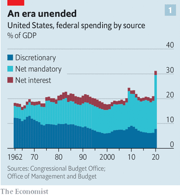  
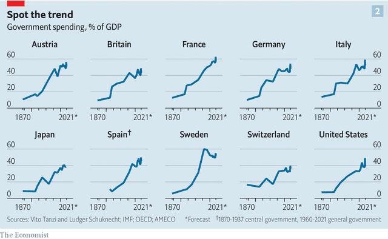  
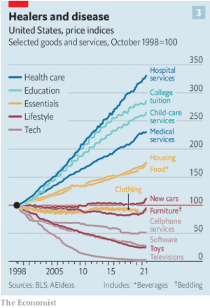  

### 6. Europe
#### 6.1 [Aux larmes, citoyens!](https://www.economist.com/europe/france-is-doing-well-but-feeling-miserable/21806329)
**France**  
Blame a looming election, the structure of the state and an innate Gallic gloom  
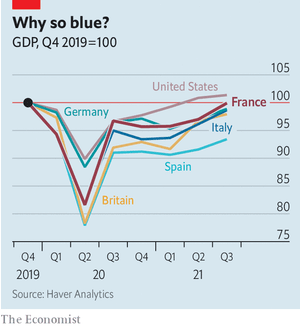  

#### 6.2 [Borderline case](https://www.economist.com/europe/2021/11/18/the-eus-stand-off-with-belarus-is-complicating-its-row-with-poland)
**Poland and Belarus**  
The EU wants to help Poland with a migrant crisis while punishing it for judicial abuses  

#### 6.3 [Caucasian degeneration](https://www.economist.com/europe/2021/11/18/near-death-in-jail-georgias-former-president-defies-its-current-one)
**Georgia**  
Mikheil Saakashvili has been on hunger strike for six weeks  

#### 6.4 [Atomic jitters](https://www.economist.com/europe/2021/11/20/allies-fear-germanys-incoming-government-will-go-soft-on-nukes)
**Nuclear weapons in Germany**  
What will happen to the nuclear bombs deployed there?  

#### 6.5 [Permanent partition?](https://www.economist.com/europe/2021/11/18/putting-cyprus-together-may-be-impossible)
**Cyprus**  
Hopes fade for a solution to Europe’s longest frozen conflict  

#### 6.6 [Marx brothers](https://www.economist.com/europe/2021/11/18/last-of-the-commies)
**Charlemagne**  
Local politics, force of habit and canny strategy help Europe’s communists cling on  

### 7. Britain
#### 7.1 [The dead of winter](https://www.economist.com/britain/2021/11/20/the-nhs-faces-a-bleak-winter)
**Emergency care**  
Hospitals are in a dire state—and temperatures are only just starting to drop  
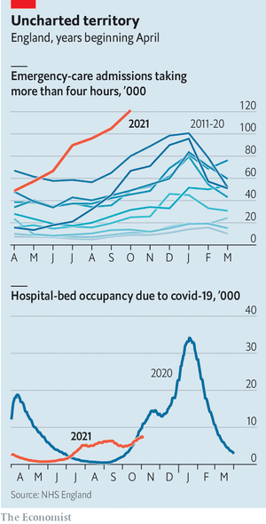  

#### 7.2 [Just not cricket](https://www.economist.com/britain/2021/11/20/azeem-rafiq-claims-anti-asian-abuse-is-widespread-in-english-cricket)
**Racism in sport**  
Allegations made to a parliamentary committee may spark a wider reckoning  

#### 7.3 [Blue light](https://www.economist.com/britain/2021/11/18/british-indians-are-emerging-as-an-important-group-of-swing-voters)
**Asian swing voters**  
But domestic issues trump foreign affairs  

#### 7.4 [All change](https://www.economist.com/britain/2021/11/20/britains-economy-does-not-lack-oomph-but-productivity-is-lagging)
**The economy**  
Post-furlough labour-market data offers grounds for hope, but more investment is needed  
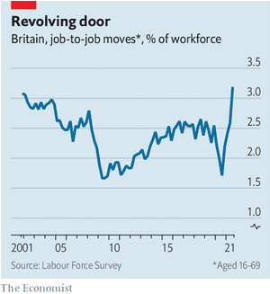  

#### 7.5 [What’s in a name?](https://www.economist.com/britain/2021/11/18/britains-inequalities-are-spelt-out-in-its-surnames)
**Social mobility**  
Shapley, Evershed and Charter are among the most fortunate  
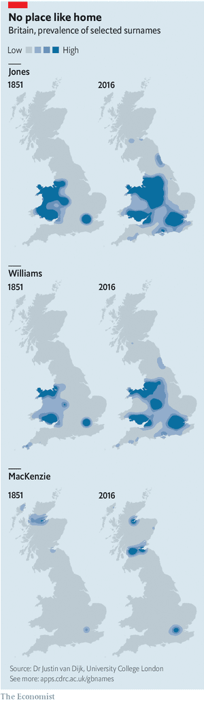  

#### 7.6 [On the dock](https://www.economist.com/britain/2021/11/20/the-government-wants-to-ensure-that-tax-breaks-for-freeports-arent-wasted)
**Place-based policy**  
That makes them more complicated and potentially less fair  
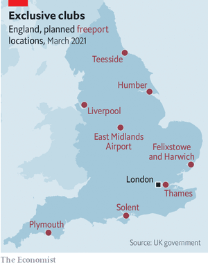  

#### 7.7 [Who runs the country?](https://www.economist.com/britain/2021/11/20/britains-establishment-has-split-into-two-each-convinced-it-is-the-underdog)
**Bagehot**  
The result is extremism, and juvenile squabbling  

### 8. Middle East & Africa
#### 8.1 [Sahel in a handbasket](https://www.economist.com/middle-east-and-africa/why-the-war-against-jihadists-in-mali-is-going-badly/21806350)
**Jihadism in Africa**  
Dysfunctional politics is exacerbating poor security  
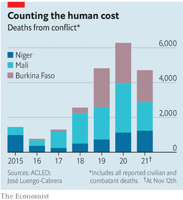  
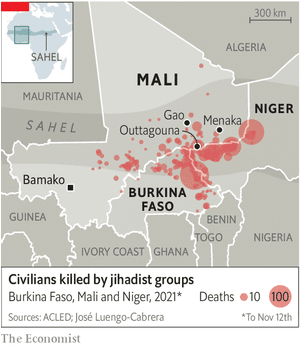  

#### 8.2 [Whodunnit?](https://www.economist.com/middle-east-and-africa/2021/11/18/a-string-of-bombings-is-rattling-uganda)
**Uganda and Islamic State**  
Is the Islamic State responsible?  

#### 8.3 [Spies against crime](https://www.economist.com/middle-east-and-africa/2021/11/18/the-murder-rate-rises-among-arab-israelis)
**Israel**  
The government is sending in more police, who are not always welcome  

#### 8.4 [Bad smells everywhere](https://www.economist.com/middle-east-and-africa/2021/11/20/tunisia-gets-violent-over-landfills)
**Tunisia**  
Corruption over rubbish collection is undermining the government  

#### 8.5 [Pitch darkness](https://www.economist.com/middle-east-and-africa/2021/11/20/even-football-has-become-mired-in-lebanons-political-and-economic-crises)
**Football in Lebanon**  
The country is struggling to hold World Cup qualifiers amid power cuts and ruined stadiums  

### 9. United States
#### 9.1 [Scott free](https://www.economist.com/united-states/mackenzie-scott-is-shaking-up-the-world-of-giving/21806331)
**Philanthropy**  
But America’s champion philanthropist operates like a middle-class donor  
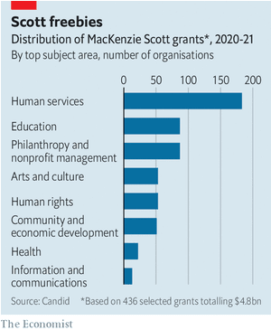  

#### 9.2 [Provoking questions](https://www.economist.com/united-states/2021/11/20/the-trial-of-kyle-rittenhouse-shows-americas-divide-over-guns)
**The Rittenhouse trial**  
This will not be the last tense trial on the topic of self-defence  

#### 9.3 [Answered prayers](https://www.economist.com/united-states/2021/11/20/americas-catholic-schools-are-seeing-a-surprising-rise-in-enrolment)
**Schools**  
Despite empty pews and sexual-abuse scandals, Catholic education is increasing in popularity  

#### 9.4 [Rich in experience](https://www.economist.com/united-states/2021/11/20/puerto-rico-success-story)
**Puerto Rico and covid-19**  
How an impoverished, battered island handled covid-19 better than the US  

#### 9.5 [Spending and voting](https://www.economist.com/united-states/2021/11/18/will-democrats-be-rewarded-for-spending-lots-of-money)
**Politics**  
The precedents suggest not  

#### 9.6 [Drug deals](https://www.economist.com/united-states/2021/11/20/democrats-have-a-plan-to-lower-drug-costs-without-hurting-innovation)
**Health care**  
The party’s latest legislative proposal would bring the cost of medication more in line with the rest of the world  
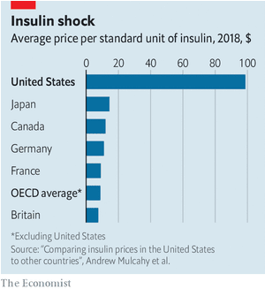  

#### 9.7 [Pete Buttigieg’s impossible job](https://www.economist.com/united-states/2021/11/18/pete-buttigiegs-impossible-job)
**Lexington**  
The secretary of transportation is a Democratic star. But fixing the roads won’t make Joe Biden popular  

### 10. The Americas
#### 10.1 [Pole positions](https://www.economist.com/the-americas/2021/11/18/chiles-presidential-election-is-a-contest-between-extremes)
**Chile**  
Do voters worry more about crime and immigration, or about inequality and poor public services?  
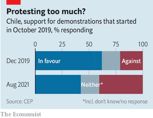  

#### 10.2 [Chilly reception](https://www.economist.com/the-americas/2021/11/18/chile-makes-life-harder-for-immigrants)
**Migrants in Chile**  
Venezuelans are having a tough time. Haitians have it worse  

#### 10.3 [Cuba’s government smothers a planned nationwide protest](https://www.economist.com/the-americas/2021/11/18/cubas-government-squelches-a-planned-nationwide-protest)
**A rose, but no uprising**  
A pro-democracy movement hopes to fight another day  

#### 10.4 [The ambiguities of Peronism](https://www.economist.com/the-americas/2021/11/18/will-electoral-defeat-favour-moderation-in-argentina)
**Bello**  
The ambiguities of Peronism  

### 11. Asia
#### 11.1 [The embrace of the motherland](https://www.economist.com/asia/2021/11/20/chinese-propagandists-court-south-east-asias-chinese-diaspora)
**South-East Asia’s info-wars**  
They are winning converts for China’s worldview  

#### 11.2 [Succession](https://www.economist.com/asia/2021/11/20/philippine-president-dutertes-daughter-spurns-him-and-his-job)
**Philippine politics**  
But she still has her eyes on a powerful role  

#### 11.3 [A dangerous addiction](https://www.economist.com/asia/2021/11/20/the-indian-governments-addiction-to-subsidies-has-dire-effects)
**Indian government subsidies**  
Delhi’s poisonous air is just one of them  
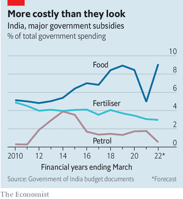  

#### 11.4 [A matter of some pride](https://www.economist.com/asia/2021/11/18/support-for-gay-rights-in-japan-is-gaining-momentum)
**LGBT in Japan**  
But conservative politicians in the ruling party are blocking progress  

#### 11.5 [Bear with them](https://www.economist.com/asia/2021/11/20/russia-moves-with-a-new-swagger-in-south-east-asia)
**Banyan**  
But its regional influence remains limited  

### 12. China
#### 12.1 [Soaking it up](https://www.economist.com/china/2021/11/18/to-prevent-floods-china-is-building-sponge-cities)
**Flood-proofing cities**  
After decades of ill-planned growth, urban areas are being retrofitted to prevent disasters  

#### 12.2 [The grey walls of China](https://www.economist.com/china/2021/11/18/chinese-officials-help-to-cultivate-a-local-graffiti-scene)
**Street art**  
Street art has a devoted following, but is not as edgy as graffiti in Western cities  

#### 12.3 [A Sino-American ice age](https://www.economist.com/china/talks-between-xi-jinping-and-joe-biden-do-not-herald-a-thaw/21806328)
**Chaguan**  
The two presidents spoke about managing dangerous tensions, but an ice age looms  

### 13. International
#### 13.1 [Out of reach?](https://www.economist.com/international/2021/11/20/the-glasgow-summit-left-a-huge-hole-in-the-worlds-plans-to-curb-climate-change)
**After COP26**  
But it did agree a mechanism to fill it in  
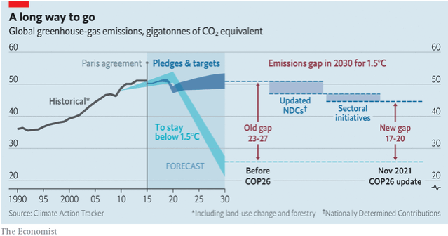  

### 14. Business
#### 14.1 [The Party capitalists](https://www.economist.com/business/chinas-communist-authorities-reinvent-state-capitalism/21806311)
**Business in China**  
Its growth model is at risk  
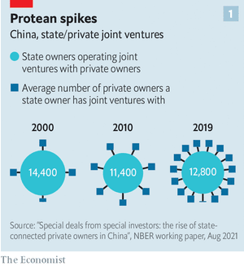  
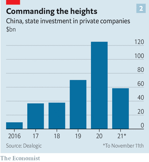  

#### 14.2 [A simple solution](https://www.economist.com/business/2021/11/20/shell-mulls-a-breakup)
**Royal Dutch Shell**  
The oil major is looking for a less taxing energy transition  

#### 14.3 [The business phrasebook](https://www.economist.com/business/2021/11/20/the-business-phrasebook)
**Bartleby**  
A short guide to what your colleagues really mean  

#### 14.4 [Monet, Manet, Money](https://www.economist.com/business/2021/11/20/an-auction-at-sothebys-raises-676m)
**The art market**  
The art market is changing  

#### 14.5 [If you build it](https://www.economist.com/business/the-video-game-industry-has-metaverse-ambitions-too/21806341)
**The metaverse architects**  
Where the tech titans have money, the games industry has experience  

#### 14.6 [Chugging along](https://www.economist.com/business/2021/11/20/times-are-good-for-american-railways)
**American railways**  
Supply-chain snags are driving up profits  
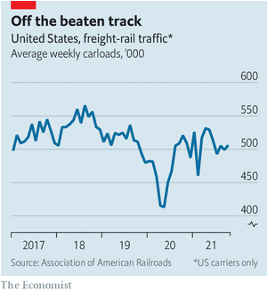  

#### 14.7 [Walmart gets its bite back](https://www.economist.com/business/2021/11/20/walmart-gets-its-bite-back)
**Schumpeter**  
The Beast of Bentonville still has Amazon on its tail  

#### 14.8 [Wanted: a new senior business writer](https://www.economist.com/business/2021/11/18/wanted-a-new-senior-business-writer)
**We're hiring**  
  

### 15. Finance & economics
#### 15.1 [Material clout](https://www.economist.com/finance-and-economics/china-seeks-to-extend-its-clout-in-commodity-markets/21806324)
**China and commodities**  
Aside from its big appetite for energy and metals, it is also opening up to international traders  
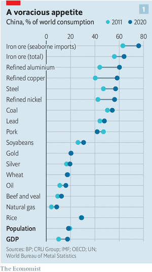  
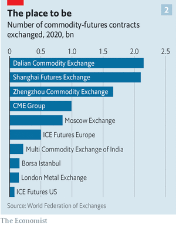  

#### 15.2 [Houdini economics](https://www.economist.com/finance-and-economics/2021/11/20/germany-grapples-with-weird-ways-to-dodge-its-debt-brake)
**Investment in Germany**  
The constitutional ceiling on borrowing is inspiring all sorts of wheezes  
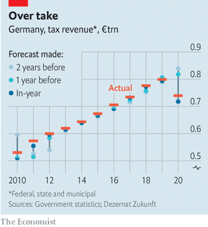  

#### 15.3 [Land of the falling price](https://www.economist.com/finance-and-economics/2021/11/20/the-case-of-the-curiously-quiescent-inflation-rate)
**Inflation**  
As consumer prices rise across much of the world, inflation in Japan stays stubbornly low  
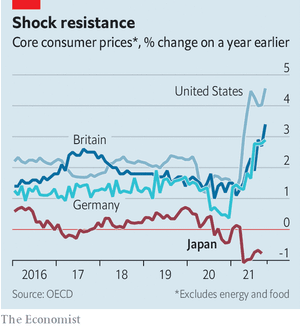  

#### 15.4 [Success and succession](https://www.economist.com/finance-and-economics/baillie-gifford-and-the-three-quandaries-of-fund-management/21806330)
**Buttonwood**  
A visionary British investment house has had a stellar run. Can that continue?  

#### 15.5 [Patch-up job](https://www.economist.com/finance-and-economics/2021/11/20/as-housing-costs-rocket-governments-take-aim-at-large-investors)
**House prices**  
  

#### 15.6 [Lifting off](https://www.economist.com/finance-and-economics/2021/11/20/frequent-flyer-schemes-provide-airlines-with-a-lifeline)
**Frequent-flyer schemes**  
  

#### 15.7 [Lost promise](https://www.economist.com/finance-and-economics/2021/11/20/the-violence-in-ethiopia-imperils-an-impressive-growth-record)
**Ethiopia’s growth model**  
  

#### 15.8 [The inbetweener](https://www.economist.com/finance-and-economics/2021/11/20/janos-kornai-understood-capitalism-by-studying-its-opposite)
**Free exchange**  
  

### 16. Science & technology
#### 16.1 [Reservoir dogs. And cats. And buffalo…](https://www.economist.com/science-and-technology/hidey-holes-for-sars-cov-2-1/21806334)
**Covid-19**  
  

#### 16.2 [When theories go belly up](https://www.economist.com/science-and-technology/can-an-upset-gut-microbiome-cause-autism/21806337)
**Autism**  
  

#### 16.3 [Fragmentation grenade](https://www.economist.com/science-and-technology/2021/11/18/a-russian-anti-satellite-missile-test-puts-the-iss-in-peril)
**ASATs and the ISS**  
  

### 17. Books & arts
#### 17.1 [The less accused](https://www.economist.com/books-and-arts/2021/11/20/far-right-ideas-are-gaining-a-renewed-respectability-in-france)
**French nationalism**  
They have a deep and troubling history  

#### 17.2 [Mechanical minds](https://www.economist.com/books-and-arts/2021/11/20/henry-kissinger-and-eric-schmidt-take-on-ai)
**Artificial intelligence**  
The statesman and Google’s former boss issue a salutary warning about the future  

#### 17.3 [The seven-day itch](https://www.economist.com/books-and-arts/2021/11/20/how-the-seven-day-week-came-to-rule-the-world)
**Marking time**  
A new book shows how modern cities embraced the weekly rhythm  

#### 17.4 [Brave new worlds](https://www.economist.com/books-and-arts/2021/11/20/the-travails-and-bold-aims-of-the-guggenheim-abu-dhabi)
**The Guggenheim Abu Dhabi**  
It intends to retell the story of modernism  

### 18. Economic & financial indicators
#### 18.1 [Economic data, commodities and markets](https://www.economist.com/economic-and-financial-indicators/2021/11/20/economic-data-commodities-and-markets)
  

### 19. Graphic detail
#### 19.1 [An Immensa cock-up](https://www.economist.com/graphic-detail/2021/11/20/botched-covid-19-test-results-in-britain-led-to-thousands-of-extra-cases)
**Covid-19 testing**  
A new study shows that each false negative results in 0.6-1.6 subsequent reported infections  
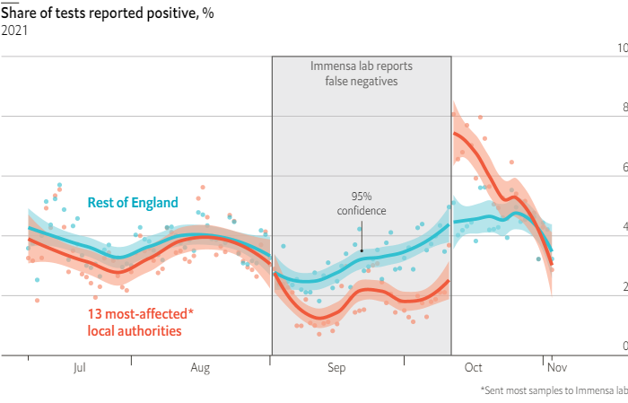  
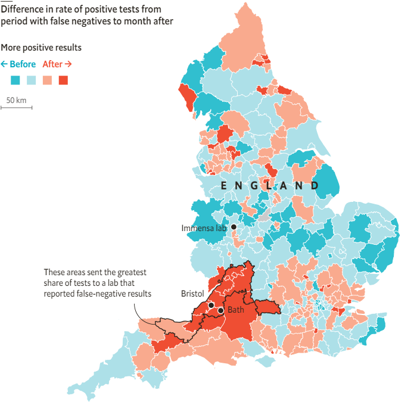  
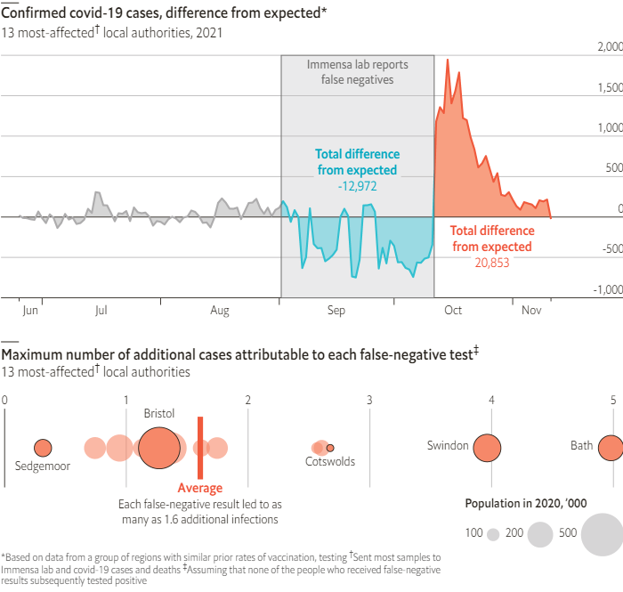  

### 20. Obituary
#### 20.1 [Builder and dismantler](https://www.economist.com/obituary/2021/11/20/fw-de-klerk-had-to-abandon-what-his-ancestors-had-believed-in)
**F.W. de Klerk**  
The last president of apartheid South Africa died on November 11th, aged 85  

