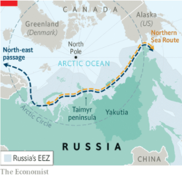
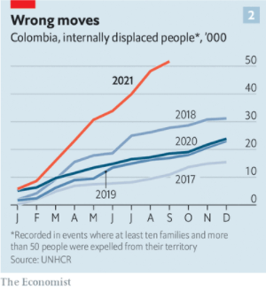
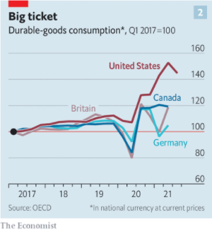

### 1. The world this week
#### 1.1 [Politics](https://www.economist.com/the-world-this-week/2021/11/27/politics)
  

#### 1.2 [Business](https://www.economist.com/the-world-this-week/2021/11/27/business)
  

#### 1.3 [KAL’s cartoon](https://www.economist.com/the-world-this-week/2021/11/27/kals-cartoon)
  

### 2. The world this week
#### 2.1 [Politics](https://www.economist.com/the-world-this-week/2021/11/27/politics)
  

#### 2.2 [Business](https://www.economist.com/the-world-this-week/2021/11/27/business)
  

#### 2.3 [KAL’s cartoon](https://www.economist.com/the-world-this-week/2021/11/27/kals-cartoon)
  

### 3. Leaders
#### 3.1 [Adventure capitalism](https://www.economist.com/leaders/2021/11/27/adventure-capitalism)
**Technology investing**  
The venture-capital industry is being supersized. Good  

#### 3.2 [March of the midsized menaces](https://www.economist.com/leaders/2021/11/25/why-medium-sized-autocracies-are-projecting-more-hard-power-abroad)
**Geopolitics**  
And why this is alarming  

#### 3.3 [Green shift](https://www.economist.com/leaders/germanys-new-government-holds-great-promise/21806456)
**Germany**  
It will need luck, too  

#### 3.4 [Winter wave](https://www.economist.com/leaders/2021/11/27/how-europe-should-deal-with-covid-19)
**Covid-19 in Europe**  
A fourth surge is causing panic and muddled thinking  

#### 3.5 [Heir today, gone tomorrow?](https://www.economist.com/leaders/2021/11/27/for-indias-opposition-to-recover-the-gandhis-should-quit)
**Indian politics**  
Single-family dominance repels talent from the Congress party  

### 4. Letters
#### 4.1 [Assisted dying, covid-19, Franco-Swiss trains, animal rights](https://www.economist.com/letters/2021/11/27/letters-to-the-editor)
**Letters to the editor**  
A selection of correspondence  

### 5. Briefing
#### 5.1 [The menace of midsized meddlers](https://www.economist.com/briefing/2021/11/27/as-america-retreats-regional-rogues-are-on-the-rise)
**Geopolitics**  
Smaller menaces are throwing their weight around more brazenly than ever before  
  

### 6. Europe
#### 6.1 [All systems go](https://www.economist.com/europe/2021/11/27/olaf-scholzs-coalition-prepares-to-take-office-in-germany)
**Germany’s next government**  
What to expect from the new three-party government  

#### 6.2 [The fourth wave](https://www.economist.com/europe/2021/11/27/a-surge-of-deadly-covid-cases-in-europe-is-met-by-popular-fury-over-lockdowns)
**Covid-19 in Europe**  
Compulsory vaccination may become more common  
  

#### 6.3 [Poseidon’s jewels](https://www.economist.com/europe/2021/11/27/riches-lie-below-the-waters-of-russias-arctic)
**Russia**  
Exploiting them could harm the environment  
  

#### 6.4 [Console sisters](https://www.economist.com/europe/2021/11/27/e-sports-are-trying-to-encourage-more-women-to-compete)
**Video games**  
For now, all the top players are male  

#### 6.5 [The Franco-Italian job](https://www.economist.com/europe/2021/11/25/a-new-treaty-between-france-and-italy-upends-eu-politics)
**Charlemagne**  
Paris and Rome, once at loggerheads, now agree on migration, defence and more  

### 7. Britain
#### 7.1 [Desperate measures](https://www.economist.com/britain/a-mass-drowning-exposes-how-britain-fails-to-manage-migrants/21806457)
**Immigration**  
Voters hate seeing small boats wash up on the Kent coast. But politicians have few feasible options  

#### 7.2 [Hard cases](https://www.economist.com/britain/2021/11/27/medical-cannabis-is-allowed-in-britain-for-children-with-epilepsy)
**Medical cannabis**  
But three years after the law changed, they cannot get it  

#### 7.3 [A power in the land](https://www.economist.com/britain/2021/11/27/britains-competition-regulator-is-beefing-up)
**Brexit and regulation (1)**  
Brexit is only one factor  

#### 7.4 [Is “adequate” good enough?](https://www.economist.com/britain/2021/11/27/looser-digital-rules-could-damage-not-help-britains-tech-sector)
**Brexit and regulation (2)**  
Attempts to do better than the European Union are probably not worthwhile  

#### 7.5 [Back to the barricades](https://www.economist.com/britain/2021/11/27/paul-dacre-scourge-of-the-establishment-returns-to-its-bosom)
**The press**  
The veteran editor is back at the Daily Mail, with more power than before  

#### 7.6 [Criminally under-policed](https://www.economist.com/britain/2021/11/25/scams-and-fraud-are-criminally-under-policed-in-britain)
**Mass fraud**  
Press 1 to be connected  
  

#### 7.7 [Some modest proposals](https://www.economist.com/britain/2021/11/27/boris-johnson-should-pick-fights-with-conservative-institutions)
**Bagehot**  
How to fix Britain by reforming public schools, the City and the House of Lords  

### 8. Middle East & Africa
#### 8.1 [Picking their shots](https://www.economist.com/middle-east-and-africa/2021/11/27/should-africa-make-covid-19-vaccination-a-priority)
**Health care in Africa**  
Other public-health problems are crying out for attention  
  

#### 8.2 [Zapping the rap](https://www.economist.com/middle-east-and-africa/2021/11/25/congos-government-has-banned-songs-that-annoy-it)
**Music censorship in Congo**  
President Tshisekedi is averse to adverse verse  

#### 8.3 [Coup de grâce](https://www.economist.com/middle-east-and-africa/2021/11/25/the-army-tightens-its-grip-on-sudans-political-transition)
**Sudan**  
A post-coup deal leaves the generals with yet more power  
  

#### 8.4 [Slouching towards an exit](https://www.economist.com/middle-east-and-africa/2021/11/25/saudi-arabia-cannot-find-a-way-out-of-yemen)
**The war in Yemen**  
The Saudi-led coalition’s withdrawal from a key port underscores its struggles  
  

#### 8.5 [Hacked off](https://www.economist.com/middle-east-and-africa/2021/11/25/a-lawsuit-from-apple-piles-pain-on-nso-group)
**Israel and NSO Group**  
A controversial purveyor of hacking software is beleaguered  

### 9. United States
#### 9.1 [In tech we don’t trust](https://www.economist.com/united-states/2021/11/27/joe-bidens-tech-policy-is-becoming-clearer)
**Biden’s technology policy**  
The administration is pushing back harder against big tech than anyone expected  

#### 9.2 [Worms v virus](https://www.economist.com/united-states/2021/11/27/ivermectin-may-help-covid-19-patients-but-only-those-with-worms)
**Treatment for covid-19**  
An anti-parasitic drug, touted as a miracle cure, helped people get better, but only in places with lots of parasites  
  

#### 9.3 [Seasonal spread](https://www.economist.com/united-states/2021/11/24/thanksgiving-is-bound-to-cause-a-spike-in-americas-covid-infections/21806439)
**Covid-19 and Thanksgiving**  
Blame resistance to getting jabbed and a lack of home testing  

#### 9.4 [Crime and punishment](https://www.economist.com/united-states/the-killers-of-ahmaud-arbery-are-found-guilty/21806458)
**The murder of Ahmaud Arbery**  
A jury delivers a verdict against vigilante justice  

#### 9.5 [Reaping what you sow](https://www.economist.com/united-states/2021/11/27/maines-new-right-to-food-could-sprout-legal-challenges)
**Food rules**  
But supporters of the new law claim that it gives Mainers more ownership of the food supply  

#### 9.6 [Clashing at the clinics](https://www.economist.com/united-states/2021/11/27/clashes-at-americas-abortion-clinics-are-getting-noisier)
**Anti-abortion protests**  
The daily confrontations ahead of a battle in the Supreme Court  

#### 9.7 [The new tree army](https://www.economist.com/united-states/2021/11/27/joe-biden-wants-to-revive-fdrs-conservation-corps)
**A Civilian Climate Corps**  
To understand what a climate workforce could actually achieve, look to Colorado  

### 10. The Americas
#### 10.1 [Still armed, still dangerous](https://www.economist.com/the-americas/2021/11/27/five-years-after-colombias-peace-deal-militias-continue-to-cause-havoc)
**Colombia**  
Government bungling and political chaos encourage lawlessness  
  
  
  
  

#### 10.2 [Waiting for the tourists to return](https://www.economist.com/the-americas/2021/11/27/latin-america-waits-for-tourists-to-return)
**Bello**  
Until they do, economies will limp  

### 11. Asia
#### 11.1 [With enemies like these](https://www.economist.com/asia/2021/11/27/narendra-modis-secret-weapon-a-useless-opposition)
**Indian politics**  
A weak Congress party and disunited smaller opponents keep the BJP in power  
  

#### 11.2 [A dictator’s demise](https://www.economist.com/asia/2021/11/24/chun-doo-hwans-brutal-rule-left-south-korea-scarred/21806440)
**South Korean history**  
Yet it has also revived a debate about the legacy of military rule  

#### 11.3 [Globalising discontent](https://www.economist.com/asia/2021/11/27/antipodean-anti-vaxxers-are-learning-from-americas-far-right)
**Covid-19 protests**  
They are staging noisy protests, waving Trump flags and threatening politicians  

#### 11.4 [No way out](https://www.economist.com/asia/2021/11/27/scammers-are-preying-on-afghans-desperate-to-leave-their-country)
**Migration scams**  
They promise safe passage to Western countries for a few thousand dollars  

#### 11.5 [Oh no, it’s UMNO](https://www.economist.com/asia/2021/11/27/malaysias-sleaziest-ex-prime-minister-najib-razak-is-back)
**Banyan**  
A bellwether poll augurs well for Mr $700m  

#### 11.6 [How green was my valley](https://www.economist.com/asia/2021/11/27/ladakhs-pashmina-goat-rearing-nomads-are-dwindling)
**Climate change and emigration**  
Climate change and emigration are making already harsh lives even harder  

### 12. China
#### 12.1 [The West’s allure](https://www.economist.com/china/2021/11/25/chinas-globetrotting-students-are-getting-back-on-the-road)
**Education abroad**  
But Western universities worry that their numbers may dwindle  

#### 12.2 [Shout it from the rooftops](https://www.economist.com/china/2021/11/25/beijing-has-lots-of-birds-but-few-birdwatchers)
**Birdwatching**  
New technology may help to monitor its huge diversity of species  

#### 12.3 [The silencing of a tennis star](https://www.economist.com/china/what-peng-shuai-reveals-about-one-party-rule/21806441)
**Chaguan**  
When a tennis star accuses a grandee of assault, China has no answer  

### 13. International
#### 13.1 [Goodbye darkness, my old friend](https://www.economist.com/international/2021/11/25/vast-satellite-constellations-are-alarming-astronomers)
**Astronomers v satellites**  
They get in the way of the cosmos  
  
  

### 14. Business
#### 14.1 [Renaissance](https://www.economist.com/business/tech-investors-cant-get-enough-of-europes-fizzing-startup-scene/21806435)
**European entrepreneurs**  
After a long slumber, Europe’s animal spirits are stirring  
  
  

#### 14.2 [Tim’s troubles](https://www.economist.com/business/2021/11/27/kkr-bids-for-telecom-italia-in-a-mammoth-private-equity-deal)
**European telecoms**  
The buyout would be the biggest ever of its kind in Europe  
  

#### 14.3 [Managing the Great Resignation](https://www.economist.com/business/2021/11/27/how-to-manage-the-great-resignation)
**Bartleby**  
High staff churn is here to stay. Retention strategies require a rethink  

#### 14.4 [Reloaded](https://www.economist.com/business/2021/11/27/american-bullet-manufacturers-race-to-relieve-a-pandemic-triggered-ammo-shortage)
**The firearms industry**  
Soaring demand for guns and ammunition comes from a range of demographic groups  

#### 14.5 [iMac, iPhone, iRepair](https://www.economist.com/business/2021/11/27/as-devices-morph-into-services-what-is-ownership)
**Electronic waste**  
Apple has performed a U-turn on customers’ right to fix its products after purchase  

#### 14.6 [Back from the USSR](https://www.economist.com/business/2021/11/27/vietnam-has-produced-a-new-class-of-billionaire-entrepreneurs)
**Vietnamese tycoons**  
The renaming of an Oxford college is just one sign of their clout  
  

#### 14.7 [Booming M&A is smashing records](https://www.economist.com/business/2021/11/27/booming-m-and-a-is-smashing-records)
**Party hearty**  
  

#### 14.8 [In the flesh](https://www.economist.com/business/2021/11/27/decoupling-is-the-last-thing-on-business-leaders-minds)
**Schumpeter**  
Even as America and China have turned inwards, interdependency remains the dominant theme  

### 15. Finance & economics
#### 15.1 [The next stage](https://www.economist.com/finance-and-economics/2021/11/23/the-bright-new-age-of-venture-capital/21806438)
**Venture capital**  
The business of funding disruptive businesses is booming—and is itself being disrupted  
  
  

#### 15.2 [Still in the hot seat](https://www.economist.com/finance-and-economics/2021/11/27/what-jerome-powell-must-do-next-as-fed-chairman)
**The Federal Reserve**  
He will face a crowded agenda in his second term  

#### 15.3 [Homegrown headache](https://www.economist.com/finance-and-economics/american-inflation-global-phenomenon-or-homegrown-headache/21806433)
**Inflation in America**  
It is wrong to deny that fiscal and monetary stimulus have helped cause the problem  
  
  

#### 15.4 [Going for broke](https://www.economist.com/finance-and-economics/erdogans-zany-monetary-experiment-is-impoverishing-turkey/21806459)
**Erdogan v markets**  
The Turkish president is at war with the markets  
  

#### 15.5 [Full tilt](https://www.economist.com/finance-and-economics/2021/11/27/why-the-bond-market-has-become-jumpier)
**Buttonwood**  
Vanishing liquidity and crowded trades are two sides of the same coin  

#### 15.6 [A universe of worry](https://www.economist.com/finance-and-economics/2021/11/27/measuring-the-universes-most-important-sector)
**Free exchange**  
Is property really 29% of China’s GDP?  

### 16. Science & technology
#### 16.1 [The great, late James Webb Space Telescope](https://www.economist.com/science-and-technology/2021/11/23/a-new-eye-on-the-heavens)
**Astronomy**  
A long-delayed telescope will soon soar into the heavens  
  
  

### 17. Books & arts
#### 17.1 [Grab and go](https://www.economist.com/books-and-arts/2021/11/27/in-preparing-for-disasters-museums-face-tough-choices)
**Safeguarding art**  
Making “grab lists” forces institutions to rank and value their holdings  

#### 17.2 [Plane wrong](https://www.economist.com/books-and-arts/2021/11/27/a-new-book-explains-the-tragic-failure-of-boeings-737-max)
**Aviation**  
It recounts how an engineering powerhouse succumbed to the beancounters  

#### 17.3 [A whole new world](https://www.economist.com/books-and-arts/2021/11/27/a-new-english-version-of-the-arabian-nights-is-the-first-by-a-woman)
**Scheherazade’s revenge**  
A classic of world literature gets an overdue makeover  

#### 17.4 [A kind of blue](https://www.economist.com/books-and-arts/2021/11/27/environments-can-affect-language-just-not-how-you-think)
**Johnson**  
No, the Inuit do not have hundreds of words for snow  

### 18. Economic & financial indicators
#### 18.1 [Economic data, commodities and markets](https://www.economist.com/economic-and-financial-indicators/2021/11/25/economic-data-commodities-and-markets)
  

### 19. Graphic detail
#### 19.1 [Social distan-sting](https://www.economist.com/graphic-detail/2021/11/27/just-like-modern-humans-honeybees-avoid-each-other-amid-plagues)
**Disease control**  
They segregate behaviours in different parts of their hives to prevent parasites from spreading  
  
  

### 20. Obituary
#### 20.1 [The girl in red](https://www.economist.com/obituary/2021/11/27/rossana-banti-fought-to-free-italy-with-laughter-as-well-as-weapons)
**Rossana Banti**  
The “ragazza terribile” of the Partisan resistance died on October 4th, aged 96  

