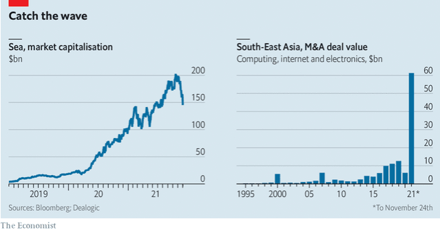

### 1. The world this week
### 2. The world this week
### 3. Leaders
#### 3.1 [Danger ahead](https://www.economist.com/leaders/2021/12/04/what-the-omicron-variant-means-for-the-world-economy)
**The world economy**  
Omicron amplifies three dangers that stalk the global economy  

#### 3.2 [SALT in the wounds](https://www.economist.com/leaders/2021/12/04/the-democrats-fiscal-policy-makes-a-mockery-of-their-progressive-pledges)
**Build Back Better**  
The Democrats’ fiscal policy makes a mockery of their progressive pledges  
  

#### 3.3 [Local heroes](https://www.economist.com/leaders/2021/12/04/for-vibrant-competitive-internet-businesses-look-to-emerging-markets)
**Technology**  
For vibrant, competitive internet businesses, look to emerging markets  
  

#### 3.4 [Bad medicine](https://www.economist.com/leaders/2021/12/04/britains-proposal-to-ban-conversion-therapy-is-not-what-it-seems)
**Sex and gender**  
Britain’s planned ban on conversion therapy is not what it seems  

#### 3.5 [Who will police Interpol?](https://www.economist.com/leaders/2021/12/04/who-will-police-interpol)
**Global crime**  
The election of a worrying new president is just the latest thing to go wrong  

### 4. Letters
#### 4.1 [On Kyle Rittenhouse, Centerra Gold, housing, social mobility, London’s bridges, business speak](https://www.economist.com/letters/2021/12/04/letters-to-the-editor)
**Letters to the editor**  

### 5. Briefing
#### 5.1 [Watchful waiting](https://www.economist.com/briefing/2021/12/04/omicron-looks-ominous-how-bad-is-it-likely-to-be)
**The Omicron variant**  
With its wonky spike, the Omicron variant looks ominous. How bad will it be?  
  
  
  

### 6. Europe
#### 6.1 [The tests of tolerance](https://www.economist.com/europe/2021/12/04/spain-needs-immigrants-but-does-it-still-want-them)
**Spain**  
  

#### 6.2 [Accenting the negative](https://www.economist.com/europe/2021/12/04/linguistic-trivia-highlight-spains-enduring-cultural-divisions)
**Language in Spain**  

#### 6.3 [Waiting for the freeze](https://www.economist.com/europe/the-ukrainian-army-has-got-better-at-fighting-russian-backed-separatists/21806546)
**Ukraine and Russia**  
  

#### 6.4 [High-pressure umbrage](https://www.economist.com/europe/2021/12/04/nord-stream-2-could-still-sabotage-german-american-relations)
**German-American relations**  

#### 6.5 [Guess who?](https://www.economist.com/europe/2021/12/04/might-silvio-berlusconi-become-the-next-president-of-italy)
**Italy’s next president**  

#### 6.6 [On bullshit: Brussels edition](https://www.economist.com/europe/why-bullshit-rules-in-brussels/21806565)
**Charlemagne**  

### 7. Britain
#### 7.1 [Missing the mark](https://www.economist.com/britain/2021/12/04/a-proposed-bill-on-conversion-therapy-could-do-more-harm-than-good)
**Conversion therapy**  

#### 7.2 [Open book](https://www.economist.com/britain/2021/12/04/britains-chief-spook-sees-china-as-the-main-intelligence-threat)
**Spycraft**  

#### 7.3 [Portrait of a Brexiteer](https://www.economist.com/britain/2021/12/04/to-understand-lord-frost-is-to-understand-britains-approach-to-brexit)
**Lord Frost**  

#### 7.4 [Catching up on the capital](https://www.economist.com/britain/2021/12/04/britains-rental-market-is-hottest-outside-london)
**Property**  
  

#### 7.5 [Straws in the wind](https://www.economist.com/britain/2021/12/04/many-more-hong-kongers-are-thinking-about-moving-to-britain)
**Immigration**  
  

#### 7.6 [United, across the border](https://www.economist.com/britain/2021/12/04/the-quest-for-respectability-and-votes-has-transformed-sinn-fein)
**Sinn Fein**  

#### 7.7 [Jordan Peterson and the lobster](https://www.economist.com/britain/2021/12/04/jordan-peterson-and-the-lobster)
**Bagehot**  

### 8. Middle East & Africa
#### 8.1 [Omicro-aggressions](https://www.economist.com/middle-east-and-africa/travel-bans-and-the-omicron-variant-are-hurting-southern-africa/21806542)
**The Omicron variant**  
  

#### 8.2 [Seeding the cloud](https://www.economist.com/middle-east-and-africa/2021/12/04/data-centres-are-taking-root-in-africa)
**African tech**  
  

#### 8.3 [Pomp and circumspection](https://www.economist.com/middle-east-and-africa/2021/12/02/africas-ties-to-china-and-the-west-are-starting-to-look-more-alike)
**China and Africa**  

#### 8.4 [In need of water, not uranium](https://www.economist.com/middle-east-and-africa/as-nuclear-talks-resume-iran-is-rattled-by-protests-over-water/21806553)
**Iran**  

#### 8.5 [Drinking and driving](https://www.economist.com/middle-east-and-africa/2021/12/04/will-an-f1-race-mark-the-end-of-saudi-arabias-ban-on-alcohol)
**Booze in Saudi Arabia**  

### 9. United States
#### 9.1 [A tax plan for the upper, upper class](https://www.economist.com/united-states/2021/12/04/the-buried-boon-to-the-wealthy-in-the-democrats-tax-plan)
**State-and-local-tax deduction**  
  

#### 9.2 [Message in a bottle](https://www.economist.com/united-states/2021/12/04/fixing-the-lead-pipe-problem-in-benton-harbor-and-across-america)
**Tainted water**  

#### 9.3 [Shot spotty](https://www.economist.com/united-states/2021/12/04/are-gunshot-detecting-microphones-worth-the-money)
**Crime tech**  

#### 9.4 [Roe’s last stand](https://www.economist.com/united-states/the-supreme-court-seems-ready-to-scrap-the-constitutional-right-to-abortion/21806567)
**Abortion rights**  

#### 9.5 [All at sea](https://www.economist.com/united-states/2021/12/04/america-wants-a-stronger-navy-to-face-china-can-it-build-one)
**Navy shipyards**  

#### 9.6 [Beep beep, bang bang](https://www.economist.com/united-states/2021/12/04/as-americans-get-back-into-their-cars-road-rage-shootings-are-spiking)
**Guns and cars**  
  

#### 9.7 [Son of a slave](https://www.economist.com/united-states/2021/12/04/a-racial-history-lesson-from-the-son-of-a-slave)
**Lexington**  

### 10. The Americas
#### 10.1 [Missing links](https://www.economist.com/the-americas/2021/12/04/mexico-could-benefit-from-chinas-exclusion-from-supply-chains)
**Mexico**  
  

#### 10.2 [A leftward turn](https://www.economist.com/the-americas/2021/12/04/honduras-looks-to-elect-its-first-female-president)
**Honduras**  

#### 10.3 [Pictures at two exhibitions](https://www.economist.com/the-americas/2021/12/04/politicians-are-sparring-over-colonial-history-in-latin-america)
**Bello**  

### 11. Asia
#### 11.1 [The patter of fewer tiny feet](https://www.economist.com/asia/2021/12/02/indias-population-will-start-to-shrink-sooner-than-expected)
**India’s population**  
  

#### 11.2 [Ready for take-off?](https://www.economist.com/asia/2021/12/02/an-election-in-kyrgyzstan-is-cleaner-than-usual)
**Politics in Kyrgyzstan**  

#### 11.3 [A stop in the ocean](https://www.economist.com/asia/2021/12/04/busan-a-south-korean-city-plans-a-floating-neighbourhood)
**Seasteading**  

#### 11.4 [At the sharp end](https://www.economist.com/asia/2021/12/04/japans-small-businesses-are-in-trouble)
**Business in Japan**  
  

#### 11.5 [A familiar script](https://www.economist.com/asia/2021/12/04/chinese-influence-is-spurring-violence-in-the-solomon-islands)
**Banyan**  

### 12. China
#### 12.1 [Against the tide](https://www.economist.com/china/2021/12/04/single-mums-in-china-want-the-same-treatment-as-married-ones)
**Unmarried mothers**  

#### 12.2 [Ballsy](https://www.economist.com/china/2021/12/04/womens-tennis-takes-a-stand-against-china)
**Sport and human rights**  

#### 12.3 [Why China says it is a democracy](https://www.economist.com/china/2021/12/04/china-says-it-is-more-democratic-than-america)
**Chaguan**  

### 13. International
#### 13.1 [Interpolitics](https://www.economist.com/international/2021/12/04/a-tussle-for-control-of-interpol-pits-good-cops-against-bad)
**Global crime**  

### 14. Business
#### 14.1 [Hot tropics](https://www.economist.com/business/grabs-upcoming-40bn-nasdaq-listing-is-a-key-test-for-asian-tech/21806548)
**Asian tech firms**  
  

#### 14.2 [Exiting the Twittersphere](https://www.economist.com/business/jack-dorsey-goes-square-leaving-twitter-at-a-time-of-his-choosing/21806545)
**Social media**  

#### 14.3 [The office of the future](https://www.economist.com/business/2021/12/04/the-office-of-the-future)
**Bartleby**  

#### 14.4 [Ghosts of Christmas past](https://www.economist.com/business/2021/12/04/how-streaming-killed-the-christmas-charts)
**The music business**  
  

#### 14.5 [Cancel culture, Beijing-style](https://www.economist.com/business/communist-party-cancel-culture-targets-internet-celebrities/21806541)
**Internet censorship**  

#### 14.6 [Billion-dollar blueprints](https://www.economist.com/business/2021/12/04/a-new-way-of-understanding-the-high-but-elusive-worth-of-intellectual-property)
**Valuing patents**  
  

#### 14.7 [No more tears](https://www.economist.com/business/2021/12/04/can-johnson-and-johnson-put-the-taint-of-scandal-behind-it)
**Schumpeter**  

### 15. Finance & economics
#### 15.1 [Omicronomics](https://www.economist.com/finance-and-economics/chinas-economy-looks-especially-vulnerable-to-the-spread-of-omicron/21806564)
**China’s slowdown**  
  
  

#### 15.2 [Hazards ahead](https://www.economist.com/finance-and-economics/three-threats-to-the-global-economic-recovery/21806535)
**Emerging markets**  
  
  

#### 15.3 [Squeezing the balloon](https://www.economist.com/finance-and-economics/2021/12/04/how-piecemeal-carbon-pricing-affects-cross-border-lending)
**Climate finance**  
  

#### 15.4 [Over flows](https://www.economist.com/finance-and-economics/2021/12/04/india-inches-towards-inclusion-in-big-bond-indices)
**Investment in India**  

#### 15.5 [After the flood](https://www.economist.com/finance-and-economics/2021/12/04/have-spacs-been-cleaned-up)
**Buttonwood**  

#### 15.6 [Point of low returns?](https://www.economist.com/finance-and-economics/2021/12/04/managing-the-worlds-biggest-sovereign-wealth-fund-is-about-to-get-complicated)
**Norges Bank Investment Management**  
  

#### 15.7 [Taming wildcats](https://www.economist.com/finance-and-economics/2021/12/04/the-explosion-in-stablecoins-revives-a-debate-around-free-banking)
**Free exchange**  

### 16. Science & technology
#### 16.1 [Flipping heck!](https://www.economist.com/science-and-technology/how-to-generate-better-cheaper-more-abundant-random-numbers/21806558)
**Random numbers**  

#### 16.2 [The memory of water](https://www.economist.com/science-and-technology/to-find-the-origin-of-the-oceans-look-in-outer-space/21806551)
**Planetology**  

#### 16.3 [The memory of water](https://www.economist.com/science-and-technology/to-find-the-origin-of-the-oceans-look-in-outer-space/21806551)
**Planetology**  

#### 16.4 [Through a glass, brightly](https://www.economist.com/science-and-technology/unbreakable-phone-screens-could-be-made-with-a-new-material/21806552)
**Mobile phones**  

#### 16.5 [Whirly birds are go](https://www.economist.com/science-and-technology/hybrid-power-will-make-helicopters-safer-and-more-productive/21806550)
**Electric flight**  

#### 16.6 [A nasty sting](https://www.economist.com/science-and-technology/2021/12/04/sleeping-sickness-and-its-kin-may-have-arrived-via-beehives)
**Trypanosomes**  

### 17. Books & arts
#### 17.1 [The rice bowl’s tale](https://www.economist.com/books-and-arts/2021/12/04/an-ancient-rice-bowl-complicates-the-story-of-civilisation-in-india)
**The politics of history**  

#### 17.2 [Stations of the cross](https://www.economist.com/books-and-arts/2021/12/04/a-war-correspondents-intimate-portrait-of-an-embattled-minority)
**Embattled minorities**  

#### 17.3 [A long and winding ode](https://www.economist.com/books-and-arts/2021/12/04/sir-paul-mccartneys-memoir-aims-to-affirm-his-status-as-a-writer)
**The Beatles**  

#### 17.4 [Message in a bottle](https://www.economist.com/books-and-arts/2021/12/04/the-forgotten-importance-of-the-war-of-jenkins-ear)
**Forgotten wars**  

#### 17.5 [Two faces of a star](https://www.economist.com/books-and-arts/2021/12/04/a-biographer-explores-greta-garbos-glamour-and-vacuity)
**Cinema royalty**  

### 18. Economic & financial indicators
#### 18.1 [Economic data, commodities and markets](https://www.economist.com/economic-and-financial-indicators/2021/12/02/economic-data-commodities-and-markets)

### 19. Graphic detail
#### 19.1 [“Levelling up” at gunpoint](https://www.economist.com/graphic-detail/2021/12/04/how-regions-near-stalins-gulag-benefit-today-from-his-victims)
**The gulag**  
  
  

### 20. Obituary
#### 20.1 [Keep moving on](https://www.economist.com/obituary/2021/12/04/stephen-sondheim-wanted-to-explore-a-new-world-every-time)
**Stephen Sondheim**  

