### 1. The world this week
#### 1.1 [Politics](https://www.economist.com/the-world-this-week/2021/12/09/politics)
  

#### 1.2 [Business](https://www.economist.com/the-world-this-week/2021/12/09/business)
  

#### 1.3 [KAL’s cartoon](https://www.economist.com/the-world-this-week/2021/12/11/kals-cartoon)
  

### 2. Leaders
#### 2.1 _What would America fight for?:_ [If the United States pulls back, the world will become more dangerous](https://www.economist.com/leaders/2021/12/11/if-the-united-states-pulls-back-the-world-will-become-more-dangerous)  
Other democracies must start preparing  

#### 2.2 _Power off the money printer:_ [America’s economy needs tighter monetary policy](https://www.economist.com/leaders/americas-economy-needs-tighter-monetary-policy/21806694)  
Why the Fed should raise interest rates soon  
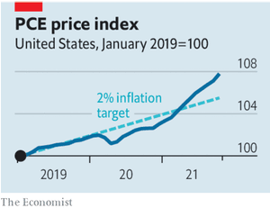  

#### 2.3 _Ageing creatively:_ [What the world can learn from Japan](https://www.economist.com/leaders/2021/12/11/what-the-world-can-learn-from-japan)  
The oldest big country has lessons for those that will soon age and shrink  

#### 2.4 _Global finance:_ [China courts global capital, on its own terms](https://www.economist.com/leaders/2021/12/11/china-courts-global-capital-on-its-own-terms)  
It is looking to reduce its dependency on the West, while increasing the West’s dependency on it  

#### 2.5 _Plugging the gap:_ [The tricky business of charging electric cars](https://www.economist.com/leaders/2021/12/11/the-tricky-business-of-charging-electric-cars)  
Building public networks will require business and government to work together  
  

### 3. Letters
#### 3.1 _On the size of government, nuclear power, chess, Afghanistan, past tenses:_ [Letters to the editor](https://www.economist.com/letters/2021/12/11/letters-to-the-editor)  
A selection of correspondence  

### 4. Europe
#### 4.1 _Enter the quiet man:_ [The challenges facing Olaf Scholz as Germany’s chancellor](https://www.economist.com/europe/the-challenges-facing-olaf-scholz-as-germanys-chancellor/21806676)  
Managing a three-party coalition will test his powers of patience and persuasion  

#### 4.2 _Dame de fer:_ [“Two-thirds Merkel, one-third Thatcher”: meet Valérie Pécresse](https://www.economist.com/europe/2021/12/09/two-thirds-merkel-one-third-thatcher-meet-valerie-pecresse)  
The French Republican nominee could beat Emmanuel Macron  
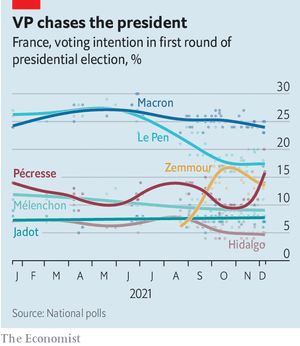  

#### 4.3 _Diplomacy with menaces:_ [Joe Biden adopts a tough new tone with Vladimir Putin](https://www.economist.com/europe/joe-biden-adopts-a-tough-new-tone-with-russia/21806675)  
But will it be enough to avert another Russian invasion of Ukraine?  
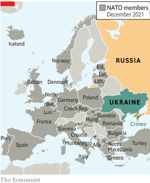  

#### 4.4 _Poldering on:_ [The Dutch style of government: good for dykes, bad for covid](https://www.economist.com/europe/2021/12/11/the-dutch-style-of-government-good-for-dykes-bad-for-covid)  
The Netherlands’ consensual “polder model” moves too slowly in a crisis  

#### 4.5 _Charlemagne:_ [Angela Merkel, the invisible European](https://www.economist.com/europe/2021/12/11/angela-merkel-the-invisible-european)  
The legacy of Europe’s most powerful leader is already fading away  

### 5. Britain
#### 5.1 _The revolution stalls:_ [Behind the chaos and scandal of Boris Johnson’s government lies stasis](https://www.economist.com/britain/behind-the-chaos-and-scandal-of-boris-johnsons-government-lies-stasis/21806682)  
Two years after a famous election victory, a would-be radical administration has run into the ground  
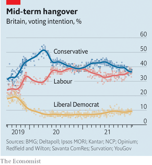  

#### 5.2 _Cost drivers:_ [A court bashes Uber into compliance—again](https://www.economist.com/britain/2021/12/11/a-court-bashes-uber-into-compliance-again)  
The latest blow may mean vast bill for back taxes  

#### 5.3 _Underlying issues:_ [For the clinically vulnerable, “Freedom Day” has yet to arrive](https://www.economist.com/britain/2021/12/09/for-the-clinically-vulnerable-freedom-day-has-yet-to-arrive)  
When will those who have spent 21 months isolating be able to mingle freely again?  

#### 5.4 _Dual carriageway:_ [Britain is liberalising its listing rules to revive its battered bourse](https://www.economist.com/britain/2021/12/09/britain-is-liberalising-its-listing-rules-to-revive-its-battered-bourse)  
Companies with dual-class shares will find it easier to raise equity funding  

#### 5.5 _Bigger inside:_ [Nostalgia and the profit motive have created a market in old phone kiosks](https://www.economist.com/britain/2021/12/11/nostalgia-and-the-profit-motive-have-created-a-market-in-old-phone-kiosks)  
But BT, Britain’s former telecoms monopoly, is not happy  

#### 5.6 _Santa’s little helpers:_ [The robots are gathering to help beat Britain’s supply-chain shortages](https://www.economist.com/britain/2021/12/09/the-robots-are-gathering-to-help-beat-britains-supply-chain-shortages)  
Building automated warehouses  

#### 5.7 _Bagehot:_ [Britain’s new suburbs are peculiar places](https://www.economist.com/britain/2021/12/11/britains-new-suburbs-are-peculiar-places)  
They resemble neither American suburbs nor older British ones  

### 6. Middle East & Africa
#### 6.1 _Naturalised selection:_ [The Gulf states offer citizenship to a select group of foreigners](https://www.economist.com/middle-east-and-africa/2021/12/09/the-gulf-states-offer-citizenship-to-a-select-group-of-foreigners)  
Give us your doctors, your inventors, your huddled scientists  

#### 6.2 _Fratricidal tendencies:_ [The Muslim Brotherhood is tearing itself apart](https://www.economist.com/middle-east-and-africa/2021/12/09/the-muslim-brotherhood-is-tearing-itself-apart)  
Two leaders vie for control of the oldest Islamist movement  

#### 6.3 _All the president’s promises:_ [Congo’s president has not kept his word](https://www.economist.com/middle-east-and-africa/2021/12/09/congos-president-has-not-kept-his-word)  
From free schools to peace in the east, Félix Tshisekedi has failed to deliver  
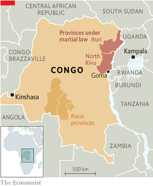  

#### 6.4 _Taking the helm:_ [Africans are winning top jobs at international institutions](https://www.economist.com/middle-east-and-africa/2021/12/11/africans-are-winning-top-jobs-at-international-institutions)  
Until recently, the continent had been largely sidelined  

### 7. United States
#### 7.1 _Money for something:_ [What congressional funding reveals about America’s military priorities](https://www.economist.com/united-states/2021/12/11/what-congressional-funding-reveals-about-americas-military-priorities)  
Members are happy to fund hardware, but reluctant to let the Department of Defence make cuts  

#### 7.2 _SPAC-handed:_ [Donald Trump’s media SPAC is the zeitgeist wrapped in a complex financial instrument](https://www.economist.com/united-states/2021/12/11/donald-trumps-media-spac-is-the-zeitgeist-wrapped-in-a-complex-financial-instrument)  
It is also, fittingly, under the investigation of the SEC  

#### 7.3 _Church and chalk:_ [The Supreme Court seems ready to poke a hole in the church-state wall](https://www.economist.com/united-states/2021/12/09/the-supreme-court-seems-ready-to-poke-a-hole-in-the-church-state-wall)  
Government funding for religious schools gets a high-court hearing  

#### 7.4 _Man it does show signs of stopping:_ [Late snowfall in the American West is part of pattern](https://www.economist.com/united-states/2021/12/11/late-snowfall-in-the-american-west-is-part-of-pattern)  
By mid-century, the Pacific states could lose much of their snowpack  
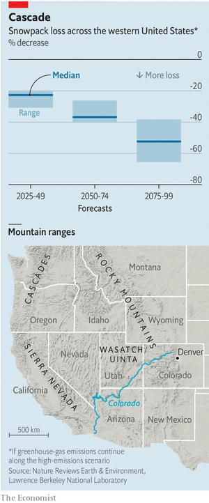  

#### 7.5 _Sunset clauses and budgeting:_ [The Democrats use a loophole to mask the cost of Joe Biden’s big bill](https://www.economist.com/united-states/2021/12/11/the-democrats-use-a-loophole-to-mask-the-cost-of-joe-bidens-big-bill)  
They are following a Republican precedent but making it even messier  

#### 7.6 _To rent or not to rent:_ [How landlords thwart America’s attempts to house poor people](https://www.economist.com/united-states/2021/12/11/how-landlords-thwart-americas-attempts-to-house-poor-people)  
It is one thing to receive a housing voucher and quite another to successfully use it  

#### 7.7 _Lexington:_ [How the culture wars can show what’s right with America](https://www.economist.com/united-states/2021/12/11/how-the-culture-wars-can-show-whats-right-with-america)  
The arguments over statues matter more than the statues themselves  

### 8. Briefing
#### 8.1 _A weary superpower:_ [The world that the West built after Pearl Harbour is cracking](https://www.economist.com/briefing/what-will-america-fight-for/21806660)  
Not least because America is lukewarm about preserving it  
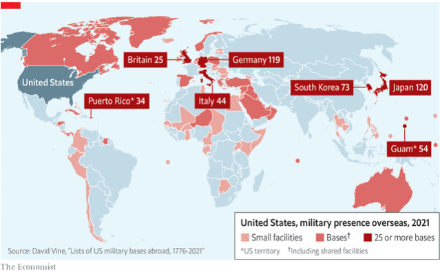  

### 9. The Americas
#### 9.1 _A salt and batteries:_ [How Bolivian lithium could help fight climate change](https://www.economist.com/the-americas/how-bolivian-lithium-could-help-fight-climate-change/21806677)  
But the country with the world’s largest resources is still struggling to extract them  
  

#### 9.2 _Bello:_ [Despite the polls, a centrist could win Colombia’s election in May](https://www.economist.com/the-americas/2021/12/11/despite-the-polls-a-centrist-could-win-colombias-election-in-may)  
Undecided voters may shun Gustavo Petro, a populist of the left  

### 10. Asia
#### 10.1 _On a high:_ [South-East Asia is awash in drugs](https://www.economist.com/asia/2021/12/11/south-east-asia-is-awash-in-drugs)  
The coup in Myanmar has helped cartels ramp up production  

#### 10.2 _Algorithms and the law:_ [Can Facebook be blamed for pogroms against Rohingyas in Myanmar?](https://www.economist.com/asia/2021/12/09/can-facebook-be-blamed-for-pogroms-against-rohingyas-in-myanmar)  
Lawsuits in America and Britain seek billions of dollars in damages  

#### 10.3 _Sunflower state:_ [Many North Korean women outearn their husbands, but still do the chores](https://www.economist.com/asia/2021/12/09/many-north-korean-women-outearn-their-husbands-but-still-do-the-chores)  
Women trade; men do badly paid state jobs  

#### 10.4 _Tragedy in the Nilgiris:_ [Bipin Rawat, India’s chief of defence staff, is killed in a helicopter crash](https://www.economist.com/asia/bipin-rawat-indias-chief-of-defence-staff-is-killed-in-a-helicopter-crash/21806696)  
He had been tasked with reforming the country’s archaic armed forces  

#### 10.5 _Banyan:_ [Myanmar’s generals want Aung San Suu Kyi locked up forever](https://www.economist.com/asia/2021/12/11/myanmars-generals-want-aung-san-suu-kyi-locked-up-forever)  
Yet the opposition to their regime has grown far beyond its figurehead  

### 11. China
#### 11.1 _Harbouring no malice?:_ [America worries about China’s military ambitions in Africa](https://www.economist.com/china/2021/12/09/america-worries-about-chinas-military-ambitions-in-africa)  
China’s navy is eyeing the use of ports abroad, including on the Atlantic  
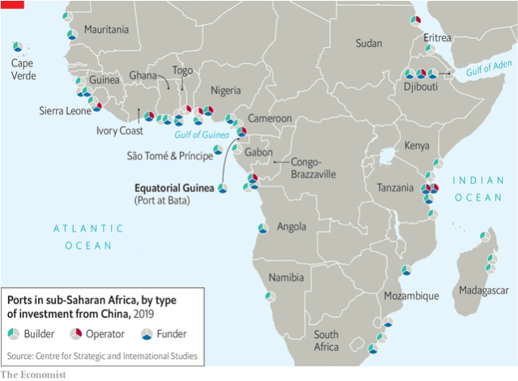  

#### 11.2 _The chips are down:_ [China wants Macau to break its gambling addiction](https://www.economist.com/china/2021/12/09/china-wants-macau-to-break-its-gambling-addiction)  
Officials are trying to stop the mainland’s high rollers from visiting  

#### 11.3 _Chaguan:_ [Beijing’s Winter Olympics may hasten China’s break with the West](https://www.economist.com/china/2021/12/11/beijings-winter-olympics-may-hasten-chinas-break-with-the-west)  
Diplomatic boycotts over human rights, plus draconian covid controls, spell trouble  

### 12. International
#### 12.1 _Car wars:_ [Politicians are sending mixed signals about private car ownership](https://www.economist.com/international/2021/12/11/politicians-are-sending-mixed-signals-about-private-car-ownership)  
National leaders are promoting it. Local ones want to curb driving  
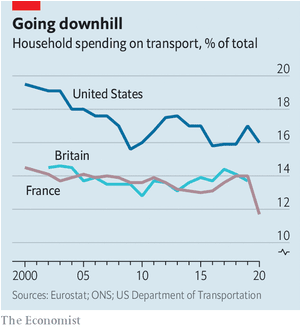  

### 13. Special report
#### 13.1 _Japan:_ [A country that is on the front line](https://www.economist.com/special-report/2021/12/07/a-country-that-is-on-the-front-line)  
Japan offers the world examples to follow as well as ones not to. It is as relevant as ever, argues Noah Sneider  

#### 13.2 _Foreign and security policy:_ [Why Japan needs more forceful defence](https://www.economist.com/special-report/2021/12/07/why-japan-needs-more-forceful-defence)  
The strong case for more active and interventionist security and defence policies  
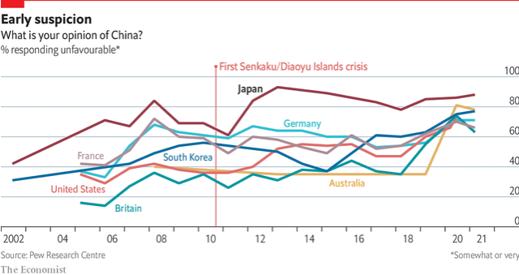  
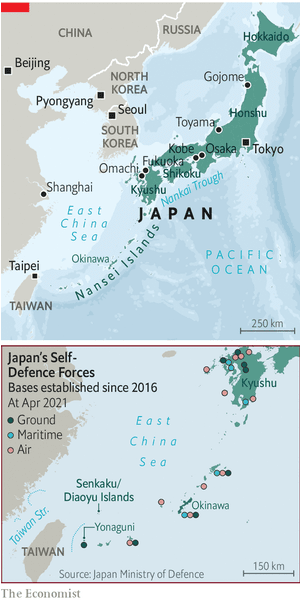  

#### 13.3 _Climate and the environment:_ [Japan has a chequered record on climate change](https://www.economist.com/special-report/2021/12/07/japan-has-a-chequered-record-on-climate-change)  
Prepared for disaster, unprepared for climate change  

#### 13.4 _Tokyo:_ [The big city that is also pleasant to live in](https://www.economist.com/special-report/2021/12/07/the-big-city-that-is-also-pleasant-to-live-in)  
Surprisingly, the world’s biggest city is also one of its most liveable  

#### 13.5 _Demography:_ [An ageing country shows others how to manage](https://www.economist.com/special-report/2021/12/07/an-ageing-country-shows-others-how-to-manage)  
Japan has aged faster than anywhere else, but it is learning how to cope  
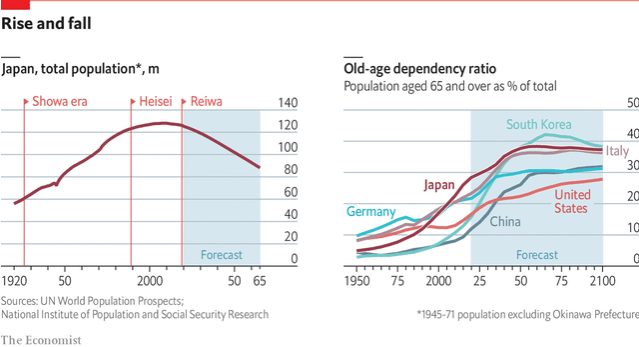  

#### 13.6 _The economy:_ [Japan’s economy is stronger than many realise](https://www.economist.com/special-report/2021/12/07/japans-economy-is-stronger-than-many-realise)  
Not bad, but could be better  
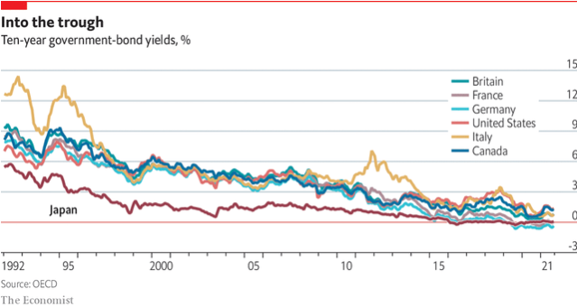  
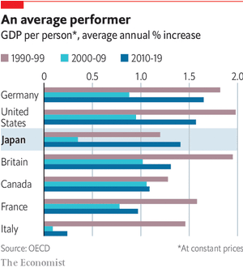  

#### 13.7 _Immigration:_ [Letting more migrants in by stealth](https://www.economist.com/special-report/2021/12/07/letting-more-migrants-in-by-stealth)  
From a low base, immigration is growing quite fast  
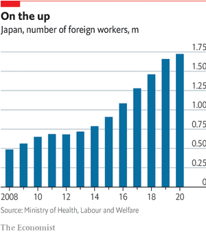  

#### 13.8 _Looking ahead:_ [The future could be brighter](https://www.economist.com/special-report/2021/12/07/the-future-could-be-brighter)  
It could be a lot better with younger and more dynamic political leaders  

#### 13.9 [Sources and acknowledgments](https://www.economist.com/special-report/2021/12/07/sources-and-acknowledgments)
  

### 14. Business
#### 14.1 _Current situation:_ [A lack of chargers could stall the electric-vehicle revolution](https://www.economist.com/business/a-lack-of-chargers-could-stall-the-electric-vehicle-revolution/21806663)  
Forget Tesla’s production hell. The hardest bit of EVs is the powering up  
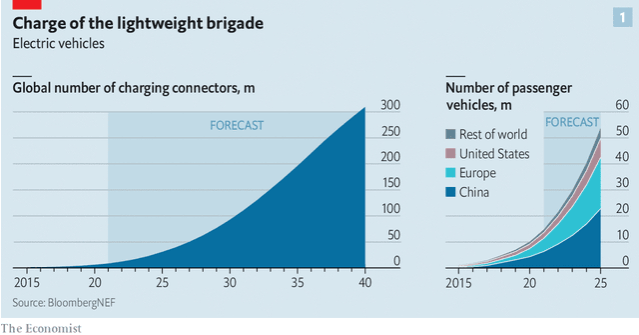  
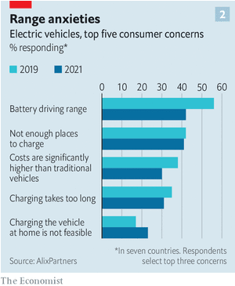  
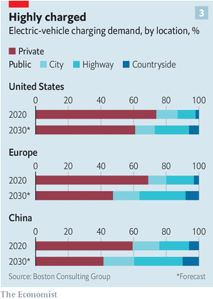  

#### 14.2 _Bartleby:_ [The shortcuts to Theranos](https://www.economist.com/business/2021/12/11/the-shortcuts-to-theranos)  
The trial of Elizabeth Holmes contains lessons for decision-makers of all kinds  

#### 14.3 _The great reallocation:_ [Want to own shares in Chinese companies?](https://www.economist.com/business/2021/12/11/want-to-own-shares-in-chinese-companies)  
Come to China  
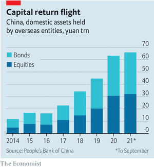  

#### 14.4 _Psyber Boom:_ [Dramatic growth in mental-health apps has created a risky industry](https://www.economist.com/business/2021/12/11/dramatic-growth-in-mental-health-apps-has-created-a-risky-industry)  
Customers’ “emotional data” can be hacked, and no one is checking if the apps work  

#### 14.5 _How can we be heroes?:_ [Why Germany is such tough terrain for food delivery](https://www.economist.com/business/2021/12/11/why-germany-is-such-tough-terrain-for-food-delivery)  
Complex labour laws, organised labour, pricey workers and stingy consumers all play a part  

#### 14.6 _Schumpeter:_ [Big business v big labour](https://www.economist.com/business/2021/12/11/big-business-v-big-labour)  
American unions are reasserting their power. American companies are working out how to respond  

### 15. Finance & economics
#### 15.1 _All mouth and no trousers:_ [Evidence for the “great resignation” is thin on the ground](https://www.economist.com/finance-and-economics/evidence-for-the-great-resignation-is-thin-on-the-ground/21806659)  
Job quits are not unusually high  
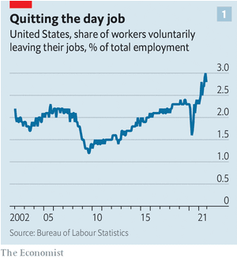  
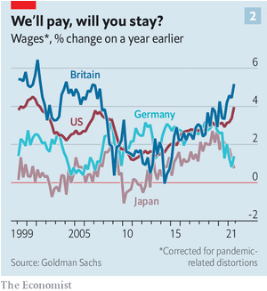  

#### 15.2 _Only disconnect:_ [The difficulties of policing remote work](https://www.economist.com/finance-and-economics/2021/12/11/the-difficulties-of-policing-remote-work)  
Why bans on after-hours calls may not work  

#### 15.3 _Giving less generously:_ [In word and deed, China is easing economic policy](https://www.economist.com/finance-and-economics/2021/12/11/in-word-and-deed-china-is-easing-economic-policy)  
Both the central bank’s actions and the Politburo’s words point to modest easing  
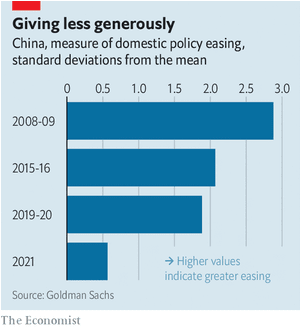  

#### 15.4 _Emergency exit:_ [Two key questions for the European Central Bank](https://www.economist.com/finance-and-economics/2021/12/11/two-key-questions-for-the-european-central-bank)  
Will inflation eventually settle at its target, and are asset purchases still useful?  
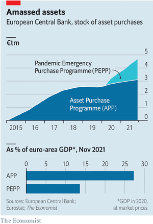  

#### 15.5 _On the rails:_ [The economics of a new China-Laos train line](https://www.economist.com/finance-and-economics/2021/12/11/the-economics-of-a-new-china-laos-train-line)  
Why connectivity matters  

#### 15.6 _Nominal sums:_ [America is seeing both fast growth and high inflation](https://www.economist.com/finance-and-economics/america-is-seeing-both-fast-growth-and-high-inflation/21806687)  
What can nominal GDP reveal about the economic recovery?  
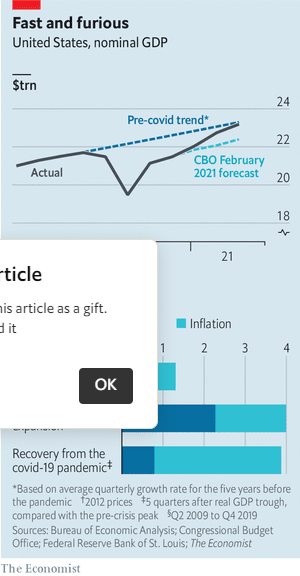  

#### 15.7 _Buttonwood:_ [Why the dollar’s ascendancy won’t last](https://www.economist.com/finance-and-economics/2021/12/11/why-the-dollars-ascendancy-wont-last)  
All it takes is a slowdown in America, lower inflation and a Fed pivot  

#### 15.8 _Crypto’s crew:_ [Crypto lobbying is going ballistic](https://www.economist.com/finance-and-economics/crypto-lobbying-is-going-ballistic/21806674)  
As regulators toughen up, companies hope to influence where the rules end up  

#### 15.9 _Free exchange:_ [Why the demographic transition is speeding up](https://www.economist.com/finance-and-economics/2021/12/11/why-the-demographic-transition-is-speeding-up)  
New research suggests “demographic contagion” could explain falling fertility rates  

### 16. Science & technology
#### 16.1 _Mouse lemurs:_ [A tiny primate may join the ranks of the world’s model organisms](https://www.economist.com/science-and-technology/a-tiny-primate-may-join-the-ranks-of-the-worlds-model-organisms/21806681)  
Lemurs may be better than mice for understanding human disease  

#### 16.2 _High-tech chickpeas:_ [Chickpeas, a neglected crop, may soon get a high-tech makeover](https://www.economist.com/science-and-technology/chickpeas-a-neglected-crop-may-soon-get-a-high-tech-makeover/21806678)  
A new genetic analysis paves the way for smart selective breeding  

#### 16.3 _Mechanical engineering:_ [How to build machines from liquid metal](https://www.economist.com/science-and-technology/how-to-build-machines-from-liquid-metal/21806680)  
Small blobs of liquid-metal alloy can replace troublesome moving parts  

#### 16.4 _Crowd behaviour:_ [What architects can learn from bull-running](https://www.economist.com/science-and-technology/what-architects-can-learn-from-bull-running/21806679)  
A Spanish tradition offers insight into how crowds behave  

### 17. Books & arts
#### 17.1 _Our books of the year:_ [The best books of 2021](https://www.economist.com/books-and-arts/2021/12/11/the-best-books-of-2021)  
Our favourite works considered God, opioids, China and cannibalism  

#### 17.2 _Staff books of the year:_ [In 2021 our writers considered technology, meritocracy and the trans debate](https://www.economist.com/books-and-arts/2021/12/11/in-2021-our-writers-considered-technology-meritocracy-and-the-trans-debate)  
Not to mention civil liberties, human cognition and the history of Athens  

### 18. Economic & financial indicators
#### 18.1 [Indicators
Economic data, commodities and markets](https://www.economist.com/economic-and-financial-indicators/2021/12/09/economic-data-commodities-and-markets)
  

### 19. Graphic detail
#### 19.1 _Mixed signals:_ [Early data on Omicron show surging cases but milder symptoms](https://www.economist.com/graphic-detail/2021/12/11/early-data-on-omicron-show-surging-cases-but-milder-symptoms)  
The variant’s capacity for reinfection appears unprecedented  
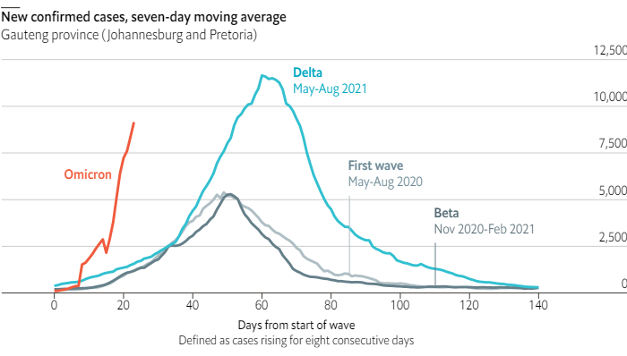  
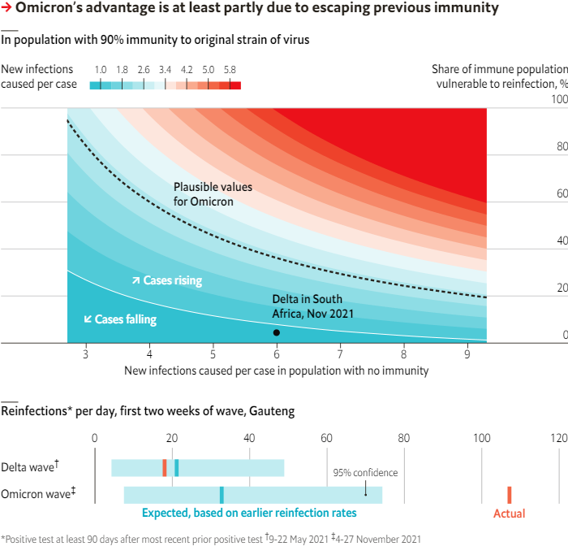  
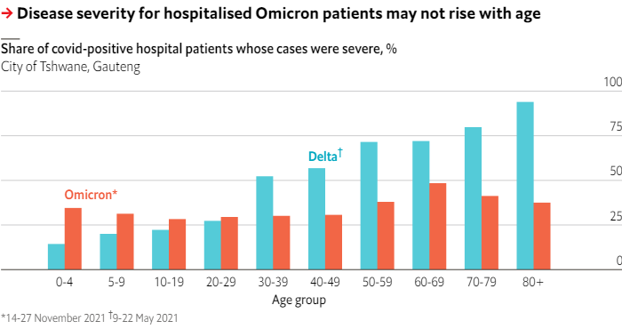  

### 20. Obituary
#### 20.1 _Climbing that hill:_ [Bob Dole believed in hard work, not words](https://www.economist.com/obituary/2021/12/09/bob-dole-believed-in-hard-work-not-words)  
The Republican leader and quintessential Kansan died on December 5th, aged 98  

