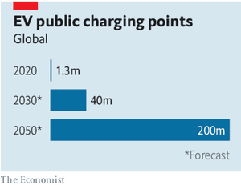
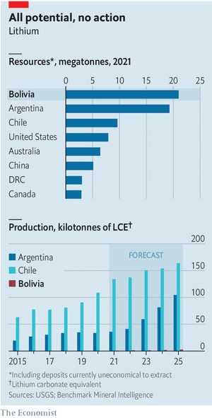

### 1. The world this week
#### 1.1 [Politics](https://www.economist.com/the-world-this-week/2021/12/09/politics)

#### 1.2 [Business](https://www.economist.com/the-world-this-week/2021/12/09/business)

#### 1.3 [KAL’s cartoon](https://www.economist.com/the-world-this-week/2021/12/11/kals-cartoon)

### 2. The world this week
#### 2.1 [Politics](https://www.economist.com/the-world-this-week/2021/12/09/politics)

#### 2.2 [Business](https://www.economist.com/the-world-this-week/2021/12/09/business)

#### 2.3 [KAL’s cartoon](https://www.economist.com/the-world-this-week/2021/12/11/kals-cartoon)

### 3. Leaders
#### 3.1 [What would America fight for?](https://www.economist.com/leaders/2021/12/11/if-the-united-states-pulls-back-the-world-will-become-more-dangerous)
**Geopolitics**  
If the United States pulls back, the world will become more dangerous  

#### 3.2 [Wind down the money printer](https://www.economist.com/leaders/americas-economy-needs-tighter-monetary-policy/21806694)
**The Federal Reserve**  
Why America’s economy needs tighter monetary policy  
  

#### 3.3 [What the world can learn from Japan](https://www.economist.com/leaders/2021/12/11/what-the-world-can-learn-from-japan)
**Adapting for the future**  
The country is not an outlier—it is a harbinger  

#### 3.4 [Asymmetric decoupling](https://www.economist.com/leaders/2021/12/11/china-courts-global-capital-on-its-own-terms)
**Global finance**  
China seeks globalisation, on its own terms  

#### 3.5 [Plugging the gap](https://www.economist.com/leaders/2021/12/11/the-tricky-business-of-charging-electric-cars)
**Charging electric cars**  
Tens of millions of electric cars will soon need charging. Here’s how to do it  
  

### 4. Letters
#### 4.1 [On the size of government, nuclear power, chess, Afghanistan, past tenses](https://www.economist.com/letters/2021/12/11/letters-to-the-editor)
**Letters to the editor**  

### 5. Europe
#### 5.1 [Enter the quiet man](https://www.economist.com/europe/the-challenges-facing-olaf-scholz-as-germanys-chancellor/21806676)
**Germany’s new chancellor**  

#### 5.2 [Dame de fer](https://www.economist.com/europe/2021/12/09/two-thirds-merkel-one-third-thatcher-meet-valerie-pecresse)
**French politics**  
  

#### 5.3 [Diplomacy with menaces](https://www.economist.com/europe/joe-biden-adopts-a-tough-new-tone-with-russia/21806675)
**Ukraine**  
  

#### 5.4 [Poldering on](https://www.economist.com/europe/2021/12/11/the-dutch-style-of-government-good-for-dykes-bad-for-covid)
**Dutch government**  

#### 5.5 [The invisible European](https://www.economist.com/europe/2021/12/11/angela-merkel-the-invisible-european)
**Charlemagne**  

### 6. Britain
#### 6.1 [The revolution stalls](https://www.economist.com/britain/behind-the-chaos-and-scandal-of-boris-johnsons-government-lies-stasis/21806682)
**Politics**  
  

#### 6.2 [Cost drivers](https://www.economist.com/britain/2021/12/11/a-court-bashes-uber-into-compliance-again)
**Ride-hailing in London**  

#### 6.3 [Underlying issues](https://www.economist.com/britain/2021/12/09/for-the-clinically-vulnerable-freedom-day-has-yet-to-arrive)
**Covid-19**  

#### 6.4 [Dual carriageway](https://www.economist.com/britain/2021/12/09/britain-is-liberalising-its-listing-rules-to-revive-its-battered-bourse)
**London Stock Exchange**  

#### 6.5 [Bigger inside](https://www.economist.com/britain/2021/12/11/nostalgia-and-the-profit-motive-have-created-a-market-in-old-phone-kiosks)
**Red telephone boxes**  

#### 6.6 [Santa’s little helpers](https://www.economist.com/britain/2021/12/09/the-robots-are-gathering-to-help-beat-britains-supply-chain-shortages)
**Logistics**  

#### 6.7 [On the frontier](https://www.economist.com/britain/2021/12/11/britains-new-suburbs-are-peculiar-places)
**Bagehot**  

### 7. Middle East & Africa
#### 7.1 [A narrow path](https://www.economist.com/middle-east-and-africa/2021/12/09/the-gulf-states-offer-citizenship-to-a-select-group-of-foreigners)
**Citizenship in the Gulf**  

#### 7.2 [Fratricidal tendencies](https://www.economist.com/middle-east-and-africa/2021/12/09/the-muslim-brotherhood-is-tearing-itself-apart)
**The Muslim Brotherhood**  

#### 7.3 [All the president’s promises](https://www.economist.com/middle-east-and-africa/2021/12/09/congos-president-has-not-kept-his-word)
**Congo**  
  

#### 7.4 [Africans at the top](https://www.economist.com/middle-east-and-africa/2021/12/11/africans-are-winning-top-jobs-at-international-institutions)
**Global governance**  

### 8. United States
#### 8.1 [Money for something](https://www.economist.com/united-states/2021/12/11/what-congressional-funding-reveals-about-americas-military-priorities)
**Defence spending**  

#### 8.2 [SPAC-handed](https://www.economist.com/united-states/2021/12/11/donald-trumps-media-spac-is-the-zeitgeist-wrapped-in-a-complex-financial-instrument)
**The media**  

#### 8.3 [Following the money in Maine](https://www.economist.com/united-states/2021/12/09/the-supreme-court-seems-ready-to-poke-a-hole-in-the-church-state-wall)
**Religious schools**  

#### 8.4 [Man it does show signs of stopping](https://www.economist.com/united-states/2021/12/11/late-snowfall-in-the-american-west-is-part-of-pattern)
**The climate**  
  

#### 8.5 [House of the rising sunset](https://www.economist.com/united-states/2021/12/11/the-democrats-use-a-loophole-to-mask-the-cost-of-joe-bidens-big-bill)
**Budgetary gymnastics**  

#### 8.6 [To rent or not to rent](https://www.economist.com/united-states/2021/12/11/how-landlords-thwart-americas-attempts-to-house-poor-people)
**Housing**  

#### 8.7 [Stone-cold killer](https://www.economist.com/united-states/2021/12/11/how-the-culture-wars-can-show-whats-right-with-america)
**Lexington**  

### 9. Briefing
#### 9.1 [A weary superpower](https://www.economist.com/briefing/what-will-america-fight-for/21806660)
**Joe Biden’s foreign policy**  
The world that the West built after the attack on Pearl Harbour is cracking, not least because America is lukewarm about preserving it  
  

### 10. The Americas
#### 10.1 [A salt and batteries](https://www.economist.com/the-americas/how-bolivian-lithium-could-help-fight-climate-change/21806677)
**Climate change**  
  

#### 10.2 [Between hope and experience](https://www.economist.com/the-americas/2021/12/11/despite-the-polls-a-centrist-could-win-colombias-election-in-may)
**Bello**  

### 11. Asia
#### 11.1 [On a high](https://www.economist.com/asia/2021/12/11/south-east-asia-is-awash-in-drugs)
**Drugs in South-East Asia**  

#### 11.2 [Accounting for algorithms](https://www.economist.com/asia/2021/12/09/can-facebook-be-blamed-for-pogroms-against-rohingyas-in-myanmar)
**Social media and the law**  

#### 11.3 [Sunflower state](https://www.economist.com/asia/2021/12/09/many-north-korean-women-outearn-their-husbands-but-still-do-the-chores)
**Married life in North Korea**  

#### 11.4 [Tragedy in the Nilgiris](https://www.economist.com/asia/bipin-rawat-indias-chief-of-defence-staff-is-killed-in-a-helicopter-crash/21806696)
**India’s chief of defence staff**  

#### 11.5 [What the generals wreak](https://www.economist.com/asia/2021/12/11/myanmars-generals-want-aung-san-suu-kyi-locked-up-forever)
**Banyan**  

### 12. China
#### 12.1 [Harbouring no malice?](https://www.economist.com/china/2021/12/09/america-worries-about-chinas-military-ambitions-in-africa)
**China in Africa**  
  

#### 12.2 [No dice for vice](https://www.economist.com/china/2021/12/09/china-wants-macau-to-break-its-gambling-addiction)
**Gambling in Macau**  

#### 12.3 [Spoil-sports](https://www.economist.com/china/2021/12/11/beijings-winter-olympics-may-hasten-chinas-break-with-the-west)
**Chaguan**  

### 13. International
#### 13.1 [Car wars](https://www.economist.com/international/2021/12/11/politicians-are-sending-mixed-signals-about-private-car-ownership)
**Transport**  
  

### 14. Special report
#### 14.1 [The new era](https://www.economist.com/special-report/2021/12/07/a-country-that-is-on-the-front-line)
**Japan**  

#### 14.2 [Into the world](https://www.economist.com/special-report/2021/12/07/why-japan-needs-more-forceful-defence)
**Foreign and security policy**  
  
  

#### 14.3 [A chequered record](https://www.economist.com/special-report/2021/12/07/japan-has-a-chequered-record-on-climate-change)
**Climate policy**  

#### 14.4 [The big city](https://www.economist.com/special-report/2021/12/07/the-big-city-that-is-also-pleasant-to-live-in)
**Tokyo**  

#### 14.5 [The old country](https://www.economist.com/special-report/2021/12/07/an-ageing-country-shows-others-how-to-manage)
**Demography**  
  

#### 14.6 [Stronger than many realise](https://www.economist.com/special-report/2021/12/07/japans-economy-is-stronger-than-many-realise)
**The economy**  
  
  

#### 14.7 [Letting them in](https://www.economist.com/special-report/2021/12/07/letting-more-migrants-in-by-stealth)
**Immigration**  
  

#### 14.8 [The future](https://www.economist.com/special-report/2021/12/07/the-future-could-be-brighter)
**Looking ahead**  

#### 14.9 [Sources and acknowledgments](https://www.economist.com/special-report/2021/12/07/sources-and-acknowledgments)

### 15. Business
#### 15.1 [Current situation](https://www.economist.com/business/a-lack-of-chargers-could-stall-the-electric-vehicle-revolution/21806663)
**Charging electric vehicles**  
  
  
  

#### 15.2 [The shortcuts to Theranos](https://www.economist.com/business/2021/12/11/the-shortcuts-to-theranos)
**Bartleby**  

#### 15.3 [The great reallocation](https://www.economist.com/business/2021/12/11/want-to-own-shares-in-chinese-companies)
**China Inc**  
  

#### 15.4 [Psyber boom](https://www.economist.com/business/2021/12/11/dramatic-growth-in-mental-health-apps-has-created-a-risky-industry)
**Digital health**  

#### 15.5 [How can we be heroes?](https://www.economist.com/business/2021/12/11/why-germany-is-such-tough-terrain-for-food-delivery)
**The gig economy**  

#### 15.6 [Big labour v big business](https://www.economist.com/business/2021/12/11/big-business-v-big-labour)
**Schumpeter**  

### 16. Finance & economics
#### 16.1 [All mouth and no trousers](https://www.economist.com/finance-and-economics/evidence-for-the-great-resignation-is-thin-on-the-ground/21806659)
**Worker power**  
  
  

#### 16.2 [Only disconnect](https://www.economist.com/finance-and-economics/2021/12/11/the-difficulties-of-policing-remote-work)
**Work and the pandemic**  

#### 16.3 [Is China easing?](https://www.economist.com/finance-and-economics/2021/12/11/in-word-and-deed-china-is-easing-economic-policy)
**Monetary policy (1)**  
  

#### 16.4 [Emergency exit](https://www.economist.com/finance-and-economics/2021/12/11/two-key-questions-for-the-european-central-bank)
**Monetary policy (2)**  
  

#### 16.5 [On the rails](https://www.economist.com/finance-and-economics/2021/12/11/the-economics-of-a-new-china-laos-train-line)
**South-East Asia**  

#### 16.6 [America is seeing both fast growth and high inflation](https://www.economist.com/finance-and-economics/america-is-seeing-both-fast-growth-and-high-inflation/21806687)
**Nominal sums**  
  

#### 16.7 [Top dollar](https://www.economist.com/finance-and-economics/2021/12/11/why-the-dollars-ascendancy-wont-last)
**Buttonwood**  

#### 16.8 [Crypto’s crew](https://www.economist.com/finance-and-economics/crypto-lobbying-is-going-ballistic/21806674)
**Digital assets**  

#### 16.9 [Family matters](https://www.economist.com/finance-and-economics/2021/12/11/why-the-demographic-transition-is-speeding-up)
**Free exchange**  

### 17. Science & technology
#### 17.1 [New Model Army](https://www.economist.com/science-and-technology/a-tiny-primate-may-join-the-ranks-of-the-worlds-model-organisms/21806681)
**Animal research**  

#### 17.2 [Chick-please](https://www.economist.com/science-and-technology/chickpeas-a-neglected-crop-may-soon-get-a-high-tech-makeover/21806678)
**Plant breeding**  

#### 17.3 [Liquid engineering](https://www.economist.com/science-and-technology/how-to-build-machines-from-liquid-metal/21806680)
**Mechanical engineering**  

#### 17.4 [Of architects and bull-running](https://www.economist.com/science-and-technology/what-architects-can-learn-from-bull-running/21806679)
**Crowd behaviour**  

### 18. Books & arts
#### 18.1 [Read all over](https://www.economist.com/books-and-arts/2021/12/11/the-best-books-of-2021)
**The best books of 2021**  

#### 18.2 [Out-of-office politics](https://www.economist.com/books-and-arts/2021/12/11/in-2021-our-writers-considered-technology-meritocracy-and-the-trans-debate)
**Staff books of 2021**  

### 19. Economic & financial indicators
#### 19.1 [Economic data, commodities and markets](https://www.economist.com/economic-and-financial-indicators/2021/12/09/economic-data-commodities-and-markets)
**Indicators**  

### 20. Graphic detail
#### 20.1 [Mixed signals](https://www.economist.com/graphic-detail/2021/12/11/early-data-on-omicron-show-surging-cases-but-milder-symptoms)
**The Omicron variant**  
  
  
  

### 21. Obituary
#### 21.1 [Climbing that hill](https://www.economist.com/obituary/2021/12/09/bob-dole-believed-in-hard-work-not-words)
**Bob Dole**  

