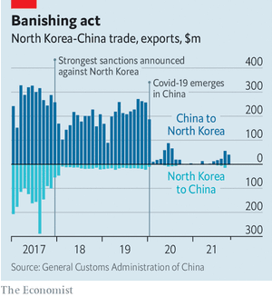
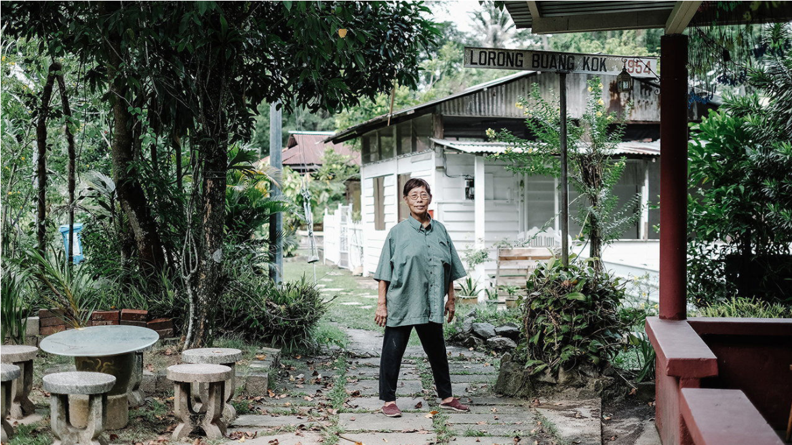
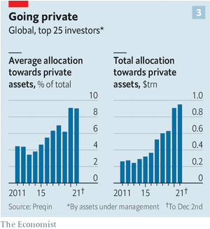

### 1. The world this week
#### 1.1 [The world this year](https://www.economist.com/the-world-this-week/2021/12/18/the-world-this-year)
  

#### 1.2 [KAL’s cartoon](https://www.economist.com/the-world-this-week/2021/12/16/kals-cartoon)
  

### 2. Leaders
#### 2.1 _The way things were:_ [The new normal is already here. Get used to it](https://www.economist.com/leaders/2021/12/18/the-new-normal-is-already-here-get-used-to-it)  
The era of predictable unpredictability is not going away  

#### 2.2 _Midterm blues:_ [Something has broken in Boris Johnson’s government](https://www.economist.com/leaders/something-has-broken-in-boris-johnsons-government/21806829)  
This week’s rebellion in Parliament is just the start of his difficulties  

#### 2.3 _From Moscow with menaces:_ [How to deter Vladimir Putin from invading Ukraine](https://www.economist.com/leaders/2021/12/18/how-to-deter-vladimir-putin-from-invading-ukraine)  
The West, and Ukrainians, should raise the cost of Russian aggression  

#### 2.4 _Asset prices:_ [How American stocks could continue to climb](https://www.economist.com/leaders/2021/12/18/how-american-stocks-could-continue-to-climb)  
What doesn’t kill the bull market only makes it stranger  

#### 2.5 _Triumphal honours:_ [Which is The Economist’s country of the year for 2021?](https://www.economist.com/leaders/2021/12/18/which-is-the-economists-country-of-the-year-for-2021)  
In a gloomy year, a few stars shone  

### 3. Letters
#### 3.1 _On Brexit, satellite pollution, local taxes, cheese, Fairphone, art, Stephen Sondheim, the Beatles:_ [Letters to the editor](https://www.economist.com/letters/2021/12/18/letters-to-the-editor)  
A selection of correspondence  

### 4. Europe
#### 4.1 _No room at the inn:_ [Why have Danes turned against immigration?](https://www.economist.com/europe/2021/12/18/why-have-danes-turned-against-immigration)  
Many fear that refugees are a drain on their welfare state  
  

#### 4.2 _The Lolland exception:_ [A Baltic island bucks a Danish anti-immigrant trend](https://www.economist.com/europe/2021/12/18/a-baltic-island-bucks-a-danish-anti-immigrant-trend)  
It has a tunnel to build  

#### 4.3 _Here come the Harvards:_ [A reformist prime minister takes over in Bulgaria](https://www.economist.com/europe/2021/12/18/a-reformist-prime-minister-takes-over-in-bulgaria)  
Alongside a fellow new broom  

#### 4.4 _Charlemagne:_ [Emmanuel Macron’s tricky Christmas present](https://www.economist.com/europe/2021/12/18/emmanuel-macrons-tricky-christmas-present)  
He must “run Europe” even as he runs for re-election as president of France  

### 5. Britain
#### 5.1 _Covid-19:_ [The triumph of the Oxford-AstraZeneca vaccine](https://www.economist.com/britain/2021/12/16/the-triumph-of-the-oxford-astrazeneca-vaccine)  
Despite setbacks, the jab has probably saved more lives than any other  
  
  

#### 5.2 _Saving Ulster:_ [Anti-gay attitudes in Northern Ireland are changing](https://www.economist.com/britain/2021/12/18/anti-gay-attitudes-in-northern-ireland-are-changing)  
Parties that support the union with Great Britain are modernising—some faster than others  

#### 5.3 _The Marble Arch mound:_ [How to lure shoppers off their computers?](https://www.economist.com/britain/2021/12/18/how-to-lure-shoppers-off-their-computers)  
With a heap of earth, apparently  

#### 5.4 _Bagehot:_ [Liz Truss declares an end to the age of introspection](https://www.economist.com/britain/2021/12/18/liz-truss-declares-an-end-to-the-age-of-introspection)  
A new foreign secretary seeks to reshape British diplomacy  

### 6. Middle East & Africa
#### 6.1 _On your marks, get set, now what?:_ [Libya’s presidential election was meant to unite the country](https://www.economist.com/middle-east-and-africa/2021/12/18/libyas-presidential-election-was-meant-to-unite-the-country)  
It is not going as planned  
  

#### 6.2 _The bitter taste of sanctions:_ [Iranian saffron dealers are struggling](https://www.economist.com/middle-east-and-africa/2021/12/18/iranian-saffron-dealers-are-struggling)  
Like all their country’s exports, their wares have been stigmatised  

#### 6.3 _Back to the mountains:_ [Ethiopian forces have recaptured key towns on the road to Tigray](https://www.economist.com/middle-east-and-africa/ethiopian-forces-have-recaptured-key-towns-on-the-road-to-tigray21806825)  
But it is far from clear that Abiy Ahmed has defeated the Tigrayan rebels  
  

### 7. United States
#### 7.1 _Movers and shakers:_ [Internal migration](https://www.economist.com/united-states/why-americans-are-rethinking-where-they-want-to-live/21806771)  
  

#### 7.2 _The long road back:_ [Kentucky’s tornado](https://www.economist.com/united-states/2021/12/18/the-tornado-damage-in-kentucky-could-take-decades-to-repair)  
  

#### 7.3 _Lexington:_ [America’s Christmas wars](https://www.economist.com/united-states/2021/12/18/americas-christmas-wars)  
Knock yourself out, Fox: Americans have vied over Christmas for centuries  

### 8. The Americas
#### 8.1 _Studying Ceará:_ [What a Brazilian state can teach the world about education](https://www.economist.com/the-americas/2021/12/18/what-a-brazilian-state-can-teach-the-world-about-education)  
Ceará offers a model for rebuilding schools after the pandemic  
  

#### 8.2 _The final stretch:_ [Chile’s presidential front-runners edge towards the centre](https://www.economist.com/the-americas/2021/12/18/chiles-presidential-front-runners-edge-towards-the-centre)  
Days before the election, candidates are moderating their radical platforms  

### 9. Asia
#### 9.1 _A decade of despair:_ [Ten years into Kim Jong Un’s rule, North Korea is more North Korean than ever](https://www.economist.com/asia/ten-years-into-kim-jong-uns-rule-north-korea-is-more-north-korean-than-ever/21806770)  
Diplomatic failure and covid-19 have prompted unprecedented self-isolation  
  

#### 9.2 _Rule of three:_ [New Caledonia votes against independence from France for the third time](https://www.economist.com/asia/2021/12/18/new-caledonia-votes-against-independence-from-france-for-the-third-time)  
A boycott by pro-independence parties results in a landslide  

#### 9.3 _Banyan:_ [Democracy declined across Asia in 2021](https://www.economist.com/asia/2021/12/18/democracy-declined-across-asia-in-2021)  
But there are ways it can revive  

### 10. China
#### 10.1 _Frigid farewells:_ [Lithuania evacuates its embassy in China](https://www.economist.com/china/lithuania-evacuates-its-embassy-in-china/21806843)  
It is the worst diplomatic crisis between China and a European state in decades  

#### 10.2 _Old and sad:_ [Nearly one-third of suicides in China are by old people](https://www.economist.com/china/2021/12/18/nearly-one-third-of-suicides-in-china-are-by-old-people)  
It can be lonely when your child has moved to a city  
  

### 11. International
#### 11.1 _Seeing the need for speed:_ [The Omicron variant advances at an incredible rate](https://www.economist.com/international/2021/12/18/the-omicron-variant-advances-at-an-incredible-rate)  
Even if infections prove mild, that speed will have grave consequences  
  

### 12. Christmas Specials
#### 12.1 _Unearthing the truth:_ [Archaeology](https://www.economist.com/christmas-specials/2021/12/18/a-zimbabwean-archaeologist-retells-the-story-of-a-civilisation)  
  

#### 12.2 _teach your children well:_ [DOES GOOD PARENTING IN HONG KONG MEAN SUBMITTING TO THE PARTY?](https://www.economist.com/christmas-specials/2021/12/18/does-good-parenting-in-hong-kong-mean-submitting-to-the-party)  
Some say no. Some say yes. And some leave  
  
  

#### 12.3 _the pleasures of the table:_ [AN ECONOMIC HISTORY OF RESTAURANTS](https://www.economist.com/christmas-specials/2021/12/18/an-economic-history-of-restaurants)  
And how the pandemic may change them  
  

#### 12.4 _gimme shelter:_ [THE RISE AND RISE OF CORRUGATED IRON](https://www.economist.com/christmas-specials/2021/12/18/the-rise-and-rise-of-corrugated-iron)  
The past and present of an unfairly ignored building material  
  
  

#### 12.5 _quadratic voting:_ [THE MATHEMATICAL METHOD THAT COULD OFFER A FAIRER WAY TO VOTE](https://www.economist.com/christmas-specials/2021/12/18/the-mathematical-method-that-could-offer-a-fairer-way-to-vote)  
It allows you to give more support to your preferred outcome  

#### 12.6 _fighting fit:_ [HOW TO PREVENT CONFLICT ON THE WAY TO MARS](https://www.economist.com/christmas-specials/2021/12/18/how-to-prevent-conflict-on-the-way-to-mars)  
Missions to the red planet will need a new breed of astronaut  
  

#### 12.7 _it takes a village:_ [SCENES FROM AN ALMOST VANISHED SINGAPORE](https://www.economist.com/christmas-specials/2021/12/18/scenes-from-an-almost-vanished-singapore)  
Holdouts in a rich country’s last rural settlement  
  
  
  
  
  

#### 12.8 _he came, he saw, he lied:_ [RETRACING JULIUS CAESAR’S PATH THROUGH FRANCE](https://www.economist.com/christmas-specials/2021/12/18/retracing-julius-caesars-path-through-france)  
And learning from his chest-thumping dishonesty  
  
  

#### 12.9 _pocock’s pen pals:_ [THE VIRTUES OF AN UNREPRESENTATIVE SAMPLE](https://www.economist.com/christmas-specials/2021/12/18/the-virtues-of-an-unrepresentative-sample)  
An epistolary history of Britain’s changing society  
  

#### 12.10 _a forced brotherhood:_ [WHY RUSSIA HAS NEVER ACCEPTED UKRAINIAN INDEPENDENCE](https://www.economist.com/christmas-specials/2021/12/18/why-russia-has-never-accepted-ukrainian-independence)  
It might have, had it chosen democracy  
  
  

#### 12.11 _the kalergi plan:_ [SONS OF TOKYO, DREAMS OF EUROPE](https://www.economist.com/christmas-specials/2021/12/18/sons-of-tokyo-dreams-of-europe)  
Two men, a century apart, contend for Europe’s future  
  

#### 12.12 _a bloodless revolution:_ [MEATLESS MEAT IS NOTHING NEW](https://www.economist.com/christmas-specials/2021/12/18/meatless-meat-is-nothing-new)  
But it is getting tastier and more popular  
  

#### 12.13 _murder of the orient express:_ [RAILWAY LINES ONCE CONNECTED THE MIDDLE EAST](https://www.economist.com/christmas-specials/2021/12/18/railway-lines-once-connected-the-middle-east)  
Now the tracks that joined continents lie in wreckage  
  
  
  
  

#### 12.14 _one woman’s trash:_ [FASHION AS AN ASSET CLASS](https://www.economist.com/christmas-specials/2021/12/18/fashion-as-an-asset-class)  
Technology has made it easy and worthwhile to sell old clothes  
  

#### 12.15 _movies:_ [INDIA’S TOURING CINEMAS ARE DYING, AND BEING REBORN](https://www.economist.com/christmas-specials/2021/12/18/indias-touring-cinemas-are-dying-and-being-reborn)  
A film-mad country is in need of more screens  
  
  

#### 12.16 _a world of two halves:_ [NORTH-SOUTH ANTIPATHIES ENDURE AROUND THE GLOBE](https://www.economist.com/christmas-specials/2021/12/18/north-south-antipathies-endure-around-the-globe)  
They are much more than a cultural curiosity  

#### 12.17 _under the hoodies:_ [THE MOST POWERFUL PEOPLE IN CRYPTO](https://www.economist.com/christmas-specials/2021/12/18/the-most-powerful-people-in-crypto)  
Four very different billionaires  
  
  
  

#### 12.18 _on the wings of song:_ [OF BIRDS AND MEN](https://www.economist.com/christmas-specials/2021/12/18/of-birds-and-men)  
How men long to be at one with the spirits of the air  
  
  
  

### 13. Business
#### 13.1 _All at sea:_ [Why supply-chain snarls still entangle the world](https://www.economist.com/business/a-return-to-container-shippings-pre-pandemic-days-is-a-long-way-off/21806844)  
Shipping delays show little sign of easing  
  
  

#### 13.2 _Plots unearthed in 2021:_ [A year in four charts](https://www.economist.com/business/2021/12/18/a-year-in-four-charts)  
Our graphics capture the big business trends of 2021  
  

#### 13.3 _Cloud atlas:_ [The battle of the computing clouds is intensifying](https://www.economist.com/business/the-battle-of-the-computing-clouds-is-intensifying/21806813)  
Insurgents take on AWS, Microsoft Azure and Google Cloud Platform  
  

#### 13.4 _Bartleby:_ [The Beatles and the art of teamwork](https://www.economist.com/business/2021/12/18/the-beatles-and-the-art-of-teamwork)  
A new documentary on the Fab Four is a must-watch for managers, too  

#### 13.5 _Schumpeter:_ [The billionaire battle for the metaverse](https://www.economist.com/business/2021/12/18/the-billionaire-battle-for-the-metaverse)  
Forget space. The race is on to take people beyond reality  

### 14. Finance & economics
#### 14.1 _Spinning around:_ [The private-markets party reaches fever pitch](https://www.economist.com/finance-and-economics/the-private-markets-party-reaches-fever-pitch/21806772)  
As valuations surge and interest-rate rises loom, can it last?  
  
  
  

#### 14.2 _SWIFT thinking:_ [The hidden costs of cutting Russia off from SWIFT](https://www.economist.com/finance-and-economics/2021/12/18/the-hidden-costs-of-cutting-russia-off-from-swift)  
America’s foes would rush to alternatives, hastening its financial decline  

#### 14.3 _Follow the money:_ [After a shocker in 2021, where might inflation go in 2022?](https://www.economist.com/finance-and-economics/2021/12/18/after-a-shocker-in-2021-where-might-inflation-go-in-2022)  
We chart two alternative paths  
  

#### 14.4 _Hidden danger:_ [China’s property slowdown sheds light on another worrying debt problem](https://www.economist.com/finance-and-economics/chinas-property-slowdown-sheds-light-on-another-worrying-debt-problem/21806824)  
Local-government financing vehicles, not just developers, are saddled with lashings of debt  
  

#### 14.5 _Free exchange:_ [Has the pandemic shown inflation to be a fiscal phenomenon?](https://www.economist.com/finance-and-economics/2021/12/18/has-the-pandemic-shown-inflation-to-be-a-fiscal-phenomenon)  
A decade of QE did not cause much inflation. Fiscal stimulus has sent it soaring  

### 15. Science & technology
#### 15.1 _Apiarism:_ [Honey bees, Varroa mites and unintended consequences](https://www.economist.com/science-and-technology/2021/12/15/honey-bees-varroa-mites-and-unintended-consequences/21806830)  
Beekeepers may have accidentally helped a plague of their charges  

#### 15.2 _Marine propulsion:_ [Nature does not use propellers. So why do people?](https://www.economist.com/science-and-technology/nature-does-not-use-propellers-so-why-do-people/21806832)  
Real fintech  

#### 15.3 _Geomagnetic archaeology:_ [Earth’s magnetic field illuminates Biblical history](https://www.economist.com/science-and-technology/earths-magnetic-field-illuminates-biblical-history/21806831)  
It casts light on an obscure period called the Hallstatt plateau  

### 16. Books & arts
#### 16.1 _Arabian lights:_ [After banning cinema for decades, Saudi Arabia is making movies](https://www.economist.com/books-and-arts/2021/12/18/after-banning-cinema-for-decades-saudi-arabia-is-making-movies)  
Breathtaking landscapes and hefty rebates are helping foreign producers overcome their culture shock  

### 17. Economic & financial indicators
#### 17.1 _Economic data, commodities and markets:_ [Indicators](https://www.economist.com/economic-and-financial-indicators/2021/12/16/economic-data-commodities-and-markets)  
  

### 18. Graphic detail
#### 18.1 _If it spreads, it’s read:_ [2021’s biggest stories were covid-19 and America’s presidential transition](https://www.economist.com/graphic-detail/2021/12/18/2021s-biggest-stories-were-covid-19-and-americas-presidential-transition)  
The online audiences of 7,000 publishers spent 275m hours reading about the year’s 45 biggest stories  

### 19. Obituary
#### 19.1 _How little Ant became big Ant:_ [Antony Sher pushed the boundaries of Shakespeare’s plays](https://www.economist.com/obituary/2021/12/18/antony-sher-pushed-the-boundaries-of-shakespeares-plays)  
The South African-born actor died on December 2nd, aged 72  

