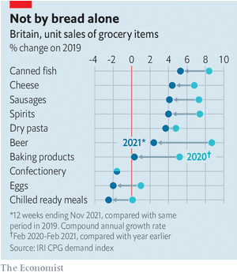
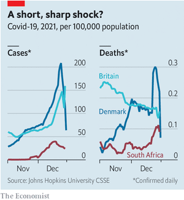

### 1. The world this week
#### 1.1 [The world this week](https://www.economist.com/the-world-this-week/2022/01/01/the-world-this-week)
  

#### 1.2 [KAL’s cartoon](https://www.economist.com/the-world-this-week/2022/01/01/kals-cartoon)
  

### 2. Leaders
#### 2.1 _Erdogan v economics:_ [Turkey’s president cannot defy reality for long](https://www.economist.com/leaders/turkeys-president-cannot-defy-reality-for-long/21806930)  
Recep Tayyip Erdogan’s scheme to save Turkey’s currency only heightens the risks  
  

#### 2.2 _Walking away:_ [How to think about the threat to American democracy](https://www.economist.com/leaders/2022/01/01/how-to-think-about-the-threat-to-american-democracy)  
The Republican Party’s continued Trump infatuation is alarming. It should not lead to fatalism  

#### 2.3 _Don’t panic:_ [Video game makers must address worries about addictiveness](https://www.economist.com/leaders/2022/01/01/video-game-makers-must-address-worries-about-addictiveness)  
By sharing their data, they may pre-empt tougher regulation  

#### 2.4 _Time to choose:_ [Brexit’s many contradictions are coming to a head](https://www.economist.com/leaders/2022/01/01/brexits-many-contradictions-are-coming-to-a-head)  
It is time for Boris Johnson to abandon “cakeism”  
  

#### 2.5 _The virus is already here:_ [Why travel bans are usually the wrong way to curb Omicron](https://www.economist.com/leaders/2022/01/01/why-travel-bans-are-usually-the-wrong-way-to-curb-omicron)  
Most such restrictions are disruptive and ineffectual  

### 3. United States
#### 3.1 _Scientific suspicion:_ [The Charles Lieber case reveals America’s scientific rivalry with China](https://www.economist.com/united-states/what-the-charles-lieber-case-reveals-about-china-and-americas-scientific-rivalry/21806926)  
Prosecuting scientists who have broken the law without slipping into McCarthyism is hard  

#### 3.2 _Adams eve:_ [What to expect from Eric Adams](https://www.economist.com/united-states/2022/01/01/what-to-expect-from-eric-adams)  
Police reform, nightclubs and pro-business veganism are on the menu  

#### 3.3 _The charity-industrial complex:_ [Bridgespan Group: the most powerful consultants you’ve never heard of](https://www.economist.com/united-states/2022/01/01/bridgespan-group-the-most-powerful-consultants-youve-never-heard-of)  
They direct philanthropic billions around the world  

#### 3.4 _Male loneliness:_ [Why men are lonelier in America than elsewhere](https://www.economist.com/united-states/2022/01/01/why-men-are-lonelier-in-america-than-elsewhere)  
Marrying later, working harder and being better parents have diminished male friendships  

#### 3.5 _Lexington:_ [What Chicago’s ward map fight says about racial politics in America](https://www.economist.com/united-states/2022/01/01/what-chicagos-ward-map-fight-says-about-racial-politics-in-america)  
Ethnic-minority caucuses serve their communities less and less well  

### 4. The Americas
#### 4.1 _A new narconomics:_ [Latin America’s drug gangs have had a good pandemic](https://www.economist.com/the-americas/2021/12/29/latin-americas-drug-gangs-have-had-a-good-pandemic)  
A resilient industry shrugs off supply-chain problems  
  

#### 4.2 _Boric acid or placid?:_ [How radical will Gabriel Boric, Chile’s new president, turn out to be?](https://www.economist.com/the-americas/2021/12/29/how-radical-will-gabriel-boric-chiles-new-president-turn-out-to-be)  
The former student leader has promised to end “neoliberalism”  
  

### 5. China
#### 5.1 _The price of zero:_ [A cluster of covid-19 cases in China prompts a citywide lockdown](https://www.economist.com/china/a-cluster-of-covid-19-cases-in-china-prompts-a-citywide-lockdown/21806929)  
Measures in Xi’an are China’s toughest on such a scale since early in the pandemic  

#### 5.2 _Xi’s secret speeches:_ [Even in secret, China’s leaders speak in code](https://www.economist.com/china/2022/01/01/even-in-secret-chinas-leaders-speak-in-code)  
Chinese bureaucrats have to learn to read between the lines  

### 6. Business
#### 6.1 _Soliciting success:_ [Why big law will keep getting bigger in the 2020s](https://www.economist.com/business/why-big-law-will-keep-getting-bigger-in-the-2020s/21806919)  
Record profits—and a management revolution  
  

#### 6.2 _Metaverse landlords:_ [Virtual-property prices are going through the roof](https://www.economist.com/business/2022/01/01/virtual-property-prices-are-going-through-the-roof)  
Investors are paying hard currency for software real estate  

#### 6.3 _The quiet Americans:_ [Can American firms rid their supply chains of Xinjiang goods?](https://www.economist.com/business/2022/01/01/can-american-firms-rid-their-supply-chains-of-xinjiang-goods)  
Possibly. Just don’t tell China  

#### 6.4 _Bartleby:_ [A memo from the boss on apology inflation](https://www.economist.com/business/2022/01/01/a-memo-from-the-boss-on-apology-inflation)  
The sources of sorry  

#### 6.5 _Schumpeter:_ [Glencore’s message to the planet](https://www.economist.com/business/2022/01/01/glencores-message-to-the-planet)  
Sorry, folks. Coal will remain alive and kicking  

### 7. Finance & economics
#### 7.1 _Winners and losers:_ [Which economies have done best and worst during the pandemic?](https://www.economist.com/finance-and-economics/which-economies-have-done-best-and-worst-during-the-pandemic/21806917)  
We rank 23 rich countries along five measures  
  

#### 7.2 _Buttonwood:_ [Why capital will become scarcer in the 2020s](https://www.economist.com/finance-and-economics/why-capital-will-become-scarcer-in-the-2020s/21806928)  
Populism, climate change and supply-chain fixes will raise the long-term cost of capital  

#### 7.3 _Omicron omens:_ [What real-time indicators suggest about Omicron’s economic impact](https://www.economist.com/finance-and-economics/2022/01/01/what-real-time-indicators-suggest-about-omicrons-economic-impact)  
People have been quicker to desert offices than shops  
  
  

#### 7.4 _Build block better:_ [Is a greener, faster and more decentralised alternative to Bitcoin possible?](https://www.economist.com/finance-and-economics/2022/01/01/is-a-greener-faster-and-more-decentralised-alternative-to-bitcoin-possible)  
Building better blockchains is surprisingly hard  

#### 7.5 _Free exchange:_ [New research counts the costs of the Sino-American trade war](https://www.economist.com/finance-and-economics/2022/01/01/new-research-counts-the-costs-of-the-sino-american-trade-war)  
It has been a lose-lose ordeal  

### 8. Letters
#### 8.1 _On antitrust, Chinese birds, confidence tricks, Singapore, the EU, Latin America, random numbers:_ [Letters to the editor](https://www.economist.com/letters/2022/01/01/letters-to-the-editor)  
A selection of correspondence  

### 9. Briefing
#### 9.1 _The nasty new GOP:_ [The Republicans are still Donald Trump’s party, and they can still win](https://www.economist.com/briefing/2022/01/01/the-republicans-are-still-donald-trumps-party-and-they-can-still-win)  
Asymmetric polarisation is a powerful thing  
  

### 10. Europe
#### 10.1 _Smoke, mirrors and lira:_ [Turkey’s currency woes are likely to get worse](https://www.economist.com/europe/2022/01/01/turkeys-currency-woes-are-likely-to-get-worse)  
President Erdogan’s voodoo economics have put taxpayers on the hook for billions  
  

#### 10.2 _Memory hole:_ [Russia bans Memorial, a seminal human-rights group](https://www.economist.com/europe/2022/01/01/russia-bans-memorial-a-seminal-human-rights-group)  
Putin intensifies his campaign to repress the memory of totalitarian crimes  

#### 10.3 _A bad bet:_ [Spain’s reforms in 2021 were only tiny steps](https://www.economist.com/europe/2022/01/01/spains-reforms-in-2021-were-only-tiny-steps)  
The country’s changes to pensions and labour-market rules are too timid  

#### 10.4 _Privatised gains, socialised losses:_ [Turkey’s public-private partnerships are pricier than promised](https://www.economist.com/europe/2022/01/01/turkeys-public-private-partnerships-are-pricier-than-promised)  
The lira’s woes raise the bill for Erdogan’s big projects  

#### 10.5 _Charlemagne:_ [How Europe’s politicians started to think of themselves as European](https://www.economist.com/europe/2022/01/01/how-europes-politicians-started-to-think-of-themselves-as-european)  
Our departing columnist offers some valedictory views  

### 11. Britain
#### 11.1 _Happy now?:_ [How a year outside the EU’s legal and trading arrangements has changed Britain](https://www.economist.com/britain/2022/01/01/how-a-year-outside-the-eus-legal-and-trading-arrangements-has-changed-britain)  
Exiting the bloc has left Britain poorer, but also in some ways less polarised  
  
  

#### 11.2 _Unfair cop:_ [A legal ruling has big implications for free speech in England](https://www.economist.com/britain/2022/01/01/a-legal-ruling-has-big-implications-for-free-speech-in-england)  
There will be less need to bite your tongue on controversial issues  

#### 11.3 _Eating and covid-19:_ [The pandemic has changed British diets in enduring ways](https://www.economist.com/britain/2022/01/01/the-pandemic-has-changed-british-diets-in-enduring-ways)  
Good news for makers of cheese, sausages and canned fish  
  

#### 11.4 _Poxy reasoning:_ [Syphilis rates are rising relentlessly in Britain](https://www.economist.com/britain/2022/01/01/syphilis-rates-are-rising-relentlessly-in-britain)  
Some of the reasons are positive  

### 12. Middle East & Africa
#### 12.1 _Charter fights:_ [Arab autocrats love writing, and ignoring, constitutions](https://www.economist.com/middle-east-and-africa/2022/01/01/arab-autocrats-love-writing-and-ignoring-constitutions)  
Like rigged elections, they serve a purpose  

#### 12.2 _There to stay:_ [Israel tightens its grip on the Golan Heights](https://www.economist.com/middle-east-and-africa/2022/01/01/israel-tightens-its-grip-on-the-golan-heights)  
A quiet annexation is encountering little resistance  
  

#### 12.3 _Bean counters:_ [Middlemen are the invisible links in African agriculture](https://www.economist.com/middle-east-and-africa/2022/01/01/middlemen-are-the-invisible-links-in-african-agriculture)  
In Uganda they are traders, tricksters, moneylenders and marketmakers  

### 13. Asia
#### 13.1 _The view from Tokyo:_ [How Japan sees China](https://www.economist.com/asia/2022/01/01/how-japan-sees-china)  
Mighty, but also dangerously overconfident  
  

#### 13.2 _Pot cuisine:_ [Thai restaurants are cooking with cannabis](https://www.economist.com/asia/2022/01/01/thai-restaurants-are-cooking-with-cannabis)  
THC is the new MSG  

#### 13.3 _Prayin’ won’t do you no good:_ [Extreme weather in South-East Asia is a harbinger of worse to come](https://www.economist.com/asia/2022/01/01/extreme-weather-in-south-east-asia-is-a-harbinger-of-worse-to-come)  
A typhoon tears through the Philippines and epic floods submerge Malaysia  

#### 13.4 _Merciful Moon:_ [A presidential pardon catches South Korea by surprise](https://www.economist.com/asia/2022/01/01/a-presidential-pardon-catches-south-korea-by-surprise)  
Moon Jae-in will release Park Geun-hye, his disgraced predecessor  

#### 13.5 _Banyan:_ [Why Brahmins lead Western firms but rarely Indian ones](https://www.economist.com/asia/2022/01/01/why-brahmins-lead-western-firms-but-rarely-indian-ones)  
India’s big businesses are dominated by traditional merchant and trader castes  

### 14. International
#### 14.1 _Hooked:_ [Are video games really addictive?](https://www.economist.com/international/2022/01/01/are-video-games-really-addictive)  
A revolution in games-makers’ business models has bolstered the case  
  

### 15. Science & technology
#### 15.1 _Everyone’s going to the Moon:_ [In 2022 a Moonrush will begin in earnest](https://www.economist.com/science-and-technology/2022/01/01/in-2022-a-moonrush-will-begin-in-earnest)  
Countries are racing to explore Earth's closest neighbour  
  

#### 15.2 _The new covid variant:_ [Omicron causes a less severe illness than earlier variants](https://www.economist.com/science-and-technology/2022/01/01/omicron-causes-a-less-severe-illness-than-earlier-variants)  
But it is spreading fast, and options for treating it are more limited  
  

### 16. Books & arts
#### 16.1 _Bathhouse culture:_ [Covid-19 has imperilled the hammams of north Africa and the Levant](https://www.economist.com/books-and-arts/2022/01/01/covid-19-has-imperilled-the-hammams-of-north-africa-and-the-levant)  
To survive, the communal bathhouses must draw deep on a venerable past  

#### 16.2 _Johnson:_ [What is The Economist’s word of the year for 2021?](https://www.economist.com/books-and-arts/2022/01/01/what-is-the-economists-word-of-the-year-for-2021)  
Our choice honours scientific ingenuity and edges out financial jargon and political buzzwords  

### 17. Economic & financial indicators
#### 17.1 _Economic data, commodities and markets:_ [Indicators](https://www.economist.com/economic-and-financial-indicators/2022/01/01/economic-data-commodities-and-markets)  
  

### 18. Graphic detail
#### 18.1 _Well-priced probabilities:_ [What prediction markets suggest will happen in 2022](https://www.economist.com/graphic-detail/2022/01/01/what-prediction-markets-suggest-will-happen-in-2022)  
The wisdom of crowds trumps a crystal ball  
  

### 19. Obituary
#### 19.1 _Troublemaker in a cassock:_ [Desmond Tutu believed that truth was the best weapon](https://www.economist.com/obituary/2022/01/01/desmond-tutu-believed-that-truth-was-the-best-weapon)  
The campaigning Archbishop of Cape Town died on December 26th, aged 90  

