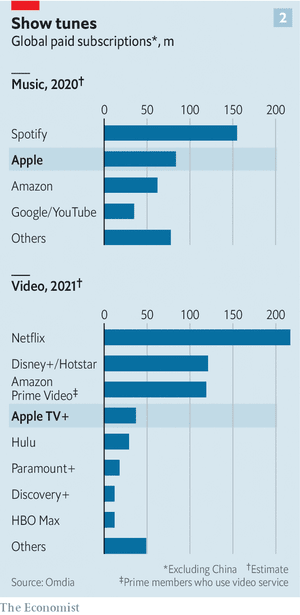

### 1. The world this week
#### 1.1 [Politics](https://www.economist.com/the-world-this-week/2022/01/08/politics)
  

#### 1.2 [Business](https://www.economist.com/the-world-this-week/2022/01/08/business)
  

#### 1.3 [KAL’s cartoon](https://www.economist.com/the-world-this-week/2022/01/08/kals-cartoon)
  

### 2. Leaders
#### 2.1 _Russia and NATO:_ [How to talk to Mr Putin](https://www.economist.com/leaders/2022/01/08/how-to-talk-to-mr-putin)  
Russia’s aggression towards Ukraine has created a chance to enhance the security of Europe  

#### 2.2 _High-voltage mire:_ [Andrés Manuel López Obrador’s energy policy will hurt Mexico](https://www.economist.com/leaders/2022/01/08/andres-manuel-lopez-obradors-energy-policy-will-hurt-mexico)  
Lawmakers should vote down the president’s proposals  

#### 2.3 _Beware snake oil:_ [Democrats seem drawn to hare-brained schemes to control inflation](https://www.economist.com/leaders/2022/01/08/democrats-seem-drawn-to-hare-brained-schemes-to-control-inflation)  
It is up to central banks to bring price growth down  
  

#### 2.4 _Pliant patriots:_ [Hong Kong’s new legislature is a mockery of democracy](https://www.economist.com/leaders/hong-kongs-new-legislature-is-a-mockery-of-democracy/21807016)  
And its media are losing any independence  

#### 2.5 _The meaning of green:_ [The EU’s green rules will do too little to tackle climate change](https://www.economist.com/leaders/2022/01/08/the-eus-green-rules-will-do-too-little-to-tackle-climate-change)  
Relying on investors to save the planet using a “taxonomy” has limits  
  

### 3. Letters
#### 3.1 _On American power, wireless connections, Africa, cruise ships, restaurants, Stephen Sondheim:_ [Letters to the editor](https://www.economist.com/letters/2022/01/08/letters-to-the-editor)  
A selection of correspondence  

### 4. Briefing
#### 4.1 _Putin’s brinkmanship:_ [Russia’s menacing of Ukraine is unlikely to induce NATO to retreat](https://www.economist.com/briefing/2022/01/08/russias-menacing-of-ukraine-is-unlikely-to-induce-nato-to-retreat)  
It may have the opposite effect  
  

### 5. Europe
#### 5.1 _Keep calm and carry on:_ [Ukrainians are peculiarly relaxed about Russia’s troop build-up](https://www.economist.com/europe/ukrainians-are-peculiarly-relaxed-about-russias-troop-build-up/21807001)  
Many have grown inured to a risk they can do nothing about  
  

#### 5.2 _Nein, danke!:_ [Why Germans remain so jittery about nuclear power](https://www.economist.com/europe/2022/01/08/why-germans-remain-so-jittery-about-nuclear-power)  
The first of many coalition rows  

#### 5.3 _Decision time:_ [Will Mario Draghi move to Italy’s largely ceremonial presidency?](https://www.economist.com/europe/2022/01/08/will-mario-draghi-move-to-italys-largely-ceremonial-presidency)  
Many think the prime minister will shortly switch jobs  

#### 5.4 _To the end of the earth:_ [Spain’s high-speed network reaches Galicia](https://www.economist.com/europe/2022/01/06/spains-high-speed-network-reaches-galicia)  
Which was already doing rather well  

#### 5.5 _Charlemagne:_ [The return of big government sparks questions for Europe](https://www.economist.com/europe/2022/01/08/the-return-of-big-government-sparks-questions-for-europe)  
The EU will have to evolve from forbidding things to proposing them  

### 6. Britain
#### 6.1 _A question of consent:_ [The harm Prince Andrew does to the crown](https://www.economist.com/britain/the-harm-prince-andrew-does-to-the-crown/21807004)  
Hereditary monarchy rests on consent. A sexual-assault case undermines that  

#### 6.2 _Balancing act:_ [Britain’s government is trying to protect national security](https://www.economist.com/britain/2022/01/08/britains-government-is-trying-to-protect-national-security)  
Without throttling investment that will be tricky  

#### 6.3 _Iconoclasm past and present:_ [What a previous iconoclastic period reveals about the present one](https://www.economist.com/britain/2022/01/08/what-a-previous-iconoclastic-period-reveals-about-the-present-one)  
History suggests the opponents of images will prevail  

#### 6.4 _Public art in Britain:_ [The sorry tale of Margaret Thatcher’s statue](https://www.economist.com/britain/2022/01/08/the-sorry-tale-of-margaret-thatchers-statue)  
Iconoclasm makes it hard to put up new images  

#### 6.5 _Bagehot:_ [Kicking winners: Britain’s political economy](https://www.economist.com/britain/2022/01/08/kicking-winners-britains-political-economy)  
British politics has a unique disdain for the country’s strengths  

### 7. Middle East & Africa
#### 7.1 _When you are in a hole...:_ [How Africa can reduce its reliance on commodities](https://www.economist.com/middle-east-and-africa/2022/01/08/how-africa-can-reduce-its-reliance-on-commodities)  
Invest the profits in infrastructure and people  
  
  

#### 7.2 _The birds and the “be quiet”:_ [A Ugandan court has unbanned sex education](https://www.economist.com/middle-east-and-africa/2022/01/08/a-ugandan-court-has-unbanned-sex-education)  
But any new policy is sure to annoy religious leaders  

#### 7.3 _How to capture a state:_ [Jacob Zuma presided over a mountain of sleaze in South Africa](https://www.economist.com/middle-east-and-africa/2022/01/08/jacob-zuma-presided-over-a-mountain-of-sleaze-in-south-africa)  
A commission implicates his inner circle and some big firms  

#### 7.4 _Losing control:_ [Sexual-assault allegations test ultra-Orthodox leaders in Israel](https://www.economist.com/middle-east-and-africa/2022/01/08/sexual-assault-allegations-test-ultra-orthodox-leaders-in-israel)  
Rabbis have tried to control the narrative around Chaim Walder. It’s not working  

#### 7.5 _Bubbling below the surface:_ [Many Saudis are seething at Muhammad bin Salman’s reforms](https://www.economist.com/middle-east-and-africa/2022/01/06/many-saudis-are-seething-at-muhammad-bin-salmans-reforms)  
Can they do anything about them?  

### 8. United States
#### 8.1 _Biden’s burden:_ [The year ahead in American politics looks daunting for Democrats](https://www.economist.com/united-states/2022/01/08/the-year-ahead-in-american-politics-looks-daunting-for-democrats)  
By the end of 2022, momentum will probably have shifted to Donald Trump’s Republicans  
  

#### 8.2 _Covid reconsidered:_ [In America the pandemic seems to have hit a turning-point](https://www.economist.com/united-states/in-america-the-pandemic-has-seemingly-hit-a-turning-point/21807003)  
Health-care officials start to favour social well-being over individual illness  

#### 8.3 _Electoral administration:_ [Reforming the Electoral Count Act would help prevent another riot](https://www.economist.com/united-states/2022/01/08/reforming-the-electoral-count-act-would-help-prevent-another-riot)  
Who counts wins  

#### 8.4 _Medical schools and gender:_ [Trans ideology is distorting the training of America’s doctors](https://www.economist.com/united-states/2022/01/08/trans-ideology-is-distorting-the-training-of-americas-doctors)  
Fear and ignorance are infecting medical education  

#### 8.5 _Indigenous cuisine:_ [Native American chefs are cooking up a culinary renaissance](https://www.economist.com/united-states/2022/01/08/native-american-chefs-are-cooking-up-a-culinary-renaissance)  
Crickets, blue corn and bison tartare  

#### 8.6 _Go forth and multiply:_ [Can Mormonism thrive as a global religion?](https://www.economist.com/united-states/2022/01/08/can-mormonism-thrive-as-a-global-religion)  
The church struggles to adapt to local customs and retain its distinct culture  

#### 8.7 _Lexington:_ [The insurrection, one year on](https://www.economist.com/united-states/the-insurrection-one-year-on/21807018)  
The Republican Party has rewritten the history of the violence its leader caused  

### 9. The Americas
#### 9.1 _Blast from the past:_ [Mexico’s energy reforms will damage the economy and the rule of law](https://www.economist.com/the-americas/mexicos-energy-reforms-will-damage-the-economy-and-the-rule-of-law/21806998)  
President Andrés Manuel López Obrador wants to turn the clock back to the 1970s  
  
  

#### 9.2 _Bolsonaryo v Lulo:_ [Video games involving politicians have gone viral in Brazil](https://www.economist.com/the-americas/2022/01/08/video-games-involving-politicians-have-gone-viral-in-brazil)  
A divisive political culture vents some steam online  

#### 9.3 _Crushing disappointment:_ [Why it is so tricky to buy a bulb of garlic in Cuba](https://www.economist.com/the-americas/2022/01/06/why-it-is-so-tricky-to-buy-a-bulb-of-garlic-in-cuba)  
A shortage, and rising prices, hint at larger problems on the communist island  

### 10. Asia
#### 10.1 _Shouting at deaf old men:_ [Kazakhstan’s president asks Russia for help as unrest grows](https://www.economist.com/asia/kazakhstans-president-vows-to-cling-on-despite-nationwide-protests/21807017)  
The government has been sacked, official buildings torched and a state of emergency declared  
  

#### 10.2 _Elections and infections:_ [Is India prepared for Omicron?](https://www.economist.com/asia/2022/01/08/is-india-prepared-for-omicron)  
Some lessons have been learnt from the devastating Delta wave of 2021, but not all  
  
  

#### 10.3 _RAAring to go:_ [Japan and Australia are cosying up to each other](https://www.economist.com/asia/2022/01/08/japan-and-australia-are-cosying-up-to-each-other)  
Wariness of China, and concern about American reliability, is bringing them closer  

#### 10.4 _Goodbye to all that:_ [A growing number of soldiers are deserting the Burmese army](https://www.economist.com/asia/2022/01/08/a-growing-number-of-soldiers-are-deserting-the-burmese-army)  
The shadow government hopes helping them escape will weaken the Tatmadaw  

#### 10.5 _Banyan:_ [What is Rodrigo Duterte’s legacy?](https://www.economist.com/asia/2022/01/08/what-is-rodrigo-dutertes-legacy)  
The Philippine strongman’s list of achievements is negligible  

### 11. China
#### 11.1 _Showing who’s boss:_ [China crushes Hong Kong’s independent news outlets](https://www.economist.com/china/2022/01/08/china-crushes-hong-kongs-independent-news-outlets)  
The world loses an important way to understand Hong Kong and China  

#### 11.2 _Geneva discords:_ [China and America prepare for a human-rights showdown at the UN](https://www.economist.com/china/2022/01/08/china-and-america-prepare-for-a-human-rights-showdown-at-the-un)  
It is not clear which side will win  

#### 11.3 _Chaguan:_ [China’s online nationalists turn paranoia into clickbait](https://www.economist.com/china/2022/01/08/chinas-online-nationalists-turn-paranoia-into-clickbait)  
They see hostile foreign forces at every turn  

### 12. International
#### 12.1 _God, Mammon and real estate:_ [The world’s religions face a post-pandemic reckoning](https://www.economist.com/international/2022/01/08/the-worlds-religions-face-a-post-pandemic-reckoning)  
Many need to sell their property; some branches will have to merge  
  
  

### 13. Business
#### 13.1 _The accidental mogul:_ [Just how big in media does Apple want to be?](https://www.economist.com/business/2022/01/08/just-how-big-in-media-does-apple-want-to-be)  
The $3trn tech firm is not playing the same game as its rivals  
  
  

#### 13.2 _No child’s play:_ [Streaming giants get more serious about children’s shows](https://www.economist.com/business/2022/01/08/streaming-giants-get-more-serious-about-childrens-shows)  
A cost-effective way to expand your subscriber base  
  

#### 13.3 _Blood will have blood:_ [A jury finds Elizabeth Holmes guilty of fraud](https://www.economist.com/business/2022/01/08/a-jury-finds-elizabeth-holmes-guilty-of-fraud)  
Theranos’s founder captured the imagination of investors, political bigwigs and Hollywood alike  

#### 13.4 _Cloud v ether:_ [Will the cloud business eat the 5G telecoms industry?](https://www.economist.com/business/will-the-cloud-business-eat-the-5g-telecoms-industry/21806999)  
As AT&T and Verizon launch 5G this month, two huge industries collide  

#### 13.5 _Cars of tomorrow:_ [Cars meet chips in Sin City](https://www.economist.com/business/2022/01/08/cars-meet-chips-in-sin-city)  
A tech show in Las Vegas shows off the bright and shiny future of vehicle technology  

#### 13.6 _Blue-collar burnout:_ [Why workers are fleeing the hospitality sector](https://www.economist.com/business/2022/01/08/why-workers-are-fleeing-the-hospitality-sector)  
Stress and exhaustion are big factors  

#### 13.7 _Bartleby:_ [The rise of performative work](https://www.economist.com/business/2022/01/08/the-rise-of-performative-work)  
It’s not what you do. It’s how ostentatiously you do it  

### 14. Finance & economics
#### 14.1 _House party:_ [How long can the global housing boom last?](https://www.economist.com/finance-and-economics/how-long-can-the-global-housing-boom-last/21807002)  
Three fundamental forces mean it could endure for some time yet  
  
  

#### 14.2 _Gold standard:_ [The EU’s green-investing “taxonomy” could go global](https://www.economist.com/finance-and-economics/2022/01/08/the-eus-green-investing-taxonomy-could-go-global)  
But will it steer capital towards deserving projects?  

#### 14.3 _Regulatory flex:_ [A war of words ends with the Democrats in charge of a key regulator](https://www.economist.com/finance-and-economics/2022/01/08/a-war-of-words-ends-with-the-democrats-in-charge-of-a-key-regulator)  
A boardroom bust-up at the FDIC reveals President Biden’s distaste for big banks  

#### 14.4 _The new consensus:_ [Economists are agreeing with each other more](https://www.economist.com/finance-and-economics/2022/01/08/economists-are-agreeing-with-each-other-more)  
A new survey finds growing consensus, notably on the need for more activist economic policy  
  

#### 14.5 _North-eastern exposure:_ [Could China’s north-east be home to its next banking disaster?](https://www.economist.com/finance-and-economics/2022/01/08/could-chinas-north-east-be-home-to-its-next-banking-disaster)  
The economy is struggling, and its banks are under stress  
  

#### 14.6 _Direct to market:_ [The rise of personalised stock indices](https://www.economist.com/finance-and-economics/2022/01/08/the-rise-of-personalised-stock-indices)  
Direct-indexed accounts combine the benefits of customisation with those of passive investing  
  

#### 14.7 _Buttonwood:_ [Why gold has lost some of its investment allure](https://www.economist.com/finance-and-economics/2022/01/08/why-gold-has-lost-some-of-its-investment-allure)  
It has been less reliable than inflation-protected Treasuries, and is less exciting than crypto  

#### 14.8 _Free exchange:_ [The IMF bashes the IMF over Argentina](https://www.economist.com/finance-and-economics/2022/01/08/the-imf-bashes-the-imf-over-argentina)  
The fund’s huge rescue plan for the country could not withstand the foreseeable risks it faced  

### 15. Science & technology
#### 15.1 _Ecology:_ [Wildlife can now be detected by sniffing DNA in the air](https://www.economist.com/science-and-technology/2022/01/08/wildlife-can-now-be-detected-by-sniffing-dna-in-the-air)  
Hard-to-see animals are thus easier to record  

#### 15.2 _Agricultural science in orbit:_ [Outer space offers plant breeders some curious advantages](https://www.economist.com/science-and-technology/outer-space-offers-plant-breeders-some-curious-advantages/21807014)  
Radiation and microgravity may give rise to better crops  

#### 15.3 _E.O. Wilson:_ [Edward Wilson, controversial biologist, is dead](https://www.economist.com/science-and-technology/edward-wilson-controversial-biologist-is-dead/21807015)  
He introduced the world to sociobiology  

#### 15.4 _Fossil hunting:_ [The tricky relationship between palaeontology and poor countries](https://www.economist.com/science-and-technology/the-tricky-relationship-between-palaeontology-and-poor-countries/21807013)  
More is known of rich-world than poor-world fossils. That is bad  
  

### 16. Books & arts
#### 16.1 _How things fall apart:_ [An expert on civil war issues a warning about America](https://www.economist.com/books-and-arts/2022/01/08/an-expert-on-civil-war-issues-a-warning-about-america)  
But Barbara Walter exaggerates  

#### 16.2 _A journalist’s apprenticeship:_ [Carl Bernstein’s memoir traces his path to Watergate](https://www.economist.com/books-and-arts/2022/01/08/carl-bernsteins-memoir-traces-his-path-to-watergate)  
His book is a vivid and elegiac portrait of a bygone newspaper world  

#### 16.3 _Tell it from the mountain:_ [A climber’s story evokes classic mountaineering literature](https://www.economist.com/books-and-arts/2022/01/08/a-climbers-story-evokes-classic-mountaineering-literature)  
Like many of the genre’s finest books, Anna Fleming’s voyages within as well as up  

#### 16.4 _The eyeballs have it:_ [After 50 years, the Residents are still on the road](https://www.economist.com/books-and-arts/2022/01/08/after-50-years-the-residents-are-still-on-the-road)  
Anonymity is key to the cult art-pop group’s success. But so is innovation  

### 17. Economic & financial indicators
#### 17.1 _Economic data, commodities and markets:_ [Indicators](https://www.economist.com/economic-and-financial-indicators/2022/01/08/economic-data-commodities-and-markets)  
  

### 18. Graphic detail
#### 18.1 _Stoppage time:_ [For elite footballers, the effects of covid-19 linger for months](https://www.economist.com/graphic-detail/2022/01/08/for-elite-footballers-the-effects-of-covid-19-linger-for-months)  
Long after infection, players play fewer minutes and complete fewer passes  
  
  

### 19. Obituary
#### 19.1 _Shame and champagne:_ [April Ashley campaigned for rights hardly considered before](https://www.economist.com/obituary/2022/01/08/april-ashley-campaigned-for-rights-hardly-considered-before)  
Britain’s first transgender activist died on December 27th, aged 86  

