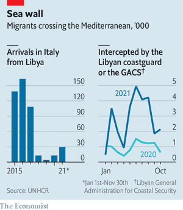
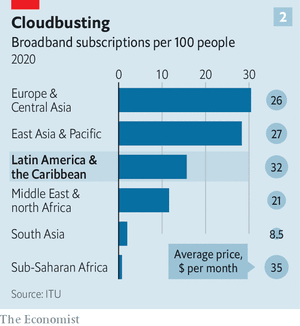
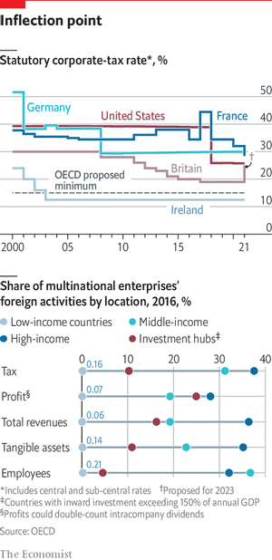
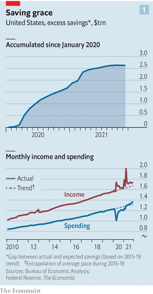
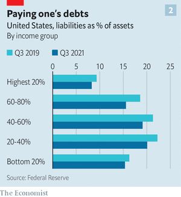

### 1. The world this week
#### 1.1 [Politics](https://www.economist.com/the-world-this-week/2022/01/13/politics)
  

#### 1.2 [Business](https://www.economist.com/the-world-this-week/2022/01/13/business)
  

#### 1.3 [KAL’s cartoon](https://www.economist.com/the-world-this-week/2022/01/15/kals-cartoon)
  

### 2. Leaders
#### 2.1 _Business and government:_ [Welcome to the era of the bossy state](https://www.economist.com/leaders/2022/01/15/welcome-to-the-era-of-the-bossy-state)  
Countries around the world want to bend companies to their will  

#### 2.2 _Party animal:_ [Boris Johnson has always been unfit to be prime minister](https://www.economist.com/leaders/2022/01/15/boris-johnson-has-always-been-unfit-to-be-prime-minister)  
With him in office, Britain can expect a rough ride  

#### 2.3 _Poor students:_ [America has failed to learn from the safe opening of classrooms abroad](https://www.economist.com/leaders/2022/01/13/america-has-failed-to-learn-from-the-safe-opening-of-classrooms-abroad)  
Its children have lost more school days than peers in most rich countries  

#### 2.4 _Standemonium:_ [Central Asia will remain unstable, however many troops Russia sends](https://www.economist.com/leaders/2022/01/15/central-asia-will-remain-unstable-however-many-troops-russia-sends)  
Events in Kazakhstan are not what they seem  

#### 2.5 _Indiacitement:_ [Hindu bigots are openly urging Indians to murder Muslims](https://www.economist.com/leaders/2022/01/15/hindu-bigots-are-openly-urging-indians-to-murder-muslims)  
And the ruling party does nothing to stop them  

#### 2.6 _Financial risk:_ [The worry about cross-border capital flows](https://www.economist.com/leaders/2022/01/13/the-worry-about-cross-border-capital-flows)  
They are growing fast and they pose a threat to stability  
  

### 3. Letters
#### 3.1 _On the Republicans, Ukraine, gaming, running with bulls, corrugated iron, doors:_ [Letters to the editor](https://www.economist.com/letters/2022/01/15/letters-to-the-editor)  
A selection of correspondence  

### 4. Briefing
#### 4.1 _Steppe in the dark:_ [Kazakhstan’s bloody turbulence will affect all of Central Asia](https://www.economist.com/briefing/2022/01/13/kazakhstans-bloody-turbulence-will-affect-all-of-central-asia)  
Russian troops are no guarantee of stability  
  
  

### 5. Europe
#### 5.1 _Teetering at the summit:_ [Russia and the West meet for a crucial week of diplomacy](https://www.economist.com/europe/russia-and-the-west-meet-for-a-crucial-week-of-diplomacy/21807130)  
Even as they talk, both sides are preparing for war  
  

#### 5.2 _Unfashionably gauche:_ [The French left faces disaster in April’s presidential election](https://www.economist.com/europe/2022/01/13/the-french-left-faces-disaster-in-aprils-presidential-election)  
The once mighty Socialists are now barely a blip  
  

#### 5.3 _The geopolitics of December 25th:_ [Ukraine’s Orthodox Church may change the date of its Christmas](https://www.economist.com/europe/2022/01/13/ukraines-orthodox-church-may-change-the-date-of-its-christmas)  
Switching to the Western date is a snub to Russia  

#### 5.4 _Removing the clogs:_ [A new Dutch government with a taste for Europe](https://www.economist.com/europe/2022/01/15/a-new-dutch-government-with-a-taste-for-europe)  
The Netherlands has long resisted collective EU spending, but that is changing  

#### 5.5 _Charlemagne:_ [Europe’s energy crisis will trigger its worst neuroses](https://www.economist.com/europe/2022/01/15/europes-energy-crisis-will-trigger-its-worst-neuroses)  
A surge in gas prices is the stuff of nightmares  

### 6. Britain
#### 6.1 _Breaking bad:_ [Boris Johnson’s career of rule-breaking runs into crisis](https://www.economist.com/britain/boris-johnsons-career-of-rule-breaking-runs-into-crisis/21807144)  
From smashing the political status quo to partying during lockdown  

#### 6.2 _Britain’s energy crisis:_ [Expensive energy is baked into Britain’s future](https://www.economist.com/britain/2022/01/15/expensive-energy-is-baked-into-britains-future)  
It’s not cheap being green  
  

#### 6.3 _Choosing to look away:_ [Britain’s government plans to stop sending free tests to homes](https://www.economist.com/britain/2022/01/15/britains-government-plans-to-stop-sending-free-tests-to-homes)  
Deciding when is tricky  

#### 6.4 _Match and dispatch:_ [Non-religious celebrants are leading more of England’s funerals](https://www.economist.com/britain/2022/01/15/non-religious-celebrants-are-leading-more-of-englands-funerals)  
They could soon get the right to marry people, too  

#### 6.5 _Trees and history:_ [Britain still has a few patches of rainforest, which need help](https://www.economist.com/britain/2022/01/13/britain-still-has-a-few-patches-of-rainforest-which-need-help)  
Rewilding is not the solution  

#### 6.6 _Automatic for the people:_ [Vanguard’s big push into financial advice](https://www.economist.com/britain/2022/01/13/vanguards-big-push-into-financial-advice)  
Asset management’s great disrupter has picked a new target  

#### 6.7 _Bagehot:_ [What did you expect from Boris Johnson?](https://www.economist.com/britain/2022/01/15/what-did-you-expect-from-boris-johnson)  
The prime minister, in his own way, is Britain’s most honest politician  

### 7. Middle East & Africa
#### 7.1 _An EU-funded horror story:_ [Europe is bankrolling a force that routinely abuses African migrants](https://www.economist.com/middle-east-and-africa/an-eu-funded-horror-story/21807126)  
Libya’s coastguard is not known for its professionalism  
  
  

#### 7.2 _Make way:_ [Why more Arabs are embracing pedal power](https://www.economist.com/middle-east-and-africa/2022/01/13/why-more-arabs-are-embracing-pedal-power)  
Cars still dominate, but cycling is growing more popular  

#### 7.3 _Happy Christmas, war is over?:_ [Ethiopia promises peace but keeps bombing rebels and civilians](https://www.economist.com/middle-east-and-africa/2022/01/15/ethiopia-promises-peace-but-keeps-bombing-rebels-and-civilians)  
Prime Minister Abiy Ahmed’s actions belie his words  

#### 7.4 _Wagner, worse than it sounds:_ [Small bands of mercenaries extend Russia’s reach in Africa](https://www.economist.com/middle-east-and-africa/2022/01/15/small-bands-of-mercenaries-extend-russias-reach-in-africa)  
Local despots seek unsqueamish hired guns  
  

### 8. United States
#### 8.1 _Refunding the police:_ [As violent crime leaps, liberal cities rethink cutting police budgets](https://www.economist.com/united-states/2022/01/15/as-violent-crime-leaps-liberal-cities-rethink-cutting-police-budgets)  
The tricky politics of criminal-justice reform at a time of rising fears  
  

#### 8.2 _America’s missing diplomats:_ [Can Joe Biden’s relentless diplomacy work without diplomats?](https://www.economist.com/united-states/can-joe-bidens-relentless-diplomacy-work-without-diplomats/21807115)  
More than one-third of America’s ambassadors are missing from the action  

#### 8.3 _Biden’s judges:_ [More diverse appointments are set to reshape America’s judiciary](https://www.economist.com/united-states/2022/01/15/more-diverse-appointments-are-set-to-reshape-americas-judiciary)  
Democrats race to fill the courts  

#### 8.4 _Schools out:_ [America resorts to remote learning, against pupils’ interests](https://www.economist.com/united-states/2022/01/15/america-resorts-to-remote-learning-against-pupils-interests)  
Why have so many schools been cancelling classes?  

#### 8.5 _Fires:_ [Deadly blazes reflect America’s failure to adequately house its poor](https://www.economist.com/united-states/2022/01/13/deadly-blazes-reflect-americas-failure-to-adequately-house-its-poor)  
The real cause of recent deadly fires was poverty  

#### 8.6 _An American boom town:_ [As Austin thrives as a tech hub, will it avoid San Francisco’s problems?](https://www.economist.com/united-states/2022/01/15/as-austin-thrives-as-a-tech-hub-will-it-avoid-san-franciscos-problems)  
The capital of Texas will have to grapple with the downsides of growth  

#### 8.7 _Lexington:_ [Joe Biden was set up to fail](https://www.economist.com/united-states/2022/01/15/joe-biden-was-set-up-to-fail)  
The Democratic president is a flawed politician in an impossible job  

### 9. The Americas
#### 9.1 _Silicon linings:_ [The pandemic has accelerated Latin America’s startup boom](https://www.economist.com/the-americas/2022/01/15/the-pandemic-has-accelerated-latin-americas-startup-boom)  
Many businesses are ripe for disruption  
  
  

#### 9.2 _Poor figures:_ [Jair Bolsonaro’s scorn for data leaves Brazil in the dark](https://www.economist.com/the-americas/2022/01/15/jair-bolsonaros-scorn-for-data-leaves-brazil-in-the-dark)  
The president often prefers inaccurate statistics, or none at all  

#### 9.3 _A puck in the teeth:_ [Canada’s best ice-hockey players cannot go to the Olympics](https://www.economist.com/the-americas/2022/01/13/canadas-best-ice-hockey-players-cannot-go-to-the-olympics)  
The National Hockey League may be betting on anti-China sentiment  

### 10. Asia
#### 10.1 _Playing with fire:_ [India’s government is ignoring, and sometimes even encouraging, hatred of minorities](https://www.economist.com/asia/2022/01/13/indias-government-is-ignoring-and-sometimes-even-encouraging-hatred-of-minorities)  
Narendra Modi’s Hindu-nationalist Bharatiya Janata Party is determined to preserve its power  

#### 10.2 _Some like it otter:_ [Demand for pet otters is driving a harmful trade](https://www.economist.com/asia/2022/01/13/demand-for-pet-otters-is-driving-a-harmful-trade)  
The creatures are cute but make lousy pets  

#### 10.3 _Thanks, but no thanks:_ [Sri Lanka is flirting with default](https://www.economist.com/asia/2022/01/13/sri-lanka-is-flirting-with-default)  
Gotabaya Rajapaksa’s government is reluctant to go to the IMF  
  

#### 10.4 _Djebacle:_ [Australia ties itself in knots over No-vax Djokovic](https://www.economist.com/asia/novak-djokovic-wins-his-case-against-the-australian-government/21807118)  
The tennis star won in court but may yet be unable to play on court  

#### 10.5 _Banyan:_ [China does not have it all its way in the South China Sea](https://www.economist.com/asia/2022/01/15/china-does-not-have-it-all-its-way-in-the-south-china-sea)  
South-East Asian countries are increasingly wary of their giant neighbour  

### 11. China
#### 11.1 _All change, bar one:_ [Xi Jinping’s job is safe but China’s leadership is being shaken up](https://www.economist.com/china/2022/01/13/xi-jinpings-job-is-safe-but-chinas-leadership-is-being-shaken-up)  
A five-yearly churn is affecting decisions on everything from the economy to covid-19  

#### 11.2 _Chaguan:_ [America and China are one military accident away from disaster](https://www.economist.com/china/2022/01/15/america-and-china-are-one-military-accident-away-from-disaster)  
Lessons from a Chinese jet’s fatal collision with a US spy plane, 21 years ago  

### 12. International
#### 12.1 _The point of tipping:_ [Do tips make for better service?](https://www.economist.com/international/2022/01/15/do-tips-make-for-better-service)  
The evidence is mixed—and the practice varies widely across the world  
  
  

### 13. Special report
#### 13.1 _Business and the state:_ [Governments’ widespread new fondness for interventionism](https://www.economist.com/special-report/2022/01/10/governments-widespread-new-fondness-for-interventionism)  
After a long liberalising era, the state has bounced back. That is not a good thing, argues Jan Piotrowski  
  

#### 13.2 _The new industrial policy:_ [Many countries are seeing a revival of industrial policy](https://www.economist.com/special-report/2022/01/10/many-countries-are-seeing-a-revival-of-industrial-policy)  
A previously discredited approach has found new believers  

#### 13.3 _Competition policy:_ [The growing demand for more vigorous antitrust action](https://www.economist.com/special-report/2022/01/10/the-growing-demand-for-more-vigorous-antitrust-action)  
Greater concentration of market power is leading to a trustbusting revival  

#### 13.4 _Government regulation:_ [Enthusiasm for regulation, often in areas like the climate, shows no sign of flagging](https://www.economist.com/special-report/2022/01/10/enthusiasm-for-regulation-often-in-areas-like-the-climate-shows-no-sign-of-flagging)  
Red tape continues to spread inexorably  
  

#### 13.5 _Corporate taxes:_ [The long trend of falling corporate taxes is being reversed](https://www.economist.com/special-report/2022/01/10/the-long-trend-of-falling-corporate-taxes-is-being-reversed)  
After falling for decades, taxes on companies are rising again  
  

#### 13.6 _The future:_ [However justified, more government intervention risks being counterproductive](https://www.economist.com/special-report/2022/01/10/however-justified-more-government-intervention-risks-being-counterproductive)  
It is time to reassert the case for less state intrusion  

#### 13.7 [Sources and acknowledgments](https://www.economist.com/special-report/2022/01/10/sources-and-acknowledgments)
  

### 14. Business
#### 14.1 _Move fast and heal things:_ [How health care is turning into a consumer product](https://www.economist.com/business/how-health-care-is-turning-into-a-consumer-product/21807114)  
A new tech boom is changing the business of medicine  
  
  
  

#### 14.2 _Medium-sized expectations:_ [What the Mittelstand wants](https://www.economist.com/business/2022/01/15/what-the-mittelstand-wants)  
Germany’s manufacturing bosses size up the new government  

#### 14.3 _The new great game:_ [Can big oil’s bounce-back last?](https://www.economist.com/business/can-big-oils-bounce-back-last/21807153)  
Why American oil companies are different  
  

#### 14.4 _Bartleby:_ [Remote work and the importance of writing](https://www.economist.com/business/2022/01/15/remote-work-and-the-importance-of-writing)  
The written word will flourish in the post-pandemic workplace  

#### 14.5 _Schumpeter:_ [TikTok isn’t silly. It’s serious](https://www.economist.com/business/2022/01/15/tiktok-isnt-silly-its-serious)  
It is disrupting America’s social-media landscape  

### 15. Finance & economics
#### 15.1 _Super savers:_ [The $28trn global reach of Asian finance](https://www.economist.com/finance-and-economics/the-28trn-global-reach-of-asian-finance/21807121)  
As private savings have built up in East and South-East Asia, the region’s financiers now wield heft in far-flung asset markets  
  
  

#### 15.2 _Atom and abroad:_ [The Kazakh crisis is only one threat hanging over the uranium market](https://www.economist.com/finance-and-economics/2022/01/15/the-kazakh-crisis-is-only-one-threat-hanging-over-the-uranium-market)  
A global crunch in nuclear fuel is no longer impossible  

#### 15.3 _Life after stimmy:_ [Will Americans’ pandemic savings stash keep the economy rolling?](https://www.economist.com/finance-and-economics/will-households-excess-savings-keep-the-american-economy-afloat/21807127)  
The “stimmy” boost may linger even as policymakers wind down support  
  
  

#### 15.4 _Aversion therapy:_ [The new government hopes to cure Germans’ distaste the stockmarket](https://www.economist.com/finance-and-economics/2022/01/15/the-new-government-hopes-to-cure-germans-distaste-the-stockmarket)  
Plans include funding a small part of the public-pension scheme through stock investment  

#### 15.5 _Buttonwood:_ [The faster metabolism of finance, as seen by a veteran broker](https://www.economist.com/finance-and-economics/2022/01/15/the-faster-metabolism-of-finance-as-seen-by-a-veteran-broker)  
Prices are set at the margin. And the marginal trader is a hedge-fund manager  

#### 15.6 _Taming tigers:_ [A corruption probe is only the latest of Chinese insurers’ woes](https://www.economist.com/finance-and-economics/2022/01/15/a-corruption-probe-is-only-the-latest-of-chinese-insurers-woes)  
About 30% of salespeople have left the industry since 2019  

#### 15.7 _Free exchange:_ [Will remote work stick after the pandemic?](https://www.economist.com/finance-and-economics/2022/01/15/will-remote-work-stick-after-the-pandemic)  
Speakers at the American Economics Association’s annual pow-wow take a shot at the question  

### 16. Science & technology
#### 16.1 _Seismology:_ [Predicting earthquakes is not possible. Yet](https://www.economist.com/science-and-technology/predicting-earthquakes-is-not-possible-yet/21807129)  
But an intriguing new approach shows promise  

#### 16.2 _Climate change:_ [A lot of Arctic infrastructure is threatened by rising temperatures](https://www.economist.com/science-and-technology/a-lot-of-arctic-infrastructure-is-threatened-by-rising-temperatures/21807133)  
Russia will be particularly badly hit  
  

#### 16.3 _Xenotransplantation:_ [The science behind the first successful pig-to-human heart transplant](https://www.economist.com/science-and-technology/2022/01/15/the-science-behind-the-first-successful-pig-to-human-heart-transplant)  
It may lead to a new approach to organ transplantation  

#### 16.4 _Marine biology:_ [The world’s biggest fish hatchery](https://www.economist.com/science-and-technology/2022/01/15/the-worlds-biggest-fish-hatchery)  
The ocean depths still hold many surprises  

#### 16.5 _Omicron and immunity:_ [The case for updating covid-19 vaccines for the Omicron variant](https://www.economist.com/science-and-technology/the-case-for-updating-covid-19-vaccines-for-the-omicron-variant/21807136)  
A new study puts the variant in a group apart from its predecessors  
  

### 17. Books & arts
#### 17.1 _The purpose of art:_ [In Japan, festivals are boldly taking art into the countryside](https://www.economist.com/books-and-arts/2022/01/15/in-japan-festivals-are-boldly-taking-art-into-the-countryside)  
The trend represents a reappraisal of what art can do—and whom it is for  

#### 17.2 _Hollywood legends:_ [It was hard for any viewer to look away from Sidney Poitier](https://www.economist.com/books-and-arts/it-was-hard-for-any-viewer-to-look-away-from-sidney-poitier/21807122)  
Or down on him  

#### 17.3 _Out of the abyss:_ [“Aftermath” is a piercing study of Germany after 1945](https://www.economist.com/books-and-arts/2022/01/13/aftermath-is-a-piercing-study-of-germany-after-1945)  
The road from the Third Reich to modern Germany began in a field of rubble  

#### 17.4 _Dystopian fiction:_ [Jessamine Chan’s gripping debut novel sends up modern parenting](https://www.economist.com/books-and-arts/2022/01/15/jessamine-chans-gripping-debut-novel-sends-up-modern-parenting)  
“The School for Good Mothers” also sounds the alarm about surveillance  

#### 17.5 _Johnson:_ [Dominant languages can spread even without coercion](https://www.economist.com/books-and-arts/2022/01/15/dominant-languages-can-spread-even-without-coercion)  
Whether and how to resist them is a tough question  

### 18. Economic & financial indicators
#### 18.1 _Economic data, commodities and markets:_ [Indicators](https://www.economist.com/economic-and-financial-indicators/2022/01/13/economic-data-commodities-and-markets)  
  

### 19. Graphic detail
#### 19.1 _Wages and places:_ [Why North Dakota, not New York, may be the land of opportunity](https://www.economist.com/graphic-detail/2022/01/15/why-north-dakota-not-new-york-may-be-the-land-of-opportunity)  
Economists try to understand the determinants of higher wages  
  

### 20. Obituary
#### 20.1 _Homo impatiens:_ [Richard Leakey established Kenya as a prime source of hominid fossils](https://www.economist.com/obituary/2022/01/15/richard-leakey-established-kenya-as-a-prime-source-of-hominid-fossils)  
The palaeoanthropologist and conservationist died on January 2nd, aged 76  

