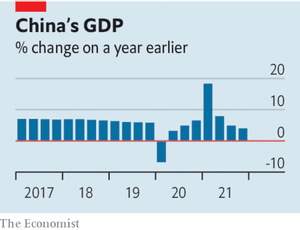

### 1. The world this week
#### 1.1   

#### 1.2   

#### 1.3   

### 2. Leaders
#### 2.1 _British politics:_ [The parable of Boris Johnson](https://www.economist.com/leaders/2022/01/22/the-parable-of-boris-johnson)  
And what it says about Britain  

#### 2.2 _The future of technology:_ [Big tech’s supersized ambitions](https://www.economist.com/leaders/2022/01/22/big-techs-supersized-ambitions)  
From metaverses to quantum computing  

#### 2.3 _Vlad the invader:_ [Momentum is building for war in Ukraine](https://www.economist.com/leaders/2022/01/22/momentum-is-building-for-war-in-ukraine)  
Vladimir Putin is courting disaster for Russia’s neighbour—and himself  

#### 2.4 _Pragmatism over pride:_ [The rising cost of China’s property and pandemic curbs](https://www.economist.com/leaders/2022/01/22/the-rising-cost-of-chinas-property-and-pandemic-curbs)  
It needs to recalibrate both  
  

#### 2.5 _The triumph of culture:_ [Introducing our new Culture section](https://www.economist.com/leaders/2022/01/22/introducing-our-new-culture-section)  
As politics and culture blur, our coverage is evolving  

### 3. Letters
#### 3.1 _On Hong Kong, Chicago, voting reform, north-south divisions, the metaverse:_ [Letters to the editor](https://www.economist.com/letters/2022/01/22/letters-to-the-editor)  
A selection of correspondence  

### 4. Briefing
#### 4.1 _Moonshooters:_ [What America’s largest technology firms are investing in](https://www.economist.com/briefing/2022/01/22/what-americas-largest-technology-firms-are-investing-in)  
Their focus is on the metaverse, cars and health care  
  
  
  

### 5. Europe
#### 5.1 _The guns of January:_ [As war looms larger, what are Russia’s military options in Ukraine?](https://www.economist.com/europe/what-are-russias-military-options-in-ukraine/21807240)  
They all have their drawbacks  
  

#### 5.2 _An ever-closer union:_ [Emmanuel Macron’s rivals are less Eurosceptic than before](https://www.economist.com/europe/2022/01/22/emmanuel-macrons-rivals-are-less-eurosceptic-than-before)  
But Europe still divides the presidential field  

#### 5.3 _Must you be jabbed?:_ [Arguments over compulsory covid-19 vaccination are raging across Europe](https://www.economist.com/europe/austria-and-germany-struggle-to-impose-a-national-vaccine-mandate/21807228)  
Austria is in the vanguard; others may soon follow  
  

#### 5.4 _Land of ice and social democracy:_ [The Nordic left is back in charge](https://www.economist.com/europe/2022/01/22/the-nordic-left-is-back-in-charge)  
But it has yet to define a new version of its admired social model  

#### 5.5 _A not very new broom:_ [Friedrich Merz takes over as leader of Germany’s Christian Democrats](https://www.economist.com/europe/2022/01/22/friedrich-merz-takes-over-as-leader-of-germanys-christian-democrats)  
Angela Merkel’s old foe finally gets the job  

#### 5.6 _Charlemagne:_ [What China’s bullying of Lithuania reveals about Europe](https://www.economist.com/europe/2022/01/22/what-chinas-bullying-of-lithuania-reveals-about-europe)  
The EU’s internal indiscipline reduces its geopolitical heft  

### 6. Britain
#### 6.1 _The price of survival:_ [Boris Johnson’s broken premiership](https://www.economist.com/britain/boris-johnsons-broken-premiership/21807270)  
He may cling on to office, but his hold on his party has gone  
  
  

#### 6.2 _Telly addicts:_ [Tory MPs love to hate the BBC, but Tory voters love to watch it](https://www.economist.com/britain/2022/01/22/tory-mps-love-to-hate-the-bbc-but-tory-voters-love-to-watch-it)  
The latest piece of “red meat” may stick in the throat  
  

#### 6.3 _Data:_ [Britain’s Office for National Statistics did well during the pandemic](https://www.economist.com/britain/2022/01/22/britains-office-for-national-statistics-did-well-during-the-pandemic)  
It did more as its job became harder  

#### 6.4 _Hong Kongers:_ [Britain’s newest immigrants are showing a flair for protest](https://www.economist.com/britain/2022/01/22/britains-newest-immigrants-are-showing-a-flair-for-protest)  
Keeping up the old traditions  

#### 6.5 _Still got skin in the game:_ [Britain’s vellum industry is booming (quietly)](https://www.economist.com/britain/2022/01/22/britains-vellum-industry-is-booming-quietly)  
But the nation’s crafts are still endangered  

#### 6.6 _Bagehot:_ [Boris Johnson’s would-be assassins are very like him](https://www.economist.com/britain/2022/01/22/boris-johnsons-would-be-assassins-are-very-like-him)  
The sons want to kill the father  

### 7. Middle East & Africa
#### 7.1 _Welcome back:_ [The Arab world is re-embracing its Jews](https://www.economist.com/middle-east-and-africa/the-arab-world-is-re-embracing-its-jews/21807243)  
Changing attitudes and self-interested leaders are behind a surprising religious revival  

#### 7.2 _Torturers on trial:_ [Middle Eastern legal dramas play out in far-off courts](https://www.economist.com/middle-east-and-africa/2022/01/22/middle-eastern-legal-dramas-play-out-in-far-off-courts)  
Despots won’t prosecute their own henchmen. So victims seek justice abroad  

#### 7.3 _Full of tension:_ [Sunnis and Shias in Bahrain remain as far apart as ever](https://www.economist.com/middle-east-and-africa/2022/01/22/sunnis-and-shias-in-bahrain-remain-as-far-apart-as-ever)  
A prime minister who once called for dialogue has disappointed  

#### 7.4 _Soot, loot, reboot:_ [South Africa, the world’s coal junkie, tries to quit](https://www.economist.com/middle-east-and-africa/2022/01/22/south-africa-the-worlds-coal-junkie-tries-to-quit)  
But a gang of coal-dependent politicians is making it hard  
  
  

#### 7.5 _Potions for prudes:_ [Nigeria’s conservative north is overflowing with aphrodisiacs](https://www.economist.com/middle-east-and-africa/2022/01/22/nigerias-conservative-north-is-overflowing-with-aphrodisiacs)  
The call to prayer is often followed by offers of more earthly upliftment  

### 8. United States
#### 8.1 _Labour constraints:_ [Staffing shortages in America are a glimpse into its future](https://www.economist.com/united-states/staffing-shortages-in-america-are-a-glimpse-into-its-future/21807256)  
Even as the pandemic ebbs, the pool of potential workers may be permanently smaller than once assumed  
  

#### 8.2 _Handing out money:_ [America’s experiments with guaranteed-income schemes show promise](https://www.economist.com/united-states/2022/01/22/americas-experiments-with-guaranteed-income-schemes-show-promise)  
Could the pilot programmes be scaled up?  

#### 8.3 _Changing gun culture:_ [Gun-ownership in America is diversifying, because of safety fears](https://www.economist.com/united-states/2022/01/22/gun-ownership-in-america-is-diversifying-because-of-safety-fears)  
Concerns over safety lead more women and minorities to arm themselves  

#### 8.4 _Flags and free speech:_ [The Supreme Court looks askance at Boston’s refusal to fly a Christian flag](https://www.economist.com/united-states/2022/01/22/the-supreme-court-looks-askance-at-bostons-refusal-to-fly-a-christian-flag)  
A pole dance over the First Amendment  

#### 8.5 _Voting rights and wrongs:_ [Joe Biden’s voting rights push is futile](https://www.economist.com/united-states/joe-bidens-voting-rights-push-is-futile-and-misguided/21807230)  
He doesn’t have the votes—and his proposals are misguided  
  

#### 8.6 
#### 8.7 _Evaluating the United States:_ [Is America exceptionally good or exceptionally bad?](https://www.economist.com/united-states/2022/01/22/is-america-exceptionally-good-or-exceptionally-bad)  
It depends whether you ask a Biden voter or a Trump one  
  

#### 8.8 _Funnier than thou:_ [As Christian conservatives take to satire, the left is not amused](https://www.economist.com/united-states/2022/01/22/as-christian-conservatives-take-to-satire-the-left-is-not-amused)  
A Bee with a mischievous sting  

#### 8.9 _Lexington:_ [Merrick Garland and his critics](https://www.economist.com/united-states/2022/01/22/merrick-garland-and-his-critics)  
The attorney-general needs to bolster the Department of Justice’s defences against Trumpism  

### 9. The Americas
#### 9.1 _The last wave?:_ [Omicron comes to Mexico, a place that never really shut down](https://www.economist.com/the-americas/2022/01/22/omicron-comes-to-mexico-a-place-that-never-really-shut-down)  
The country has already seen over 600,000 excess deaths  
  
  

#### 9.2 _Drug bust:_ [Bills be damned: Mexico’s president decrees better health care](https://www.economist.com/the-americas/2022/01/22/bills-be-damned-mexicos-president-decrees-better-health-care)  
Andrés Manuel López Obrador’s policies have led to shortages of medicine  

#### 9.3 _Clamping down:_ [They wanted a voice. Cuba’s Communist regime will give them jail](https://www.economist.com/the-americas/2022/01/22/they-wanted-a-voice-cubas-communist-regime-will-give-them-jail)  
Around 60 peaceful pro-democracy protesters, some as young as 16, face years behind bars  

#### 9.4 _Of conservation and cash:_ [Ecuador’s president is expanding the Galapagos islands reserve](https://www.economist.com/the-americas/2022/01/22/ecuadors-president-is-expanding-the-galapagos-islands-reserve)  
He also wants to pump more oil and dig up more minerals  

### 10. Asia
#### 10.1 _Battling the superbugs:_ [Drug-resistant infections kill almost 1.3m people a year](https://www.economist.com/asia/2022/01/22/drug-resistant-infections-kill-almost-13m-people-a-year)  
To understand why, look at South Asia  
  

#### 10.2 _A kingdom cut off:_ [The damage from Tonga’s volcanic eruption is still unclear](https://www.economist.com/asia/2022/01/22/the-damage-from-tongas-volcanic-eruption-is-still-unclear)  
Communications were down for days  

#### 10.3 _Mud on mud:_ [Both main candidates for the South Korean presidency are reviled](https://www.economist.com/asia/2022/01/20/both-main-candidates-for-the-south-korean-presidency-are-reviled)  
Yoon Seok-youl and Lee Jae-myung are mired in scandal  

#### 10.4 _A captain walks:_ [Virat Kohli, India’s cricket captain, was more than a sporting hero](https://www.economist.com/asia/2022/01/22/virat-kohli-indias-cricket-captain-was-more-than-a-sporting-hero)  
In some ways the retiring skipper exemplified India’s new nationalism  
  

#### 10.5 _Because I say so:_ [Novak Djokovic’s deportation from Australia sets a troubling precedent](https://www.economist.com/asia/2022/01/22/novak-djokovics-deportation-from-australia-sets-a-troubling-precedent)  
The country’s powers to expel people who offend it are growing  

#### 10.6 _Banyan:_ [Asia’s holiday spots are missing Chinese visitors](https://www.economist.com/asia/2022/01/22/asias-holiday-spots-are-missing-chinese-visitors)  
China’s strict quarantine rules are keeping them away  

### 11. China
#### 11.1 _Art and party:_ [How Chinese propaganda films became watchable](https://www.economist.com/china/2022/01/22/how-chinese-propaganda-films-became-watchable)  
Patriotic blockbusters are so entertaining people willingly buy tickets  
  

#### 11.2 _Speaking in tongues:_ [A film in Shanghai dialect is a surprise hit in China](https://www.economist.com/china/2022/01/22/a-film-in-shanghai-dialect-is-a-surprise-hit-in-china)  
Local languages are generally discouraged  

#### 11.3 _Chaguan:_ [The Communist Party revisits its egalitarian roots](https://www.economist.com/china/2022/01/22/the-communist-party-revisits-its-egalitarian-roots)  
Xi Jinping offers the stressed-out middle classes a dose of populism  

### 12. International
#### 12.1 _Breaking up is easier to do:_ [Divorce in the rich world is getting less nasty](https://www.economist.com/international/2022/01/22/divorce-in-the-rich-world-is-getting-less-nasty)  
Reforms are making it cheaper, quicker and a bit less adversarial  
  
  

### 13. Business
#### 13.1 _In search of mastery:_ [Can China create a world-beating AI industry?](https://www.economist.com/business/2022/01/22/can-china-create-a-world-beating-ai-industry)  
Don’t hold your breath  
  
  

#### 13.2 _High score:_ [Why Microsoft is splashing $69bn on video games](https://www.economist.com/business/why-microsoft-is-splashing-69bn-on-video-games/21807242)  
The tech giant’s acquisition of Activision Blizzard is its biggest-ever deal  
  

#### 13.3 _Going green-ish:_ [What is ExxonMobil’s new climate strategy worth?](https://www.economist.com/business/what-is-exxonmobils-new-climate-strategy-worth/21807259)  
Big oil’s most reluctant decarboniser lays out its green plan  

#### 13.4 _Flight tracker:_ [Where next for air travel?](https://www.economist.com/business/2022/01/22/where-next-for-air-travel)  
New covid variants stall aviation’s upward flight path  

#### 13.5 _Less tea, more toothpaste:_ [Unilever’s £50bn health cheque](https://www.economist.com/business/2022/01/22/unilevers-ps50bn-health-cheque)  
Purchasing GSK’s consumer-health division may be hard to swallow  
  

#### 13.6 _Bartleby:_ [Drinking in the office](https://www.economist.com/business/drinking-in-the-office/21807258)  
Don’t ban, don’t binge and don’t badger  

#### 13.7 _Schumpeter:_ [Making sense of the East-West divide in tech](https://www.economist.com/business/2022/01/22/making-sense-of-the-east-west-divide-in-tech)  
A tale of two surprisingly different Turkish delights  

### 14. Finance & economics
#### 14.1 _Omicronic pains:_ [As China’s economy slows, policymakers seek to revive growth](https://www.economist.com/finance-and-economics/can-china-revive-growth-without-reviving-speculation/21807239)  
Lockdowns and crackdowns are taking their toll  
  

#### 14.2 _Chain reactions:_ [Just how gummed up are supply chains?](https://www.economist.com/finance-and-economics/2022/01/22/just-how-gummed-up-are-supply-chains)  
A number of measures suggest that disruptions are historically high—and uncertainty lies ahead  
  

#### 14.3 _Mixed messages:_ [Why bank stocks are tumbling even as interest rates climb](https://www.economist.com/finance-and-economics/2022/01/22/why-bank-stocks-are-tumbling-even-as-interest-rates-climb)  
Higher rates might crimp investment-bank profits  
  

#### 14.4 _Battle of the blockchains:_ [The race to dominate the DeFi ecosystem is on](https://www.economist.com/finance-and-economics/the-race-to-power-the-defi-ecosystem-is-on/21807229)  
Why Ethereum is losing market share  
  

#### 14.5 _On the fringe:_ [America’s labour shortages have done little to boost perks for workers](https://www.economist.com/finance-and-economics/2022/01/22/americas-labour-shortages-have-done-little-to-boost-perks-for-workers)  
Low-paid workers receive more in benefits than before the pandemic. But the disparity with the highly paid is still vast  
  

#### 14.6 _Buttonwood:_ [Why the bias for debt over equity is hard to dislodge](https://www.economist.com/finance-and-economics/2022/01/22/why-the-bias-for-debt-over-equity-is-hard-to-dislodge)  
With the preference for debt deeply rooted in financial markets, wholesale reform is risky  

#### 14.7 _Free exchange:_ [Economists are revising their views on robots and jobs](https://www.economist.com/finance-and-economics/2022/01/22/economists-are-revising-their-views-on-robots-and-jobs)  
There is little evidence of a pandemic-induced surge in automation  

### 15. Science & technology
#### 15.1 _Biotechnology:_ [A $3bn bet on finding the fountain of youth](https://www.economist.com/science-and-technology/a-3bn-bet-on-finding-the-fountain-of-youth/21807244)  
Can an instant unicorn crack cellular rejuvenation?  

#### 15.2 _Child psychology:_ [Babies learn about the world by looking at who shares saliva](https://www.economist.com/science-and-technology/2022/01/22/babies-learn-about-the-world-by-looking-at-who-shares-saliva)  
Drools of attraction  

#### 15.3 _Tropical diseases:_ [A field test for malaria resistance](https://www.economist.com/science-and-technology/a-field-test-for-malaria-resistance/21807245)  
It will help to save lives, and may slow resistance’s spread  

#### 15.4 _Marine conservation:_ [Illuminating fishing nets may reduce by-catch](https://www.economist.com/science-and-technology/2022/01/22/illuminating-fishing-nets-may-reduce-by-catch)  
A green light for saving sharks and rays  

### 16. Culture
#### 16.1 _The beat goes home:_ [Beneath the rhythm, Congolese rumba is a link to the past](https://www.economist.com/culture/2022/01/22/beneath-the-rhythm-congolese-rumba-is-a-link-to-the-past)  
And the soundtrack of modern politics  

#### 16.2 _On angels’ wings:_ [A vivid history shows another side of the Crusades](https://www.economist.com/culture/2022/01/22/a-vivid-history-shows-another-side-of-the-crusades)  
“Queens of Jerusalem” brings forgotten medieval rulers to life  

#### 16.3 _Into the swing:_ [In “Free Love”, a woman finds liberation in “swinging London”](https://www.economist.com/culture/2022/01/22/in-free-love-a-woman-finds-liberation-in-swinging-london)  
But, in Tessa Hadley’s new novel, freedom comes at a cost  

#### 16.4 _World in a dish:_ [The art of fasting](https://www.economist.com/culture/2022/01/22/the-art-of-fasting)  
In a season of abstinence, take a lesson from Ethiopia  

#### 16.5 _Risky business:_ [A history and defence of venture capital in “The Power Law”](https://www.economist.com/culture/2022/01/22/a-history-and-defence-of-venture-capital-in-the-power-law)  
It is a vital feature of modern capitalism, says Sebastian Mallaby  

#### 16.6 _Hip-hop revolutionaries:_ [J Dilla “reinvented rhythm”, says Dan Charnas in “Dilla Time”](https://www.economist.com/culture/2022/01/22/j-dilla-reinvented-rhythm-says-dan-charnas-in-dilla-time)  
The producer heard music in a different way from his peers  

#### 16.7 _Back Story:_ [“West Side Story” and the magic of remakes](https://www.economist.com/culture/2022/01/22/west-side-story-and-the-magic-of-remakes)  
The best are a form of time travel, says our new culture column  

### 17. Economic & financial indicators
#### 17.1   
  
  
  

### 18. Graphic detail
#### 18.1 _A shot in the arm:_ [Do vaccine mandates actually work?](https://www.economist.com/graphic-detail/2022/01/22/do-vaccine-mandates-actually-work)  
The Canadian and European experiences suggest they do  
  
  
  

### 19. Obituary
#### 19.1 _What the Red Tails did:_ [Charles McGee faced adversity at home as much as abroad](https://www.economist.com/obituary/2022/01/22/charles-mcgee-faced-adversity-at-home-as-much-as-abroad)  
One of the few survivors of the all-black “Tuskegee Airmen” died on January 16th, aged 102  

