### 1. The world this week
#### 1.1 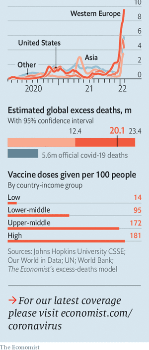  

#### 1.2 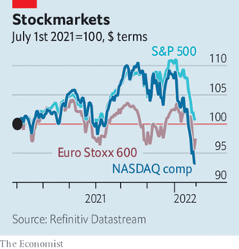  

#### 1.3 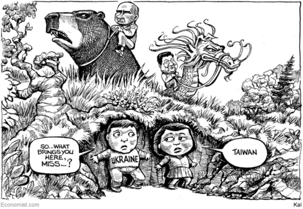  

### 2. Leaders
#### 2.1 _Russia’s roulette:_ [A war in Ukraine could have global consequences](https://www.economist.com/leaders/2022/01/29/a-war-in-ukraine-could-have-global-consequences)  
Human suffering, economic shock and a geopolitical realignment  

#### 2.2 _A turning point:_ [Markets have fallen because the era of free money is coming to an end](https://www.economist.com/leaders/2022/01/29/markets-have-fallen-because-the-era-of-free-money-is-coming-to-an-end)  
Tighter money means financial volatility and economic uncertainty  
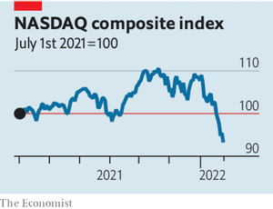  

#### 2.3 _Out of mind:_ [Myanmar’s grinding conflict is at risk of being forgotten](https://www.economist.com/leaders/2022/01/29/myanmars-grinding-conflict-is-at-risk-of-being-forgotten)  
Its neighbours should do much more to encourage the generals to change course  

#### 2.4 _All-consuming:_ [In defence of the consumer welfare standard](https://www.economist.com/leaders/2022/01/29/in-defence-of-the-consumer-welfare-standard)  
Competition policy should promote consumer welfare. But it should do so more competently  

#### 2.5 _American drugs policy:_ [Psychedelic therapy shows great promise. More states should legalise it](https://www.economist.com/leaders/2022/01/29/psychedelic-therapy-shows-great-promise-more-states-should-legalise-it)  
Oregon’s trailblazing sets a fine example  

### 3. Letters
#### 3.1 _On Russia and Ukraine, Herbert von Karajan, Galicia, Mexican energy, blockchain, Boris Johnson:_ [Letters to the editor](https://www.economist.com/letters/2022/01/29/letters-to-the-editor)  
A selection of correspondence  

### 4. Briefing
#### 4.1 _A question the size of an army:_ [What are Vladimir Putin’s military intentions in Ukraine?](https://www.economist.com/briefing/2022/01/29/what-are-vladimir-putins-military-intentions-in-ukraine)  
Only he can say  
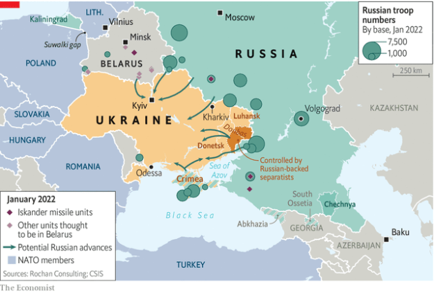  
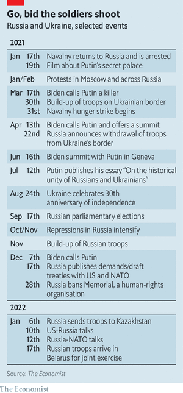  

### 5. Europe
#### 5.1 _Putin’s energy weapon:_ [How will Europe cope if Russia cuts off its gas?](https://www.economist.com/europe/2022/01/29/how-will-europe-cope-if-russia-cuts-off-its-gas)  
Better than you might think  
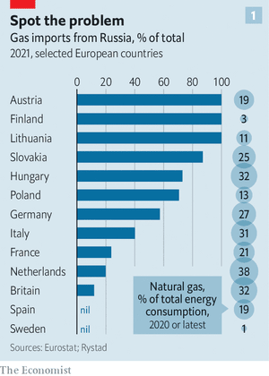  
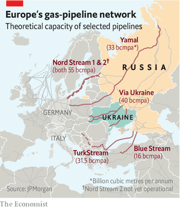  
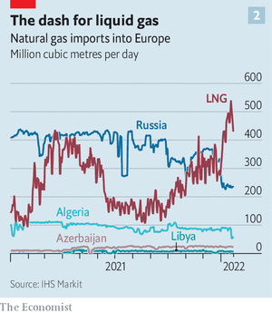  

#### 5.2 _Misplaced sympathy:_ [Germany’s new chancellor dithers in the face of Russia’s threats](https://www.economist.com/europe/germanys-new-chancellor-hesitates-in-the-face-of-russias-threats/21807378)  
But Olaf Scholz is starting to firm up  

#### 5.3 _Monumental mistakes:_ [As the pandemic raged, Europe bulldozed historic buildings](https://www.economist.com/europe/2022/01/29/as-the-pandemic-raged-europe-bulldozed-historic-buildings)  
While people were locked down, their heritage was knocked down  

#### 5.4 _Road-testing the French dream:_ [Macron’s path to re-election runs through France’s outer suburbs](https://www.economist.com/europe/2022/01/29/macrons-path-to-re-election-runs-through-frances-outer-suburbs)  
Swing voters love cars but can’t afford electric ones  

#### 5.5 _Charlemagne:_ [Peace and order reign in the EU, but seldom near it](https://www.economist.com/europe/2022/01/29/peace-and-order-reign-in-the-eu-but-seldom-near-it)  
Why a rich club has such turbulent neighbours  

### 6. Britain
#### 6.1 _Yes man:_ [Boris Johnson, the prime minister who can’t say no](https://www.economist.com/britain/2022/01/27/boris-johnson-the-prime-minister-who-cant-say-no)  
His future depends on his party indulging him, as he has indulged it  

#### 6.2 _Buzzkill:_ [The Bank of England is determined to prevent a wage-price spiral](https://www.economist.com/britain/2022/01/27/the-bank-of-england-is-determined-to-prevent-a-wage-price-spiral)  
Higher inflation is coming. But monetary policymakers are determined to keep it under control  
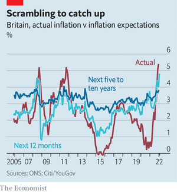  

#### 6.3 _Brexit and Northern Ireland:_ [Little sign of compromise over the Northern Ireland protocol](https://www.economist.com/britain/2022/01/29/little-sign-of-compromise-over-the-northern-ireland-protocol)  
Hopes of an early deal are likely to be dashed  

#### 6.4 _Silver linings playbook:_ [Britain has long been a leader in genome-sequencing](https://www.economist.com/britain/2022/01/26/britain-has-long-been-a-leader-in-genome-sequencing/21807380)  
The pandemic has increased its prowess  

#### 6.5 _State of emergency:_ [Brexit and covid-19 have produced a bigger civil service](https://www.economist.com/britain/2022/01/29/brexit-and-covid-19-have-produced-a-bigger-civil-service)  
It has also become more metropolitan  
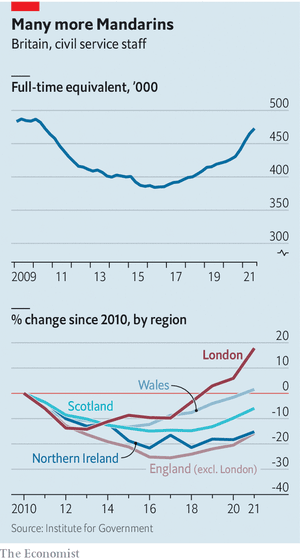  

#### 6.6 _The City of London:_ [Britain’s newly listed tech firms are taking a beating](https://www.economist.com/britain/2022/01/29/britains-newly-listed-tech-firms-are-taking-a-beating)  
They are suffering far more than their peers elsewhere  
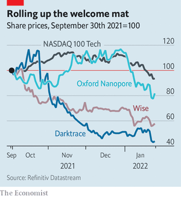  

#### 6.7 _Resident weevil:_ [After more than two decades, Britain is finally rid of termites](https://www.economist.com/britain/2022/01/29/after-more-than-two-decades-britain-is-finally-rid-of-termites)  
Globalisation makes infestations more likely  

#### 6.8 _Bagehot:_ [Boris Johnson is making boring politics look attractive](https://www.economist.com/britain/2022/01/29/boris-johnson-is-making-boring-politics-look-attractive)  
All the chaos is putting voters in the mood for calm  

### 7. Middle East & Africa
#### 7.1 _The juntas and the hunted:_ [A coup in Burkina Faso will help the Sahel’s jihadists](https://www.economist.com/middle-east-and-africa/2022/01/29/a-coup-in-burkina-faso-will-help-the-sahels-jihadists)  
Military rule will exacerbate the problems that have allowed extremism to thrive  
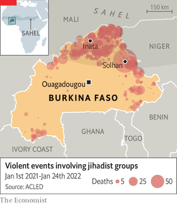  

#### 7.2 _Market preacher:_ [Uganda’s most influential economist has died](https://www.economist.com/middle-east-and-africa/2022/01/27/ugandas-most-influential-economist-has-died)  
Emmanuel Tumusiime-Mutebile tamed inflation and let markets loose  
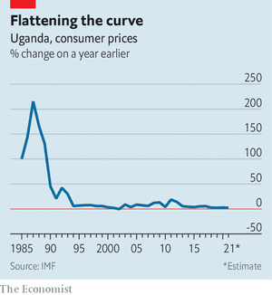  

#### 7.3 _UAVs over the UAE:_ [The war in Yemen reaches Abu Dhabi](https://www.economist.com/middle-east-and-africa/2022/01/29/the-war-in-yemen-reaches-abu-dhabi)  
Drone and missile strikes threaten the UAE’s reputation as a haven of stability  

#### 7.4 _Jailhouse rocked:_ [A prison battle in Syria was a disaster long foretold](https://www.economist.com/middle-east-and-africa/2022/01/29/a-prison-battle-in-syria-was-a-disaster-long-foretold)  
Hundreds of jihadists were left in a poorly guarded prison. What could go wrong?  

#### 7.5 _Lockdown love:_ [Why some Saudi couples welcomed the pandemic](https://www.economist.com/middle-east-and-africa/2022/01/29/why-some-saudi-couples-welcomed-the-pandemic)  
Covid-19 has made weddings a whole lot cheaper  

### 8. United States
#### 8.1 _Vacancy on the Supreme Court:_ [Justice Stephen Breyer retires after almost 28 years on the Supreme Court](https://www.economist.com/united-states/justice-stephen-breyer-retires-after-almost-28-years-on-americas-supreme-court/21807405)  
Joe Biden has said he will choose a black woman as the liberal jurist’s successor  

#### 8.2 _New York gun violence:_ [Eric Adams unveils his blueprint to help New York tackle violence](https://www.economist.com/united-states/2022/01/29/eric-adams-unveils-his-blueprint-to-help-new-york-tackle-violence)  
It will involve more than just robust policing  

#### 8.3 _Insider trading:_ [Claims of insider trading in Washington spur efforts to stop it](https://www.economist.com/united-states/allegations-of-insider-trading-in-washington-spur-new-efforts-to-stop-it/21807367)  
A backlash against Capitol gains  

#### 8.4 _Sports betting:_ [A ballot fight over sports gambling in California has high stakes](https://www.economist.com/united-states/2022/01/29/a-ballot-fight-over-sports-gambling-in-california-has-high-stakes)  
Small casinos may well lose out  

#### 8.5 _Autopsies and covid-19:_ [America’s elected coroners are too often a public-health liability](https://www.economist.com/united-states/2022/01/29/americas-elected-coroners-are-too-often-a-public-health-liability)  
The politics of death  

#### 8.6 _Turn on, tune in:_ [Sensible policy on psychedelic drugs is growing more common](https://www.economist.com/united-states/2022/01/29/sensible-policy-on-psychedelic-drugs-is-growing-more-common)  
They show tremendous potential in treating certain mental-health disorders  

#### 8.7 _Lexington:_ [Environmental justice in the balance](https://www.economist.com/united-states/2022/01/29/environmental-justice-in-the-balance)  
The case for pursuing civil rights and climate policy in tandem has been oversold  

### 9. The Americas
#### 9.1 _Mad existence:_ [The IMF cannot solve Argentina’s dysfunction](https://www.economist.com/the-americas/2022/01/29/the-imf-cannot-solve-argentinas-dysfunction)  
Only a change in Argentine policies can wrench the country from its century-long malaise  
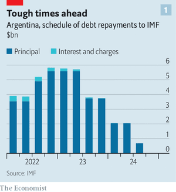  
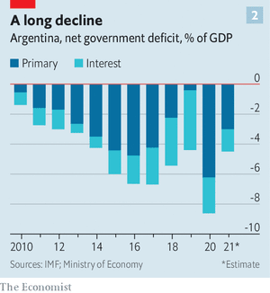  

#### 9.2 _Talk talk:_ [What a rare word for “sex” reveals about Brazilian Portuguese](https://www.economist.com/the-americas/2022/01/29/what-a-rare-word-for-sex-reveals-about-brazilian-portuguese)  
Brazilians innovate by duplicating  
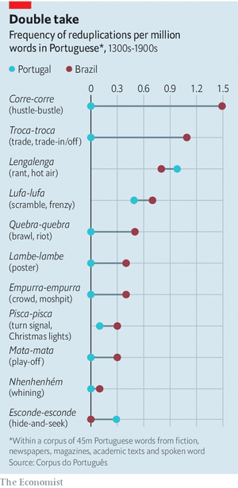  

#### 9.3 _Bello:_ [Russia has become a crucial ally of Venezuela’s dictatorship](https://www.economist.com/the-americas/2022/01/29/russia-has-become-a-crucial-ally-of-venezuelas-dictatorship)  
Vladimir Putin has propped it up with some 200 agreements  

### 10. Asia
#### 10.1 _The enemy of my enemy:_ [Myanmar’s generals have united the country—against themselves](https://www.economist.com/asia/2022/01/29/myanmars-generals-have-united-the-country-against-themselves)  
A year since taking power, the junta is fighting on more fronts than ever before  
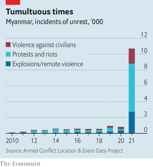  
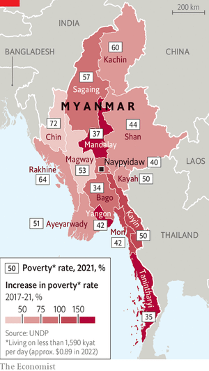  

#### 10.2 _Khyber crevasse:_ [Afghans are more pessimistic about their future than ever](https://www.economist.com/asia/2022/01/29/afghans-are-more-pessimistic-about-their-future-than-ever)  
A new survey paints a grim picture of life under the Taliban  
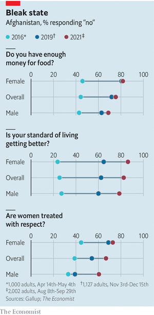  

#### 10.3 _Demographic dance:_ [How Kazakhstan became more Kazakh](https://www.economist.com/asia/2022/01/29/how-kazakhstan-became-more-kazakh)  
Money for migration changed the face of a nation  

#### 10.4 _Banyan:_ [How sanctions really can improve respect for human rights](https://www.economist.com/asia/2022/01/29/how-sanctions-really-can-improve-respect-for-human-rights)  
Bangladesh’s elites and security forces are rattled by American measures  

### 11. China
#### 11.1 _Faster, higher, bossier:_ [China is determined to make the Winter Olympics go smoothly](https://www.economist.com/china/china-is-determined-to-make-the-winter-olympics-go-smoothly/21807403)  
It must cope with boycotts, covid and the unexpected  

#### 11.2 _Chaguan:_ [What China thinks of possible war in Ukraine](https://www.economist.com/china/2022/01/29/what-china-thinks-of-possible-war-in-ukraine)  
Shared hostility to America makes China close to Russia, but cautious  

### 12. International
#### 12.1 _Game of chiplomacy:_ [Will China dominate the world of semiconductors?](https://www.economist.com/international/2022/01/29/will-china-dominate-the-world-of-semiconductors)  
America and its allies are crafting rules to try to prevent it  
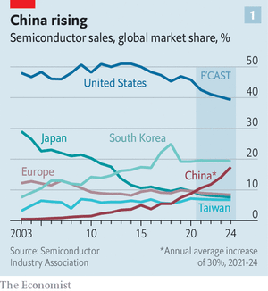  
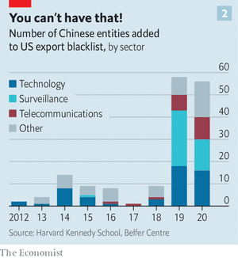  

### 13. Technology Quarterly
#### 13.1 _Like smartphones, but lethal:_ [The technology of seeing and shooting your enemies](https://www.economist.com/technology-quarterly/2022/01/29/the-technology-of-seeing-and-shooting-your-enemies)  
War among the sensors poses new challenges, says Shashank Joshi  
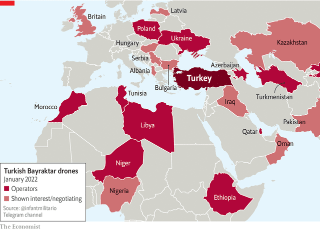  

#### 13.2 _All the targets, all the time:_ [Synthetic-aperture radar is making the Earth’s surface watchable 24/7](https://www.economist.com/technology-quarterly/2022/01/29/synthetic-aperture-radar-is-making-the-earths-surface-watchable-24/7)  
Cloud cover and the dark of the Moon matter no more  
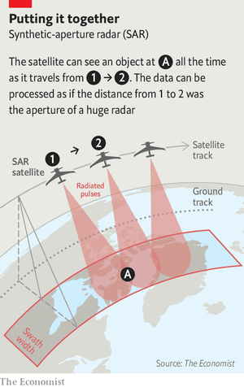  

#### 13.3 _See-through seas:_ [Finding submarines is likely to get easier](https://www.economist.com/technology-quarterly/2022/01/27/finding-submarines-is-likely-to-get-easier)  
But it will still be hard, and some waters will remain inviolable  
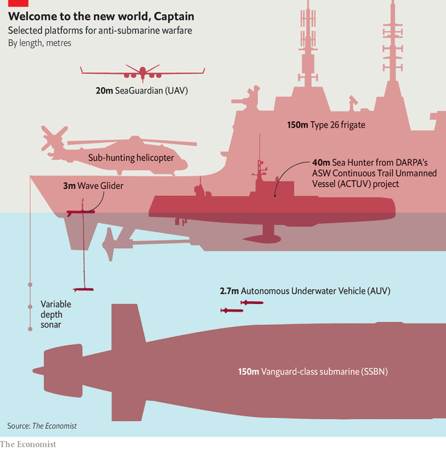  

#### 13.4 _Lots of signal, lots of noise:_ [Where to process data, and how to add them up](https://www.economist.com/technology-quarterly/2022/01/29/where-to-process-data-and-how-to-add-them-up)  
The dark art of data fusion  

#### 13.5 _Fierce contests:_ [Deception and destruction can still blind the enemy](https://www.economist.com/technology-quarterly/2022/01/27/deception-and-destruction-can-still-blind-the-enemy)  
Many outcomes will still remain uncertain  

### 14. Business
#### 14.1 _Rewebbing the net:_ [Will web3 reinvent the internet business?](https://www.economist.com/business/2022/01/29/will-web3-reinvent-the-internet-business)  
In parts, yes. But probably not as sweepingly as its boosters reckon  
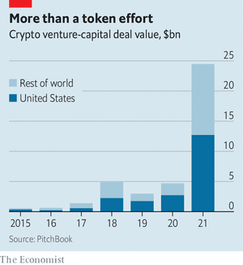  

#### 14.2 _Ich bin ein coder:_ [What if all workers wrote software, not just the geek elite?](https://www.economist.com/business/2022/01/29/what-if-all-workers-wrote-software-not-just-the-geek-elite)  
Citizen developers are rapidly becoming the vanguard of corporate digitisation  

#### 14.3 _In short supply:_ [Why supply-chain problems aren’t going away](https://www.economist.com/business/2022/01/29/why-supply-chain-problems-arent-going-away)  
Results season shows the financial effects of supply-chain snarl-ups on industrial firms  
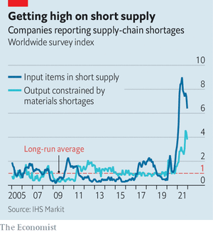  

#### 14.4 _Bartleby:_ [Purpose and the employee](https://www.economist.com/business/2022/01/29/purpose-and-the-employee)  
Some people want to change the world. But not everyone  

#### 14.5 _After the party:_ [When will the semiconductor cycle peak?](https://www.economist.com/business/2022/01/29/when-will-the-semiconductor-cycle-peak)  
Busts follow booms in the chip business. Governments could make things worse  
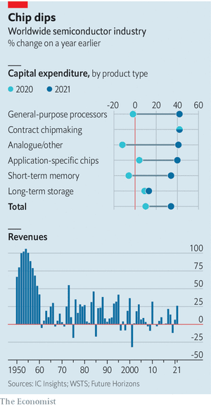  

#### 14.6 _Schumpeter:_ [Lakshmi Mittal transformed steelmaking. Can his son do it again?](https://www.economist.com/business/2022/01/29/lakshmi-mittal-transformed-steelmaking-can-his-son-do-it-again)  
Decarbonising steel will require masses of government support  

### 15. Finance & economics
#### 15.1 _Forward in fear:_ [The reasons behind the stockmarket turmoil](https://www.economist.com/finance-and-economics/the-reasons-behind-the-current-stockmarket-turmoil/21807379)  
From Fed tightening to rising wage costs, investors see gloomy prospects ahead  
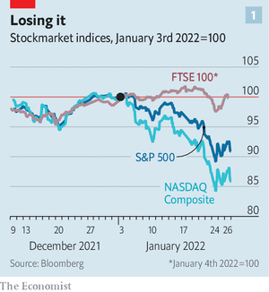  
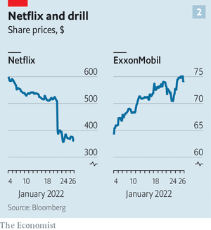  

#### 15.2 _Material moves:_ [Commodities traders brace for a war in Ukraine](https://www.economist.com/finance-and-economics/commodities-traders-brace-for-a-war-in-ukraine/21807404)  
Tight markets mean that prices are all too responsive to rising tensions  
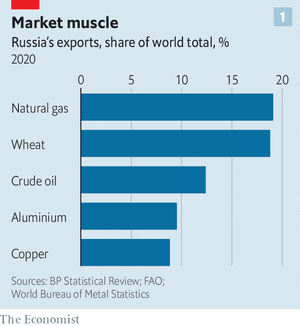  
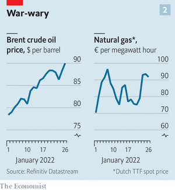  

#### 15.3 _Acquired immunity:_ [How is Omicron affecting the global economic recovery?](https://www.economist.com/finance-and-economics/how-is-omicron-affecting-the-global-economic-recovery/21807361)  
High-frequency data suggest the effect may be limited—and short-lived  
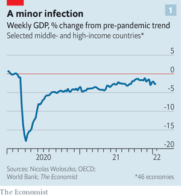  
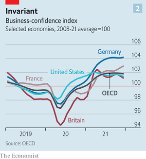  

#### 15.4 _Rescue mission:_ [Has Deutsche Bank turned the corner?](https://www.economist.com/finance-and-economics/2022/01/29/has-deutsche-bank-turned-the-corner)  
Investors seem to think the bank has stabilised at last  

#### 15.5 _MoneyToks:_ [Personal finance is a hit on TikTok](https://www.economist.com/finance-and-economics/2022/01/29/personal-finance-is-a-hit-on-tiktok)  
One survey suggests nearly a quarter of young American investors have used it for financial advice  

#### 15.6 _Free exchange:_ [Quantitative tightening is no substitute for higher interest rates](https://www.economist.com/finance-and-economics/2022/01/29/quantitative-tightening-is-no-substitute-for-higher-interest-rates)  
Reversing trillions of dollars of asset purchases may prove to be an unreliable tool  

### 16. Science & technology
#### 16.1 _eVTOLs:_ [Flying taxis are lining up for certification](https://www.economist.com/science-and-technology/flying-taxis-are-lining-up-for-certification/21807390)  
A Chinese firm may be first past the post  
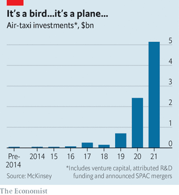  

#### 16.2 _Data privacy:_ [The UN is testing technology that processes data confidentially](https://www.economist.com/science-and-technology/the-un-is-testing-technology-that-processes-data-confidentially/21807385)  
How to analyse data without revealing their secrets  

#### 16.3 _Conservation:_ [Save the rhino, save the plant](https://www.economist.com/science-and-technology/save-the-rhino-save-the-plant/21807386)  
Sumatran rhinos spread seeds. Without them some plants may vanish  

#### 16.4 _Photography:_ [A new type of camera](https://www.economist.com/science-and-technology/a-new-type-of-camera/21807384)  
It could prove invaluable for robots, drones and driverless cars  

### 17. Culture
#### 17.1 _The reflective screen:_ [A history of the BBC makes for a fine history of the British](https://www.economist.com/culture/2022/01/29/a-history-of-the-bbc-makes-for-a-fine-history-of-the-british)  
Television casts a revealing light on its audience  

#### 17.2 _Finely spun yarns:_ [In “Worn”, a clothes maven finds out where they come from](https://www.economist.com/culture/2022/01/29/in-worn-a-clothes-maven-finds-out-where-they-come-from)  
Sofi Thanhauser explores the links between producers of cloth and consumers  

#### 17.3 _Home Entertainment:_ [To understand the Roman empire, read Pliny the Younger](https://www.economist.com/culture/2022/01/29/to-understand-the-roman-empire-read-pliny-the-younger)  
His letters contain fascinating observations on everyday life—and the joys of remote work  

#### 17.4 _Musical posterity:_ [Handel’s contemporaries shunned “Theodora”. But it is a masterpiece](https://www.economist.com/culture/2022/01/29/handels-contemporaries-shunned-theodora-but-it-is-a-masterpiece)  
After more than 270 years, a great oratorio returns to Covent Garden  

#### 17.5 _Billionaires and inequality:_ [“Davos Man” is a passionate denunciation of the mega-rich](https://www.economist.com/culture/2022/01/29/davos-man-is-a-passionate-denunciation-of-the-mega-rich)  
But Peter Goodman overstates his case  

#### 17.6 _Johnson:_ [Losing native languages is painful. But they can be recovered](https://www.economist.com/culture/2022/01/29/losing-native-languages-is-painful-but-they-can-be-recovered)  
In “Memory Speaks”, Julie Sedivy explores both experiences  

### 18. Economic & financial indicators
#### 18.1 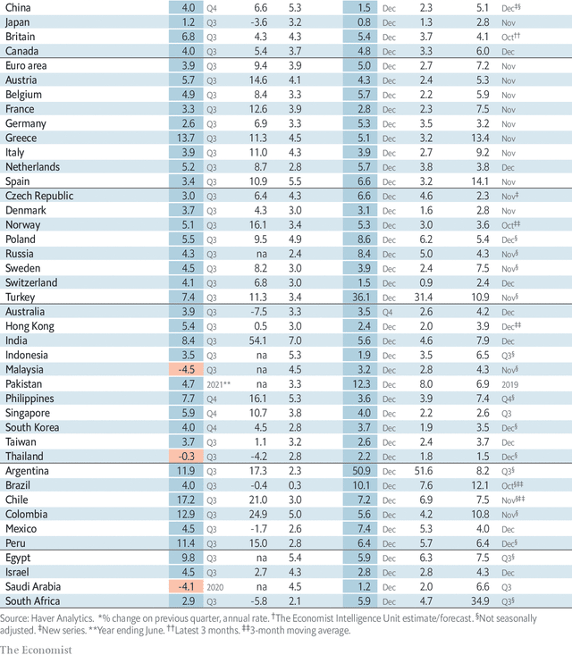  
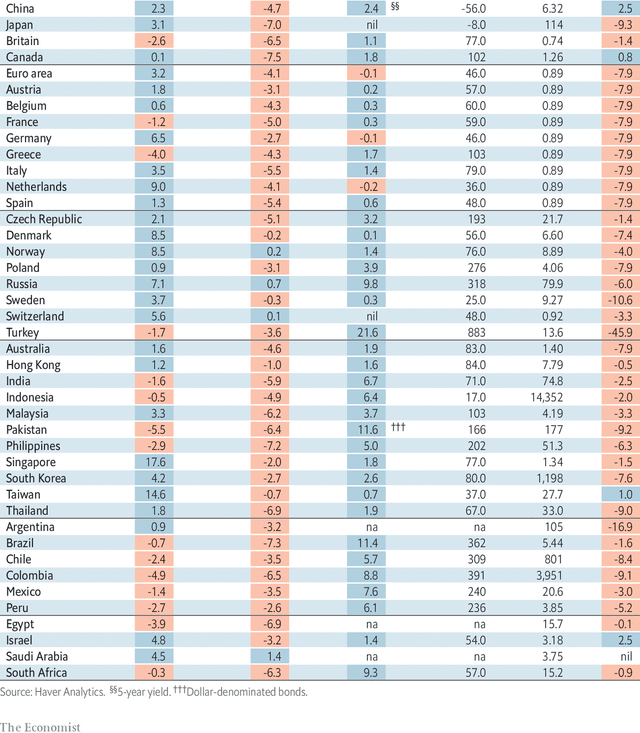  
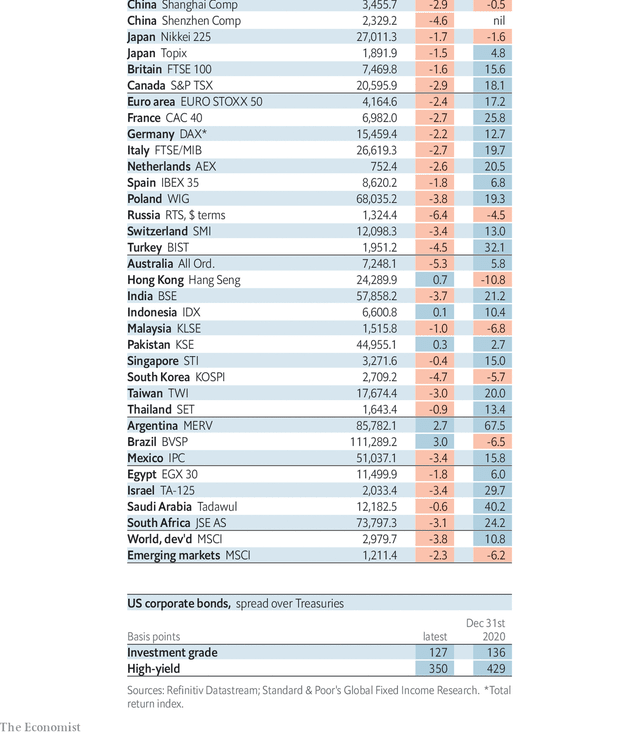  
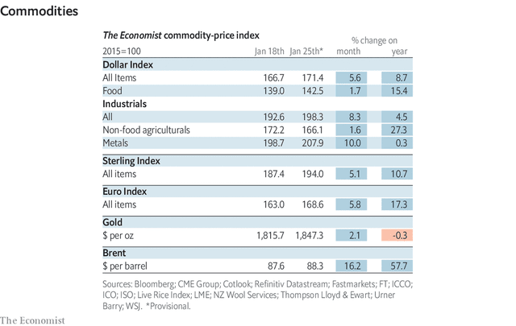  

### 19. Graphic detail
#### 19.1 _Singing in tongues:_ [What Spotify data show about the decline of English](https://www.economist.com/graphic-detail/2022/01/29/what-spotify-data-show-about-the-decline-of-english)  
Our interactive analysis of five years of hits in 70 countries—and the links between them  

### 20. Obituary
#### 20.1 _The time is now:_ [Thich Nhat Hanh believed that Buddhism should be a force for change](https://www.economist.com/obituary/2022/01/29/thich-nhat-hanh-believed-that-buddhism-should-be-a-force-for-change)  
The Vietnamese monk and “father of mindfulness” died on January 22nd, aged 95  

