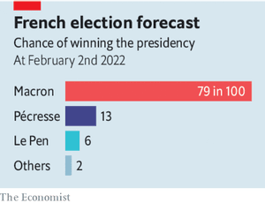
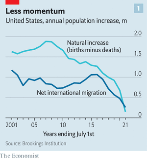

### 1. The world this week
#### 1.1   

#### 1.2 
#### 1.3   

### 2. Leaders
#### 2.1 _How high will central banks go?:_ [Interest rates may have to rise sharply to fight inflation](https://www.economist.com/leaders/2022/02/05/interest-rates-may-have-to-rise-sharply-to-fight-inflation)  
But the low-rate era is unlikely to come to a permanent end  

#### 2.2 _Statistically significant:_ [The Economist’s election modelling should cheer Emmanuel Macron](https://www.economist.com/leaders/2022/02/05/the-economists-election-modelling-should-cheer-emmanuel-macron)  
France’s president has a 79% chance of keeping his job  
  

#### 2.3 _An icy chasm:_ [Beijing’s Winter Olympics symbolise a world divided](https://www.economist.com/leaders/2022/02/03/beijings-winter-olympics-symbolise-a-world-divided)  
The West has rightly concluded that buttering up China will not make it nicer  

#### 2.4 _Free speech’s new frontier:_ [What Spotify should learn from the Joe Rogan affair](https://www.economist.com/leaders/what-spotify-should-learn-from-the-joe-rogan-affair/21807509)  
The content-moderation wars have come to audio  

#### 2.5 _Wrong man, wrong plan:_ [The British government’s white paper on “levelling up” falls short](https://www.economist.com/leaders/2022/02/05/the-british-governments-white-paper-on-levelling-up-falls-short)  
It fails to devolve enough power and money  

### 3. Letters
#### 3.1 _On vaccine protests, the BBC, curling, quadratic voting, tipping:_ [Letters to the editor](https://www.economist.com/letters/2022/02/04/letters-to-the-editor)  
A selection of correspondence  

### 4. Briefing
#### 4.1 _Turning Japanese:_ [Why the world is saving too much money for its own good](https://www.economist.com/briefing/2022/02/05/why-the-world-is-saving-too-much-money-for-its-own-good)  
And why the pandemic is unlikely to change that  
  
  
  

### 5. Europe
#### 5.1 _A four-in-five chance:_ [Emmanuel Macron is highly likely to be re-elected as France’s president](https://www.economist.com/europe/emmanuel-macron-is-highly-likely-to-be-re-elected-as-frances-president/21807489)  
The Economist’s election model derives probabilities from the polls and past experience  
  

#### 5.2 _Blood hype:_ [Why Ukraine’s president is talking down the threat from Russia](https://www.economist.com/europe/why-ukraines-president-is-talking-down-the-threat-from-russia/21807491)  
Volodymyr Zelensky’s call for calm rubs America the wrong way  

#### 5.3 _Who’s next?:_ [As Russia menaces Ukraine, eastern European countries grow nervous](https://www.economist.com/europe/2022/02/05/as-russia-menaces-ukraine-eastern-european-countries-grow-nervous)  
Even relatively friendly countries in the region mistrust Russian expansionism  

#### 5.4 _Caucasian thaw:_ [The Turkey-Armenia relationship is thawing](https://www.economist.com/europe/2022/02/03/the-turkey-armenia-relationship-is-thawing)  
But normalisation will not mean reconciliation  
  

#### 5.5 _Charlemagne:_ [Southern Europe is reforming itself](https://www.economist.com/europe/2022/02/03/southern-europe-is-reforming-itself)  
The old PIGS are airborne, even as northern countries fall to earth  

### 6. Britain
#### 6.1 _Levelling up:_ [The British government’s “levelling up” plans are oddly old-fashioned](https://www.economist.com/britain/2022/02/05/the-british-governments-levelling-up-plans-are-oddly-old-fashioned)  
Targets, targets everywhere  
  

#### 6.2 _Digging deep:_ [A quixotic plan to roll back EU law](https://www.economist.com/britain/2022/02/05/a-quixotic-plan-to-roll-back-eu-law)  
It risks greater executive power, and confusion in court  

#### 6.3 _HP v Autonomy:_ [Mike Lynch has lost Britain’s biggest fraud case](https://www.economist.com/britain/2022/02/05/mike-lynch-has-lost-britains-biggest-fraud-case)  
As extradition to America looms, he will not be the only one with regrets  

#### 6.4 _To infinity and beyond:_ [The government is promising to tackle the NHS backlog](https://www.economist.com/britain/2022/02/03/the-government-is-promising-to-tackle-the-nhs-backlog)  
Without proper workforce planning, it will fail  

#### 6.5 _Scrolling through:_ [The laws are being removed from Parliament](https://www.economist.com/britain/2022/02/03/the-laws-are-being-removed-from-parliament)  
The symbolism is unfortunate; the rationale is sound  

#### 6.6 _The pandemic generation:_ [Some British children have been changed by covid-19, probably for good](https://www.economist.com/britain/2022/02/04/some-british-children-have-been-changed-by-covid-19-probably-for-good)  
Strangers to mathematics, and to sex  
  

#### 6.7 _Bagehot:_ [Sue Gray delivers a first report on those Downing Street parties](https://www.economist.com/britain/sue-gray-delivers-a-first-report-on-those-downing-street-parties/21807483)  
Every part of the British establishment has debased itself  

### 7. Middle East & Africa
#### 7.1 _Rise and shine:_ [The president of Egypt does a U-turn on economic policy](https://www.economist.com/middle-east-and-africa/2022/02/05/the-president-of-egypt-does-a-u-turn-on-economic-policy)  
Abdel-Fattah al-Sisi suddenly wants to empower the private sector  
  

#### 7.2 _Grains of wrath:_ [How tensions in Ukraine could rile Egypt](https://www.economist.com/middle-east-and-africa/2022/02/03/how-tensions-in-ukraine-could-rile-egypt)  
A disruption in the wheat market would cause serious harm to the biggest Arab country  

#### 7.3 _Pushers and putschists:_ [Guinea-Bissau sees off an attempted coup](https://www.economist.com/middle-east-and-africa/2022/02/03/guinea-bissau-sees-off-an-attempted-coup)  
The president says it was linked to the powerful drug trade  
  

#### 7.4 _Pipe dreams:_ [A big Ugandan oil project is progressing at last](https://www.economist.com/middle-east-and-africa/2022/02/05/a-big-ugandan-oil-project-is-progressing-at-last)  
But in a world moving away from oil, does it still make sense?  
  

#### 7.5 _A continuing horror:_ [Child rape is far too common in some war-torn African countries](https://www.economist.com/middle-east-and-africa/2022/02/03/child-rape-is-far-too-common-in-some-war-torn-african-countries)  
Trauma, social breakdown and impunity all seem to play a role  

### 8. United States
#### 8.1 _“Freedom First”:_ [Why Florida is lurching to the right](https://www.economist.com/united-states/2022/02/05/why-florida-is-lurching-to-the-right)  
Ron DeSantis uses his state as a peninsula podium to advertise his policies  

#### 8.2 _Preschool education:_ [A new study finds preschool can be detrimental to children](https://www.economist.com/united-states/2022/02/03/a-new-study-finds-preschool-can-be-detrimental-to-children)  
But the picture may not be as gloomy as it seems  
  

#### 8.3 _Abortion by mail in America:_ [A safe and simple abortion option becomes more readily available](https://www.economist.com/united-states/2022/02/03/a-safe-and-simple-abortion-option-becomes-more-readily-available)  
If the Supreme Court ends Roe, the benefits of abortion-by-mail will be even more obvious  

#### 8.4 _Drought victim:_ [The loneliness of the desert tortoise](https://www.economist.com/united-states/2022/02/05/the-loneliness-of-the-desert-tortoise)  
A once-abundant species struggles to survive  

#### 8.5 _Crypto and the far right:_ [The charm of cryptocurrencies for white supremacists](https://www.economist.com/united-states/2022/02/05/the-charm-of-cryptocurrencies-for-white-supremacists)  
White power, dark money  

#### 8.6 _The US census:_ [America is stagnating—demographically, that is](https://www.economist.com/united-states/2022/02/05/america-is-stagnating-demographically-that-is)  
A decline in birth rate and immigration is making the country more European  
  
  

#### 8.7 _Lexington:_ [America is uniting against Vladimir Putin](https://www.economist.com/united-states/2022/02/05/america-is-uniting-against-vladimir-putin)  
Republicans are playing a more constructive role in the Ukraine crisis than Donald Trump must like  

### 9. The Americas
#### 9.1 _Aiding and abetting:_ [Foreign aid has done little to help Haiti](https://www.economist.com/the-americas/2022/02/05/foreign-aid-has-done-little-to-help-haiti)  
By avoiding giving the government money, donors undermine it  
  

#### 9.2 _A populist turn:_ [Erin O’Toole is voted out as Canada’s Conservative leader](https://www.economist.com/the-americas/2022/02/05/erin-otoole-is-voted-out-as-canadas-conservative-leader)  
A week after protests in Ottawa, it suggests that a new kind of right wing is ascendant  

#### 9.3 _Bello:_ [Argentina’s Peronists squabble over an agreement with the IMF](https://www.economist.com/the-americas/2022/02/05/argentinas-peronists-squabble-over-an-agreement-with-the-imf)  
Even after two years of negotiations, the government still has a way to go  

### 10. Asia
#### 10.1 _Out of office:_ [South-East Asia’s tourism industry is hobbled by uncertainty](https://www.economist.com/asia/2022/02/03/south-east-asias-tourism-industry-is-hobbled-by-uncertainty)  
Labour shortages and changing border rules are causing chaos for businesses  

#### 10.2 _Forest grumps:_ [India’s government and its greens disagree on what counts as forest](https://www.economist.com/asia/2022/02/05/indias-government-and-its-greens-disagree-on-what-counts-as-forest)  
An official report includes plantations and parks in its measure  

#### 10.3 _A nation of holdouts:_ [Papua New Guinea’s vaccination rate is only 3.3%](https://www.economist.com/asia/2022/02/05/papua-new-guineas-vaccination-rate-is-only-33)  
Online misinformation, like covid-19, reaches even the remotest places  

#### 10.4 _New year fireworks:_ [What is behind North Korea’s flurry of missile tests?](https://www.economist.com/asia/2022/02/03/what-is-behind-north-koreas-flurry-of-missile-tests)  
Kim Jong Un fired more rockets in January than any month on record  
  

#### 10.5 _Mujin tonic:_ [Japan is searching for the secrets to healthy old age](https://www.economist.com/asia/2022/02/05/japan-is-searching-for-the-secrets-to-healthy-old-age)  
Living longer is of little use if the extra years are spent in bed  

#### 10.6 _Banyan:_ [Myanmar’s generals have a dubious role model in Thailand](https://www.economist.com/asia/2022/02/03/myanmars-generals-have-a-dubious-role-model-in-thailand)  
One’s stagnation is better than the other’s disintegration, but that is a low bar  

### 11. China
#### 11.1 _Virtual state of control:_ [Building a metaverse with Chinese characteristics](https://www.economist.com/china/2022/02/03/building-a-metaverse-with-chinese-characteristics)  
The Communist Party may see it as an area it can beat the West  

#### 11.2 _Not home for the holidays:_ [Chinese New Year is disrupted for a third year](https://www.economist.com/china/2022/02/03/chinese-new-year-is-disrupted-for-a-third-year)  
And the economy is feeling the pinch  

#### 11.3 _Chaguan:_ [Nixon’s visit to China, 50 years on](https://www.economist.com/china/2022/02/03/nixons-visit-to-china-50-years-on)  
Eye-witnesses from 1972 offer their views of a relationship in bad shape  

### 12. International
#### 12.1 _Just keep us alive:_ [Covid-19 has pushed governments to find new ways to help the poor](https://www.economist.com/international/2022/02/04/covid-19-has-pushed-governments-to-find-new-ways-to-help-the-poor)  
Even some of the least developed countries are experimenting  
  
  

### 13. Business
#### 13.1 _We’re hiring:_ [How America’s talent wars are reshaping business](https://www.economist.com/business/2022/02/05/how-americas-talent-wars-are-reshaping-business)  
The labour shortages are forcing firms to get creative  
  
  

#### 13.2 _Depopulation pressure:_ [How German companies court employees](https://www.economist.com/business/2022/02/05/how-german-companies-court-employees)  
The pandemic has exacerbated the long-term problem of a shrinking workforce  

#### 13.3 _The hills are alive:_ [China’s ski industry faces an avalanche of risks](https://www.economist.com/business/2022/02/05/chinas-ski-industry-faces-an-avalanche-of-risks)  
Developers have ploughed mountains of money into the snow business. Will it melt away?  

#### 13.4 _Don’t know what you’ve got ’til it’s gone:_ [Spotify, Joe Rogan and the Wild West of online audio](https://www.economist.com/business/spotify-joe-rogan-and-the-wild-west-of-online-audio/21807494)  
Streamers look increasingly like social media, but without the content controls  

#### 13.5 _Bartleby:_ [Body language in the post-pandemic workplace](https://www.economist.com/business/2022/02/05/body-language-in-the-post-pandemic-workplace)  
Much of the research into non-verbal communication is now redundant  

#### 13.6 _Schumpeter:_ [How Sony can make a comeback in the console wars](https://www.economist.com/business/2022/02/04/how-sony-can-make-a-comeback-in-the-console-wars)  
It could be an Epic battle  

### 14. Finance & economics
#### 14.1 _The urge to splurge:_ [Why the impressive pace of investment growth looks likely to endure](https://www.economist.com/finance-and-economics/2022/02/05/why-the-impressive-pace-of-investment-growth-looks-likely-to-endure)  
Supply chains, technological change and climate targets will all demand more capital spending in the 2020s  
  

#### 14.2 _Taking aim:_ [America prepares the “mother of all sanctions” against Russia](https://www.economist.com/finance-and-economics/america-prepares-the-mother-of-all-sanctions-against-russia/21807487)  
How much would they hurt?  

#### 14.3 _A slippery patch:_ [OPEC grapples with a precariously balanced oil market](https://www.economist.com/finance-and-economics/opec-grapples-with-a-precariously-balanced-oil-market/21807510)  
Geopolitical drama and a tight market mean that a price of $100 per barrel could be on the cards  

#### 14.4 _The bill balloons:_ [The global interest bill is about to jump](https://www.economist.com/finance-and-economics/the-global-interest-bill-is-about-to-jump/21807488)  
The world paid $10trn in interest last year. As rates begin to rise, we work out where the bill might go  
  
  

#### 14.5 _The tiger roars:_ [Why India’s stockmarket is roaring](https://www.economist.com/finance-and-economics/2022/02/05/why-indias-stockmarket-is-roaring)  
After a desultory decade, profits are expected to surge  
  

#### 14.6 _Buttonwood:_ [Why stockmarket jitters have not so far spread to the credit market](https://www.economist.com/finance-and-economics/2022/02/04/why-stockmarket-jitters-have-not-so-far-spread-to-the-credit-market)  
Bond-holders tend to be less starry-eyed than stock investors. Still, there are reasons to be watchful  

#### 14.7 _Free exchange:_ [China may soon become a high-income country](https://www.economist.com/finance-and-economics/2022/02/05/china-may-soon-become-a-high-income-country)  
Has it truly escaped the middle-income trap?  
  

### 15. Science & technology
#### 15.1 _Faster, higher, stronger:_ [Why space is about to enter its nuclear age](https://www.economist.com/science-and-technology/why-space-is-about-to-enter-its-nuclear-age/21807486)  
Fission-powered engines would make satellites speedier and more manoeuvrable  

#### 15.2 _Scientific publishing:_ [Preprints on the coronavirus have been impressively reliable](https://www.economist.com/science-and-technology/preprints-on-the-coronavirus-have-been-impressively-reliable/21807492)  
The case for publishing in expensive, restrictive scientific journals continues to weaken  

#### 15.3 _Trypanophobics rejoice!:_ [A new way to deliver delicate drugs, no jabbing required](https://www.economist.com/science-and-technology/a-new-way-to-deliver-delicate-drugs-no-jabbing-required/21807493)  
It will be a relief for anyone who has a distaste for needles  

#### 15.4 _Climate change:_ [Targeting methane “ultra-emitters” could cheaply slow climate change](https://www.economist.com/science-and-technology/2022/02/05/targeting-methane-ultra-emitters-could-cheaply-slow-climate-change)  
Patching up leaky oil-and-gas works across the world would be a good place to start  
  

### 16. Culture
#### 16.1 _The megaphone and the muzzle:_ [A history of free expression charts its seesawing progress](https://www.economist.com/culture/2022/02/03/a-history-of-free-expression-charts-its-seesawing-progress)  
Repression leads to liberalisation and vice versa, says Jacob Mchangama  

#### 16.2 _The undiscovered country:_ [“This Mortal Coil” is a surprisingly upbeat history of death](https://www.economist.com/culture/2022/02/05/this-mortal-coil-is-a-surprisingly-upbeat-history-of-death)  
Andrew Doig’s study of how people die is a story of human ingenuity  

#### 16.3 _The house always wins:_ [Wall Street was the real winner of the GameStop saga](https://www.economist.com/culture/2022/02/05/wall-street-was-the-real-winner-of-the-gamestop-saga)  
Says Spencer Jakab in “The Revolution That Wasn’t”  

#### 16.4 _World in a dish:_ [Lucky new-year foods embody a benign view of good fortune](https://www.economist.com/culture/2022/02/05/lucky-new-year-foods-embody-a-benign-view-of-good-fortune)  
Steam a fish for abundance, and make sure there are leftovers  

#### 16.5 _Playground culture:_ [Covid-19 has given children new words and ideas to play with](https://www.economist.com/culture/2022/02/04/covid-19-has-given-children-new-words-and-ideas-to-play-with)  
The pandemic has made play at once more modern and more old-fashioned  

#### 16.6 _Back Story:_ [“Taras Bulba” and the tragedy of Russia and Ukraine](https://www.economist.com/culture/2022/02/05/taras-bulba-and-the-tragedy-of-russia-and-ukraine)  
Literature offers a better way to think about their vexed relations  

### 17. Economic & financial indicators
#### 17.1   
  
  
  

### 18. Graphic detail
#### 18.1 _Elysian stakes:_ [How we forecast the French election](https://www.economist.com/graphic-detail/how-we-forecast-the-french-election/21807484)  
We reveal our statistical model—and how it works  
  
  

### 19. Obituary
#### 19.1 _To sea in a barrel:_ [Jean-Jacques Savin wanted to defy old age](https://www.economist.com/obituary/2022/02/05/jean-jacques-savin-wanted-to-defy-old-age)  
The intrepid adventurer died on January 21st while rowing solo across the Atlantic, aged 75  

