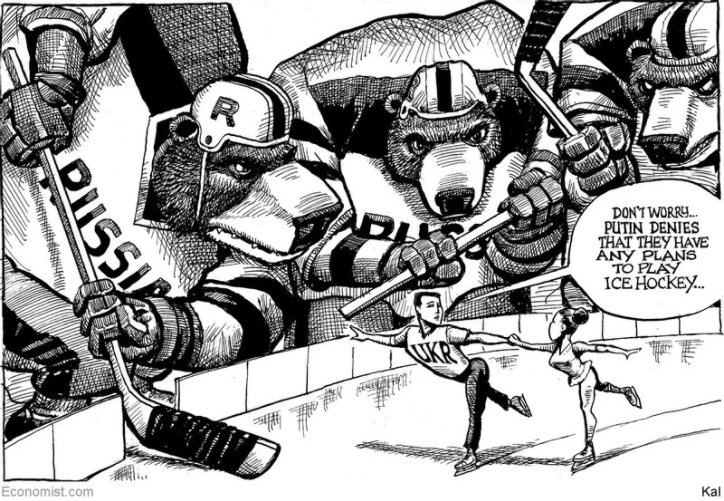

### 1. The world this week
#### 1.1   

#### 1.2   

#### 1.3   

### 2. Leaders
#### 2.1 _The next crisis:_ [What would happen if financial markets crashed?](https://www.economist.com/leaders/2022/02/12/what-would-happen-if-financial-markets-crashed)  
Look to history for a guide, but know that next time will be different  

#### 2.2 _Minsky moment:_ [Diplomacy has created an opening for detente in Ukraine, but beware a trap](https://www.economist.com/leaders/2022/02/12/diplomacy-has-created-an-opening-for-detente-in-ukraine-but-beware-a-trap)  
Russia is invoking the Minsk agreement to sow chaos, not to bring peace  

#### 2.3 _Green investors’ filthy secret:_ [The truth about dirty assets](https://www.economist.com/leaders/2022/02/12/the-truth-about-dirty-assets)  
Polluting businesses are moving into the financial shadows  

#### 2.4 _Festive but fraying:_ [India’s democracy is not as healthy as this month’s elections make it seem](https://www.economist.com/leaders/indias-democracy-is-not-as-healthy-as-this-months-elections-make-it-seem/21807621)  
It is not just sectarianism that is ailing the body politic  

#### 2.5 _Radical research:_ [Some lessons on inventing the future in Britain](https://www.economist.com/leaders/2022/02/12/some-lessons-on-inventing-the-future-in-britain)  
How to make the country’s new innovation agency work  

### 3. Letters
#### 3.1 _On Ukraine’s gas pipelines, the Cuban missile crisis, George McGovern, Bangladesh, police alternatives, culture, Boris Johnson:_ [Letters to the editor](https://www.economist.com/letters/2022/02/12/letters-to-the-editor)  
A selection of correspondence  

### 4. Briefing
#### 4.1 _Local, but vast:_ [The elections in Uttar Pradesh will show where India is heading](https://www.economist.com/briefing/2022/02/12/the-elections-in-uttar-pradesh-will-show-where-india-is-heading)  
Can Narendra Modi’s BJP recreate its successes of the 2010s?  
  
  
  
  

### 5. Europe
#### 5.1 _The chancellor wakes:_ [A beleaguered Olaf Scholz launches a diplomatic offensive](https://www.economist.com/europe/2022/02/12/a-beleaguered-olaf-scholz-launches-a-diplomatic-offensive)  
Caution over Ukraine has hurt the German leader’s image  
  

#### 5.2 _Shaky state:_ [Bosnia is on the brink of falling apart again](https://www.economist.com/europe/2022/02/12/bosnia-is-on-the-brink-of-falling-apart-again)  
The Serbs want out  

#### 5.3 _The few, the proud:_ [Spain’s empty middle flexes its political muscles](https://www.economist.com/europe/2022/02/12/spains-empty-middle-flexes-its-political-muscles)  
In Castile and León’s election, local parties fight depopulation  
  

#### 5.4 _Drones of their own:_ [Turkey is the arms industry’s new upstart](https://www.economist.com/europe/2022/02/12/turkey-is-the-arms-industrys-new-upstart)  
It has won clients in Azerbaijan, Ethiopia, Ukraine and elsewhere  

#### 5.5 _All the boys and girls:_ [In France’s election young people are all over the map](https://www.economist.com/europe/2022/02/12/in-frances-election-young-people-are-all-over-the-map)  
From the far right to the far left and everything in between  

#### 5.6 _Charlemagne:_ [A European bunfight breaks out over food labels](https://www.economist.com/europe/2022/02/12/a-european-bunfight-breaks-out-over-food-labels)  
Italy is mounting a defence of the Mediterranean diet  

### 6. Britain
#### 6.1 _Law and order:_ [London’s Metropolitan Police Service is failing on three fronts](https://www.economist.com/britain/londons-metropolitan-police-service-is-failing-on-three-fronts/21807604)  
That makes it less, not more, likely that it will change  
  

#### 6.2 _Dashed promises:_ [Northern Irish devolution collapses—again](https://www.economist.com/britain/2022/02/12/northern-irish-devolution-collapses-again)  
The province’s politics are very far from the heady days of the Good Friday Agreement  

#### 6.3 _Bare necessities:_ [Britain’s cost-of-living squeeze in four charts](https://www.economist.com/britain/2022/02/12/britains-cost-of-living-squeeze-in-four-charts)  
Higher prices and taxes are only partially offset by government measures  
  

#### 6.4 _Taming the circus:_ [Boris Johnson attempts to get his government back under control](https://www.economist.com/britain/2022/02/12/boris-johnson-attempts-to-get-his-government-back-under-control)  
The prime minister’s new chief of staff has an unenviable task  

#### 6.5 _Hualong, farewell:_ [British regulators have approved a Chinese reactor design](https://www.economist.com/britain/2022/02/12/british-regulators-have-approved-a-chinese-reactor-design)  
It is unlikely to be built  

#### 6.6 _Justice delayed:_ [Unless lawyers are paid better, courts will grind to a halt](https://www.economist.com/britain/2022/02/12/unless-lawyers-are-paid-better-courts-will-grind-to-a-halt)  
The government pays solicitors and barristers too little for legal-aid work  

#### 6.7 _Bagehot:_ [The rise of unpopulism](https://www.economist.com/britain/2022/02/12/the-rise-of-unpopulism)  
Why Tories give the British people what they do not want  

### 7. Middle East & Africa
#### 7.1 _America and Iran:_ [Nuclear talks with Iran enter the endgame](https://www.economist.com/middle-east-and-africa/nuclear-talks-with-iran-enter-the-endgame/21807592)  
Time is running out to avert a new crisis in the Middle East  

#### 7.2 _The surveillance state:_ [Did the police in Israel use Pegasus spyware on citizens?](https://www.economist.com/middle-east-and-africa/2022/02/12/did-the-police-in-israel-use-pegasus-spyware-on-citizens)  
The answer could upend Israel’s most important judicial case  

#### 7.3 _Back with a bump:_ [More African countries are letting pregnant girls stay at school](https://www.economist.com/middle-east-and-africa/2022/02/12/more-african-countries-are-letting-pregnant-girls-stay-at-school)  
Parents, principals and religious types still need convincing  
  

#### 7.4 _Older and less wise:_ [The African Union is less effective at 20 than it was at two](https://www.economist.com/middle-east-and-africa/2022/02/12/the-african-union-is-less-effective-at-20-than-it-was-at-two)  
Its enforcement of democratic norms is slipping  

### 8. United States
#### 8.1 _Congressional redistricting:_ [Democrats have fared surprisingly well in Congress’s new maps](https://www.economist.com/united-states/democrats-have-fared-surprisingly-well-in-congress-new-maps/21807593)  
But the boundaries still favour Republicans  
  
  

#### 8.2 _Another exodus?:_ [Rival Jewish congregations feud over America’s oldest synagogue](https://www.economist.com/united-states/2022/02/12/rival-jewish-congregations-feud-over-americas-oldest-synagogue)  
A historic synagogue is at the centre of a power struggle  

#### 8.3 _TikTok nuns:_ [A group of nuns goes viral for Jesus](https://www.economist.com/united-states/2022/02/12/a-group-of-nuns-goes-viral-for-jesus)  
TikTok has made them popular outside the convent  

#### 8.4 _Party loyalties:_ [Is Donald Trump losing his grip on Republican voters?](https://www.economist.com/united-states/2022/02/12/is-donald-trump-losing-his-grip-on-republican-voters)  
New polling and fundraising figures suggest slippage  
  

#### 8.5 _Street food:_ [Roadkill is now on the menu in Wyoming](https://www.economist.com/united-states/2022/02/12/roadkill-is-now-on-the-menu-in-wyoming)  
Crashes between cars and wildlife are too common. Salvaging roadkill can help  

#### 8.6 _Carjacking:_ [What the carjacking wave says about American policing](https://www.economist.com/united-states/2022/02/12/what-the-carjacking-wave-says-about-american-policing)  
It is a fairly easy crime to get away with  

#### 8.7 _Lexington:_ [Messing up, Biden-style](https://www.economist.com/united-states/2022/02/12/messing-up-biden-style)  
The administration’s errors have the president’s fingerprints all over them  

### 9. The Americas
#### 9.1 _A lopsided romance:_ [Despite thriving trade, China’s relationship with Brazil is weakening](https://www.economist.com/the-americas/2022/02/12/despite-thriving-trade-chinas-relationship-with-brazil-is-weakening)  
President Jair Bolsonaro’s rhetoric has not helped  
  
  

#### 9.2 _A deadly profession:_ [Four journalists have been killed in Mexico this year](https://www.economist.com/the-americas/2022/02/12/four-journalists-have-been-killed-in-mexico-this-year)  
The country remains the most dangerous place in the world to be a member of the press  

#### 9.3 _Bello:_ [How the “Cannibal Manifesto” changed Brazil](https://www.economist.com/the-americas/2022/02/12/how-the-cannibal-manifesto-changed-brazil)  
It is 100 years since modernists vowed to transform the country’s culture  

### 10. Asia
#### 10.1 _The ailing body politic:_ [The organs of India’s democracy are decaying](https://www.economist.com/asia/2022/02/12/the-organs-of-indias-democracy-are-decaying)  
It takes more than elections for a country to be democratic  
  
  

#### 10.2 _Sidewalk ballet:_ [Bangkok is trying to evict its street hawkers](https://www.economist.com/asia/2022/02/12/bangkok-is-trying-to-evict-its-street-hawkers)  
The city’s residents would like their pavements back  

#### 10.3 _Quarter-acre heartbreaker:_ [New Zealand’s housing crisis is worsening](https://www.economist.com/asia/2022/02/12/new-zealands-housing-crisis-is-worsening)  
That is bad news for a government which promised miracles  

#### 10.4 _Blood feuds:_ [The outcome of the Philippines’ election is not as certain as it looks](https://www.economist.com/asia/2022/02/12/the-outcome-of-the-philippines-election-is-not-as-certain-as-it-looks)  
An absolute majority may not be enough for Ferdinand Marcos Jr to win the presidency  

#### 10.5 _Explosive growth:_ [South Korea wants to become one of the world’s biggest arms exporters](https://www.economist.com/asia/2022/02/12/south-korea-wants-to-become-one-of-the-worlds-biggest-arms-exporters)  
A legacy of defence spending and support from America are boosting the weapons industry  

#### 10.6 _Banyan:_ [Kishida Fumio’s “new capitalism” is many things, but it is not new](https://www.economist.com/asia/2022/02/12/kishida-fumios-new-capitalism-is-many-things-but-it-is-not-new)  
The prime minister’s big idea to reinvigorate Japan is better politics than economics  

### 11. China
#### 11.1 _Thinker-in-chief:_ [Wang Huning’s career reveals much about political change in China](https://www.economist.com/china/2022/02/12/wang-hunings-career-reveals-much-about-political-change-in-china)  
He has shaped the leaders’ defining policies for more than two decades  

#### 11.2 _Injecting urgency:_ [Hong Kong’s old folk remain largely unvaccinated](https://www.economist.com/china/2022/02/12/hong-kongs-old-folk-remain-largely-unvaccinated)  
Omicron is putting them at greater risk  

#### 11.3 _Chaguan:_ [The good and the bad of China on Olympic show](https://www.economist.com/china/2022/02/12/the-good-and-the-bad-of-china-on-olympic-show)  
As Beijing hosts the winter games, a mood of pride mixed with defiance  

### 12. International
#### 12.1 _Crisis in Ukraine:_ [How Russia has revived NATO](https://www.economist.com/international/2022/02/12/how-russia-has-revived-nato)  
Ukraine has forced America and its allies to bond. But the country’s future is still uncertain  
  

### 13. Business
#### 13.1 _To the victors, the scraps:_ [Disney, Netflix, Apple: is anyone winning the streaming wars?](https://www.economist.com/business/disney-netflix-apple-is-anyone-winning-the-streaming-wars/21807591)  
Investors are terrified that the prize may not be worth it  
  

#### 13.2 _Industrial technology:_ [Why Japan’s Automation Inc is indispensable to global industry](https://www.economist.com/business/2022/02/12/why-japans-automation-inc-is-indispensable-to-global-industry)  
A little-known pinch-point in the world’s supply chains  
  

#### 13.3 _Fabs with benefits:_ [In the global chips arms race, Europe makes its move](https://www.economist.com/business/in-the-global-chips-arms-race-europe-makes-its-move/21807603)  
Will it work better than it did a decade ago?  
  

#### 13.4 _Income support:_ [How long can America Inc’s profits keep rising?](https://www.economist.com/business/2022/02/12/how-long-can-america-incs-profits-keep-rising)  
This year they may not be as immune as before to infection, inflation and imploding supply chains  
  

#### 13.5 _Slumber party:_ [The sleep-tech industry is waking up](https://www.economist.com/business/2022/02/12/the-sleep-tech-industry-is-waking-up)  
The tired are tucking in. Investors dream of riches. Scientists need convincing  

#### 13.6 _Bartleby:_ [Rio Tinto and the problem of toxic culture](https://www.economist.com/business/rio-tinto-and-the-problem-of-toxic-culture/21807599)  
A disturbing report has lessons for other industries  

#### 13.7 _Schumpeter:_ [As its sale of Arm collapses, the tide is turning against SoftBank](https://www.economist.com/business/as-its-sale-of-arm-collapses-the-tide-is-turning-against-softbank/21807597)  
Does Masa have his trunks on?  

### 14. Finance & economics
#### 14.1 _What goes up?:_ [Is the modern, bank-light financial system better than the old one?](https://www.economist.com/finance-and-economics/2022/02/12/is-the-modern-bank-light-financial-system-better-than-the-old-one)  
Brace for a stress test  
  
  
  

#### 14.2 _Fossil hunters:_ [Who buys the dirty energy assets public companies no longer want?](https://www.economist.com/finance-and-economics/who-buys-the-dirty-energy-assets-public-companies-no-longer-want/21807594)  
It could well be your university or your pension fund  
  

#### 14.3 _Buttonwood:_ [How unlisted startups’ valuations will adjust to falling share prices](https://www.economist.com/finance-and-economics/2022/02/12/how-unlisted-startups-valuations-will-adjust-to-falling-share-prices)  
Surprisingly slowly  

#### 14.4 _Rice restraint:_ [Asia is not feeling the same price pressures as the West](https://www.economist.com/finance-and-economics/2022/02/12/asia-is-not-feeling-the-same-price-pressures-as-the-west)  
A stronger dollar could change that  

#### 14.5 _How to default on China:_ [China does not always collect its debts on time](https://www.economist.com/finance-and-economics/2022/02/12/china-does-not-always-collect-its-debts-on-time)  
Thirty-nine developing countries have delayed repayment to China since 2000  
  

#### 14.6 _Free exchange:_ [The promise of former eastern-bloc economies is mostly unfulfilled](https://www.economist.com/finance-and-economics/2022/02/12/the-promise-of-former-eastern-bloc-economies-is-mostly-unfulfilled)  
But those that joined the EU have done much better than the rest  

### 15. Science & technology
#### 15.1 _The bots in the warehouse:_ [New robots—smarter and faster—are taking over warehouses](https://www.economist.com/science-and-technology/a-new-generation-of-smarter-and-faster-robots-are-taking-over-distribution-centres/21807595)  
Most picking jobs will be done by bots  

#### 15.2 _Sidewalk bots:_ [Sidewalk robots are already busy delivering groceries](https://www.economist.com/science-and-technology/sidewalk-robots-are-busy-delivering-groceries-while-autonomous-vehicles-wait-for-the-green-light/21807601)  
But autonomous vehicles are waiting for the green light  

#### 15.3 _Deafened:_ [Plants are adversely affected by the racket of urban traffic](https://www.economist.com/science-and-technology/plants-are-adversely-affected-by-the-racket-of-urban-traffic/21807602)  
They get stressed and grow less well  

#### 15.4 _Standing ovation:_ [Spinal implants allow the paralysed to walk, swim and cycle again](https://www.economist.com/science-and-technology/spinal-implants-allow-paralysed-people-to-walk-swim-and-cycle-again/21807596)  
The new device works in less than a day after it is fitted  

### 16. Culture
#### 16.1 _Au revoir tristesse:_ [The strange tenderness of Michel Houellebecq’s new novel](https://www.economist.com/culture/2022/02/12/the-strange-tenderness-of-michel-houellebecqs-new-novel)  
In “Anéantir”, a bard of modern France takes a surprisingly upbeat turn  

#### 16.2 _China’s other dreams:_ [To understand China, says Megan Walsh, turn to its literature](https://www.economist.com/culture/2022/02/12/to-understand-china-says-megan-walsh-turn-to-its-literature)  
“The Subplot” is a pacy tour of contemporary Chinese literature  

#### 16.3 _Heart in mouth:_ [Rachel Jones is an artist of the moment](https://www.economist.com/culture/2022/02/12/rachel-jones-is-an-artist-of-the-moment)  
Her painting captures the concerns of the 30-year-old’s generation  

#### 16.4 _Insurgent history:_ [How do radicals find each other—and get heard?](https://www.economist.com/culture/2022/02/12/how-do-radicals-find-each-other-and-get-heard)  
Gal Beckerman offers some answers in “The Quiet Before”  

#### 16.5 _Home Entertainment:_ [“Columbo” shows the benefits of asking just one more thing](https://www.economist.com/culture/2022/02/12/columbo-shows-the-benefits-of-asking-just-one-more-thing)  
However powerful the villain, the scruffy detective always outwits them  

#### 16.6 _Johnson:_ [A language without a flag and a state is still a language](https://www.economist.com/culture/2022/02/12/a-language-without-a-flag-and-a-state-is-still-a-language)  
Suggesting that a regional language is not a “real” one is mistaken  

### 17. Economic & financial indicators
#### 17.1   
  
  
  

### 18. Graphic detail
#### 18.1 _Olympian judgments:_ [How to detect nationalism in winter-sport judges](https://www.economist.com/graphic-detail/2022/02/12/how-to-detect-nationalism-in-winter-sport-judges)  
Even the ostensibly impartial seem susceptible  
  
  
  

### 19. Obituary
#### 19.1 _India’s nightingale:_ [Lata Mangeshkar was the soundtrack of newly independent India](https://www.economist.com/obituary/lata-mangeshkar-was-the-soundtrack-of-the-newly-independent-country/21807600)  
The most celebrated of all playback singers died on February 6th, aged 92  

