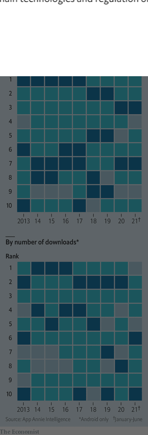
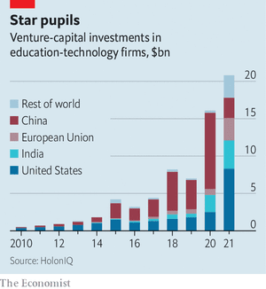
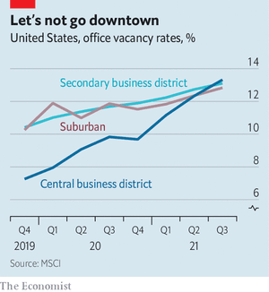
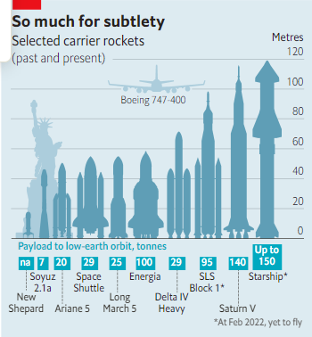

### 1. The world this week
#### 1.1   

#### 1.2   

#### 1.3   

### 2. Leaders
#### 2.1 _Russia and Ukraine:_ [Whether he invades Ukraine or backs down, Putin has harmed Russia](https://www.economist.com/leaders/2022/02/19/whether-he-invades-ukraine-or-backs-down-putin-has-harmed-russia)  
He will try to claim victory though  

#### 2.2 _The chicken and the peg:_ [Workers have the most to lose from a wage-price spiral](https://www.economist.com/leaders/workers-have-the-most-to-lose-from-a-wage-price-spiral/21807722)  
As prices rise, real wages are falling  
  

#### 2.3 _No, Canada:_ [Justin Trudeau’s crackdown on protests could make things worse](https://www.economist.com/leaders/justin-trudeaus-crackdown-on-protests-could-make-things-worse/21807707)  
By seeking to curb free speech, he will aggravate Canada’s divisions  

#### 2.4 _Factional dissipation:_ [The Tories’ problems go deeper than just one man](https://www.economist.com/leaders/2022/02/19/the-tories-problems-go-deeper-than-just-one-man)  
Boris Johnson is a symptom of Conservative political malaise, not its cause  

#### 2.5 _Drug manufacturing:_ [To build a vaccine industry, Africa must embrace the private sector](https://www.economist.com/leaders/2022/02/19/to-build-a-vaccine-industry-africa-must-embrace-the-private-sector)  
Without a shift in focus, the continent risks always being at the back of the queue  
  

### 3. Letters
#### 3.1 _On peer review, Myanmar, pay, DNA, the Acropolis, vellum, Ottawa:_ [Letters to the editor](https://www.economist.com/letters/2022/02/19/letters-to-the-editor)  
A selection of correspondence  

### 4. Briefing
#### 4.1 _A grim blunder:_ [Vladimir Putin’s willingness to threaten war damages Russia](https://www.economist.com/briefing/2022/02/19/vladimir-putins-willingness-to-threaten-war-damages-russia)  
The nature of his regime has now changed irreversibly  
  

#### 4.2 _OSINT:_ [A new era of transparent warfare beckons](https://www.economist.com/briefing/2022/02/18/a-new-era-of-transparent-warfare-beckons)  
Russia’s manoeuvres are a coming-out party for open-source intelligence  

### 5. Europe
#### 5.1 _The Pécresse file:_ [Meet Valérie Pécresse, the French centre-right hopeful](https://www.economist.com/europe/2022/02/19/meet-valerie-pecresse-the-french-centre-right-hopeful)  
Her campaign is in trouble, but she fights on  
  

#### 5.2 _Hungary for change:_ [As Orban runs for re-election, Hungary’s opposition fears fraud](https://www.economist.com/europe/2022/02/17/as-orban-runs-for-re-election-hungarys-opposition-fears-fraud)  
They have some reason to  

#### 5.3 _Robert Habeck’s odyssey:_ [Germany’s plans for wind power are dauntingly ambitious](https://www.economist.com/europe/2022/02/19/germanys-plans-for-wind-power-are-dauntingly-ambitious)  
And green-on-green arguments aren’t helping  
  

#### 5.4 _Charlemagne:_ [Europe is using newfound powers to bring Poland into line](https://www.economist.com/europe/2022/02/19/europe-is-using-newfound-powers-to-bring-poland-into-line)  
Other troublesome members may be next  

### 6. Britain
#### 6.1 _Old dudes:_ [The Conservative Party has become factional and rebellious](https://www.economist.com/britain/2022/02/19/the-conservative-party-has-become-factional-and-rebellious)  
That is degrading its capacity to govern  
  
  
  

#### 6.2 _Nobody’s business:_ [British privacy law now rivals libel law in gagging the press](https://www.economist.com/britain/2022/02/19/british-privacy-law-now-rivals-libel-law-in-gagging-the-press)  
The Supreme Court rules Bloomberg invaded a businessman’s privacy by reporting on a criminal inquiry  

#### 6.3 _Not the only way:_ [Essex is rebranding](https://www.economist.com/britain/2022/02/19/essex-is-rebranding)  
A county with a reputation for brashness is trying to show off its posher side  

#### 6.4 _Trans action:_ [Activist doctors are urging GPs to prescribe cross-sex hormones](https://www.economist.com/britain/2022/02/19/activist-doctors-are-urging-gps-to-prescribe-cross-sex-hormones)  
That will remove the final remnants of gatekeeping from gender medicine  

#### 6.5 _Bagehot:_ [The shrinkflation state](https://www.economist.com/britain/2022/02/19/the-shrinkflation-state)  
The British state will soon cost more, yet provide less  

### 7. Middle East & Africa
#### 7.1 _Chasing the dragon:_ [How Chinese firms have dominated African infrastructure](https://www.economist.com/middle-east-and-africa/how-chinese-firms-have-dominated-african-infrastructure/21807721)  
Western firms grumble more but compete less  
  

#### 7.2 _Fabulous fruit:_ [How the sugarloaf pineapple became the champagne of Benin](https://www.economist.com/middle-east-and-africa/2022/02/19/how-the-sugarloaf-pineapple-became-the-champagne-of-benin)  
African countries cash in on the fashion for posh-place products  

#### 7.3 _Mission incomplete:_ [France withdraws its forces from Mali](https://www.economist.com/middle-east-and-africa/2022/02/19/france-withdraws-its-forces-from-mali)  
But their fight against jihadists in the Sahel is not over  

#### 7.4 _“RoboCop” hits a rough patch:_ [A recession threatens Tunisia’s President Kais Saied](https://www.economist.com/middle-east-and-africa/2022/02/17/a-recession-threatens-tunisias-president-kais-saied)  
But the opposition is too divided to take advantage of it  

### 8. United States
#### 8.1 _Between a rock and a hard place:_ [The energy transition is sparking America’s next mining boom](https://www.economist.com/united-states/the-energy-transition-is-sparking-americas-next-mining-boom/21807704)  
Can critical minerals be secured without wrecking the environment and sacred tribal lands?  
  

#### 8.2 _School-board politics:_ [Once mundane, school-board meetings have become battlegrounds](https://www.economist.com/united-states/2022/02/19/once-mundane-school-board-meetings-have-become-battlegrounds)  
A new front line in America’s culture wars  

#### 8.3 _A recall election:_ [A successful school-board recall punishes left-wing excess](https://www.economist.com/united-states/2022/02/17/a-successful-school-board-recall-punishes-left-wing-excess)  
It is a welcome victory for basic competence  

#### 8.4 _Post offices:_ [Long queues are the least of the US Postal Service’s problems](https://www.economist.com/united-states/2022/02/17/long-queues-are-the-least-of-the-us-postal-services-problems)  
Will the post-office bill deliver reform?  

#### 8.5 _Industrial policy:_ [Midwestern states want to become “hard-tech” hubs](https://www.economist.com/united-states/2022/02/17/midwestern-states-want-to-become-hard-tech-hubs)  
Putting their money where their machines are  

#### 8.6 _Lexington:_ [The fight for Catholic America](https://www.economist.com/united-states/2022/02/19/the-fight-for-catholic-america)  
Pope Francis is starting to get a grip on the world’s fourth-biggest Catholic country  

### 9. The Americas
#### 9.1 _No truck with Trudeau:_ [Trudeau invokes emergency powers to shut down Canada’s protests](https://www.economist.com/the-americas/justin-trudeau-invokes-emergency-powers-to-shut-down-canadas-freedom-convoy/21807705)  
Will the populist protest outlast the pandemic?  
  

#### 9.2 _Bello:_ [Why allegations about his son could hurt Mexico’s president](https://www.economist.com/the-americas/2022/02/19/why-allegations-about-his-son-could-hurt-mexicos-president)  
Andrés Manuel López Obrador’s son does not share his father’s distaste for luxury  

### 10. Asia
#### 10.1 _Aid limits:_ [A cash crunch is crippling Afghanistan](https://www.economist.com/asia/2022/02/19/a-cash-crunch-is-crippling-afghanistan)  
Humanitarian aid is no substitute for a functioning economy  
  
  

#### 10.2 _Awamori? Go on then:_ [Distillers in Okinawa are trying to reinvent the local firewater](https://www.economist.com/asia/2022/02/19/distillers-in-okinawa-are-trying-to-reinvent-the-local-firewater)  
Weaker drinks may make for stronger sales  

#### 10.3 _A million ways to die in the east:_ [India’s Omicron wave recedes, but not the risk of premature death](https://www.economist.com/asia/2022/02/17/indias-omicron-wave-recedes-but-not-the-risk-of-premature-death)  
Indians die of preventable causes in alarming numbers  
  

#### 10.4 _Cut-rate khanate:_ [Turkmenistan’s despot finds a worthy successor: his son](https://www.economist.com/asia/2022/02/17/turkmenistans-despot-finds-a-worthy-successor-his-son)  
A horse-obsessed personality cult becomes a dynasty  

#### 10.5 _Banyan:_ [Asia’s premier trade pact needs stronger foundations](https://www.economist.com/asia/2022/02/19/asias-premier-trade-pact-needs-stronger-foundations)  
CPTPP is growing, but first it must mature  

### 11. China
#### 11.1 _Conservation conversation:_ [China is trying to become a champion of biodiversity](https://www.economist.com/china/2022/02/17/china-is-trying-to-become-a-champion-of-biodiversity)  
It has a lot of ground to make up  

#### 11.2 _Two passports, one problem:_ [Olympic skier Eileen Gu sparks a debate about dual nationality](https://www.economist.com/china/2022/02/17/olympic-skier-eileen-gu-sparks-a-debate-about-dual-nationality)  
China does not allow it. But there may be loopholes  

#### 11.3 _Chaguan:_ [China’s “zero-covid” policy doubles as a loyalty test](https://www.economist.com/china/2022/02/19/chinas-zero-covid-policy-doubles-as-a-loyalty-test)  
Hong Kong can open to the mainland or the world. It must choose  

### 12. Business
#### 12.1 _Digital geopolitics:_ [Russia is trying to build its own great firewall](https://www.economist.com/business/russia-is-trying-to-build-its-own-great-firewall/21807706)  
Can its tech industry separate from the West’s?  
  
  

#### 12.2 _The middle-market corset:_ [After expanding in 2021, fast fashion may be squeezed again](https://www.economist.com/business/2022/02/19/after-expanding-in-2021-fast-fashion-may-be-squeezed-again)  
H&M and Inditex had a good year but face familiar challenges  
  

#### 12.3 _Learnings growth:_ [Can the ed-tech boom last?](https://www.economist.com/business/2022/02/19/can-the-ed-tech-boom-last)  
The pandemic has turbocharged the education-technology business  
  

#### 12.4 _Bartleby:_ [A guide for wannabe leadership gurus](https://www.economist.com/business/2022/02/19/a-guide-for-wannabe-leadership-gurus)  
How aspiring management writers can stand out in a crowded field  

#### 12.5 _Schumpeter:_ [Companies have a lot to fear from Russia’s digital warmongering](https://www.economist.com/business/2022/02/19/companies-have-a-lot-to-fear-from-russias-digital-warmongering)  
Insurance against state-sponsored hacks is becoming harder to find  

### 13. Finance & economics
#### 13.1 _The battle of the markups:_ [Labour v capital in the post-lockdown economy](https://www.economist.com/finance-and-economics/labour-v-capital-in-the-post-lockdown-economy/21807700)  
As prices and wages rise, are workers or firms winning?  
  
  

#### 13.2 _Future of cities:_ [The true cost of empty offices](https://www.economist.com/finance-and-economics/the-true-cost-of-empty-offices/21807703)  
Property investors are sitting on big losses  
  

#### 13.3 _The Citi that was never finished:_ [Citigroup is disposing of its international retail network](https://www.economist.com/finance-and-economics/2022/02/19/citigroup-is-disposing-of-its-international-retail-network)  
The sale marks the end of a remarkable experiment in global finance  

#### 13.4 _Punting profits:_ [Will prediction markets live up to the hype?](https://www.economist.com/finance-and-economics/2022/02/19/will-prediction-markets-live-up-to-the-hype)  
Their mainstream appeal remains uncertain  

#### 13.5 _Buttonwood:_ [Are financial crossbreeds monstrosities or labradoodles?](https://www.economist.com/finance-and-economics/2022/02/19/are-financial-crossbreeds-monstrosities-or-labradoodles)  
Crypto-SPAC fusions shed light on the question  

#### 13.6 _Free exchange:_ [A new history of sanctions has unsettling lessons for today](https://www.economist.com/finance-and-economics/2022/02/19/a-new-history-of-sanctions-has-unsettling-lessons-for-today)  
Sometimes they create the problem they are trying to solve  

### 14. Science & technology
#### 14.1 _It is exactly rocket science:_ [SpaceX’s monstrous, dirt-cheap Starship may transform space travel](https://www.economist.com/science-and-technology/2022/02/19/spacexs-monstrous-dirt-cheap-starship-may-transform-space-travel)  
Precisely when, though, remains unclear  
  
  

#### 14.2 _Drug manufacturing:_ [BioNTech plans to make vaccines in shipping containers](https://www.economist.com/science-and-technology/biontech-plans-to-make-vaccines-in-shipping-containers/21807708)  
These standardised factories could be quickly scaled up to expand capacity worldwide  

### 15. Culture
#### 15.1 _Writing India’s history:_ [A book recalls the foreign agitators for India’s independence](https://www.economist.com/culture/2022/02/19/a-book-recalls-the-foreign-agitators-for-indias-independence)  
The argument of “Rebels against the Raj” is about the future as much as the past  

#### 15.2 _The story of life on Earth:_ [Creatures of the deep past come to life in “Otherlands”](https://www.economist.com/culture/2022/02/19/creatures-of-the-deep-past-come-to-life-in-otherlands)  
The long view in Thomas Halliday’s book offers both hope and trepidation  

#### 15.3 _Making tech’s mafia:_ [“The Founders” examines the rise and legend of PayPal](https://www.economist.com/culture/2022/02/19/the-founders-examines-the-rise-and-legend-of-paypal)  
Its top brass, recounts Jimmy Soni, became one of tech’s most influential networks  

#### 15.4 _Debut fiction:_ [Love and other demons in “When We Were Birds”](https://www.economist.com/culture/2022/02/19/love-and-other-demons-in-when-we-were-birds)  
Ayanna Lloyd Banwo’s luminous novel is set in her native Trinidad  

#### 15.5 _World in a dish:_ [In the fickle world of restaurants, sticking to a vision takes guts](https://www.economist.com/culture/2022/02/19/in-the-fickle-world-of-restaurants-sticking-to-a-vision-takes-guts)  
And, in the case of St John in London, bone marrow  

#### 15.6 _Glaze of glory:_ [The story of Pewabic Pottery is a chronicle of resilience](https://www.economist.com/culture/2022/02/19/the-story-of-pewabic-pottery-is-a-chronicle-of-resilience)  
It is intertwined with the history of Detroit  

#### 15.7 _Back Story:_ [In “The Power of the Dog”, the Western rides again](https://www.economist.com/culture/2022/02/19/in-the-power-of-the-dog-the-western-rides-again)  
Jane Campion’s triumphant film shows the grit and flexibility of a venerable genre  

### 16. Economic & financial indicators
#### 16.1   
  
  
  

### 17. Graphic detail
#### 17.1 _What makes murder?:_ [Are progressive prosecutors to blame for an American homicide wave?](https://www.economist.com/graphic-detail/2022/02/19/are-progressive-prosecutors-to-blame-for-an-american-homicide-wave)  
Recent data suggest the story is much more complicated  
  
  
  

### 18. Obituary
#### 18.1 _Look behind the Ranges:_ [John Hare devoted his life to saving the Gobi’s wild camels](https://www.economist.com/obituary/2022/02/19/john-hare-devoted-his-life-to-saving-the-gobis-wild-camels)  
The explorer, writer and conservationist died on January 28th, aged 87  

