### 1. The world this week
#### 1.1 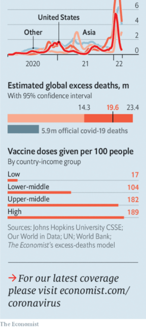  

#### 1.2 
#### 1.3 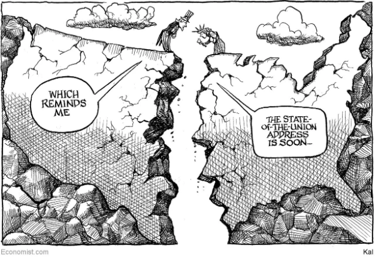  

### 2. Leaders
#### 2.1 _Where will he stop?:_ [History will judge Vladimir Putin harshly for his war](https://www.economist.com/leaders/2022/02/25/history-will-judge-vladimir-putin-harshly-for-his-war)  
Russia’s president has launched an unprovoked assault on his neighbour  

#### 2.2 _Spending the federal bonanza:_ [The right way for America’s states to use federal largesse](https://www.economist.com/leaders/2022/02/25/the-right-way-for-americas-states-to-use-federal-largesse)  
America’s states have more green stuff than grey matter  
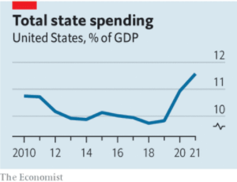  

#### 2.3 _The private-equity delusion:_ [Investors have come to see private markets as a cash cow](https://www.economist.com/leaders/2022/02/26/investors-have-come-to-see-private-markets-as-a-cash-cow)  
They need to temper their expectations  

#### 2.4 _Courting trouble:_ [South Africa must protect its judges](https://www.economist.com/leaders/2022/02/26/south-africa-must-protect-its-judges)  
Nelson Mandela warned about the weakening of the judiciary. He was right  

#### 2.5 _Automation:_ [The world should welcome the rise of the robots](https://www.economist.com/leaders/2022/02/26/the-world-should-welcome-the-rise-of-the-robots)  
Concerns over mass unemployment are unfounded  

### 3. Letters
#### 3.1 _On Canada, bilingual people, Estonia, levelling up, Uganda, Gordon Brown, tech giants:_ [Letters to the editor](https://www.economist.com/letters/2022/02/26/letters-to-the-editor)  
A selection of correspondence  

### 4. Briefing
#### 4.1 _The return of large-scale war to Europe:_ [Russia’s invasion of Ukraine](https://www.economist.com/briefing/2022/02/26/russias-invasion-of-ukraine)  
Vladimir Putin has brought war back to Europe  
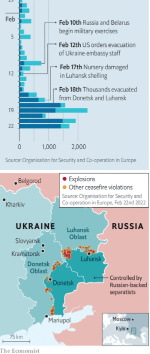  
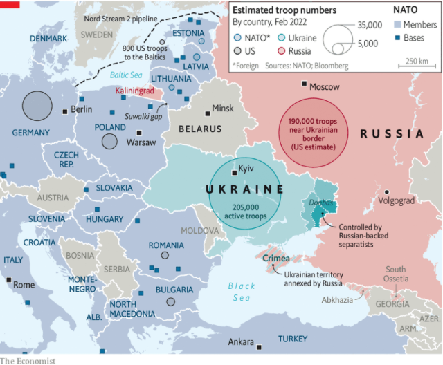  
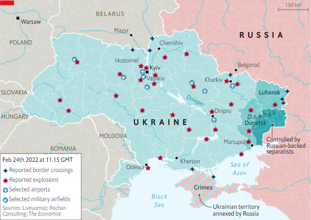  

### 5. Europe
#### 5.1 _Frenemies:_ [Turkey’s rapprochement with Russia may not survive the war in Ukraine](https://www.economist.com/europe/2022/02/24/turkeys-rapprochement-with-russia-may-not-survive-the-war-in-ukraine)  
It’s not easy being a member of NATO and a friend of Vladimir Putin  

#### 5.2 _Bills to pay:_ [Money matters take centre-stage in France’s election](https://www.economist.com/europe/2022/02/25/money-matters-take-centre-stage-in-frances-election)  
The economy is healthy, the public finances are less so  
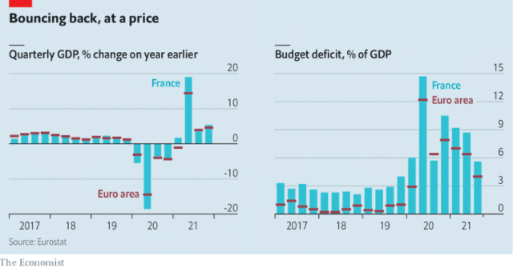  

#### 5.3 _Thunder on the right:_ [The leader of Spain’s main opposition party is ousted](https://www.economist.com/europe/2022/02/26/the-leader-of-spains-main-opposition-party-is-ousted)  
Pablo Casado will depart at an emergency party congress  

#### 5.4 _Holy See-saw:_ [Did Pope Francis restrict defendants’ rights?](https://www.economist.com/europe/2022/02/26/did-pope-francis-restrict-defendants-rights)  
The pontiff signed secret decrees authorising wiretaps  

#### 5.5 _Free as air:_ [An EU scheme to limit the use of dangerous gases runs into problems](https://www.economist.com/europe/2022/02/25/an-eu-scheme-to-limit-the-use-of-dangerous-gases-runs-into-problems)  
Controlling the flow of hydrofluorocarbons turns out to be tricky  

#### 5.6 _Charlemagne:_ [Europe is the free-rider continent](https://www.economist.com/europe/2022/02/26/europe-is-the-free-rider-continent)  
Why lead when you can follow instead?  

### 6. Britain
#### 6.1 _International trade:_ [Britain's post-Brexit trade policy is slowly maturing](https://www.economist.com/britain/2022/02/25/britains-post-brexit-trade-policy-is-slowly-maturing)  
The government is taking a more flexible approach  

#### 6.2 _A new routine:_ [After Brexit, Nigel Farage has net zero in his sights](https://www.economist.com/britain/2022/02/25/after-brexit-nigel-farage-has-net-zero-in-his-sights)  
He hopes for a referendum. He may find a niche  

#### 6.3 _Covid-19 rules:_ [England’s coronavirus regulations are no more](https://www.economist.com/britain/2022/02/25/englands-coronavirus-regulations-are-no-more)  
Many public-health advisers fear it may be too soon  

#### 6.4 _Indeterminate prison sentences:_ [Too many British prisoners are still serving indefinite sentences](https://www.economist.com/britain/2022/02/25/too-many-british-prisoners-are-still-serving-indefinite-sentences)  
Even after those terms were scrapped  

#### 6.5 _Eyes on the big prize:_ [Running Britain's national lottery is not as easy as it was](https://www.economist.com/britain/2022/02/25/running-britains-national-lottery-is-not-as-easy-as-it-was)  
A lot has changed since its launch in 1994  
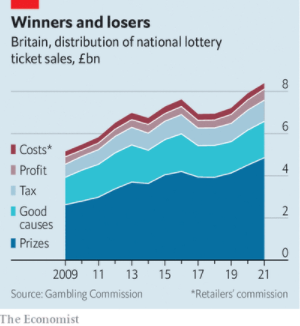  

#### 6.6 _Trials and errors:_ [Clinical trials are ailing](https://www.economist.com/britain/2022/02/26/clinical-trials-are-ailing)  
Britain invented clinical trials. Now it wants to reinvent them  

#### 6.7 _Bagehot:_ [Crisis in the NHS in 2022 will damage the Conservatives](https://www.economist.com/britain/2022/02/26/crisis-in-the-nhs-in-2022-will-damage-the-conservatives)  
Just as the financial crisis did Labour in 2008  

### 7. Middle East & Africa
#### 7.1 _Judging judges:_ [The enemies of South African democracy have the judiciary in their sights](https://www.economist.com/middle-east-and-africa/the-enemies-of-south-african-democracy-have-the-judiciary-in-their-sights/21807814)  
What the attack on judicial independence says about the country’s future  

#### 7.2 _Lines in the sand:_ [West Africa’s coastal states are bracing for a jihadist storm](https://www.economist.com/middle-east-and-africa/2022/02/24/west-africas-coastal-states-are-bracing-for-a-jihadist-storm)  
With French troops leaving Mali, its neighbours are at risk  
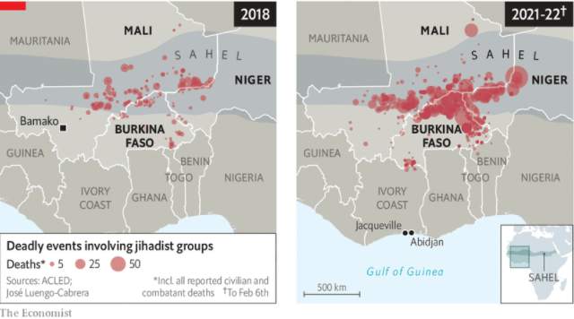  

#### 7.3 _Here comes Trouble:_ [Names in southern Africa are both creative and revealing](https://www.economist.com/middle-east-and-africa/2022/02/26/names-in-southern-africa-are-both-creative-and-revealing)  
They illuminate the past as well as aspirations for the future  

#### 7.4 _Cleaning up the laundromat:_ [The UAE tries to crack down on dirty money](https://www.economist.com/middle-east-and-africa/2022/02/26/the-uae-tries-to-crack-down-on-dirty-money)  
Luxury homes and a thriving gold trade have been a magnet for corruption  

#### 7.5 _A ban on the van:_ [Are Cairo’s menacing minibuses on their way out?](https://www.economist.com/middle-east-and-africa/2022/02/26/are-cairos-menacing-minibuses-on-their-way-out)  
How the government is rethinking transportation in the congested capital  

#### 7.6 _Beak demand:_ [The market for falcons is soaring as wild populations decline](https://www.economist.com/middle-east-and-africa/2022/02/24/the-market-for-falcons-is-soaring-as-wild-populations-decline)  
Gulf royals risk killing a sport they love  

### 8. United States
#### 8.1 _Take the money and run:_ [How states are using, and misusing, funds from the American Rescue Plan](https://www.economist.com/united-states/how-states-are-using-and-misusing-funds-from-the-american-rescue-plan/21807807)  
Governors benefit politically today, but they are creating liabilities for tomorrow  
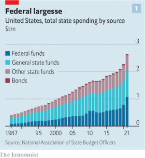  
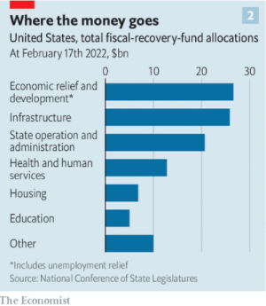  

#### 8.2 _The Empire State:_ [New York’s new governor is proving to be adept at the power game](https://www.economist.com/united-states/2022/02/26/new-yorks-new-governor-is-proving-to-be-adept-at-the-power-game)  
The unexpected Kathy Hochul  

#### 8.3 _Parks and permits:_ [America’s outdoor permits are not solving overcrowding](https://www.economist.com/united-states/2022/02/26/americas-outdoor-permits-are-not-solving-overcrowding)  
Controlling access to fragile areas of natural beauty is not as simple as it sounds  

#### 8.4 _Adolescent brides:_ [Child marriage in America has fallen sharply—but not far enough](https://www.economist.com/united-states/2022/02/26/child-marriage-in-america-has-fallen-sharply-but-not-far-enough)  
Resistance to reforms comes from both left and right  

#### 8.5 _New universities:_ [Pushback at cancel culture is leading to new educational initiatives](https://www.economist.com/united-states/2022/02/26/pushback-at-cancel-culture-is-leading-to-new-educational-initiatives)  
Some Americans want to reform from within. Some want to build anew  

#### 8.6 _Lexington:_ [Deploying reality against Putin](https://www.economist.com/united-states/2022/02/26/deploying-reality-against-putin)  
The administration is countering Russian disinformation on Ukraine  

### 9. The Americas
#### 9.1 _Why Uruguay?:_ [What Latin America’s success story can teach its neighbours](https://www.economist.com/the-americas/2022/02/26/what-latin-americas-success-story-can-teach-its-neighbours)  
Political stability and business-friendly policies are key, but so is being slightly dull  

#### 9.2 _The price of high prices:_ [Brazil’s 10% inflation is eroding incomes and the president’s popularity](https://www.economist.com/the-americas/2022/02/26/brazils-10-inflation-is-eroding-incomes-and-the-presidents-popularity)  
But not all the surge in prices can be blamed on Jair Bolsonaro  
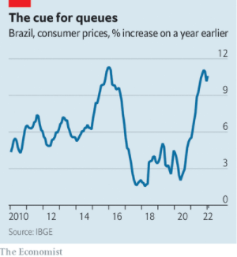  

#### 9.3 _Bello:_ [Juan Orlando Hernández, a former Honduran president, is arrested](https://www.economist.com/the-americas/2022/02/26/juan-orlando-hernandez-a-former-honduran-president-is-arrested)  
His case highlights how far drug money has penetrated Latin American politics  

### 10. Asia
#### 10.1 _K-popular:_ [Why South Korea’s outgoing president is less unpopular than most](https://www.economist.com/asia/2022/02/26/why-south-koreas-outgoing-president-is-less-unpopular-than-most)  
Under Moon Jae-in the country has weathered covid-19 and acquired global cultural heft  

#### 10.2 _Call me by my name:_ [Why so many Asian cities adopt an alias](https://www.economist.com/asia/2022/02/26/why-so-many-asian-cities-adopt-an-alias)  
Not because their people are demanding it  

#### 10.3 _No mercy:_ [Pakistan’s blasphemy law devastates scores of lives each year](https://www.economist.com/asia/2022/02/26/pakistans-blasphemy-law-devastates-scores-of-lives-each-year)  
Even devout Muslims are vulnerable to its abuse  

#### 10.4 _The chastened cowboy:_ [Will humiliation in Myanmar help Cambodia distance itself from China?](https://www.economist.com/asia/2022/02/26/will-humiliation-in-myanmar-help-cambodia-distance-itself-from-china)  
Cambodia’s strongman failed as a peacemaker there  

#### 10.5 _Banyan:_ [Parallels with Taiwan colour Asian views of the war in Ukraine](https://www.economist.com/asia/2022/02/26/parallels-with-taiwan-colour-asian-views-of-the-war-in-ukraine)  
Some fear a Chinese invasion has become more likely  

### 11. China
#### 11.1 _Choosing sides:_ [Xi Jinping drew closer to Russia on the eve of war in Ukraine](https://www.economist.com/china/2022/02/26/xi-jinping-drew-closer-to-russia-on-the-eve-of-war-in-ukraine)  
Will he come to regret it?  

#### 11.2 _Clinging to zero:_ [Hong Kong’s refusal to live with covid-19 is causing chaos](https://www.economist.com/china/2022/02/25/hong-kongs-refusal-to-live-with-covid-19-is-causing-chaos)  
The authorities plan to test all 7.4m residents and shove the infected in disused tower blocks  

#### 11.3 _Chaguan:_ [A story of a trafficked bride shocks China](https://www.economist.com/china/2022/02/26/a-story-of-a-trafficked-bride-shocks-china)  
A supposedly all-knowing state either failed to see horrors, or looked away  

### 12. Special report
#### 12.1 _Into the mainstream:_ [Private markets have grown exponentially](https://www.economist.com/special-report/2022/02/23/private-markets-have-grown-exponentially)  
The past decade has been a golden one for private financial markets. As they become bigger they are being dramatically reshaped, says Matthew Valencia  
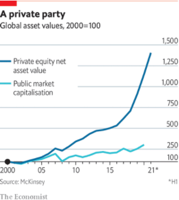  
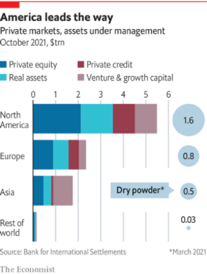  

#### 12.2 _Strategic priorities:_ [Alternative fund managers are increasingly mainstream](https://www.economist.com/special-report/2022/02/23/alternative-fund-managers-are-increasingly-mainstream)  
But many “artisanal” PE firms are touting themselves as specialists  
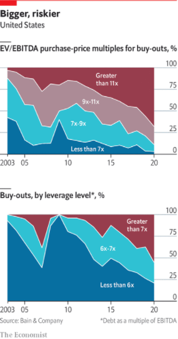  

#### 12.3 _The investors:_ [Investors rely more and more on higher returns from private markets](https://www.economist.com/special-report/2022/02/23/investors-rely-more-and-more-on-higher-returns-from-private-markets)  
The institutional investors whose capital fuels private markets are growing more sophisticated. But picking winners gets no easier  
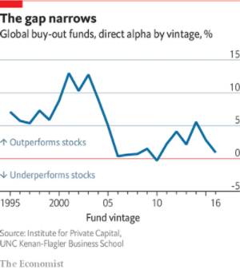  

#### 12.4 _Private credit:_ [More borrowers turn to private markets for credit](https://www.economist.com/special-report/2022/02/23/more-borrowers-turn-to-private-markets-for-credit)  
Asset managers rush in where banks fear to tread, transforming a formerly niche market  
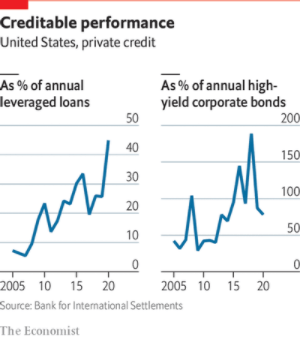  

#### 12.5 _Regulation and reputation:_ [Regulators have private markets in their sights](https://www.economist.com/special-report/2022/02/23/regulators-have-private-markets-in-their-sights)  
Criticism of private equity is overdone. That won’t stop regulators giving it a harder time  

#### 12.6 _The third age:_ [Private markets are less rewarding than they used to be](https://www.economist.com/special-report/2022/02/23/private-markets-are-less-rewarding-than-they-used-to-be)  
The future may well be bright. It will certainly be less high-octane  

#### 12.7 
### 13. Business
#### 13.1 _The techno-independence movement:_ [China wants to insulate itself against Western sanctions](https://www.economist.com/business/china-wants-to-insulate-itself-against-western-sanctions/21807805)  
We assess its progress in six critical technologies  
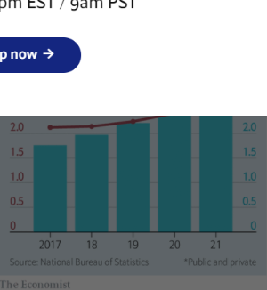  
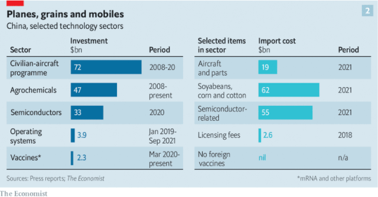  

#### 13.2 _Perfect storm:_ [Sea Group faces choppier waters](https://www.economist.com/business/2022/02/26/sea-group-faces-choppier-waters)  
After a period of smooth sailing, conditions have turned against South-East Asia’s super-app  

#### 13.3 _Bartleby:_ [The unseen costs of dirty work](https://www.economist.com/business/2022/02/26/the-unseen-costs-of-dirty-work)  
Work confers dignity. But some jobs are also a source of stigma  

#### 13.4 _Culture vultures:_ [Private equity is buying up America’s newspapers](https://www.economist.com/business/2022/02/26/private-equity-is-buying-up-americas-newspapers)  
It may be helping more than it’s hurting  
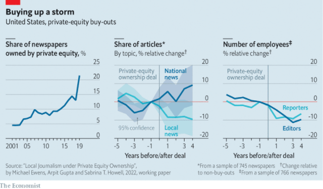  

#### 13.5 _Burger flip-out:_ [What is Carl Icahn’s beef with McDonald’s?](https://www.economist.com/business/2022/02/26/what-is-carl-icahns-beef-with-mcdonalds)  
It isn’t about shareholder value  
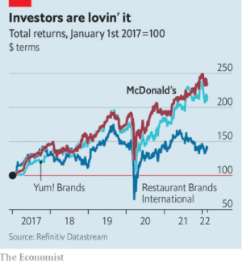  

#### 13.6 _Reverse gear:_ [Porsche and Volkswagen are set to uncouple—at last](https://www.economist.com/business/2022/02/26/porsche-and-volkswagen-are-set-to-uncouple-at-last)  
A flotation will end an uneasy relationship  

#### 13.7 _Schumpeter:_ [How Gazprom helps the Kremlin put the squeeze on Europe](https://www.economist.com/business/how-gazprom-helps-the-kremlin-put-the-squeeze-on-europe/21807841)  
Vladimir Putin’s python may tie itself in knots  

### 14. Finance & economics
#### 14.1 _Trading with the enemy:_ [The economic consequences of the war in Ukraine](https://www.economist.com/finance-and-economics/2022/02/25/the-economic-consequences-of-the-war-in-ukraine)  
Expect higher inflation, lower growth and some disruption to financial markets  

#### 14.2 _Artful dodging:_ [America’s tariff wall on Chinese imports looks increasingly like Swiss cheese](https://www.economist.com/finance-and-economics/americas-tariff-wall-on-chinese-imports-looks-increasingly-like-swiss-cheese/21807816)  
As avoidance booms, so does the trade deficit  
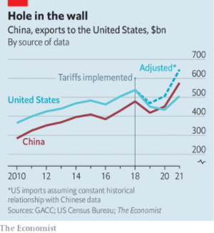  

#### 14.3 _Lost and fund:_ [Despite bulging debt everywhere, the IMF is struggling to be helpful](https://www.economist.com/finance-and-economics/2022/02/26/despite-bulging-debt-everywhere-the-imf-is-struggling-to-be-helpful)  
The world’s lender of last resort is hampered by geopolitical tensions  
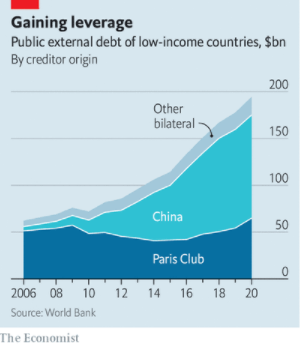  

#### 14.4 _Karat and stick:_ [Gold demand has surged in India](https://www.economist.com/finance-and-economics/2022/02/26/gold-demand-has-surged-in-india)  
Despite the government’s efforts, Indians are rushing to stash metal under the mattress  
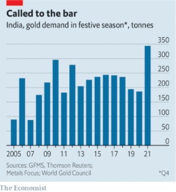  

#### 14.5 _The future of Generali:_ [The battle to modernise Italy's corporate governance](https://www.economist.com/finance-and-economics/2022/02/25/the-battle-to-modernise-italys-corporate-governance)  
A bank fights billionaires over the fate of the country's largest insurance firms  

#### 14.6 _Getting sticky:_ [With maverick policies, Turkey cannot hope to bring down prices](https://www.economist.com/finance-and-economics/2022/02/25/with-maverick-policies-turkey-cannot-hope-to-bring-down-prices)  
Stabilising the lira will not be enough to stave off inflation  

#### 14.7 _Buttonwood:_ [The many virtues of the yen, the rich world’s cheapest currency](https://www.economist.com/finance-and-economics/2022/02/26/the-many-virtues-of-the-yen-the-rich-worlds-cheapest-currency)  
Japan has low inflation, cheap stocks and a strong international balance-sheet  

#### 14.8 _Free exchange:_ [How to avoid a fatal backlash against globalisation](https://www.economist.com/finance-and-economics/2022/02/26/how-to-avoid-a-fatal-backlash-against-globalisation)  
Studying how the first era ended could help preserve the second  

### 15. Science & technology
#### 15.1 _Robotics:_ [Covid has reset relations between people and robots](https://www.economist.com/science-and-technology/covid-has-reset-relations-between-people-and-robots/21807815)  
Machines will do the nasty jobs; human beings the nice ones  
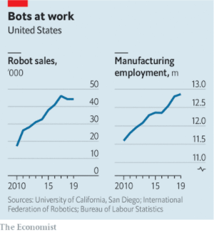  

#### 15.2 _Neuroscience:_ [Organoids and neuron transplants give new ways to study the brain](https://www.economist.com/science-and-technology/organoids-and-neuron-transplants-give-new-ways-to-study-the-brain/21807824)  
But they also bring ethical concerns  

#### 15.3 _Epigenetic inheritance:_ [A strange case of intergenerational memory](https://www.economist.com/science-and-technology/a-strange-case-of-intergenerational-memory/21807825)  
Nematode progeny “remember” bacteria encountered by a parent  

#### 15.4 _Lithium production:_ [Two new ways of extracting lithium from brine](https://www.economist.com/science-and-technology/two-new-ways-of-extracting-lithium-from-brine/21807823)  
How to increase the supply of an increasingly valuable metal  

#### 15.5 _Science and the law:_ [Eyewitness evidence is more reliable than has been thought](https://www.economist.com/science-and-technology/eyewitness-evidence-is-more-reliable-than-has-been-thought/21807826)  
But only the first time you ask  

### 16. Culture
#### 16.1 _Art and regeneration:_ [Mexico revives a tradition of painting murals with a purpose](https://www.economist.com/culture/2022/02/26/mexico-revives-a-tradition-of-painting-murals-with-a-purpose)  
Iztapalapa, a teeming neighbourhood on the outskirts of Mexico City, is the heart of the trend  

#### 16.2 _Novel-prizewinning fiction:_ [Olga Tokarczuk’s “The Books of Jacob” is a wild, unruly saga](https://www.economist.com/culture/2022/02/26/olga-tokarczuks-the-books-of-jacob-is-a-wild-unruly-saga)  
It takes readers on a “fantastic journey across seven borders, five languages and three major religions”  

#### 16.3 _Home Entertainment:_ [“Nosferatu” and the birth of the undead](https://www.economist.com/culture/2022/02/26/nosferatu-and-the-birth-of-the-undead)  
On screen, killing monsters has always been a job for women  

#### 16.4 _The Nixon presidency:_ [In his memoir, an aide to Richard Nixon recalls him fondly](https://www.economist.com/culture/2022/02/26/in-his-memoir-an-aide-to-richard-nixon-recalls-him-fondly)  
Dwight Chapin is loyal to his former boss in “The President’s Man”  

#### 16.5 _Refugees and reportage:_ [A journalist joins his Afghan friend’s odyssey to Europe](https://www.economist.com/culture/2022/02/26/a-journalist-joins-his-afghan-friends-odyssey-to-europe)  
Matthieu Aikins chronicles their journey in “The Naked Don’t Fear the Water”  

### 17. Economic & financial indicators
#### 17.1 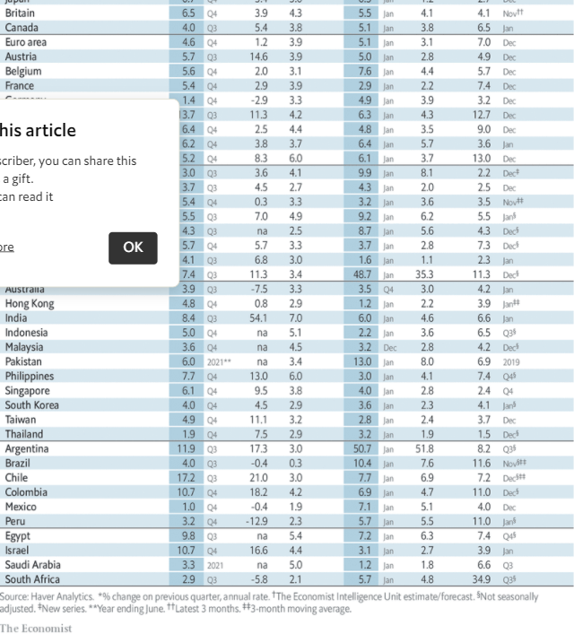  
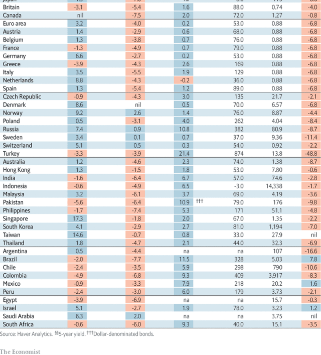  
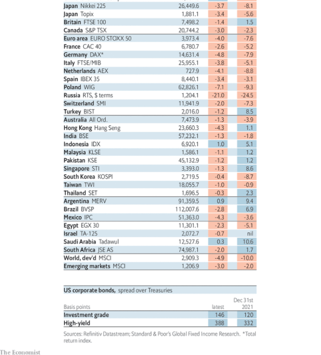  
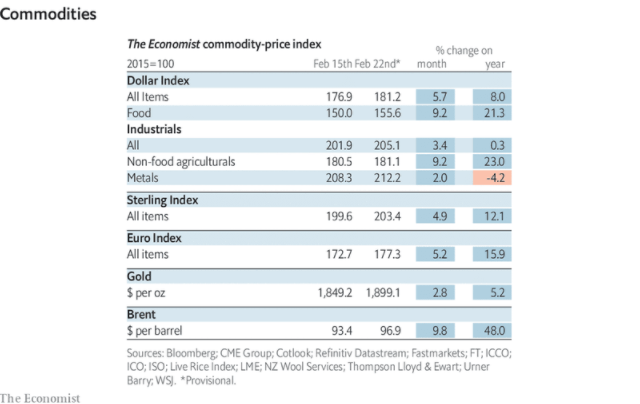  

### 18. Graphic detail
#### 18.1 _More equal than others:_ [Are some countries faking their covid-19 death counts?](https://www.economist.com/graphic-detail/2022/02/25/are-some-countries-faking-their-covid-19-death-counts)  
An elementary statistical test casts doubt on some abnormally neat numbers  
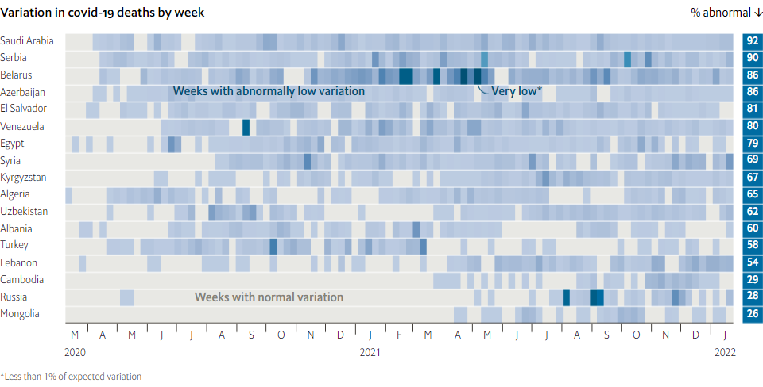  

### 19. Obituary
#### 19.1 _Lone Humourist Scourge:_ [P.J. O’Rourke hoped to make life hell for do-gooders everywhere](https://www.economist.com/obituary/2022/02/26/pj-orourke-hoped-to-make-life-hell-for-do-gooders-everywhere)  
America’s sharpest satirist died on February 15th, aged 74  

