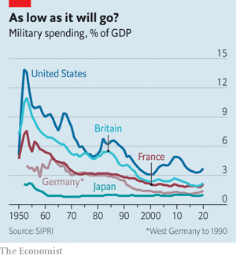
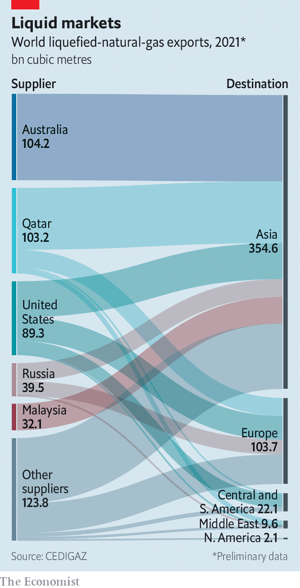
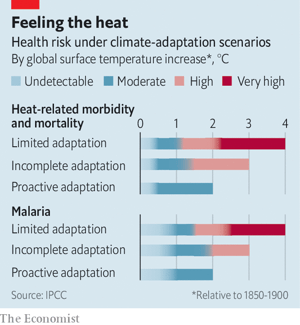

### 1. The world this week
#### 1.1   

#### 1.2 
#### 1.3   

### 2. Leaders
#### 2.1 _The invasion of Ukraine:_ [When Vladimir Putin escalates his war, the world must meet him](https://www.economist.com/leaders/2022/03/05/when-vladimir-putin-escalates-his-war-the-world-must-meet-him)  
Muttering nuclear threats, Russia’s president vows to prevail in Ukraine whatever it takes  

#### 2.2 _The world economy:_ [A new age of economic conflict](https://www.economist.com/leaders/a-new-age-of-economic-conflict/21807968)  
The West has used crushing sanctions on Russia. The implications are huge  
  

#### 2.3 _War and price:_ [Central banks should ignore soaring energy costs](https://www.economist.com/leaders/2022/03/05/central-banks-should-ignore-soaring-energy-costs)  
But they must continue fighting home-grown inflation  
  

#### 2.4 _Macron, and on:_ [France needs a proper debate ahead of its presidential election](https://www.economist.com/leaders/2022/03/05/france-needs-a-proper-debate-ahead-of-its-presidential-election)  
But time is running out  

#### 2.5 _Climate change:_ [Climate change must be adapted to as well as opposed](https://www.economist.com/leaders/2022/03/05/climate-change-must-be-adapted-to-as-well-as-opposed)  
Efforts to reduce its impact on lives and ecosystems are falling ever shorter  

### 3. Letters
#### 3.1 _On Vladimir Putin, Canada, vaccines, roadkill, Wordle:_ [Letters to the editor](https://www.economist.com/letters/2022/03/05/letters-to-the-editor)  
A selection of correspondence  

### 4. Briefing
#### 4.1 _Fearful symmetry:_ [Vladimir Putin’s invasion of Ukraine is wrecking two countries](https://www.economist.com/briefing/2022/03/05/vladimir-putins-invasion-of-ukraine-is-wrecking-two-countries)  
It is a tragedy, and it is a catastrophe  
  

#### 4.2 _The economic weapon:_ [Western sanctions on Russia are like none the world has seen](https://www.economist.com/briefing/2022/03/05/western-sanctions-on-russia-are-like-none-the-world-has-seen)  
But they may weaken the system they are meant to defend  

#### 4.3 _The post-post-cold-war world:_ [The war in Ukraine is going to change geopolitics profoundly](https://www.economist.com/briefing/2022/03/05/the-war-in-ukraine-is-going-to-change-geopolitics-profoundly)  
Some bits will look familiar, some will look unprecedented  
  
  

### 5. Europe
#### 5.1 _Exodus, again:_ [A new refugee crisis has come to Europe](https://www.economist.com/europe/2022/03/05/a-new-refugee-crisis-has-come-to-europe)  
Ukrainians are pouring into Poland. But many are heading the other way, to fight  
  

#### 5.2 _Unloved, but respected:_ [Emmanuel Macron bids for re-election as war roils Europe](https://www.economist.com/europe/2022/03/05/emmanuel-macron-bids-for-re-election-as-war-roils-europe)  
France’s president seems highly likely to keep his job  
  

#### 5.3 _A colossal task:_ [Rome’s new mayor tackles his predecessors’ mess](https://www.economist.com/europe/2022/03/05/romes-new-mayor-tackles-his-predecessors-mess)  
Roberto Gualtieri is making a fist of Italy’s hardest job  

#### 5.4 _Magnum castellum:_ [A Roman fort in Holland is linked to the conquest of Britain](https://www.economist.com/europe/2022/03/05/a-roman-fort-in-holland-is-linked-to-the-conquest-of-britain)  
Dutch archaeologists dig up a remnant of a successful invasion  

#### 5.5 _Charlemagne:_ [With war at its doors, Europe discovers a capacity for action](https://www.economist.com/europe/with-war-at-its-doors-europe-discovers-a-capacity-for-action/21807967)  
Germany signals the dawn of a new era  

### 6. Britain
#### 6.1 _Peak Nat:_ [Scotland’s constitutional debate is deadlocked, despite one crisis after another](https://www.economist.com/britain/2022/03/05/scotlands-constitutional-debate-is-deadlocked-despite-one-crisis-after-another)  
The United Kingdom seems to have weathered its moment of maximum danger  
  
  

#### 6.2 _Attitudes to immigration:_ [When it comes to refugees, Britons are both harsh and liberal](https://www.economist.com/britain/2022/03/05/when-it-comes-to-refugees-britons-are-both-harsh-and-liberal)  
No wonder their government is confused  

#### 6.3 _SEND help:_ [England’s special-education system is on its knees](https://www.economist.com/britain/2022/03/05/englands-special-education-system-is-on-its-knees)  
The number of pupils with the severest needs is shooting up  

#### 6.4 _Economic warpath:_ [Britain is severing financial links with Russia at a blistering pace](https://www.economist.com/britain/2022/03/05/britain-is-severing-financial-links-with-russia-at-a-blistering-pace)  
Among other measures is a long-delayed bill aimed at flushing out dirty money, whatever the source  

#### 6.5 _Indecent proposals:_ [The age of marriage is being raised in England and Wales](https://www.economist.com/britain/2022/03/05/the-age-of-marriage-is-being-raised-in-england-and-wales)  
The move is welcome, but late  

#### 6.6 _Trojan Horse rides again:_ [“The Trojan Horse Affair” reignites a row over radicalisation in schools](https://www.economist.com/britain/2022/03/05/the-trojan-horse-affair-reignites-a-row-over-radicalisation-in-schools)  
A punchy podcast fuels debate over Prevent, a British anti-terrorism programme  

#### 6.7 _Bagehot:_ [The rise and fall of Londongrad](https://www.economist.com/britain/2022/03/05/the-rise-and-fall-of-londongrad)  
The era of Russian money in London is over. Other rich foreigners will fill the gap  

### 7. Middle East & Africa
#### 7.1 _The parallel state:_ [South Africans are building alternatives to public services](https://www.economist.com/middle-east-and-africa/2022/03/05/south-africans-are-building-alternatives-to-public-services)  
When the government fails, people fend for themselves  

#### 7.2 _Class struggle:_ [The need to pay for education draws Africans into the market](https://www.economist.com/middle-east-and-africa/2022/03/05/the-need-to-pay-for-education-draws-africans-into-the-market)  
But not all earn enough to afford it  

#### 7.3 _Fear moves south:_ [The world’s centre of terrorism has shifted to the Sahel](https://www.economist.com/middle-east-and-africa/2022/03/05/the-worlds-centre-of-terrorism-has-shifted-to-the-sahel)  
Last year almost half of those killed by terrorists were in sub-Saharan Africa  
  

#### 7.4 _General engineering:_ [Egypt’s President Sisi wants to reshape its cities](https://www.economist.com/middle-east-and-africa/2022/03/05/egypts-president-sisi-wants-to-reshape-its-cities)  
The rich will get luxury homes and quick commutes. The poor fear displacement  
  

#### 7.5 _Message in a bottleneck:_ [Israel hopes new data cables can make friends of former enemies](https://www.economist.com/middle-east-and-africa/2022/03/05/israel-hopes-new-data-cables-can-make-friends-of-former-enemies)  
They will also break an Egyptian monopoly on internet traffic  
  

### 8. United States
#### 8.1 _State of the union:_ [Joe Biden’s state-of-the-union address fails to impress](https://www.economist.com/united-states/joe-bidens-state-of-the-union-address-fails-to-impress/21807943)  
Ukraine aside, a gaffe-laden speech does nothing to turn Democrats’ problems around  
  

#### 8.2 _Gas tax:_ [The debate over suspending America’s petrol tax](https://www.economist.com/united-states/2022/03/05/the-debate-over-suspending-americas-petrol-tax)  
Shaky economics v shiny politics  

#### 8.3 _Little Odessa and Ukraine Village:_ [America’s Ukrainians rally and mobilise](https://www.economist.com/united-states/2022/03/05/americas-ukrainians-rally-and-mobilise)  
Preparing for a fifth wave of immigrants  

#### 8.4 _Carbon trackers:_ [Carbon-footprint calculators and their lessons](https://www.economist.com/united-states/2022/03/05/carbon-footprint-calculators-and-their-lessons)  
What households and companies can learn about global warming from online carbon trackers  
  

#### 8.5 _Climate control:_ [The Supreme Court may throttle Joe Biden’s plans to reduce greenhouse-gas emissions](https://www.economist.com/united-states/2022/03/05/the-supreme-court-may-throttle-joe-bidens-plans-to-reduce-greenhouse-gas-emissions)  
The justices seem inclined to curtail the Environmental Protection Agency’s authority  

#### 8.6 _Transgender rights:_ [Don’t mess with minors’ sex in Texas](https://www.economist.com/united-states/2022/03/05/dont-mess-with-minors-sex-in-texas)  
Governor Greg Abbott demands that treatment with puberty blockers be investigated as child abuse  

#### 8.7 _Lexington:_ [The end of the Putin delusion](https://www.economist.com/united-states/2022/03/05/the-end-of-the-putin-delusion)  
Donald Trump’s party is returning to its senses on Russia  

### 9. The Americas
#### 9.1 _South America’s rust belt:_ [Why industrial decline has been so stark in Brazil](https://www.economist.com/the-americas/2022/03/05/why-industrial-decline-has-been-so-stark-in-brazil)  
No other country has seen manufacturing as a share of GDP vanish so fast  
  

#### 9.2 _Parks and wrecking:_ [Nicolás Maduro lets miners trash Venezuela’s forests](https://www.economist.com/the-americas/2022/03/05/nicolas-maduro-lets-miners-trash-venezuelas-forests)  
“Ecosocialism” apparently means bulldozing nature to build mansions  

#### 9.3 _Honk for impunity:_ [Bolivia is awash with contraband cars from Japan](https://www.economist.com/the-americas/2022/03/05/bolivia-is-awash-with-contraband-cars-from-japan)  
Around 25,000 so-called chutos enter the country every year  

### 10. Asia
#### 10.1 _Offshore Beijing:_ [China-watchers are fleeing the country for other Asian hubs](https://www.economist.com/asia/2022/03/05/china-watchers-are-fleeing-the-country-for-other-asian-hubs)  
The exodus is turning Singapore into the Vienna of the 21st century  

#### 10.2 _Crime and no punishment:_ [Singapore’s high court retains an anti-gay law](https://www.economist.com/asia/2022/03/05/singapores-high-court-retains-an-anti-gay-law)  
But only because it is not enforced  

#### 10.3 _An unedifying campaign:_ [South Korea’s presidential election springs a last-minute surprise](https://www.economist.com/asia/2022/03/05/voters-are-split-down-the-middle-in-south-koreas-presidential-election)  
It will not help improve the mood of the electorate  

#### 10.4 _Liberty bale:_ [Uzbekistan has succeeded in abolishing forced labour](https://www.economist.com/asia/2022/03/05/uzbekistan-has-succeeded-in-abolishing-forced-labour)  
Workers are even usually paid in full and on time  

#### 10.5 _Banyan:_ [Ukraine has changed how Taiwanese see themselves](https://www.economist.com/asia/2022/03/05/ukraine-has-changed-how-taiwanese-see-themselves)  
The spectre of a powerful country gobbling up a smaller neighbour has sharpened minds  

### 11. China
#### 11.1 _Bullying a Balt:_ [Lithuania sees threats from two big powers: Russia and China](https://www.economist.com/china/2022/03/05/lithuania-sees-threats-from-two-big-powers-russia-and-china)  
Russia is bombing one European democracy; China is boycotting another  

#### 11.2 _Immunity with Chinese characteristics:_ [Foreign embassies in China puzzle over a diplomat’s detention](https://www.economist.com/china/2022/03/05/foreign-embassies-in-china-puzzle-over-a-diplomats-detention)  
Was it a calculated warning or spooks gone rogue?  

#### 11.3 _Chaguan:_ [Vladimir Putin is an imperialist, but China does not care](https://www.economist.com/china/vladimir-putin-is-an-imperialist-but-china-does-not-care/21807942)  
China and Russia agree that big countries should run the world  

#### 11.4 _Jobs at The Economist:_ [We’re hiring a China-focused data journalist](https://www.economist.com/china/2022/03/05/were-hiring-a-china-focused-data-journalist)  
Join The Economist’s efforts to cover the world’s largest country  

### 12. Business
#### 12.1 _How to escape the bear market:_ [Europe reconsiders its energy future](https://www.economist.com/business/2022/03/05/europe-reconsiders-its-energy-future)  
Will oil at more than $100 a barrel, gas markets in turmoil and war be enough to wean Europe off Russian gas?  
  
  

#### 12.2 _The exodus:_ [Western businesses pull out of Russia](https://www.economist.com/business/western-businesses-pull-out-of-russia/21807961)  
Abandoning the country is easier for some firms than others  

#### 12.3 _Advancing on all fronts:_ [Russia’s attack on Ukraine means more military spending](https://www.economist.com/business/2022/03/05/russias-attack-on-ukraine-means-more-military-spending)  
The defence industry looks set for bigger business  
  

#### 12.4 _Tesla in Germany:_ [Will Elon Musk change Germany?](https://www.economist.com/business/2022/03/05/will-elon-musk-change-germany)  
Or will Germany change Elon Musk?  

#### 12.5 _Bartleby:_ [Company or cult?](https://www.economist.com/business/2022/03/05/company-or-cult)  
The dividing line between firm and sect is often thin. How to tell them apart  

#### 12.6 _Schumpeter:_ [How Europe’s commodities traders took a gamble too far on Putin’s regime](https://www.economist.com/business/how-europes-commodities-traders-took-a-gamble-too-far-on-putins-regime/21807944)  
This is one war they may not be able to win  

### 13. Finance & economics
#### 13.1 _The other crisis:_ [China scrambles to prevent property pandemonium](https://www.economist.com/finance-and-economics/china-scrambles-to-prevent-property-pandemonium/21807940)  
As defaults escalate, another shock threatens to hit the global economy  
  

#### 13.2 _The world economy at war:_ [War and sanctions means higher inflation](https://www.economist.com/finance-and-economics/2022/03/05/war-and-sanctions-means-higher-inflation)  
But not necessarily higher interest rates  
  

#### 13.3 _Shock, stocks and barrels:_ [The war in Europe is a triple whammy for emerging markets](https://www.economist.com/finance-and-economics/2022/03/05/the-war-in-europe-is-a-triple-whammy-for-emerging-markets)  
It will add to an already long list of headaches  

#### 13.4 _Nyet interest:_ [European banks have most to lose in Russia](https://www.economist.com/finance-and-economics/2022/03/05/european-banks-have-most-to-lose-in-russia)  
And it’s not just about loans  
  

#### 13.5 _Kindred Seoul:_ [South Korea’s economy threatens to become like Japan’s](https://www.economist.com/finance-and-economics/2022/03/05/south-koreas-economy-threatens-to-become-like-japans)  
That could spell enormous trouble  

#### 13.6 _Buttonwood:_ [Investors are terrible at forecasting wars](https://www.economist.com/finance-and-economics/2022/03/05/investors-are-terrible-at-forecasting-wars)  
Markets are just as clueless after conflicts happen  

#### 13.7 _Free exchange:_ [Vladimir Putin’s Fortress Russia is crumbling](https://www.economist.com/finance-and-economics/2022/03/05/vladimir-putins-fortress-russia-is-crumbling)  
The chaos in Russian markets shows the impossibility of economic “self-reliance”  

### 14. Science & technology
#### 14.1 _Climate change:_ [The latest UN climate report is gloomy, with some sunny patches](https://www.economist.com/science-and-technology/the-latest-un-climate-report-is-gloomy-with-some-sunny-patches/21807952)  
It says that adaptation is as important as prevention  
  

#### 14.2 _Atolls as power stations:_ [How to power Pacific islands](https://www.economist.com/science-and-technology/how-to-power-pacific-islands/21807951)  
Turn the atolls themselves into power stations  

#### 14.3 _Science, diplomacy and the war in Ukraine:_ [What future is there for Russia’s foreign science collaborations?](https://www.economist.com/science-and-technology/2022/03/02/what-future-is-there-for-russias-foreign-science-collaborations/21807946)  
Mixed, at best. Non-existent at worst  

#### 14.4 _The origin of covid-19:_ [More evidence that covid-19 started in a market, not a laboratory](https://www.economist.com/science-and-technology/more-evidence-that-covid-19-started-in-a-market-not-a-laboratory/21807945)  
Two new papers make the case robustly  

### 15. Culture
#### 15.1 _American politics:_ [A history of the Democratic Party offers lessons for leaders today](https://www.economist.com/culture/2022/03/05/a-history-of-the-democratic-party-offers-lessons-for-leaders-today)  
The party has succeeded by focusing on the economy, Michael Kazin argues  

#### 15.2 _American fauna:_ [A new book charts the changing fortunes of America’s national bird](https://www.economist.com/culture/2022/03/05/a-new-book-charts-the-changing-fortunes-of-americas-national-bird)  
The bald eagle was not always venerated, Jack Davis shows  

#### 15.3 _World in a dish:_ [Ukraine has a glorious cuisine that is all its own](https://www.economist.com/culture/2022/03/05/ukraine-has-a-glorious-cuisine-that-is-all-its-own)  
Foods, like countries, can be intertwined but still remain distinct  

#### 15.4 _Behind the veil:_ [An anthology by female writers shows a different Afghanistan](https://www.economist.com/culture/2022/03/05/an-anthology-by-female-writers-shows-a-different-afghanistan)  
The stories in “My Pen is the Wing of a Bird” depict the resilience and humanity of Afghan women  

#### 15.5 _Back Story:_ [In a resonant staging of “Henry V”, war is murder in uniform](https://www.economist.com/culture/2022/03/05/in-a-resonant-staging-of-henry-v-war-is-murder-in-uniform)  
Shakespeare was unblinking about the heartlessness and horror of conflict  

### 16. Economic & financial indicators
#### 16.1   
  
  
  

### 17. Graphic detail
#### 17.1 _The bear’s market:_ [Western sanctions have rocked Russia’s financial system](https://www.economist.com/graphic-detail/2022/03/05/western-sanctions-have-rocked-russias-financial-system)  
But the damage so far pales in comparison with the financial crisis of 1998  
  
  
  

### 18. Obituary
#### 18.1 _Last of the line:_ [Cristina Calderón was the only full-blooded member of her people](https://www.economist.com/obituary/2022/03/05/cristina-calderon-was-the-only-full-blooded-member-of-her-people)  
The champion of Yaghan language and culture died on February 16th, aged 93  

