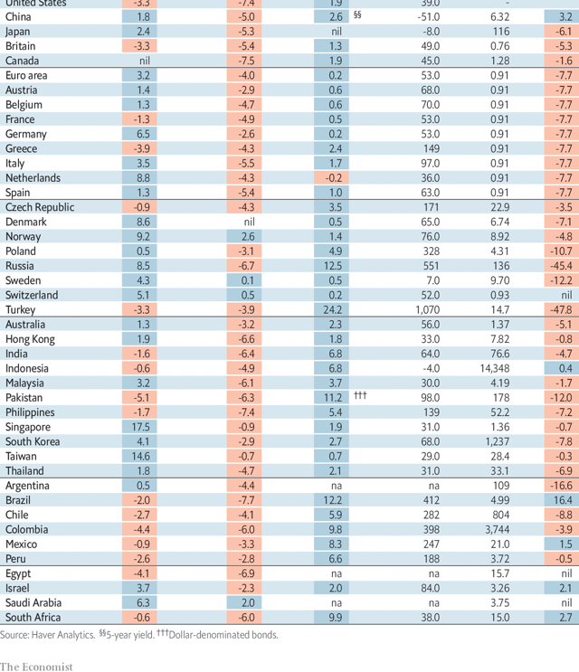
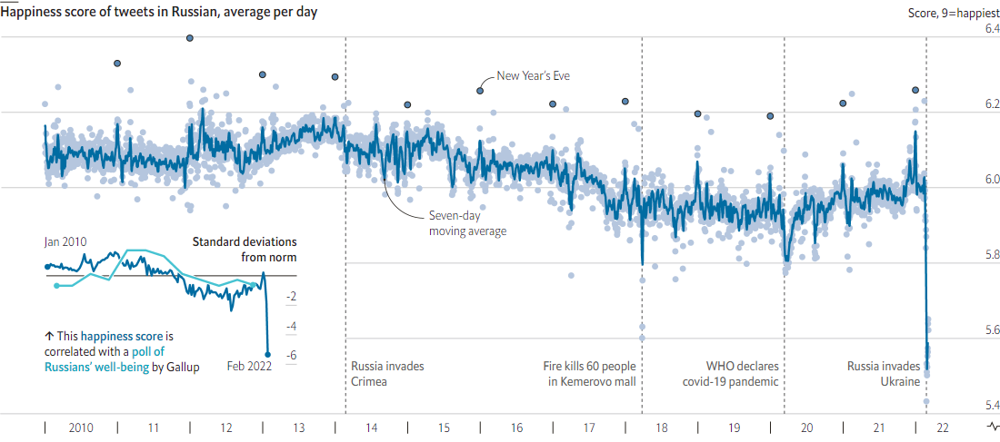

### 1. The world this week
#### 1.1   

#### 1.2   

#### 1.3   

### 2. Leaders
#### 2.1 _Vladimir Putin’s dictatorship:_ [The Stalinisation of Russia](https://www.economist.com/leaders/2022/03/12/the-stalinisation-of-russia)  
As it sinks in that he cannot win in Ukraine, Vladimir Putin is resorting to repression at home  

#### 2.2 _Fuel, food and fury:_ [War and sanctions have caused commodities chaos](https://www.economist.com/leaders/2022/03/12/war-and-sanctions-have-caused-commodities-chaos)  
The world must rise to the challenge  
  

#### 2.3 _Sanctions:_ [Will China offer Russia financial help?](https://www.economist.com/leaders/2022/03/12/will-china-offer-russia-financial-help)  
A bit. But it will mostly seek to learn from Russia’s mistakes  
  

#### 2.4 _Britain and Ukraine:_ [The British government’s response to Ukrainian refugees is sadly typical](https://www.economist.com/leaders/the-british-governments-response-to-ukrainian-refugees-is-sadly-typical/21808100)  
Just ask an Afghan  

#### 2.5 _From prosecutor to president:_ [South Korea’s new leader must restore his citizens’ faith in politics](https://www.economist.com/leaders/2022/03/12/south-koreas-new-leader-must-restore-his-citizens-faith-in-politics)  
After Yoon Suk-yeol’s narrow victory, time to stop the mudslinging  

### 3. Letters
#### 3.1 _On Cambodian diplomacy, green subsidies, “Peaky Blinders”, Keynes, Colorado, nutritional ratings, robots, video meetings:_ [Letters to the editor](https://www.economist.com/letters/2022/03/12/letters-to-the-editor)  
A selection of correspondence  

### 4. By Invitation
#### 4.1 
#### 4.2 
#### 4.3 
#### 4.4 
#### 4.5 
### 5. Briefing
#### 5.1 _Occupation? No thanks!:_ [Russian soldiers expecting to be welcomed to Ukraine were soon disabused](https://www.economist.com/briefing/2022/03/12/russian-soldiers-expecting-to-be-welcomed-to-ukraine-were-soon-disabused)  
Now things are turning nastier  

#### 5.2 _The great leap backward:_ [Vladimir Putin is pushing Russia into the past](https://www.economist.com/briefing/2022/03/12/vladimir-putin-is-pushing-russia-into-the-past)  
Maybe by a generation, maybe by a century  
  
  
  

### 6. Europe
#### 6.1 _The frontline state:_ [Why Poland has become NATO’s linchpin in the war in Ukraine](https://www.economist.com/europe/poland-will-play-an-outsized-role-in-western-efforts-to-assist-ukraine/21808064)  
The West no longer dismisses its warnings about Russia  
  

#### 6.2 _The compromise candidate:_ [Meet Turkish President Erdogan’s presumptive challenger](https://www.economist.com/europe/2022/03/10/meet-turkish-president-erdogans-presumptive-challenger)  
Kemal Kilicdaroglu might make a better president than he does a campaigner  

#### 6.3 _Political boosters:_ [Hungary’s government uses anti-covid campaigns for propaganda](https://www.economist.com/europe/2022/03/12/hungarys-government-uses-anti-covid-campaigns-for-propaganda)  
Viktor Orban’s party uses a vaccination database as an email list  

#### 6.4 _Paris grudge match:_ [Marine Le Pen hopes for another face-off against Emmanuel Macron](https://www.economist.com/europe/2022/03/12/marine-le-pen-hopes-for-another-face-off-against-emmanuel-macron)  
The populist’s third try at France’s presidency is unlikely to succeed  

#### 6.5 _Charlemagne:_ [Europe is doing a good job helping refugees from Ukraine](https://www.economist.com/europe/2022/03/12/europe-is-doing-a-good-job-helping-refugees-from-ukraine)  
But the road ahead will be long  

### 7. Britain
#### 7.1 _No more manic Mondays:_ [Two years on, Britain’s capital has recovered from covid-19](https://www.economist.com/britain/2022/03/12/two-years-on-britains-capital-has-recovered-from-covid-19)  
In some ways, Brexit has helped  
  
  

#### 7.2 _Failure to launch:_ [Britain’s government bailed out OneWeb in 2020. Now it’s in trouble](https://www.economist.com/britain/2022/03/12/britains-government-bailed-out-oneweb-in-2020-now-its-in-trouble)  
Losing access to Russian launchpads is a big blow for the satellite-internet company  

#### 7.3 _Too close for comfort:_ [Body cameras are moving into British retail](https://www.economist.com/britain/2022/03/12/body-cameras-are-moving-into-british-retail)  
The pandemic saw a rise in customers harassing staff  

#### 7.4 _Big employer is watching you:_ [Companies are spying on job candidates online](https://www.economist.com/britain/2022/03/12/companies-are-spying-on-job-candidates-online)  
Online vetting is spreading—and worrying  

#### 7.5 _Twists and turns:_ [Higher inflation is raising the cost of servicing Britain’s government debt](https://www.economist.com/britain/2022/03/12/higher-inflation-is-raising-the-cost-of-servicing-britains-government-debt)  
The overall effect on the public finances is complicated  

#### 7.6 _Language lessons:_ [Chinese money is pouring into British universities](https://www.economist.com/britain/2022/03/12/chinese-money-is-pouring-into-british-universities)  
Critics claim it comes at the cost of free speech  

#### 7.7 _Bagehot:_ [The Conservatives are planning to overhaul the Human Rights Act](https://www.economist.com/britain/2022/03/12/the-conservatives-are-planning-to-overhaul-the-human-rights-act)  
Prepare for Brexit: the sequel  

### 8. Middle East & Africa
#### 8.1 _Bread and oil:_ [How the invasion of Ukraine will spread hunger in the Middle East and Africa](https://www.economist.com/middle-east-and-africa/how-the-invasion-of-ukraine-will-spread-hunger-in-the-middle-east-and-africa/21808072)  
By raising the price of food and fuel, Vladimir Putin’s war will cause misery and unrest  
  

#### 8.2 _Dashing dishdashas:_ [Why Omanis are required to dress up](https://www.economist.com/middle-east-and-africa/2022/03/12/why-omanis-are-required-to-dress-up)  
Their sultan wants to maintain sartorial standards  

#### 8.3 _Nostalgia and Kalashnikovs:_ [Why Russia wins some sympathy in Africa and the Middle East](https://www.economist.com/middle-east-and-africa/2022/03/12/why-russia-wins-some-sympathy-in-africa-and-the-middle-east)  
But countries in the region will try to avoid choosing between it and the West  
  
  

#### 8.4 _Holidays near hell:_ [Lamu, a beautiful Kenyan tourist bubble surrounded by pins](https://www.economist.com/middle-east-and-africa/2022/03/12/lamu-a-beautiful-kenyan-tourist-bubble-surrounded-by-pins)  
Locals are wary of jihadists, drugs and modernity  
  

### 9. United States
#### 9.1 _The pandemic, two years on:_ [Taking stock as America moves into a new phase of the pandemic](https://www.economist.com/united-states/2022/03/10/taking-stock-as-america-moves-into-a-new-phase-of-the-pandemic)  
Planning for the future should involve a frank look at the country’s poor performance over the past two years  
  

#### 9.2 _The Golden State’s housing shortage:_ [California’s efforts to house more people have fallen short](https://www.economist.com/united-states/2022/03/12/californias-efforts-to-house-more-people-have-fallen-short)  
A fiasco at UC Berkeley is merely the latest evidence of deep troubles  

#### 9.3 _Genetic testing for pets:_ [Americans are testing their dogs’ DNA, with some remarkable results](https://www.economist.com/united-states/americans-are-testing-their-dogs-dna-with-some-remarkable-results/21808080)  
The practice is becoming increasingly popular  

#### 9.4 _Chicagoland politics:_ [The Michael Madigan indictment is evidence of the turn against patronage](https://www.economist.com/united-states/2022/03/10/the-michael-madigan-indictment-is-evidence-of-the-turn-against-patronage)  
Old-school politics in Chicago is not yet dead, but it is in decline  

#### 9.5 _A tale of two cities:_ [What Buckeye and Youngstown say about America’s economy](https://www.economist.com/united-states/2022/03/12/what-buckeye-and-youngstown-say-about-americas-economy)  
A boom town and a bust town show surprising signs of convergence  
  

#### 9.6 _Lexington:_ [Joe Biden’s indispensable leadership](https://www.economist.com/united-states/2022/03/12/joe-bidens-indispensable-leadership)  
The administration has played a weak diplomatic hand on Ukraine skilfully. But the crisis is only beginning  

### 10. The Americas
#### 10.1 _Many shades of pink:_ [A new group of left-wing presidents takes over in Latin America](https://www.economist.com/the-americas/2022/03/12/a-new-group-of-left-wing-presidents-takes-over-in-latin-america)  
They have more differences than similarities  
  

### 11. Asia
#### 11.1 _Abstemious to a fault:_ [Why won’t India’s government condemn Vladimir Putin?](https://www.economist.com/asia/why-wont-indias-government-condemn-vladimir-putin/21808074)  
It thinks it has more to lose from alienating him than from annoying the West  

#### 11.2 _Extreme no more:_ [Australia is battered by catastrophic floods](https://www.economist.com/asia/2022/03/10/australia-is-battered-by-catastrophic-floods)  
Freakish weather is becoming increasingly common  

#### 11.3 _Wishy-washy victory:_ [Yoon Suk-yeol will be the next president of South Korea](https://www.economist.com/asia/2022/03/12/yoon-suk-yeol-will-be-the-next-president-of-south-korea)  
He was elected in the closest race in his country’s democratic history  

#### 11.4 _Uttar domination:_ [Narendra Modi’s party triumphs in India’s bellwether state](https://www.economist.com/asia/2022/03/12/narendra-modis-party-triumphs-in-indias-bellwether-state)  
The Bharatiya Janata Party holds on to Uttar Pradesh, while Congress collapses in Punjab  
  

#### 11.5 _Banyan:_ [It is getting harder for small states to balance great powers](https://www.economist.com/asia/2022/03/12/it-is-getting-harder-for-small-states-to-balance-great-powers)  
A decade-long saga in Nepal shows the difficulty of keeping everyone happy  

### 12. China
#### 12.1 _Shaking the money tree:_ [To meet its ambitious growth target, China turns to stimulus](https://www.economist.com/china/2022/03/12/to-meet-its-ambitious-growth-target-china-turns-to-stimulus)  
But it’s the stealthy sort  
  

#### 12.2 _Brave voices:_ [Some Chinese are daring to criticise Russia](https://www.economist.com/china/2022/03/10/some-chinese-are-daring-to-criticise-russia)  
Nationalist trolls and a stifling state would rather they did not  

#### 12.3 _Redefining zero:_ [China’s scientists are looking for a way out of the zero-covid policy](https://www.economist.com/china/2022/03/10/chinas-scientists-are-looking-for-a-way-out-of-the-zero-covid-policy)  
Politicians will have the ultimate say. Omicron may force them to act  
  

#### 12.4 _About face:_ [China is clamping down on food waste](https://www.economist.com/china/2022/03/12/china-is-clamping-down-on-food-waste)  
Clean your plate, says the state  

#### 12.5 _Chaguan:_ [Xi Jinping places a bet on Russia](https://www.economist.com/china/2022/03/12/xi-jinping-places-a-bet-on-russia)  
China’s backing for Vladimir Putin’s war is all about its contest with America  

### 13. Business
#### 13.1 _The travelling-salesman problem:_ [Amid Russia’s war, America Inc reckons with the promise and peril of foreign markets](https://www.economist.com/business/2022/03/12/amid-russias-war-america-inc-reckons-with-the-promise-and-peril-of-foreign-markets)  
Multinational companies grapple with a fracturing world  
  
  
  

#### 13.2 _Flight risk:_ [Sanctions on Russian aviation are a burden for Western firms](https://www.economist.com/business/2022/03/12/sanctions-on-russian-aviation-are-a-burden-for-western-firms)  
And could prove devastating for Aeroflot and other Russian airlines  
  

#### 13.3 _Bartleby:_ [The return of the crowded office](https://www.economist.com/business/2022/03/12/the-return-of-the-crowded-office)  
It will take time to readjust to the presence of real-life colleagues  

#### 13.4 _Work life in balance:_ [Is hybrid work the worst of both worlds?](https://www.economist.com/business/2022/03/12/is-hybrid-work-the-worst-of-both-worlds)  
Evidence is piling up that it might not be  
  

#### 13.5 _The glass-ceiling index:_ [How the pandemic has affected working women](https://www.economist.com/business/how-the-pandemic-has-affected-working-women/21808070)  
More women are climbing the corporate ladder. But more are also dropping off it  
  

#### 13.6 _Schumpeter:_ [It’s not easy being an oligarch](https://www.economist.com/business/its-not-easy-being-an-oligarch/21808095)  
What makes you a plutocrat can also bring you down  

### 14. Finance & economics
#### 14.1 _Barrelled over:_ [Can the world cope without Russia’s huge commodity stash?](https://www.economist.com/finance-and-economics/2022/03/12/can-the-world-cope-without-russias-huge-commodity-stash)  
High prices will outlast the war  
  
  

#### 14.2 _Grain damage:_ [War in Ukraine will cripple global food markets](https://www.economist.com/finance-and-economics/2022/03/12/war-in-ukraine-will-cripple-global-food-markets)  
The share of incomes spent on staples is about to jump everywhere  
  

#### 14.3 _Pipe dream:_ [Russia looks to Chinese financial plumbing to keep money flowing](https://www.economist.com/finance-and-economics/russia-looks-to-chinese-financial-plumbing-to-keep-money-flowing/21808071)  
It isn’t connected to the world well enough to help much  

#### 14.4 _War bonds:_ [Western credit markets are holding up remarkably well](https://www.economist.com/finance-and-economics/2022/03/12/western-credit-markets-are-holding-up-remarkably-well)  
Post-financial-crisis reforms are helping them weather the storm  
  

#### 14.5 _Buttonwood:_ [Iran’s flourishing stockmarket reflects its resilient economy](https://www.economist.com/finance-and-economics/2022/03/12/irans-flourishing-stockmarket-reflects-its-resilient-economy)  
The economy was hurt badly by sanctions but did not collapse  

#### 14.6 _The makers and the takers:_ [Our crony-capitalism index offers a window into Russia’s billionaire wealth](https://www.economist.com/finance-and-economics/2022/03/12/our-crony-capitalism-index-offers-a-window-into-russias-billionaire-wealth)  
Rich folk in autocratic countries remain vulnerable to the whims of dictators  
  
  

#### 14.7 _Free exchange:_ [How oil shocks have become less shocking](https://www.economist.com/finance-and-economics/2022/03/12/how-oil-shocks-have-become-less-shocking)  
Soaring crude prices stoke fears of recession, but the global economy looks resilient  

### 15. Science & technology
#### 15.1 _Improvised weapons:_ [Makeshift arms are pouring out of Ukraine’s ateliers](https://www.economist.com/science-and-technology/makeshift-arms-are-pouring-out-of-ukraines-ateliers/21808082)  
They will make life unpleasant for the invaders  

#### 15.2 _Communications in a war zone:_ [Technologies old and new keep Ukrainians in touch with the world](https://www.economist.com/science-and-technology/technologies-old-and-new-keep-ukrainians-in-touch-with-the-world/21808083)  
Battery radios and satellite internet both have jobs to do  
  

#### 15.3 _Medical technology:_ [An artificial nose may be able to detect Parkinson’s disease early](https://www.economist.com/science-and-technology/an-artificial-nose-may-be-able-to-detect-parkinsons-disease-early/21808079)  
The inspiration came from the strange case of a retired nurse  

#### 15.4 _Underwater archaeology:_ [The wreck of Endurance has been located](https://www.economist.com/science-and-technology/2022/03/12/the-wreck-of-endurance-has-been-located)  
She lies 1,600 fathoms down in the Weddell Sea  

### 16. Culture
#### 16.1 _A brief history of Londongrad:_ [A new book shows how Britain came to welcome dirty money](https://www.economist.com/culture/2022/03/12/a-new-book-shows-how-britain-came-to-welcome-dirty-money)  
In “Butler to the World”, Oliver Bullough calls for principles over profit  

#### 16.2 _Home Entertainment:_ [“Hunters in the Snow” is an immortal depiction of winter](https://www.economist.com/culture/2022/03/12/hunters-in-the-snow-is-an-immortal-depiction-of-winter)  
Pieter Bruegel’s painting is at once icy and vibrant  

#### 16.3 _Ottoman history:_ [In “The Lion House”, Suleiman the Magnificent comes to life](https://www.economist.com/culture/2022/03/12/in-the-lion-house-suleiman-the-magnificent-comes-to-life)  
Christopher de Bellaigue’s book reveals the allure and burden of power  

#### 16.4 _Neuroscience pioneers:_ [A new biography of the “father of the neuron”](https://www.economist.com/culture/a-new-biography-of-the-father-of-the-neuron/21808081)  
Santiago Ramón y Cajal was a “peasant genius” who won a Nobel prize  

#### 16.5 _Reflections from Ukraine:_ [“Lucky Breaks” features a different kind of Ukrainian hero](https://www.economist.com/culture/2022/03/12/lucky-breaks-features-a-different-kind-of-ukrainian-hero)  
Yevgenia Belorusets offers embroidery in place of sculpture, a document not a monument  

#### 16.6 _Johnson:_ [Rules for teaching grammar in schools](https://www.economist.com/culture/2022/03/12/rules-for-teaching-grammar-in-schools)  
It may not make children better writers. But it is valuable all the same  

### 17. Economic & financial indicators
#### 17.1   
  
  
  

### 18. Graphic detail
#### 18.1 _A house divided:_ [The war in Ukraine has made Russian social-media users glum](https://www.economist.com/graphic-detail/2022/03/12/the-war-in-ukraine-has-made-russian-social-media-users-glum)  
Posts on Twitter are far sadder today than at the start of the covid-19 pandemic  
  
  
  

### 19. Obituary
#### 19.1 _The blond bombshell:_ [Shane Warne believed that cricket should always be fun](https://www.economist.com/obituary/2022/03/12/shane-warne-believed-that-cricket-should-always-be-fun)  
The best-ever leg-break bowler died on March 4th, aged 52  

