### 1. The world this week
#### 1.1 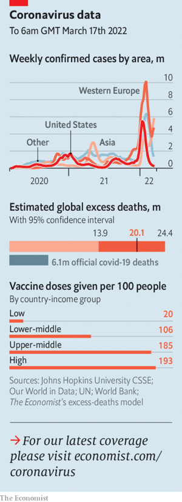  

#### 1.2 
#### 1.3 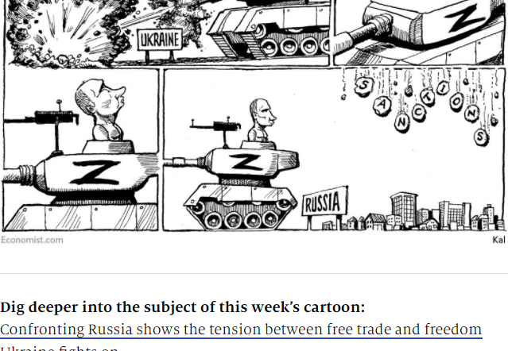  

### 2. Leaders
#### 2.1 _The alternative world order:_ [The war in Ukraine will determine how China sees the world](https://www.economist.com/leaders/2022/03/19/the-war-in-ukraine-will-determine-how-china-sees-the-world)  
And how threatening it becomes  

#### 2.2 _The world economy:_ [Confronting Russia shows the tension between free trade and freedom](https://www.economist.com/leaders/2022/03/19/confronting-russia-shows-the-tension-between-free-trade-and-freedom)  
Liberal governments need to find a new path that combines openness and security  

#### 2.3 _Pacifist no more:_ [A big defence budget shows Germany has woken up](https://www.economist.com/leaders/a-big-defence-budget-shows-germany-has-woken-up/21808225)  
Olaf Scholz is serious about helping Europe face down Vladimir Putin  
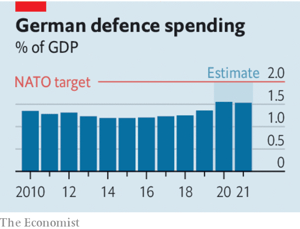  

#### 2.4 _Tilting at windfalls:_ [Windfall taxes on energy companies are a bad idea](https://www.economist.com/leaders/2022/03/19/windfall-taxes-on-energy-companies-are-a-bad-idea)  
Governments should not seize the energy industry’s profits  

#### 2.5 _Trans women in sport:_ [Sports should have two categories: “open” and “female”](https://www.economist.com/leaders/2022/03/19/sports-should-have-two-categories-open-and-female)  
Biology doesn’t always matter. But sometimes it matters a great deal  

### 3. Letters
#### 3.1 _On the war in Ukraine, bald eagles, leadership:_ [Letters to the editor](https://www.economist.com/letters/2022/03/19/letters-to-the-editor)  
A selection of correspondence  

### 4. By Invitation
#### 4.1 
#### 4.2 
#### 4.3 
### 5. Briefing
#### 5.1 _Russia’s war:_ [Ukraine fights on](https://www.economist.com/briefing/2022/03/19/ukraine-fights-on)  
Despite negotiations, there seems to be no end in sight  
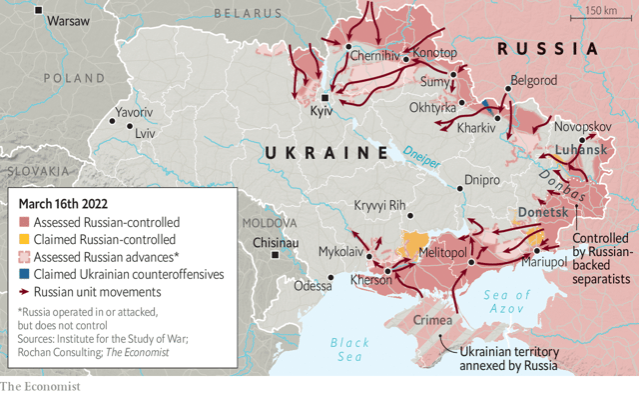  

#### 5.2 _What’s the worst that can happen:_ [The risk that the war in Ukraine escalates past the nuclear threshold](https://www.economist.com/briefing/2022/03/19/the-risk-of-escalation-past-the-nuclear-threshold)  
Disaster does not seem imminent but it does seem disturbingly possible  

### 6. Europe
#### 6.1 _Ploughshares to swords:_ [A risk-averse Germany enters an age of confrontation](https://www.economist.com/europe/2022/03/19/a-risk-averse-germany-enters-an-age-of-confrontation)  
Vladimir Putin has made it take security seriously  
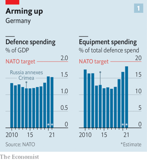  
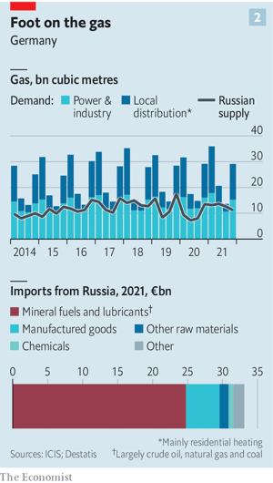  
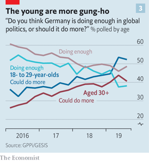  

#### 6.2 _Unassailable:_ [The invasion of Ukraine has helped entrench Emmanuel Macron](https://www.economist.com/europe/2022/03/19/the-invasion-of-ukraine-has-helped-entrench-emmanuel-macron)  
The mood of the campaign for next month’s election has darkened  

#### 6.3 _The Z factor:_ [Russian propagandists turn on pro-Western “traitors”](https://www.economist.com/europe/2022/03/19/russian-propagandists-turn-on-pro-western-traitors)  
But dissenting voices continue to make themselves heard  

#### 6.4 _The cats and dogs of war:_ [Europe is bending immigration rules for pets from Ukraine](https://www.economist.com/europe/2022/03/19/europe-is-bending-immigration-rules-for-pets-from-ukraine)  
Many refugees are bringing their best friends  

### 7. Britain
#### 7.1 _NATO-lite:_ [Boris Johnson tells The Economist about his anti-Russia coalition](https://www.economist.com/britain/boris-johnson-on-a-european-coalitions-role-against-russia/21808195)  
The British-led Joint Expeditionary Force is moving quickly against Russia  
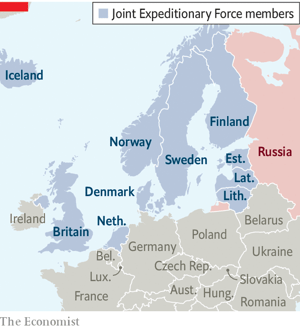  

#### 7.2 _Homes for refugees:_ [Britain finally comes up with a scheme to help Ukrainian refugees](https://www.economist.com/britain/2022/03/19/britain-finally-comes-up-with-a-scheme-to-help-ukrainian-refugees)  
Linking refugees with hosts helps them find their feet  

#### 7.3 _Order Floww:_ [The London Stock Exchange plans a new bourse for private companies](https://www.economist.com/britain/2022/03/19/the-london-stock-exchange-plans-a-new-bourse-for-private-companies)  
It hopes to transform capital markets and revive its own fortunes  

#### 7.4 _A high price:_ [After years in jail, Nazanin Zaghari-Ratcliffe returns to Britain](https://www.economist.com/britain/2022/03/17/after-years-in-jail-nazanin-zaghari-ratcliffe-returns-to-britain)  
A debt is settled, and prisoners of Iran are released  

#### 7.5 _Life in a cold climate:_ [Chilly British homes are likely to get chillier](https://www.economist.com/britain/2022/03/17/chilly-british-homes-are-likely-to-get-chillier)  
The British climate is unpleasantly chilly. Coping with that is getting harder  

#### 7.6 _Bagehot:_ [Does Rishi Sunak have the stomach for what he must swallow?](https://www.economist.com/britain/2022/03/19/does-rishi-sunak-have-the-stomach-for-what-he-must-swallow)  
The golden boy of British politics faces an unappetising menu  

### 8. Middle East & Africa
#### 8.1 _Dhow or don’t:_ [The Gulf states are an economic lifeline for Iran](https://www.economist.com/middle-east-and-africa/2022/03/17/the-gulf-states-are-an-economic-lifeline-for-iran)  
If the nuclear deal is revived, smuggling and sanctions-busting may give way to bigger business  
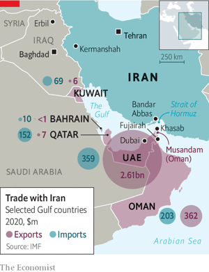  

#### 8.2 _Message by missile:_ [With America distracted, Iran hits Iraq’s Kurds](https://www.economist.com/middle-east-and-africa/2022/03/19/with-america-distracted-iran-hits-iraqs-kurds)  
Iran fires 12 missiles at the safest and most pro-Western bit of Iraq  

#### 8.3 _Behind by a country vial:_ [Africa has plenty of covid doses, but it lags in jabs](https://www.economist.com/middle-east-and-africa/2022/03/19/africa-has-plenty-of-covid-doses-but-it-lags-in-jabs)  
Blame distribution problems and a lack of zeal  
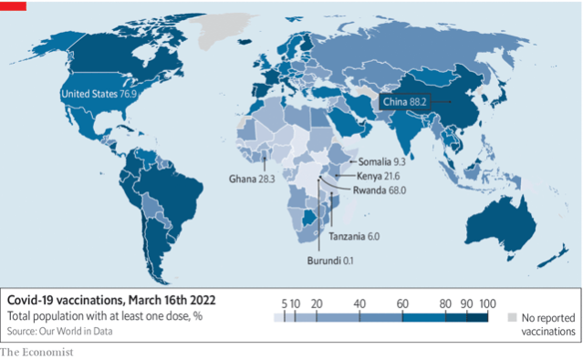  

#### 8.4 _Game over:_ [Tunisia bans sex work, endangering sex workers](https://www.economist.com/middle-east-and-africa/2022/03/17/tunisia-bans-sex-work-endangering-sex-workers)  
The end of licensed prostitution drives the trade underground  

#### 8.5 _Hot coffee:_ [Why global warming threatens east African coffee](https://www.economist.com/middle-east-and-africa/2022/03/17/why-global-warming-threatens-east-african-coffee)  
Other cash crops including tea will also be affected  
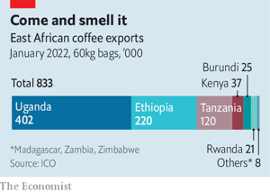  

### 9. United States
#### 9.1 _Prisons:_ [America’s prison system is becoming more inhumane](https://www.economist.com/united-states/2022/03/19/americas-prison-system-is-becoming-more-inhumane)  
Prisons are less crowded than before, but otherwise getting worse  

#### 9.2 _Prison conditions:_ [Debate over air conditioning in American prisons will heat up](https://www.economist.com/united-states/2022/03/19/debate-over-air-conditioning-in-american-prisons-will-heat-up)  
Prison guards, not just prisoners, will want more humane conditions  

#### 9.3 _Trans women in sport:_ [How swimming became the centre of the trans-sports debate](https://www.economist.com/united-states/2022/03/19/how-swimming-became-the-centre-of-the-trans-sports-debate)  
The sporting world is splitting into a mess of incompatible rules  

#### 9.4 _Abortion laws:_ [The race to undermine reproductive rights in America](https://www.economist.com/united-states/2022/03/19/the-race-to-undermine-reproductive-rights-in-america)  
Some states can’t wait to end abortion  

#### 9.5 _Schools and the weather:_ [Some districts opt for remote learning instead of snow days](https://www.economist.com/united-states/2022/03/19/some-districts-opt-for-remote-learning-instead-of-snow-days)  
Snow school today?  

#### 9.6 _Puerto Rico’s finances:_ [Puerto Rico’s future is looking brighter](https://www.economist.com/united-states/2022/03/19/puerto-ricos-future-is-looking-brighter)  
With the end of bankruptcy in sight, the island has a decade to turn its economy round  
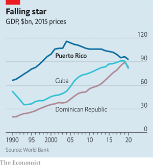  

#### 9.7 _Lexington:_ [The embarrassing Mrs Thomas](https://www.economist.com/united-states/2022/03/19/the-embarrassing-mrs-thomas)  
There is no conflict between Justice Clarence Thomas and his wife’s unhinged activism. That is the problem  

### 10. The Americas
#### 10.1 _Can’t grow, won’t grow:_ [Why Mexico’s economy underperforms](https://www.economist.com/the-americas/2022/03/19/why-mexicos-economy-underperforms)  
Red tape, taxes and gangsters keep small firms small  
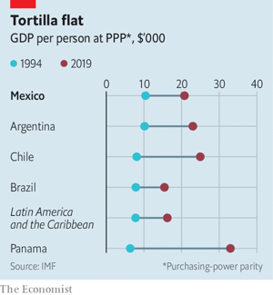  

#### 10.2 _Planes, a train and automobile fuel:_ [Mexico’s new megaprojects may do more harm than good](https://www.economist.com/the-americas/2022/03/19/mexicos-new-megaprojects-may-do-more-harm-than-good)  
The president has built a sparkling airport, but is it the right one?  

#### 10.3 _Bello:_ [Chile’s new president won from the left. Can he govern like that?](https://www.economist.com/the-americas/2022/03/19/chiles-new-president-won-from-the-left-can-he-govern-like-that)  
The heart and head of Gabriel Boric  

### 11. Asia
#### 11.1 _Mr $700m is back:_ [Malaysia’s disgraced former prime minister is popular again](https://www.economist.com/asia/2022/03/19/malaysias-disgraced-former-prime-minister-is-popular-again)  
A judge called Najib Razak a “national embarrassment”. Voters seem not to mind  

#### 11.2 _Heat island:_ [Mumbai plans for net-zero 20 years before the rest of India](https://www.economist.com/asia/2022/03/17/mumbai-plans-for-net-zero-20-years-before-the-rest-of-india)  
The megalopolis has released an ambitious “climate action plan”  
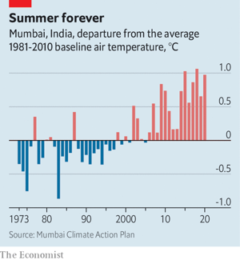  

#### 11.3 _Into the ground:_ [Sri Lanka’s government is stoking inflation and indignation](https://www.economist.com/asia/2022/03/19/sri-lankas-government-is-stoking-inflation-and-indignation)  
Mismanagement has compounded the harm done by covid and commodity prices  
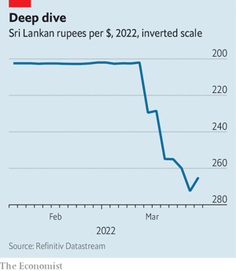  

#### 11.4 _Side-effects:_ [Covid-19 jabs are making other inoculations less contentious](https://www.economist.com/asia/2022/03/17/covid-19-jabs-are-making-other-inoculations-less-contentious)  
Japan is dropping its resistance to the human papillomavirus vaccine  

#### 11.5 _Banyan:_ [A debate about nuclear weapons resurfaces in East Asia](https://www.economist.com/asia/2022/03/19/a-debate-about-nuclear-weapons-resurfaces-in-east-asia)  
Some in Japan and South Korea worry about a distracted America’s commitment to their security  

### 12. China
#### 12.1 _Testing the “limitless”:_ [The friendship between China and Russia has boundaries](https://www.economist.com/china/chinas-friendship-with-russia-has-boundaries-despite-what-their-leaders-say/21808197)  
Despite what their rulers say  
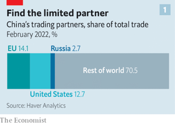  
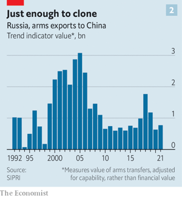  
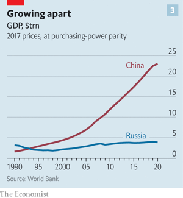  

#### 12.2 _Chaguan:_ [Omicron is changing China’s covid strategy](https://www.economist.com/china/2022/03/19/omicron-is-changing-chinas-covid-strategy)  
Beating the latest variant will require more vaccinations and less fear  

### 13. Business
#### 13.1 _Value-chain reaction:_ [Russia’s war is creating corporate winners and losers](https://www.economist.com/business/russias-war-is-creating-corporate-winners-and-losers/21808223)  
As well as enormous volatility  
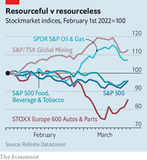  

#### 13.2 _Good news and bad news:_ [CNN+ enters the streaming business at a newsy moment](https://www.economist.com/business/2022/03/19/cnn-enters-the-streaming-business-at-a-newsy-moment)  
The war in Ukraine has got people glued to their screens  

#### 13.3 _Read and follow:_ [Banks and firms face a mammoth sanctions-compliance challenge](https://www.economist.com/business/2022/03/19/banks-and-firms-face-a-mammoth-sanctions-compliance-challenge)  
Russian deviousness makes it more daunting still  

#### 13.4 _Should I stay or should I go?:_ [Western firms’ thorny Russian dilemmas](https://www.economist.com/business/western-firms-thorny-russian-dilemmas/21808196)  
The cost of the moral high ground  
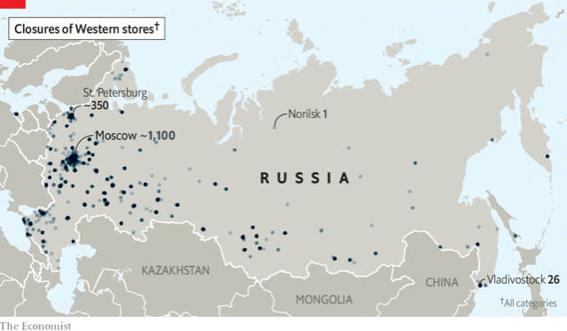  
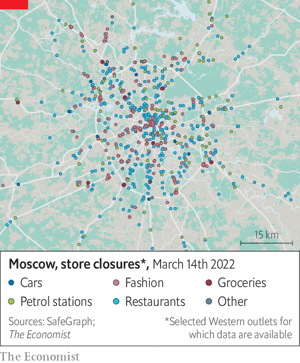  

#### 13.5 _Tonal language:_ [Is this the beginning of the end of China’s techlash?](https://www.economist.com/business/is-this-the-beginning-of-the-end-of-chinas-techlash/21808208)  
The Communist Party softens its fiery rhetoric towards the tech industry  
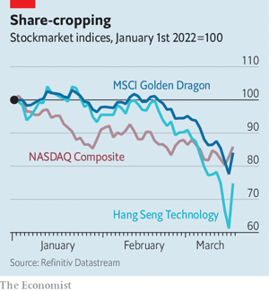  

#### 13.6 _WeBinged:_ [Why the WeWork fiasco makes for compelling TV](https://www.economist.com/business/2022/03/19/why-the-wework-fiasco-makes-for-compelling-tv)  
“WeCrashed” turns a corporate tale into a popcultural event  

#### 13.7 _Bartleby:_ [Why loafing can be work](https://www.economist.com/business/2022/03/19/why-loafing-can-be-work)  
Daydreaming, promenading and zoning out pay rich dividends  

#### 13.8 _Schumpeter:_ [Has Silicon Valley lost its monopoly over global tech?](https://www.economist.com/business/2022/03/19/has-silicon-valley-lost-its-monopoly-over-global-tech)  
The heartland of the technology industry has become at once less dominant and more so  

### 14. Finance & economics
#### 14.1 _Economic freedom v political freedom:_ [Globalisation and autocracy are locked together. For how much longer?](https://www.economist.com/finance-and-economics/2022/03/19/globalisation-and-autocracy-are-locked-together-for-how-much-longer)  
Disentangling the two will be hard, and costly  
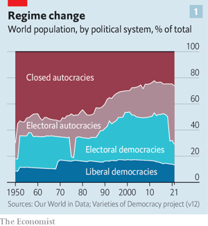  
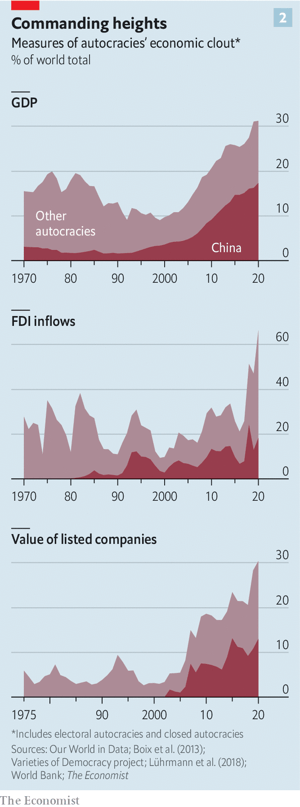  

#### 14.2 _A deep ditch:_ [Will China’s covid lockdowns add to strains on supply chains?](https://www.economist.com/finance-and-economics/will-chinas-covid-lockdowns-add-to-strains-on-supply-chains/21808193)  
The government’s fight against the disease has extended to Shanghai and Shenzhen  

#### 14.3 _Buttonwood:_ [Can foreign-currency reserves be sanctions-proofed?](https://www.economist.com/finance-and-economics/21808194/can-foreign-currency-reserves-be-sanction-proofed/21808194)  
The war will be as formative for reserve managers as the Asian financial crisis was  

#### 14.4 _Everywhere, a Russian phenomenon:_ [The inflationary consequences of Russia’s war will spread](https://www.economist.com/finance-and-economics/the-inflationary-consequences-of-russias-war-will-spread/21808192)  
Inflation, already high, will go higher still. What will central banks do?  
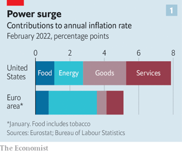  
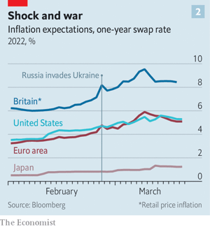  

#### 14.5 _When China met the free market:_ [A nickel-trading fiasco raises three big questions](https://www.economist.com/finance-and-economics/2022/03/19/a-nickel-trading-fiasco-raises-three-big-questions)  
London’s freewheeling metals exchange is under scrutiny  

#### 14.6 _Power grab:_ [Governments are proposing windfall taxes on energy firms](https://www.economist.com/finance-and-economics/2022/03/19/governments-are-proposing-windfall-taxes-on-energy-firms)  
The taxes are tempting on paper, but tricky in practice  

#### 14.7 _Russian roulette:_ [Sanctions-dodgers hoping to use crypto to evade detection are likely to be disappointed](https://www.economist.com/finance-and-economics/why-crypto-is-unlikely-to-be-useful-for-sanctions-dodgers/21808188)  
It may have more going for it as a tool to help Ukraine’s fundraising efforts  
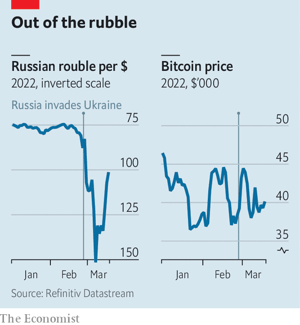  

#### 14.8 _Free exchange:_ [The disturbing new relevance of theories of nuclear deterrence](https://www.economist.com/finance-and-economics/2022/03/19/the-disturbing-new-relevance-of-theories-of-nuclear-deterrence)  
Lessons from the work of Thomas Schelling  

### 15. Science & technology
#### 15.1 _Armoured vehicles:_ [Russian tanks in Ukraine are sprouting cages](https://www.economist.com/science-and-technology/russian-tanks-in-ukraine-are-sprouting-cages/21808191)  
But they seem to be pretty much useless  

#### 15.2 _The Chernobyl Research Initiative Lab:_ [War in Ukraine threatens an intriguing piece of wildlife science](https://www.economist.com/science-and-technology/war-in-ukraine-threatens-an-intriguing-piece-of-wildlife-science/21808202)  
A long-term study of radiation’s effects on nature may be over  

#### 15.3 _Chemical warfare:_ [How to tweak drug-design software to create chemical weapons](https://www.economist.com/science-and-technology/how-to-tweak-drug-design-software-to-create-chemical-weapons/21808200)  
Just ask the program to enhance, rather than reduce, toxicity  

#### 15.4 _Additive manufacturing:_ [A new type of 3D printing may bring it into the mainstream](https://www.economist.com/science-and-technology/2022/03/19/a-new-type-of-3d-printing-may-bring-it-into-the-mainstream)  
It is to the old version as the printing press is to the pen  

### 16. Culture
#### 16.1 _In the line of fire:_ [Vladimir Putin’s war endangers Ukraine’s cultural heritage](https://www.economist.com/culture/2022/03/19/vladimir-putins-war-endangers-ukraines-cultural-heritage)  
The loss of museums, exquisite architecture and valuable archives is awful to contemplate  

#### 16.2 _A Ukrainian reading list:_ [Six books that explain the history and culture of Ukraine](https://www.economist.com/culture/2022/03/19/six-books-that-explain-the-history-and-culture-of-ukraine)  
From gangsters in Odessa to paramilitaries in the Donbas  

#### 16.3 _Back Story:_ [Disavow some Russian artists. Don’t cancel Russian art](https://www.economist.com/culture/disavow-some-russian-artists-dont-cancel-russian-art/21808190)  
Shunning the country’s back catalogue means giving up a guide to the darkness, and out of it  

#### 16.4 _World in a dish:_ [African-Americans have shaped American cuisine in surprising ways](https://www.economist.com/culture/2022/03/19/african-americans-have-shaped-american-cuisine-in-surprising-ways)  
A new exhibition celebrates the ingenuity of inventors, chefs, brewers, writers and others  

#### 16.5 _British fiction:_ [A swashbuckling smuggler’s tale](https://www.economist.com/culture/2022/03/17/a-swashbuckling-smugglers-tale)  
“Winchelsea” is a pastiche of a pastiche, told with exhilarating colour and flair  

#### 16.6 _Fake news:_ [Sandy Hook was a turning-point in America’s battle over truth](https://www.economist.com/culture/2022/03/19/sandy-hook-was-a-turning-point-in-americas-battle-over-truth)  
A new book about the massacre looks at how conspiracy theories go mainstream  

### 17. Economic & financial indicators
#### 17.1 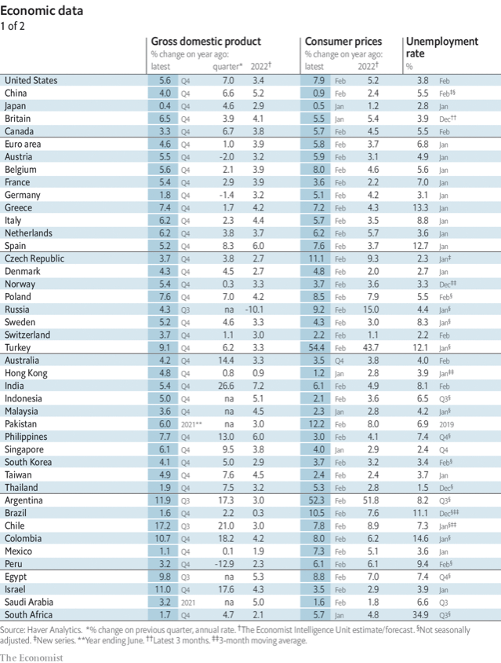  
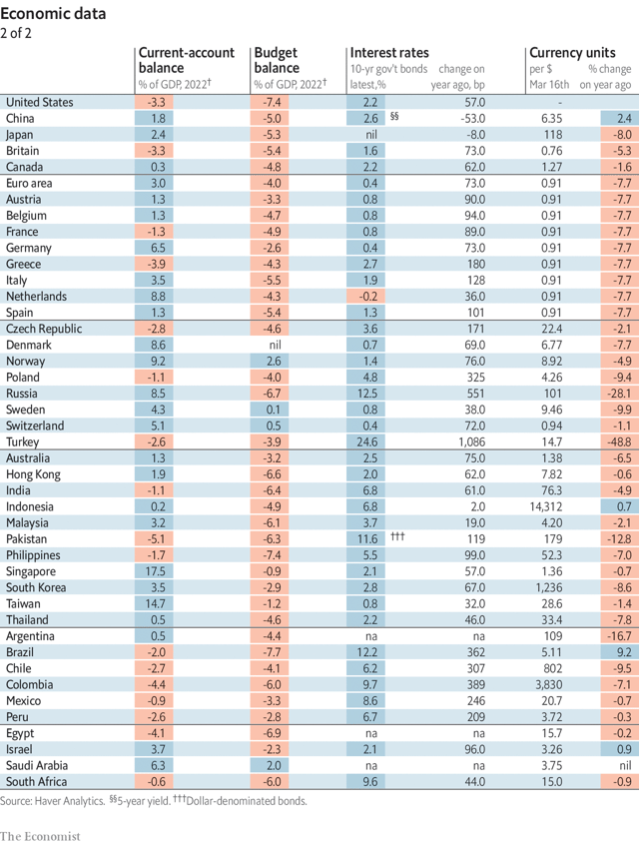  
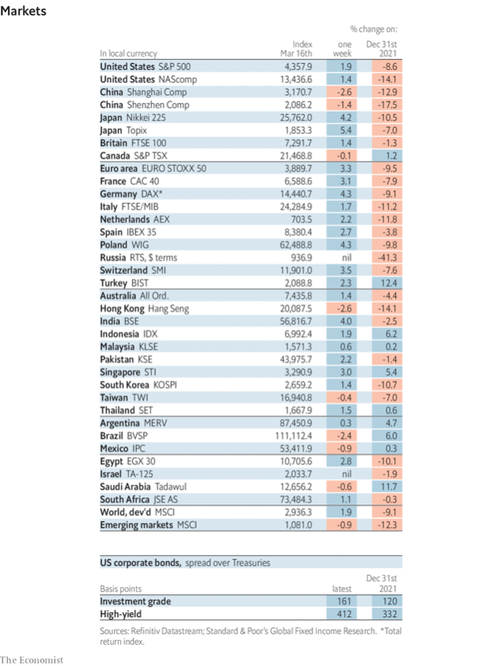  
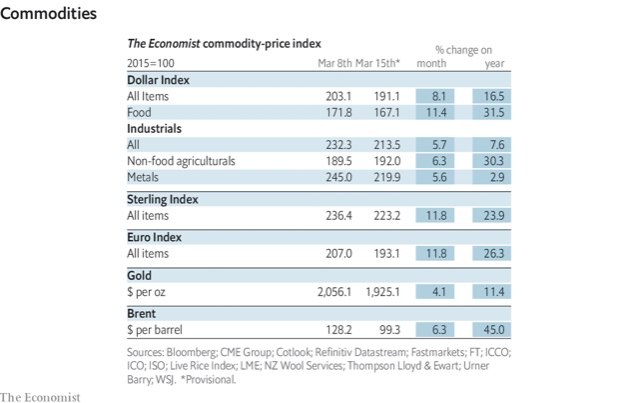  

### 18. Graphic detail
#### 18.1 _Another vaccine victory?:_ [Squashing malaria could save as many lives as covid-19 has taken](https://www.economist.com/graphic-detail/2022/03/19/squashing-malaria-could-save-as-many-lives-as-covid-19-has-taken)  
A jab that protects against the mosquito-borne killer is arriving at last  
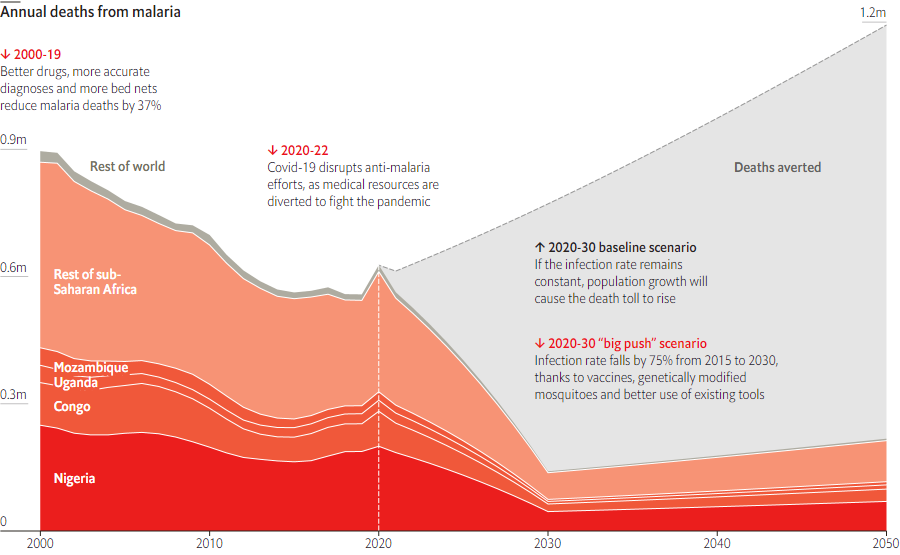  
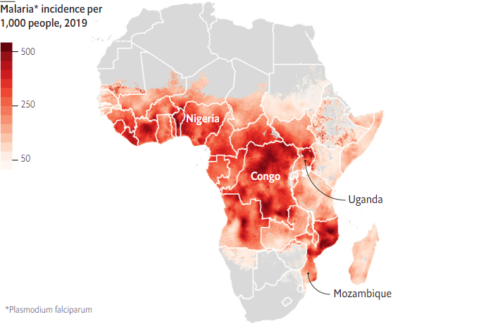  
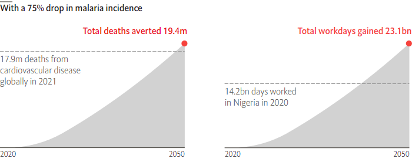  

### 19. Obituary
#### 19.1 _The star in a bulletproof vest:_ [Pasha Lee went from Ukrainian screen idol to volunteer](https://www.economist.com/obituary/2022/03/19/pasha-lee-went-from-screen-idol-to-volunteer)  
He was killed near the bridge at Irpin on March 6th, aged 33  

