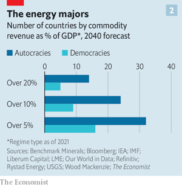

### 1. The world this week
#### 1.1   

#### 1.2 
#### 1.3   

### 2. Leaders
#### 2.1 _Geopolitics and energy:_ [Why energy insecurity is here to stay](https://www.economist.com/leaders/2022/03/26/why-energy-insecurity-is-here-to-stay)  
The war will speed the shift from petrostates to new electrostates  

#### 2.2 _Escaping zero-covid:_ [China must eventually learn to live with the coronavirus](https://www.economist.com/leaders/2022/03/26/china-must-eventually-learn-to-live-with-the-coronavirus)  
It has a lot of work to do first  
  

#### 2.3 _Ukraine’s backers:_ [For all America’s success in helping Ukraine, hard times lie ahead](https://www.economist.com/leaders/for-all-americas-success-in-helping-ukraine-hard-times-lie-ahead/21808338)  
Joe Biden must hold together a fractious coalition  

#### 2.4 _When duty falls:_ [Cutting fuel taxes is a bad idea](https://www.economist.com/leaders/2022/03/26/cutting-fuel-taxes-is-a-bad-idea)  
Governments should support household incomes instead  

#### 2.5 _Long walk to free trade:_ [Africa’s ambitious trade plan needs to speed up](https://www.economist.com/leaders/2022/03/26/africas-ambitious-trade-plan-needs-to-speed-up)  
Non-tariff barriers hinder commerce even more than tariffs  

### 3. Letters
#### 3.1 _On Vladimir Putin and the West, private equity, Richard Nixon, company cults:_ [Letters to the editor](https://www.economist.com/letters/2022/03/26/letters-to-the-editor)  
A selection of correspondence  

### 4. By Invitation
#### 4.1 
#### 4.2 
### 5. Briefing
#### 5.1 _The war in Ukraine:_ [An uncertain outlook across Ukraine](https://www.economist.com/briefing/2022/03/26/an-uncertain-outlook)  
Russia’s atrocities in Mariupol have not brought it closer to victory. But they have not yet spread farther afield, either  
  
  

#### 5.2 _Reactionary, obscurantist and having a day in the sun:_ [The new Russian cult of war](https://www.economist.com/briefing/2022/03/26/the-new-russian-cult-of-war)  
It has been growing unnoticed for some time  

### 6. Europe
#### 6.1 _The concert of Europe:_ [The EU’s unity over Ukraine has given it surprising heft](https://www.economist.com/europe/the-eus-unity-over-ukraine-has-given-it-surprising-heft/21808306)  
Remaining united will be a vital challenge  

#### 6.2 _Seeds of discontent:_ [Voters seek an alternative to Macron in blighted France](https://www.economist.com/europe/2022/03/26/voters-seek-an-alternative-to-macron-in-blighted-france)  
But the president remains the favourite  

#### 6.3 _From the third Rome to the second:_ [Istanbul has become a refuge for thousands of Russians escaping Putin](https://www.economist.com/europe/2022/03/26/istanbul-has-become-a-refuge-for-thousands-of-russians-escaping-putin)  
As in the 1920s, Russians are fleeing south from an oppressive regime  

#### 6.4 _Io, robot:_ [Italy’s digitisation minister has big goals and a big budget](https://www.economist.com/europe/2022/03/26/italys-digitisation-minister-has-big-goals-and-a-big-budget)  
Vittorio Colao has €40bn to bring his country’s IT up to speed  

#### 6.5 _Charlemagne:_ [Weaning Europe off Russian energy will mean making changes](https://www.economist.com/europe/2022/03/26/weaning-europe-off-russian-energy-will-mean-making-changes)  
So far, little has been asked of citizens  

### 7. Britain
#### 7.1 _The spring statement:_ [Rishi Sunak wants to be known as a tax-cutting chancellor](https://www.economist.com/britain/rishi-sunak-wants-to-be-known-as-a-tax-cutting-chancellor/21808340)  
He does not merit that title  
  
  

#### 7.2 _All in a lather:_ [Machines are once again doing the car-washing in Britain](https://www.economist.com/britain/2022/03/26/machines-are-once-again-doing-the-car-washing-in-britain)  
Blame (or credit) Brexit and covid  

#### 7.3 _Prayers answered:_ [Hong Kongers are boosting Britain’s church numbers](https://www.economist.com/britain/2022/03/26/hong-kongers-are-boosting-britains-church-numbers)  
Many congregations have doubled in size  

#### 7.4 _Close quarters:_ [Anti-infection measures kept British prisoners safe during the pandemic](https://www.economist.com/britain/2022/03/26/anti-infection-measures-kept-british-prisoners-safe-during-the-pandemic)  
But as the country reopens, many are still spending too long in their cells  

#### 7.5 _Copy, paste, repeat:_ [Britain’s next nuclear plant will be identical to one under construction](https://www.economist.com/britain/2022/03/26/britains-next-nuclear-plant-will-be-identical-to-one-under-construction)  
Standardisation should bring the cost and time of construction down  

#### 7.6 _Snitches and witches:_ [How activists and charities embed contested ideologies on campus](https://www.economist.com/britain/2022/03/24/how-activists-and-charities-embed-contested-ideologies-on-campus)  
Compliance is enforced by anonymous reporting tools and benchmarking schemes  

#### 7.7 _Bagehot:_ [To appreciate the SNP’s dominance, look at what it has done to the Tories](https://www.economist.com/britain/2022/03/26/to-appreciate-the-snps-dominance-look-at-what-it-has-done-to-the-tories)  
The Scottish Conservatives have come to resemble their opponents  

### 8. Middle East & Africa
#### 8.1 _Trade flaws:_ [Why it costs so much to move goods around Africa](https://www.economist.com/middle-east-and-africa/2022/03/26/why-it-costs-so-much-to-move-goods-around-africa)  
Startups are helping shift things faster, but rules remain onerous  
  

#### 8.2 _Springtime for Bashar:_ [Syria’s outcast dictator returns to the Arab world](https://www.economist.com/middle-east-and-africa/2022/03/26/syrias-outcast-dictator-returns-to-the-arab-world)  
Bashar al-Assad’s warm welcome in the Emirates is a sign of America’s waning influence  

#### 8.3 _The sands they are a-swirling:_ [Morocco scents victory in Western Sahara](https://www.economist.com/middle-east-and-africa/2022/03/26/morocco-scents-victory-in-western-sahara)  
Guns and canny diplomacy are helping it knock back Algeria  

#### 8.4 _The resilience of rhinoplasty:_ [Plastic surgeons make a bundle despite Lebanon’s economic crisis](https://www.economist.com/middle-east-and-africa/2022/03/26/plastic-surgeons-make-a-bundle-despite-lebanons-economic-crisis)  
Many people have no jobs. Others, nose jobs  

### 9. United States
#### 9.1 _Great-power politics:_ [In Ukraine, Biden must relearn Truman’s lessons from the cold war](https://www.economist.com/united-states/2022/03/26/in-ukraine-biden-must-relearn-trumans-lessons-from-the-cold-war)  
America once again seeks to curb Russia and China without blowing up the world  
  

#### 9.2 _Madeleine Albright:_ [America’s first female secretary of state has died of cancer, aged 84](https://www.economist.com/united-states/2022/03/26/americas-first-female-secretary-of-state-has-died-of-cancer-aged-84)  
A trailblazing diplomat with a poignant personal history  

#### 9.3 _Symbols in sports:_ [The debate about Native American-themed team names goes local](https://www.economist.com/united-states/2022/03/26/the-debate-about-native-american-themed-team-names-goes-local)  
To be Brave or not to be Brave?  

#### 9.4 _Drug pricing:_ [A new drug for Alzheimer’s is struggling to justify its price](https://www.economist.com/united-states/controversy-over-the-price-of-a-new-alzheimers-drug-and-the-governments-reluctance-to-pay-for-it/21808327)  
The government is put off by Adulhelm’s $28,200-a-year cost  

#### 9.5 _The United States of Amazon:_ [What happens when Amazon comes to town](https://www.economist.com/united-states/what-happens-when-amazon-comes-to-town/21808308)  
The e-commerce giant is expanding at a rapid pace. How might that change America?  
  

#### 9.6 _Lexington:_ [American energy innovation’s big moment](https://www.economist.com/united-states/2022/03/26/american-energy-innovations-big-moment)  
The war in Ukraine could unleash enormous demand for clean tech that America will soon be able to supply  

### 10. The Americas
#### 10.1 _Invest or squander?:_ [Guyana’s tiny population braces for a gusher of petrodollars](https://www.economist.com/the-americas/2022/03/26/guyanas-tiny-population-braces-for-a-gusher-of-petrodollars)  
Other countries blessed with oil have not always made good use of it  
  

#### 10.2 _Bowling maidens over:_ [Why cricket is gaining popularity in Brazil](https://www.economist.com/the-americas/2022/03/26/why-cricket-is-gaining-popularity-in-brazil)  
Particularly among women  

#### 10.3 _Bello:_ [Cuba’s dictatorship has a cultural opposition that it can’t tolerate](https://www.economist.com/the-americas/2022/03/26/cubas-dictatorship-has-a-cultural-opposition-that-it-cant-tolerate)  
The socialist island is as repressive as Russia, albeit sunnier  

### 11. Asia
#### 11.1 _Beyond the boundary:_ [How the IPL reflects India’s strengths—and weaknesses](https://www.economist.com/asia/2022/03/26/how-the-ipl-reflects-indias-strengths-and-weaknesses)  
The cricket league is a useful lens through which to see the country  
  

#### 11.2 _Horrible histories:_ [A new film on Kashmir has found a fan in Narendra Modi](https://www.economist.com/asia/2022/03/26/a-new-film-on-kashmir-has-found-a-fan-in-narendra-modi)  
“The Kashmir Files”, a violent drama, opens old wounds and feeds new fears  

#### 11.3 _Silent Stans:_ [The Stans want nothing to do with Vladimir Putin’s invasion of Ukraine](https://www.economist.com/asia/2022/03/26/the-stans-want-nothing-to-do-with-vladimir-putins-invasion-of-ukraine)  
Central Asia’s post-Soviet republics have maintained a studied silence on the war  
  

#### 11.4 _Palace politics:_ [South Korea’s president-elect starts with an unpopular personal project](https://www.economist.com/asia/2022/03/26/south-koreas-president-elect-starts-with-an-unpopular-personal-project)  
Yoon Suk-yeol wants to move the presidential office. Citizens would rather he focus on the economy  

#### 11.5 _Banyan:_ [Joko Widodo is considering extending his term in office](https://www.economist.com/asia/2022/03/26/joko-widodo-is-considering-extending-his-term-in-office)  
Indonesia’s president is contemplating an assault on his country’s democracy  

### 12. China
#### 12.1 _Xi’s hard year:_ [In a crucial year politically, Xi Jinping wants stability](https://www.economist.com/china/2022/03/26/in-a-crucial-year-politically-xi-jinping-wants-stability)  
Covid-19, Ukraine and the economy may frustrate his wishes  

#### 12.2 _Lockdown legions:_ [The extraordinary manpower behind China’s zero-covid strategy](https://www.economist.com/china/2022/03/26/the-extraordinary-manpower-behind-chinas-zero-covid-strategy)  
Millions of workers battle thousands of cases  
  

#### 12.3 _Salvation through selfie:_ [How narcissistic youth might help struggling Chinese booksellers](https://www.economist.com/china/2022/03/26/how-narcissistic-youth-might-help-struggling-chinese-booksellers)  
They like to be seen in pretty shops. They might even buy a coffee  

#### 12.4 _Chaguan:_ [China has honed its justifications for taking Russia’s side](https://www.economist.com/china/2022/03/26/china-has-honed-its-justifications-for-taking-russias-side)  
Deflection and anti-Americanism underpin China’s argument  

### 13. International
#### 13.1 _New cold war, new compromises:_ [How Vladimir Putin provokes—and complicates—the struggle against autocracy](https://www.economist.com/international/how-vladimir-putin-provokes-and-complicates-the-struggle-against-autocracy/21808339)  
As in the old cold war, ugly trade-offs are inevitable  

### 14. Business
#### 14.1 _The future of business travel:_ [A guide to your next business trip](https://www.economist.com/business/2022/03/26/a-guide-to-your-next-business-trip)  
Corporate road-warriors are back. Pre-pandemic business travel isn’t  
  
  

#### 14.2 _Surge pricing:_ [How companies use AI to set prices](https://www.economist.com/business/2022/03/26/how-companies-use-ai-to-set-prices)  
The pricing of products is turning from art into science  

#### 14.3 _Food fight:_ [Packaged-food firms are running out of room to raise prices](https://www.economist.com/business/2022/03/26/packaged-food-firms-are-running-out-of-room-to-raise-prices)  
The war in Ukraine is pushing up costs just as shoppers become fed up with inflation  
  

#### 14.4 _The Zoom lift:_ [Botox and other injectable cosmetics are booming](https://www.economist.com/business/2022/03/26/botox-and-other-injectable-cosmetics-are-booming)  
Video-conferencing and the selfie culture are behind the craze  

#### 14.5 _Shark attack:_ [What “Shark Tank” says about Indian capitalism](https://www.economist.com/business/2022/03/26/what-shark-tank-says-about-indian-capitalism)  
The reality show’s popularity in India may reflect a growing fondness for free enterprise  
  

#### 14.6 _Bartleby:_ [What an honest leaving-do speech would sound like](https://www.economist.com/business/2022/03/26/what-an-honest-leaving-do-speech-would-sound-like)  
The words that a departing employee will never hear  

#### 14.7 _New kids in the bloc:_ [Will the Digital Markets Act help Europe breed digital giants?](https://www.economist.com/business/2022/03/26/will-the-digital-markets-act-help-europe-breed-digital-giants)  
Probably not  
  

#### 14.8 _Schumpeter:_ [Why Saudi Aramco could be eclipsed by its Qatari nemesis](https://www.economist.com/business/why-saudi-aramco-could-be-eclipsed-by-its-qatari-nemesis/21808310)  
QatarEnergy puts commercial interests above geopolitical ones  

### 15. Finance & economics
#### 15.1 _Full metal jackpot:_ [The transition to clean energy will mint new commodity superpowers](https://www.economist.com/finance-and-economics/2022/03/26/the-transition-to-clean-energy-will-mint-new-commodity-superpowers)  
We look at who wins and loses  
  
  
  

#### 15.2 _A volatile mix:_ [Three big uncertainties cloud the oil market](https://www.economist.com/finance-and-economics/three-big-uncertainties-cloud-the-oil-market/21808307)  
OPEC’s calculations, America’s shale quandary and Chinese lockdowns make a volatile mix  
  
  
  

#### 15.3 _Departing thoughts:_ [Why foreign investors are feeling jittery about China](https://www.economist.com/finance-and-economics/why-foreign-investors-are-feeling-jittery-about-china/21808313)  
Geopolitics are only their latest concern  
  

#### 15.4 _Buttonwood:_ [The parallels between the nickel-trading fiasco and the LIBOR scandal](https://www.economist.com/finance-and-economics/2022/03/26/the-parallels-between-the-nickel-trading-fiasco-and-the-libor-scandal)  
From afar London’s vaunted finance-industry heritage looks a lot like backwardness  

#### 15.5 _Coming of age:_ [Millennial demand helps stoke the housing boom](https://www.economist.com/finance-and-economics/2022/03/26/millennial-demand-helps-stoke-the-housing-boom)  
The frenzy reflects more than demographics  

#### 15.6 _Free exchange:_ [Have economists led the world’s environmental policies astray?](https://www.economist.com/finance-and-economics/2022/03/26/have-economists-led-the-worlds-environmental-policies-astray)  
A new book argues for a supercharged approach to net zero  

### 16. Science & technology
#### 16.1 _Pint-sized power stations:_ [Developers of small modular reactors hope their time has come](https://www.economist.com/science-and-technology/developers-of-small-modular-reactors-hope-their-time-has-come/21808321)  
War, climate worries and oil prices make nuclear power attractive  
  

#### 16.2 _Ukraine’s internet connectivity:_ [The degrading treatment of Ukraine’s internet](https://www.economist.com/science-and-technology/2022/03/26/the-degrading-treatment-of-ukraines-internet)  
And how the Ukrainians are responding  

#### 16.3 _Loitering munitions:_ [Baguette-sized flying bombs are about to enter service in Ukraine](https://www.economist.com/science-and-technology/baguette-sized-flying-bombs-are-about-to-enter-service-in-ukraine/21808317)  
Their operators will be able to pick the best target in real time  

#### 16.4 _Cyber-roaches:_ [Robotised insects may search collapsed buildings for survivors](https://www.economist.com/science-and-technology/robotised-insects-may-search-collapsed-buildings-for-survivors/21808326)  
They can detect movement, body warmth and exhaled carbon dioxide  

### 17. Culture
#### 17.1 _Understanding Russia’s president:_ [Writers have grappled with Vladimir Putin for two decades](https://www.economist.com/culture/writers-have-grappled-with-vladimir-putin-for-two-decades/21808311)  
Greyness, greed and grievance have been the dominant themes  

#### 17.2 _When stars collide:_ [The lives and love of Laurence Olivier and Vivien Leigh](https://www.economist.com/culture/2022/03/26/the-lives-and-love-of-laurence-olivier-and-vivien-leigh)  
As Stephen Galloway shows in “Truly Madly”, theirs was a tumultuous union  

#### 17.3 _Home Entertainment:_ [Secluded in his library, Montaigne looked inwards for inspiration](https://www.economist.com/culture/2022/03/26/secluded-in-his-library-montaigne-looked-inwards-for-inspiration)  
His “Essays” are a lesson in seeing other points of view  

#### 17.4 _Keep it in the family:_ [The Sassoons were once Asia’s top business dynasty](https://www.economist.com/culture/2022/03/26/the-sassoons-were-once-asias-top-business-dynasty)  
“The Global Merchants” tells the story of their rise and fall  

#### 17.5 _Johnson:_ [A guide to renamed cities](https://www.economist.com/culture/2022/03/26/a-guide-to-renamed-cities)  
Some reasons for changing place-names are better than others  

### 18. Economic & financial indicators
#### 18.1   
  
  
  

### 19. Graphic detail
#### 19.1 _Starting to bite:_ [Russian consumers are already feeling the cost of war](https://www.economist.com/graphic-detail/2022/03/26/russian-consumers-are-already-feeling-the-cost-of-war)  
Inflation is reaching heights not seen since the financial crisis of 1998  
  
  
  

### 20. Obituary
#### 20.1 _The girl who loved reading:_ [Autherine Lucy was an unlikely pioneer](https://www.economist.com/obituary/2022/03/26/autherine-lucy-was-an-unlikely-pioneer)  
The shy heroine of desegregation died on March 2nd, aged 92  

