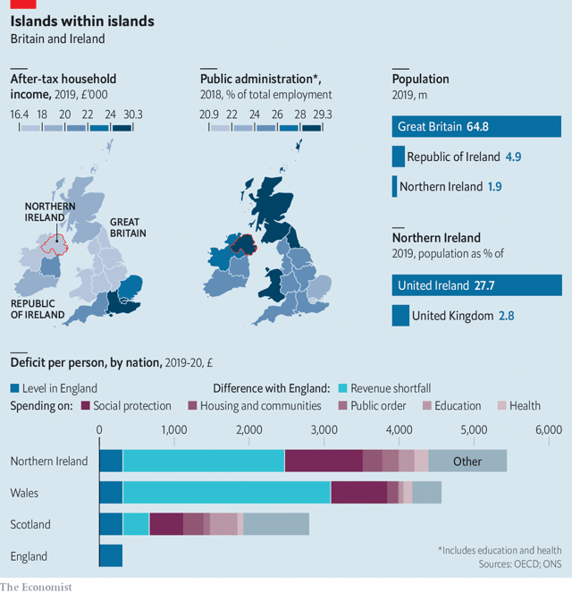
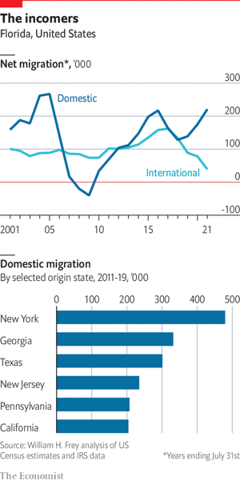
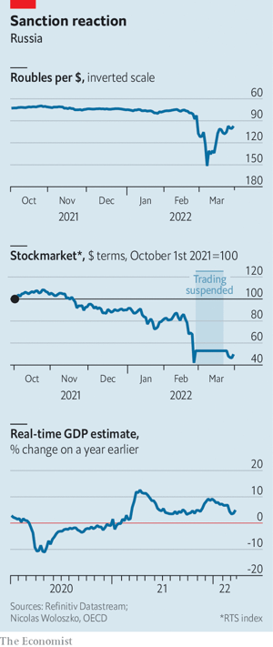

### 1. The world this week
#### 1.1   

#### 1.2 
#### 1.3   

### 2. Leaders
#### 2.1 _Western support:_ [Why Ukraine must win](https://www.economist.com/leaders/2022/04/02/why-ukraine-must-win)  
A decisive victory could transform the security of Europe  

#### 2.2 _Back to the dark ages:_ [The Taliban are shackling half the Afghan population](https://www.economist.com/leaders/the-taliban-are-shackling-half-the-afghan-population/21808483)  
Girls are barred from secondary school; women from travelling without a chaperone  

#### 2.3 _The Sunshine State:_ [What America can learn from Florida’s boom](https://www.economist.com/leaders/2022/04/02/what-america-can-learn-from-floridas-boom)  
It has important lessons for the environment, politics and the economy  

#### 2.4 _These septic isles:_ [Devolution is making the United Kingdom chronically miserable](https://www.economist.com/leaders/2022/04/02/devolution-is-making-the-united-kingdom-chronically-miserable)  
Here is how to fix it  

#### 2.5 _Brands and marketing:_ [The serious business of being a social influencer](https://www.economist.com/leaders/2022/04/02/the-serious-business-of-being-a-social-influencer)  
Read this leader!!#ad  

### 3. Letters
#### 3.1 _On Russia and Ukraine, California, baseball, grammar, Dostoyevsky, Bagehot:_ [Letters to the editor](https://www.economist.com/letters/2022/04/02/letters-to-the-editor)  
A selection of correspondence  

### 4. By Invitation
#### 4.1 
### 5. Briefing
#### 5.1 _The war in Ukraine:_ [Ukraine’s president tells The Economist why Vladimir Putin must be defeated](https://www.economist.com/briefing/2022/04/02/ukraines-president-tells-the-economist-why-vladimir-putin-must-be-defeated)  
Surrounded by sandbags and tank traps, Volodymyr Zelensky holds forth  

#### 5.2 _The fortunes of war:_ [What next for Russia?](https://www.economist.com/briefing/2022/04/02/what-next-for-russia)  
For the moment, Russian forces have given up on Kyiv  
  
  

### 6. Europe
#### 6.1 _Last-ditch pitch:_ [Hungary’s opposition struggles to beat Viktor Orban’s stealth autocracy](https://www.economist.com/europe/2022/04/02/hungarys-opposition-struggles-to-beat-viktor-orbans-stealth-autocracy)  
The populist prime minister has subverted nearly every institution that matters  
  
  

#### 6.2 _Energy dependence:_ [Can Germany cope without Russian gas?](https://www.economist.com/europe/can-germany-cope-without-russian-gas/21808482)  
The government and economists disagree  
  

#### 6.3 _France’s elections:_ [Macron still leads a tightening presidential race](https://www.economist.com/europe/2022/04/02/macron-still-leads-a-tightening-presidential-race)  
He may need to show he is ready for a match  
  

#### 6.4 _Charlemagne:_ [It will take years for Ukraine to become an EU member](https://www.economist.com/europe/2022/04/02/it-will-take-years-for-ukraine-to-become-an-eu-member)  
Better start working on it now  

### 7. Britain
#### 7.1 _So close, so far:_ [The Good Friday deal deferred the issue of Irish unity to the future](https://www.economist.com/britain/2022/04/02/the-good-friday-deal-deferred-the-issue-of-irish-unity-to-the-future)  
Time was needed to heal old wounds. Then came Brexit  
  

#### 7.2 _When waste is worth it:_ [The British government made mistakes when sourcing protective gear](https://www.economist.com/britain/2022/04/02/the-british-government-made-mistakes-when-sourcing-protective-gear)  
Not all of them were bad  

#### 7.3 _Birthing pains:_ [A report castigates the National Health Service](https://www.economist.com/britain/2022/04/02/a-report-castigates-the-national-health-service)  
Many babies and mothers died, needlessly  

#### 7.4 _By jingo!:_ [War in Ukraine and a floundering rival boost Boris Johnson](https://www.economist.com/britain/2022/04/02/war-in-ukraine-and-a-floundering-rival-boost-boris-johnson)  
His MPs are soothed. His position in the country remains difficult  

#### 7.5 _Not even past:_ [The Falklands war resonates 40 years on](https://www.economist.com/britain/2022/04/02/the-falklands-war-resonates-40-years-on)  
The ten-week conflict in the South Atlantic has renewed salience, especially among Conservatives  

### 8. Middle East & Africa
#### 8.1 _Desert-blooming friendships:_ [Israel hosts an unprecedented summit with Arab leaders](https://www.economist.com/middle-east-and-africa/2022/04/02/israels-unprecedented-welcome-to-arab-leaders-in-the-negev)  
It was long on symbols but short on promises  
  

#### 8.2 _New blood begins to simmer:_ [Oman’s sultan breaks with the past in economics](https://www.economist.com/middle-east-and-africa/2022/04/02/omans-sultan-breaks-with-the-past-in-economics)  
An oil windfall is a boon to public finances, but reminds Oman that it must diversify  

#### 8.3 _The road not taken:_ [A fragile ceasefire offers hope in Ethiopia](https://www.economist.com/middle-east-and-africa/2022/04/02/a-fragile-ceasefire-offers-hope-in-ethiopia)  
But it may collapse unless Tigray receives humanitarian aid  
  

#### 8.4 _Red line:_ [Kidnappers brazenly attack a train in Nigeria](https://www.economist.com/middle-east-and-africa/2022/04/02/kidnappers-brazenly-attack-a-train-in-nigeria)  
Parts of Africa’s most populous country are becoming ungovernable  

#### 8.5 _Never-ending party:_ [Kenyan voters face an invidious choice in August](https://www.economist.com/middle-east-and-africa/2022/04/02/kenyan-voters-face-an-invidious-choice-in-august)  
Neither of the leading candidates inspires much hope  

### 9. United States
#### 9.1 _Child allowance:_ [Why America’s most successful anti-poverty programme is going cold](https://www.economist.com/united-states/2022/04/02/why-americas-most-successful-anti-poverty-programme-is-going-cold)  
The triumph of a giant experiment in child welfare is being squandered  
  

#### 9.2 _College bonds:_ [Los Angeles provides every first-grader with cash for college](https://www.economist.com/united-states/2022/04/02/los-angeles-provides-every-first-grader-with-cash-for-college)  
Automatic college savings can go a long way  

#### 9.3 _Hold the salt:_ [The promise and pitfalls of desalination](https://www.economist.com/united-states/the-promise-and-pitfalls-of-desalination/21808460)  
California needs to diversify its water supply as the West dries up. How much can desalination help?  
  

#### 9.4 _Defence spending:_ [The Biden administration’s defence-spending proposal is a muddle](https://www.economist.com/united-states/2022/04/02/the-biden-administrations-defence-spending-proposal-is-a-muddle)  
It looks hasty and lacks a needed sense of strategy  

#### 9.5 _Public opinion:_ [Americans’ views on the war reveal a striking generational divide](https://www.economist.com/united-states/2022/04/02/americans-views-on-the-war-reveal-a-striking-generational-divide)  
Memories of the cold war may be part of the explanation  
  

#### 9.6 _Lexington: Tripping over himself:_ [What Joe Biden’s gaffe says about his end-game in Ukraine](https://www.economist.com/united-states/2022/04/02/what-joe-bidens-gaffe-says-about-his-end-game-in-ukraine)  
Nine ad-libbed words mask his caution in dealing with Vladimir Putin  

### 10. The Americas
#### 10.1 _From protester to president:_ [Chilean education lurches to the left](https://www.economist.com/the-americas/2022/04/02/chilean-education-lurches-to-the-left)  
Gabriel Boric vows to forgive student loans and reduce testing in schools  
  

#### 10.2 _Injudicious judges:_ [Central America’s legal systems are increasingly corrupt](https://www.economist.com/the-americas/2022/04/02/central-americas-legal-systems-are-increasingly-corrupt)  
In Guatemala alone some 15 legal officials have been forced to flee in the past year  

#### 10.3 _Bello:_ [Brazil’s presidential election in October will be about the economy](https://www.economist.com/the-americas/2022/04/02/brazils-presidential-election-in-october-will-be-about-the-economy)  
Luiz Inácio Lula da Silva is ahead but Jair Bolsonaro is still in the running  

### 11. Asia
#### 11.1 _No country for young women:_ [The Taliban are pushing females out of public life](https://www.economist.com/asia/2022/04/02/the-taliban-are-pushing-females-out-of-public-life)  
Bigotry is making Afghanistan poorer  

#### 11.2 _Pokémon dough:_ [South Korean millennials battle to get hold of Pokémon snacks](https://www.economist.com/asia/2022/04/02/south-korean-millennials-battle-to-get-hold-of-pokemon-snacks)  
They may have grown up, but their tastes have not evolved  

#### 11.3 _Roubles in paradise:_ [Russian tourists stranded in Asia are running out of cash](https://www.economist.com/asia/2022/04/02/russian-tourists-stranded-in-asia-are-running-out-of-cash)  
It has become costlier to live in Thailand than in Russia  

#### 11.4 _Getting closer:_ [China makes inroads in the Solomon Islands](https://www.economist.com/asia/2022/04/02/china-makes-inroads-in-the-solomon-islands)  
Australia and New Zealand are alarmed  
  

#### 11.5 _Out of the frying pan:_ [Indonesia, the world’s biggest producer, has a palm-oil crisis](https://www.economist.com/asia/2022/04/02/indonesia-the-worlds-biggest-producer-has-a-palm-oil-crisis)  
Ukraine, the pandemic and local profiteers get the blame  

#### 11.6 _Banyan:_ [The invasion of Ukraine has turned Japan definitively against Russia](https://www.economist.com/asia/2022/04/02/the-invasion-of-ukraine-has-turned-japan-definitively-against-russia)  
And made a solution to their territorial dispute even more remote  

### 12. China
#### 12.1 _We need to talk about Ukraine:_ [The war makes China uncomfortable. European leaders don’t care](https://www.economist.com/china/2022/04/02/the-war-makes-china-uncomfortable-european-leaders-dont-care)  
Get ready for a tense summit  

#### 12.2 _An old problem:_ [Why so many elderly Chinese are unvaccinated](https://www.economist.com/china/2022/04/02/why-so-many-elderly-chinese-are-unvaccinated)  
Some are complacent, others are afraid  
  

#### 12.3 _The fire inside:_ [Deciphering a Tibetan pop star’s self-immolation](https://www.economist.com/china/2022/04/02/deciphering-a-tibetan-pop-stars-self-immolation)  
Tsewang Norbu was not the bubbly singer he appeared to be  

#### 12.4 _The dangers of sitting too long:_ [Two British judges quit Hong Kong’s top court](https://www.economist.com/china/2022/04/02/two-british-judges-quit-hong-kongs-top-court)  
Foreigners on the bench in the city face a tricky dilemma  

#### 12.5 _Chaguan:_ [A final victory for China’s propaganda chiefs](https://www.economist.com/china/2022/04/02/a-final-victory-for-chinas-propaganda-chiefs)  
A terrible plane crash prompts a revealing anti-media backlash  

### 13. International
#### 13.1 _#PutinsWar:_ [The invasion of Ukraine is not the first social media war, but it is the most viral](https://www.economist.com/international/the-invasion-of-ukraine-is-not-the-first-social-media-war-but-it-is-the-most-viral/21808456)  
Ukraine is the most wired country ever to be invaded  

### 14. Special report
#### 14.1 _The future of Florida:_ [Like America, the Sunshine State also rises](https://www.economist.com/special-report/2022/03/30/like-america-the-sunshine-state-also-rises)  
Florida is booming and becoming more important, with big consequences for America, says Alexandra Suich Bass  
  

#### 14.2 _The economy:_ [The economy sees repeated boom and bust cycles](https://www.economist.com/special-report/2022/03/30/the-economy-sees-repeated-boom-and-bust-cycles)  
Rapid growth is heating up the Sunshine State  
  

#### 14.3 _Miami’s makeover:_ [The bid to make Florida’s biggest city a tech hub](https://www.economist.com/special-report/2022/03/30/the-bid-to-make-floridas-biggest-city-a-tech-hub)  
An ambitious mayor is trying to transform Miami’s appeal  

#### 14.4 _Making policy:_ [A peninsula that makes waves in policy formation](https://www.economist.com/special-report/2022/03/30/a-peninsula-that-makes-waves-in-policy-formation)  
Florida has a history as a policy laboratory  

#### 14.5 _Politics:_ [The colour purple](https://www.economist.com/special-report/2022/03/30/florida-is-neither-red-nor-blue-but-more-purple-politically)  
Is Florida still a swing state—or a Republican one?  
  

#### 14.6 _Red versus blue:_ [Two elections will attract national interest](https://www.economist.com/special-report/2022/03/30/two-elections-will-attract-national-interest)  
Two races to watch in 2022  

#### 14.7 _The environment, water and climate:_ [Florida faces a triple threat to its environment](https://www.economist.com/special-report/2022/03/30/florida-faces-a-triple-threat-to-its-environment)  
The environment is Florida’s biggest attraction, but also its biggest vulnerability  

#### 14.8 _The way ahead:_ [What Florida can teach America](https://www.economist.com/special-report/2022/03/30/what-florida-can-teach-america)  
Which side of paradise?  

#### 14.9 
### 15. Business
#### 15.1 _Under the influence:_ [The business of influencing is not frivolous. It’s serious](https://www.economist.com/business/2022/04/02/the-business-of-influencing-is-not-frivolous-its-serious)  
Influencers are becoming brand ambassadors—even for the poshest of brands  
  

#### 15.2 _Store wars:_ [Legislation and litigation threaten Apple and Google’s profits](https://www.economist.com/business/2022/04/02/legislation-and-litigation-threaten-apple-and-googles-profits)  
Regulators are coming for the app stores  
  

#### 15.3 _The last lockdown?:_ [What Shanghai lockdowns mean for China Inc](https://www.economist.com/business/what-shanghai-lockdowns-mean-for-china-inc/21808450)  
Nothing good  

#### 15.4 _The next wave of outsourcing:_ [A half-a-trillion-dollar bet on revolutionising white-collar work](https://www.economist.com/business/a-half-a-trillion-dollar-bet-on-revolutionising-white-collar-work/21808453)  
Digitisation of everything, cloud computing and hybrid working is fuelling a boom in Indian IT consulting  

#### 15.5 _Bartleby:_ [The case for managerial decency](https://www.economist.com/business/2022/04/02/the-case-for-managerial-decency)  
A scandal at Britain’s P&O Ferries shows how not to handle redundancies  

#### 15.6 _Born to Vin:_ [Vingroup, Vietnam’s top conglomerate, leaps into global markets](https://www.economist.com/business/2022/04/02/vingroup-vietnams-top-conglomerate-leaps-into-global-markets)  
Perhaps a bit too boldly  
  

#### 15.7 _Schumpeter:_ [Is cancel culture coming to free trade?](https://www.economist.com/business/2022/04/02/is-cancel-culture-coming-to-free-trade)  
The risks from Russia extend to globalisation  

### 16. Finance & economics
#### 16.1 _A little help from a friend:_ [America’s gas frackers limber up to save Europe](https://www.economist.com/finance-and-economics/2022/04/02/americas-gas-frackers-limber-up-to-save-europe)  
There might be little they can do in the short term  

#### 16.2 _Diversionary tactics:_ [What can Russia do to sell its unwanted oil?](https://www.economist.com/finance-and-economics/what-can-russia-do-to-sell-its-unwanted-oil/21808447)  
China and India sniff a bargain  
  
  

#### 16.3 _Side channels:_ [India grapples with the new realities of the global oil market](https://www.economist.com/finance-and-economics/2022/04/02/india-grapples-with-the-new-realities-of-the-global-oil-market)  
The question is how to pay for Russian oil  

#### 16.4 _Buttonwood:_ [Can the Fed pull off an “immaculate disinflation”?](https://www.economist.com/finance-and-economics/2022/04/02/can-the-fed-pull-off-an-immaculate-disinflation)  
Past experience suggests soft landings are rare  

#### 16.5 _Wounded bear:_ [Under unprecedented sanctions, how is the Russian economy faring?](https://www.economist.com/finance-and-economics/2022/04/02/under-unprecedented-sanctions-how-is-the-russian-economy-faring)  
Better than you might think  
  

#### 16.6 _Menu costs:_ [Surging food prices take a toll on poor economies](https://www.economist.com/finance-and-economics/2022/04/02/surging-food-prices-take-a-toll-on-poor-economies)  
In places like Sri Lanka and Egypt, they add to existing strains  
  

#### 16.7 _Before death do us part:_ [The White House wants to close a tax loophole used by the ultra-rich](https://www.economist.com/finance-and-economics/2022/04/02/the-white-house-wants-to-close-a-tax-loophole-used-by-the-ultra-rich)  
A plan to go after unrealised capital gains faces big hurdles  

#### 16.8 _Free exchange:_ [Will dollar dominance give way to a multipolar system of currencies?](https://www.economist.com/finance-and-economics/2022/04/02/will-dollar-dominance-give-way-to-a-multipolar-system-of-currencies)  
Recent trends suggest the yuan will not gain much  

### 17. Science & technology
#### 17.1 _Alternative energy:_ [Sensors that scavenge their power are all the rage](https://www.economist.com/science-and-technology/sensors-that-scavenge-their-power-are-all-the-rage/21808461)  
They can run on light, heat and even vibrations  

#### 17.2 _Anti-anti-tank weapons:_ [How tanks can survive against cheap, shoulder-fired missiles](https://www.economist.com/science-and-technology/2022/04/02/how-tanks-can-survive-against-cheap-shoulder-fired-missiles)  
The war in Ukraine will boost the development of anti-anti-tank weapons  

#### 17.3 _Ecological science:_ [Invasion of the earthworms](https://www.economist.com/science-and-technology/invasion-of-the-earthworms/21808464)  
The soil ecology of North America is being turned over  

#### 17.4 _The glymphatic system and dementia:_ [Alzheimer’s researchers are studying the brain’s plumbing](https://www.economist.com/science-and-technology/alzheimers-researchers-are-studying-the-brains-plumbing/21808465)  
Tweaking it may delay development of the disease  

### 18. Culture
#### 18.1 _The menace of mendacity:_ [For modern autocrats, lying is more useful than killing](https://www.economist.com/culture/2022/04/02/for-modern-autocrats-lying-is-more-useful-than-killing)  
“Spin Dictators” examines the phoney democrat’s arsenal of deceit  

#### 18.2 _World in a dish:_ [In praise of mass-market American tacos](https://www.economist.com/culture/2022/04/02/in-praise-of-mass-market-american-tacos)  
Authenticity is a terrible metric for judging food  

#### 18.3 _Stand-up comedy:_ [Phil Wang’s jokes are seriously funny](https://www.economist.com/culture/2022/04/02/phil-wangs-jokes-are-seriously-funny)  
The subtly daring comedian is having a moment  

#### 18.4 _Great and smallpox:_ [Catherine the Great was a pioneer of inoculation](https://www.economist.com/culture/catherine-the-great-was-a-pioneer-of-inoculation/21808459)  
Lucy Ward tells the story in “The Empress and the English Doctor”  

#### 18.5 _Sins of the forefathers:_ [What do people inherit from their ancestors?](https://www.economist.com/culture/what-do-people-inherit-from-their-ancestors/21808458)  
Asks Maud Newton in “Ancestor Trouble”  

#### 18.6 _Back Story:_ [Ukraine’s most famous rock star is singing for victory](https://www.economist.com/culture/ukraines-most-famous-rock-star-is-singing-for-victory/21808451)  
For Slava Vakarchuk, rock‘n’roll is warfare by other means  

### 19. Economic & financial indicators
#### 19.1   
  
  
  

### 20. Graphic detail
#### 20.1 _Stacking the deck:_ [A wild gerrymander makes Hungary’s Fidesz party hard to dislodge](https://www.economist.com/graphic-detail/2022/04/02/a-wild-gerrymander-makes-hungarys-fidesz-party-hard-to-dislodge)  
Opposition voters are packed into a few large constituencies  
  
  
  

### 21. Obituary
#### 21.1 _A different kind of secretary:_ [Madeleine Albright saw herself as an ambassador for freedom](https://www.economist.com/obituary/2022/04/02/madeleine-albright-saw-herself-as-an-ambassador-for-freedom)  
America’s first female secretary of state died on March 23rd, aged 84  

