### 1. The world this week
#### 1.1 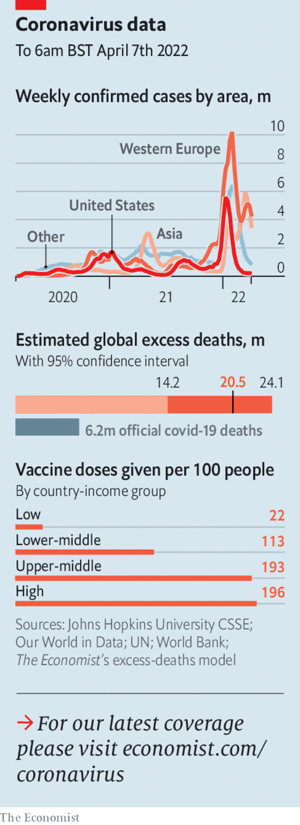  

#### 1.2 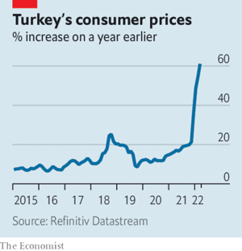  

#### 1.3 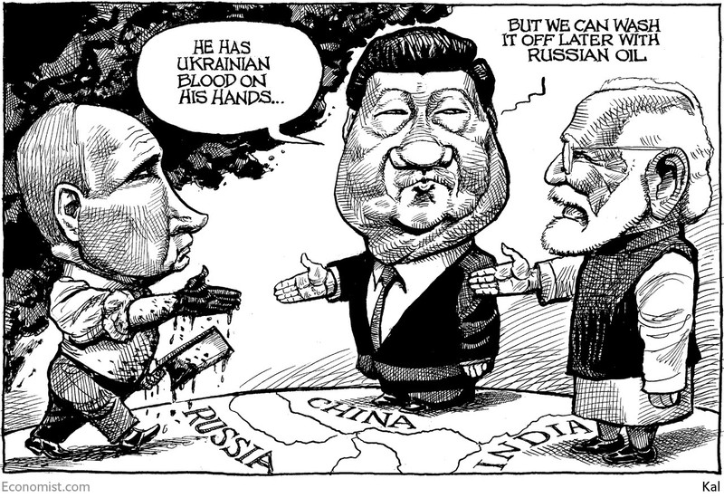  

### 2. Leaders
#### 2.1 _France votes:_ [Why Macron matters](https://www.economist.com/leaders/2022/04/09/why-macron-matters)  
France’s president presents a cautionary tale for centrists everywhere  

#### 2.2 _Atrocities in Ukraine:_ [Russian war criminals may never be brought to justice](https://www.economist.com/leaders/2022/04/08/russian-war-criminals-may-never-be-brought-to-justice)  
Investigate and charge them all the same  

#### 2.3 _Recession roulette:_ [A toxic mix of recession risks hangs over the world economy](https://www.economist.com/leaders/2022/04/09/a-toxic-mix-of-recession-risks-hangs-over-the-world-economy)  
American inflation, Europe’s energy crisis and China’s Omicron outbreak threaten the world economy with a downturn  
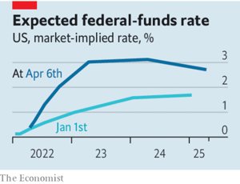  

#### 2.4 _Imaginary hobgoblins:_ [Fearmongering works. Fans of the truth should fear it](https://www.economist.com/leaders/2022/04/09/fearmongering-works-fans-of-the-truth-should-fear-it)  
In Hungary, Russia, Pakistan and France, leaders lie to scare people into supporting them  

#### 2.5 _After the smartphone:_ [Silicon Valley’s search for the next big tech platform](https://www.economist.com/leaders/2022/04/09/silicon-valleys-search-for-the-next-big-tech-platform)  
The smartphone era is fading. What next?  

### 3. Letters
#### 3.1 _On gay people in Florida, Hollywood, oligarchs, the Falklands war, school closures, exchange rates, Europe:_ [Letters to the editor](https://www.economist.com/letters/2022/04/09/letters-to-the-editor)  
A selection of correspondence  

### 4. By Invitation
#### 4.1 
#### 4.2 
#### 4.3 
### 5. Briefing
#### 5.1 _Beating the hard right:_ [France looks likely to re-elect Emmanuel Macron](https://www.economist.com/briefing/2022/04/09/france-looks-likely-to-re-elect-emmanuel-macron)  
But his race against Marine Le Pen is a lot closer than it was last time  
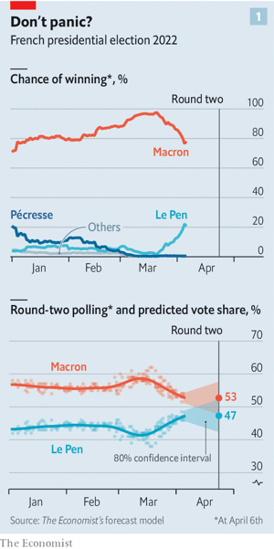  
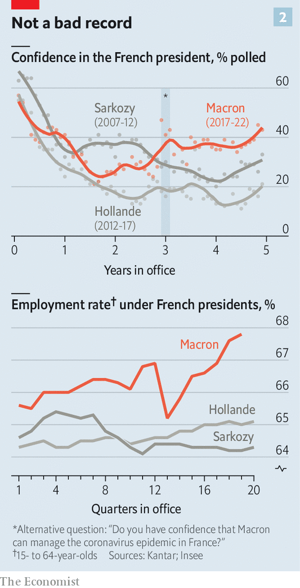  

### 6. Europe
#### 6.1 _After the battle:_ [As Russian soldiers retreat, they leave evidence of war crimes](https://www.economist.com/europe/2022/04/08/as-russian-soldiers-retreat-they-leave-evidence-of-war-crimes)  
A culture of violence pervades the invading army  
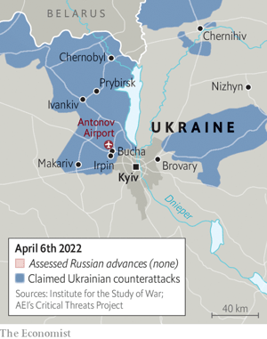  

#### 6.2 _The turning tide:_ [Ukraine sees a window of opportunity to push Russia back](https://www.economist.com/europe/ukraine-sees-a-window-of-opportunity-to-push-russia-back/21808597)  
But a long struggle looms in the east  
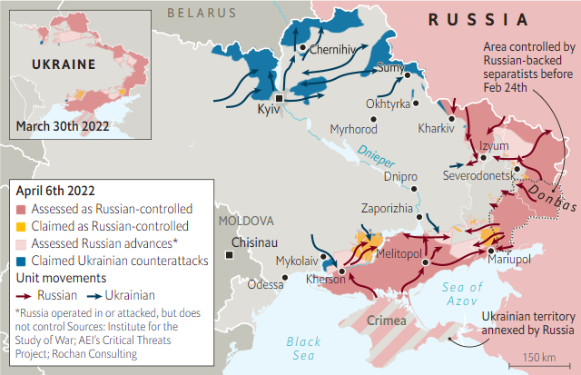  

#### 6.3 _From battleground to playground:_ [How Polish schools are coping with an influx of Ukrainian children](https://www.economist.com/europe/2022/04/04/how-polish-schools-are-coping-with-an-influx-of-ukrainian-children)  
It’s hard, but the young refugees are better off than those fleeing other conflicts  

#### 6.4 _Having it both ways:_ [How Turkey is courting Russia’s oligarchs](https://www.economist.com/europe/2022/04/07/how-turkey-is-courting-russias-oligarchs)  
It sells arms to Ukraine while welcoming Russian cash  

#### 6.5 _Hungary likes the wolf:_ [Viktor Orban’s victory is a triumph for illiberal nationalism](https://www.economist.com/europe/viktor-orbans-victory-is-a-triumph-for-illiberal-nationalism/21808575)  
After an unfair fight, the opposition parties start to blame each other  
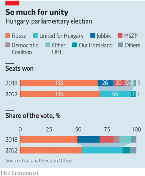  

#### 6.6 _Charlemagne:_ [Europe is learning to cope with Viktor Orban](https://www.economist.com/europe/2022/04/09/europe-is-learning-to-cope-with-viktor-orban)  
The strongman matters less and less outside Hungary  

### 7. Britain
#### 7.1 _Immigration patterns:_ [Britain has entered a third phase of post-war immigration](https://www.economist.com/britain/2022/04/07/britain-has-entered-a-third-phase-of-post-war-immigration)  
The first was post-colonial, the second European. This one is global and middle-class  
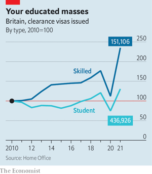  

#### 7.2 _Bluer, greener:_ [Making deliveries via the Thames](https://www.economist.com/britain/2022/04/07/making-deliveries-via-the-thames)  
Barges and boats instead of vans and lorries?  

#### 7.3 _Buy now, pray later:_ [Britons’ use of consumer credit is rising with the cost of living](https://www.economist.com/britain/2022/04/07/britons-use-of-consumer-credit-is-rising-with-the-cost-of-living)  
That makes robust regulation more urgent  
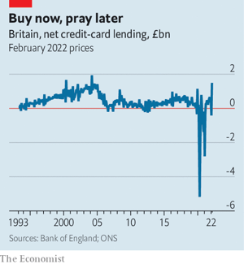  

#### 7.4 _The attorney-general:_ [Suella Braverman, a Johnsonian lawyer](https://www.economist.com/britain/2022/04/07/suella-braverman-a-johnsonian-lawyer)  
The British government’s chief legal adviser thinks the judiciary needs reining in  

#### 7.5 _A great British sell-off?:_ [Channel 4](https://www.economist.com/britain/2022/04/07/who-might-buy-britains-channel-4)  
  

#### 7.6 _Putting asunder:_ [No-fault divorce begins this week in England and Wales](https://www.economist.com/britain/no-fault-divorce-begins-this-week-in-england-and-wales/21808578)  
The marital blame game is finally ending  

#### 7.7 _Bagehot:_ [The cruelty of the British state](https://www.economist.com/britain/2022/04/07/the-cruelty-of-the-british-state)  
Voters upset by the treatment of Ukrainian refugees are getting what they asked for  

### 8. Middle East & Africa
#### 8.1 _After the tyrant:_ [Sudan faces collapse three years after the fall of its dictator](https://www.economist.com/middle-east-and-africa/2022/04/09/sudan-faces-collapse-three-years-after-the-fall-of-its-dictator)  
Two coups have left the country broke and its people furious  
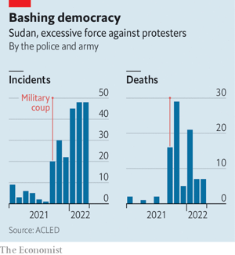  

#### 8.2 _Wine and punishment:_ [Lawyers debate the secret debts that bankrupted Mozambique](https://www.economist.com/middle-east-and-africa/2022/04/09/lawyers-debate-the-secret-debts-that-bankrupted-mozambique)  
A mega-scandal sparks court cases on three continents  

#### 8.3 _Of keys and patriarchy:_ [Why single women in Egypt find it hard to rent a flat](https://www.economist.com/middle-east-and-africa/2022/04/09/why-single-women-in-egypt-find-it-hard-to-rent-a-flat)  
Scandalised landlords ask intrusive questions  

#### 8.4 _Smashed and forgotten:_ [The tragedy of Benghazi, Libya’s second city](https://www.economist.com/middle-east-and-africa/2022/04/09/the-tragedy-of-benghazi-libyas-second-city)  
No one seems willing or able to rebuild it  

#### 8.5 _Squeezing the wrong people:_ [Arab governments are putting more taxes on the poor](https://www.economist.com/middle-east-and-africa/2022/04/09/arab-governments-are-putting-more-taxes-on-the-poor)  
Some collect more than half their tax revenue from regressive levies  
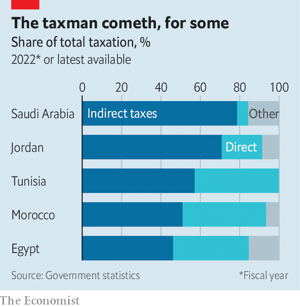  

### 9. United States
#### 9.1 _Fields of gold:_ [Why an agricultural boom does not help rural America](https://www.economist.com/united-states/2022/04/09/why-an-agricultural-boom-does-not-help-rural-america)  
Farms are ever more profitable, but employ fewer workers  
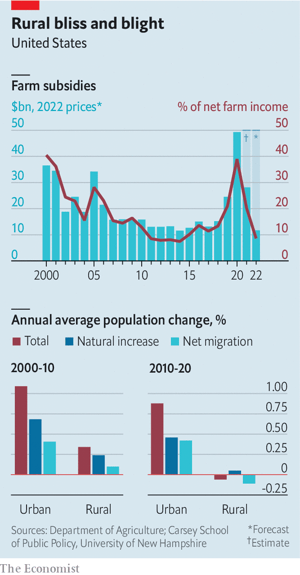  

#### 9.2 _The 116th justice:_ [Ketanji Brown Jackson is confirmed to America’s Supreme Court](https://www.economist.com/united-states/2022/04/09/ketanji-brown-jackson-is-confirmed-to-americas-supreme-court)  
But only three Republican senators joined the Democratic caucus in voting for the court’s first black female justice  

#### 9.3 _Trade unions in America:_ [Amazon has its first union, but lots more are unlikely to follow](https://www.economist.com/united-states/2022/04/09/amazon-has-its-first-union-but-lots-more-are-unlikely-to-follow)  
The worker-led success on Staten Island will be hard to replicate  

#### 9.4 _The opioid epidemic:_ [Black Americans have overtaken white victims in opioid death rates](https://www.economist.com/united-states/2022/04/09/black-americans-have-overtaken-white-victims-in-opioid-death-rates)  
The reasons for a lethal shift  
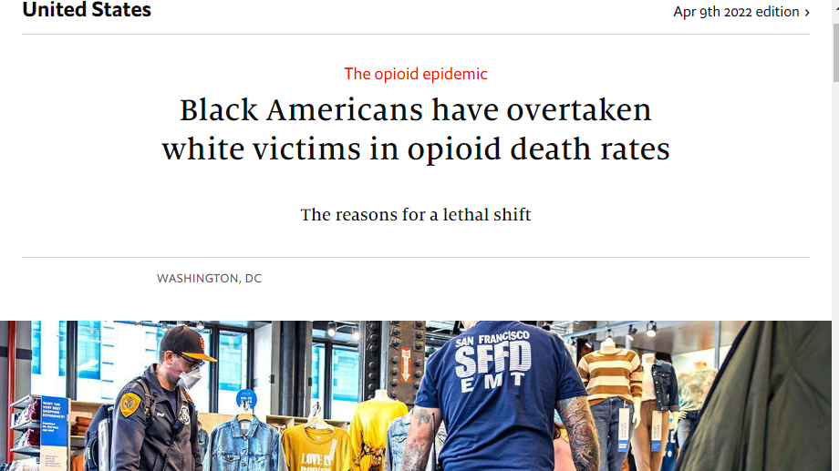  

#### 9.5 _Not pumped up:_ [Self-service petrol stations hit a roadblock in New Jersey](https://www.economist.com/united-states/2022/04/09/self-service-petrol-stations-hit-a-roadblock-in-new-jersey)  
For 73 years, New Jerseyans have been banned from pumping their own petrol. They like it that way  

#### 9.6 _Surrogacy:_ [America’s childmaking market is a legal and ethical minefield](https://www.economist.com/united-states/2022/04/09/americas-childmaking-market-is-a-legal-and-ethical-minefield)  
The battlegrounds of the baby business  

#### 9.7 _Lexington:_ [Bill Burns and the bear](https://www.economist.com/united-states/2022/04/09/bill-burns-and-the-bear)  
The CIA director is at the heart of the administration’s capable Ukraine effort  

### 10. The Americas
#### 10.1 _Villain or victim?:_ [Hailed as a saviour, derided as a thief, Lula is back](https://www.economist.com/the-americas/2022/04/09/hailed-as-a-saviour-derided-as-a-thief-lula-is-back)  
Brazil’s election may turn on whether voters trust their former president  

### 11. Asia
#### 11.1 _Lights out:_ [Sri Lanka’s economic crisis has created a political one](https://www.economist.com/asia/sri-lankas-economic-crisis-has-created-a-political-one/21808595)  
The government has no majority, no cabinet and no public support  
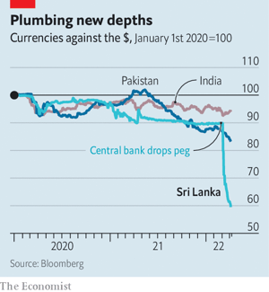  

#### 11.2 _Not cricket:_ [Imran Khan is trying every trick in the book to stay in power](https://www.economist.com/asia/2022/04/09/imran-khan-is-trying-every-trick-in-the-book-to-stay-in-power)  
Pakistan’s prime minister has pitched his country into a constitutional crisis  
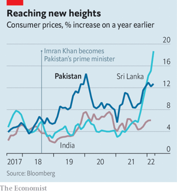  

#### 11.3 _Banyan:_ [India’s vaunted strategic autonomy is a mirage](https://www.economist.com/asia/2022/04/09/indias-vaunted-strategic-autonomy-is-a-mirage)  
The country remains economically and militarily dependent on outsiders  

#### 11.4 _Meanwhile in the Indo-Pacific:_ [AUKUS, a strategic submarine pact, turns to missiles](https://www.economist.com/asia/2022/04/09/aukus-a-strategic-submarine-pact-turns-to-missiles)  
America, Australia and Britain will co-operate on hypersonic missiles  

#### 11.5 _Bursting into Hwasong:_ [North Korea is testing ICBMs again. Nuclear weapons may be next](https://www.economist.com/asia/2022/04/07/north-korea-is-testing-icbms-again-nuclear-weapons-may-be-next)  
A heated exchange between the two Koreas hints at rising tensions  

### 12. China
#### 12.1 _Shanghai swoons:_ [A clumsy lockdown of Shanghai is testing the “zero-covid” strategy](https://www.economist.com/china/2022/04/09/a-clumsy-lockdown-of-shanghai-is-testing-the-zero-covid-strategy)  
Short of food and medicine, residents of China’s financial hub are growing angry  
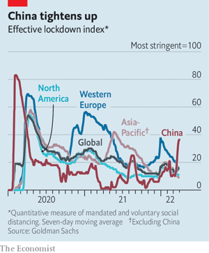  

#### 12.2 _A new sheriff in town:_ [John Lee, a tough former policeman, looks set to lead Hong Kong](https://www.economist.com/china/2022/04/09/john-lee-a-tough-former-policeman-looks-set-to-lead-hong-kong)  
It is easy to see why China’s Communist Party would like him  

#### 12.3 _A big appetite:_ [When China worries about food, the world pays](https://www.economist.com/china/2022/04/09/when-china-worries-about-food-the-world-pays)  
Critics accuse it of hoarding grain  

#### 12.4 _Chaguan:_ [Don’t underestimate Xi Jinping’s bond with Vladimir Putin](https://www.economist.com/china/2022/04/09/dont-underestimate-xi-jinpings-bond-with-vladimir-putin)  
Shared security concerns bring China and Russia close. But so do similar views of history  

### 13. International
#### 13.1 _Vladimir’s army:_ [Russia’s brutal mercenaries probably won’t matter much in Ukraine](https://www.economist.com/international/2022/04/08/russias-brutal-mercenaries-probably-wont-matter-much-in-ukraine)  
But they continue to prop up strongmen elsewhere  

### 14. Business
#### 14.1 _Seeing and believing:_ [From Apple to Google, big tech is building VR and AR headsets](https://www.economist.com/business/2022/04/09/from-apple-to-google-big-tech-is-building-vr-and-ar-headsets)  
They might just be the next big platform after the smartphone  
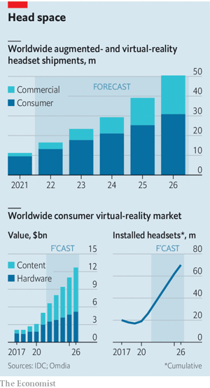  

#### 14.2 _Degrees of unconcern:_ [How MBA-wielding bosses boost profits](https://www.economist.com/business/2022/04/09/how-mba-wielding-bosses-boost-profits)  
Not by increasing sales, investment or productivity  

#### 14.3 _Another Musk-have:_ [Is investing in Twitter a meme too far for Elon Musk?](https://www.economist.com/business/is-investing-in-twitter-a-meme-too-far-for-elon-musk/21808586)  
The self-styled Technoking may be overextending himself  

#### 14.4 _In search of an ending:_ [Bain Capital buying Toshiba could be a big deal for Japan](https://www.economist.com/business/2022/04/09/bain-capital-buying-toshiba-could-be-a-big-deal-for-japan)  
America's private-equity barons circle one of the country's fading corporate jewels  
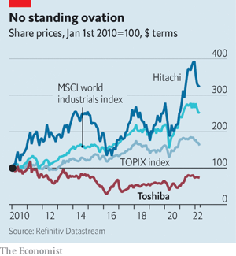  

#### 14.5 _Double-entry book-keeping:_ [China’s regulators warm to American listings](https://www.economist.com/business/2022/04/09/chinas-regulators-warm-to-american-listings)  
That may not be enough for American investors to warm to Chinese shares  
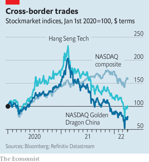  

#### 14.6 _Bartleby:_ [How to make hybrid work a success](https://www.economist.com/business/2022/04/09/how-to-make-hybrid-work-a-success)  
Clarity of expectations is the key  

#### 14.7 _Schumpeter:_ [Save globalisation! Buy a Chinese EV](https://www.economist.com/business/2022/04/09/save-globalisation-buy-a-chinese-ev)  
Electric cars can help stop the world from decoupling  

### 15. Finance & economics
#### 15.1 _Too much of a good thing:_ [Are labour markets in the rich world too tight?](https://www.economist.com/finance-and-economics/are-labour-markets-in-the-rich-world-too-tight/21808579)  
Certainly in America, and probably elsewhere  
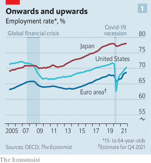  
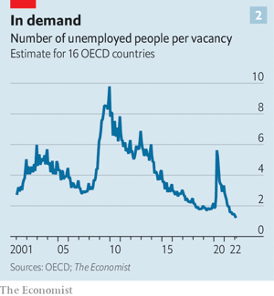  
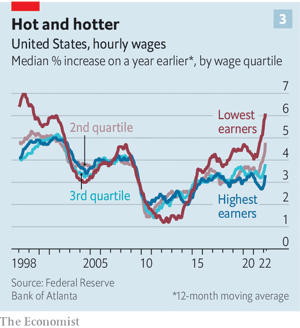  

#### 15.2 _Balance-sheet manoeuvres:_ [The Federal Reserve prepares for quantitative tightening](https://www.economist.com/finance-and-economics/2022/04/09/the-federal-reserve-prepares-for-quantitative-tightening)  
Goodbye, QE. Hello, QT  

#### 15.3 _FOMO froth:_ [The American property market is once again looking bubbly](https://www.economist.com/finance-and-economics/2022/04/09/the-american-property-market-is-once-again-looking-bubbly)  
Soaring mortgage rates have yet to cool exuberant demand  
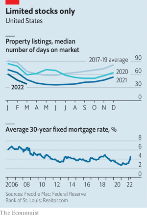  

#### 15.4 _Buttonwood:_ [Bonds signal recession. Stocks have been buoyant. What gives?](https://www.economist.com/finance-and-economics/2022/04/09/bonds-signal-recession-stocks-have-been-buoyant-what-gives)  
Stocks may have been ahead of bonds on inflation risk  

#### 15.5 _Looking in the side-mirror:_ [Omicron is dealing a big blow to China’s economy](https://www.economist.com/finance-and-economics/omicron-is-dealing-a-big-blow-to-chinas-economy/21808576)  
For a timely take, analysts are turning to unconventional indicators  
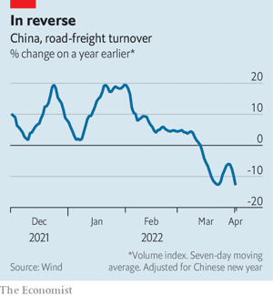  

#### 15.6 _A house united:_ [HDFC Bank’s merger marks a milestone for India](https://www.economist.com/finance-and-economics/2022/04/09/hdfc-banks-merger-marks-a-milestone-for-india)  
The new entity will be one of the world’s biggest banks by market valuation  

#### 15.7 _Not so sterling:_ [Has the pound become emerging-market money?](https://www.economist.com/finance-and-economics/2022/04/09/has-the-pound-become-emerging-market-money)  
Why the British currency has become more vulnerable to crises—and strangely popular  
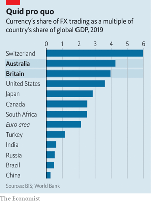  

#### 15.8 _Free exchange:_ [China has a celebrated history of policy experiments](https://www.economist.com/finance-and-economics/2022/04/09/china-has-a-celebrated-history-of-policy-experiments)  
Still, researchers find it could improve how it does them  
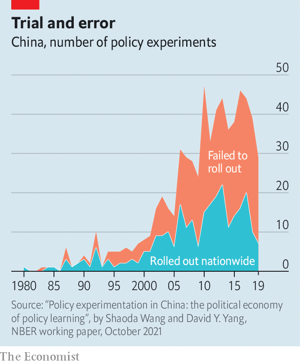  

### 16. Science & technology
#### 16.1 _Tick, tick, tick:_ [The latest IPCC report argues that stabilising the climate will require fast action](https://www.economist.com/science-and-technology/2022/04/09/the-latest-ipcc-report-argues-that-stabilising-the-climate-will-require-fast-action)  
Emissions must peak by 2025 for the world to have a chance of meeting the Paris goals  
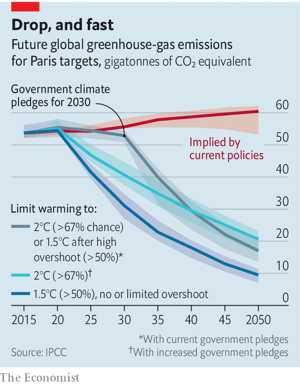  
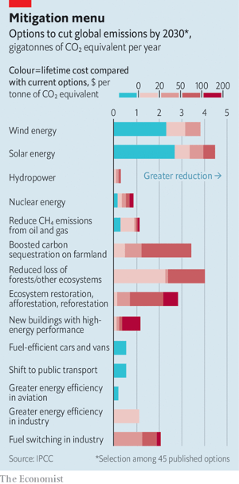  

#### 16.2 _Frames of mind:_ [The first reference charts for the human brain have been completed](https://www.economist.com/science-and-technology/the-first-reference-charts-for-the-human-brain-have-been-completed/21808585)  
They could become a useful tool in tracking healthy (and unhealthy) ageing  

#### 16.3 _Universal smells:_ [Around the world, people like (and dislike) the same scents](https://www.economist.com/science-and-technology/around-the-world-people-like-and-dislike-the-same-scents/21808584)  
Unlike visual preferences, the appreciation of smells crosses cultures  

#### 16.4 _Bird-swatching:_ [Songbirds get more colourful the closer they live to the equator](https://www.economist.com/science-and-technology/songbirds-get-more-colourful-the-closer-they-live-to-the-equator/21808592)  
A 19th-century hypothesis confirmed at last  
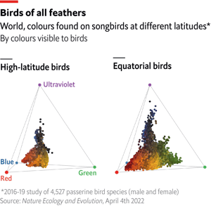  

### 17. Culture
#### 17.1 _Time v the machine:_ [When Albert Einstein and Henri Bergson rowed about time](https://www.economist.com/culture/when-albert-einstein-and-henri-bergson-rowed-about-time/21808591)  
A century later, the dispute between the physicist and the philosopher still resonates  

#### 17.2 _New American fiction:_ [Like Faulkner’s, Susan Straight’s fiction creates its own universe](https://www.economist.com/culture/2022/04/09/like-faulkners-susan-straights-fiction-creates-its-own-universe)  
In “Mecca” she brings to life the working people of southern California  

#### 17.3 _Authoritarian leaders:_ [The rise and risks of “The Age of the Strongman”](https://www.economist.com/culture/2022/04/09/the-rise-and-risks-of-the-age-of-the-strongman)  
Genuine democracies should have seen the strongmen coming, says Gideon Rachman  

#### 17.4 _Home Entertainment:_ [Glenn Gould’s radio documentaries are still mesmerising](https://www.economist.com/culture/2022/04/09/glenn-goulds-radio-documentaries-are-still-mesmerising)  
Listen to his ground-breaking “Solitude Trilogy” in a quiet moment of peace  

#### 17.5 _Children’s news:_ [How do you explain war to a six-year-old?](https://www.economist.com/culture/2022/04/09/how-do-you-explain-war-to-a-six-year-old)  
News outlets for youngsters grapple with events in Ukraine  

#### 17.6 _Johnson:_ [As the scale of science expands, so does the language of prefixes](https://www.economist.com/culture/2022/04/09/as-the-scale-of-science-expands-so-does-the-language-of-prefixes)  
Giga- and nano- are not the final frontier  

### 18. Economic & financial indicators
#### 18.1 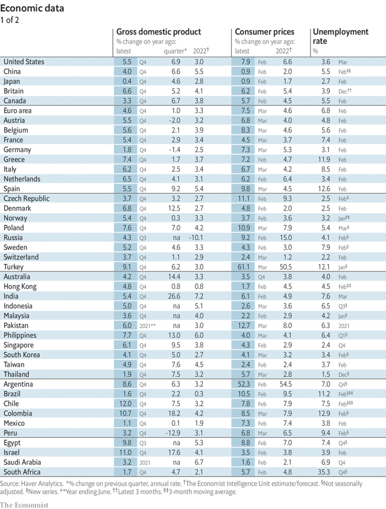  
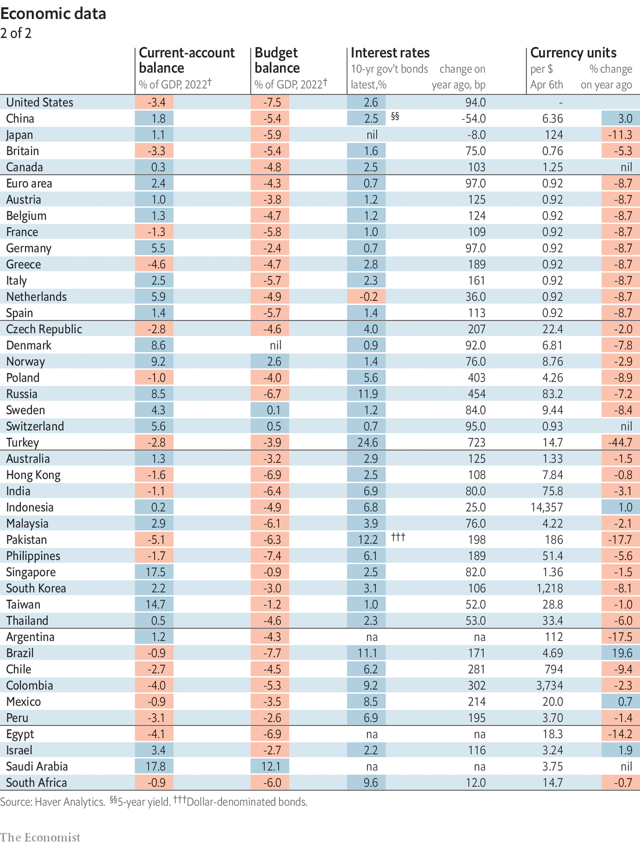  
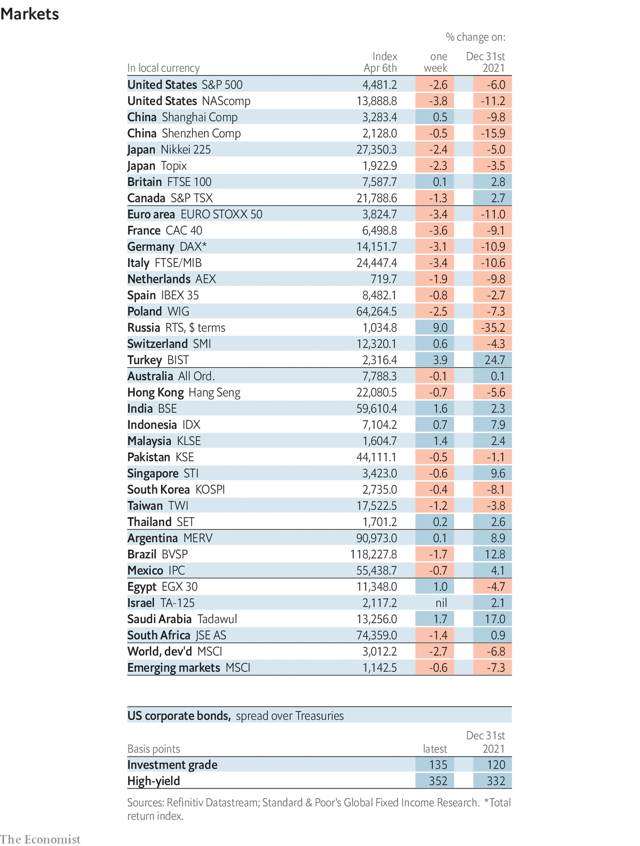  
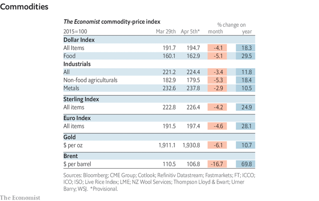  

### 19. Graphic detail
#### 19.1 _A tale of two surges:_ [Asia’s outbreaks show that Omicron is deadly in unvaccinated people](https://www.economist.com/graphic-detail/2022/04/09/asias-outbreaks-show-that-omicron-is-deadly-in-unvaccinated-people)  
Covid has never spread faster than in recent surges in Hong Kong and South Korea  
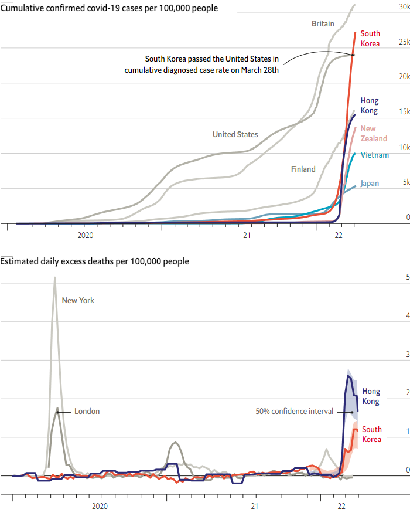  
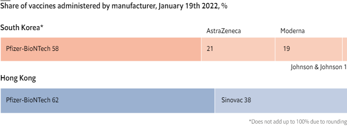  
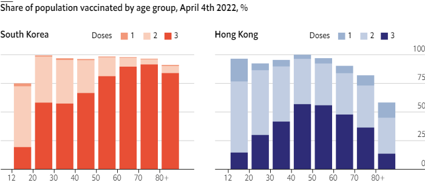  

### 20. Obituary
#### 20.1 _Man and myth:_ [Mario Terán was the man sent to kill Che Guevara](https://www.economist.com/obituary/2022/04/09/mario-teran-was-the-man-sent-to-kill-che-guevara)  
The Bolivian soldier died on March 10th, aged 80  

