### 1. The world this week
#### 1.1 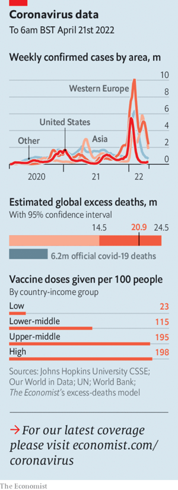  

#### 1.2 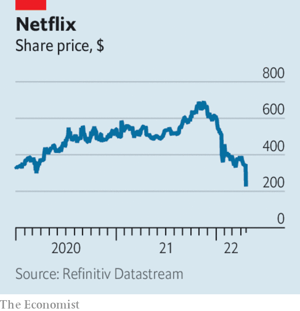  

#### 1.3 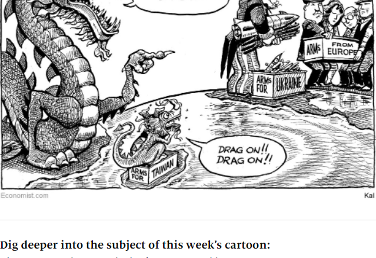  

### 2. Leaders
#### 2.1 
#### 2.2 
#### 2.3 
#### 2.4 
#### 2.5 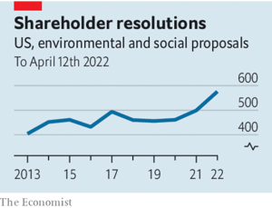  

### 3. Letters
#### 3.1 _On Ukraine and the EU, business ethics, Britain, Hungary, hotels, water:_ [Letters to the editor](https://www.economist.com/letters/2022/04/23/letters-to-the-editor)  
A selection of correspondence  

### 4. By Invitation
#### 4.1 
#### 4.2 
#### 4.3 
### 5. Briefing
#### 5.1 _“War is here”:_ [What Taiwan can learn from Russia’s invasion of Ukraine](https://www.economist.com/briefing/what-taiwan-can-learn-from-russias-invasion-of-ukraine/21808850)  
Fighting spirit and the right Western arms may stymie a powerful foe  
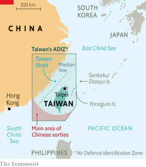  
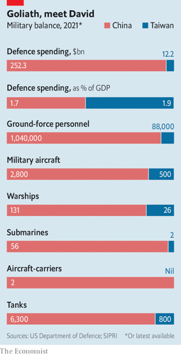  

### 6. Europe
#### 6.1 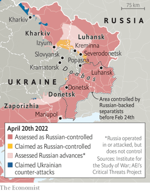  

#### 6.2 
#### 6.3 
#### 6.4 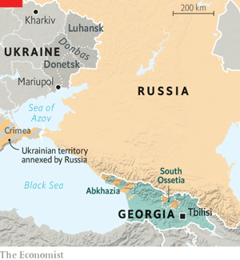  

#### 6.5 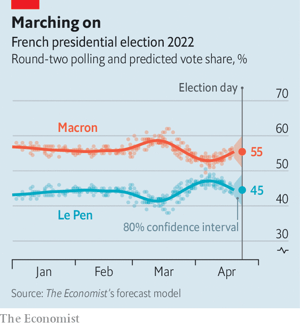  

#### 6.6 
### 7. Britain
#### 7.1 _The big squeeze:_ [A guide to Britain’s cost-of-living crunch](https://www.economist.com/britain/2022/04/21/a-guide-to-britains-cost-of-living-crunch)  
Incomes in Britain will not keep up with inflation over the coming months  
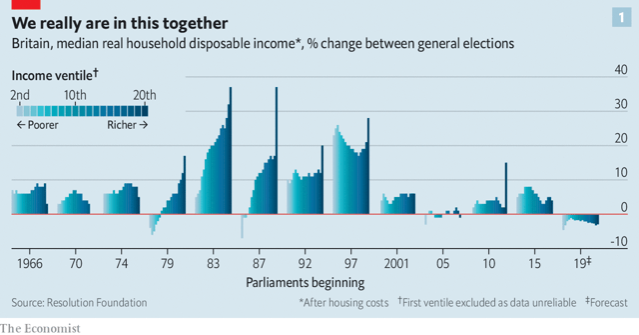  
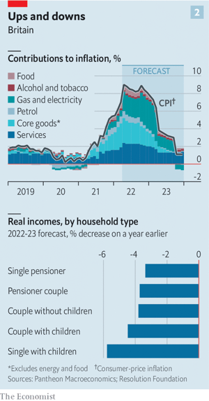  

#### 7.2 _Red and buried:_ [Sir Keir Starmer’s transformation of the Labour Party](https://www.economist.com/britain/2022/04/21/sir-keir-starmers-transformation-of-the-labour-party)  
The grip of the hard left has been broken  

#### 7.3 _Less shooting, more sequestering:_ [The carbon market drives land sales in Scotland](https://www.economist.com/britain/2022/04/21/the-carbon-market-drives-land-sales-in-scotland)  
Environmentalists are buying up estates in the Highlands  

#### 7.4 _Window pains:_ [A Cambridge college reflects on the controversy over Ronald Fisher](https://www.economist.com/britain/2022/04/23/a-cambridge-college-reflects-on-the-controversy-over-ronald-fisher)  
The defenestration of a statistician and eugenicist  

#### 7.5 _Really not new York:_ [The NIMBY city](https://www.economist.com/britain/2022/04/21/the-nimby-city)  
The parable of York, a place that does not want to grow  
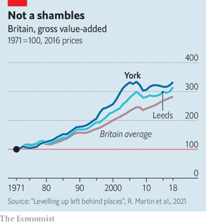  

#### 7.6 _Bagehot:_ [Why Boris bashes the archbishop](https://www.economist.com/britain/2022/04/23/why-boris-bashes-the-archbishop)  
Fighting institutions trumps actually governing for the Conservatives  

### 8. Middle East & Africa
#### 8.1 _The call of the south:_ [Turkey is making a big diplomatic and corporate push into Africa](https://www.economist.com/middle-east-and-africa/2022/04/23/turkey-is-making-a-big-diplomatic-and-corporate-push-into-africa)  
It is sending engineers and soap operas, but also guns and soldiers  
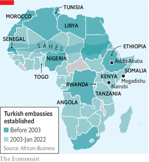  
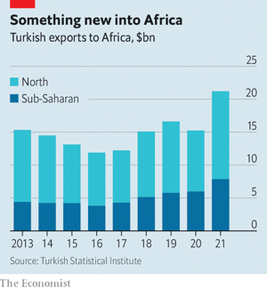  

#### 8.2 _Monetising Madiba:_ [Making money from Nelson Mandela’s name](https://www.economist.com/middle-east-and-africa/2022/04/21/making-money-from-nelson-mandelas-name)  
A boutique hotel and NFTs are the latest examples of Madiba’s lucrative legacy  

#### 8.3 _The sour milky way:_ [Why Egypt isn’t open for business](https://www.economist.com/middle-east-and-africa/2022/04/21/why-egypt-isnt-open-for-business)  
Despite pro-business talk, the army grabs whatever it wants  

#### 8.4 _Unhappy royals:_ [Jordan’s troubled king and his bothersome brother](https://www.economist.com/middle-east-and-africa/2022/04/21/jordans-troubled-king-and-his-bothersome-brother)  
Rivalry within the royal family is threatening the kingdom’s stability  

### 9. United States
#### 9.1 _Greener than thou:_ [California wants to lead the world on climate policy](https://www.economist.com/united-states/california-wants-to-lead-the-world-on-climate-policy/21808833)  
The energy crunch offers the state a chance to live up to its green reputation  
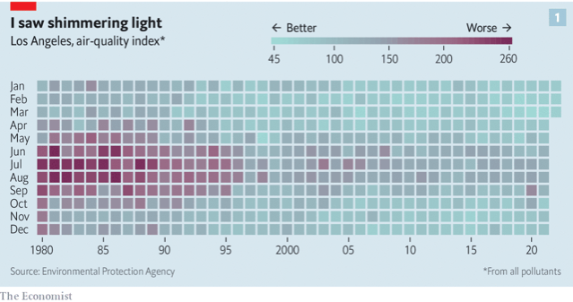  
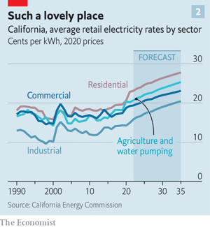  

#### 9.2 _Cottage industry:_ [The case for granny flats](https://www.economist.com/united-states/2022/04/23/the-case-for-granny-flats)  
Adding density would boost housing supply and lower emissions  

#### 9.3 _A fight over jurisdiction:_ [Oklahoma takes a tussle with Indian tribes to the Supreme Court](https://www.economist.com/united-states/2022/04/21/oklahoma-takes-a-tussle-with-indian-tribes-to-the-supreme-court)  
Challenging the long arm of tribal law  

#### 9.4 _Dust-up with doormen:_ [New York’s well-to-do avoid having to open their own doors](https://www.economist.com/united-states/2022/04/23/new-yorks-well-to-do-avoid-having-to-open-their-own-doors)  
The white gloves almost come off  

#### 9.5 _Ketamine clinics:_ [More American clinics are offering ketamine to treat depression](https://www.economist.com/united-states/2022/04/23/more-american-clinics-are-offering-ketamine-to-treat-depression)  
Is this a good thing?  

#### 9.6 _Lexington:_ [James Madison and his slaves](https://www.economist.com/united-states/2022/04/21/james-madison-and-his-slaves)  
A row over the management of Montpelier illustrates the racial politics of cultural preservation  

### 10. The Americas
#### 10.1 _The United States of Mexico:_ [Mexican migration has changed America for the better](https://www.economist.com/the-americas/2022/04/23/mexican-migration-has-changed-america-for-the-better)  
Remittances sent home have helped Mexico, too  
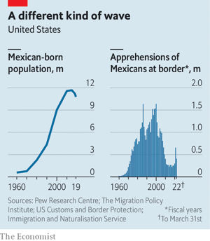  

#### 10.2 _Enemies with benefits:_ [Can Venezuela help the West wean itself off Russian oil?](https://www.economist.com/the-americas/can-venezuela-help-the-west-wean-itself-off-russian-oil/21808837)  
Nicolás Maduro, the country’s autocratic president, may make that difficult  
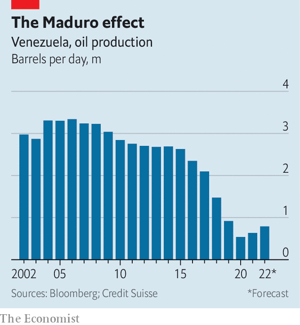  

### 11. Asia
#### 11.1 _Asia’s Ukraine dilemma:_ [Interests, not values, underpin Asia’s ambivalence about Russia](https://www.economist.com/asia/2022/04/23/interests-not-values-underpin-asias-ambivalence-about-russia)  
“Democracy v autocracy” is an unhelpful lens through which to see the region’s calculations  
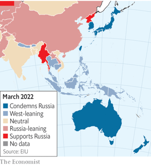  

#### 11.2 _Moo with the times:_ [Indian cows (and buffaloes) are going online](https://www.economist.com/asia/2022/04/21/indian-cows-and-buffaloes-are-going-online)  
A new breed of startups wants to formalise cattle trading  

#### 11.3 _Sung and dance:_ [North Korea’s day of celebration reveals little to celebrate](https://www.economist.com/asia/2022/04/21/north-koreas-day-of-celebration-reveals-little-to-celebrate)  
Kim Jong Un unveils luxury apartments as his people confront food shortages  

#### 11.4 _Banyan:_ [Lawrence Wong is Singapore’s presumptive next prime minister](https://www.economist.com/asia/2022/04/23/lawrence-wong-is-singapores-presumptive-next-prime-minister)  
The ruling party’s new leader-in-waiting is meant to show its softer side  

### 12. China
#### 12.1 _Democracies and the dragon:_ [Chinese political interference has Western spooks worried](https://www.economist.com/china/2022/04/21/chinese-political-interference-has-western-spooks-worried)  
With money and support, China hopes to bend foreign politicians to its will  

#### 12.2 _The Russian treatment:_ [Could the West punish China the way it has punished Russia?](https://www.economist.com/china/2022/04/23/could-the-west-punish-china-the-way-it-has-punished-russia)  
New economic weapons are double-edged swords  
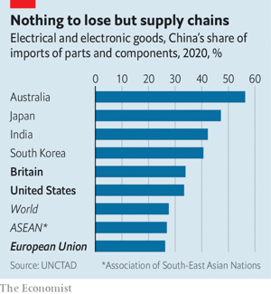  

#### 12.3 _The blame game:_ [China says imports are causing outbreaks of covid-19](https://www.economist.com/china/2022/04/21/china-says-imports-are-causing-outbreaks-of-covid-19)  
Alleged vectors include everything from pork knuckles to clothing  

#### 12.4 _Chaguan:_ [China’s harsh and elitist covid rules](https://www.economist.com/china/2022/04/21/chinas-harsh-and-elitist-covid-rules)  
The pandemic revives old fears about migrants from humble places  

### 13. International
#### 13.1 _Going to court for the climate:_ [Lawsuits aimed at greenhouse-gas emissions are a growing trend](https://www.economist.com/international/2022/04/23/lawsuits-aimed-at-greenhouse-gas-emissions-are-a-growing-trend)  
And better science could make them more precise  
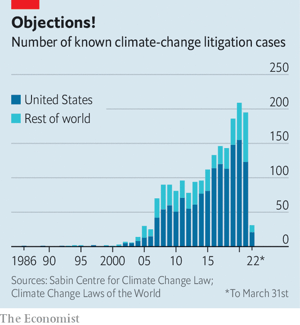  

### 14. Special report
#### 14.1 _Central banks:_ [The danger of excessive distraction](https://www.economist.com/special-report/2022/04/20/the-danger-of-excessive-distraction)  
Central banks are under attack for failing to stop inflation. That partly reflects being given too many other jobs to do, argues Rachana Shanbhogue  
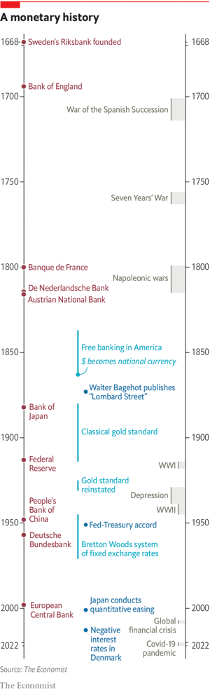  

#### 14.2 _Emergency response:_ [The perils of expanded balance-sheets](https://www.economist.com/special-report/2022/04/20/the-perils-of-expanded-balance-sheets)  
The power—and the limits—of central banks’ balance-sheets  
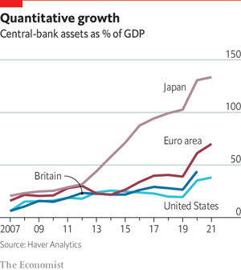  

#### 14.3 _Social issues:_ [When central banks become one-stop policy shops](https://www.economist.com/special-report/2022/04/20/when-central-banks-become-one-stop-policy-shops)  
Central banks are under pressure to cure social ills  
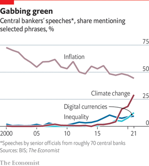  

#### 14.4 _Environmental concerns:_ [The wish to respond to climate change](https://www.economist.com/special-report/2022/04/20/the-wish-to-respond-to-climate-change)  
How green can central banking get?  

#### 14.5 _Going digital:_ [How central banks are moving into e-money](https://www.economist.com/special-report/2022/04/20/how-central-banks-are-moving-into-e-money)  
Designing a digital currency that works—but not too well  
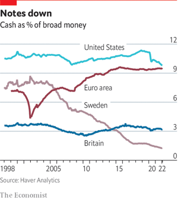  

#### 14.6 _Geopolitics and war:_ [When central banks face sanctions](https://www.economist.com/special-report/2022/04/20/when-central-banks-face-sanctions)  
Central banks must grapple with geopolitics, too  

#### 14.7 _Looking ahead:_ [The curse of being too competent](https://www.economist.com/special-report/2022/04/20/the-curse-of-being-too-competent)  
The temptation to heap jobs on central banks must be resisted  

#### 14.8 
### 15. Business
#### 15.1 _Proxy power:_ [Annual meetings are the new frontline in the battle over corporate purpose](https://www.economist.com/business/annual-meetings-are-the-new-frontline-in-the-battle-over-corporate-purpose/21808834)  
Climate, race and inequality are on the agenda  
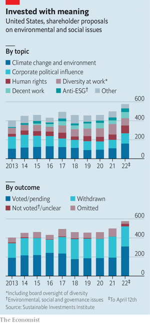  

#### 15.2 _Commercial brake:_ [Netflix sheds subscribers—and $170bn in market value](https://www.economist.com/business/netflix-sheds-subscribers-and-170bn-in-market-value/21808847)  
Can it tempt viewers back with advertising?  
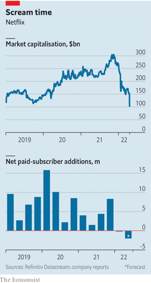  

#### 15.3 _Take this, sucker:_ [Big tech wants to bootstrap carbon removal into a big business](https://www.economist.com/business/2022/04/23/big-tech-wants-to-bootstrap-carbon-removal-into-a-big-business)  
A consortium of technology firms is ploughing nearly $1bn into a clever market mechanism  

#### 15.4 _Bartleby:_ [Startups for the modern workplace](https://www.economist.com/business/2022/04/23/startups-for-the-modern-workplace)  
Sharks, dragons and angels: what are you waiting for?  

#### 15.5 _Hungry, hungry unicorns:_ [After a fat year, tech startups are bracing for lean times](https://www.economist.com/business/2022/04/23/after-a-fat-year-tech-startups-are-bracing-for-lean-times)  
Which are most at risk?  
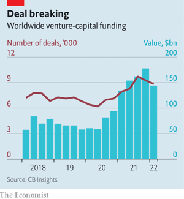  

#### 15.6 _Schumpeter:_ [Elon Musk’s Twitter saga is capitalism gone rogue](https://www.economist.com/business/2022/04/23/elon-musks-twitter-saga-is-capitalism-gone-rogue)  
The world’s richest man is playing with the rules of the game  

### 16. Finance & economics
#### 16.1 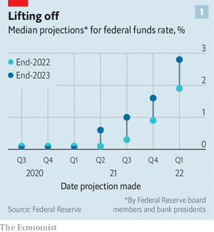  
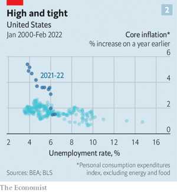  

#### 16.2 
#### 16.3 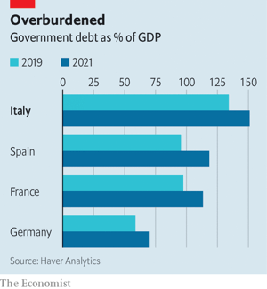  

#### 16.4 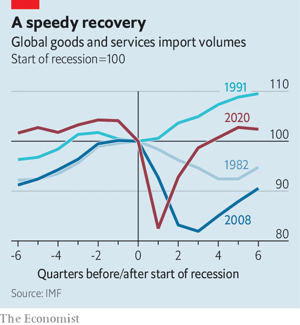  

#### 16.5 
#### 16.6 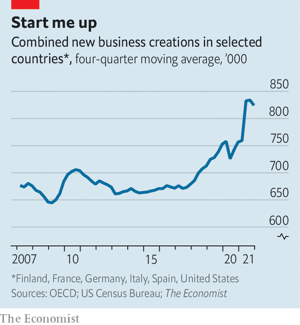  

#### 16.7 
#### 16.8 
### 17. Science & technology
#### 17.1 _Human space flight:_ [Spacesuits are showing their age](https://www.economist.com/science-and-technology/spacesuits-are-showing-their-age/21808842)  
Astronauts’ wardrobes are in need of a makeover  

#### 17.2 _Launch break:_ [America is ending anti-satellite missile tests](https://www.economist.com/science-and-technology/america-is-ending-anti-satellite-missile-tests/21808846)  
No one wants Kessler syndrome. But will other countries follow suit?  

#### 17.3 _Light entertainment:_ [Why 15,000-year-old art might have been displayed in firelight](https://www.economist.com/science-and-technology/why-15000-year-old-art-might-have-been-displayed-in-firelight/21808843)  
Markings on prehistoric art hint at an early attempt at animation  

#### 17.4 _Twists and turns:_ [How balls of blackworms avoid the knotty step](https://www.economist.com/science-and-technology/how-balls-of-blackworms-avoid-the-knotty-step/21808845)  
Thousands of them can disperse in thousandths of a second  

#### 17.5 _Out, dammed spot:_ [A sound way towards reversible vasectomies](https://www.economist.com/science-and-technology/a-sound-way-towards-reversible-vasectomies/21808844)  
Researchers test a means to block—and neatly unblock—men’s reproductive ductwork  

### 18. Culture
#### 18.1 _Wanghong art:_ [Social media are changing the way art is seen and presented](https://www.economist.com/culture/2022/04/23/social-media-are-changing-the-way-art-is-seen-and-presented)  
The marriage of art and apps is especially conspicuous in China  

#### 18.2 _Centennial tributes:_ [The comic genius of Kingsley Amis](https://www.economist.com/culture/2022/04/23/the-comic-genius-of-kingsley-amis)  
In his life and writing, the author of “Lucky Jim” relied on his friends  

#### 18.3 _The roads to war:_ [“Why We Fight” investigates the origins of war](https://www.economist.com/culture/why-we-fight-investigates-the-origins-of-war/21808848)  
The high costs make fighting rare, explains Christopher Blattman  

#### 18.4 _Home Entertainment:_ [Love and exile in “Letter from an Unknown Woman”](https://www.economist.com/culture/2022/04/21/love-and-exile-in-letter-from-an-unknown-woman)  
Stefan Zweig’s book, and Max Ophüls’s film, evoke thwarted passion and a lost world  

#### 18.5 _American lives:_ [Paddle alongside Dick Conant in “Riverman”](https://www.economist.com/culture/2022/04/23/paddle-alongside-dick-conant-in-riverman)  
Ben McGrath’s book is a tribute to a fully lived life  

#### 18.6 _Johnson:_ [On the origin of languages](https://www.economist.com/culture/2022/04/22/on-the-origin-of-languages)  
It is tempting to think that they have clear beginnings. They don’t  

### 19. Economic & financial indicators
#### 19.1 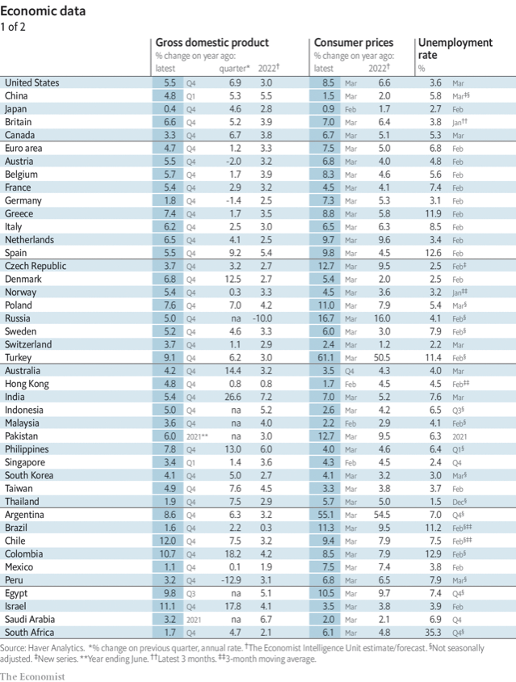  
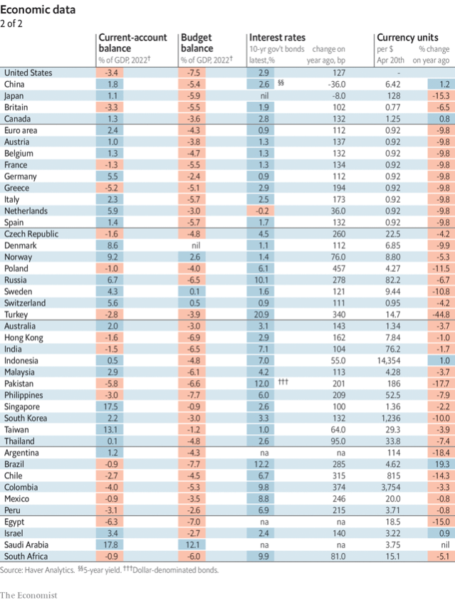  
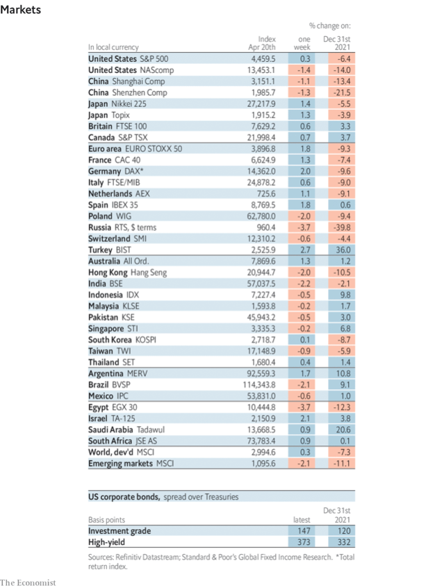  
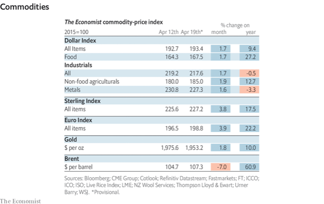  

### 20. Graphic detail
#### 20.1 _Scorched earth:_ [Nearly half of Mariupol has suffered grave damage](https://www.economist.com/graphic-detail/2022/04/23/nearly-half-of-mariupol-has-suffered-grave-damage)  
Satellite images show that 90% of ruined buildings were residential  
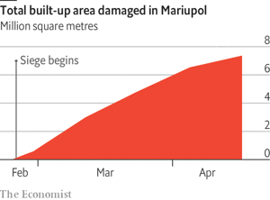  
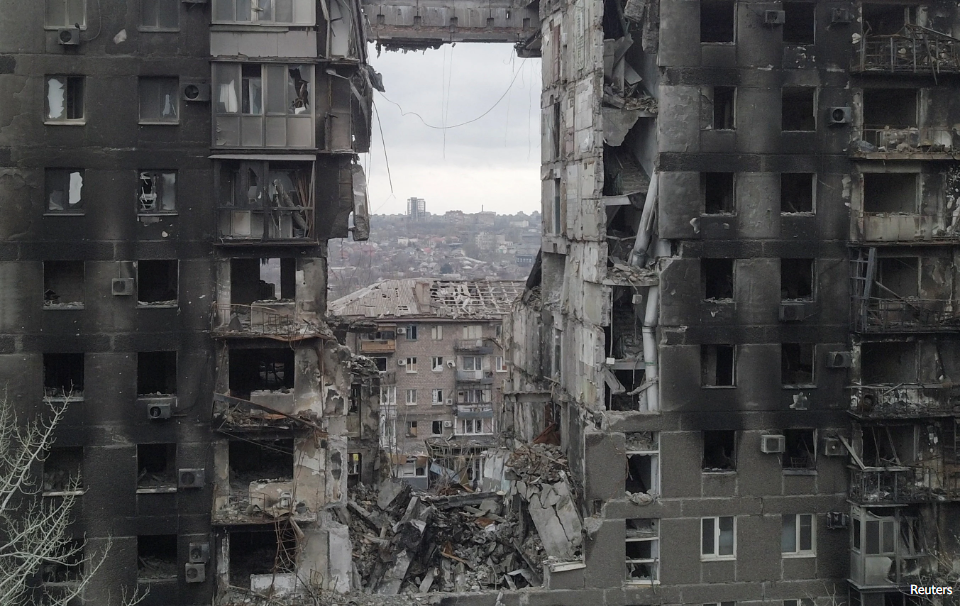  
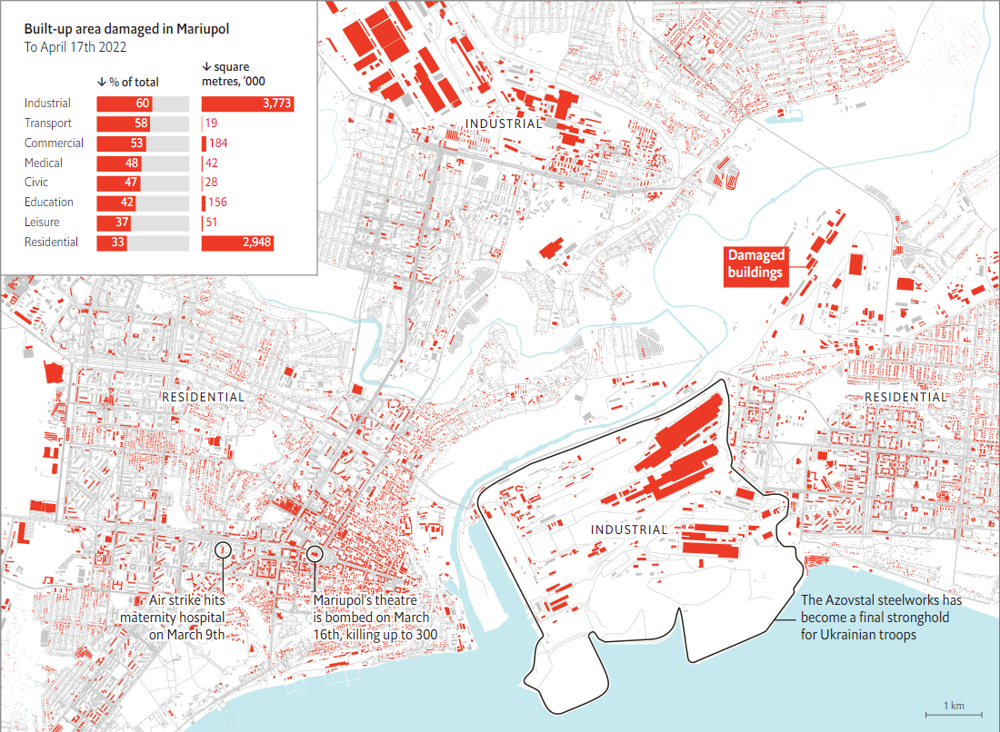  
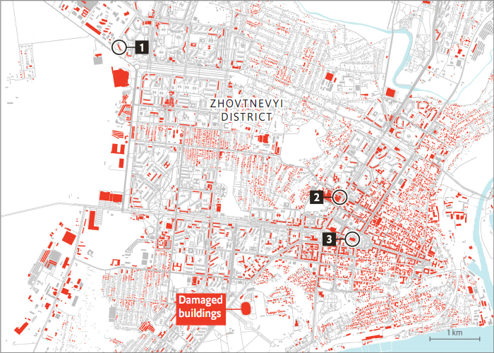  
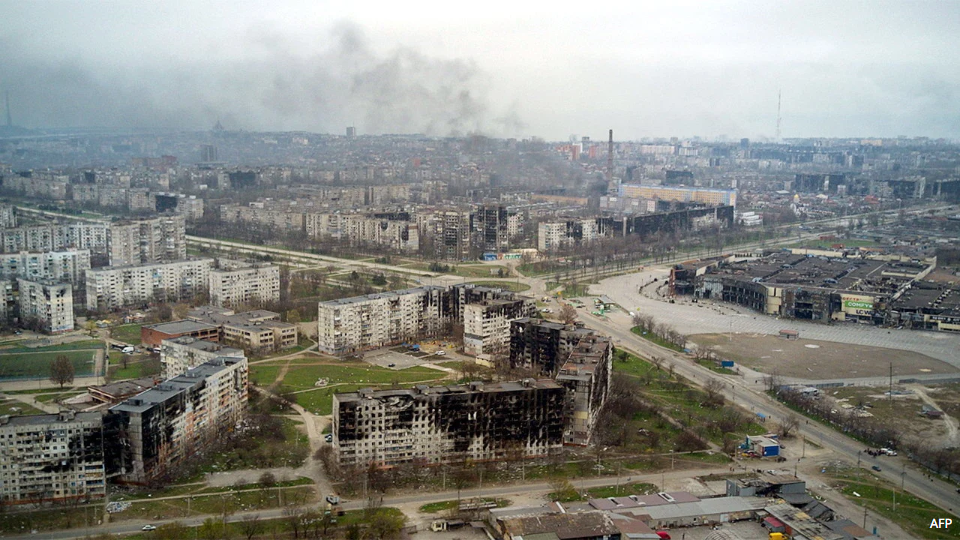  
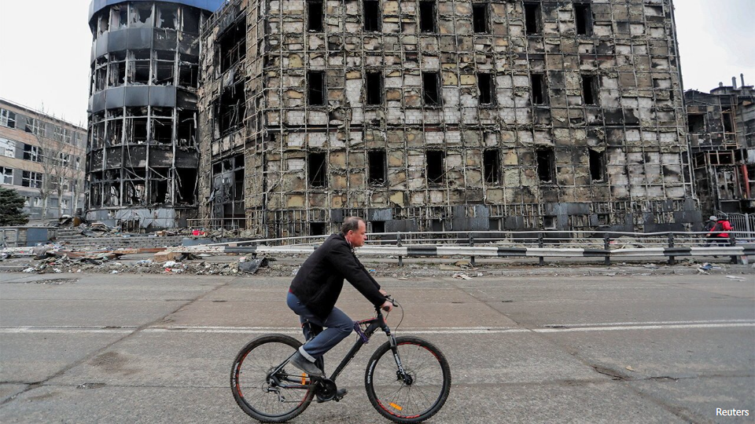  
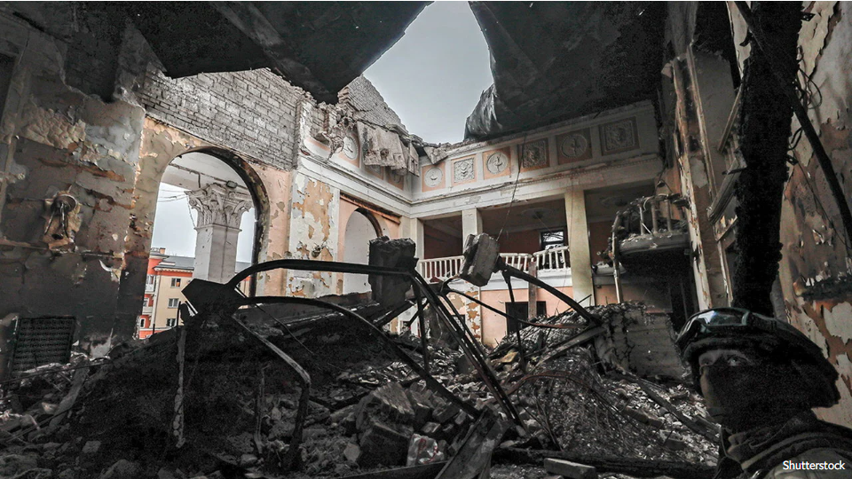  

### 21. Obituary
#### 21.1 _A taste for freedom:_ [Peng Ming-min fought for the idea of “one China and one Formosa”](https://www.economist.com/obituary/2022/04/21/peng-ming-min-fought-for-the-idea-of-one-china-and-one-formosa)  
A leading advocate of Taiwan’s independence, he died on April 8th, aged 98  

