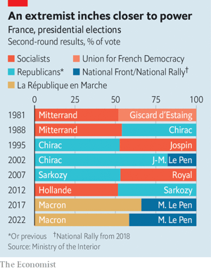

### 1. The world this week
#### 1.1 
#### 1.2 
#### 1.3   

### 2. Leaders
#### 2.1 
#### 2.2 
#### 2.3 
#### 2.4 
#### 2.5   

### 3. Letters
#### 3.1 
### 4. By Invitation
#### 4.1 
#### 4.2 
### 5. Briefing
#### 5.1 
### 6. Europe
#### 6.1   

#### 6.2 
#### 6.3 
#### 6.4 
#### 6.5 
#### 6.6 
### 7. Britain
#### 7.1   

#### 7.2 
#### 7.3   

#### 7.4 
#### 7.5 
#### 7.6 
#### 7.7 
### 8. Middle East & Africa
#### 8.1   

#### 8.2 
#### 8.3   

#### 8.4   

#### 8.5 
### 9. United States
#### 9.1 
#### 9.2 
#### 9.3 
#### 9.4 
#### 9.5   
  

#### 9.6 
### 10. The Americas
#### 10.1   

#### 10.2   

#### 10.3   

### 11. Asia
#### 11.1 
#### 11.2 
#### 11.3 
#### 11.4 
#### 11.5 
### 12. China
#### 12.1 
#### 12.2 
#### 12.3 
#### 12.4   

#### 12.5 
### 13. International
#### 13.1   

### 14. Business
#### 14.1   

#### 14.2 
#### 14.3   
  

#### 14.4   

#### 14.5 
#### 14.6 
### 15. Finance & economics
#### 15.1   
  
  

#### 15.2   

#### 15.3 
#### 15.4   

#### 15.5 
#### 15.6 
#### 15.7 
### 16. Science & technology
#### 16.1 
#### 16.2 
#### 16.3 
### 17. Culture
#### 17.1 
#### 17.2 
#### 17.3 
#### 17.4 
#### 17.5 
#### 17.6 
### 18. Economic & financial indicators
#### 18.1 
### 19. Graphic detail
#### 19.1 _Where the lawns are greener:_ [How the pandemic has changed American homebuyers’ preferences](https://www.economist.com/interactive/graphic-detail/2022/04/30/american-homebuyers-are-flocking-to-warm-suburbs)  
They are flocking to warm suburbs  

### 20. Obituary
#### 20.1 
