### 1. The world this week
#### 1.1 [Politics](https://www.economist.com/the-world-this-week/2022/05/26/politics)

#### 1.2 [Business](https://www.economist.com/the-world-this-week/2022/05/26/business)
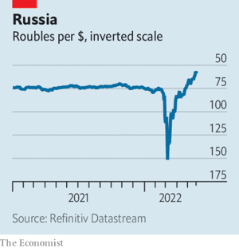  

#### 1.3 [KAL’s cartoon](https://www.economist.com/the-world-this-week/2022/05/26/kals-cartoon)
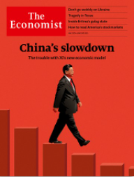  

### 2. Leaders
#### 2.1 _Ideology versus prosperity:_ [China’s economy](https://www.economist.com/leaders/2022/05/26/how-xi-jinping-is-damaging-chinas-economy)  

#### 2.2 _Perhaps make it a bit harder to buy one?:_ [Guns in America](https://www.economist.com/leaders/2022/05/25/why-america-should-make-it-harder-to-buy-guns)  

#### 2.3 _Don’t stop now:_ [Ukraine](https://www.economist.com/leaders/2022/05/26/ukraine-needs-support-not-timorous-advice)  
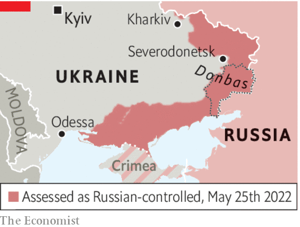  

#### 2.4 _Containing the North Korea of Africa:_ [Eritrea](https://www.economist.com/leaders/2022/05/26/containing-eritrea-the-north-korea-of-africa)  

#### 2.5 _Prophets and profits:_ [Financial markets](https://www.economist.com/leaders/2022/05/26/why-investors-are-increasingly-worried-about-recession-in-america)  
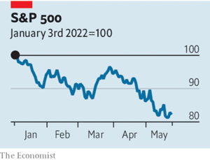  

#### 2.6 _Britain should scrap the Online Safety Bill:_ [Internet regulation](https://www.economist.com/leaders/2022/05/26/britain-should-scrap-its-online-safety-bill)  

### 3. Letters
#### 3.1 _On money-laundering, medieval history, Utah, shrinkflation, food oil, pandemics, digital twins, football:_ [Letters to the editor](https://www.economist.com/letters/2022/05/26/letters-to-the-editor)  

### 4. By Invitation
#### 4.1 _Sir John Bell argues for a global genomic surveillance system to thwart pandemics:_ [Health care](https://www.economist.com/by-invitation/2022/05/26/sir-john-bell-argues-for-a-global-genomic-surveillance-system-to-thwart-pandemics)  

#### 4.2 _Sonal Desai says the Fed has kept monetary policy too loose for too long:_ [Finance and economics](https://www.economist.com/by-invitation/2022/05/23/sonal-desai-says-the-fed-has-kept-monetary-policy-too-loose-for-too-long)  

#### 4.3 _Andrey Kortunov offers three scenarios for the end of the war in Ukraine:_ [Russia and Ukraine](https://www.economist.com/by-invitation/2022/05/20/andrey-kortunov-offers-three-scenarios-for-the-end-of-the-war-in-ukraine)  

### 5. Briefing
#### 5.1 _Fortified but not enriched:_ [The Chinese economy](https://www.economist.com/briefing/2022/05/26/china-is-trying-to-protect-its-economy-from-western-pressure)  
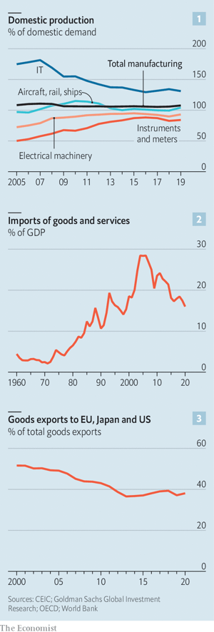  
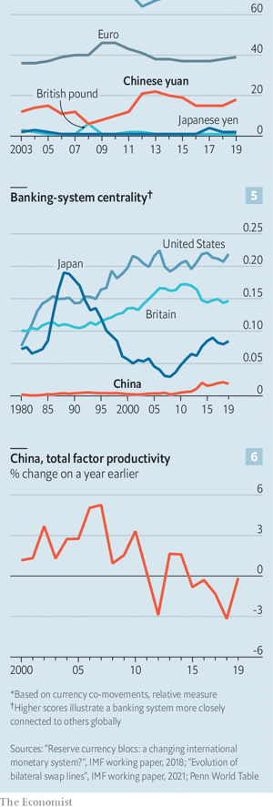  

### 6. Europe
#### 6.1 _When and how might the fighting end?:_ [The war in Ukraine](https://www.economist.com/europe/2022/05/26/when-and-how-might-the-war-in-ukraine-end)  

#### 6.2 _The tide turns:_ [Refugees in Poland](https://www.economist.com/europe/2022/05/24/as-russias-invasion-stalls-ukraines-refugees-return-home)  
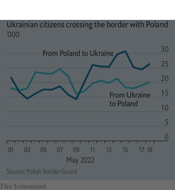  

#### 6.3 _So far, so good:_ [The EU’s covid-19 recovery fund](https://www.economist.com/europe/2022/05/26/the-eus-covid-19-recovery-fund-has-changed-how-europe-spends-money)  
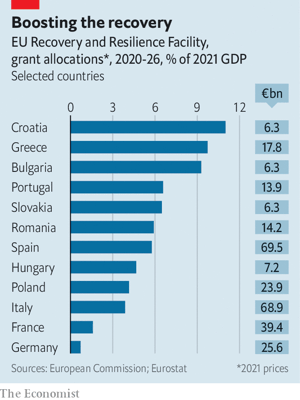  

#### 6.4 _The return of the king:_ [Spain’s monarchy](https://www.economist.com/europe/2022/05/26/spains-former-monarch-is-a-headache-for-his-son)  

#### 6.5 _Tiered and emotional:_ [Charlemagne](https://www.economist.com/europe/2022/05/26/reheated-plans-for-a-multi-tiered-europe-revive-familiar-suspicions)  

### 7. Britain
#### 7.1 _Neither black nor white:_ [Partygate](https://www.economist.com/britain/2022/05/25/sue-gray-produces-a-patchy-account-of-the-downing-street-parties)  

#### 7.2 _The wind changes:_ [The cost-of-living squeeze](https://www.economist.com/britain/2022/05/26/rishi-sunak-unveils-a-new-plan-to-ease-britains-cost-of-living-squeeze)  
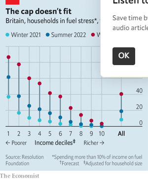  

#### 7.3 _Headline removed for your own safety:_ [Internet regulation](https://www.economist.com/britain/2022/05/25/britains-online-safety-bill-could-change-the-face-of-the-internet)  
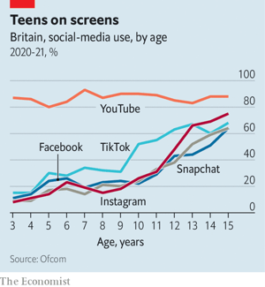  

#### 7.4 _Tweak and ye shall find:_ [Agricultural technology](https://www.economist.com/britain/2022/05/24/gene-edited-food-is-coming-to-britain)  

#### 7.5 _Retailer therapy:_ [Department stores](https://www.economist.com/britain/2022/05/26/what-john-lewiss-turnaround-says-about-the-british-high-street)  
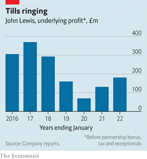  

#### 7.6 _Past tense:_ [The school curriculum](https://www.economist.com/britain/2022/05/26/a-new-history-curriculum-will-not-cool-the-culture-wars)  

#### 7.7 _Land of hops and glory:_ [The Platinum Jubilee](https://www.economist.com/britain/2022/05/26/britain-celebrates-a-jubilee-again)  

#### 7.8 _The useless machine:_ [Bagehot](https://www.economist.com/britain/2022/05/26/how-the-conservatives-became-an-opposition-in-government)  

### 8. United States
#### 8.1 _A senseless slaughter:_ [Another mass shooting](https://www.economist.com/united-states/2022/05/25/the-spate-of-gun-violence-shows-american-exceptionalism-at-its-worst)  

#### 8.2 _A slap for Trump:_ [Georgia primaries](https://www.economist.com/united-states/2022/05/25/two-republicans-whom-donald-trump-tried-to-oust-triumph-in-georgia)  

#### 8.3 _Live better:_ [Bentonville’s lessons](https://www.economist.com/united-states/2022/05/26/the-home-of-walmart-wants-to-beat-sprawl)  

#### 8.4 _The name game:_ [Labour unions](https://www.economist.com/united-states/2022/05/26/new-trade-unions-in-america-are-successfully-using-company-brands)  

#### 8.5 _Bordering on chaos:_ [Immigration policy](https://www.economist.com/united-states/2022/05/22/the-title-42-furore-highlights-americas-broken-immigration-system)  
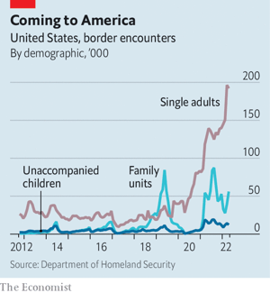  
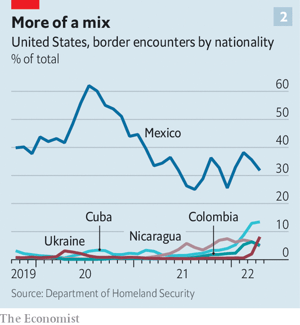  

#### 8.6 _Russians wanted, sort of:_ [The talent war](https://www.economist.com/united-states/2022/05/26/america-has-an-opportunity-to-lure-russias-tech-talent)  

#### 8.7 _Sex scandal and Southern Baptists:_ [Lexington](https://www.economist.com/united-states/2022/05/26/sex-scandal-and-southern-baptists)  

### 9. Middle East & Africa
#### 9.1 _Issaias’s army:_ [Eritrea](https://www.economist.com/middle-east-and-africa/2022/05/26/inside-eritrea-africas-gulag-state)  
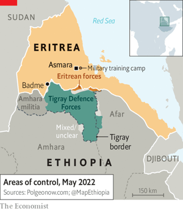  

#### 9.2 _Clicks and middlemen:_ [B2B startups](https://www.economist.com/middle-east-and-africa/2022/05/26/how-e-commerce-looks-different-in-africa)  

#### 9.3 _The new man tips the scales:_ [The United Arab Emirates](https://www.economist.com/middle-east-and-africa/2022/05/26/the-uaes-new-sheikh-may-jolt-both-succession-and-federation)  

#### 9.4 _Marriage markers:_ [Genomes in the Gulf](https://www.economist.com/middle-east-and-africa/2022/05/26/qatar-wants-to-become-a-leader-in-genomics)  

### 10. The Americas
#### 10.1 _The costs of inaction:_ [Colombia’s election](https://www.economist.com/the-americas/2022/05/26/a-divided-colombia-is-poised-to-elect-its-first-leftist-president)  
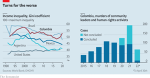  
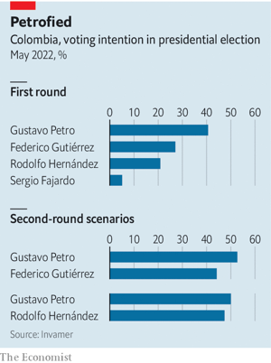  

#### 10.2 _The wealth of the Andes:_ [Bello](https://www.economist.com/the-americas/2022/05/26/a-test-of-whether-big-mining-is-socially-sustainable)  

### 11. Asia
#### 11.1 _Bargaining chip:_ [Semiconductors and strategy](https://www.economist.com/asia/2022/05/26/taiwan-is-worried-about-the-security-of-its-chip-industry)  
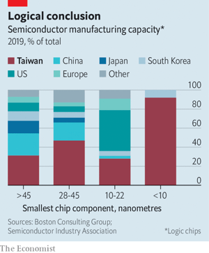  

#### 11.2 _Quiet comfort:_ [America and South Korea](https://www.economist.com/asia/2022/05/26/joe-biden-vows-to-deepen-americas-ties-with-south-korea)  

#### 11.3 _Chadchart topping:_ [Thai politics](https://www.economist.com/asia/2022/05/26/an-election-in-bangkok-heralds-an-optimistic-new-kind-of-politics)  

#### 11.4 _Avian idol:_ [Songbird competitions](https://www.economist.com/asia/2022/05/26/songbird-competitions-are-a-popular-pastime-in-indonesia)  

#### 11.5 _Political weather:_ [Australian politics](https://www.economist.com/asia/2022/05/26/australian-voters-have-had-enough-of-climate-inaction)  

#### 11.6 _Testing situation:_ [Education in India](https://www.economist.com/asia/2022/05/26/indias-exams-are-plagued-by-cheating)  

#### 11.7 _The Abe era:_ [Banyan](https://www.economist.com/asia/2022/05/26/abe-shinzo-still-looms-large-over-japan)  

### 12. China
#### 12.1 _How to see Xi:_ [Rumours and leadership struggles](https://www.economist.com/china/2022/05/26/rumours-emerge-of-disharmony-within-chinas-leadership)  

#### 12.2 _A timely reminder:_ [A leak from Xinjiang](https://www.economist.com/china/2022/05/26/hacked-files-reveal-more-details-about-chinese-abuses-in-xinjiang)  

#### 12.3 _Storming the fortress:_ [Unemployment](https://www.economist.com/china/2022/05/26/many-young-chinese-choose-graduate-school-over-a-grim-job-market)  
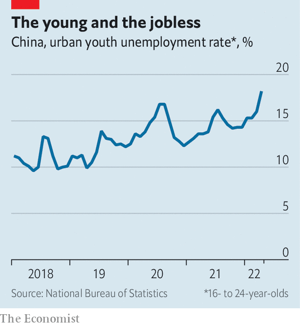  

#### 12.4 _No mercy:_ [Corruption](https://www.economist.com/china/2022/05/26/trouble-at-the-top-and-bottom-of-chinas-financial-sector)  

#### 12.5 _A generational divide:_ [Chaguan](https://www.economist.com/china/2022/05/26/chinas-intergenerational-divide)  

### 13. International
#### 13.1 _Spies like us:_ [Enforcing sanctions](https://www.economist.com/international/2022/05/24/anonymous-tipsters-angry-at-russia-help-detect-sanctions-busters)  

### 14. Special report
#### 14.1 _A partnership of unequals:_ [China in Africa](https://www.economist.com/special-report/2022/05/20/the-chinese-african-relationship-is-important-to-both-sides-but-also-unbalanced)  
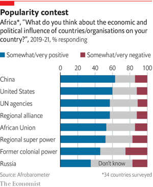  

#### 14.2 _Roads to somewhere:_ [Debt and infrastructure](https://www.economist.com/special-report/2022/05/20/chinese-loans-and-investment-in-infrastructure-have-been-huge)  
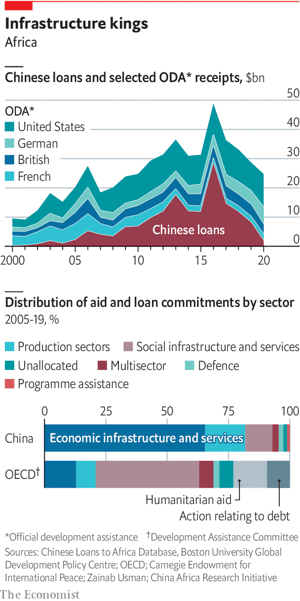  

#### 14.3 _With African characteristics:_ [Business and trade](https://www.economist.com/special-report/2022/05/20/how-chinese-firms-have-changed-africa)  

#### 14.4 _The price of friendship:_ [Political links](https://www.economist.com/special-report/2022/05/20/the-price-of-friendship)  

#### 14.5 _China, meet Fourth Estate:_ [The media](https://www.economist.com/special-report/2022/05/20/china-meet-fourth-estate)  

#### 14.6 _Ace of bases:_ [Defence co-operation](https://www.economist.com/special-report/2022/05/20/ace-of-bases)  
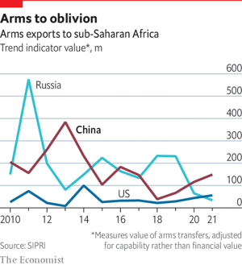  

#### 14.7 _Countering China in Africa:_ [The future](https://www.economist.com/special-report/2022/05/20/countering-china-in-africa)  

#### 14.8 _Sources and acknowledgments:_ [China in Africa](https://www.economist.com/special-report/2022/05/26/sources-and-acknowledgments)  

### 15. Business
#### 15.1 _Secret sauce:_ [Swiss business](https://www.economist.com/business/2022/05/23/the-recipe-for-the-outperformance-of-swiss-businesses)  
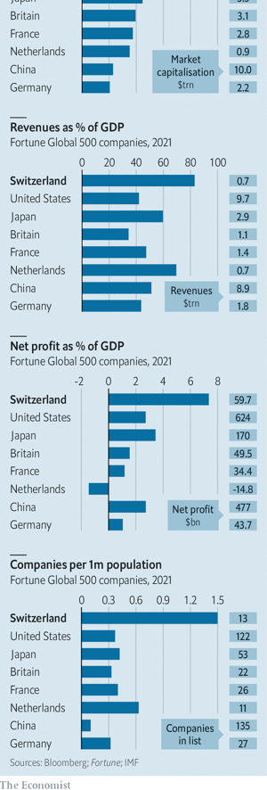  
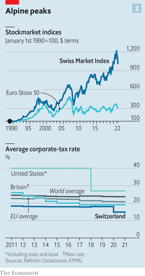  

#### 15.2 _Postcard from a world on edge:_ [The World Economic Forum](https://www.economist.com/business/2022/05/26/is-this-the-end-of-davos-man)  

#### 15.3 _Broader still:_ [Technology](https://www.economist.com/business/2022/05/26/will-a-chipmaking-giants-60bn-bet-on-software-pay-off)  

#### 15.4 _The power of small gestures:_ [Bartleby](https://www.economist.com/business/2022/05/26/the-power-of-small-gestures)  

#### 15.5 _A taste of things to come:_ [Foodmaking](https://www.economist.com/business/2022/05/25/plant-based-proteins-are-no-longer-a-side-dish-in-diets)  
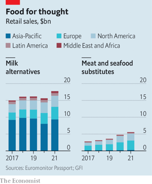  

#### 15.6 _Chemical hazard warning:_ [Schumpeter](https://www.economist.com/business/2022/05/26/basfs-plan-to-wean-itself-off-cheap-russian-gas-comes-with-pitfalls)  

### 16. Finance & economics
#### 16.1 _Empty promises:_ [China’s financial markets](https://www.economist.com/finance-and-economics/2022/05/22/foreign-investors-are-fleeing-china)  
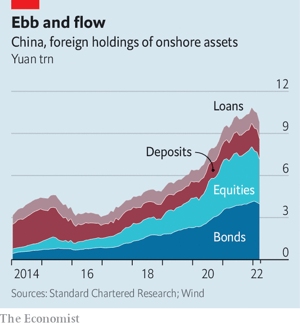  
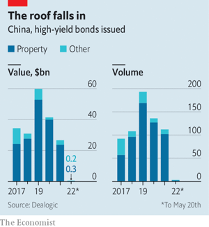  

#### 16.2 _A new pact for Asia:_ [The Indo-Pacific economy](https://www.economist.com/finance-and-economics/2022/05/24/americas-new-asian-economic-pact-just-dont-call-it-a-trade-deal)  

#### 16.3 _Home run:_ [Housing markets](https://www.economist.com/finance-and-economics/2022/05/25/wall-streets-housing-grab-continues)  
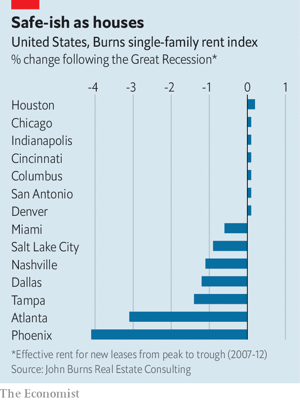  

#### 16.4 _Bloody but unbowed:_ [Corporate debt](https://www.economist.com/finance-and-economics/2022/05/26/the-credit-market-hasnt-cracked-yet)  
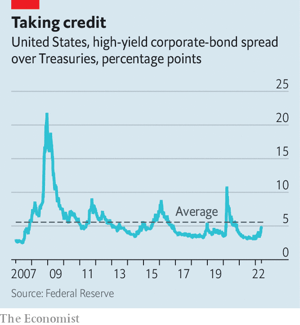  

#### 16.5 _Up in the air:_ [Carbon trading](https://www.economist.com/finance-and-economics/2022/05/26/carbon-markets-are-going-global)  
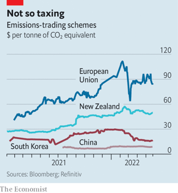  

#### 16.6 _The ties that bind:_ [Free exchange](https://www.economist.com/finance-and-economics/2022/05/25/how-economic-interdependence-fosters-alliances-and-democracy)  

### 17. Science & technology
#### 17.1 _Life, but not as we know it:_ [Astrobiology](https://www.economist.com/science-and-technology/2022/05/25/how-to-improve-the-search-for-aliens)  

#### 17.2 _A close-run thing:_ [Gene banks](https://www.economist.com/science-and-technology/2022/05/25/ukraines-agricultural-research-is-threatened-by-the-war)  

#### 17.3 _The spread of monkeypox:_ [A new outbreak of disease](https://www.economist.com/science-and-technology/2022/05/25/the-spread-of-monkeypox)  

### 18. Culture
#### 18.1 _The rest is history:_ [Archaeology in Turkey](https://www.economist.com/culture/2022/05/25/turkeys-temple-mounds-illuminate-the-birth-of-civilisation)  

#### 18.2 _By the noses:_ [Aroma therapies](https://www.economist.com/culture/2022/05/25/the-ingenuity-of-plants-and-people-lies-behind-fragrances)  

#### 18.3 _The living and the dead:_ [Urban adventures](https://www.economist.com/culture/2022/05/26/the-charm-and-peril-of-naples)  

#### 18.4 _Handlebars of history:_ [The glory of cycling](https://www.economist.com/culture/2022/05/26/the-bicycle-is-humanitys-most-underrated-invention)  

#### 18.5 _Shark bait:_ [Pirate lives](https://www.economist.com/culture/2022/05/26/a-merry-life-and-a-short-one-the-pirate-motto-was-half-true)  

#### 18.6 _Talk to him, Goose:_ [Back Story](https://www.economist.com/culture/2022/05/26/top-gun-maverick-feels-the-need-to-speed-into-the-past)  

### 19. Economic & financial indicators
#### 19.1 _Economic data, commodities and markets:_ [Indicators](https://www.economist.com/economic-and-financial-indicators/2022/05/26/economic-data-commodities-and-markets)  

### 20. Graphic detail
#### 20.1 _From Main Street to Wall Street:_ [Stimulus and stockmarkets](https://www.economist.com/graphic-detail/2022/05/26/stimulus-cheques-have-buoyed-americas-stockmarket)  

### 21. Obituary
#### 21.1 _The barefoot laird:_ [Lawrence MacEwen](https://www.economist.com/obituary/2022/05/26/lawrence-macewen-made-a-tiny-island-prosper)  

