### 1. The world this week
#### 1.1 [Politics](https://www.economist.com/the-world-this-week/2022/06/02/politics)

#### 1.2 [Business](https://www.economist.com/the-world-this-week/2022/06/02/business)
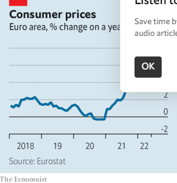  

#### 1.3 [KAL’s cartoon](https://www.economist.com/the-world-this-week/2022/06/02/kals-cartoon)
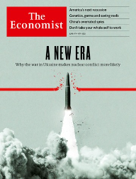  

### 2. Leaders
#### 2.1 _A new nuclear era:_ [Atomic weapons](https://www.economist.com/leaders/2022/06/02/a-new-nuclear-era)  

#### 2.2 _America’s next recession:_ [The world economy](https://www.economist.com/leaders/2022/06/02/a-recession-in-america-by-2024-looks-likely)  
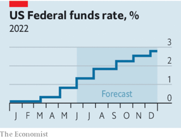  

#### 2.3 _Into the unknown:_ [Colombia](https://www.economist.com/leaders/2022/06/02/two-erratic-presidential-candidates-put-colombia-at-risk)  

#### 2.4 _Surmounting great barriers:_ [Climate change and coral reefs](https://www.economist.com/leaders/2022/06/02/those-in-peril-in-the-sea)  

#### 2.5 _Put out more bunting:_ [The Platinum Jubilee](https://www.economist.com/leaders/2022/06/02/the-significance-of-the-platinum-jubilee)  

### 3. Letters
#### 3.1 _On electoral reform, wearable devices, India, business and pleasure:_ [Letters](https://www.economist.com/letters/2022/06/02/letters-to-the-editor)  

### 4. By Invitation
#### 4.1 _Recep Tayyip Erdogan on NATO expansion:_ [Russia and Ukraine](https://www.economist.com/by-invitation/2022/05/30/recep-tayyip-erdogan-on-nato-expansion)  

#### 4.2 _The German chancellor may be turning a corner, says Thorsten Benner:_ [Germany and Ukraine](https://www.economist.com/by-invitation/2022/06/01/the-german-chancellor-may-be-turning-a-corner-says-thorsten-benner)  

### 5. Briefing
#### 5.1 _Thinking the unthinkable:_ [The nuclear taboo](https://www.economist.com/briefing/2022/06/02/russias-invasion-of-ukraine-has-eroded-the-nuclear-taboo)  
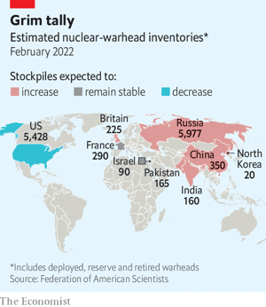  

### 6. Europe
#### 6.1 _The battle for Severodonetsk:_ [War in Ukraine](https://www.economist.com/europe/2022/05/31/russia-threatens-to-capture-severodonetsk)  
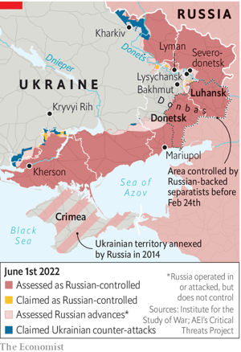  

#### 6.2 _Tragedy on Shakespeare Street:_ [Kharkiv](https://www.economist.com/europe/2022/06/02/how-war-has-changed-ukraines-second-city)  

#### 6.3 _Getting the upgrade:_ [American weapons](https://www.economist.com/europe/2022/06/01/america-sends-advanced-missiles-to-help-ukraine-fend-off-russia)  

#### 6.4 _The reluctant giant:_ [Germany and Ukraine](https://www.economist.com/europe/2022/05/31/olaf-scholzs-dithering-is-damaging-germanys-international-image)  

#### 6.5 _For hedgehogs, not road hogs:_ [Wildlife crossings](https://www.economist.com/europe/2022/06/02/france-is-building-overpasses-to-reduce-roadkill)  

#### 6.6 _Squabbling in unison:_ [Charlemagne](https://www.economist.com/europe/2022/06/02/europe-is-squabbling-but-remains-united-where-it-really-matters)  

### 7. Britain
#### 7.1 _Separation anxiety:_ [The Supreme Court](https://www.economist.com/britain/2022/06/02/britains-supreme-court-takes-a-conservative-turn)  
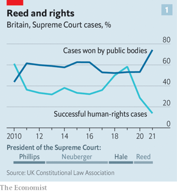  
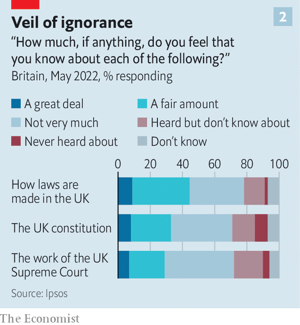  

#### 7.2 _What changed?:_ [Boris Johnson’s future](https://www.economist.com/britain/2022/06/01/boris-johnsons-position-is-looking-precarious)  

#### 7.3 _Beauty mixed with commerce:_ [Market halls](https://www.economist.com/britain/2022/06/02/the-fall-and-rise-of-the-british-market-hall)  

#### 7.4 _Youth offender, adult criminal:_ [Criminal justice](https://www.economist.com/britain/2022/06/02/an-18th-birthday-is-bad-news-for-children-awaiting-trial)  
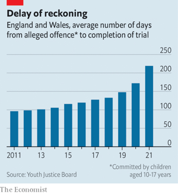  

#### 7.5 _Gridlocked:_ [Electrification](https://www.economist.com/britain/2022/06/02/britains-overstretched-electricity-grid-is-delaying-housing-projects)  

#### 7.6 _Business as flusual:_ [A post-pandemic thought experiment](https://www.economist.com/britain/2022/05/30/what-if-the-flu-were-treated-more-like-covid-not-the-other-way-round)  
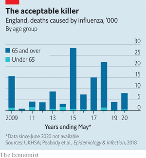  

### 8. United States
#### 8.1 _The not-so-super market:_ [Food retailers](https://www.economist.com/united-states/2022/06/02/why-americans-are-poorly-served-by-their-grocery-stores)  
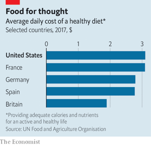  

#### 8.2 _Mall makeovers:_ [New uses for old stores](https://www.economist.com/united-states/2022/06/02/changing-shopping-habits-are-transforming-americas-malls)  

#### 8.3 _Hey, big spender:_ [California primaries](https://www.economist.com/united-states/2022/06/02/las-mayoral-race-may-reveal-the-limits-of-progressive-politics)  

#### 8.4 _The religious majority:_ [Pro-choice clergy](https://www.economist.com/united-states/2022/06/02/the-many-clergy-in-america-who-support-abortion-rights)  

#### 8.5 _Adjusting their sights:_ [Gun advocates](https://www.economist.com/united-states/2022/06/02/gun-groups-have-their-own-ideas-for-preventing-mass-shootings)  

#### 8.6 _Policing differently:_ [First responders](https://www.economist.com/united-states/2022/05/29/since-george-floyds-murder-new-ways-of-policing-have-been-spreading)  

#### 8.7 _The zombie nuclear deal:_ [Lexington](https://www.economist.com/united-states/2022/06/02/the-zombie-nuclear-deal)  

### 9. Middle East & Africa
#### 9.1 _Better luck this time:_ [Somalia](https://www.economist.com/middle-east-and-africa/2022/06/02/somalias-new-president-vows-to-beat-back-jihadists-then-talk-to-them)  
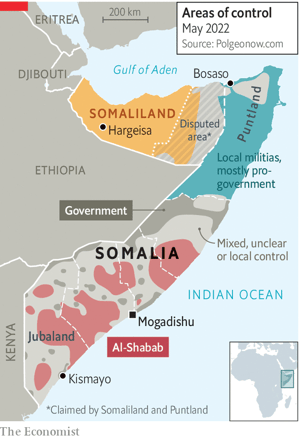  

#### 9.2 _Roads to hell:_ [Congo, Rwanda and Uganda](https://www.economist.com/middle-east-and-africa/2022/06/02/men-with-guns-disrupt-a-plan-to-link-congo-to-east-africa)  
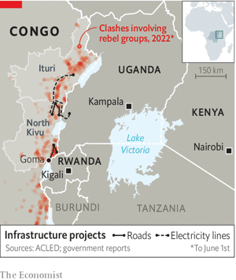  

#### 9.3 _Inequality before the law:_ [Criminal justice in Kenya](https://www.economist.com/middle-east-and-africa/2022/06/02/how-kenyan-courts-benefit-the-mighty-and-punish-the-needy)  

#### 9.4 _More than just business buddies:_ [Israel and Morocco](https://www.economist.com/middle-east-and-africa/2022/06/02/israeli-firms-and-tourists-are-piling-into-morocco)  

### 10. The Americas
#### 10.1 _Fight the power company:_ [Peru](https://www.economist.com/the-americas/2022/06/02/a-peruvian-farmer-takes-on-germanys-largest-electricity-firm)  
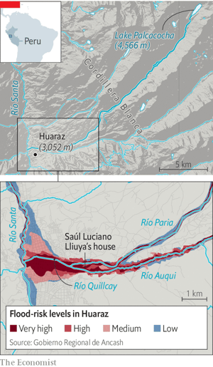  

#### 10.2 _The great rain robbery:_ [Adapting to climate change](https://www.economist.com/the-americas/2022/06/02/why-peruvian-villagers-tore-down-a-flood-warning-system)  

#### 10.3 _A change is gonna come:_ [Colombia](https://www.economist.com/the-americas/2022/06/02/a-leftist-ex-guerrilla-and-a-populist-face-off-for-the-colombian-presidency)  

### 11. Asia
#### 11.1 _Interfering Imran:_ [Pakistani politics](https://www.economist.com/asia/2022/06/02/imran-khan-is-jeopardising-pakistans-attempts-to-fix-its-economy)  
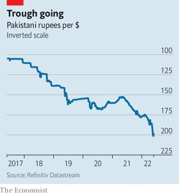  

#### 11.2 _The rights of one man:_ [Kazakhstan](https://www.economist.com/asia/2022/06/02/kazakhstani-voters-may-revoke-their-ex-presidents-vast-privileges)  

#### 11.3 _Powering up:_ [Gaming in Asia](https://www.economist.com/asia/2022/06/02/chinas-e-sports-players-are-challenging-south-koreas-dominance)  

#### 11.4 _Knock-on effects:_ [The Philippines](https://www.economist.com/asia/2022/06/02/rodrigo-dutertes-drug-war-pushed-poor-families-deeper-into-penury)  

#### 11.5 _Steaming ahead:_ [Climate targets](https://www.economist.com/asia/2022/06/02/vietnam-is-leading-the-transition-to-clean-energy-in-south-east-asia)  
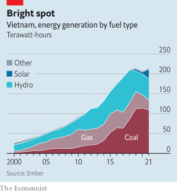  

#### 11.6 _Incredible hulks:_ [Banyan](https://www.economist.com/asia/2022/06/02/the-luxury-of-asias-malls-is-no-substitute-for-genuine-public-spaces)  

### 12. China
#### 12.1 _Imperfect spies:_ [Chinese intelligence](https://www.economist.com/china/2022/06/01/chinas-spies-are-not-always-as-good-as-advertised)  

#### 12.2 _Treasured islands:_ [China in the Pacific](https://www.economist.com/china/2022/06/02/chinas-interest-in-the-pacific-islands-is-growing)  

#### 12.3 _Down with the tyrants:_ [Sand demand](https://www.economist.com/china/2022/06/02/chinas-war-over-sand)  

#### 12.4 _Xi bans grumbling by party elders:_ [Chaguan](https://www.economist.com/china/2022/06/02/xi-jinping-bans-grumbling-inside-the-communist-party)  

### 13. International
#### 13.1 _Survival of the bookish:_ [Education and climate](https://www.economist.com/international/2022/06/01/climate-change-is-harder-on-less-educated-people)  
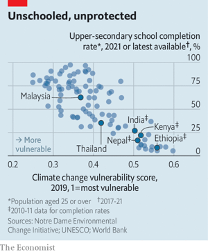  

### 14. Business
#### 14.1 _On her CEO’s secret service:_ [Corporate espionage](https://www.economist.com/business/2022/05/30/corporate-espionage-is-entering-a-new-era)  

#### 14.2 _Patent aggression:_ [Business in Russia](https://www.economist.com/business/2022/06/02/has-russia-legalised-intellectual-property-theft)  

#### 14.3 _Leaning out:_ [A shake-up at Meta](https://www.economist.com/business/2022/06/02/sheryl-sandberg-metas-second-in-command-leaves-the-embattled-firm)  

#### 14.4 _“Top Gun” takes off:_ [The movies](https://www.economist.com/business/2022/06/02/top-gun-flies-high-sparking-hopes-of-a-theatrical-recovery)  
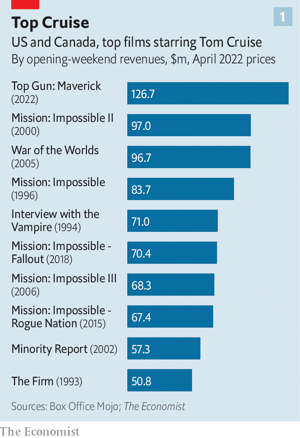  
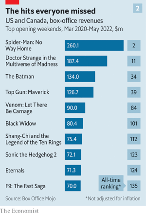  
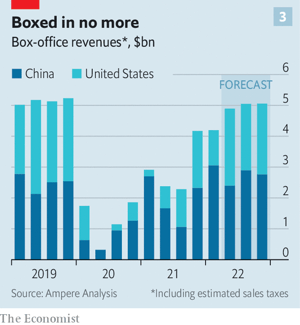  

#### 14.5 _Hire hurdles:_ [Digital labour](https://www.economist.com/business/2022/06/02/is-big-techs-red-hot-jobs-market-about-to-cool)  

#### 14.6 _Your whole self:_ [Bartleby](https://www.economist.com/business/2022/06/02/do-not-bring-your-whole-self-to-work)  

#### 14.7 _Powerless proxies:_ [Schumpeter](https://www.economist.com/business/2022/06/02/why-proxy-advisers-are-losing-their-power)  

### 15. Finance & economics
#### 15.1 _The shape of things to come:_ [Recession watch](https://www.economist.com/finance-and-economics/2022/06/01/what-americas-next-recession-will-look-like)  
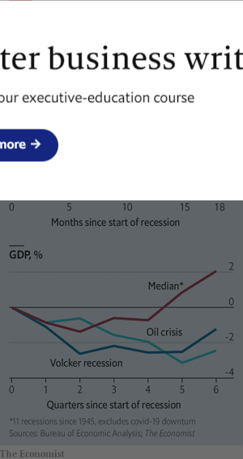  
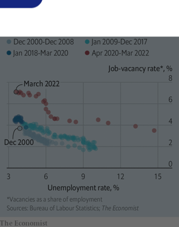  

#### 15.2 _Crude calculations:_ [Oil prices](https://www.economist.com/finance-and-economics/2022/05/31/why-the-oil-price-is-spiking-again)  

#### 15.3 _Growth v debt:_ [China’s economy](https://www.economist.com/finance-and-economics/2022/06/02/chinas-dilemma-over-a-curious-breed-of-financial-firm)  

#### 15.4 _Balance of payments:_ [Consumer spending](https://www.economist.com/finance-and-economics/2022/05/29/the-changing-american-consumer)  
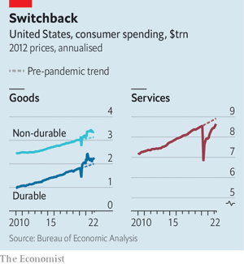  

#### 15.5 _The inventory cycle returns:_ [Buttonwood](https://www.economist.com/finance-and-economics/2022/06/02/the-return-of-the-inventory-cycle)  

#### 15.6 _Red elephants?:_ [Free exchange](https://www.economist.com/finance-and-economics/2022/06/02/should-china-spend-more-on-infrastructure)  

### 16. Science & technology
#### 16.1 _Reef knots:_ [Conservation](https://www.economist.com/science-and-technology/2022/06/01/corals-are-threatened-by-global-warming)  
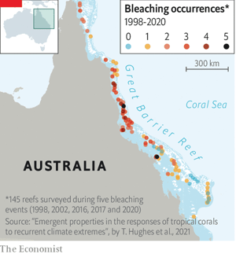  

#### 16.2 _Like father, like son?:_ [Testosterone and family life](https://www.economist.com/science-and-technology/2022/06/01/fatherless-sons-have-more-testosterone)  

#### 16.3 _O for the wings of an albatross:_ [Aerodynamics](https://www.economist.com/science-and-technology/2022/06/01/borrowing-tricks-from-birds-may-result-in-smoother-flights)  

#### 16.4 _Froggie went a sportin’:_ [Conserving amphibians](https://www.economist.com/science-and-technology/2022/06/01/the-health-giving-benefits-of-jacuzzis-for-frogs)  

### 17. Culture
#### 17.1 _The new ventriloquists:_ [Live music](https://www.economist.com/culture/2022/05/27/abba-and-the-rise-of-the-work-from-home-rock-star)  

#### 17.2 _Stuck in the middle with you:_ [Intermediaries](https://www.economist.com/culture/2022/06/02/the-problems-with-complex-supply-chains)  

#### 17.3 _Desperate straits:_ [New American fiction](https://www.economist.com/culture/2022/06/02/nightcrawling-is-a-gritty-accomplished-debut-novel)  

#### 17.4 _Music for procrastinators:_ [Buddhist bubblegum](https://www.economist.com/culture/2022/06/02/arthur-russell-was-an-indecisive-brilliant-composer)  

#### 17.5 _No place like home:_ [Banishment](https://www.economist.com/culture/2022/06/02/the-story-of-three-19th-century-dissidents-sent-into-exile)  

#### 17.6 _Family matters:_ [Johnson](https://www.economist.com/culture/2022/06/02/some-languages-pay-closer-attention-to-family-ties-than-others)  

### 18. Economic & financial indicators
#### 18.1 _Economic data, commodities and markets:_ [Indicators](https://www.economist.com/economic-and-financial-indicators/2022/06/02/economic-data-commodities-and-markets)  

### 19. Graphic detail
#### 19.1 _Beating the bounds:_ [Gerrymandering in America](https://www.economist.com/graphic-detail/2022/06/02/americas-congressional-maps-are-a-bit-fairer-than-a-decade-ago)  

### 20. The Economist explains
#### 20.1 _Why this Atlantic hurricane season is predicted to be unusually stormy:_ [The Economist explains](https://www.economist.com/the-economist-explains/2022/06/01/why-this-atlantic-hurricane-season-is-predicted-to-be-unusually-stormy)  

#### 20.2 _Why fertiliser prices are soaring:_ [The Economist explains](https://www.economist.com/the-economist-explains/2022/05/31/why-fertiliser-prices-are-soaring)  
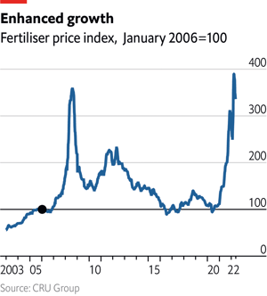  
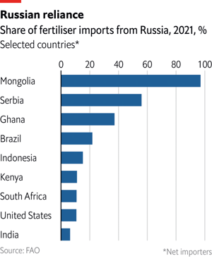  

### 21. Obituary
#### 21.1 _To ride, to win:_ [Lester Piggott](https://www.economist.com/obituary/2022/06/02/lester-piggott-had-only-one-aim-in-view)  

