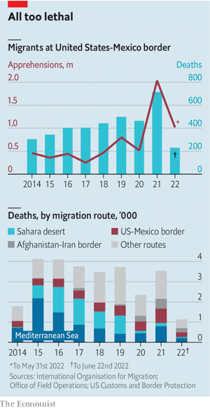
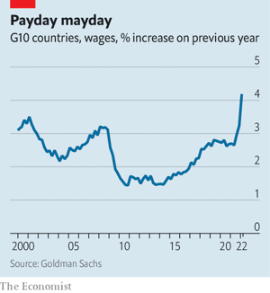

### 1. The world this week
#### 1.1 [Politics](https://www.economist.com/the-world-this-week/2022/06/30/politics)

#### 1.2 [Business](https://www.economist.com/the-world-this-week/2022/06/30/business)

#### 1.3 [KAL’s cartoon](https://www.economist.com/the-world-this-week/2022/06/30/kals-cartoon)
  

### 2. Leaders
#### 2.1 [How to win the long war](https://www.economist.com/leaders/2022/06/30/how-to-win-ukraines-long-war)

#### 2.2 [After the shattering of Roe](https://www.economist.com/leaders/2022/06/29/the-supreme-courts-judicial-activism-will-deepen-cracks-in-america)

#### 2.3 [The reckoning](https://www.economist.com/leaders/2022/06/30/venture-capitals-reckoning)
  

#### 2.4 [A new order in Asia](https://www.economist.com/leaders/2022/06/30/the-biggest-risks-to-singapores-primacy-in-asian-finance-are-at-home)

#### 2.5 [Mexico’s shame](https://www.economist.com/leaders/2022/06/30/staggering-numbers-of-mexicans-are-vanishing-heres-how-to-save-them)

### 3. Letters
#### 3.1 [On artificial intelligence, greener buildings, inventory cycles, the subjunctive, cheap wine](https://www.economist.com/letters/2022/06/30/letters-to-the-editor)

### 4. By Invitation
#### 4.1 [Linda Thomas-Greenfield believes the UN Security Council should make better use of technology](https://www.economist.com/by-invitation/2022/06/28/linda-thomas-greenfield-believes-the-un-security-council-should-make-better-use-of-technology)

#### 4.2 [John Barrasso wants America to lead the world in nuclear energy](https://www.economist.com/by-invitation/2022/06/30/john-barrasso-wants-america-to-lead-the-world-in-nuclear-energy)

### 5. Briefing
#### 5.1 [On and on](https://www.economist.com/briefing/2022/06/30/does-a-protracted-conflict-favour-russia-or-ukraine)
  
  

### 6. Europe
#### 6.1 [Back in business](https://www.economist.com/europe/2022/06/26/nato-holds-its-most-important-summit-for-decades)
  

#### 6.2 [Nest of vipers](https://www.economist.com/europe/2022/06/27/the-battle-for-snake-island)
  

#### 6.3 [The quiet German](https://www.economist.com/europe/2022/06/30/chancellor-olaf-scholz-takes-taciturnity-to-new-levels)

#### 6.4 [Changing friends](https://www.economist.com/europe/2022/06/30/the-war-is-forcing-russias-balkan-friends-to-recalibrate)

#### 6.5 [Jacket, tie, nationalism](https://www.economist.com/europe/2022/06/30/fresh-faces-on-the-far-right-and-left-fill-frances-parliament)

#### 6.6 [The Poles’ position](https://www.economist.com/europe/2022/06/30/poland-is-being-given-an-opportunity-to-matter-in-europe)

### 7. Britain
#### 7.1 [Under the deep green sea](https://www.economist.com/britain/2022/06/30/the-north-sea-has-fuelled-britain-for-50-years-what-next)
  

#### 7.2 [Getting picky](https://www.economist.com/britain/2022/06/30/which-vegetable-is-the-easiest-for-a-robot-to-pick)

#### 7.3 [The neverendum](https://www.economist.com/britain/2022/06/29/nicola-sturgeon-sets-a-date-for-another-referendum-on-scottish-independence)

#### 7.4 [Home economics](https://www.economist.com/britain/2022/06/30/british-child-care-is-expensive)
  

#### 7.5 [Another blow for the Met](https://www.economist.com/britain/2022/06/30/the-metropolitan-police-is-put-into-special-measures)
  

#### 7.6 [Vanishing Londoners](https://www.economist.com/britain/2022/06/30/inner-londons-population-is-much-lower-than-expected)
  

#### 7.7 [Boots off](https://www.economist.com/britain/2022/06/30/boots-is-an-iconic-british-brand-that-no-one-really-wants)

#### 7.8 [Boz and Jez](https://www.economist.com/britain/2022/06/30/the-parallels-between-boris-johnson-and-jeremy-corbyn)

### 8. United States
#### 8.1 [The fallout from overturning Roe](https://www.economist.com/united-states/2022/06/26/the-fallout-from-overturning-roe)
  

#### 8.2 [An end-of-term report](https://www.economist.com/united-states/2022/06/30/scotus-an-end-of-term-report)

#### 8.3 [Win one, lose one](https://www.economist.com/united-states/2022/06/30/america-moves-in-conflicting-directions-on-gun-laws)

#### 8.4 [Where have all the lifeguards gone?](https://www.economist.com/united-states/2022/06/30/where-have-all-the-lifeguards-gone)

#### 8.5 [Questions of trust](https://www.economist.com/united-states/2022/06/28/trump-truthers-are-vying-to-run-americas-local-elections)
  

#### 8.6 [A tragedy in Texas](https://www.economist.com/united-states/2022/06/30/the-deaths-of-53-people-in-texas-highlight-the-perils-of-migration)
  

#### 8.7 [The courage of a conservative](https://www.economist.com/united-states/2022/06/30/the-courage-of-cassidy-hutchinson)

### 9. Middle East & Africa
#### 9.1 [Echoes of war](https://www.economist.com/middle-east-and-africa/2022/06/30/a-resurgence-of-regional-rivalries-imperils-eastern-congo)
  

#### 9.2 [Digital stevedores](https://www.economist.com/middle-east-and-africa/2022/06/30/africas-mobile-money-agents-face-an-uncertain-future)

#### 9.3 [One shield to guard them all?](https://www.economist.com/middle-east-and-africa/2022/06/30/israels-unexpected-military-alliance-in-the-gulf)

#### 9.4 [Safer at last](https://www.economist.com/middle-east-and-africa/2022/06/30/the-un-will-finally-defuse-a-floating-bomb-in-the-red-sea)
  

#### 9.5 [The great moustache comeback](https://www.economist.com/middle-east-and-africa/2022/06/30/why-iraqi-moustaches-are-making-a-comeback)

### 10. The Americas
#### 10.1 [100,000 missing Mexicans](https://www.economist.com/the-americas/2022/06/30/at-least-100000-people-are-missing-in-mexico)
  
  

#### 10.2 [Rain strain](https://www.economist.com/the-americas/2022/06/30/more-brazilians-are-dying-in-floods-and-downpours)
  

### 11. Asia
#### 11.1 [Open and shut](https://www.economist.com/asia/2022/06/30/resentment-of-rich-foreigners-complicates-singapores-politics)

#### 11.2 [On the edge](https://www.economist.com/asia/2022/06/30/will-laos-default-on-its-debt)
  

#### 11.3 [Feeling the chill](https://www.economist.com/asia/2022/06/30/india-arrests-two-opponents-of-the-government)

#### 11.4 [Indomitable valley](https://www.economist.com/asia/2022/06/30/resistance-to-the-taliban-resumes-in-north-eastern-afghanistan)

#### 11.5 [Memory loss](https://www.economist.com/asia/2022/06/29/by-electing-another-marcos-filipinos-show-they-have-forgotten-history)

### 12. China
#### 12.1 [Three steps to heaven](https://www.economist.com/china/2022/06/30/some-chinese-want-their-country-to-move-closer-to-communism)

#### 12.2 [Low school](https://www.economist.com/china/2022/06/30/china-is-improving-its-human-capital-gradually)
  

#### 12.3 [Holes in the great firewall](https://www.economist.com/china/2022/06/28/as-censorship-in-china-increases-vpns-are-becoming-more-important)

#### 12.4 [Speakeasies v snitches](https://www.economist.com/china/2022/06/30/getting-around-covid-controls-in-shanghai)

### 13. International
#### 13.1 [Severe complications](https://www.economist.com/international/2022/06/30/around-the-world-bans-do-not-make-abortion-much-rarer)
  
  
  

### 14. Business
#### 14.1 [The great Silicon Valley shake-out](https://www.economist.com/business/2022/06/28/the-great-silicon-valley-shake-out)
  
  
  
  
  

#### 14.2 [The VC-industrial complex](https://www.economist.com/business/2022/06/27/the-rise-of-chinas-vc-industrial-complex)
  
  

#### 14.3 [A concoction a day](https://www.economist.com/business/2022/06/30/the-pandemic-is-boosting-sellers-of-traditional-medicine)
  

#### 14.4 [The Sakhalin exception](https://www.economist.com/business/2022/06/30/japanese-energy-firms-cling-on-to-their-russian-assets)

#### 14.5 [Beach reads for business folk](https://www.economist.com/business/2022/06/30/beach-reads-for-business-folk)

#### 14.6 [Mars unwrapped](https://www.economist.com/business/2022/06/30/mars-inc-gets-the-purpose-v-profit-balance-right)

### 15. Finance & economics
#### 15.1 [A tale of three cities](https://www.economist.com/finance-and-economics/2022/06/29/the-battle-between-asias-financial-centres-is-heating-up)
  
  

#### 15.2 [Power outrage](https://www.economist.com/finance-and-economics/2022/06/30/can-europe-keep-the-lights-on-this-winter)
  

#### 15.3 [The top of the hill](https://www.economist.com/finance-and-economics/2022/06/26/why-inflation-looks-likely-to-stay-above-the-pre-pandemic-norm)
  
  

#### 15.4 [The price of accuracy](https://www.economist.com/finance-and-economics/2022/06/30/inflation-in-america-soars-to-8-or-is-it-more-like-6)
  

#### 15.5 [Creeping controls](https://www.economist.com/finance-and-economics/2022/06/30/the-latest-desperate-attempt-to-prop-up-the-turkish-lira)

#### 15.6 [Sweet dealmaking](https://www.economist.com/finance-and-economics/2022/06/30/the-allure-of-betting-on-mergers)

#### 15.7 [Terms of surrender](https://www.economist.com/finance-and-economics/2022/06/30/what-past-market-crashes-have-looked-like)

#### 15.8 [Forward misguidance](https://www.economist.com/finance-and-economics/2022/06/30/the-case-for-strong-and-silent-central-banks)

### 16. Science & technology
#### 16.1 [Butterflies of the soul](https://www.economist.com/science-and-technology/2022/06/29/how-neurons-really-work-is-being-elucidated)
  

#### 16.2 [Smell you later, alligator](https://www.economist.com/science-and-technology/2022/06/24/friends-smell-like-one-another)

#### 16.3 [A little something in the bank](https://www.economist.com/science-and-technology/2022/06/29/people-bank-blood-why-not-faeces)

### 17. Culture
#### 17.1 [No more “Swan Lake”](https://www.economist.com/culture/2022/06/30/a-ukrainian-ballerina-goes-to-war)

#### 17.2 [The pity of tiny feet](https://www.economist.com/culture/2022/06/30/a-transfixing-tale-of-motherhood-and-friendship)

#### 17.3 [Warning from hell](https://www.economist.com/culture/2022/06/30/rudolf-vrba-escaped-from-auschwitz-to-warn-the-world)

#### 17.4 [Power to the people](https://www.economist.com/culture/2022/06/30/a-wise-manifesto-for-digital-democracy)

#### 17.5 [Eyes wide shut](https://www.economist.com/culture/2022/06/30/michael-armitage-tells-urgent-stories-in-art)

#### 17.6 [The miracle of writing](https://www.economist.com/culture/2022/06/30/the-everyday-miracle-of-writing)

### 18. Economic & financial indicators
#### 18.1 [Economic data, commodities and markets](https://www.economist.com/economic-and-financial-indicators/2022/06/30/economic-data-commodities-and-markets)
  
  
  
  

### 19. Graphic detail
#### 19.1 [Quotas on it](https://www.economist.com/graphic-detail/2022/06/30/young-children-may-benefit-from-having-more-male-teachers)
  
  
  

### 20. The Economist explains
#### 20.1 [How consumer drones are changing warfare](https://www.economist.com/the-economist-explains/2022/06/29/how-consumer-drones-are-changing-warfare)

#### 20.2 [Why Britain is extending controversial tariffs on steel](https://www.economist.com/the-economist-explains/2022/06/29/why-britain-is-extending-controversial-tariffs-on-imported-steel)

### 21. Obituary
#### 21.1 [King of cocaine](https://www.economist.com/obituary/2022/06/30/gilberto-rodriguez-orejuela-once-ran-80-of-the-world-cocaine-market)

