### 1. The world this week
#### 1.1 [Politics](https://www.economist.com/the-world-this-week/2022/07/07/politics)

#### 1.2 [Business](https://www.economist.com/the-world-this-week/2022/07/07/business)
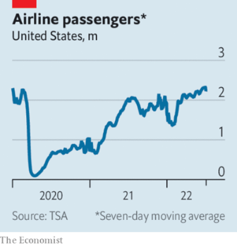  

#### 1.3 [KAL’s cartoon](https://www.economist.com/the-world-this-week/2022/07/07/kals-cartoon)
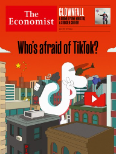  

### 2. Leaders
#### 2.1 _| Britain after Boris Johnson:_ [Boris Johnson should go immediately](https://www.economist.com/leaders/2022/07/07/boris-johnson-should-go-immediately)  
Britain is in a dangerous state  

#### 2.2 _| Social media and security:_ [Who’s afraid of TikTok?](https://www.economist.com/leaders/2022/07/07/whos-afraid-of-tiktok)  
The world’s most exciting app is also its most mistrusted  

#### 2.3 _| After Roe:_ [America’s new exceptionalism](https://www.economist.com/leaders/2022/07/07/americas-new-exceptionalism)  
America has a set of laws on important subjects that do not reflect the views of Americans  

#### 2.4 _| Crisis in the classroom:_ [Governments are ignoring the pandemic’s disastrous effect on education](https://www.economist.com/leaders/2022/07/07/governments-are-ignoring-the-pandemics-disastrous-effect-on-education)  
Neglected pupils will suffer for the rest of their lives  

#### 2.5 _| Private equity:_ [Why leveraged buy-outs are in trouble](https://www.economist.com/leaders/2022/07/07/why-leveraged-buy-outs-are-in-trouble)  
This downturn won’t be like the last one  
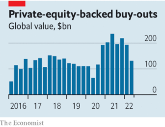  

#### 2.6 _| Magna mistake:_ [Voters should reject Chile’s new draft constitution](https://www.economist.com/leaders/2022/07/06/voters-should-reject-chiles-new-draft-constitution)  
It is a fiscally irresponsible left-wing wish list  

### 3. Letters
#### 3.1 _| On justice services, abortion, Africa, car dealers, Turkey, BTS, technology at work:_ [Letters to the editor](https://www.economist.com/letters/2022/07/07/letters-to-the-editor)  
A selection of correspondence  

### 4. By Invitation
#### 4.1 _| Russia and Ukraine:_ [Boris Bondarev on Vladimir Putin’s craven diplomats](https://www.economist.com/by-invitation/2022/07/02/boris-bondarev-on-vladimir-putins-craven-diplomats)  
And why the war in Ukraine drove him to resign from Russia’s UN team in Geneva  

#### 4.2 _| Finance:_ [The global economy needs to be better prepared for the coming storm, says Kathryn Judge](https://www.economist.com/by-invitation/2022/07/07/the-global-economy-needs-to-be-better-prepared-for-the-coming-storm-says-kathryn-judge)  
The law professor says systemic fragility is a choice made through design  

#### 4.3 _| Finance and economics:_ [Brad DeLong asks what America can learn from its past bouts of inflation](https://www.economist.com/by-invitation/2022/07/05/brad-delong-asks-what-america-can-learn-from-its-past-bouts-of-inflation)  
In 1947 and 1951 the problem went away by itself. In 1920 the Fed tightened too much, says the economist  

### 5. Briefing
#### 5.1 [Quavering](https://www.economist.com/interactive/briefing/2022/07/09/the-all-conquering-quaver)

### 6. Essay
#### 6.1 [How a free and open Hong Kong became a police state](https://www.economist.com/interactive/essay/2022/07/01/how-hong-kong-became-a-police-state)

### 7. Europe
#### 7.1 _| Heading south:_ [Ukraine prepares a counter-offensive to retake Kherson province](https://www.economist.com/europe/2022/07/03/ukraine-prepares-a-counter-offensive-to-retake-kherson-province)  
Russia will provide fierce resistance  
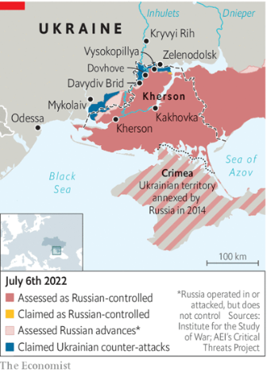  

#### 7.2 _| Fate unknown:_ [Russia is disappearing vast numbers of Ukrainians](https://www.economist.com/europe/2022/07/07/russia-is-disappearing-vast-numbers-of-ukrainians)  
Thousands have vanished into exile, prison or death  

#### 7.3 _| Explosive growth:_ [Weapons shipments turn a Polish city into a boom town](https://www.economist.com/europe/2022/07/07/weapons-shipments-turn-a-polish-city-into-a-boom-town)  
Rzeszow is a key link in American aid to Ukraine  

#### 7.4 _| From bad to worse:_ [Polish-German relations have gone sour](https://www.economist.com/europe/2022/07/07/polish-german-relations-have-gone-sour)  
Trust is at its lowest ebb since the cold war  

#### 7.5 _| Minority report:_ [France’s President Emmanuel Macron decides to go it alone](https://www.economist.com/europe/2022/07/07/frances-president-emmanuel-macron-decides-to-go-it-alone)  
Spurned by other parties, he appoints a minority government  

#### 7.6 _| The defiant one:_ [Alexei Navalny’s jailers are tightening the screws](https://www.economist.com/europe/2022/07/04/alexei-navalnys-jailers-are-tightening-the-screws)  
Russia’s repression of independent voices grows harsher  

#### 7.7 _| Charlemagne:_ [Travel chaos in Europe is a glimpse of a future with few spare workers](https://www.economist.com/europe/2022/07/07/travel-chaos-in-europe-is-a-glimpse-of-a-future-with-few-spare-workers)  
Employers are wondering where the staff went  

### 8. Britain
#### 8.1 _| The wreckage he will leave behind:_ [A monstrous in-tray awaits Boris Johnson’s eventual successor](https://www.economist.com/britain/2022/07/06/a-monstrous-in-tray-awaits-boris-johnsons-eventual-successor)  
Dealing with it may be beyond an exhausted Conservative Party  
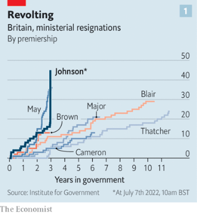  
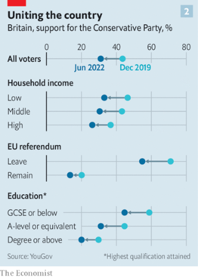  

#### 8.2 _| The rift with Rishi:_ [Many British Conservatives now prefer tax cuts to balanced budgets](https://www.economist.com/britain/2022/07/07/many-british-conservatives-now-prefer-tax-cuts-to-balanced-budgets)  
But high inflation makes it risky to stimulate the economy  
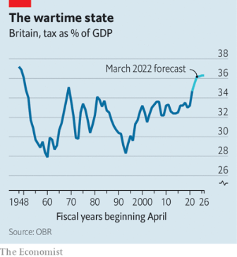  

#### 8.3 _| Pestminster, a history:_ [The House of Commons has a long history of sexual misconduct](https://www.economist.com/britain/2022/07/06/the-house-of-commons-has-a-long-history-of-sexual-misconduct)  
Fixing the culture of Parliament is not easy  

#### 8.4 _| A nation of backlogs:_ [Britain’s labour market is straining to recover from the pandemic](https://www.economist.com/britain/2022/07/07/britains-labour-market-is-straining-to-recover-from-the-pandemic)  
The disappearance of older workers explains a lot  
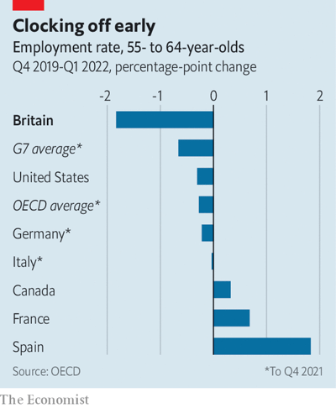  
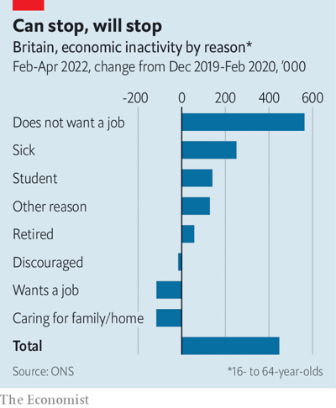  

#### 8.5 _| Britain’s growth crisis:_ [Britain wants to shake up adult education](https://www.economist.com/britain/2022/07/07/britain-wants-to-shake-up-adult-education)  
Plans to shake up lifelong learning are intriguing  
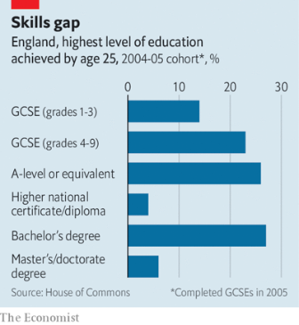  

#### 8.6 _| Chinese espionage:_ [Britain and America sound a joint alarm over China](https://www.economist.com/britain/2022/07/07/britain-and-america-sound-a-joint-alarm-over-china)  
In Britain, that is a novelty  

#### 8.7 _| Bagehot:_ [The toxicity of Boris Johnson](https://www.economist.com/britain/2022/07/06/the-toxicity-of-boris-johnson)  
No one’s reputation could survive contact with the prime minister  

### 9. United States
#### 9.1 _| A Washington army in waiting:_ [In preparation for power, America’s new right builds new institutions](https://www.economist.com/united-states/2022/07/05/in-preparation-for-power-americas-new-right-builds-new-institutions)  
The movement inspired by Donald Trump entrenches itself in Washington, DC  
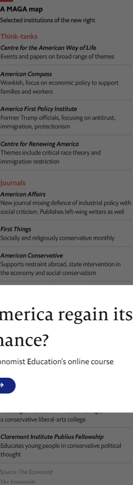  

#### 9.2 _| Zygote rights:_ [A push to recognise the rights of the unborn is growing in America](https://www.economist.com/united-states/2022/07/07/a-push-to-recognise-the-rights-of-the-unborn-is-growing-in-america)  
The movement risks inflicting grievous harm on pregnant women  

#### 9.3 _| Command and control:_ [The Pentagon sharpens its cultural sword to win future wars](https://www.economist.com/united-states/2022/07/07/the-pentagon-sharpens-its-cultural-sword-to-win-future-wars)  
More scattered forces will need to be more nimble and enterprising  

#### 9.4 _| Ceci n’est pas une carpe:_ [To hook American diners, an invasive species of carp gets a new name](https://www.economist.com/united-states/2022/07/07/to-hook-american-diners-an-invasive-species-of-carp-gets-a-new-name)  
It has worked before, for the Patagonian toothfish and the slimehead  

#### 9.5 _| No, no se puede:_ [Democrats have a Hispanic problem](https://www.economist.com/united-states/2022/07/07/democrats-have-a-hispanic-problem)  
Among Latino voters, the Trump years hurt Democrats more than they helped  

#### 9.6 _| Lexington:_ [High noon for Liz Cheney](https://www.economist.com/united-states/2022/07/06/high-noon-for-liz-cheney)  
Her example holds a lesson for the Republicans—and everyone else  

### 10. Middle East & Africa
#### 10.1 _| Either ore:_ [How the world depends on small cobalt miners](https://www.economist.com/middle-east-and-africa/2022/07/05/how-the-world-depends-on-small-cobalt-miners)  
The metal is key to the global energy transition. But its artisanal market is broken  
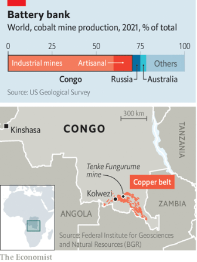  

#### 10.2 _| Where was the goalie?:_ [Two stupendous football scores raise questions in Sierra Leone](https://www.economist.com/middle-east-and-africa/2022/07/07/two-stupendous-football-scores-raise-questions-in-sierra-leone)  
It is not every week that teams win 91-1 and 95-0  

#### 10.3 _| Lapid response:_ [Israel’s new leader, Yair Lapid, has four months to prove himself](https://www.economist.com/middle-east-and-africa/2022/07/07/israels-new-leader-yair-lapid-has-four-months-to-prove-himself)  
Or Binyamin Netanyahu could win back power  

#### 10.4 _| Paving paradise:_ [Historic houseboats fall victim to Egypt’s addiction to cement](https://www.economist.com/middle-east-and-africa/2022/07/07/historic-houseboats-fall-victim-to-egypts-addiction-to-cement)  
Centuries-old homes are being bulldozed  

#### 10.5 _| The latest railway bazaar:_ [A new web of Arab railways could transform the Middle East](https://www.economist.com/middle-east-and-africa/2022/07/07/a-new-web-of-arab-railways-could-transform-the-middle-east)  
But old enmities block many of the links  
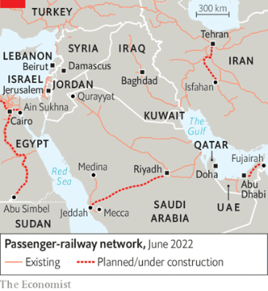  

### 11. The Americas
#### 11.1 _| Hearts, not minds:_ [Chile’s new draft constitution would shift the country far to the left](https://www.economist.com/the-americas/2022/07/07/chiles-new-draft-constitution-would-shift-the-country-far-to-the-left)  
The process of drafting it has also polarised the country  
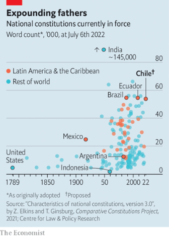  

#### 11.2 _| Find works; insert spanner; repeat:_ [Argentina’s economy minister resigns because of political infighting](https://www.economist.com/the-americas/2022/07/07/argentinas-economy-minister-resigns-because-of-political-infighting)  
Martin Guzmán’s departure will exacerbate the country’s economic ills  
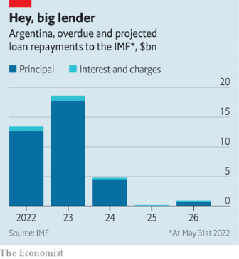  

#### 11.3 _| Rafting with rebels:_ [Some ex-FARC guerrillas have become tourist guides in Colombia](https://www.economist.com/the-americas/2022/07/07/some-ex-farc-guerrillas-have-become-tourist-guides-in-colombia)  
But not everyone has swapped pistols for paddles  
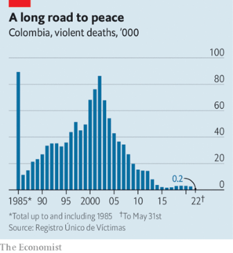  

### 12. Asia
#### 12.1 _| Cold comfort:_ [South Korea and Japan have a rare chance to make friends](https://www.economist.com/asia/2022/07/07/south-korea-and-japan-have-a-rare-chance-to-make-friends)  
They should be close allies. But history divides them  

#### 12.2 _| Bureaucratic nightmare:_ [“I’m from the Taliban and I’m here to help”](https://www.economist.com/asia/2022/07/07/im-from-the-taliban-and-im-here-to-help)  
Former fighters and religious clerics are filling Afghanistan’s civil service  

#### 12.3 _| Shinde shindig:_ [India’s ruling party wins control of its richest state](https://www.economist.com/asia/2022/07/07/indias-ruling-party-wins-control-of-its-richest-state)  
By wooing defectors, the Bharatiya Janata Party has taken Maharashtra  
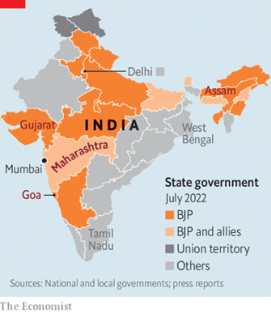  

#### 12.4 _| Bridges to liberty:_ [New transport infrastructure helps South Asian women into work](https://www.economist.com/asia/2022/07/07/new-transport-infrastructure-helps-south-asian-women-into-work)  
Female employment rises when journey times fall  

#### 12.5 _| Banyan:_ [What pandemic border closures say about Japan’s view of outsiders](https://www.economist.com/asia/2022/07/07/what-pandemic-border-closures-say-about-japans-view-of-outsiders)  
Double standards in travel rules reveal a distrust of foreigners  

### 13. China
#### 13.1 _| Building blocs:_ [The G7 at last presents an alternative to China’s Belt and Road Initiative](https://www.economist.com/china/2022/07/07/the-g7-at-last-presents-an-alternative-to-chinas-belt-and-road-initiative)  
Just as China starts to scale back its own scheme  

#### 13.2 _| Above the water line:_ [Fewer people are dying in floods in China](https://www.economist.com/china/2022/07/07/fewer-people-are-dying-in-floods-in-china)  
Money, dams and better planning are helping; climate change is not  

#### 13.3 _| Hacked:_ [A huge data leak in China was not unexpected](https://www.economist.com/china/2022/07/07/a-huge-data-leak-in-china-was-not-unexpected)  
The need for unencrypted data for spying on its people has consequences  

#### 13.4 _| Having a larp:_ [China’s Communist Party cracks down on larping](https://www.economist.com/china/2022/07/07/chinas-communist-party-cracks-down-on-larping)  
The youth will not be happy  

### 14. International
#### 14.1 _| Wasted minds:_ [Covid learning loss has been a global disaster](https://www.economist.com/international/2022/07/07/covid-learning-loss-has-been-a-global-disaster)  
Millions of children are still out of school. The costs are stacking up  
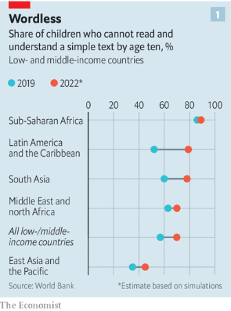  
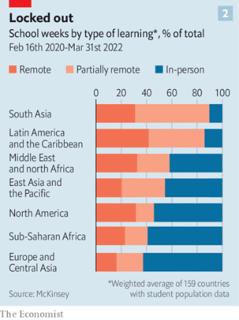  
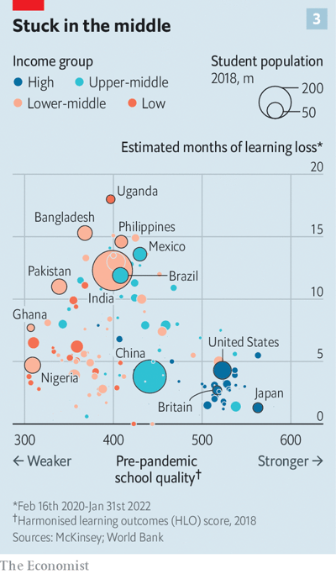  

### 15. Business
#### 15.1 _| PE lesson:_ [Private equity may be heading for a fall](https://www.economist.com/business/2022/07/07/private-equity-may-be-heading-for-a-fall)  
The era of rising valuations and cheap debt is over  
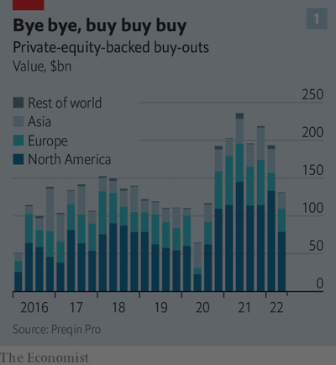  
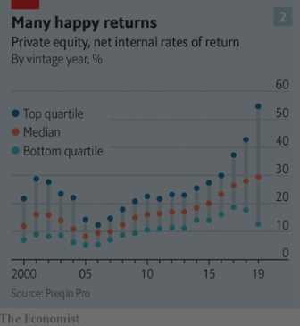  

#### 15.2 _| Business in Poland:_ [Business in Poland faces strong headwinds](https://www.economist.com/business/2022/07/07/business-in-poland-faces-strong-headwinds)  
War raging in neighbouring Ukraine makes life difficult  
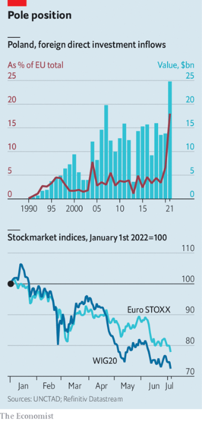  

#### 15.3 _| Venture capitalism in Europe:_ [How sturdy are Europe’s tech unicorns?](https://www.economist.com/business/2022/07/04/how-sturdy-are-europes-tech-unicorns)  
The downturn is unlikely to lay waste to tech on the old continent again  
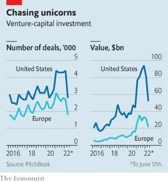  

#### 15.4 _| Bartleby:_ [Reading corporate culture from the outside](https://www.economist.com/business/2022/07/07/reading-corporate-culture-from-the-outside)  
It is becoming a bit easier to peer inside firms  

#### 15.5 _| Schumpeter:_ [What does the future hold for Reliance, India’s biggest firm?](https://www.economist.com/business/2022/07/07/what-does-the-future-hold-for-reliance-indias-biggest-firm)  
Is it on the verge of a break-up?  

### 16. Finance & economics
#### 16.1 _| Tougher than tariffs:_ [America rethinks its strategy for taking on China’s economy](https://www.economist.com/finance-and-economics/2022/07/06/america-rethinks-its-strategy-for-taking-on-chinas-economy)  
The focus is on whether Joe Biden will cut tariffs, but the real action is elsewhere  
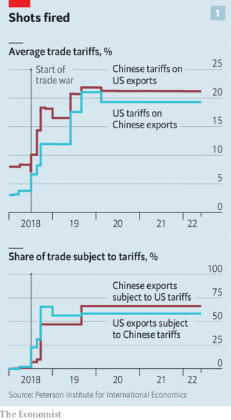  
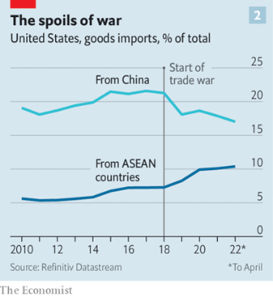  

#### 16.2 _| Helter skelter:_ [Do cheaper commodities herald a recession?](https://www.economist.com/finance-and-economics/2022/07/07/do-cheaper-commodities-herald-a-recession)  
Oil, metals and wheat prices are sinking  
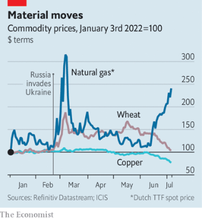  

#### 16.3 _| Case closed:_ [What a tycoon’s trial says about the rot in China’s financial system](https://www.economist.com/finance-and-economics/2022/07/07/what-a-tycoons-trial-says-about-the-rot-in-chinas-financial-system)  
Even the charges against Xiao Jianhua have not been made public  

#### 16.4 _| Buttonwood:_ [Crypto’s last man standing](https://www.economist.com/finance-and-economics/2022/07/05/cryptos-last-man-standing)  
Is Sam Bankman-Fried the John Pierpont Morgan of crypto?  

#### 16.5 _| Bills, bills, bills:_ [As interest rates climb and the economy cools, can companies pay their debts?](https://www.economist.com/finance-and-economics/2022/07/03/as-interest-rates-climb-and-the-economy-cools-can-companies-pay-their-debts)  
The risks might lie in shadowy private markets  
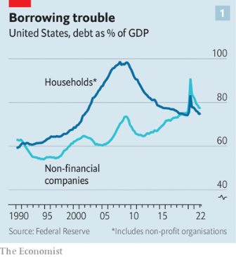  
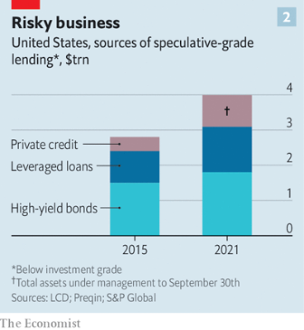  

#### 16.6 _| Free exchange:_ [Are central banks in emerging markets now less of a slave to the Fed?](https://www.economist.com/finance-and-economics/2022/07/07/are-central-banks-in-emerging-markets-now-less-of-a-slave-to-the-fed)  
The third in our series on the central-bank pivot  

### 17. Science & technology
#### 17.1 _| Beyond the Standard Model:_ [Ten years on from the Higgs boson, what is next for physics?](https://www.economist.com/science-and-technology/2022/07/04/ten-years-on-from-the-higgs-boson-what-is-next-for-physics)  
New particles beckon as the Large Hadron Collider returns to life  

### 18. Culture
#### 18.1 _| The Torlonia Marbles:_ [A legendary collection of classical statuary is at last on view](https://www.economist.com/culture/2022/07/07/a-legendary-collection-of-classical-statuary-is-at-last-on-view)  
Its story shows how politics and caprice can determine the art the public sees  

#### 18.2 _| To be a pilgrim:_ [Gaming the haj, from the comfort of home](https://www.economist.com/culture/2022/07/07/gaming-the-haj-from-the-comfort-of-home)  
A role-play game allows everyone to imagine one of the world’s great journeys  

#### 18.3 _| World in a dish:_ [A Chinese-flavoured challah tells a timeless human story](https://www.economist.com/culture/2022/07/07/a-chinese-flavoured-challah-tells-a-timeless-human-story)  
People move, and food reflects the mixing that ensues  

#### 18.4 _| Perfidious Albion:_ [The diaries of the last British governor of Hong Kong](https://www.economist.com/culture/2022/07/07/the-diaries-of-the-last-british-governor-of-hong-kong)  
Chris Patten is as scathing about some compatriots as about China’s Communist Party  

#### 18.5 _| Hide and seek:_ [Peter Higgs and his boson have both been “Elusive”](https://www.economist.com/culture/2022/07/06/peter-higgs-and-his-boson-have-both-been-elusive)  
Frank Close tells their story in his aptly titled book  

#### 18.6 _| Back Story:_ [The many lives of Volodymyr Zelensky](https://www.economist.com/culture/2022/07/07/the-many-lives-of-volodymyr-zelensky)  
A book about Ukraine’s president measures the gulf between before and now  

### 19. Economic & financial indicators
#### 19.1 [Economic data, commodities and markets](https://www.economist.com/economic-and-financial-indicators/2022/07/07/economic-data-commodities-and-markets)
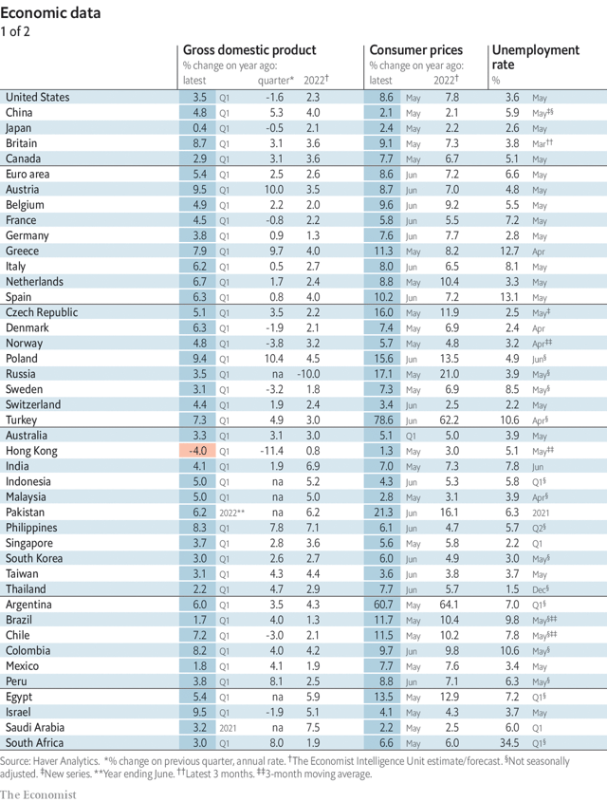  
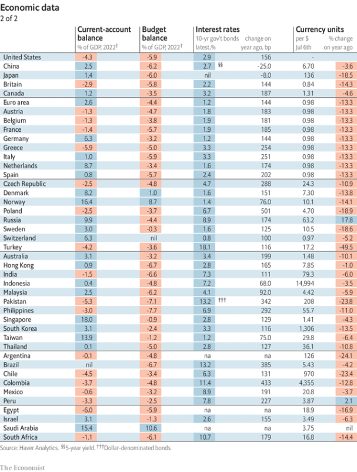  
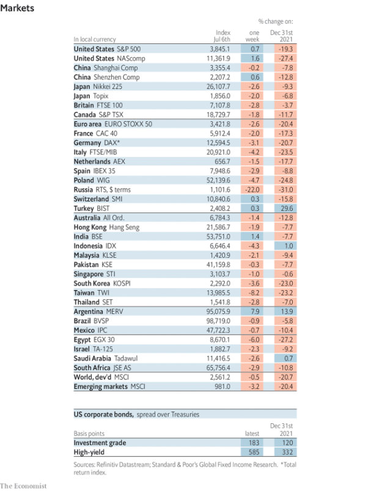  
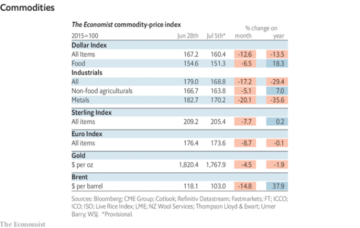  

### 20. Graphic detail
#### 20.1 _| It could have been worse:_ [Covid-19 vaccines saved an estimated 20m lives during their first year](https://www.economist.com/graphic-detail/2022/07/07/covid-19-vaccines-saved-an-estimated-20m-lives-during-their-first-year)  
Their impact in poor countries depends on how effectively governments prioritised recipients  
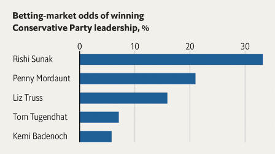  
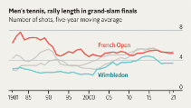  
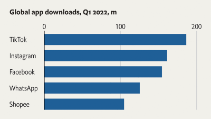  

### 21. The Economist explains
#### 21.1 [Why is Georgia struggling to join the EU?](https://www.economist.com/the-economist-explains/2022/07/06/why-is-georgia-struggling-to-join-the-eu)

#### 21.2 [Why are cluster munitions so dangerous?](https://www.economist.com/the-economist-explains/2022/07/07/why-are-cluster-munitions-so-dangerous)

### 22. Obituary
#### 22.1 _| The mystic of the stage:_ [Peter Brook saw acting as an uncompromising search for truth](https://www.economist.com/obituary/2022/07/07/peter-brook-saw-acting-as-an-uncompromising-search-for-truth)  
The revolutionary theatre director died on July 2nd, aged 97  

