### 1. The world this week
#### 1.1 [Politics](https://www.economist.com/the-world-this-week/2022/07/14/politics)

#### 1.2 [Business](https://www.economist.com/the-world-this-week/2022/07/14/business)
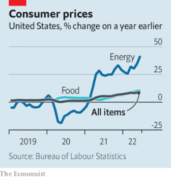  

#### 1.3 [KAL’s cartoon](https://www.economist.com/the-world-this-week/2022/07/14/kals-cartoon)
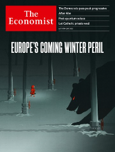  

### 2. Leaders
#### 2.1 _| The energy shock:_ [Europe’s winter of discontent](https://www.economist.com/leaders/2022/07/14/europes-winter-of-discontent)  
Even as temperatures soar Europe faces a bitter energy crisis later this year  

#### 2.2 _| American politics:_ [The Democrats need to wake up and stop pandering to their extremes](https://www.economist.com/leaders/2022/07/14/the-democrats-need-to-wake-up-and-stop-pandering-to-their-extremes)  
For the good of America, the governing party urgently needs to take on its own activists  

#### 2.3 _| After Abe:_ [Japan should stay true to Abe Shinzo’s vision—up to a point](https://www.economist.com/leaders/2022/07/14/japan-should-stay-true-to-abe-shinzos-vision-up-to-a-point)  
Kishida Fumio, the prime minister, should follow Mr Abe’s pragmatism, not his nationalism  

#### 2.4 _| British understatement:_ [Britain’s Conservatives seem oblivious to the coming budget crunch](https://www.economist.com/leaders/2022/07/13/britains-conservatives-seem-oblivious-to-the-coming-budget-crunch)  
It is a bad time to be increasing deficits to pay for tax cuts  

#### 2.5 _| Post-quantum solace:_ [What to do now about tomorrow’s code-cracking computers](https://www.economist.com/leaders/2022/07/14/what-to-do-now-about-tomorrows-code-cracking-computers)  
A future-proof way to encrypt sensitive data is now available. Put it to use  

#### 2.6 _| Let them wed:_ [The Catholic Church should scrap the requirement for priestly celibacy](https://www.economist.com/leaders/2022/07/14/the-catholic-church-should-scrap-the-requirement-for-priestly-celibacy)  
It would help it recruit clerics who do not abuse children  

### 3. Letters
#### 3.1 _| On pumped-storage hydropower, the Republicans, corporate governance, consultants, America’s national anthem, writing, moustaches:_ [Letters to the editor](https://www.economist.com/letters/2022/07/14/letters-to-the-editor)  
A selection of correspondence  

### 4. By Invitation
#### 4.1 _| Japan:_ [Abe Shinzo was the most important Japanese leader in the past 50 years, says Kevin Rudd](https://www.economist.com/by-invitation/2022/07/11/abe-shinzo-was-the-most-important-japanese-leader-in-the-past-50-years-says-kevin-rudd)  
The former Australian prime minister considers Abe’s international achievements  

#### 4.2 _| Education in America:_ [Banning critical race theory in schools is unjustified, argues Jason Stanley](https://www.economist.com/by-invitation/2022/07/14/banning-critical-race-theory-in-schools-is-unjustified-argues-jason-stanley)  
It will result in the botched teaching of America’s history according to the philosophy professor  

#### 4.3 _| Education in America:_ [Critical race theory is appropriate in universities, but not schools, says Bonnie Kerrigan Snyder](https://www.economist.com/by-invitation/2022/07/14/critical-race-theory-is-appropriate-in-universities-but-not-schools-says-bonnie-kerrigan-snyder)  
Pupils should grasp the basics of subjects before critiquing them, believes the free-speech advocate  

### 5. Briefing
#### 5.1 _| Peak progressive:_ [Democrats in America are realising they must moderate or die](https://www.economist.com/briefing/2022/07/14/democrats-in-america-are-realising-they-must-moderate-or-die)  
The prospect of defeat in the mid-terms and beyond is moving many away from their most radical ideas  
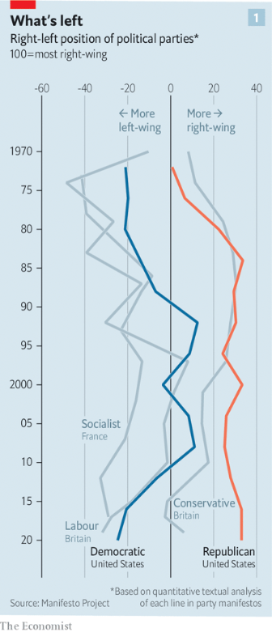  
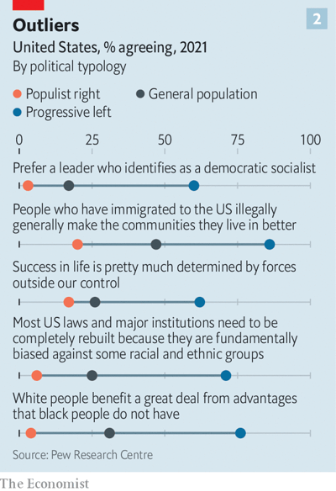  
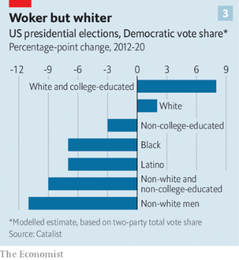  

### 6. Europe
#### 6.1 _| Winter is coming:_ [Europe is preparing for Russian gas to be cut off this winter](https://www.economist.com/europe/2022/07/11/europe-is-preparing-for-russian-gas-to-be-cut-off-this-winter)  
An EU-wide plan is needed to cope  
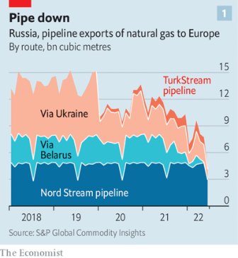  
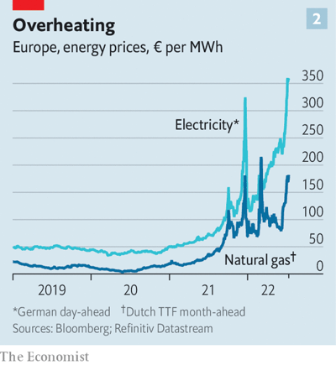  

#### 6.2 _| Cold front:_ [The war is forcing Ukraine’s energy planners to be creative](https://www.economist.com/europe/2022/07/14/the-war-is-forcing-ukraines-energy-planners-to-be-creative)  
As Russia bombs power plants, Ukrainians find alternatives  

#### 6.3 [Deep battle](https://www.economist.com/europe/2022/07/13/ukraines-new-rockets-are-wreaking-havoc-on-russias-army)
  

#### 6.4 [The price is wrong](https://www.economist.com/europe/2022/07/14/turkey-grapples-with-triple-digit-inflation)
  

#### 6.5 _| Food fight:_ [How many cows are too many, asks the Dutch government?](https://www.economist.com/europe/2022/07/14/how-many-cows-are-too-many-asks-the-dutch-government)  
And is a nut a fruit?  

#### 6.6 _| Charlemagne:_ [Down with long school summer breaks](https://www.economist.com/europe/2022/07/14/down-with-long-school-summer-breaks)  
More time studying is better for children, parents and society  

### 7. Britain
#### 7.1 _| Trust exercise:_ [The Conservative Party after Boris Johnson](https://www.economist.com/britain/2022/07/12/the-conservative-party-after-boris-johnson)  
The race to be the next prime minister is formally under way  
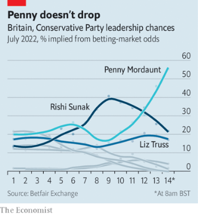  

#### 7.2 _| A fresh narrative:_ [Conservative candidates reveal “the British dream”](https://www.economist.com/britain/2022/07/14/conservative-candidates-reveal-the-british-dream)  
A diverse leadership contest and a confident new story of integration  
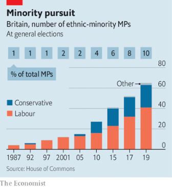  

#### 7.3 _| The interregnum:_ [Boris Johnson still has plans for his last weeks in office](https://www.economist.com/britain/2022/07/14/boris-johnson-still-has-plans-for-his-last-weeks-in-office)  
They offer him a final chance to shape his legacy  

#### 7.4 _| Demographic change:_ [Britain is ageing slower than other countries, and in a good way](https://www.economist.com/britain/2022/07/14/britain-is-ageing-slower-than-other-countries-and-in-a-good-way)  
Crucially, cities are forever young  
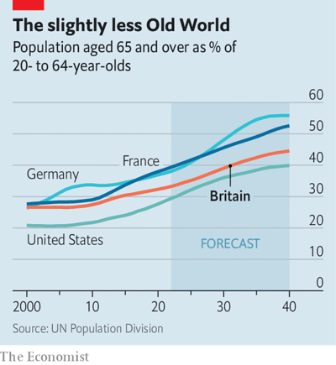  
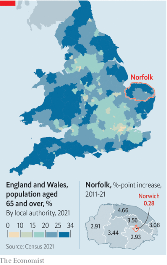  

#### 7.5 _| Pick your battles:_ [The British Army has a new focus and outdated equipment](https://www.economist.com/britain/2022/07/11/the-british-army-has-a-new-focus-and-outdated-equipment)  
Its top general sets his sights on Russia. But his forces desperately need investment  
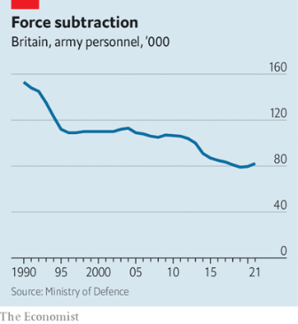  

#### 7.6 _| The play’s not the only thing:_ [Shakespeare and the revival of Prescot](https://www.economist.com/britain/2022/07/14/shakespeare-and-the-revival-of-prescot)  
A new theatre raises the question of how to value culture  

#### 7.7 _| Bagehot:_ [Britain’s prime minister becomes a rotten presidency](https://www.economist.com/britain/2022/07/14/britains-prime-minister-becomes-a-rotten-presidency)  
MPs alone, not party members, should choose the next prime minister  

### 8. United States
#### 8.1 [Schools for scandal](https://www.economist.com/interactive/united-states/2022/07/14/critical-race-theory-is-being-weaponised-whats-the-fuss-about)

#### 8.2 _| Writing on the wall:_ [New York City is a graffiti mecca for some tourists](https://www.economist.com/united-states/2022/07/14/new-york-city-is-a-graffiti-mecca-for-some-tourists)  
Tag time again in the Big Apple  

#### 8.3 _| The department of economic terminology:_ [Even if GDP shrinks, America may officially avoid a downturn. For now](https://www.economist.com/united-states/2022/07/14/even-if-gdp-shrinks-america-may-officially-avoid-a-downturn-for-now)  
Now you see recession, now you don’t  
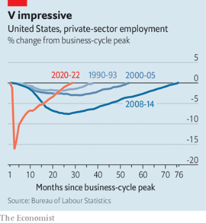  

#### 8.4 _| Rest in pieces:_ [Georgia loses a bizarre landmark](https://www.economist.com/united-states/2022/07/14/georgia-loses-a-bizarre-landmark)  
Conspiracy theories about the Georgia Guidestones were common  

#### 8.5 _| Lexington:_ [Why are the Democrats dithering on abortion rights?](https://www.economist.com/united-states/2022/07/14/why-are-the-democrats-dithering-on-abortion-rights)  
Three weeks after the Supreme Court struck down Roe v Wade, they still have no clear direction  

### 9. Middle East & Africa
#### 9.1 _| Voyage to nowhere:_ [What does the Middle East offer America?](https://www.economist.com/middle-east-and-africa/2022/07/12/what-does-the-middle-east-offer-america)  
America’s president embarks on an aimless trip  

#### 9.2 _| The blockade generation:_ [Young Palestinians in Gaza cannot find work and cannot leave](https://www.economist.com/middle-east-and-africa/2022/07/14/young-palestinians-in-gaza-cannot-find-work-and-cannot-leave)  
They cannot afford to marry, either  

#### 9.3 _| Kenya’s wild north:_ [Can elephants and rhinos coexist with livestock and their owners?](https://www.economist.com/middle-east-and-africa/2022/07/14/can-elephants-and-rhinos-coexist-with-livestock-and-their-owners)  
A controversial model of wildlife conservancy seems to help  
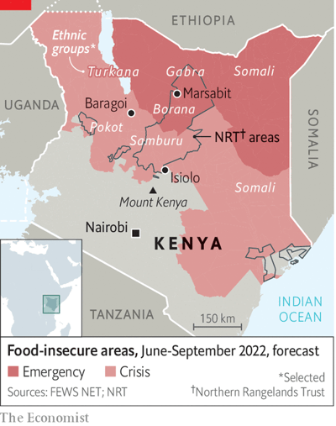  

#### 9.4 _| A legacy of looting:_ [José Eduardo dos Santos, who plundered Angola, has died](https://www.economist.com/middle-east-and-africa/2022/07/14/jose-eduardo-dos-santos-who-plundered-angola-has-died)  
But the former president’s corrupt legacy lives on  

### 10. The Americas
#### 10.1 _| Trump of the tropics:_ [Might Jair Bolsonaro try to steal Brazil’s election?](https://www.economist.com/the-americas/2022/07/14/might-jair-bolsonaro-try-to-steal-brazils-election)  
Ahead of a vote in October, the president has cast doubt on the whole process  

#### 10.2 _| Bello:_ [Migrant flows are changing in the Americas](https://www.economist.com/the-americas/2022/07/14/migrant-flows-are-changing-in-the-americas)  
A declaration signed last month may help manage them  

### 11. Asia
#### 11.1 _| Staying the course:_ [Abe Shinzo’s policies will live on, but may be enacted more slowly](https://www.economist.com/asia/2022/07/10/abe-shinzos-policies-will-live-on-but-may-be-enacted-more-slowly)  
He saw the challenges posed to Japan by a turbulent world, and acted accordingly  

#### 11.2 _| Midnight plane to Malé:_ [Sri Lanka’s president flees, leaving the country in chaos](https://www.economist.com/asia/2022/07/13/sri-lankas-president-flees-leaving-the-country-in-chaos)  
Gotabaya Rajapaksa takes a long time to resign  

#### 11.3 _| Politics takes atoll:_ [The Pacific Islands Forum is derailed by a high-profile withdrawal](https://www.economist.com/asia/2022/07/14/the-pacific-islands-forum-is-derailed-by-a-high-profile-withdrawal)  
Kiribati says it has left the regional co-operation organisation  
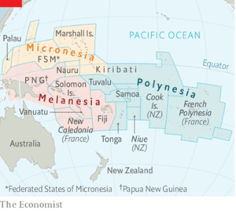  

#### 11.4 _| The way the wind blows:_ [Intra-party feuding distracts South Korea’s president](https://www.economist.com/asia/2022/07/14/intra-party-feuding-distracts-south-koreas-president)  
The People Power Party is embroiled in scandal and recrimination  

#### 11.5 _| Banyan:_ [Abe Shinzo left his mark on Asia and the world, not just Japan](https://www.economist.com/asia/2022/07/14/abe-shinzo-left-his-mark-on-asia-and-the-world-not-just-japan)  
The concept of the “free and open Indo-Pacific” is part of his enormous geopolitical legacy  

### 12. China
#### 12.1 _| Heading down a dangerous path:_ [Xi Jinping has nurtured an ugly form of Chinese nationalism](https://www.economist.com/china/2022/07/13/xi-jinping-has-nurtured-an-ugly-form-of-chinese-nationalism)  
It may prove hard to control  
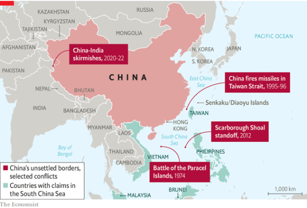  

#### 12.2 _| Send in the thugs:_ [A violent response to protests in China’s Henan province](https://www.economist.com/china/2022/07/14/a-violent-response-to-protests-in-chinas-henan-province)  
Thousands of people lost access to their savings. Then bullies beat them up  

#### 12.3 _| Title towns:_ [How “civilised” are China’s model cities?](https://www.economist.com/china/2022/07/14/how-civilised-are-chinas-model-cities)  
Clean toilets are good. Less crime would be better  

### 13. International
#### 13.1 _| Sex abuse and the church:_ [Catholic reformers want big changes to a church marred by sex abuse](https://www.economist.com/international/2022/07/14/catholic-reformers-want-big-changes-to-a-church-marred-by-sex-abuse)  
Talk of schism is in the air  

### 14. Business
#### 14.1 _| When the chips are way down:_ [After a turbocharged boom, are chipmakers in for a supersize bust?](https://www.economist.com/business/2022/07/10/after-a-turbocharged-boom-are-chipmakers-in-for-a-supersize-bust)  
Surging supply and softening demand are bringing the pandemic’s superstar industry back to Earth  
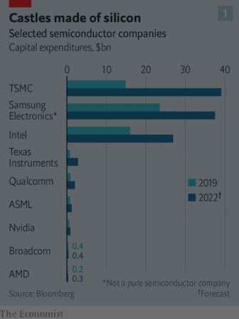  
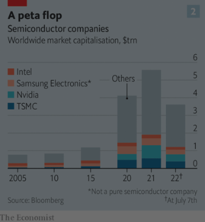  
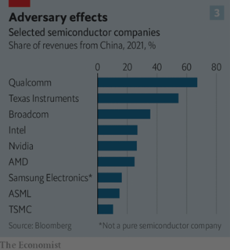  

#### 14.2 _| Blocked and reported:_ [With or without Elon Musk, Twitter is overdue a shake-up](https://www.economist.com/business/2022/07/11/with-or-without-elon-musk-twitter-is-overdue-a-shake-up)  
Behind a stagnation in users lies a stagnating product  
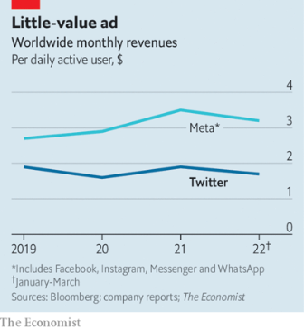  

#### 14.3 _| Fighting the power:_ [The man with a plan to fix Eskom](https://www.economist.com/business/2022/07/14/the-man-with-a-plan-to-fix-eskom)  
Andre de Ruyter wants to overhaul South Africa’s power utility. If only the government lets him  

#### 14.4 _| The high cost of low pressure:_ [Can Deutschland AG cope with the Russian gas shock?](https://www.economist.com/business/2022/07/14/can-deutschland-ag-cope-with-the-russian-gas-shock)  
Probably yes in the short term. In the longer run, German business will need to adapt  
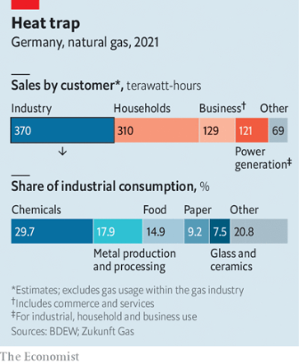  

#### 14.5 _| Bartleby:_ [How to navigate workplace awkwardness](https://www.economist.com/business/2022/07/14/how-to-navigate-workplace-awkwardness)  
Small moments of excruciating tension  

#### 14.6 _| Schumpeter:_ [Watch Russia’s Rosneft to see the new direction of global petropolitics](https://www.economist.com/business/2022/07/14/watch-russias-rosneft-to-see-the-new-direction-of-global-petropolitics)  
Oil’s new eastern bloc  

### 15. Finance & economics
#### 15.1 _| When maturity misleads:_ [How higher interest rates will squeeze government budgets](https://www.economist.com/finance-and-economics/2022/07/12/how-higher-interest-rates-will-squeeze-government-budgets)  
Rising borrowing costs will hit taxpayers sooner than you think  
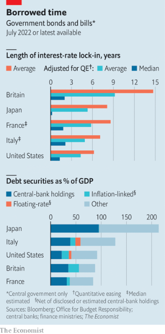  

#### 15.2 _| On the up and up:_ [American inflation tops forecasts yet again, adding to recession risks](https://www.economist.com/finance-and-economics/2022/07/13/american-inflation-tops-forecasts-yet-again-adding-to-recession-risks)  
The Fed is under pressure to crank up interest rates more aggressively  
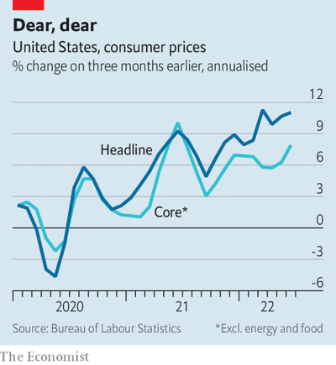  

#### 15.3 _| The visible hand:_ [The ECB’s masterplan to manipulate markets](https://www.economist.com/finance-and-economics/2022/07/14/the-ecbs-masterplan-to-manipulate-markets)  
Could it misfire?  

#### 15.4 _| Buttonwood:_ [Why markets really are less certain than they used to be](https://www.economist.com/finance-and-economics/2022/07/14/why-markets-really-are-less-certain-than-they-used-to-be)  
Three gauges of investor fear are unusually high  

#### 15.5 _| Abenomics After Abe:_ [The legacy of Abe Shinzo will shape Japan’s economy for years](https://www.economist.com/finance-and-economics/2022/07/14/the-legacy-of-abe-shinzo-will-shape-japans-economy-for-years)  
The anti-deflation arsenal of the country’s most influential prime minister is still needed  
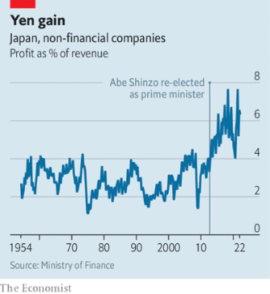  

#### 15.6 _| Free exchange:_ [Inflation shows both the value and limits of monetary-policy rules](https://www.economist.com/finance-and-economics/2022/07/14/inflation-shows-both-the-value-and-limits-of-monetary-policy-rules)  
A search for the right equation to overcome the fallibility of human judgment  

### 16. Science & technology
#### 16.1 _| Cryptography and quantum computers:_ [How to preserve secrets in a quantum age](https://www.economist.com/science-and-technology/2022/07/13/how-to-preserve-secrets-in-a-quantum-age)  
You need new mathematical ideas, some of which have just been standardised  

#### 16.2 _| I’m in heaven:_ [The James Webb Space Telescope opens for business](https://www.economist.com/science-and-technology/2022/07/11/the-james-webb-space-telescope-opens-for-business)  
Astronomy will never be the same again  

#### 16.3 _| Green-sky thinking:_ [Modified bacterial fungicides may propel the planes of the future](https://www.economist.com/science-and-technology/2022/07/13/modified-bacterial-fungicides-may-propel-the-planes-of-the-future)  
A novel approach to greening-up flying  

#### 16.4 [A pour decision](https://www.economist.com/science-and-technology/2022/07/13/bottling-white-wine-in-clear-glass-is-an-error)
  

#### 16.5 _| Protein shake-up:_ [Why elephants so rarely get cancer](https://www.economist.com/science-and-technology/2022/07/13/why-elephants-so-rarely-get-cancer)  
The diversity of foot soldiers in their cellular defences seems to play a role  

### 17. Culture
#### 17.1 _| Our summer reading lists:_ [Our correspondents recommend the best books on their beats](https://www.economist.com/culture/2022/07/14/our-correspondents-recommend-the-best-books-on-their-beats)  
For our full shelf of reading lists, go to economist.com/economist-reads  

#### 17.2 _| They stooped to conquer:_ [The Normans changed the face of Europe and the Middle East](https://www.economist.com/culture/2022/07/14/the-normans-changed-the-face-of-europe-and-the-middle-east)  
Levi Roach explains how in “Empires of the Normans”  

#### 17.3 _| Grotesque fiction:_ [“Lapvona” is Ottessa Moshfegh’s strangest novel yet](https://www.economist.com/culture/2022/07/14/lapvona-is-ottessa-moshfeghs-strangest-novel-yet)  
And, in her case, that is saying something  

#### 17.4 _| From El-Salam to the world:_ [Egypt’s authorities want to crack down on mahraganat](https://www.economist.com/culture/2022/07/14/egypts-authorities-want-to-crack-down-on-mahraganat)  
But the working-class music will not be stifled  

#### 17.5 _| Johnson:_ [Some language rules are valuable; others are piffling](https://www.economist.com/culture/2022/07/14/some-language-rules-are-valuable-others-are-piffling)  
But how to tell them apart?  

### 18. Economic & financial indicators
#### 18.1 [Economic data, commodities and markets](https://www.economist.com/economic-and-financial-indicators/2022/07/14/economic-data-commodities-and-markets)
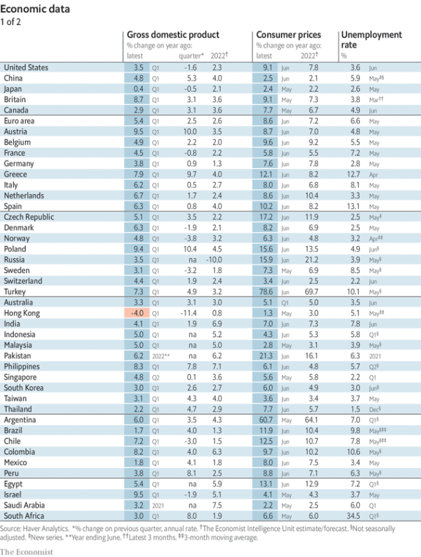  
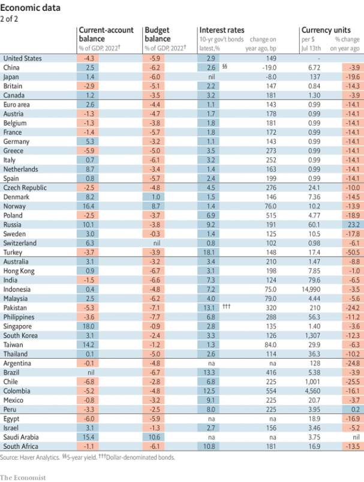  
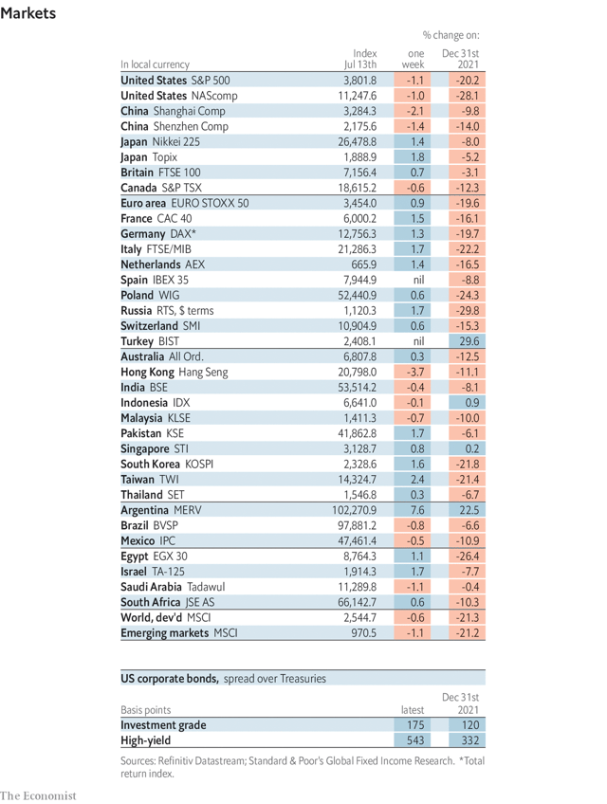  
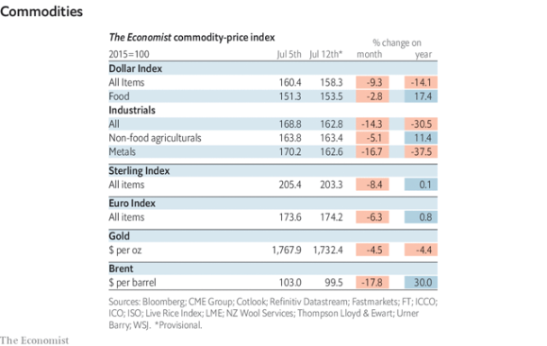  

### 19. Graphic detail
#### 19.1 _| People watching:_ [The pecking order of the world’s population is soon to change](https://www.economist.com/graphic-detail/2022/07/14/the-pecking-order-of-the-worlds-population-is-soon-to-change)  
As China shrinks, India continues to add citizens  
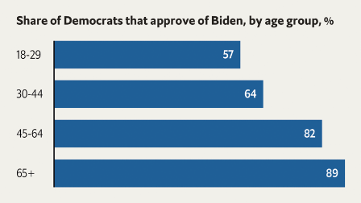  
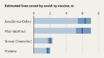  
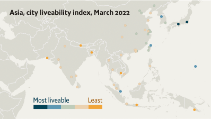  

### 20. The Economist explains
#### 20.1 [Can tax cuts boost Britain’s lacklustre economy?](https://www.economist.com/the-economist-explains/2022/07/12/can-tax-cuts-boost-britains-lacklustre-economy)

#### 20.2 [What makes a global financial centre?](https://www.economist.com/the-economist-explains/2022/07/14/what-makes-a-global-financial-centre)
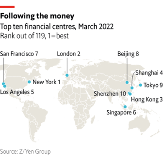  

### 21. Obituary
#### 21.1 _| Tracking the samurai:_ [Abe Shinzo believed that Japan should assert itself in the world](https://www.economist.com/obituary/2022/07/14/abe-shinzo-believed-that-japan-should-assert-itself-in-the-world)  
Japan’s longest-serving prime minister was assassinated on July 8th, aged 67  

