### 1. The world this week
#### 1.1 [Politics](https://www.economist.com/the-world-this-week/2022/07/28/politics)

#### 1.2 [Business](https://www.economist.com/the-world-this-week/2022/07/28/business)

#### 1.3 [KAL’s cartoon](https://www.economist.com/the-world-this-week/2022/07/28/kals-cartoon)
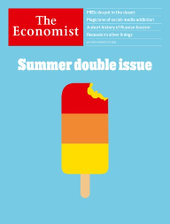  

### 2. Leaders
#### 2.1 _| Foreign policy:_ [How to deal with despots](https://www.economist.com/leaders/2022/07/28/how-to-deal-with-despots)  
Western foreign policy sets out to be ethical, but often ends up being ineffectual  

#### 2.2 _| The tough road back:_ [Ranil Wickremesinghe must persuade suffering Sri Lankans to endure more pain](https://www.economist.com/leaders/2022/07/28/ranil-wickremesinghe-must-persuade-suffering-sri-lankans-to-endure-more-pain)  
There is no getting around difficult economic reforms  

#### 2.3 _| After the downturn:_ [The silver linings of a recession](https://www.economist.com/leaders/2022/07/27/the-silver-linings-of-a-recession)  
Lower inflation and greener energy are worth the price of a short downturn  
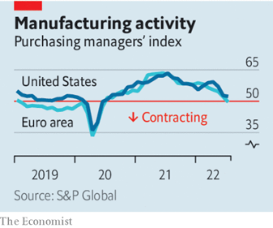  

#### 2.4 _| Cloudburst:_ [The era of big-tech exceptionalism may be over](https://www.economist.com/leaders/2022/07/27/the-era-of-big-tech-exceptionalism-may-be-over)  
America’s technology giants are facing unfamiliar limits to growth  

#### 2.5 _| War and hunger:_ [Somalia needs urgent help to avert a catastrophic famine](https://www.economist.com/leaders/2022/07/28/somalia-needs-urgent-help-to-avert-a-catastrophic-famine)  
Saving lives will also involve talking to terrorists  

### 3. Letters
#### 3.1 _| On gas markets, priests, Shakespeare, China, folk cuisine, turning 65, games:_ [Letters to the editor](https://www.economist.com/letters/2022/07/28/letters-to-the-editor)  
A selection of correspondence  

### 4. By Invitation
#### 4.1 _| Russia and Ukraine:_ [Jack Watling on how Ukraine can avoid a war of attrition](https://www.economist.com/by-invitation/2022/07/25/jack-watling-on-how-ukraine-can-avoid-a-war-of-attrition)  
A large-scale counterattack is possible. But Ukraine must not strike Russia prematurely, says the military expert  

#### 4.2 _| Japan:_ [Abe Shinzo’s legacy encompasses the Indo-Pacific, says his former speechwriter](https://www.economist.com/by-invitation/2022/07/22/abe-shinzos-legacy-encompasses-the-indo-pacific-says-his-former-speechwriter)  
He adopted his favourite mantra from Margaret Thatcher, according to Taniguchi Tomohiko  

### 5. Briefing
#### 5.1 _| A dark state:_ [Vladimir Putin is in thrall to a distinctive brand of Russian fascism](https://www.economist.com/briefing/2022/07/28/vladimir-putin-is-in-thrall-to-a-distinctive-brand-of-russian-fascism)  
That is why his country is such a threat to Ukraine, the West and his own people  

### 6. Europe
#### 6.1 _| Right ahead:_ [Italy’s next government may be more nationalist than Europe likes](https://www.economist.com/europe/2022/07/28/italys-next-government-may-be-more-nationalist-than-europe-likes)  
The hard-right Fratelli d’Italia are riding high in the polls  

#### 6.2 _| Taking it back:_ [Ukraine is gathering strength for an assault on Kherson](https://www.economist.com/europe/2022/07/28/ukraine-is-gathering-strength-for-an-assault-on-kherson)  
Russia might destroy the city rather than lose it  
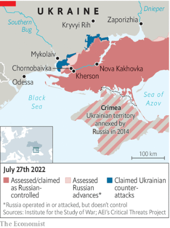  

#### 6.3 _| A deal on the Black Sea:_ [After agreeing to let Ukraine export grain, Russia rockets its port](https://www.economist.com/europe/2022/07/22/after-agreeing-to-let-ukraine-export-grain-russia-rockets-its-port)  
A strike on Odessa undermines a deal to ease the global food crisis  

#### 6.4 _| Cutting calories:_ [The EU agrees on an energy diet to fight Russian gas cuts](https://www.economist.com/europe/2022/07/28/the-eu-agrees-on-an-energy-diet-to-fight-russian-gas-cuts)  
Vladimir Putin wants to blackmail Europe into dropping sanctions  

#### 6.5 _| Delayed reaction:_ [France’s nuclear plants are going down for repairs](https://www.economist.com/europe/2022/07/28/frances-nuclear-plants-are-going-down-for-repairs)  
The crunch in electricity supply comes at the worst possible time  

#### 6.6 _| Putin’s false piety:_ [The Kremlin drafts a much-loved icon for war propaganda](https://www.economist.com/europe/2022/07/28/the-kremlin-drafts-a-much-loved-icon-for-war-propaganda)  
Andrei Rublev’s “Holy Trinity” is dragged from museum to monastery  

### 7. Britain
#### 7.1 _| Dreadneedle Street:_ [The Bank of England must weather high inflation and meddling politicians](https://www.economist.com/britain/2022/07/28/the-bank-of-england-must-weather-high-inflation-and-meddling-politicians)  
Managing the trade-off between inflation and growth is particularly hard in Britain  
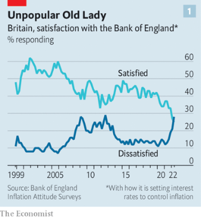  
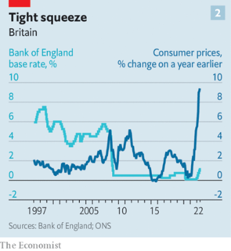  

#### 7.2 _| Happy champing:_ [Britain’s empty churches are turning into campsites](https://www.economist.com/britain/2022/07/28/britains-empty-churches-are-turning-into-campsites)  
It’s one way to keep them in use—and encourage younger visitors  

#### 7.3 _| Red line:_ [Chinese investment in Britain is under the microscope](https://www.economist.com/britain/2022/07/28/chinese-investment-in-britain-is-under-the-microscope)  
Newport Wafer Fab will be the next test for the government  
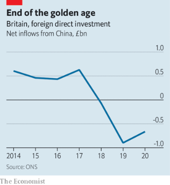  

#### 7.4 _| The unlikely dove:_ [Remembering David Trimble, an architect of the Good Friday Agreement](https://www.economist.com/britain/2022/07/28/remembering-david-trimble-an-architect-of-the-good-friday-agreement)  
Voters ended up deserting his party. But his vision endured  

#### 7.5 _| More than hot air:_ [Britain’s hydrogen strategy is ambitious, if imperfect](https://www.economist.com/britain/2022/07/25/britains-hydrogen-strategy-is-ambitious-if-imperfect)  
A debate over the merits of green and blue hydrogen  

#### 7.6 _| Bagehot:_ [The Conservative Party is ridiculing part of its electorate](https://www.economist.com/britain/2022/07/26/the-conservative-party-is-ridiculing-part-of-its-electorate)  
Its electoral coalition includes liberals and Europhiles. Many do not see the funny side  

### 8. United States
#### 8.1 _| Immigration and the economy:_ [A shortfall in immigration has become an economic problem for America](https://www.economist.com/united-states/2022/07/28/a-shortfall-in-immigration-has-become-an-economic-problem-for-america)  
The real crisis is not border crossings but a shortage of new arrivals  
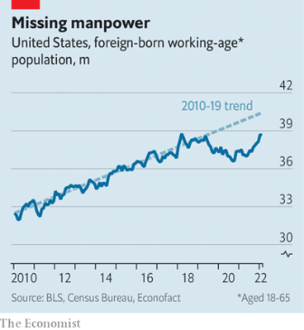  

#### 8.2 _| Green-card blues:_ [America’s legal-immigration system remains gummed up](https://www.economist.com/united-states/2022/07/28/americas-legal-immigration-system-remains-gummed-up)  
Donald Trump and the pandemic have done lasting damage  

#### 8.3 _| Return fire:_ [California’s governor takes aim at Texas with a new gun law](https://www.economist.com/united-states/2022/07/28/californias-governor-takes-aim-at-texas-with-a-new-gun-law)  
Doubling down on a dubious legal manoeuvre  

#### 8.4 _| Deus ex Manchina:_ [Democratic hopes for a big spending bill are revived](https://www.economist.com/united-states/2022/07/28/democratic-hopes-for-a-big-spending-bill-are-revived)  
The surprising Manchin-Schumer deal  

#### 8.5 _| In search of evidence:_ [Questioning America’s approach to transgender health care](https://www.economist.com/united-states/2022/07/28/questioning-americas-approach-to-transgender-health-care)  
Some paediatricians want a re-examination of the professional guidance  

#### 8.6 _| Lexington: The gerontocrats:_ [Democrats are overdue for a new generation of leaders](https://www.economist.com/united-states/2022/07/27/democrats-are-overdue-for-a-new-generation-of-leaders)  
And in Congress it may be about to arrive  

### 9. Middle East & Africa
#### 9.1 _| Hunger in the Horn:_ [Somalia is on the brink of starvation](https://www.economist.com/middle-east-and-africa/2022/07/25/somalia-is-on-the-brink-of-starvation)  
Drought, and the war in Ukraine, are causing the first famine of the global food crisis  
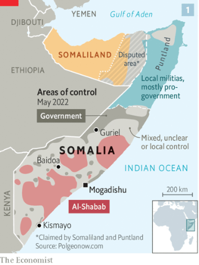  
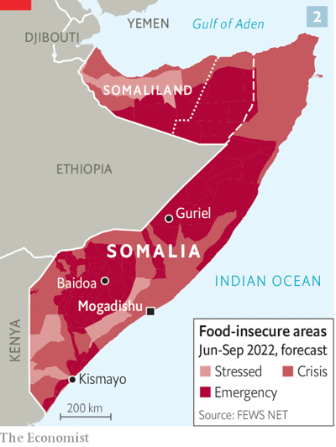  
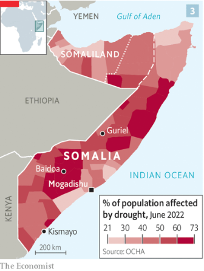  

#### 9.2 _| Drilling into the world’s lungs:_ [An oil auction in Congo bodes ill for the climate](https://www.economist.com/middle-east-and-africa/2022/07/27/an-oil-auction-in-congo-bodes-ill-for-the-climate)  
But the government says criticism from rich countries is hypocritical  
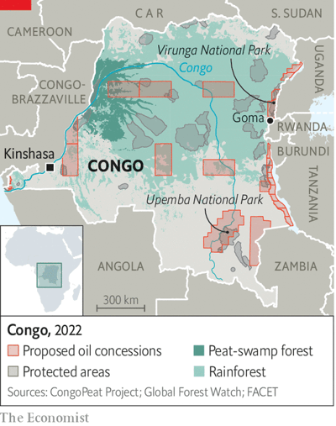  

#### 9.3 _| Head for the Holy Land:_ [Israel’s Russian conundrum](https://www.economist.com/middle-east-and-africa/2022/07/28/israels-russian-conundrum)  
The Jewish state’s neutrality over the war in Ukraine may be fraying  
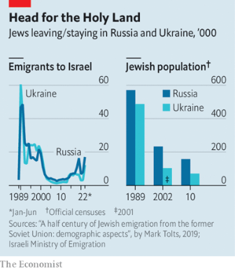  

#### 9.4 _| The obesity gap:_ [Why women are fatter than men in the Arab world](https://www.economist.com/middle-east-and-africa/2022/07/28/why-women-are-fatter-than-men-in-the-arab-world)  
Society does not make it easy to shed pounds  

### 10. The Americas
#### 10.1 _| All hat, no cattle:_ [Peru is becoming ever more volatile under Pedro Castillo](https://www.economist.com/the-americas/2022/07/28/peru-is-becoming-ever-more-volatile-under-pedro-castillo)  
After a year in power, the former schoolteacher has an approval rating of just 20%  

#### 10.2 _| Bello:_ [Latin America’s energy subsidies are good politics but bad policy](https://www.economist.com/the-americas/2022/07/28/latin-americas-energy-subsidies-are-good-politics-but-bad-policy)  
Across the region politicians are giving sops to protesters  

### 11. Asia
#### 11.1 _| Obstacle course:_ [What it will take to fix Sri Lanka’s economy](https://www.economist.com/asia/2022/07/28/what-it-will-take-to-fix-sri-lankas-economy)  
A long period of painful reforms, and yet more misery for Sri Lankans  

#### 11.2 _| A fine balance:_ [Pakistan may be able to avoid a full-blown economic crisis](https://www.economist.com/asia/2022/07/28/pakistan-may-be-able-to-avoid-a-full-blown-economic-crisis)  
But only if everything goes right  

#### 11.3 _| Desperate measures:_ [Myanmar’s brutal junta has brought back the death penalty](https://www.economist.com/asia/2022/07/28/myanmars-brutal-junta-has-brought-back-the-death-penalty)  
By executing four activists, it hopes to intimidate the public  

#### 11.4 _| Talking nice:_ [Australia and China are on speaking terms again](https://www.economist.com/asia/2022/07/26/australia-and-china-are-on-speaking-terms-again)  
Both countries sound friendlier, but Australia is not changing its security policies  

#### 11.5 _| Banyan:_ [India’s Hindu-nationalist ruling party preaches social inclusion](https://www.economist.com/asia/2022/07/28/indias-hindu-nationalist-ruling-party-preaches-social-inclusion)  
In electing Droupadi Murmu as president, the Bharatiya Janata Party shows its awesome political nous  

### 12. China
#### 12.1 _| Showing more bottle:_ [Relations between China and Europe grow more tense](https://www.economist.com/china/2022/07/28/relations-between-china-and-europe-grow-more-tense)  
In a continent once keen on close ties with China, views have grown much warier  
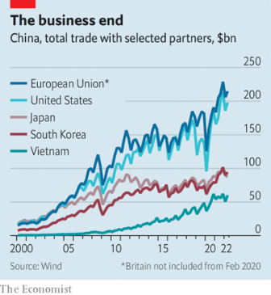  

### 13. 1843 magazine
#### 13.1 [MBS: despot in the desert](https://www.economist.com/1843/2022/07/28/mbs-despot-in-the-desert)

#### 13.2 [How magicians won the attention economy](https://www.economist.com/1843/2022/07/28/how-magicians-won-the-attention-economy)

#### 13.3 [East of Mariupol: what happened to the Ukrainians who fled to Russia?](https://www.economist.com/1843/2022/07/28/east-of-mariupol-what-happened-to-the-ukrainians-who-fled-to-russia)

#### 13.4 [Look who’s stalking: the black leopards of Gloucestershire](https://www.economist.com/1843/2022/07/28/look-whos-stalking-the-black-leopards-of-gloucestershire)

#### 13.5 [How to go to therapy without talking about your feelings](https://www.economist.com/1843/2022/07/28/how-to-go-to-therapy-without-talking-about-your-feelings)

#### 13.6 [Did this man spend 20 years in prison for murdering a man who is still alive?](https://www.economist.com/1843/2022/07/28/did-this-man-spend-20-years-in-prison-for-murdering-a-man-who-is-still-alive)

#### 13.7 [The sun is both our creator and destroyer](https://www.economist.com/1843/2022/07/28/the-sun-is-both-our-creator-and-destroyer)

### 14. Business
#### 14.1 _| Nationally determined contributors:_ [State-run oil giants will make or break the energy transition](https://www.economist.com/business/2022/07/25/state-run-oil-giants-will-make-or-break-the-energy-transition)  
They are intent on pumping more oil for years to come—but even they cannot completely ignore climate change  
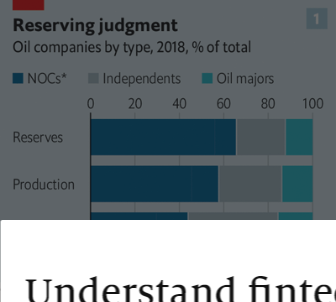  
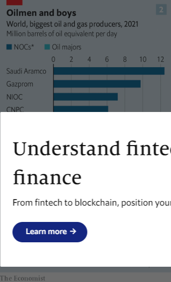  
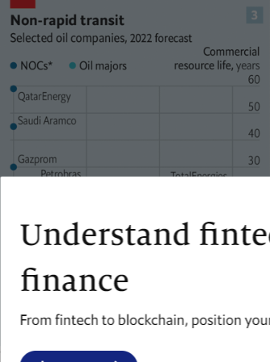  
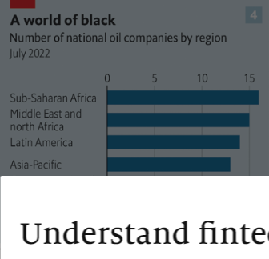  

#### 14.2 _| Diess-fenestration:_ [Volkswagen’s new boss faces some enduring challenges](https://www.economist.com/business/2022/07/28/volkswagens-new-boss-faces-some-enduring-challenges)  
Can Oliver Blume do better than Herbert Diess?  

#### 14.3 _| Oh, snap:_ [The online-ad industry is being shaken up](https://www.economist.com/business/2022/07/28/the-online-ad-industry-is-being-shaken-up)  
A years-long bonanza is giving way to more uncertain times  

#### 14.4 _| Bartleby:_ [Why it’s OK not to be perfect at work](https://www.economist.com/business/2022/07/28/why-its-ok-not-to-be-perfect-at-work)  
A backlash against the tyranny of high expectations  

#### 14.5 _| Schumpeter:_ [The Spirit deal is a missed opportunity for creative destruction](https://www.economist.com/business/2022/07/28/the-spirit-deal-is-a-missed-opportunity-for-creative-destruction)  
The airline agrees to sell itself to JetBlue, despite antitrust fears  

### 15. Finance & economics
#### 15.1 _| Coming in to land:_ [Why it is too early to say the world economy is in recession](https://www.economist.com/finance-and-economics/2022/07/24/why-it-is-too-early-to-say-the-world-economy-is-in-recession)  
Growth in the rich world is slowing, but has not crashed to a halt  
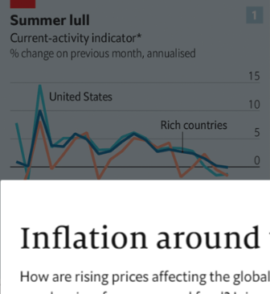  
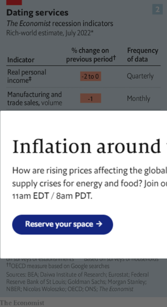  
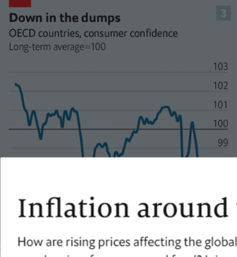  
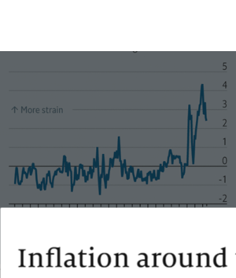  

#### 15.2 _| Less growth, more credibility:_ [China’s official growth figures are bad enough to be believed](https://www.economist.com/finance-and-economics/2022/07/28/chinas-official-growth-figures-are-bad-enough-to-be-believed)  
We cross-check the latest numbers  
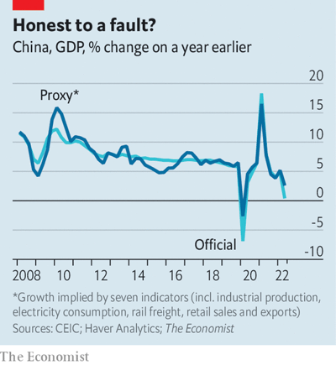  

#### 15.3 _| Through the floor:_ [Recession fears weigh on commercial property](https://www.economist.com/finance-and-economics/2022/07/26/recession-fears-weigh-on-commercial-property)  
Prices are set to subside as investors rethink their portfolios  

#### 15.4 _| Buttonwood:_ [Reminiscences of a financial columnist](https://www.economist.com/finance-and-economics/2022/07/28/reminiscences-of-a-financial-columnist)  
There is nothing new on Wall Street  

#### 15.5 _| Free exchange:_ [How high property prices can damage the economy](https://www.economist.com/finance-and-economics/2022/07/28/how-high-property-prices-can-damage-the-economy)  
A fresh strand of research studies the consequences, both in China and the rich world  

### 16. Science & technology
#### 16.1 _| Palaeoanthropology:_ [Redating specimens of Australopithecus may rewrite human history](https://www.economist.com/science-and-technology/2022/07/27/redating-specimens-of-australopithecus-may-rewrite-human-history)  
The richest hominin fossil-bed in the world is a million years older than previously thought  

#### 16.2 _| Nudge factor:_ [Evidence for behavioural interventions looks increasingly shaky](https://www.economist.com/science-and-technology/2022/07/27/evidence-for-behavioural-interventions-looks-increasingly-shaky)  
The academic literature is plagued by publication bias  

#### 16.3 _| Virology:_ [The cause of a new type of hepatitis in children is found](https://www.economist.com/science-and-technology/2022/07/27/the-cause-of-a-new-type-of-hepatitis-in-children-is-found)  
It seems to be caused by co-infection with two different viruses  

### 17. Culture
#### 17.1 _| Pop music and dissent:_ [A Thai pop star uses her music to critique her homeland](https://www.economist.com/culture/2022/07/28/a-thai-pop-star-uses-her-music-to-critique-her-homeland)  
Known for her “dystopian pop”, Pyra has been driven out by Thailand’s conservatism  

#### 17.2 _| Home Entertainment:_ [Philip Larkin’s verse is tender. His prejudices are controversial](https://www.economist.com/culture/2022/07/28/philip-larkins-verse-is-tender-his-prejudices-are-controversial)  
Born 100 years ago, the English poet balanced pathos with wit  

#### 17.3 _| Technology and terminology:_ [In “The Metaverse”, Matthew Ball explains where the idea came from](https://www.economist.com/culture/2022/07/27/in-the-metaverse-matthew-ball-explains-where-the-idea-came-from)  
And where it might be going  

### 18. Economic & financial indicators
#### 18.1 [Economic data, commodities and markets](https://www.economist.com/economic-and-financial-indicators/2022/07/28/economic-data-commodities-and-markets)
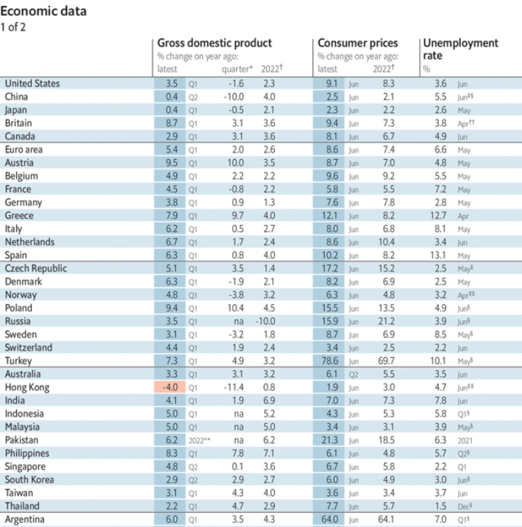  
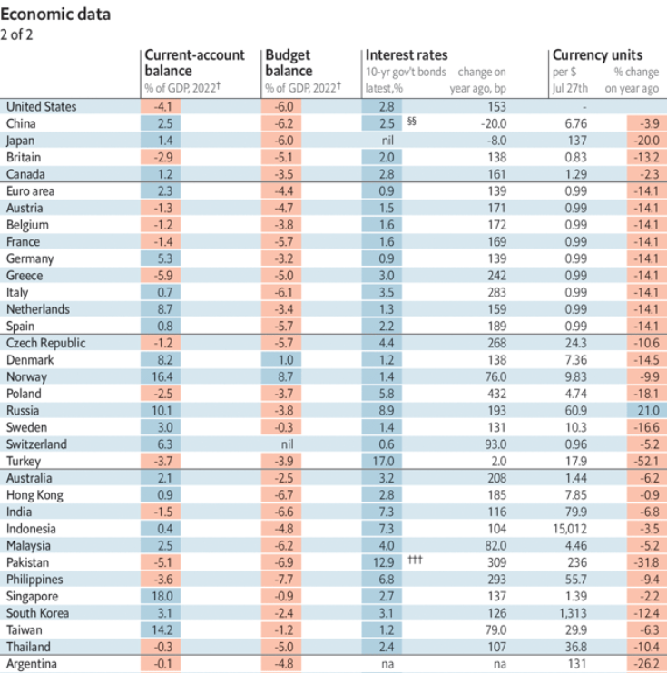  
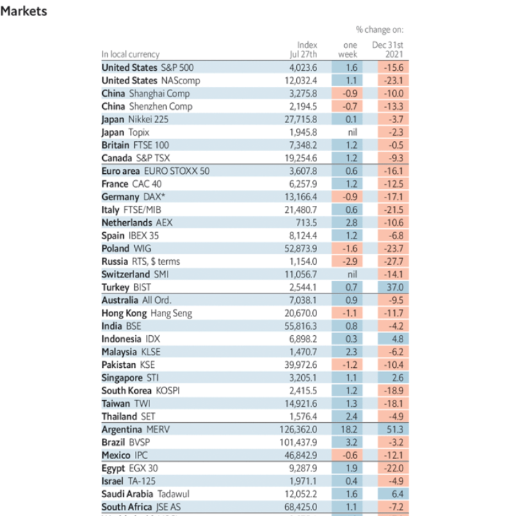  
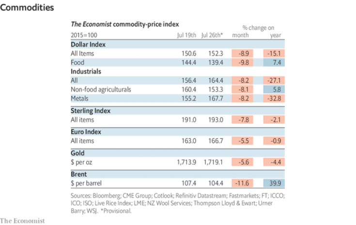  

### 19. Graphic detail
#### 19.1 _| The vaxxed take Pax:_ [Paxlovid appears to be reaching the Americans who need it least](https://www.economist.com/graphic-detail/2022/07/28/paxlovid-appears-to-be-reaching-the-americans-who-need-it-least)  
The impact of Pfizer’s antiviral drug is hard to detect in official statistics  
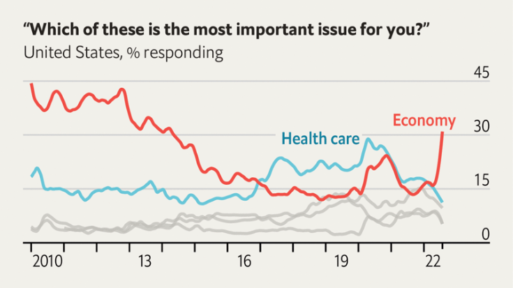  
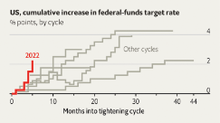  
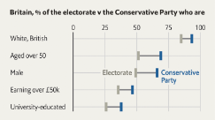  

### 20. Obituary
#### 20.1 _| Darkness to light:_ [Ko Jimmy was determined to make Myanmar free](https://www.economist.com/obituary/2022/07/27/ko-jimmy-was-determined-to-make-myanmar-free)  
The activist and writer was hanged by the military regime on July 23rd  

