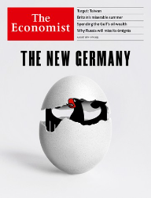
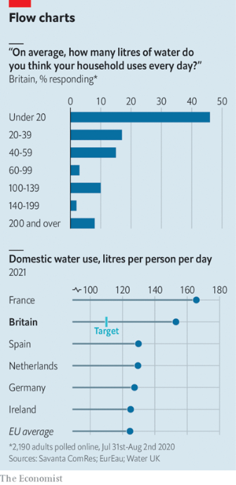
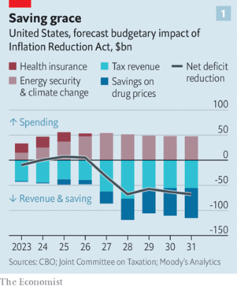
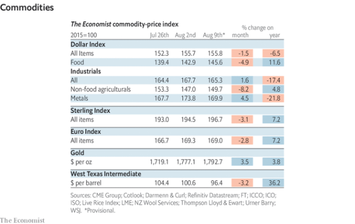

### 1. The world this week
#### 1.1 [Politics](https://www.economist.com/the-world-this-week/2022/08/11/politics)

#### 1.2 [Business](https://www.economist.com/the-world-this-week/2022/08/11/business)

#### 1.3 [KAL’s cartoon](https://www.economist.com/the-world-this-week/2022/08/11/kals-cartoon)
  

### 2. Leaders
#### 2.1 _| The new Germany:_ [Thanks to Vladimir Putin, Germany has woken up](https://www.economist.com/leaders/2022/08/11/thanks-to-vladimir-putin-germany-has-woken-up)  
Less starry-eyed policies on security and energy should help it lead Europe  

#### 2.2 _| Target: Taiwan:_ [How to prevent a war between America and China over Taiwan](https://www.economist.com/leaders/2022/08/11/how-to-prevent-a-war-between-america-and-china-over-taiwan)  
It is becoming ever harder  

#### 2.3 _| The Inflation Reduction Act:_ [America’s climate-plus spending bill is flawed but essential](https://www.economist.com/leaders/2022/08/08/americas-climate-plus-spending-bill-is-flawed-but-essential)  
The green policies and drug reforms in the Inflation Reduction Act are big victories  
  

#### 2.4 _| Crunch time:_ [How to help with energy bills](https://www.economist.com/leaders/2022/08/10/how-to-help-with-energy-bills)  
There are better, fairer and cheaper ways than meddling with prices  

#### 2.5 _| Lifelines of credit:_ [The unexpected lesson of Ghana’s 17th IMF bail-out](https://www.economist.com/leaders/2022/08/11/the-unexpected-lesson-of-ghanas-17th-imf-bail-out)  
It pays to ask for help early and often  

### 3. Letters
#### 3.1 _| On ESG investing, currency conversions, carp, hydrogen, alien life:_ [Letters to the editor](https://www.economist.com/letters/2022/08/11/letters-to-the-editor)  
A selection of correspondence  

### 4. By Invitation
#### 4.1 _| Taiwan:_ [Xi Jinping may attack Taiwan to secure his legacy, warn Admiral Lee Hsi-min and Eric Lee](https://www.economist.com/by-invitation/2022/08/03/xi-jinping-may-attack-taiwan-to-secure-his-legacy-warn-admiral-lee-hsi-min-and-eric-lee)  
The pair believe a paradigm shift in Taiwan’s military strategy is now critical  

#### 4.2 _| Taiwan:_ [China’s huge exercises around Taiwan were a rehearsal, not a signal, says Oriana Skylar Mastro](https://www.economist.com/by-invitation/2022/08/10/chinas-huge-exercises-around-taiwan-were-a-rehearsal-not-a-signal-says-oriana-skylar-mastro)  
The military expert believes Nancy Pelosi’s visit was more pretext than provocation  

### 5. Briefing
#### 5.1 _| Schafft Deutschland das?:_ [Germany is facing dramatic change in many dimensions all at once](https://www.economist.com/briefing/2022/08/11/germany-is-facing-dramatic-change-in-many-dimensions-all-at-once)  
It will not be easy to handle  
  
  
  

### 6. Europe
#### 6.1 _| The rungs of escalation:_ [What would push the West and Russia to nuclear war?](https://www.economist.com/europe/2022/08/02/what-would-push-the-west-and-russia-to-nuclear-war)  
Nobody is sure. That is why Joe Biden is careful in sending more potent weapons to Ukraine  

#### 6.2 _| Striking back:_ [Wrecked planes smoulder at Russia’s Saky airbase in Crimea](https://www.economist.com/europe/2022/08/11/wrecked-planes-smoulder-at-russias-saky-airbase-in-crimea)  
Ukraine has not claimed responsibility for an attack behind enemy lines  

#### 6.3 _| Putin’s disposables:_ [Russia is forcing Ukrainian conscripts into battle](https://www.economist.com/europe/2022/08/11/russia-is-forcing-ukrainian-conscripts-into-battle)  
Locals are trying to help them escape  
  

#### 6.4 _| Hidden injuries:_ [Ukraine is on the edge of nervous breakdown](https://www.economist.com/europe/2022/08/06/ukraine-is-on-the-edge-of-nervous-breakdown)  
The numbers that need psychiatric treatment far exceed the supply of doctors  

#### 6.5 _| Defeat foretold:_ [Can anything stop Italy’s radical right?](https://www.economist.com/europe/2022/08/11/can-anything-stop-italys-radical-right)  
Its opponents are struggling to put their egos aside  
  

#### 6.6 _| Sharp sadness:_ [The mysterious French mustard shortage](https://www.economist.com/europe/2022/08/11/the-mysterious-french-mustard-shortage)  
Even Dijon has run out of its namesake sauce  

#### 6.7 _| Charlemagne:_ [A changing climate is bad news for a continent that doesn’t like change](https://www.economist.com/europe/2022/08/11/a-changing-climate-is-bad-news-for-a-continent-that-doesnt-like-change)  
A heatwave is wreaking havoc across Europe  

### 7. Britain
#### 7.1 _| Summer of discontent:_ [Almost nothing seems to be working in Britain. It could get worse](https://www.economist.com/britain/2022/08/09/almost-nothing-seems-to-be-working-in-britain-it-could-get-worse)  
A warning from the hot summer of 1976  
  

#### 7.2 _| The cost-of-living crisis:_ [Britain’s economy is taking a drubbing](https://www.economist.com/britain/2022/08/11/britains-economy-is-taking-a-drubbing)  
Rising energy bills will be the principal source of pain  

#### 7.3 _| Borders and bottlenecks:_ [The port of Dover is vulnerable to delay and disruption](https://www.economist.com/britain/2022/08/11/the-port-of-dover-is-vulnerable-to-delay-and-disruption)  
And it’s about to get worse  
  

#### 7.4 _| Stop and think:_ [Stop-and-search is on the rise again in Britain](https://www.economist.com/britain/2022/08/11/stop-and-search-is-on-the-rise-again-in-britain)  
So are complaints that ethnic minorities are disproportionately targeted  

#### 7.5 _| Metered litres:_ [Better measurement would help reduce water consumption](https://www.economist.com/britain/2022/08/11/better-measurement-would-help-reduce-water-consumption)  
British households have no idea how much water they use  
  

#### 7.6 _| Bagehot:_ [Rising interest rates will split the Conservatives’ electoral coalition](https://www.economist.com/britain/2022/08/11/rising-interest-rates-will-split-the-conservatives-electoral-coalition)  
Live by the bank, die by the bank  

### 8. United States
#### 8.1 _| And now for my next act:_ [Joe Biden’s signature legislation passes the Senate, at last](https://www.economist.com/united-states/2022/08/09/joe-bidens-signature-legislation-passes-the-senate-at-last)  
The Inflation Reduction Act is weakened by big compromises, but is still a big deal  
  
  

#### 8.2 _| Cops, robbers and votes:_ [Crime and policing continue to split Democrats in Minnesota](https://www.economist.com/united-states/2022/08/11/crime-and-policing-continue-to-split-democrats-in-minnesota)  
Ilhan Omar, a progressive darling, almost comes unstuck  

#### 8.3 _| Flying with guns:_ [More Americans are trying to take their weapons on planes](https://www.economist.com/united-states/2022/08/11/more-americans-are-trying-to-take-their-weapons-on-planes)  
Loose gun laws lead to more interceptions at airports  
  

#### 8.4 _| Seeing the wood for the trees:_ [Mass timber offers new hope for an old industry in the American West](https://www.economist.com/united-states/2022/08/11/mass-timber-offers-new-hope-for-an-old-industry-in-the-american-west)  
The strong, sustainable building material may help revitalise forests  

#### 8.5 _| Extreme goes mainstream:_ [The insurrection failed. What now for America’s far right?](https://www.economist.com/united-states/2022/08/06/the-insurrection-failed-what-now-for-americas-far-right)  
Extremists are adapting to a post-January 6th America—by entering electoral politics  
  

#### 8.6 _| Lexington:_ [The raid on Mar-a-Lago could shake America’s foundations](https://www.economist.com/united-states/2022/08/10/the-raid-on-mar-a-lago-could-shake-americas-foundations)  
It has already given Donald Trump a boost  

### 9. Middle East & Africa
#### 9.1 _| Far from dead, liable to spread:_ [How al-Qaeda and Islamic State are digging into Africa](https://www.economist.com/middle-east-and-africa/2022/08/11/how-al-qaeda-and-islamic-state-are-digging-into-africa)  
The terrorist group’s African franchises are now punchier than those in the Middle East  
  

#### 9.2 _| Joule in the rain:_ [The Emirates hope to jolt clouds into sharing their bounty](https://www.economist.com/middle-east-and-africa/2022/08/11/the-emirates-hope-to-jolt-clouds-into-sharing-their-bounty)  
No one is entirely sure whether it works  

#### 9.3 _| Too close to call:_ [Why Kenya’s election is going down to the wire](https://www.economist.com/middle-east-and-africa/2022/08/11/why-kenyas-election-is-going-down-to-the-wire)  
It was Raila Odinga’s to lose  

#### 9.4 _| Seventeenth time lucky:_ [Ghana, an oft-lauded African economy, is back for a 17th bail-out](https://www.economist.com/middle-east-and-africa/2022/08/05/ghana-an-oft-lauded-african-economy-is-back-for-a-17th-bail-out)  
But success and failure may be flip sides of the same coin  
  

### 10. The Americas
#### 10.1 _| The jet set and the rest:_ [Inequality in Latin America is fuelling a new wave of populism](https://www.economist.com/the-americas/2022/08/06/inequality-in-latin-america-is-fuelling-a-new-wave-of-populism)  
Voters are once again turning to politicians who promise radical change  
  
  

#### 10.2 _| Caribbean conflagration:_ [Human error may have played a role in Cuba’s oil-terminal fire](https://www.economist.com/the-americas/2022/08/11/human-error-may-have-played-a-role-in-cubas-oil-terminal-fire)  
It will exacerbate the island’s fuel and power shortages  

#### 10.3 _| Bello:_ [The drift to authoritarianism accelerates in Central America](https://www.economist.com/the-americas/2022/08/11/the-drift-to-authoritarianism-accelerates-in-central-america)  
Guatemala arrests a crusading journalist  

### 11. Asia
#### 11.1 _| The three-body problem:_ [The nuclear arsenals of China, India and Pakistan are growing](https://www.economist.com/asia/2022/08/11/the-nuclear-arsenals-of-china-india-and-pakistan-are-growing)  
But the countries are not in an arms race—yet  
  

#### 11.2 _| The crownless again shall be king:_ [South Korea’s president is tightening his grip on the police](https://www.economist.com/asia/2022/08/11/south-koreas-president-is-tightening-his-grip-on-the-police)  
Yoon Suk-yeol, a former top prosecutor, would like his powers back  

#### 11.3 _| Voice recognition:_ [Australia’s leader wants to include Aboriginals in the constitution](https://www.economist.com/asia/2022/08/11/australias-leader-wants-to-include-aboriginals-in-the-constitution)  
The prime minister has vowed to hold a referendum on the topic within three years  

#### 11.4 _| Polling badly:_ [Papua New Guinea conducts its worst election ever](https://www.economist.com/asia/2022/08/11/papua-new-guinea-conducts-its-worst-election-ever)  
More violence, more corruption, more fraud. But fewer deaths, at least  

#### 11.5 _| Banyan:_ [How not to administer justice after a brutal civil war](https://www.economist.com/asia/2022/08/11/how-not-to-administer-justice-after-a-brutal-civil-war)  
Post-war reconciliation in Nepal is a nice idea. Too bad about the politics  

#### 11.6 _| Peace, of a sort:_ [Afghanistan is poorer and hungrier than a year ago](https://www.economist.com/asia/2022/08/11/afghanistan-is-poorer-and-hungrier-than-a-year-ago)  
Yet it is also safer, with far less violence in rural areas  
  

### 12. China
#### 12.1 _| Danger ahead:_ [How the crisis over Taiwan will change US-China relations](https://www.economist.com/china/2022/08/11/how-the-crisis-over-taiwan-will-change-us-china-relations)  
The showdown looks set to usher in a perilous new era of hostility  
  
  

### 13. International
#### 13.1 _| The best and the brightest:_ [Much of Russia’s intellectual elite has fled the country](https://www.economist.com/international/2022/08/09/much-of-russias-intellectual-elite-has-fled-the-country)  
That will have dramatic effects on both Russia and on the exiles themselves  

### 14. Business
#### 14.1 _| Chinese private enterprise:_ [Meet China’s new tycoons](https://www.economist.com/business/2022/08/05/meet-chinas-new-tycoons)  
Who is winning in Xi Jinping’s economy?  
  
  
  

#### 14.2 _| Defence is the best offence:_ [Can tech reshape the Pentagon?](https://www.economist.com/business/2022/08/08/can-tech-reshape-the-pentagon)  
After a long break-up, Silicon Valley and the military-industrial complex are getting back together  
  

#### 14.3 _| More cash, stat!:_ [After a covid-fuelled adrenaline rush, biotech is crashing](https://www.economist.com/business/2022/08/10/after-a-covid-fuelled-adrenaline-rush-biotech-is-crashing)  
Many firms will not survive  
  

#### 14.4 _| Bartleby:_ [Why employees want to work in vilified industries](https://www.economist.com/business/2022/08/11/why-employees-want-to-work-in-vilified-industries)  
Workers for demonised firms are often proud to be on the payroll  

#### 14.5 _| Schumpeter:_ [Tencent is a success story bedevilled by the splinternet](https://www.economist.com/business/2022/08/11/tencent-is-a-success-story-bedevilled-by-the-splinternet)  
WeChat, they snoop, no one wins  

### 15. Finance & economics
#### 15.1 _| Spend or save?:_ [An oil windfall offers Gulf states one last chance to splurge](https://www.economist.com/finance-and-economics/2022/08/07/an-oil-windfall-offers-gulf-states-one-last-chance-to-splurge)  
Dubai wants jobs in the metaverse; Saudi Arabia a city in the desert  
  
  

#### 15.2 _| Buttonwood:_ [How should investors prepare for repeat inflation shocks?](https://www.economist.com/finance-and-economics/2022/08/11/how-should-investors-prepare-for-repeat-inflation-shocks)  
Forget transitory v persistent. The new fear is that price pressures are “structural”  

#### 15.3 _| Two cheers amid the fears:_ [For a change, American inflation is lower than expected](https://www.economist.com/finance-and-economics/2022/08/05/for-a-change-american-inflation-is-lower-than-expected)  
But a continued jobs boom points to a need for yet more Fed tightening  
  

#### 15.4 _| Putin’s present:_ [Which European countries are most vulnerable to surging energy prices?](https://www.economist.com/finance-and-economics/2022/08/11/which-european-countries-are-most-vulnerable-to-surging-energy-prices)  
It’s better to be a consumer in Sweden than Britain  
  

#### 15.5 _| A finite problem:_ [China’s mortgage boycotts are a symptom of a broader crisis](https://www.economist.com/finance-and-economics/2022/08/09/chinas-mortgage-boycotts-are-a-symptom-of-a-broader-crisis)  
The real threat to developers is falling sales  
  

#### 15.6 _| Shorts, squeezed:_ [Short-sellers are struggling despite a bad year for stocks](https://www.economist.com/finance-and-economics/2022/08/11/short-sellers-are-struggling-despite-a-bad-year-for-stocks)  
Why the odds are stacked against those who bet against the market  
  

#### 15.7 _| Free exchange:_ [America v Europe: A comparison of riches leaves both sides red-faced](https://www.economist.com/finance-and-economics/2022/08/11/america-v-europe-a-comparison-of-riches-leaves-both-sides-red-faced)  
Lessons from David Hockney’s mother  

### 16. Science & technology
#### 16.1 _| The 24th International AIDS Conference:_ [Despite setbacks, HIV can be beaten](https://www.economist.com/science-and-technology/2022/08/02/despite-setbacks-hiv-can-be-beaten)  
But doing so will take patience and money  
  
  

#### 16.2 _| Forming Earth:_ [Earth’s continents may owe their existence to bombardment from outer space](https://www.economist.com/science-and-technology/2022/08/10/earths-continents-may-owe-their-existence-to-bombardment-from-outer-space)  
Rather than forces within  

### 17. Culture
#### 17.1 _| Interest rates:_ [Ben Bernanke and Edward Chancellor square off on monetary policy](https://www.economist.com/culture/2022/08/11/ben-bernanke-and-edward-chancellor-square-off-on-monetary-policy)  
Their duelling books reveal the clashes between central bankers and their critics  

#### 17.2 _| Playing fast and loose:_ [A history of jazz’s relationship with organised crime](https://www.economist.com/culture/2022/08/11/a-history-of-jazzs-relationship-with-organised-crime)  
T.J. English shows how gangsters nurtured the careers of musical greats  

#### 17.3 _| Home Entertainment:_ [“Bambi” offers a horrifying portrait of eco-catastrophe](https://www.economist.com/culture/2022/08/11/bambi-offers-a-horrifying-portrait-of-eco-catastrophe)  
In the animated film of 1942, careless humans set off an apocalyptic forest fire  

#### 17.4 _| New fiction:_ [A father-son relationship animates Taymour Soomro’s debut novel](https://www.economist.com/culture/2022/08/11/a-father-son-relationship-animates-taymour-soomros-debut-novel)  
“Other Names for Love” is a skilful depiction of family ties and memory  

#### 17.5 _| Johnson:_ [Should “data” be singular or plural?](https://www.economist.com/culture/2022/08/11/should-data-be-singular-or-plural)  
On a curiously polarising debate in English grammar  

### 18. Economic & financial indicators
#### 18.1 [Economic data, commodities and markets](https://www.economist.com/economic-and-financial-indicators/2022/08/11/economic-data-commodities-and-markets)
  
  
  
  

### 19. Graphic detail
#### 19.1 _| It pays to be friends:_ [Friendship across class lines may boost social mobility and decrease poverty](https://www.economist.com/graphic-detail/2022/08/11/friendship-across-class-lines-may-boost-social-mobility-and-decrease-poverty)  
An enormous new study vindicates “Bowling Alone”  
  
  
  

### 20. The Economist explains
#### 20.1 [What do caretaker governments take care of?](https://www.economist.com/the-economist-explains/2022/08/10/what-do-caretaker-governments-take-care-of)

#### 20.2 [Why isn’t Russia blocking GPS in Ukraine?](https://www.economist.com/the-economist-explains/2022/08/08/why-isnt-russia-blocking-gps-in-ukraine)

### 21. Obituary
#### 21.1 _| The doors of perception:_ [Ann Shulgin pioneered the use of psychedelics in therapy](https://www.economist.com/obituary/2022/08/11/ann-shulgin-pioneered-the-use-of-psychedelics-in-therapy)  
The experimental drug researcher died on July 9th, aged 91  

