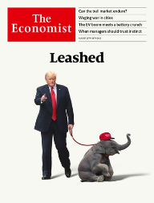

### 1. The world this week
#### 1.1 [Politics](https://www.economist.com/the-world-this-week/2022/08/18/politics)

#### 1.2 [Business](https://www.economist.com/the-world-this-week/2022/08/18/business)
  

#### 1.3 [KAL’s cartoon](https://www.economist.com/the-world-this-week/2022/08/18/kals-cartoon)
  

### 2. Leaders
#### 2.1 _| American politics:_ [Will Donald Trump run again?](https://www.economist.com/leaders/2022/08/18/will-donald-trump-run-again)  
And, if he does, would Republicans pick him as their nominee?  

#### 2.2 _| The Tory leadership:_ [What kind of prime minister will Britain get?](https://www.economist.com/leaders/2022/08/18/what-kind-of-prime-minister-will-britain-get)  
It will be a technocrat who knows what to do, or a politician who knows how to do it  

#### 2.3 _| The war in Ukraine:_ [Stay cool on Kherson](https://www.economist.com/leaders/2022/08/17/stay-cool-on-kherson)  
Why Ukraine’s army should not rush to recapture the whole province  

#### 2.4 _| Beware bear traps:_ [A fresh American bull market is under way. Can it last?](https://www.economist.com/leaders/2022/08/18/a-fresh-american-bull-market-is-under-way-can-it-last)  
Investors have been cheered by rosy economic news  
  

#### 2.5 _| Never-ending story:_ [Salman Rushdie and the struggle for free speech](https://www.economist.com/leaders/2022/08/18/salman-rushdie-and-the-struggle-for-free-speech)  
A horrific attack shows the old battles still rage  

#### 2.6 _| The penniless v the merciless:_ [Myanmar’s shadow government deserves more help](https://www.economist.com/leaders/2022/08/18/myanmars-shadow-government-deserves-more-help)  
International recognition—and the money it would bring—would be a good first step  

### 3. Letters
#### 3.1 _| On nudge policies, German energy, careers, Russian colonialism, our summer issue, Don McLean:_ [Letters to the editor](https://www.economist.com/letters/2022/08/18/letters-to-the-editor)  
A selection of correspondence  

### 4. By Invitation
#### 4.1 _| The 75th anniversary of Pakistan’s independence:_ [Pakistan’s prime minister on his drive to modernise the country](https://www.economist.com/by-invitation/2022/08/13/pakistans-prime-minister-on-his-drive-to-modernise-the-country)  
A challenging moment offers an opportunity, says Shehbaz Sharif  

#### 4.2 _| The 75th anniversary of India’s independence:_ [India’s future will be shaped by its expats, says Gaurav Dalmia](https://www.economist.com/by-invitation/2022/08/15/indias-future-will-be-shaped-by-its-expats-says-gaurav-dalmia)  
The investor believes there are three ways they can help to boost growth  

#### 4.3 _| Health:_ [We need to break the taboo around male fertility, says Leslie Schrock](https://www.economist.com/by-invitation/2022/08/16/we-need-to-break-the-taboo-around-male-fertility-says-leslie-schrock)  
The health entrepreneur says poor-quality sperm affects women and children. But improving it is possible  

### 5. Briefing
#### 5.1 _| The Nero of Mar-a-Lago:_ [Donald Trump’s hold on the Republican Party is unquestionable](https://www.economist.com/briefing/2022/08/18/donald-trumps-hold-on-the-republican-party-is-unquestionable)  
And it is putting his acolytes into offices that control elections  
  
  

### 6. Europe
#### 6.1 _| Stick or twist?:_ [A Ukrainian counter-offensive in Kherson faces steep odds](https://www.economist.com/europe/2022/08/14/a-ukrainian-counter-offensive-in-kherson-faces-steep-odds)  
Ukraine wants to show progress on the battlefield. But its army may not be ready  
  

#### 6.2 _| The sharp end:_ [Life in occupied Kherson is grim](https://www.economist.com/europe/2022/08/18/life-in-occupied-kherson-is-grim)  
Refugees from the region tell appalling stories  
  

#### 6.3 _| No room for doubt:_ [Russia compels religious leaders to show rapturous support for war](https://www.economist.com/europe/2022/08/18/russia-compels-religious-leaders-to-show-rapturous-support-for-war)  
Should the pope meet Russia’s patriarch?  

#### 6.4 _| Bombs and balance sheets:_ [Germany’s waterways are unsung, but essential](https://www.economist.com/europe/2022/08/18/germanys-waterways-are-unsung-but-essential)  
River freight is hard to beat  
  

#### 6.5 _| Rich pickings:_ [Turkey plans to pave more of its coastline](https://www.economist.com/europe/2022/08/18/turkey-plans-to-pave-more-of-its-coastline)  
New resorts target ultra-rich Arabs and Russians  

#### 6.6 _| Charlemagne:_ [How the EU looks after a decade of horrors](https://www.economist.com/europe/2022/08/18/how-the-eu-looks-after-a-decade-of-horrors)  
Our Europe columnist returns to Brussels after ten years away  

### 7. Britain
#### 7.1 _| The maverick v the wonk:_ [Parsing the policies of Liz Truss and Rishi Sunak](https://www.economist.com/britain/2022/08/18/parsing-the-policies-of-liz-truss-and-rishi-sunak)  
The economy shows up the differences between the Tory leadership contenders  
  

#### 7.2 _| Eye of the Neidle:_ [In praise of financial professionals who turn into sleuths](https://www.economist.com/britain/2022/08/18/in-praise-of-financial-professionals-who-turn-into-sleuths)  
White-collar vigilantes fill the gap left by inadequate law enforcement  

#### 7.3 _| Off the books:_ [A proposed change in the law takes aim at unregistered schools in Britain](https://www.economist.com/britain/2022/08/18/a-proposed-change-in-the-law-takes-aim-at-unregistered-schools-in-britain)  
Ofsted reckons tens of thousands of children attend clandestine institutions  

#### 7.4 _| A grave shortage:_ [London’s cemeteries are selling second-hand graves. They need to](https://www.economist.com/britain/2022/08/18/londons-cemeteries-are-selling-second-hand-graves-they-need-to)  
For sale: vintage grave, one careful owner  

#### 7.5 _| Counting on it:_ [Are Catholics now the majority in Northern Ireland?](https://www.economist.com/britain/2022/08/18/are-catholics-now-the-majority-in-northern-ireland)  
Census results due in the autumn will provide the answer  

#### 7.6 _| From Kampala to the Cabinet Room:_ [50 years on from the arrival of the Ugandan Asians](https://www.economist.com/britain/2022/08/18/50-years-on-from-the-arrival-of-the-ugandan-asians)  
A milestone for one of Britain’s most successful immigrant groups  

#### 7.7 _| Bagehot:_ [Why Labour’s silly energy policy is smart politics](https://www.economist.com/britain/2022/08/18/why-labours-silly-energy-policy-is-smart-politics)  
The limits of technocracy  

### 8. United States
#### 8.1 _| A paranoid style:_ [Merrick Garland is not naive about political violence](https://www.economist.com/united-states/2022/08/17/merrick-garland-is-not-naive-about-political-violence)  
The attorney-general’s work on the Oklahoma City bombing may offer clues about his investigation of Donald Trump  

#### 8.2 _| Primary pugilism:_ [In New York, once-friendly neighbours now battle it out](https://www.economist.com/united-states/2022/08/18/in-new-york-once-friendly-neighbours-now-battle-it-out)  
Septuagenarian incumbents take on each other and a young challenger  

#### 8.3 _| Alaska’s choice:_ [A new ranked-choice voting system hampers Sarah Palin’s hopes](https://www.economist.com/united-states/2022/08/18/a-new-ranked-choice-voting-system-hampers-sarah-palins-hopes)  
What happens when second preferences come into play  

#### 8.4 _| Responding to floods:_ [America’s government is buying vulnerable homes amid rising flood risk](https://www.economist.com/united-states/2022/08/18/americas-government-is-buying-vulnerable-homes-amid-rising-flood-risk)  
Some flood-prone places are being fortified, others abandoned  
  

#### 8.5 _| If pigs could fly:_ [A push for more space for America’s farm animals is thwarted](https://www.economist.com/united-states/2022/08/18/a-push-for-more-space-for-americas-farm-animals-is-thwarted)  
Lobbying and litigation frustrate efforts to improve conditions for chickens, pigs and calves  

#### 8.6 _| The Supreme Court:_ [America tussles over a newly fashionable constitutional theory](https://www.economist.com/united-states/2022/08/18/america-tussles-over-a-newly-fashionable-constitutional-theory)  
“Originalism” is pushing the law to the right. Could it be a tool for progressives?  

#### 8.7 _| Lexington:_ [Democrats are wrong to give up on rural America](https://www.economist.com/united-states/2022/08/18/democrats-are-wrong-to-give-up-on-rural-america)  
Politicians like Jared Golden show they can win its support  

### 9. Middle East & Africa
#### 9.1 _| Winner by a wafer:_ [William Ruto is declared Kenya’s next president](https://www.economist.com/middle-east-and-africa/2022/08/18/william-ruto-is-declared-kenyas-next-president)  
The populist candidate stirs hope and alarm in equal measure  

#### 9.2 _| Dead but not forgotten:_ [A dictator’s ghost haunts Angola’s upcoming elections](https://www.economist.com/middle-east-and-africa/2022/08/18/a-dictators-ghost-haunts-angolas-upcoming-elections)  
Despite a resurgent opposition, the ruling party is expected to rig its way to victory  

#### 9.3 _| Follow the leader:_ [Arab central banks are tagging along with America’s rate rises](https://www.economist.com/middle-east-and-africa/2022/08/17/arab-central-banks-are-tagging-along-with-americas-rate-rises)  
This may slow growing economies and widen deficits  

#### 9.4 _| Go forth and multiply:_ [In Israel, birth rates are converging between Jews and Muslims](https://www.economist.com/middle-east-and-africa/2022/08/18/in-israel-birth-rates-are-converging-between-jews-and-muslims)  
Religious Jews there have bucked the trend of falling fertility elsewhere  
  

### 10. The Americas
#### 10.1 _| Pots of pink gold:_ [A remote Canadian province luxuriates in the global supply crunch](https://www.economist.com/the-americas/2022/08/18/a-remote-canadian-province-luxuriates-in-the-global-supply-crunch)  
Saskatchewan is enjoying wild growth in the wake of war in Europe  
  

#### 10.2 _| Maduro’s mates:_ [Venezuela’s dictator is less isolated than he once was](https://www.economist.com/the-americas/2022/08/18/venezuelas-dictator-is-less-isolated-than-he-once-was)  
A regional tilt left and high oil prices are shoring up Nicolás Maduro’s rule  

#### 10.3 _| State organ:_ [Brazil’s monarchy is gone but not forgotten](https://www.economist.com/the-americas/2022/08/18/brazils-monarchy-is-gone-but-not-forgotten)  
The republic puts the heart of its old emperor on display  

### 11. Asia
#### 11.1 _| Five years on:_ [The Rohingyas are being wiped out in slow motion](https://www.economist.com/asia/2022/08/18/the-rohingyas-are-being-wiped-out-in-slow-motion)  
Conditions are dire for the Muslim minority group on both sides of the Myanmar-Bangladesh border  
  

#### 11.2 _| Cabinet me-shuffle:_ [A secret government power grab is revealed in Australia](https://www.economist.com/asia/2022/08/18/a-secret-government-power-grab-is-revealed-in-australia)  
The former prime minister quietly made himself minister of everything  

#### 11.3 _| The riches of the earth:_ [A judgment in Europe awards billions to a forgotten Filipino monarchy](https://www.economist.com/asia/2022/08/18/a-judgment-in-europe-awards-billions-to-a-forgotten-filipino-monarchy)  
An unlikely arbitration case ends with Malaysia owing $15bn to the heirs of a long-ago sultan  
  

#### 11.4 _| Return to form:_ [America and South Korea restart their big military drills](https://www.economist.com/asia/2022/08/18/america-and-south-korea-restart-their-big-military-drills)  
Donald Trump’s talks with Kim Jong Un, and the pandemic, had put them on hold  

#### 11.5 _| Tasty stick growth:_ [Prices are rising in Japan, but not wages](https://www.economist.com/asia/2022/08/18/prices-are-rising-in-japan-but-not-wages)  
The pandemic and commodity prices have done what years of loose monetary policy could not  

#### 11.6 _| Banyan:_ [The rising prominence of the Indian Ocean worries the countries in it](https://www.economist.com/asia/2022/08/18/the-rising-prominence-of-the-indian-ocean-worries-the-countries-in-it)  
The arrival of a Chinese ship in Sri Lanka raises hackles in India  

### 12. China
#### 12.1 _| No way out:_ [China’s economy is beset by problems](https://www.economist.com/china/2022/08/18/chinas-economy-is-beset-by-problems)  
The zero-covid policy is just one  
  
  

#### 12.2 _| Airing grievances:_ [The creative ways Chinese activists protest pollution](https://www.economist.com/china/2022/08/18/the-creative-ways-chinese-activists-protest-pollution)  
A public payphone in Beijing provides an outlet for frustration  

#### 12.3 _| Seeing red:_ [Mao-loving websites are in a grey zone between propaganda and dissent](https://www.economist.com/china/2022/08/18/mao-loving-websites-are-in-a-grey-zone-between-propaganda-and-dissent)  
They are often useful to the Communist Party, but sometimes argue with its organs  

#### 12.4 _| Big Fund, big problems:_ [China’s chips push is mired in corruption allegations](https://www.economist.com/china/2022/08/18/chinas-chips-push-is-mired-in-corruption-allegations)  
The state’s money is not producing the expected results  

### 13. International
#### 13.1 _| Mean streets:_ [Armies are re-learning how to fight in cities](https://www.economist.com/international/2022/08/17/armies-are-re-learning-how-to-fight-in-cities)  
Urban combat has a brutal, destructive reputation. It will become more common  
  

### 14. Business
#### 14.1 _| The elephant in the boardroom:_ [Republicans are falling out of love with America Inc](https://www.economist.com/business/2022/08/15/republicans-are-falling-out-of-love-with-america-inc)  
That heralds risks for big business—and change for American capitalism  
  
  

#### 14.2 _| Pragmatic eco-warriors:_ [Germany’s Greens and Deutschland AG cross-pollinate](https://www.economist.com/business/2022/08/18/germanys-greens-and-deutschland-ag-cross-pollinate)  
Utopian environmentalists are evolving into business-friendlier pragmatists  

#### 14.3 _| Lots of cattle, less hat:_ [Can JBS remain the world’s biggest food producer?](https://www.economist.com/business/2022/08/18/can-jbs-remain-the-worlds-biggest-food-producer)  
The Brazilian giant now sells more grub than Nestlé  
  

#### 14.4 _| Cell-side analysis:_ [Could the EV boom run out of juice before it really gets going?](https://www.economist.com/business/2022/08/14/could-the-ev-boom-run-out-of-juice-before-it-really-gets-going)  
Quite possibly, for want of batteries  
  
  
  

#### 14.5 _| Bartleby:_ [When to trust your instincts as a manager](https://www.economist.com/business/2022/08/18/when-to-trust-your-instincts-as-a-manager)  
Deliberation does not always makes sense  

#### 14.6 _| Schumpeter:_ [For business, water scarcity is where climate change hits home](https://www.economist.com/business/2022/08/17/for-business-water-scarcity-is-where-climate-change-hits-home)  
It brings material risks, regulatory overreach and reputational damage  

### 15. Finance & economics
#### 15.1 _| American payments:_ [Can the Visa-Mastercard duopoly be broken?](https://www.economist.com/finance-and-economics/2022/08/17/can-the-visa-mastercard-duopoly-be-broken)  
It is bad for American consumers and retailers—and it is under threat  
  
  

#### 15.2 _| Cash guzzlers:_ [How to encourage electric-car use](https://www.economist.com/finance-and-economics/2022/08/18/how-to-encourage-electric-car-use)  
America has increased subsidies, just as other countries are cutting theirs  

#### 15.3 _| Death of the big bull:_ [The investor whose ascent mirrored India’s](https://www.economist.com/finance-and-economics/2022/08/18/the-investor-whose-ascent-mirrored-indias)  
Rakesh Jhunjhunwala died on August 14th, aged 62  

#### 15.4 _| Of industrial hubs and spicy crayfish:_ [Xi Jinping’s economic revolution aims to spread growth](https://www.economist.com/finance-and-economics/2022/08/16/xi-jinpings-economic-revolution-aims-to-spread-growth)  
An inland city, Changsha, highlights potential limits  
  

#### 15.5 _| Buttonwood:_ [Investors are optimistic about equities. They have no alternative](https://www.economist.com/finance-and-economics/2022/08/18/investors-are-optimistic-about-equities-they-have-no-alternative)  
Traditional havens offer little safety  

#### 15.6 _| Free exchange:_ [Does unemployment really have to rise to bring down inflation?](https://www.economist.com/finance-and-economics/2022/08/18/does-unemployment-really-have-to-rise-to-bring-down-inflation)  
The search for labour-market slack  

### 16. Science & technology
#### 16.1 _| Air travel:_ [Ways to make aviation fuel green](https://www.economist.com/science-and-technology/2022/08/17/ways-to-make-aviation-fuel-green)  
Airlines hope to become carbon neutral by 2050  
  

#### 16.2 _| Metrology:_ [Keeping up America’s standards is the job of NIST](https://www.economist.com/science-and-technology/2022/08/17/keeping-up-americas-standards-is-the-job-of-nist)  
Its scientists try to make all things equal  

### 17. Culture
#### 17.1 _| Freedom fighter:_ [Salman Rushdie is a champion of imagination, ambiguity and liberty](https://www.economist.com/culture/2022/08/15/salman-rushdie-is-a-champion-of-imagination-ambiguity-and-liberty)  
The author has long tracked the world’s slide into rancorous sectarianism  

#### 17.2 _| Tracking right:_ [Three books probe Donald Trump’s grip on the Republican Party](https://www.economist.com/culture/2022/08/16/three-books-probe-donald-trumps-grip-on-the-republican-party)  
With tellingly varying degrees of success  

#### 17.3 _| The age of discovery:_ [Damião de Góis and Luís de Camões embodied contrasting world views](https://www.economist.com/culture/2022/08/17/damiao-de-gois-and-luis-de-camoes-embodied-contrasting-world-views)  
Edward Wilson-Lee’s double biography is also a chronicle of debates in Renaissance thought  

#### 17.4 _| World in a dish:_ [The world’s best summertime drink relies on nature’s magic](https://www.economist.com/culture/2022/08/18/the-worlds-best-summertime-drink-relies-on-natures-magic)  
Making tepache, like any other fermentation project, is a lesson in co-operation  

#### 17.5 _| Sri Lankan fiction:_ [Shehan Karunatilaka returns with another thrilling satire](https://www.economist.com/culture/2022/08/18/shehan-karunatilaka-returns-with-another-thrilling-satire)  
The narrator of “The Seven Moons of Maali Almeida” is a ghost  

#### 17.6 _| Back Story:_ [In art, as in life, boundaries blur when a heatwave strikes](https://www.economist.com/culture/2022/08/18/in-art-as-in-life-boundaries-blur-when-a-heatwave-strikes)  
In the heat people change states. The temperature liberates and suffocates  

### 18. Economic & financial indicators
#### 18.1 [Economic data, commodities and markets](https://www.economist.com/economic-and-financial-indicators/2022/08/18/economic-data-commodities-and-markets)
  
  
  
  

### 19. Graphic detail
#### 19.1 _| Network effects:_ [Monkeypox has spread rapidly in male sex networks. Will it spread further?](https://www.economist.com/graphic-detail/2022/08/18/monkeypox-has-spread-rapidly-in-male-sex-networks-will-it-spread-further)  
Disease modelling suggests that is unlikely  
  
  
  

### 20. The Economist explains
#### 20.1 [Why monsoon season will not solve India’s water crisis](https://www.economist.com/the-economist-explains/2022/08/15/why-monsoon-season-will-not-solve-indias-water-crisis)

#### 20.2 [What is a recession?](https://www.economist.com/the-economist-explains/2022/08/12/what-is-a-recession)

### 21. Obituary
#### 21.1 _| The joy of small things:_ [Jean-Jacques Sempé was an unparalleled observer of the human condition](https://www.economist.com/obituary/2022/08/18/jean-jacques-sempe-was-an-unparalleled-observer-of-the-human-condition)  
The much-loved cartoonist, creator of New Yorker covers for three decades, died on August 11th, aged 89  

