### 1. The world this week
#### 1.1 [Politics](https://www.economist.com/the-world-this-week/2022/08/25/politics)

#### 1.2 [Business](https://www.economist.com/the-world-this-week/2022/08/25/business)
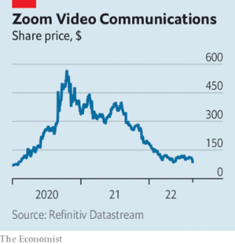  

#### 1.3 [KAL’s cartoon](https://www.economist.com/the-world-this-week/2022/08/25/kals-cartoon)
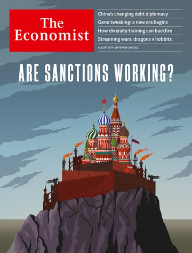  

### 2. Leaders
#### 2.1 _| Russia, geopolitics and the world economy:_ [Are sanctions on Russia working?](https://www.economist.com/leaders/2022/08/25/are-sanctions-working)  
The lessons from a new era of economic warfare  

#### 2.2 _| Impunity at bay:_ [A brazen kleptocrat has gone to jail in Malaysia. He must stay there](https://www.economist.com/leaders/2022/08/25/a-brazen-kleptocrat-has-gone-to-jail-in-malaysia-he-must-stay-there)  
Najib Razak’s comeuppance strengthens the rule of law, but could still be undone  

#### 2.3 _| Distressing debt:_ [How China should handle its bad loans to poor countries](https://www.economist.com/leaders/2022/08/25/how-china-should-handle-its-bad-loans-to-poor-countries)  
Time to work with Western creditors  

#### 2.4 _| Promises and power grabs:_ [Fiddling with constitutions is usually a risky distraction](https://www.economist.com/leaders/2022/08/25/fiddling-with-constitutions-is-usually-a-risky-distraction)  
Most of the time they should be left alone  

#### 2.5 _| Modification revolution:_ [Science has made a new genetic revolution possible](https://www.economist.com/leaders/2022/08/25/science-has-made-a-new-genetic-revolution-possible)  
Now let it flourish  

### 3. Letters
#### 3.1 _| On Russia and Ukraine, defence startups, energy bills, China and Taiwan, font selection, leisure time, currency conversions:_ [Letters to the editor](https://www.economist.com/letters/2022/08/25/letters-to-the-editor)  
A selection of correspondence  

### 4. By Invitation
#### 4.1 _| Russia and Ukraine:_ [The head of GCHQ says Vladimir Putin is losing the information war in Ukraine](https://www.economist.com/by-invitation/2022/08/18/the-head-of-gchq-says-vladimir-putin-is-losing-the-information-war-in-ukraine)  
Britain’s signals-intelligence service has helped to protect critical infrastructure, says Sir Jeremy Fleming  

#### 4.2 _| Russia and Ukraine:_ [Charles Knight on how the West can reduce the destructiveness of urban warfare](https://www.economist.com/by-invitation/2022/08/22/charles-knight-on-how-the-west-can-reduce-the-destructiveness-of-urban-warfare)  
The military expert says robotics and smoke offer an edge to Western soldiers  

### 5. Briefing
#### 5.1 _| Genetic therapy:_ [Gene therapies must become miracles of medicine](https://www.economist.com/briefing/2022/08/25/gene-therapies-must-become-miracles-of-medicine)  
Otherwise they might end up a niche treatment for a small number of patients in rich countries  
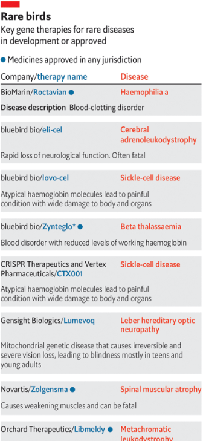  
  

### 6. Europe
#### 6.1 _| The manpower race:_ [Ukraine and Russia both need more soldiers](https://www.economist.com/europe/2022/08/25/ukraine-and-russia-both-need-more-soldiers)  
Who can train them faster?  

#### 6.2 _| Forging a nation:_ [Ukraine’s defiant independence day mocks Vladimir Putin](https://www.economist.com/europe/2022/08/25/ukraines-defiant-independence-day-mocks-vladimir-putin)  
The country marks its 31st anniversary even as it fights off Russian invaders  

#### 6.3 _| Lost in invasion:_ [Russian-speakers in Ukraine are struggling to learn a new tongue](https://www.economist.com/europe/2022/08/25/russian-speakers-in-ukraine-are-struggling-to-learn-a-new-tongue)  
The two languages are more different than Vladimir Putin pretends  

#### 6.4 _| Charlemagne:_ [As the war in Ukraine drags on, the costs for Europe are mounting](https://www.economist.com/europe/2022/08/25/as-the-war-in-ukraine-drags-on-the-costs-for-europe-are-mounting)  
Six months of fighting on its doorstep has strained the EU  

### 7. Britain
#### 7.1 _| The bill for the box:_ [Who should pay for the BBC?](https://www.economist.com/britain/2022/08/22/who-should-pay-for-the-bbc)  
The century-old funding mechanism for Britain’s public broadcaster is under attack  
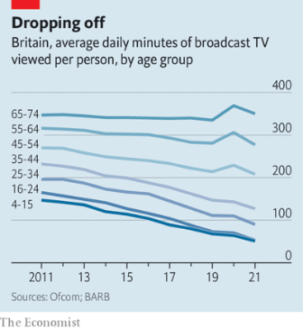  

#### 7.2 _| Electric shock:_ [Britain’s government wants to reform power markets](https://www.economist.com/britain/2022/08/25/britains-government-wants-to-reform-power-markets)  
It would eventually bring down energy bills, but won’t help this winter  

#### 7.3 _| Bashing the bean-counters:_ [Reducing the power of the Treasury is a good idea](https://www.economist.com/britain/2022/08/25/reducing-the-power-of-the-treasury-is-a-good-idea)  
Don’t break it up. But do give departments more freedom  

#### 7.4 _| A question of solvency:_ [In looser insurance rules, British politicians spy a Brexit dividend](https://www.economist.com/britain/2022/08/25/in-looser-insurance-rules-british-politicians-spy-a-brexit-dividend)  
If they expect a torrent of investment, they may be disappointed  

#### 7.5 _| Highly successful birds:_ [A few bird species are faring amazingly well in Britain](https://www.economist.com/britain/2022/08/25/a-few-bird-species-are-faring-amazingly-well-in-britain)  
That seems to be making them unpopular  
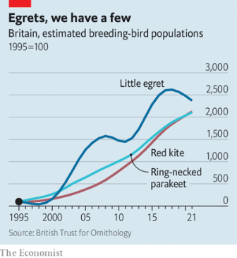  

#### 7.6 _| Back to school:_ [British parents need more help than ever to afford school uniforms](https://www.economist.com/britain/2022/08/25/british-parents-need-more-help-than-ever-to-afford-school-uniforms)  
Schools, suppliers and charities are trying to help  

#### 7.7 _| Bagehot:_ [Boris Johnson is likely to create many new peers](https://www.economist.com/britain/2022/08/25/boris-johnson-is-likely-to-create-many-new-peers)  
And in doing so make the House of Lords worse  

### 8. United States
#### 8.1 _| Inflation Acceleration Action:_ [Biden spends hundreds of billions on reducing student-loan debt](https://www.economist.com/united-states/2022/08/25/biden-spends-hundreds-of-billions-on-reducing-student-loan-debt)  
Good politics, maybe, but poor policy  

#### 8.2 _| State taxes:_ [States have historic amounts of leftover cash](https://www.economist.com/united-states/2022/08/25/states-have-historic-amounts-of-leftover-cash)  
Some are using it more carefully than others  
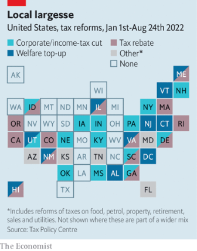  

#### 8.3 _| The usual suspects:_ [America’s new “national teacher shortage” is neither new nor national](https://www.economist.com/united-states/2022/08/21/americas-new-national-teacher-shortage-is-neither-new-nor-national)  
But it suits both Democrats and Republicans to play it up  

#### 8.4 _| Secret sauce:_ [Pink Sauce and the fashion for homemade food in America](https://www.economist.com/united-states/2022/08/25/pink-sauce-and-the-fashion-for-homemade-food-in-america)  
It has become easier to sell food from home. But the rules can be confusing  

#### 8.5 _| Housing policy:_ [American cities want rent control to rein in housing costs](https://www.economist.com/united-states/2022/08/25/american-cities-want-rent-control-to-rein-in-housing-costs)  
Economists still think they are a bad idea  
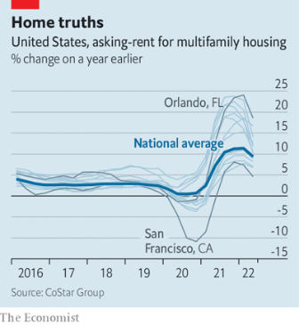  

#### 8.6 _| A bused people:_ [America’s border crisis reaches New York, by bus](https://www.economist.com/united-states/2022/08/25/americas-border-crisis-reaches-new-york-by-bus)  
A cruel ploy makes a fair point: immigration demands national attention  

### 9. Middle East & Africa
#### 9.1 _| Crumbling authority:_ [The ageing, ailing Palestinian leader does not do much governing](https://www.economist.com/middle-east-and-africa/2022/08/23/the-ageing-ailing-palestinian-leader-does-not-do-much-governing)  
Someone, some day, will have to replace Mahmoud Abbas  

#### 9.2 _| An alarming smell of gas:_ [Mediterranean gas sends sparks flying between Lebanon and Israel](https://www.economist.com/middle-east-and-africa/2022/08/21/mediterranean-gas-sends-sparks-flying-between-lebanon-and-israel)  
A row over exploration rights is turning violent  
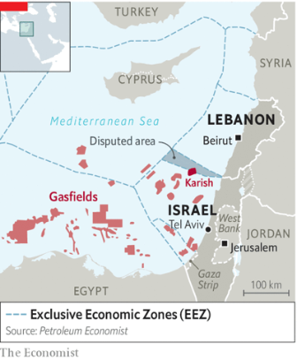  

#### 9.3 _| Eighty and waity:_ [The world’s oldest crown prince nears the throne of Kuwait](https://www.economist.com/middle-east-and-africa/2022/08/25/the-worlds-oldest-crown-prince-nears-the-throne-of-kuwait)  
Gerontocracy is holding the emirate back  

#### 9.4 _| Falling apart:_ [Two ethnic revolts rack Ethiopia at the same time](https://www.economist.com/middle-east-and-africa/2022/08/25/two-ethnic-revolts-rack-ethiopia-at-the-same-time)  
A country of 120m people is fraying  
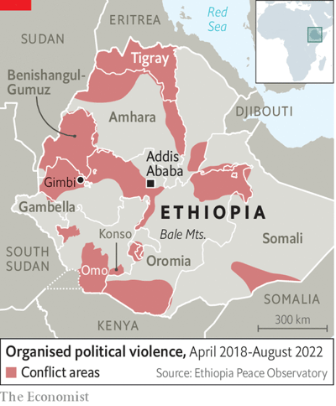  

#### 9.5 _| Alms and the boys:_ [Why so many religious students in Nigeria beg in the streets](https://www.economist.com/middle-east-and-africa/2022/08/25/why-so-many-religious-students-in-nigeria-beg-in-the-streets)  
Many Koranic teachers keep children out of formal schools  

### 10. The Americas
#### 10.1 _| Far behind, but gaining:_ [Brazil’s president, lagging in the polls, turns to God and cash](https://www.economist.com/the-americas/2022/08/25/brazils-president-lagging-in-the-polls-turns-to-god-and-cash)  
Weeks before an election, Jair Bolsonaro is 15 points behind his rival Lula  
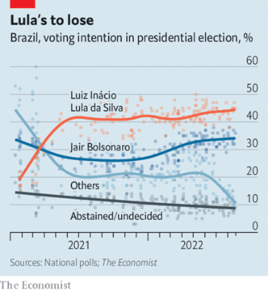  

#### 10.2 _| Kirchner karma:_ [Argentina’s vice-president could face 12 years in prison](https://www.economist.com/the-americas/2022/08/25/argentinas-vice-president-could-face-12-years-in-prison)  
Cristina Fernández de Kirchner, a former president, is accused of corruption  

#### 10.3 _| Federal offence:_ [Brazil’s governors have been emboldened under Jair Bolsonaro](https://www.economist.com/the-americas/2022/08/25/brazils-governors-have-been-emboldened-under-jair-bolsonaro)  
But their attempts to move into national politics have worked less well  

### 11. Asia
#### 11.1 _| 5-0:_ [Malaysia’s disgraced former prime minister is going to prison](https://www.economist.com/asia/2022/08/23/malaysias-disgraced-former-prime-minister-is-going-to-prison)  
Najib Razak is out of appeals and out of luck  

#### 11.2 _| Party in the back:_ [The mullet’s resurgence divides Australia](https://www.economist.com/asia/2022/08/25/the-mullets-resurgence-divides-australia)  
The controversial hairstyle is either an embarrassment or a point of national pride—or both  

#### 11.3 _| Uncertain terms:_ [Thailand’s constitutional court suspends the prime minister](https://www.economist.com/asia/2022/08/25/thailands-constitutional-court-suspends-the-prime-minister)  
Prayuth Chan-ocha has run the country for eight years. Or is it five? Maybe three?  

#### 11.4 _| On the back foot:_ [Pakistan’s government wields anti-terror laws against Imran Khan](https://www.economist.com/asia/2022/08/25/pakistans-government-wields-anti-terror-laws-against-imran-khan)  
The former prime minister has made powerful enemies since he was booted from office in April  

#### 11.5 _| Banyan:_ [South Korea’s president needs to learn the basics](https://www.economist.com/asia/2022/08/25/south-koreas-president-needs-to-learn-the-basics)  
Politics is as much about presentation as policy  

### 12. China
#### 12.1 _| Party’s over:_ [Faced with an overseas debt crisis, will China change its ways?](https://www.economist.com/china/2022/08/24/faced-with-an-overseas-debt-crisis-will-china-change-its-ways)  
It may have no choice  
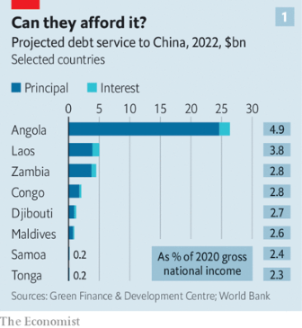  
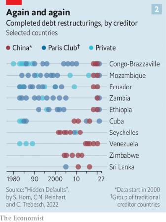  
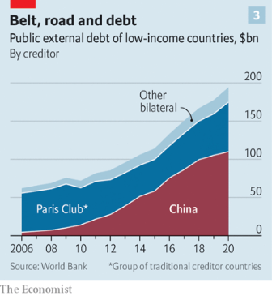  

#### 12.2 _| Grumble at your own risk:_ [China’s Communist Party says it welcomes complaints](https://www.economist.com/china/2022/08/25/chinas-communist-party-says-it-welcomes-complaints)  
Just don’t go too far  

#### 12.3 _| No-fly zone:_ [Most flights into and out of China remain grounded](https://www.economist.com/china/2022/08/25/most-flights-into-and-out-of-china-remain-grounded)  
While the rest of world is flying again  

### 13. International
#### 13.1 _| The temptation to tinker:_ [Dictators and utopians are fond of fiddling with constitutions](https://www.economist.com/international/2022/08/25/dictators-and-utopians-are-fond-of-fiddling-with-constitutions)  
Both are bad, though for different reasons  
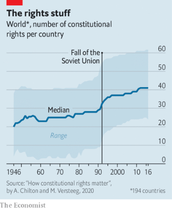  

### 14. Business
#### 14.1 _| Blasted are the dealmakers:_ [Firms’ unwise addiction to mergers and acquisitions](https://www.economist.com/business/2022/08/24/firms-unwise-addiction-to-mergers-and-acquisitions)  
A bumper year for dealmaking is likely to result in a painful hangover  
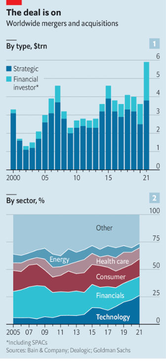  

#### 14.2 _| Dragons against hobbits:_ [“Game of Thrones” v “Lord of the Rings”: a tale of old v new Hollywood](https://www.economist.com/business/2022/08/21/game-of-thrones-v-lord-of-the-rings-a-tale-of-old-v-new-hollywood)  
A century-old studio wages a big-budget war against a streaming upstart  
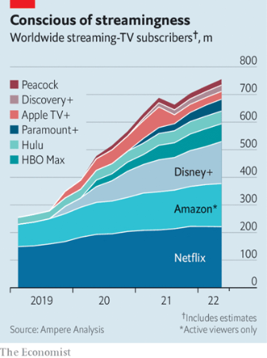  

#### 14.3 _| Heated exchange:_ [A drought in China hits industry](https://www.economist.com/business/2022/08/25/a-drought-in-china-hits-industry)  
The ill effects of hot weather and drought  

#### 14.4 _| Bartleby:_ [Is travelling to work always a waste of time?](https://www.economist.com/business/2022/08/25/is-travelling-to-work-always-a-waste-of-time)  
In defence of commuting  

#### 14.5 _| Tropical Depression:_ [South-East Asia’s tech firms take a battering](https://www.economist.com/business/2022/08/25/south-east-asias-tech-firms-take-a-battering)  
Low investment is compounded by turn against unprofitable growth stocks  
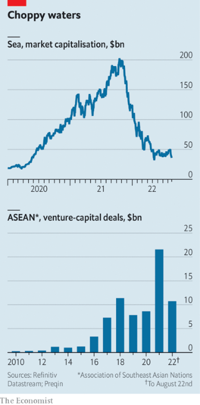  

#### 14.6 _| Sending it back:_ [A tidal wave of returns hits the e-commerce industry](https://www.economist.com/business/2022/08/25/a-tidal-wave-of-returns-hits-the-e-commerce-industry)  
For retailers it is a tricky and expensive problem  

#### 14.7 _| Schumpeter:_ [Could the demonised oil industry become a force for decarbonisation?](https://www.economist.com/business/2022/08/25/could-the-demonised-oil-industry-become-a-force-for-decarbonisation)  
That may be what Warren Buffett sees in Occidental Petroleum  

### 15. Finance & economics
#### 15.1 _| A one-way ticket to nowhere:_ [Western sanctions will eventually impair Russia’s economy](https://www.economist.com/finance-and-economics/2022/08/24/western-sanctions-will-eventually-impair-russias-economy)  
The most potent are the least talked about  
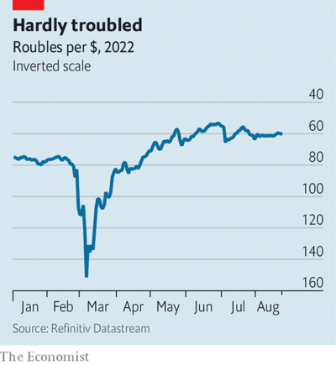  

#### 15.2 _| Mates’ rates:_ [The connection between Russian sanctions and bizarre Turkish monetary policy](https://www.economist.com/finance-and-economics/2022/08/25/the-connection-between-russian-sanctions-and-bizarre-turkish-monetary-policy)  
Russian cash has uses beyond the obvious  

#### 15.3 _| Grin and bear it:_ [Why the Russian economy keeps beating expectations](https://www.economist.com/finance-and-economics/2022/08/23/why-the-russian-economy-keeps-beating-expectations)  
Few thought it would be holding up six months into the war  
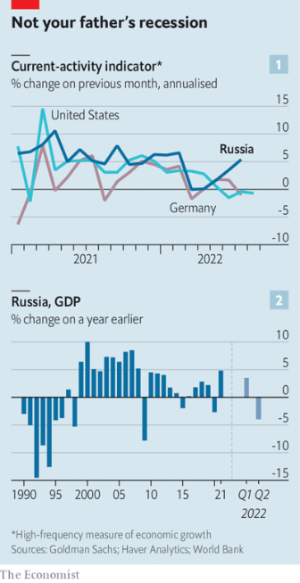  
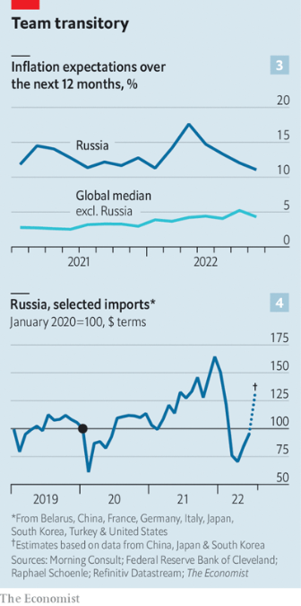  

#### 15.4 _| Commodities:_ [Against expectations, global food prices have tumbled](https://www.economist.com/finance-and-economics/2022/08/22/against-expectations-global-food-prices-have-tumbled)  
Why the war in Ukraine has caused less disruption than feared  
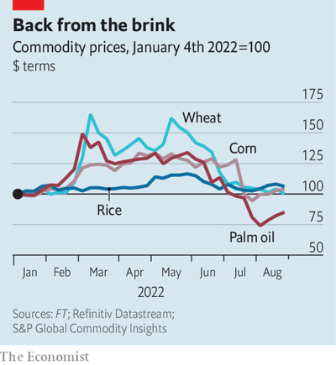  

#### 15.5 _| Animal spirits:_ [The hedge-fund manager who embodied an era](https://www.economist.com/finance-and-economics/2022/08/25/the-hedge-fund-manager-who-embodied-an-era)  
Julian Robertson was a jock; today’s funds are run by nerds  

#### 15.6 _| Free exchange:_ [How to avoid energy rationing](https://www.economist.com/finance-and-economics/2022/08/25/how-to-avoid-energy-rationing)  
Politicians should pay attention to the latest economic literature  

### 16. Science & technology
#### 16.1 _| GM soya and photosynthesis:_ [A genetic tweak that makes soya plants 20% more productive](https://www.economist.com/science-and-technology/2022/08/24/a-genetic-tweak-that-makes-soya-plants-20-more-productive)  
It improves their ability to photosynthesise  

#### 16.2 _| Electric vehicles:_ [Swappable batteries for electric vans and lorries make sense](https://www.economist.com/science-and-technology/2022/08/24/swappable-batteries-for-electric-vans-and-lorries-make-sense)  
Car drivers, though, will probably want to keep recharging  

#### 16.3 _| Sulphur and oil:_ [In the world of greenery, no good deed goes unpunished](https://www.economist.com/science-and-technology/2022/08/24/in-the-world-of-greenery-no-good-deed-goes-unpunished)  
Reducing oil consumption may make sulphur production more polluting  

#### 16.4 _| The Space Launch System:_ [NASA’s Space Launch System is yesterday’s rocket](https://www.economist.com/science-and-technology/2022/08/24/nasas-space-launch-system-is-yesterdays-rocket)  
It is powered by yesterday’s technology and brought about by yesterday’s thinking  

### 17. Culture
#### 17.1 _| Monumental art:_ [A vast sculpture in the Nevada desert is finished at last](https://www.economist.com/culture/2022/08/20/a-vast-sculpture-in-the-nevada-desert-is-finished-at-last)  
Was Michael Heizer’s “City” worth 50 years of effort?  

#### 17.2 _| Urban fiction:_ [In Amit Chaudhuri’s new novel, an Indian writer visits Berlin](https://www.economist.com/culture/2022/08/25/in-amit-chaudhuris-new-novel-an-indian-writer-visits-berlin)  
The narrator of “Sojourn” takes in the city as his inner self crumbles  

#### 17.3 _| Home Entertainment:_ [Revisit the musings of the greatest writer in the German language](https://www.economist.com/culture/2022/08/25/revisit-the-musings-of-the-greatest-writer-in-the-german-language)  
A new edition of “Conversations with Goethe” attests to his genius and charisma  

#### 17.4 _| There will be blood:_ [An epic history of oil from ancient times to the first world war](https://www.economist.com/culture/2022/08/25/an-epic-history-of-oil-from-ancient-times-to-the-first-world-war)  
There are few clean hands in “A Pipeline Runs Through It”  

#### 17.5 _| Immigration and xenophobia:_ [When Klansmen in Texas targeted Vietnamese fishermen](https://www.economist.com/culture/2022/08/25/when-klansmen-in-texas-targeted-vietnamese-fishermen)  
The tensions in “The Fishermen and the Dragon” are queasily topical today  

#### 17.6 _| Johnson:_ [The struggle to preserve regional languages](https://www.economist.com/culture/2022/08/25/the-struggle-to-preserve-regional-languages)  
Activists in the Basque Country and elsewhere have triumphed—within limits  

### 18. Economic & financial indicators
#### 18.1 [Economic data, commodities and markets](https://www.economist.com/economic-and-financial-indicators/2022/08/25/economic-data-commodities-and-markets)
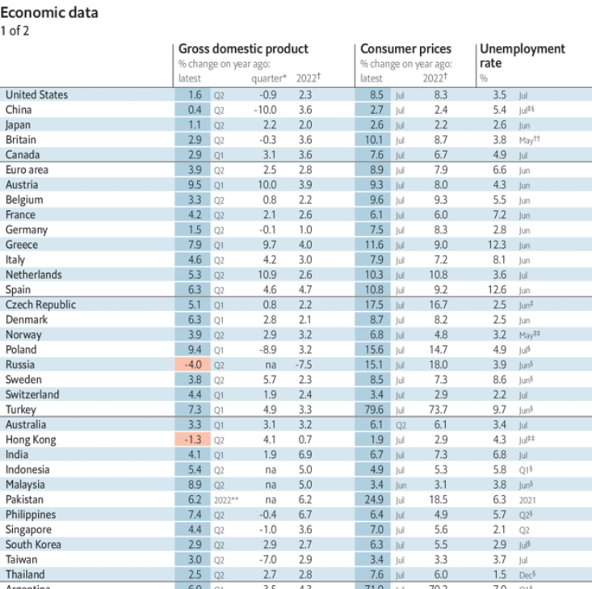  
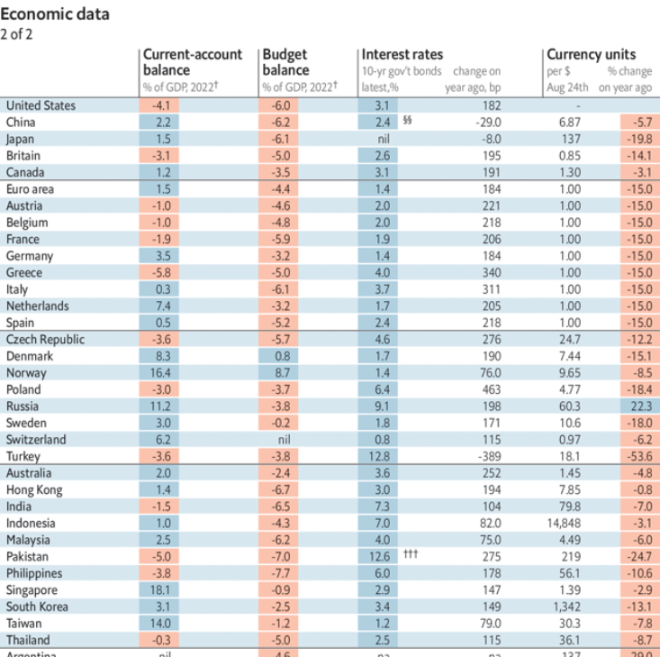  
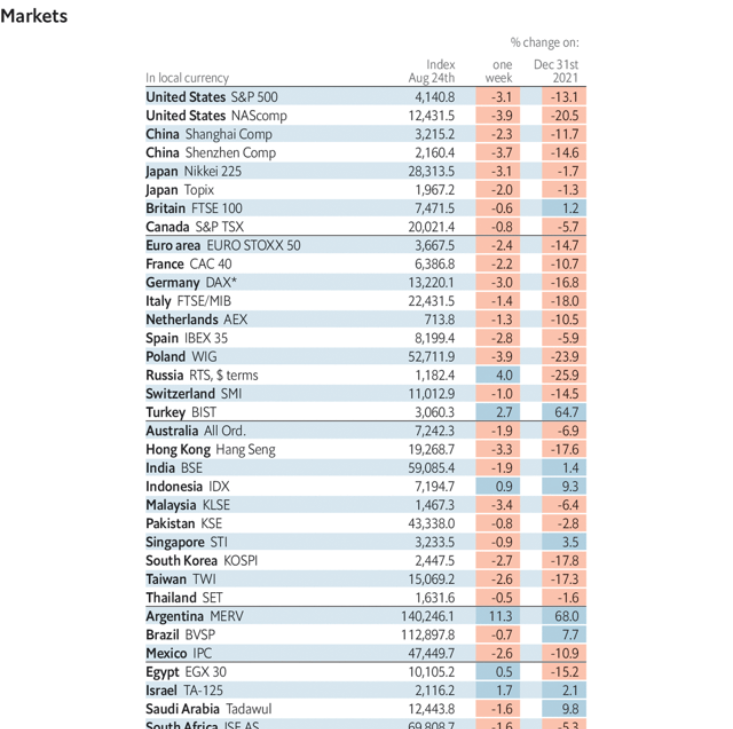  
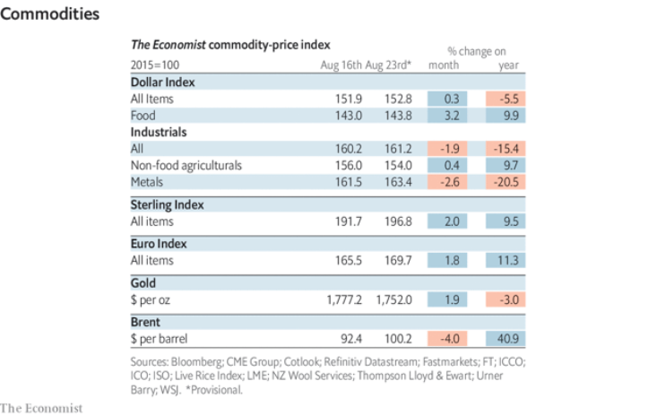  

### 19. Graphic detail
#### 19.1 _| Diversity training:_ [Workplace diversity programmes often fail, or backfire](https://www.economist.com/graphic-detail/2022/08/25/workplace-diversity-programmes-often-fail-or-backfire)  
Many may do more to protect against litigation than to reduce discrimination  
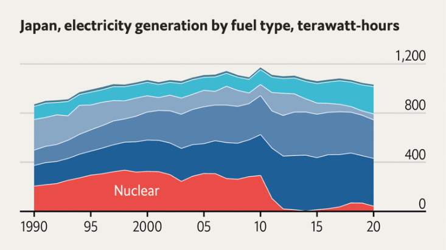  
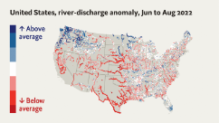  
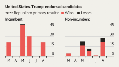  

### 20. The Economist explains
#### 20.1 [What is at stake at Ukraine’s Zaporizhia nuclear plant](https://www.economist.com/the-economist-explains/2022/08/19/what-is-at-stake-at-ukraines-zaporizhia-nuclear-plant)
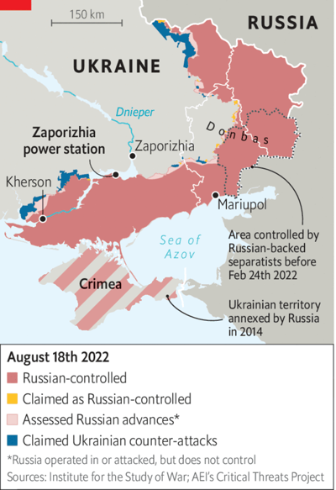  

#### 20.2 [Why has polio returned to London and New York?](https://www.economist.com/the-economist-explains/2022/08/19/why-has-polio-returned-to-london-and-new-york)

### 21. Obituary
#### 21.1 _| What freedom means:_ [Albert Woodfox found his true self in prison](https://www.economist.com/obituary/2022/08/25/albert-woodfox-found-his-true-self-in-prison)  
The man who endured the longest period of solitary confinement in American prison history died on August 5th, aged 75  

