### 1. The world this week
#### 1.1 [Politics](https://www.economist.com/the-world-this-week/2022/09/01/politics)

#### 1.2 [Business](https://www.economist.com/the-world-this-week/2022/09/01/business)
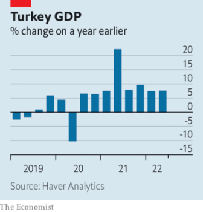  

#### 1.3 [KAL’s cartoon](https://www.economist.com/the-world-this-week/2022/09/01/kals-cartoon)
  

### 2. Leaders
#### 2.1 [The disunited states](https://www.economist.com/leaders/2022/09/01/american-states-are-now-petri-dishes-of-polarisation)

#### 2.2 [Keeping the lights on](https://www.economist.com/leaders/2022/09/01/how-to-prevent-europes-energy-crunch-spiralling-into-an-economic-crisis)
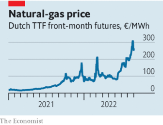  

#### 2.3 [The man who ended an empire](https://www.economist.com/leaders/2022/08/31/mikhail-gorbachev-liberated-millions-even-if-he-didnt-set-out-to)

#### 2.4 [Zoom fatigue](https://www.economist.com/leaders/2022/09/01/the-tech-winners-and-losers-of-the-pandemic)
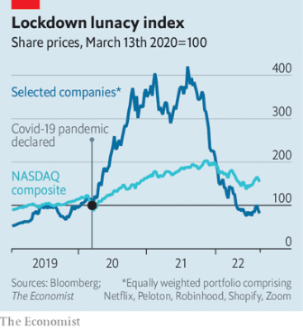  

#### 2.5 [Get ready for the rains](https://www.economist.com/leaders/2022/09/01/what-flood-hit-pakistan-should-learn-from-bangladesh)

#### 2.6 [Free the bulldozers](https://www.economist.com/leaders/2022/09/01/britains-failure-to-build-is-throttling-its-economy)

### 3. Letters
#### 3.1 [On electric cars, forest fires, mustard, management, cigarettes, cutting weeds, voters](https://www.economist.com/letters/2022/09/01/letters-to-the-editor)

### 4. By Invitation
#### 4.1 [Now China has changed its policy towards Taiwan, America should too: Senator Chris Murphy](https://www.economist.com/by-invitation/2022/09/01/now-china-has-changed-its-policy-towards-taiwan-america-should-too-senator-chris-murphy)

#### 4.2 [Marwan Muasher argues that Jordan needs to implement reforms urgently—not just plan them](https://www.economist.com/by-invitation/2022/08/24/marwan-muasher-argues-that-jordan-needs-to-implement-reforms-urgently-not-just-plan-them)

#### 4.3 [Championing global trade is in America’s national interest, says Evan Greenberg](https://www.economist.com/by-invitation/2022/08/31/championing-global-trade-is-in-americas-national-interest-says-evan-greenberg)

### 5. Briefing
#### 5.1 [A house divided](https://www.economist.com/interactive/briefing/2022/09/03/american-policy-is-splitting-state-by-state-into-two-blocs)

### 6. Europe
#### 6.1 [The game’s afoot](https://www.economist.com/europe/2022/08/29/ukraine-starts-a-push-to-recapture-kherson-a-crucial-russian-occupied-city)
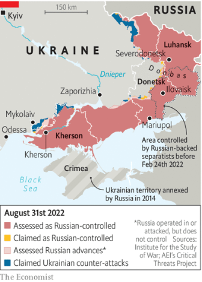  

#### 6.2 [Taking the fight to the next level](https://www.economist.com/europe/2022/09/01/italys-election-and-the-war-against-corruption)
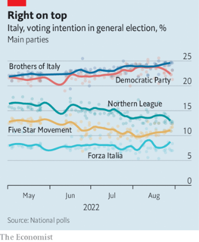  

#### 6.3 [Only yes is yes](https://www.economist.com/europe/2022/09/01/spain-acts-to-protect-women)

#### 6.4 [Sober business](https://www.economist.com/europe/2022/09/01/what-can-clean-up-magaluf)

#### 6.5 [Here to stay?](https://www.economist.com/europe/2022/09/01/ukrainian-refugees-are-making-poland-multicultural-again)
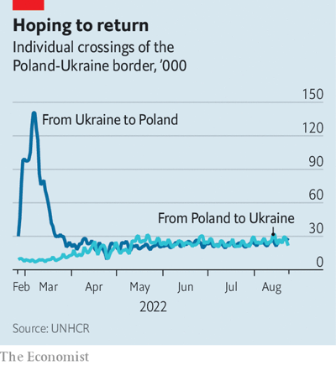  
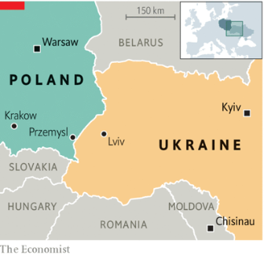  

#### 6.6 [Digital overreach?](https://www.economist.com/europe/2022/09/01/is-the-eu-overreaching-with-new-digital-regulations)

### 7. Britain
#### 7.1 [Britain can’t build](https://www.economist.com/britain/2022/09/01/why-britain-cannot-build-enough-of-anything)
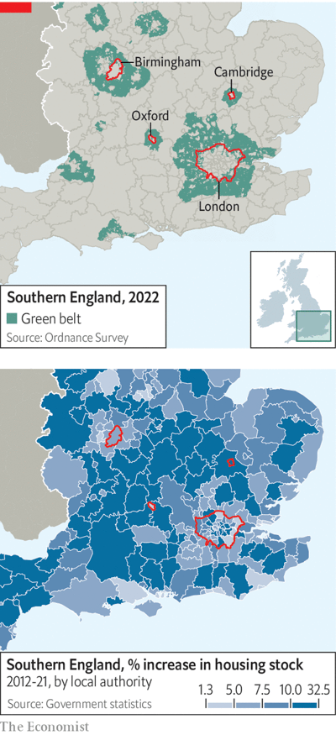  

#### 7.2 [Glue sticks](https://www.economist.com/britain/2022/09/01/britons-are-extremely-good-at-paralysing-infrastructure-projects)

#### 7.3 [Simultaneous equations](https://www.economist.com/britain/2022/09/01/britains-school-budgets-are-being-squeezed-by-rising-energy-and-wage-bills)

#### 7.4 [Odd man out](https://www.economist.com/britain/2022/09/01/one-of-britains-most-important-professions-lacks-men)

#### 7.5 [Hard as stone](https://www.economist.com/britain/2022/09/01/egyptians-want-britain-to-return-the-rosetta-stone)

### 8. United States
#### 8.1 [Hot and not too bothered](https://www.economist.com/united-states/2022/09/01/heatwaves-kill-more-americans-than-hurricanes-tornadoes-and-floods)
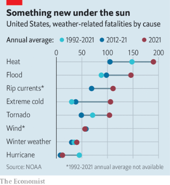  

#### 8.2 [Rocky Mountain high ground](https://www.economist.com/united-states/2022/09/01/colorados-senate-race-may-offer-republicans-an-alternative-to-trumpism)

#### 8.3 [ADDing up](https://www.economist.com/united-states/2022/08/29/booming-telehealth-medicine-is-opening-access-to-treatment-for-mental-health)

#### 8.4 [Out of a jam](https://www.economist.com/united-states/2022/09/01/americas-most-congested-city-may-be-on-the-verge-of-ending-gridlock)

#### 8.5 [A rapacity for carapaces](https://www.economist.com/united-states/2022/09/01/in-america-crab-blood-remains-vital-for-drug-and-vaccine-making)

#### 8.6 [See life](https://www.economist.com/united-states/2022/09/01/new-yorks-waters-are-being-reborn)

### 9. Middle East & Africa
#### 9.1 [Coalitions of the unwilling](https://www.economist.com/middle-east-and-africa/2022/09/01/the-future-of-south-african-politics-is-in-coalitions)

#### 9.2 [Underwater cities](https://www.economist.com/middle-east-and-africa/2022/09/01/every-year-heavy-rain-brings-misery-and-gridlock-to-west-africa)
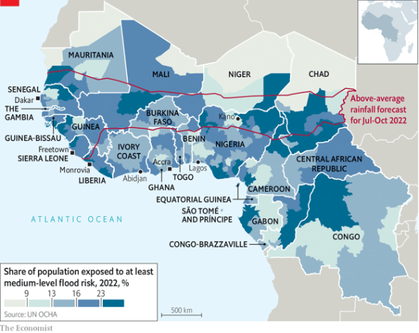  

#### 9.3 [Preparing for a long fight](https://www.economist.com/middle-east-and-africa/2022/09/01/mozambiques-resilient-jihadists)
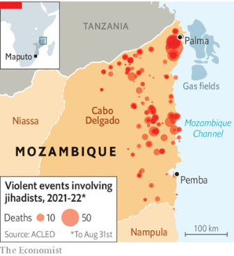  

#### 9.4 [Why sun and wind need harnessing](https://www.economist.com/middle-east-and-africa/2022/09/01/why-egypts-plans-for-solar-power-are-left-in-the-shade)
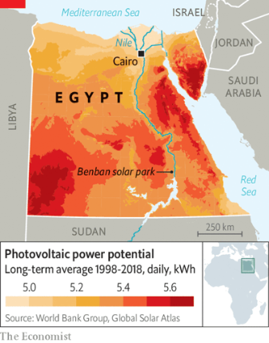  

#### 9.5 [Militias amok](https://www.economist.com/middle-east-and-africa/2022/08/31/iraqs-political-deadlock-turns-violent)

### 10. The Americas
#### 10.1 [Narco nastiness](https://www.economist.com/the-americas/2022/09/01/several-violent-episodes-in-mexico-suggest-a-worrying-trend)
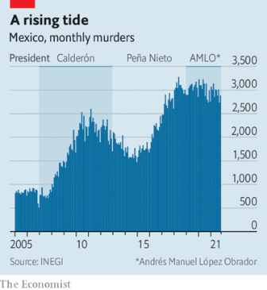  
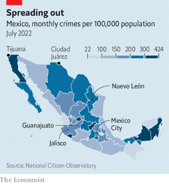  

#### 10.2 [Dusty weather](https://www.economist.com/the-americas/2022/09/01/traditional-farming-practices-are-being-boosted-in-guatemala)

#### 10.3 [Mule got mail](https://www.economist.com/the-americas/2022/09/01/ecuador-has-a-backlog-of-1m-letters-and-parcels)

### 11. Asia
#### 11.1 [Under water](https://www.economist.com/asia/2022/08/30/pakistan-has-been-hit-by-its-worst-floods-in-recent-memory)
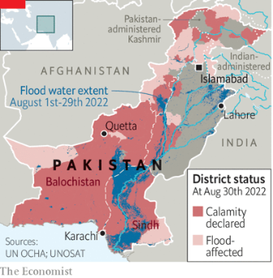  

#### 11.2 [Daughters of the soil](https://www.economist.com/asia/2022/09/01/young-koreans-are-moving-to-the-countryside-to-farm)

#### 11.3 [Grid locked](https://www.economist.com/asia/2022/09/01/can-south-east-asian-countries-learn-to-share-power)
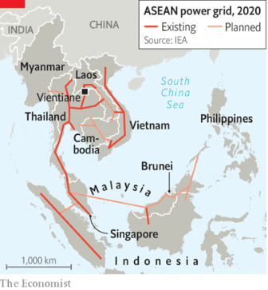  

#### 11.4 [Decline and punishment](https://www.economist.com/asia/2022/09/01/japans-prisons-are-adapting-to-cope-with-ageing-inmates)

#### 11.5 [Rule the waves](https://www.economist.com/asia/2022/08/29/media-freedom-in-india-is-under-threat-again)

### 12. China
#### 12.1 [The perils of “peak China”](https://www.economist.com/china/2022/09/01/a-weak-china-may-be-more-warlike-than-a-strong-one)

#### 12.2 [Just passing by](https://www.economist.com/china/2022/09/01/american-warships-go-through-the-taiwan-strait)
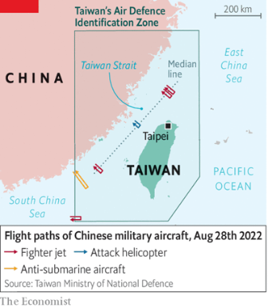  

#### 12.3 [Took you long enough](https://www.economist.com/china/2022/09/01/a-long-awaited-un-report-condemns-chinas-actions-in-xinjiang)

#### 12.4 [An art factory in decline](https://www.economist.com/china/2022/09/01/the-artists-of-dafen-can-paint-like-van-gogh)

### 13. International
#### 13.1 [Food for thought](https://www.economist.com/international/2022/09/01/should-every-schoolchild-eat-free)
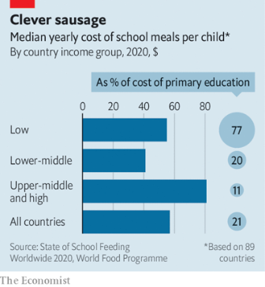  

### 14. Business
#### 14.1 [Margin brawl](https://www.economist.com/business/2022/08/29/the-cloud-computing-giants-are-vying-to-protect-fat-profits)
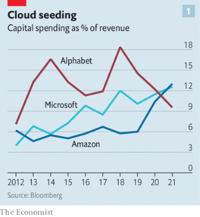  
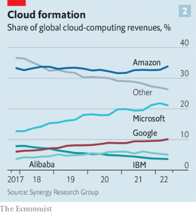  

#### 14.2 [The AA economy](https://www.economist.com/business/2022/09/01/adani-v-ambani-the-battle-of-the-tycoons)
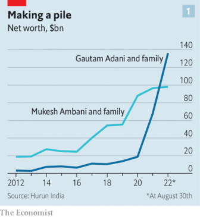  
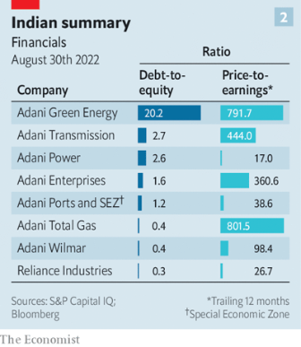  

#### 14.3 [Throwing a jab](https://www.economist.com/business/2022/09/01/a-dispute-over-covid-vaccine-technology-ends-up-in-court)

#### 14.4 [Talking it over](https://www.economist.com/business/2022/09/01/is-there-a-point-to-exit-interviews)

#### 14.5 [Seeing through the chip cycle](https://www.economist.com/business/2022/09/01/is-nvidia-underestimating-the-chip-crunch)

### 15. Finance & economics
#### 15.1 [A narrowing path](https://www.economist.com/finance-and-economics/2022/08/31/europe-is-heading-for-recession-how-bad-will-it-be)
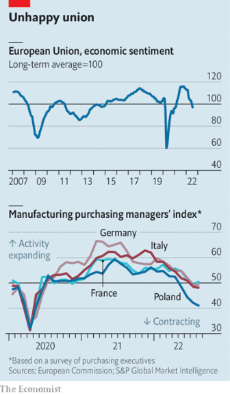  

#### 15.2 [Lines of defence](https://www.economist.com/finance-and-economics/2022/09/01/europe-scrambles-to-protect-consumers-against-dizzying-energy-prices)

#### 15.3 [Powerful prices](https://www.economist.com/finance-and-economics/2022/08/30/vast-corporate-profits-are-delaying-an-american-recession)
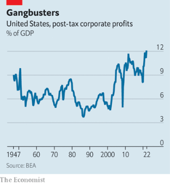  

#### 15.4 [Financial recoupling](https://www.economist.com/finance-and-economics/2022/09/01/china-and-americas-long-awaited-audit-deal-may-yet-fail)

#### 15.5 [Ready to rumble](https://www.economist.com/finance-and-economics/2022/09/01/distressed-debt-investors-are-preparing-to-pounce)
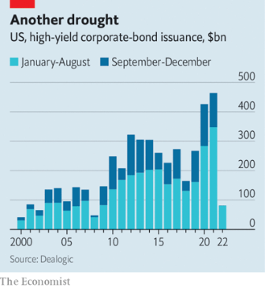  

#### 15.6 [The missing pandemic boom](https://www.economist.com/finance-and-economics/2022/08/28/the-missing-pandemic-innovation-boom)
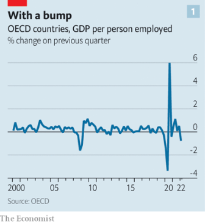  
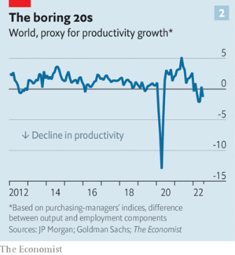  

#### 15.7 [Head in the ichimoku cloud](https://www.economist.com/finance-and-economics/2022/09/01/why-investors-are-reaching-for-the-astrology-of-finance)

#### 15.8 [Vertiginous views](https://www.economist.com/finance-and-economics/2022/08/30/central-bankers-worry-that-a-new-era-of-high-inflation-is-beginning)

### 16. Science & technology
#### 16.1 [Lurkers below](https://www.economist.com/science-and-technology/2022/08/31/mines-are-the-neglected-workhorses-of-naval-strategy)

#### 16.2 [Gooey goings on](https://www.economist.com/science-and-technology/2022/08/31/a-gooey-way-to-3d-print-plastics)

#### 16.3 [Undisposable somas](https://www.economist.com/science-and-technology/2022/08/31/the-genes-of-a-jellyfish-show-how-to-live-forever)

#### 16.4 [Synthetic mouse embryos](https://www.economist.com/science-and-technology/2022/08/31/mouse-embryoids-can-now-be-grown-from-stem-cells)

### 17. Culture
#### 17.1 [Flight for life](https://www.economist.com/culture/2022/09/01/climate-change-may-lead-to-staggering-levels-of-migration)

#### 17.2 [Risky business](https://www.economist.com/culture/2022/09/01/solito-offers-a-childs-eye-view-of-the-perilous-trek-to-america)

#### 17.3 [Soto speak](https://www.economist.com/culture/2022/09/01/indonesian-food-is-delicious-but-little-known)

#### 17.4 [In the head, not on it](https://www.economist.com/culture/2022/09/01/expected-goals-explains-how-data-changed-football)

#### 17.5 [The gondolier’s smile](https://www.economist.com/culture/2022/08/31/the-summer-holidays-are-over-but-why-go-away-at-all)

#### 17.6 [Escape from Tinseltown](https://www.economist.com/culture/2022/09/01/the-rise-and-rise-of-a24-a-champion-of-storytelling-on-screen)

### 18. Economic & financial indicators
#### 18.1 [Economic data, commodities and markets](https://www.economist.com/economic-and-financial-indicators/2022/09/01/economic-data-commodities-and-markets)
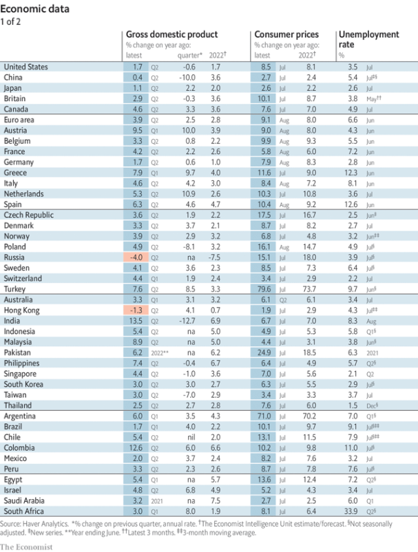  
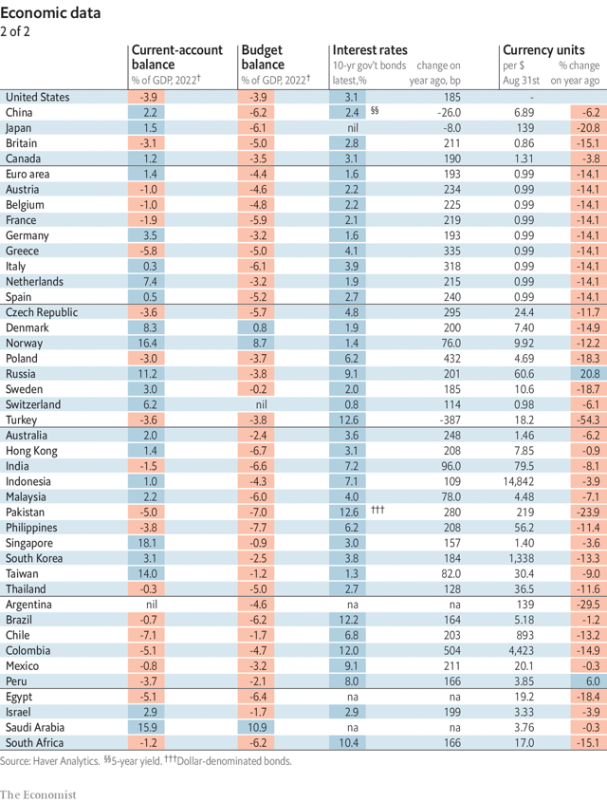  
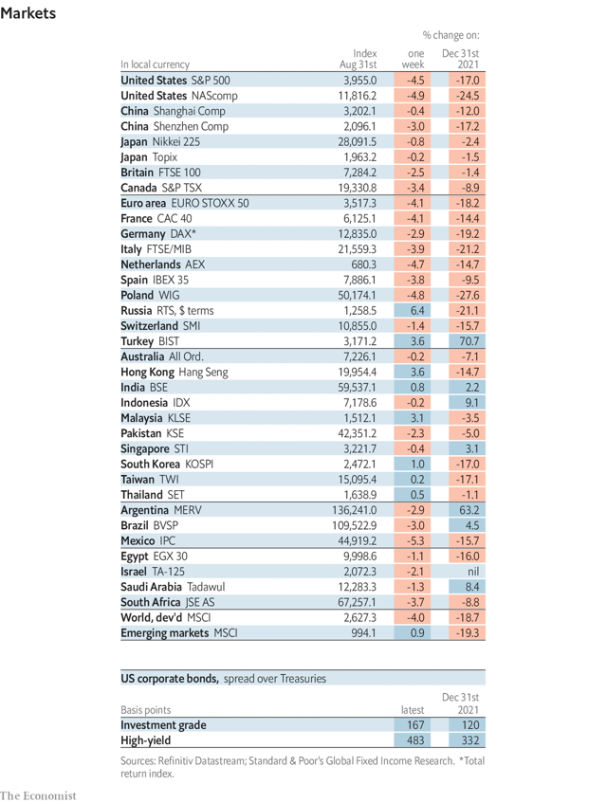  
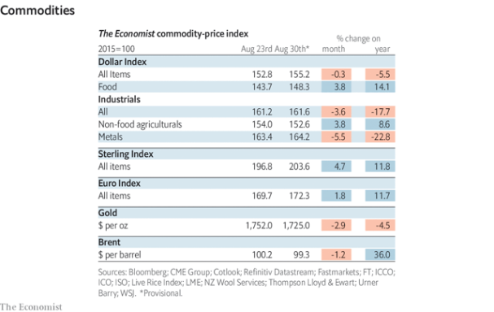  

### 19. Graphic detail
#### 19.1 [Follow the money](https://www.economist.com/graphic-detail/2022/09/01/fundraising-remains-predictive-of-success-in-congressional-elections)
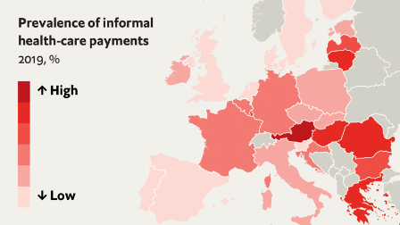  
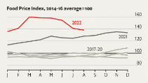  
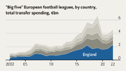  

### 20. The Economist explains
#### 20.1 [Why does Kherson matter?](https://www.economist.com/the-economist-explains/2022/08/30/why-does-kherson-matter)
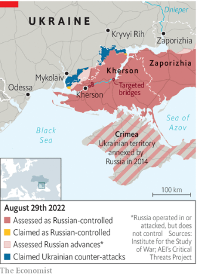  

#### 20.2 [What is executive privilege?](https://www.economist.com/the-economist-explains/2022/08/31/what-is-executive-privilege)

### 21. Obituary
#### 21.1 [The architect of dissolution](https://www.economist.com/obituary/2022/08/30/mikhail-gorbachev-did-not-mean-the-soviet-union-to-end-that-way)

