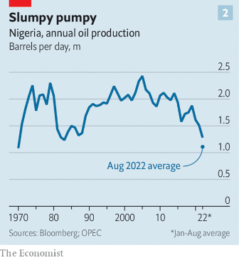
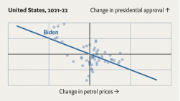

### 1. The world this week
#### 1.1 [Politics](https://www.economist.com/the-world-this-week/2022/09/15/politics)

#### 1.2 [Business](https://www.economist.com/the-world-this-week/2022/09/15/business)
  

#### 1.3 [KAL’s cartoon](https://www.economist.com/the-world-this-week/2022/09/15/kals-cartoon)
  

### 2. Leaders
#### 2.1 [Getting the job done](https://www.economist.com/leaders/2022/09/15/vladimir-putins-war-is-failing-the-west-should-help-it-fail-faster)

#### 2.2 [Into the Carolean era](https://www.economist.com/leaders/2022/09/15/why-the-monarchy-matters)

#### 2.3 [The perils of wishful thinking](https://www.economist.com/leaders/2022/09/14/to-fix-americas-inflation-problem-the-federal-reserve-must-go-big)
  

#### 2.4 [House on fire](https://www.economist.com/leaders/2022/09/15/chinas-property-crisis-hasnt-gone-away-it-is-getting-worse)

#### 2.5 [Getting away with murder](https://www.economist.com/leaders/2022/09/15/america-should-reform-its-police-forces-not-defund-them)

### 3. Letters
#### 3.1 [On big tech in the EU, the Soviet Union, museums, farming, planning](https://www.economist.com/letters/2022/09/15/letters-to-the-editor)

### 4. By Invitation
#### 4.1 [A.N. Wilson on the art of Queen Elizabeth II’s communication](https://www.economist.com/by-invitation/2022/09/15/an-wilson-on-the-art-of-queen-elizabeth-iis-communication)

### 5. Europe
#### 5.1 [Chasing the bear away](https://www.economist.com/europe/2022/09/15/a-stunning-counter-offensive-by-ukraines-armed-forces)
  

#### 5.2 [Setting sun](https://www.economist.com/europe/2022/09/15/russian-discontent-with-the-war-and-vladimir-putin-is-growing)

#### 5.3 [Strife on the right](https://www.economist.com/europe/2022/09/15/italys-probable-next-government-contains-many-tensions)
  

#### 5.4 [Injudicious](https://www.economist.com/europe/2022/09/15/spanish-politicians-are-arguing-over-judges)

#### 5.5 [Macron’s gamble](https://www.economist.com/europe/2022/09/15/frances-president-emmanuel-macron-gets-back-to-work)

#### 5.6 [A very political canal](https://www.economist.com/europe/2022/09/15/poland-opens-a-propaganda-heavy-canal)
  

#### 5.7 [Opening the door](https://www.economist.com/europe/2022/09/15/demonising-nationalist-parties-has-not-stemmed-their-rise-in-europe)

### 6. Britain
#### 6.1 [Something in the ether](https://www.economist.com/britain/2022/09/14/how-the-death-of-elizabeth-ii-has-affected-britain)

#### 6.2 [Neighbourly relations](https://www.economist.com/britain/2022/09/15/the-queen-helped-effect-a-change-in-anglo-irish-relations)

#### 6.3 [What sort of king will Charles be?](https://www.economist.com/britain/2022/09/15/what-sort-of-king-will-charles-iii-be)

#### 6.4 [The end of an era](https://www.economist.com/briefing/2022/09/08/britains-longest-serving-ruler-strengthened-the-monarchy)

#### 6.5 [Fewer children, fewer coalminers, less cabbage](https://www.economist.com/britain/2022/09/08/how-britain-has-changed-since-elizabeth-ii-was-crowned-in-1953)

#### 6.6 [Realms and republics](https://www.economist.com/international/2022/09/09/the-commonwealth-will-miss-queen-elizabeth)

#### 6.7 [Before politics paused](https://www.economist.com/britain/2022/09/15/an-officials-defenestration-rattles-the-treasury)

#### 6.8 [What would Walter say?](https://www.economist.com/britain/2022/09/14/the-monarchys-secret-weapon-insincerity)

### 7. United States
#### 7.1 [America Inc](https://www.economist.com/united-states/2022/09/13/joe-bidens-industrial-policy-is-big-bold-and-fraught-with-difficulty)
  

#### 7.2 [Will the polls misfire again?](https://www.economist.com/united-states/2022/09/15/will-americas-polls-misfire-again)
  

#### 7.3 [California goes universal](https://www.economist.com/united-states/2022/09/15/america-wide-universal-pre-school-is-dead-but-california-forges-ahead)

#### 7.4 [Bucking modernity](https://www.economist.com/united-states/2022/09/15/a-rodeo-in-oregon-encapsulates-the-old-wild-west)

#### 7.5 [Looking beyond GDP](https://www.economist.com/united-states/2022/09/15/the-biden-administration-aims-to-quantify-the-costs-of-ecological-decay)

#### 7.6 [The other MAGA](https://www.economist.com/united-states/2022/09/15/a-grassroots-group-is-channelling-public-frustration-in-texas)

#### 7.7 [Hillbilly effigy](https://www.economist.com/united-states/2022/09/15/how-the-left-and-jd-vance-learnt-to-despise-each-other)

### 8. Middle East & Africa
#### 8.1 [Steal it, burn it, lose it](https://www.economist.com/middle-east-and-africa/2022/09/11/how-oil-rich-nigeria-failed-to-profit-from-an-oil-boom)
  
  

#### 8.2 [The ones who sweep](https://www.economist.com/middle-east-and-africa/2022/09/15/in-the-gulf-99-of-kenyan-migrant-workers-are-abused-a-poll-finds)
  

#### 8.3 [Going global](https://www.economist.com/middle-east-and-africa/2022/09/14/irans-cyberwar-goes-global)
  

#### 8.4 [A tale of two scarcities](https://www.economist.com/middle-east-and-africa/2022/09/15/from-tea-to-cars-egypt-and-tunisia-struggle-to-pay-for-imports)

#### 8.5 [I don’t](https://www.economist.com/middle-east-and-africa/2022/09/15/arabs-are-divorcing-more-often)

### 9. The Americas
#### 9.1 [Poilievre the pugilist](https://www.economist.com/the-americas/2022/09/15/canadas-conservatives-pick-a-brainy-brawler-as-leader)

#### 9.2 [Hugs with a thug](https://www.economist.com/the-americas/2022/09/15/colombias-new-president-cosies-up-to-venezuelas-despot)

### 10. Asia
#### 10.1 [Wake-up call](https://www.economist.com/asia/2022/09/13/war-in-ukraine-has-bolstered-japans-support-for-a-stronger-army)
  

#### 10.2 [Sweet success](https://www.economist.com/asia/2022/09/15/liquorice-flourishes-in-salty-soils-of-the-dried-up-aral-sea)

#### 10.3 [General chaos](https://www.economist.com/asia/2022/09/15/an-economically-illiterate-junta-is-running-myanmar-into-the-ground)

#### 10.4 [A changed climate](https://www.economist.com/asia/2022/09/15/australia-passes-a-law-to-reduce-emissions-at-last)

#### 10.5 [Heirs aberrant](https://www.economist.com/asia/2022/09/15/south-east-asias-monarchies-struggle-with-succession)

### 11. China
#### 11.1 [Next-generation thinking](https://www.economist.com/china/2022/09/15/new-leaders-will-soon-inhabit-chinas-top-decision-making-bodies)

#### 11.2 [Change the channel](https://www.economist.com/china/2022/09/15/china-has-plans-for-grand-canals)
  

#### 11.3 [They will take blood](https://www.economist.com/china/2022/09/13/chinas-government-is-mass-collecting-dna-from-tibetans)

#### 11.4 [Forbidden love story](https://www.economist.com/china/2022/09/15/a-film-about-rural-outcasts-made-waves-in-china)

#### 11.5 [China will not ditch Russia, for now](https://www.economist.com/china/2022/09/15/xi-jinping-wont-ditch-vladimir-putin-for-now)

### 12. Special report
#### 12.1 [How to stop the killing](https://www.economist.com/special-report/2022/09/12/how-to-stop-the-killing)

#### 12.2 [Packing heat](https://www.economist.com/special-report/2022/09/12/an-anatomy-of-hard-times-in-the-city)
  

#### 12.3 [American exceptionalism](https://www.economist.com/special-report/2022/09/12/american-exceptionalism-exists-but-other-countries-also-have-problems)
  

#### 12.4 [Detective games](https://www.economist.com/special-report/2022/09/12/america-is-unusually-bad-at-clearing-up-homicides)

#### 12.5 [The Baltimore effect](https://www.economist.com/special-report/2022/09/12/how-baltimore-became-a-sad-harbinger-of-the-future)
  

#### 12.6 [Refund the police?](https://www.economist.com/special-report/2022/09/12/the-public-wants-to-refund-not-defund-the-police)
  
  

#### 12.7 [Interruption games](https://www.economist.com/special-report/2022/09/12/how-softer-non-policing-strategies-might-help)

#### 12.8 [Stopping the spiral](https://www.economist.com/special-report/2022/09/12/-stopping-the-spiral-of-murder-and-violent-crime)

#### 12.9 [Sources and acknowledgments](https://www.economist.com/special-report/2022/09/12/sources-and-acknowledgments)

### 13. Business
#### 13.1 [The world’s biggest bet on India](https://www.economist.com/business/2022/09/14/the-worlds-biggest-bet-on-india)
  
  

#### 13.2 [Morgenthau’s revenge](https://www.economist.com/business/2022/09/11/germany-faces-a-looming-threat-of-deindustrialisation)
  

#### 13.3 [Your inner dawdler](https://www.economist.com/business/2022/09/15/how-to-get-things-done-eventually)

#### 13.4 [Bitter tweet](https://www.economist.com/business/2022/09/15/twitters-shareholders-approve-elon-musks-44bn-offer)

#### 13.5 [A rash of orders](https://www.economist.com/business/2022/09/15/makers-of-monkeypox-drugs-face-a-rash-of-orders)

#### 13.6 [The borderless trustbuster](https://www.economist.com/business/2022/09/15/the-rise-of-the-borderless-trustbuster)

### 14. Finance & economics
#### 14.1 [Groaning](https://www.economist.com/finance-and-economics/2022/09/12/chinas-ponzi-like-property-market-is-eroding-faith-in-the-government)
  
  
  

#### 14.2 [Running on empty](https://www.economist.com/finance-and-economics/2022/09/15/chinas-plunging-energy-imports-confound-expectations)
  

#### 14.3 [The LIBOR of energy?](https://www.economist.com/finance-and-economics/2022/09/15/the-european-commission-searches-for-a-gas-price-villain)
  

#### 14.4 [Sexist squid](https://www.economist.com/finance-and-economics/2022/09/15/the-latest-in-a-venerable-american-tradition-goldman-bashing)

#### 14.5 [The Brady bunch](https://www.economist.com/finance-and-economics/2022/09/15/against-expectations-covid-19-retirees-are-returning-to-work)
  

#### 14.6 [Core of the matter](https://www.economist.com/finance-and-economics/2022/09/13/america-still-has-an-inflation-problem)
  

#### 14.7 [Now, now, now](https://www.economist.com/finance-and-economics/2022/09/15/why-investors-should-forget-about-delayed-gratification)

#### 14.8 [The new economics of fertility](https://www.economist.com/finance-and-economics/2022/09/15/richer-societies-mean-fewer-babies-right)

### 15. Science & technology
#### 15.1 [Rumbles from the deep](https://www.economist.com/science-and-technology/2022/09/14/want-to-know-whats-inside-a-star-listen-closely)
  

#### 15.2 [Peer pressure](https://www.economist.com/science-and-technology/2022/09/14/an-influential-academic-safeguard-is-distorted-by-status-bias)

#### 15.3 [Instrumental](https://www.economist.com/science-and-technology/2022/09/14/playing-an-instrument-is-linked-to-better-cognition)

#### 15.4 [Hide and seek](https://www.economist.com/science-and-technology/2022/09/14/the-complex-arms-race-between-predator-and-prey)

### 16. Culture
#### 16.1 [Lights on the magic](https://www.economist.com/culture/2022/09/15/the-crown-will-help-shape-the-memory-of-queen-elizabeth-ii)

#### 16.2 [Italy’s big lie](https://www.economist.com/culture/2022/09/15/italians-memories-of-fascism-are-dangerously-inaccurate)

#### 16.3 [Promising the moon](https://www.economist.com/culture/2022/09/15/mooncakes-an-ancient-tradition-are-constant-yet-variable)

#### 16.4 [People power](https://www.economist.com/culture/2022/09/15/more-people-mean-more-innovation-not-just-more-consumption)

#### 16.5 [The pill machine](https://www.economist.com/culture/2022/09/15/dispatches-from-the-struggle-to-treat-mental-illness)

#### 16.6 [Fear in a handful of dust](https://www.economist.com/culture/2022/09/15/the-waste-land-is-a-case-study-of-great-art-by-flawed-artists)

### 17. Economic & financial indicators
#### 17.1 [Economic data, commodities and markets](https://www.economist.com/economic-and-financial-indicators/2022/09/15/economic-data-commodities-and-markets)
  
  
  
  

### 18. Graphic detail
#### 18.1 [Floodgates opened](https://www.economist.com/graphic-detail/2022/09/15/devastating-floods-like-pakistans-will-be-more-common-in-a-warming-world)
  
  
  

### 19. The Economist explains
#### 19.1 [Do Russia’s military setbacks increase the risk of nuclear conflict?](https://www.economist.com/the-economist-explains/2022/09/14/do-russias-military-setbacks-increase-the-risk-of-nuclear-conflict)
  

#### 19.2 [Why Azerbaijan and Armenia are fighting again](https://www.economist.com/the-economist-explains/2022/09/13/why-azerbaijan-and-armenia-are-fighting-again)
  

### 20. Obituary
#### 20.1 [The weight of duty](https://www.economist.com/obituary/2022/09/08/elizabeth-ii-never-laid-down-the-heavy-weight-of-the-crown)

