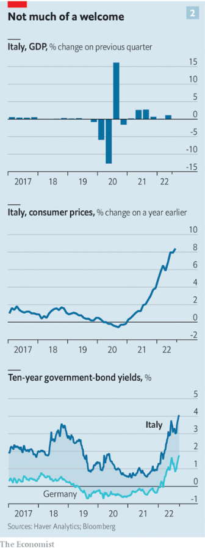
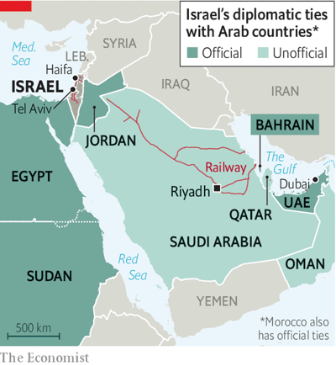
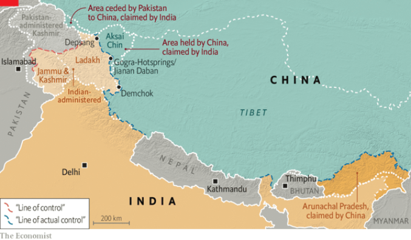
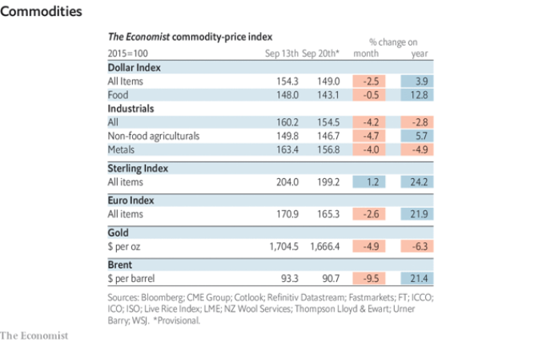

### 1. The world this week
#### 1.1 [Politics](https://www.economist.com/the-world-this-week/2022/09/22/politics)

#### 1.2 [Business](https://www.economist.com/the-world-this-week/2022/09/22/business)

#### 1.3 [KAL’s cartoon](https://www.economist.com/the-world-this-week/2022/09/22/kals-cartoon)
  

### 2. Leaders
#### 2.1 [Boom time in the Gulf](https://www.economist.com/leaders/2022/09/22/an-energy-crisis-and-geopolitics-are-creating-a-new-look-gulf)

#### 2.2 [Putin doubles down](https://www.economist.com/leaders/2022/09/21/vladimir-putin-vows-to-send-more-invaders-the-west-should-arm-ukraine-faster)

#### 2.3 [Truss’s rusty Reaganomics](https://www.economist.com/leaders/2022/09/22/liz-trusss-selective-reaganomics-wont-work)

#### 2.4 [Thinking outside the box](https://www.economist.com/leaders/2022/09/21/how-to-keep-the-brain-healthy)

#### 2.5 [Should Europe worry?](https://www.economist.com/leaders/2022/09/22/how-afraid-should-europe-be-of-giorgia-meloni)

### 3. Letters
#### 3.1 [On America, hospital food, sea mines, autocrats, quiet quitting, Britain](https://www.economist.com/letters/2022/09/22/letters-to-the-editor)

### 4. By Invitation
#### 4.1 [Stakeholder capitalism poisons democracy, argues Vivek Ramaswamy](https://www.economist.com/by-invitation/2022/09/14/stakeholder-capitalism-poisons-democracy-argues-vivek-ramaswamy)

#### 4.2 [People trust executives to intervene in social issues, says Jeffrey Sonnenfeld](https://www.economist.com/by-invitation/2022/09/14/people-trust-executives-to-intervene-in-social-issues-says-jeffrey-sonnenfeld)

### 5. Briefing
#### 5.1 [Docks, stocks and many floating barrels](https://www.economist.com/interactive/briefing/2022/09/24/war-in-ukraine-has-reshaped-worlds-fuel-markets)

### 6. Europe
#### 6.1 [The Brothers are coming](https://www.economist.com/europe/2022/09/22/giorgia-meloni-and-her-brothers-of-italy-look-set-to-win-the-next-election)
  
  

#### 6.2 [Halfway measure](https://www.economist.com/europe/2022/09/21/vladimir-putin-declares-a-partial-mobilisation)
  

#### 6.3 [The guns do the talking](https://www.economist.com/europe/2022/09/22/renewed-fighting-in-the-caucasus-shows-russias-waning-influence)
  

#### 6.4 [The Reverse Luxembourg](https://www.economist.com/europe/2022/09/22/to-prevent-diplomatic-shakedowns-europe-must-curb-abusive-national-vetoes)

### 7. Britain
#### 7.1 [The smoked-salmon offensive](https://www.economist.com/britain/2022/09/22/after-a-frosty-decade-business-leaders-are-warming-to-the-labour-party)

#### 7.2 [Elizabeth’s journey](https://www.economist.com/britain/2022/09/22/the-state-funeral-of-elizabeth-ii-came-off-without-a-hitch)

#### 7.3 [Locum motives](https://www.economist.com/britain/2022/09/22/the-nhs-has-a-lot-of-locums-it-should-listen-to-them)

#### 7.4 [The aftermath](https://www.economist.com/britain/2022/09/22/in-one-british-city-black-lives-matter-still-reverberates)

#### 7.5 [Locked in](https://www.economist.com/britain/2022/09/22/why-prisoners-are-spending-more-time-in-their-cells)

#### 7.6 [The first mile](https://www.economist.com/britain/2022/09/22/many-british-adults-lack-basic-numeracy-and-literacy)
  

#### 7.7 [Capital ideas](https://www.economist.com/britain/2022/09/22/the-city-is-fighting-to-carve-out-a-post-brexit-role)
  

#### 7.8 [King Charles v Trussonomics](https://www.economist.com/britain/2022/09/22/king-charles-versus-trussonomics)

### 8. United States
#### 8.1 [Wooing the waverers](https://www.economist.com/united-states/2022/09/21/joe-biden-warns-of-global-disorder-if-russia-is-not-stopped)

#### 8.2 [Bad politics?](https://www.economist.com/united-states/2022/09/22/republicans-abortion-proposal-could-backfire)
  

#### 8.3 [Et tu, New York](https://www.economist.com/united-states/2022/09/21/donald-trump-faces-a-sweeping-new-lawsuit)

#### 8.4 [Claws out](https://www.economist.com/united-states/2022/09/22/maines-lobster-industry-is-feeling-the-pinch)

#### 8.5 [Trans plans](https://www.economist.com/united-states/2022/09/22/new-standards-of-transgender-health-care-raise-eyebrows)

#### 8.6 [Revving up](https://www.economist.com/united-states/2022/09/19/detroit-is-once-again-betting-on-the-car-industry-to-rescue-it)

#### 8.7 [In praise of the deep state](https://www.economist.com/united-states/2022/09/22/there-is-plenty-of-good-news-about-american-government)

### 9. Middle East & Africa
#### 9.1 [The Abraham economy](https://www.economist.com/middle-east-and-africa/2022/09/22/trade-and-security-ties-are-knitting-israel-into-its-region)
  
  

#### 9.2 [Burning their hijabs](https://www.economist.com/middle-east-and-africa/2022/09/22/why-iranian-women-are-burning-their-hijabs)

#### 9.3 [Hostages to fortune](https://www.economist.com/middle-east-and-africa/2022/09/22/malis-junta-takes-friendly-soldiers-hostage)
  

#### 9.4 [Escaping the dead hand of dictatorship](https://www.economist.com/middle-east-and-africa/2022/09/22/malawi-has-saved-its-democracy-but-not-its-economy)
  

### 10. The Americas
#### 10.1 [The unknown known](https://www.economist.com/the-americas/2022/09/19/how-left-wing-on-economics-is-luiz-inacio-lula-da-silva)
  
  

#### 10.2 [Bukele’s big re-election lie](https://www.economist.com/the-americas/2022/09/22/nayib-bukele-wants-to-abolish-term-limits-in-el-salvador)

### 11. Asia
#### 11.1 [Chain reaction](https://www.economist.com/asia/2022/09/22/vietnam-is-emerging-as-a-winner-from-the-era-of-deglobalisation)
  
  

#### 11.2 [Unholy spirit](https://www.economist.com/asia/2022/09/22/indias-capital-has-run-out-of-booze)

#### 11.3 [Pass the button](https://www.economist.com/asia/2022/09/22/kim-jong-un-considers-devolving-power-over-his-nuclear-arsenal)

#### 11.4 [Border disorder](https://www.economist.com/asia/2022/09/22/fighting-erupts-between-kyrgyzstan-and-tajikistan)
  

#### 11.5 [The kaleidoscope turns](https://www.economist.com/asia/2022/09/22/why-narendra-modi-criticised-vladimir-putin-in-samarkand)

### 12. China
#### 12.1 [The widening gap](https://www.economist.com/china/2022/09/22/reforms-to-chinas-hukou-system-will-not-help-migrants-much)
  
  

#### 12.2 [A bit more Mao-like](https://www.economist.com/china/2022/09/22/how-xi-jinping-might-change-the-communist-partys-constitution)

#### 12.3 [Still frosty](https://www.economist.com/china/2022/09/22/some-progress-in-the-border-dispute-between-china-and-india)
  

### 13. International
#### 13.1 [Peddling Putin’s piffle](https://www.economist.com/international/2022/09/22/how-russia-is-trying-to-win-over-the-global-south)
  

### 14. Technology Quarterly
#### 14.1 [Opening up the box](https://www.economist.com/technology-quarterly/2022/09/21/after-fallow-decades-neuroscience-is-undergoing-a-renaissance)
  

#### 14.2 [From luck to judgment](https://www.economist.com/technology-quarterly/2022/09/21/science-needs-to-move-beyond-luck-if-it-is-to-design-better-drugs-for-the-brain)
  

#### 14.3 [Thinking inside the box](https://www.economist.com/technology-quarterly/2022/09/21/better-brain-biology-will-deliver-better-medicines)

#### 14.4 [Ancient wisdom?](https://www.economist.com/technology-quarterly/2022/09/21/ketamine-psilocybin-and-ecstasy-are-coming-to-the-medicine-cabinet)
  

#### 14.5 [Wired up](https://www.economist.com/technology-quarterly/2022/09/21/crossing-the-brains-electrical-frontier)

#### 14.6 [Mind over matter](https://www.economist.com/technology-quarterly/2022/09/21/what-does-a-brain-computer-interface-feel-like)

#### 14.7 [Sources and acknowledgments](https://www.economist.com/technology-quarterly/2022/09/21/sources-and-acknowledgments)

### 15. Business
#### 15.1 [Commercial brakes](https://www.economist.com/business/2022/09/18/the-300bn-google-meta-advertising-duopoly-is-under-attack)
  

#### 15.2 [On the offensive](https://www.economist.com/business/2022/09/22/germanys-government-seizes-russian-energy-assets)

#### 15.3 [Green-dustrialisation](https://www.economist.com/business/2022/09/19/can-europe-decarbonise-its-heavy-industry)

#### 15.4 [Choreography v candour](https://www.economist.com/business/2022/09/22/how-not-to-run-a-virtual-town-hall)

#### 15.5 [Speed merchants](https://www.economist.com/business/2022/09/22/porsche-goes-to-market)
  

#### 15.6 [The race for space](https://www.economist.com/business/2022/09/22/is-the-warehouse-business-recession-proof)

### 16. Finance & economics
#### 16.1 [Entrepotluck](https://www.economist.com/finance-and-economics/2022/09/22/dubai-is-the-worlds-resurgent-entrepot)

#### 16.2 [Factories, floored](https://www.economist.com/finance-and-economics/2022/09/21/a-global-manufacturing-slowdown-suggests-worse-is-to-come)
  

#### 16.3 [The covid comedown](https://www.economist.com/finance-and-economics/2022/09/22/households-across-the-rich-world-have-never-been-so-gloomy)
  

#### 16.4 [Shaken and stirred](https://www.economist.com/finance-and-economics/2022/09/21/as-america-raises-rates-the-rest-of-the-world-bears-the-pain)

#### 16.5 [Tech curse](https://www.economist.com/finance-and-economics/2022/09/22/peter-thiel-says-california-suffers-from-a-tech-curse-is-he-right)
  

#### 16.6 [Hot property](https://www.economist.com/finance-and-economics/2022/09/22/why-wall-street-is-snapping-up-family-homes)

#### 16.7 [Capitol Markets](https://www.economist.com/finance-and-economics/2022/09/22/do-lawmakers-beat-the-market)

#### 16.8 [Madison Avenue’s advice](https://www.economist.com/finance-and-economics/2022/09/22/how-to-rebrand-stockmarket-indices)

#### 16.9 [Not like China](https://www.economist.com/finance-and-economics/2022/09/20/chinas-rulers-seem-resigned-to-a-slowing-economy)

### 17. Science & technology
#### 17.1 [Pain, pain, go away](https://www.economist.com/science-and-technology/2022/09/21/better-medicines-are-needed-to-relieve-pain)
  

#### 17.2 [Crickets in a coal mine](https://www.economist.com/science-and-technology/2022/09/21/crickets-are-an-indicator-of-ecosystem-health)

#### 17.3 [Namely offensive](https://www.economist.com/science-and-technology/2022/09/21/on-the-troubles-of-naming-species)

#### 17.4 [Buzzing builders](https://www.economist.com/science-and-technology/2022/09/21/teams-of-drones-can-print-in-3d)

### 18. Culture
#### 18.1 [Try, the beloved country](https://www.economist.com/culture/2022/09/22/rugby-brings-south-africa-together-if-only-for-80-minutes)

#### 18.2 [Unquiet ghosts](https://www.economist.com/culture/2022/09/22/the-soviet-invasion-of-afghanistan-echoes-in-todays-war)

#### 18.3 [Perfect vision](https://www.economist.com/culture/2022/09/22/in-china-surveillance-crushes-lives-and-improves-them)

#### 18.4 [Yesterday never dies](https://www.economist.com/culture/2022/09/22/sixty-years-ago-james-bond-and-the-beatles-made-debuts)

#### 18.5 [Brothers in art](https://www.economist.com/culture/2022/09/22/the-jena-set-was-the-heart-of-german-romanticism)

#### 18.6 [Posh in translation](https://www.economist.com/culture/2022/09/22/translating-royal-names-is-a-relic-of-european-history)

### 19. Economic & financial indicators
#### 19.1 [Economic data, commodities and markets](https://www.economist.com/economic-and-financial-indicators/2022/09/22/economic-data-commodities-and-markets)
  
  
  
  

### 20. Graphic detail
#### 20.1 [Fossil feuds](https://www.economist.com/graphic-detail/2022/09/22/research-on-amber-from-a-war-torn-part-of-myanmar-is-surging)
  
  
  

### 21. The Economist explains
#### 21.1 [How the EU intends to collect “windfall profits” from energy firms](https://www.economist.com/the-economist-explains/2022/09/15/how-the-eu-intends-to-collect-windfall-profits-from-energy-firms)
  

#### 21.2 [Why is the electoral cycle of America’s Congress so short?](https://www.economist.com/the-economist-explains/2022/09/20/why-is-the-electoral-cycle-of-americas-congress-so-short)

### 22. Obituary
#### 22.1 [The “Are we alone?” equation](https://www.economist.com/obituary/2022/09/21/frank-drake-believed-that-the-universe-had-to-contain-other-intelligent-beings)

