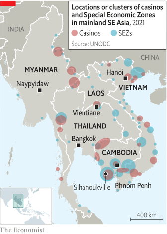

### 1. The world this week
#### 1.1 [Politics](https://www.economist.com/the-world-this-week/2022/10/06/politics)

#### 1.2 [Business](https://www.economist.com/the-world-this-week/2022/10/06/business)
  

#### 1.3 [KAL’s cartoon](https://www.economist.com/the-world-this-week/2022/10/06/kals-cartoon)
  

### 2. Leaders
#### 2.1 [What next?](https://www.economist.com/leaders/2022/10/06/a-new-macroeconomic-era-is-emerging-what-will-it-look-like)

#### 2.2 [On a knife-edge](https://www.economist.com/leaders/2022/10/04/to-win-brazils-presidency-lula-should-move-to-the-centre)

#### 2.3 [Truss deficit](https://www.economist.com/leaders/2022/10/06/britains-conservatives-do-not-understand-how-much-things-have-changed)

#### 2.4 [Are management consultants useful?](https://www.economist.com/leaders/2022/10/05/do-mckinsey-and-other-consultants-do-anything-useful)

#### 2.5 [How will Elon Musk use his superpowers?](https://www.economist.com/leaders/2022/10/06/how-worried-should-you-be-about-elon-musks-superpowers)

### 3. Letters
#### 3.1 [On the police in America, qualified-majority voting, Agatha Christie, Italy, Myanmar, Janus words](https://www.economist.com/letters/2022/10/06/letters-to-the-editor)

### 4. By Invitation
#### 4.1 [Kirill Rogov on what Russians really think of the war in Ukraine](https://www.economist.com/by-invitation/2022/10/05/kirill-rogov-on-what-russians-really-think-of-the-war-in-ukraine)

#### 4.2 [Marina Silva on why Brazil’s presidential contest will decide the Amazon’s fate](https://www.economist.com/by-invitation/2022/09/30/marina-silva-on-why-brazils-presidential-contest-will-decide-the-amazons-fate)

#### 4.3 [Ro Khanna and Zach Wahls on how Democrats can win back factory towns](https://www.economist.com/by-invitation/2022/10/03/ro-khanna-and-zach-wahls-on-how-democrats-can-win-back-factory-towns)

### 5. Briefing
#### 5.1 [Putin at bay](https://www.economist.com/briefing/2022/10/06/ukraines-military-success-is-reshaping-russia-as-well-as-the-war)
  
  
  

#### 5.2 [Tweet and sour](https://www.economist.com/briefing/2022/10/06/elon-musks-foray-into-geopolitics-has-ukraine-worried)

### 6. Europe
#### 6.1 [Willkommen](https://www.economist.com/europe/2022/10/06/there-are-not-enough-germans-to-do-the-jobs-germany-needs)
  

#### 6.2 [What’s the plan?](https://www.economist.com/europe/2022/10/06/can-italys-giorgia-meloni-afford-the-things-she-wants)

#### 6.3 [Shadows of the past](https://www.economist.com/europe/2022/10/06/the-war-in-ukraine-has-awakened-memories-in-the-balkans)
  

#### 6.4 [Flashing das Cash](https://www.economist.com/europe/2022/10/06/a-german-aid-package-revives-calls-for-solidarity-with-poorer-eu-countries)

### 7. Britain
#### 7.1 [Fourth time unlucky](https://www.economist.com/britain/2022/10/05/a-chaotic-conference-fractures-liz-trusss-young-premiership)
  
  

#### 7.2 [In a fix](https://www.economist.com/britain/2022/10/06/britains-mortgage-market-is-adjusting-to-higher-interest-rates)
  

#### 7.3 [Watched dog](https://www.economist.com/britain/2022/10/06/britains-fiscal-watchdog-is-caught-up-in-a-political-storm)

#### 7.4 [Latin lovers](https://www.economist.com/britain/2022/10/06/a-ps4m-scheme-to-bring-latin-into-british-state-schools-begins)

#### 7.5 [A tale of two cities](https://www.economist.com/britain/2022/10/06/british-cities-have-far-too-little-power-and-its-holding-them-back)
  

#### 7.6 [Accidental austerity](https://www.economist.com/britain/2022/10/06/liz-truss-turns-to-accidental-austerity)

### 8. United States
#### 8.1 [Don’t mind the gap](https://www.economist.com/united-states/2022/10/04/the-biden-administration-is-quietly-completing-bits-of-donald-trumps-wall)
  

#### 8.2 [The Florida model](https://www.economist.com/united-states/2022/10/06/floridas-government-subsidises-people-living-in-hurricane-zones)

#### 8.3 [Viva Las Vegas](https://www.economist.com/united-states/2022/10/06/tight-midterm-races-in-nevada-may-hinge-on-outreach-to-latino-voters)

#### 8.4 [Other than that, Mrs Lincoln](https://www.economist.com/united-states/2022/10/06/democrats-are-losing-on-the-economy-but-lead-on-other-issues)
  

#### 8.5 [Curdling it up](https://www.economist.com/united-states/2022/10/06/why-wisconsin-has-such-odd-politics)

#### 8.6 [Winter is coming](https://www.economist.com/united-states/2022/10/04/alaskas-fat-bear-week-proves-conservation-can-be-joyful)

#### 8.7 [What Donald Trump understands](https://www.economist.com/united-states/2022/10/03/what-donald-trump-understands)

### 9. Middle East & Africa
#### 9.1 [Land of dashed hope](https://www.economist.com/middle-east-and-africa/2022/10/06/eritrea-has-called-up-thousands-of-reservists-to-fight-in-tigray)
  

#### 9.2 [Let’s get this party started](https://www.economist.com/middle-east-and-africa/2022/10/06/why-political-parties-are-a-growth-industry-in-lesotho)

#### 9.3 [Coup upon coup](https://www.economist.com/middle-east-and-africa/2022/10/01/for-the-second-time-this-year-soldiers-stage-a-coup-in-burkina-faso)
  

#### 9.4 [Blue-sky blues](https://www.economist.com/middle-east-and-africa/2022/10/06/lebanons-economic-crisis-is-wrecking-the-environment-too)

#### 9.5 [A protest song rocks a theocracy](https://www.economist.com/middle-east-and-africa/2022/10/06/irans-repressive-regime-is-being-rocked-by-a-song)

### 10. The Americas
#### 10.1 [Bolsonarismo battles on](https://www.economist.com/the-americas/2022/10/03/brazils-presidential-election-will-go-to-a-run-off)

#### 10.2 [Isolated but not independent](https://www.economist.com/the-americas/2022/10/06/quebec-elects-francois-legaults-fiercely-nationalist-party)

#### 10.3 [Voices of the powerless](https://www.economist.com/the-americas/2022/10/06/cubans-rage-against-the-dying-of-the-light)

### 11. Asia
#### 11.1 [Forced to defraud](https://www.economist.com/asia/2022/10/06/the-gangs-that-kidnap-asians-and-force-them-to-commit-cyberfraud)
  

#### 11.2 [Cover story](https://www.economist.com/asia/2022/10/06/many-japanese-are-still-reluctant-to-go-unmasked)

#### 11.3 [A nation at a loss](https://www.economist.com/asia/2022/10/06/indonesias-football-tragedy-puts-the-spotlight-on-its-police-force)

#### 11.4 [Pantomime politics](https://www.economist.com/asia/2022/10/06/indias-congress-party-seems-determined-to-prove-its-critics-right)

#### 11.5 [Whose blue?](https://www.economist.com/asia/2022/10/06/what-pacific-island-states-make-of-the-great-power-contest-over-them)

### 12. China
#### 12.1 [Interfering elders](https://www.economist.com/china/2022/10/06/how-retired-party-officials-make-themselves-heard-in-china)

#### 12.2 [Class struggle](https://www.economist.com/china/2022/10/04/how-academies-for-cadres-shape-chinas-ruling-class)

#### 12.3 [Sinifying Shangri-La](https://www.economist.com/china/2022/10/06/han-chinese-seek-spiritual-salve-in-tibetan-buddhism)

#### 12.4 [Spoiling for a fight](https://www.economist.com/china/2022/10/06/sino-american-relations-were-in-trouble-long-before-donald-trump)

### 13. International
#### 13.1 [How pop culture went multipolar](https://www.economist.com/international/2022/10/06/how-pop-culture-went-multipolar)
  
  

### 14. Special report
#### 14.1 [Regime change](https://www.economist.com/special-report/2022/10/05/inflation-and-rising-demands-on-governments-are-changing-economic-policy)
  

#### 14.2 [The ageing paradox](https://www.economist.com/special-report/2022/10/05/elderly-populations-mean-more-government-spending)
  

#### 14.3 [Feedback loop](https://www.economist.com/special-report/2022/10/05/is-the-world-economy-in-a-debt-trap)

#### 14.4 [Greenbacks for greenery](https://www.economist.com/special-report/2022/10/05/the-energy-transition-will-be-expensive)

#### 14.5 [The total bill](https://www.economist.com/special-report/2022/10/05/adding-up-the-fiscal-drag-from-ageing-energy-and-defence)
  

#### 14.6 [Long road back](https://www.economist.com/special-report/2022/10/05/the-inflation-problem-will-get-better-before-it-gets-worse)
  

#### 14.7 [The end of 2%](https://www.economist.com/special-report/2022/10/05/policymakers-are-likely-to-jettison-their-2-inflation-targets)

### 15. Business
#### 15.1 [Bulletproof suits](https://www.economist.com/business/2022/10/04/where-next-for-managements-consiglieri)
  

#### 15.2 [Cleaning up its act](https://www.economist.com/business/2022/10/06/rwe-germanys-biggest-power-company-is-going-green)

#### 15.3 [The magic formula](https://www.economist.com/business/2022/10/06/the-magic-formula-of-management)

#### 15.4 [A new look](https://www.economist.com/business/2022/10/06/fashion-gets-a-modern-makeover)
  
  
  

#### 15.5 [The odd couple](https://www.economist.com/business/2022/10/05/elon-musk-is-buying-twitter-really-probably)

#### 15.6 [The hard edge of the cloud](https://www.economist.com/business/2022/10/06/the-cloud-is-the-fiercest-front-in-the-chip-wars)

### 16. Finance & economics
#### 16.1 [The rumbling draws near](https://www.economist.com/finance-and-economics/2022/10/04/financial-markets-are-in-trouble-where-will-the-cracks-appear)
  
  

#### 16.2 [Overmighty](https://www.economist.com/finance-and-economics/2022/10/02/americas-economy-is-too-strong-for-its-own-good)
  
  

#### 16.3 [Let them trade bonds](https://www.economist.com/finance-and-economics/2022/10/06/the-worlds-most-important-financial-market-is-not-fit-for-purpose)

#### 16.4 [Striking oil producers](https://www.economist.com/finance-and-economics/2022/10/05/opec-defies-joe-biden-with-a-big-output-cut)
  

#### 16.5 [China gives up the fight](https://www.economist.com/finance-and-economics/2022/10/06/why-chinas-policymakers-are-relaxed-about-a-falling-yuan)

### 17. Science & technology
#### 17.1 [To the winners, the spoils](https://www.economist.com/science-and-technology/2022/10/05/this-years-nobel-science-laureates-have-now-been-announced)

#### 17.2 [A dose of truth](https://www.economist.com/science-and-technology/2022/10/05/a-study-allays-fears-that-covid-vaccines-harm-menstrual-cycles)

#### 17.3 [Tailless comets could threaten Earth](https://www.economist.com/science-and-technology/2022/10/05/tailless-comets-could-threaten-earth)
  

#### 17.4 [The Nobel chemistry prize goes for click-together molecules](https://www.economist.com/science-and-technology/2022/10/05/the-nobel-chemistry-prize-goes-for-click-together-molecules)

### 18. Culture
#### 18.1 [The useful “Idiot”](https://www.economist.com/culture/2022/10/06/yes-the-russian-literary-canon-is-tainted-by-imperialism)

#### 18.2 [Circles of life](https://www.economist.com/culture/2022/10/06/thomas-and-julian-huxley-were-champions-of-darwinism)

#### 18.3 [The room where it happened](https://www.economist.com/culture/2022/10/06/to-sanctify-the-world-revisits-the-second-vatican-council)

#### 18.4 [Rich pickings](https://www.economist.com/culture/2022/10/06/a-new-book-explores-the-hidden-history-of-the-banjo)

#### 18.5 [A man in full](https://www.economist.com/culture/2022/10/06/william-boyds-new-novel-is-a-rollicking-tale-of-adventure)

#### 18.6 [Out of one, many](https://www.economist.com/culture/2022/10/06/switzerland-is-a-model-of-a-multilingual-state)

### 19. Economic & financial indicators
#### 19.1 [Economic data, commodities and markets](https://www.economist.com/economic-and-financial-indicators/2022/10/06/economic-data-commodities-and-markets)
  
  
  
  

### 20. Graphic detail
#### 20.1 [Steady as she goes](https://www.economist.com/graphic-detail/2022/10/06/since-1311-bond-yields-have-fallen-with-metronomic-regularity)
  
  
  

### 21. The Economist explains
#### 21.1 [What is annexation?](https://www.economist.com/the-economist-explains/2022/09/30/what-is-annexation)

#### 21.2 [Why fracking cannot solve Europe’s energy crisis](https://www.economist.com/the-economist-explains/2022/10/04/why-fracking-cannot-solve-europes-energy-crisis)
  

### 22. Obituary
#### 22.1 [God’s smuggler](https://www.economist.com/obituary/2022/10/06/brother-andrew-secretly-carried-bibles-behind-the-iron-curtain)

