### 1. The world this week
#### 1.1 [Politics](https://www.economist.com/the-world-this-week/2022/10/20/politics)

#### 1.2 [Business](https://www.economist.com/the-world-this-week/2022/10/20/business)
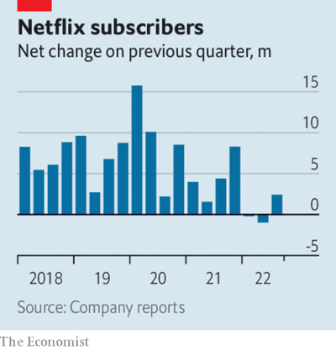  

#### 1.3 [KAL’s cartoon](https://www.economist.com/the-world-this-week/2022/10/20/kals-cartoon)
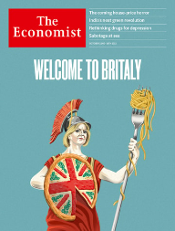  

### 2. Leaders
#### 2.1 [Welcome to Britaly](https://www.economist.com/leaders/2022/10/19/welcome-to-britaly)

#### 2.2 [House-price horror show](https://www.economist.com/leaders/2022/10/20/a-global-house-price-slump-is-coming)

#### 2.3 [Defying the odds](https://www.economist.com/leaders/2022/10/20/ukraines-economy-is-defying-the-odds-but-it-needs-help)
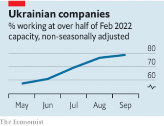  

#### 2.4 [India’s next green revolution](https://www.economist.com/leaders/2022/10/20/indias-next-green-revolution)

#### 2.5 [Set patients free](https://www.economist.com/leaders/2022/10/19/most-people-on-antidepressants-dont-need-them)

### 3. Letters
#### 3.1 [On church bells, Detroit, Jair Bolsonaro, Armenia and Azerbaijan, management consultants](https://www.economist.com/letters/2022/10/20/letters-to-the-editor)

### 4. By Invitation
#### 4.1 [Research co-operation pays dividends far beyond academia, argues Henry Huiyao Wang](https://www.economist.com/by-invitation/2022/10/14/research-co-operation-pays-dividends-far-beyond-academia-argues-henry-huiyao-wang)

#### 4.2 [Ruy Teixeira asks whether America has reached “peak woke”](https://www.economist.com/by-invitation/2022/10/19/ruy-teixeira-asks-whether-america-has-reached-peak-woke)

### 5. Briefing
#### 5.1 [Skunk no more](https://www.economist.com/briefing/2022/10/20/will-india-become-a-green-superpower)
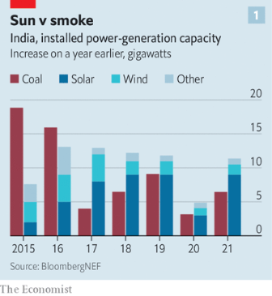  
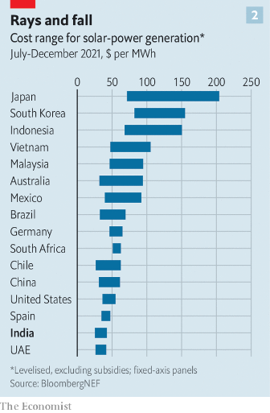  
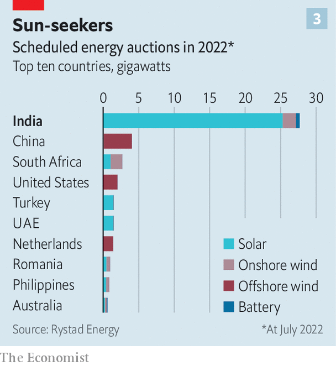  

### 6. Europe
#### 6.1 [Shooting Shaheds](https://www.economist.com/europe/2022/10/19/iranian-drones-pose-a-fiendish-military-problem-for-ukraine)
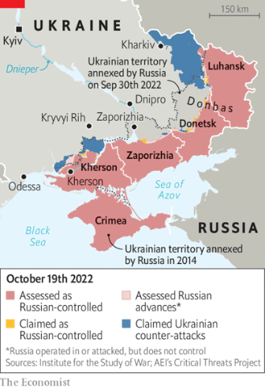  

#### 6.2 [The Kremlin’s empty lobby](https://www.economist.com/europe/2022/10/20/russia-was-more-deeply-embedded-in-german-politics-than-suspected)

#### 6.3 [The Kramatorsk express is back](https://www.economist.com/europe/2022/10/20/ukrainian-railways-reconnects-a-city-scarred-by-a-bombing)
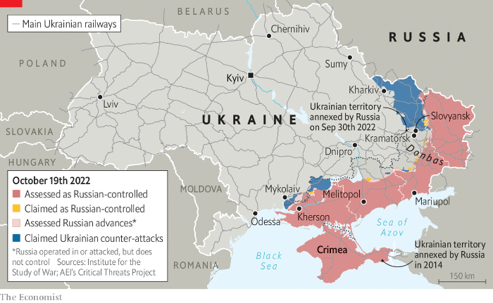  

#### 6.4 [Red roses…and artillery](https://www.economist.com/europe/2022/10/18/france-is-sending-weapons-and-air-defence-systems-to-ukraine)

#### 6.5 [Not so easy](https://www.economist.com/europe/2022/10/20/italys-coalition-building-runs-into-trouble)

#### 6.6 [Fetchez the barricades!](https://www.economist.com/europe/2022/10/20/europes-ambivalence-over-globalisation-veers-towards-scepticism)

### 7. Britain
#### 7.1 [Who runs Britain now?](https://www.economist.com/britain/2022/10/20/a-brush-with-the-bond-markets-reorders-british-politics)
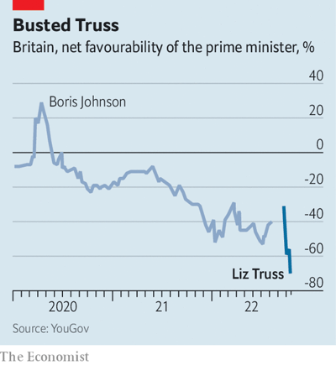  

#### 7.2 [Abacus economics](https://www.economist.com/britain/2022/10/20/as-britains-government-looks-to-save-money-almost-nothing-is-protected)
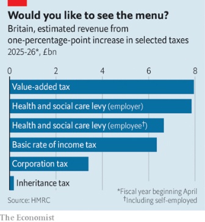  

#### 7.3 [Low-growth gang](https://www.economist.com/britain/2022/10/20/what-a-comparison-between-britain-and-italy-reveals)
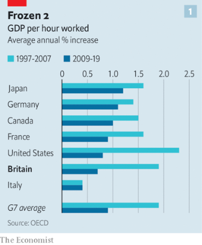  
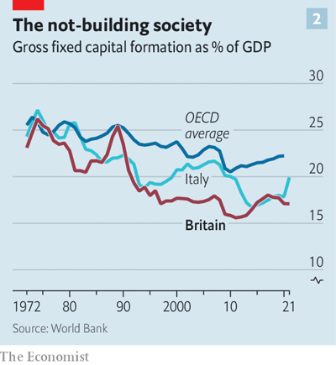  

#### 7.4 [Dashed dreams](https://www.economist.com/britain/2022/10/19/suella-braverman-resigns-as-home-secretary)

#### 7.5 [Carbon capture](https://www.economist.com/britain/2022/10/20/indians-want-the-koh-i-noor-diamond-back)

#### 7.6 [Step by step](https://www.economist.com/britain/2022/10/20/in-britain-the-least-sexy-form-of-travel-is-getting-some-attention)
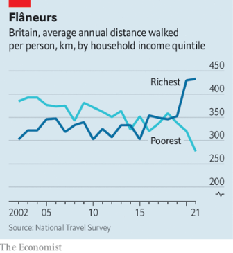  

#### 7.7 [Meet the man in charge](https://www.economist.com/britain/2022/10/18/how-jeremy-hunt-became-the-most-powerful-person-in-britain)

### 8. United States
#### 8.1 [Unpacific](https://www.economist.com/united-states/2022/10/20/oregons-close-governors-race-is-a-referendum-on-portland)
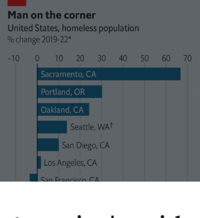  

#### 8.2 [Skewed samples](https://www.economist.com/united-states/2022/10/20/how-to-spot-a-wonky-poll)
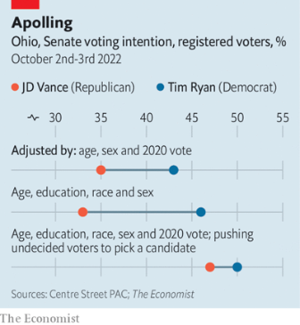  

#### 8.3 [Compendium of crazy](https://www.economist.com/united-states/2022/10/20/no-american-schools-are-not-encouraging-pupils-to-identify-as-cats)

#### 8.4 [Draught me in](https://www.economist.com/united-states/2022/10/20/the-growth-of-the-cicerone-shows-how-craft-beer-is-thriving)

#### 8.5 [What’s in a name?](https://www.economist.com/united-states/2022/10/20/florida-democrats-have-taken-to-calling-republicans-socialist)

#### 8.6 [How high?](https://www.economist.com/united-states/2022/10/17/californians-may-tax-the-rich-more-to-subsidise-electric-cars)
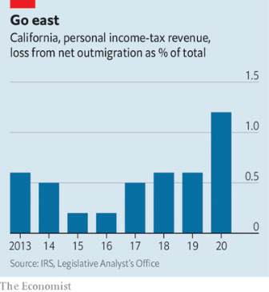  

#### 8.7 [Frenemy mine](https://www.economist.com/united-states/2022/10/19/the-blow-up-with-saudi-arabia-reveals-a-new-american-strategic-weakness)

### 9. Middle East & Africa
#### 9.1 [The long goodbye?](https://www.economist.com/middle-east-and-africa/2022/10/20/why-america-and-saudi-arabia-are-still-inseparable)

#### 9.2 [The ayatollahs dither amid the fire](https://www.economist.com/middle-east-and-africa/2022/10/18/irans-protests-spread-as-a-notorious-prison-burns)

#### 9.3 [We want to stay at school](https://www.economist.com/middle-east-and-africa/2022/10/20/why-teenage-mothers-in-zimbabwe-struggle-to-get-educated)

#### 9.4 [The murky side of the rainbow nation](https://www.economist.com/middle-east-and-africa/2022/10/20/how-organised-crime-is-blighting-south-africas-economy)
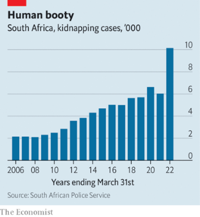  

### 10. The Americas
#### 10.1 [Missing the samba beat](https://www.economist.com/the-americas/2022/10/20/brazils-next-president-will-face-a-big-tricky-in-tray)
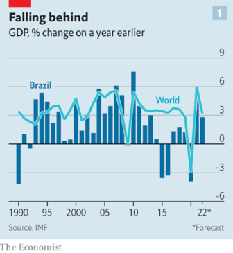  
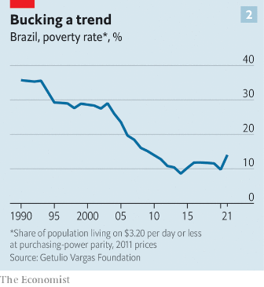  
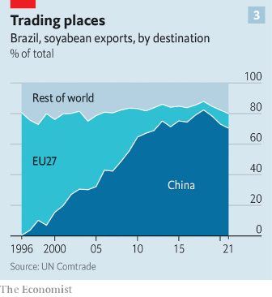  

#### 10.2 [A modern inferno](https://www.economist.com/the-americas/2022/10/20/an-american-backed-foreign-force-may-be-sent-to-haiti)

### 11. Asia
#### 11.1 [Tactical advantage](https://www.economist.com/asia/2022/10/18/north-korea-is-preparing-for-another-nuclear-test-or-many)
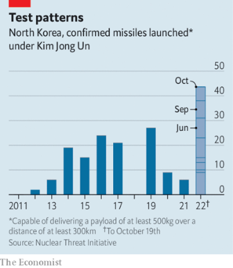  

#### 11.2 [Recusal of service](https://www.economist.com/asia/2022/10/20/the-philippine-justice-ministers-son-is-ensnared-in-a-drug-bust)

#### 11.3 [One-man party](https://www.economist.com/asia/2022/10/20/imran-khan-appears-to-be-more-popular-than-ever)

#### 11.4 [Getting real](https://www.economist.com/asia/2022/10/20/new-zealand-is-toughening-up-on-china)

#### 11.5 [Tightrope act](https://www.economist.com/asia/2022/10/20/central-asian-countries-are-subtly-distancing-themselves-from-russia)

### 12. China
#### 12.1 [Heir unapparent](https://www.economist.com/china/2022/10/20/xi-jinping-has-no-interest-in-succession-planning)

#### 12.2 [Xi’s word counts](https://www.economist.com/china/2022/10/20/in-his-reports-to-the-party-xi-jinping-signals-change-subtly)
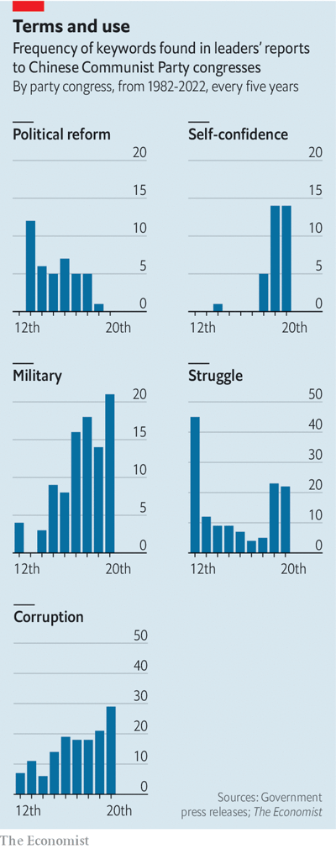  

#### 12.3 [Moving to mid-levels](https://www.economist.com/china/2022/10/20/will-the-chinese-of-tomorrow-live-like-the-spaniards-of-today)

#### 12.4 [Aggressive to a fault](https://www.economist.com/china/2022/10/20/a-protester-in-britain-is-beaten-up-by-chinese-diplomats)

#### 12.5 [No turning back](https://www.economist.com/china/2022/10/17/no-turning-back-for-xi-jinping)

### 13. International
#### 13.1 [Sabotage at sea](https://www.economist.com/international/2022/10/20/vladimir-putin-says-the-worlds-energy-infrastructure-is-at-risk)
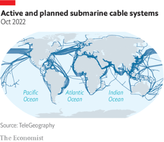  
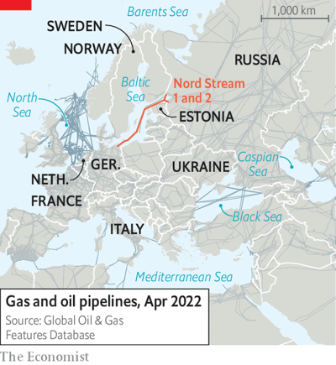  

### 14. Business
#### 14.1 [Reality bites](https://www.economist.com/business/2022/10/16/how-much-trouble-is-mark-zuckerberg-in)
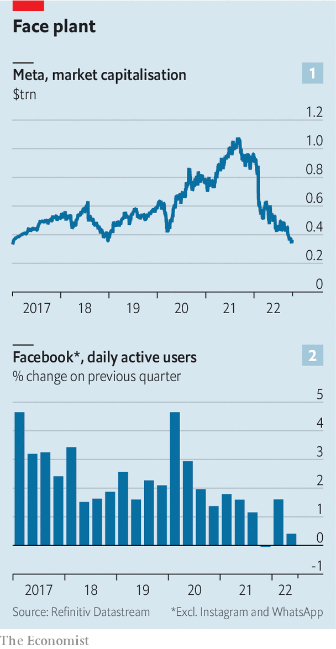  
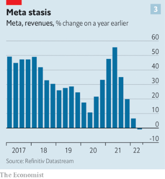  

#### 14.2 [The silicon squeeze](https://www.economist.com/business/2022/10/17/the-american-chip-industrys-15trn-meltdown)
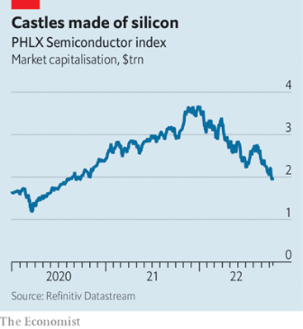  

#### 14.3 [100% proof](https://www.economist.com/business/2022/10/20/kweichow-moutai-is-beating-chinas-covid-hangover)

#### 14.4 [Fodder for the FTC](https://www.economist.com/business/2022/10/20/kroger-americas-second-biggest-grocer-goes-shopping)

#### 14.5 [Walking in employees’ shoes](https://www.economist.com/business/2022/10/20/when-bosses-walk-in-employees-shoes)

#### 14.6 [Where’s the war bounty?](https://www.economist.com/business/2022/10/20/despite-ukraine-these-arent-boom-times-for-american-armsmakers)

### 15. Finance & economics
#### 15.1 [The crack-up](https://www.economist.com/finance-and-economics/2022/10/20/housing-markets-face-a-brutal-squeeze)
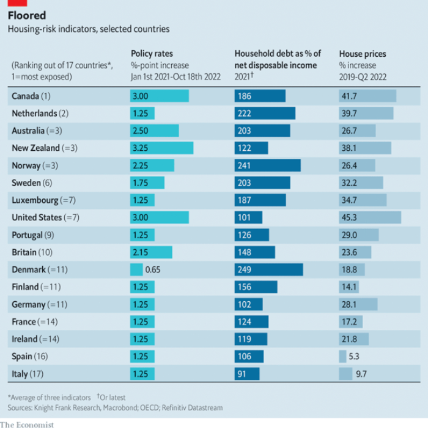  

#### 15.2 [Stick to Manhattan](https://www.economist.com/finance-and-economics/2022/10/18/goldman-sachss-disastrous-main-street-gamble)
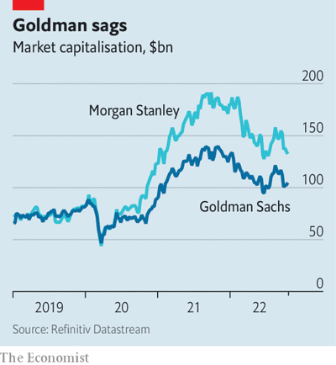  

#### 15.3 [The moron risk premium](https://www.economist.com/finance-and-economics/2022/10/20/can-britain-escape-the-moron-risk-premium)

#### 15.4 [The long march back](https://www.economist.com/finance-and-economics/2022/10/18/ukraines-economy-seems-to-be-growing-again)

#### 15.5 [How’s your luck?](https://www.economist.com/finance-and-economics/2022/10/19/why-inflation-refuses-to-go-away)

### 16. Science & technology
#### 16.1 [The need for a clear head](https://www.economist.com/science-and-technology/2022/10/19/how-to-make-better-use-of-antidepressants)
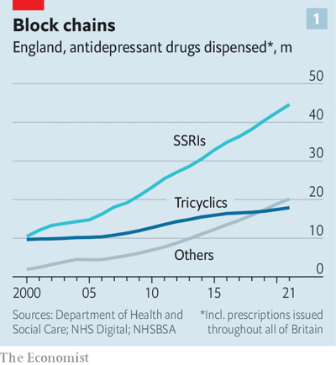  
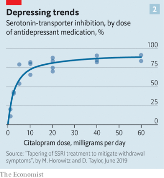  

#### 16.2 [Read my LIPs](https://www.economist.com/science-and-technology/2022/10/19/unlucky-lips-may-explain-venuss-hostile-environment)

#### 16.3 [The most powerful flash yet seen in the sky was recorded on October 9th](https://www.economist.com/science-and-technology/2022/10/19/the-most-powerful-flash-yet-seen-in-the-sky-was-recorded-on-october-9th)

#### 16.4 [Highland clans](https://www.economist.com/science-and-technology/2022/10/19/dna-grants-a-glimpse-of-neanderthal-family-life)

#### 16.5 [Know your boundaries](https://www.economist.com/science-and-technology/2022/10/19/malaysias-elephants-stay-more-outside-protected-areas-than-in)

### 17. Culture
#### 17.1 [Medicis 2.0](https://www.economist.com/culture/2022/10/19/silicon-valleys-plutocrats-are-shaking-up-culture-in-the-region)

#### 17.2 [War without war](https://www.economist.com/culture/2022/10/20/how-the-civil-rights-movement-succeeded)

#### 17.3 [A woman’s place](https://www.economist.com/culture/2022/10/20/helen-garner-was-a-pioneering-chronicler-of-motherhood)

#### 17.4 [Hacked off](https://www.economist.com/culture/2022/10/19/the-ransomware-business-is-complicated-ruthless-and-growing-fast)

#### 17.5 [Say no more](https://www.economist.com/culture/2022/10/20/ukrainians-and-latvians-are-repudiating-the-russian-language)

### 18. Economic & financial indicators
#### 18.1 [Economic data, commodities and markets](https://www.economist.com/economic-and-financial-indicators/2022/10/20/economic-data-commodities-and-markets)
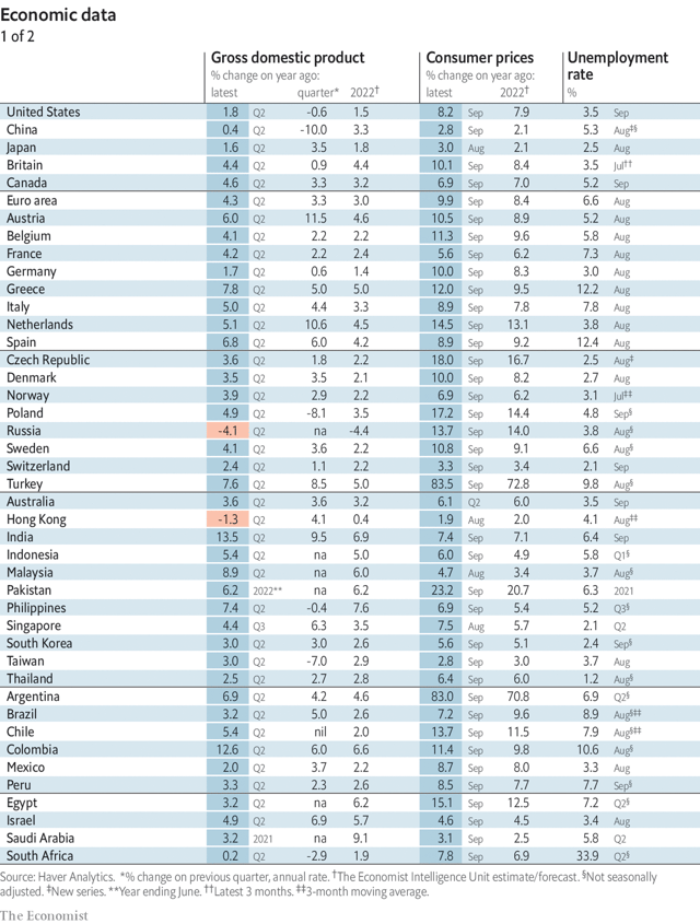  
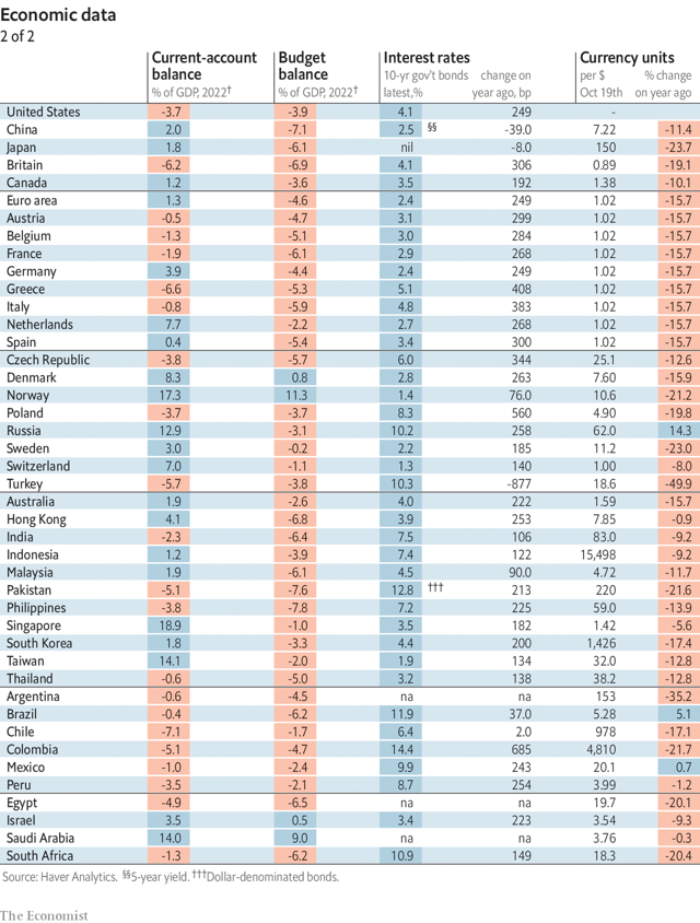  
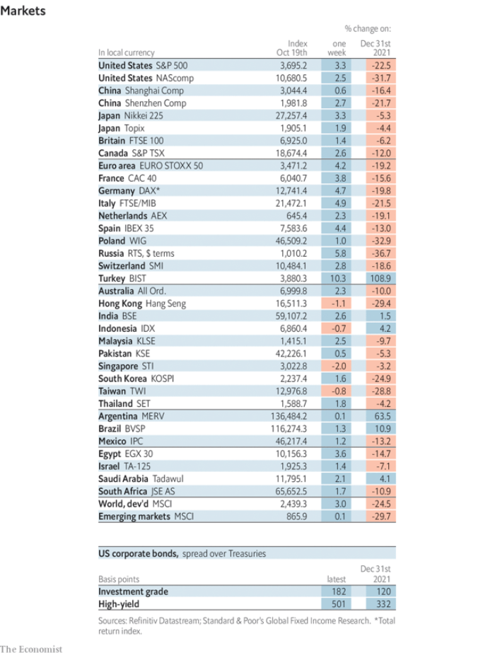  
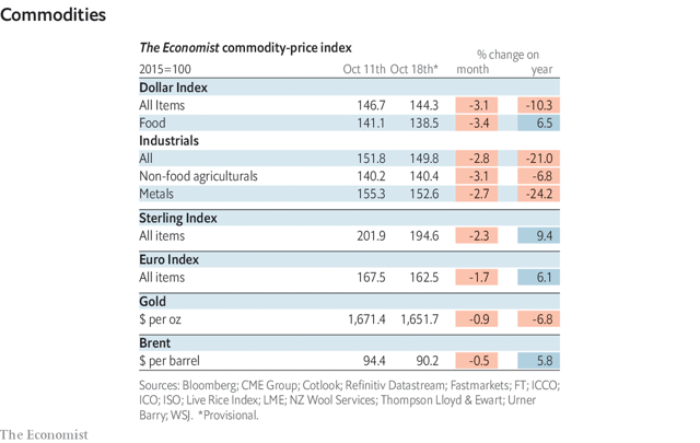  

### 19. Graphic detail
#### 19.1 [A tale of two pandemics](https://www.economist.com/graphic-detail/2022/10/20/in-america-and-eastern-europe-covid-19-got-worse-in-2021)
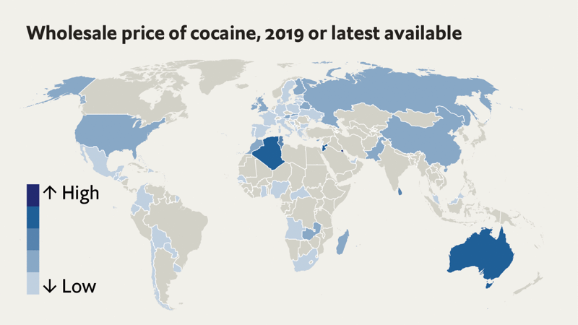  
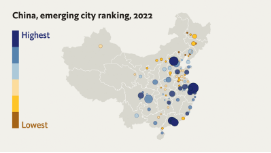  

### 20. The Economist explains
#### 20.1 [How America’s midterms could reshape the courts](https://www.economist.com/the-economist-explains/2022/10/20/how-americas-midterms-could-reshape-the-courts)

#### 20.2 [Will Russia’s drone attacks change the war in Ukraine?](https://www.economist.com/the-economist-explains/2022/10/19/will-russias-drone-attacks-change-the-war-in-ukraine)

### 21. Obituary
#### 21.1 [The man who said no](https://www.economist.com/obituary/2022/10/20/yurii-kerpatenko-refused-to-bow-to-russian-orders)

