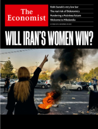
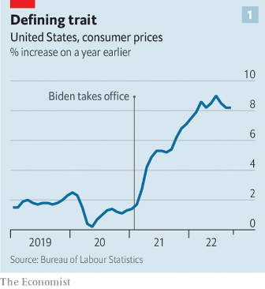
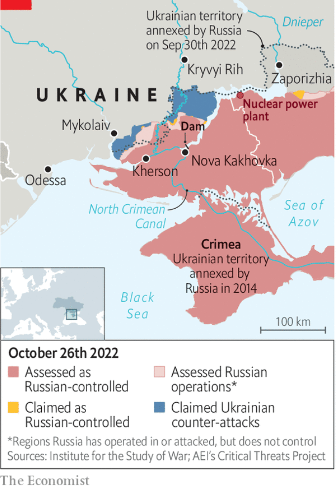
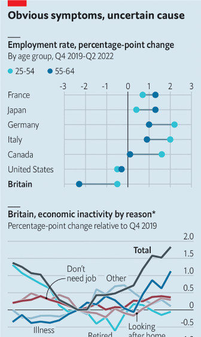
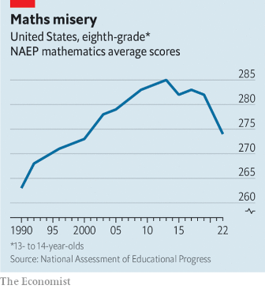
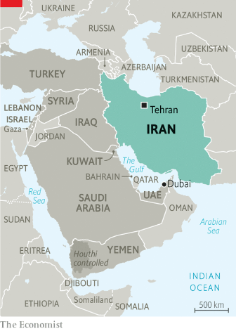
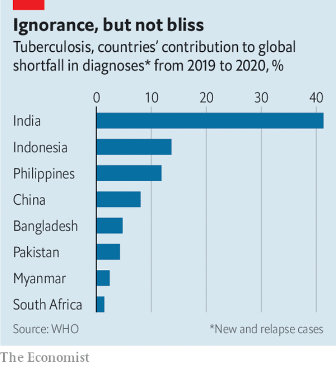
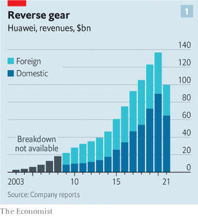
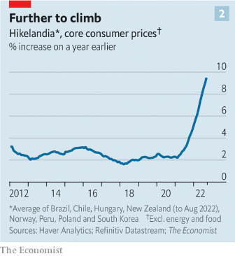
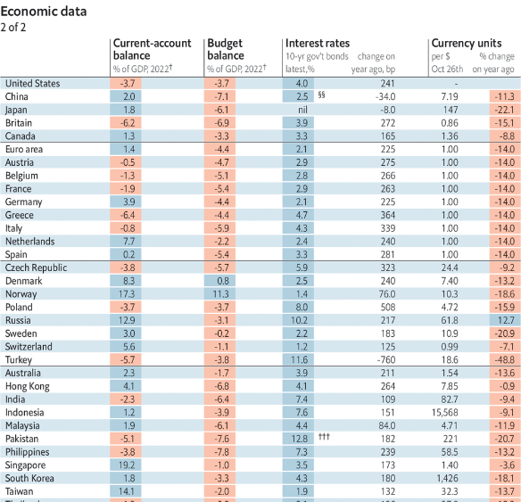

### 1. The world this week
#### 1.1 [Politics](https://www.economist.com/the-world-this-week/2022/10/27/politics)

#### 1.2 [Business](https://www.economist.com/the-world-this-week/2022/10/27/business)
  

#### 1.3 [KAL’s cartoon](https://www.economist.com/the-world-this-week/2022/10/27/kals-cartoon)
  

### 2. Leaders
#### 2.1 [Reasons to be cheerful, Pt. 3](https://www.economist.com/leaders/2022/10/26/rishi-sunaks-promise-of-stability-is-a-low-bar-for-britain)

#### 2.2 [It’s not just inflation](https://www.economist.com/leaders/2022/10/27/the-risks-of-bidenomics-go-beyond-inflation)

#### 2.3 [Team of loyalists](https://www.economist.com/leaders/2022/10/27/for-xi-jinping-loyalty-trumps-ability)
  

#### 2.4 [An untried skipper](https://www.economist.com/leaders/2022/10/27/storm-clouds-loom-for-giorgia-meloni-italys-new-prime-minister)

#### 2.5 [The circular economy](https://www.economist.com/leaders/2022/10/27/battery-makers-are-powering-a-circular-economy)

#### 2.6 [Will Iran’s women win?](https://www.economist.com/leaders/2022/10/26/will-irans-women-win)

### 3. Letters
#### 3.1 [World hunger, China and America, epilepsy, Russian literature, our Britaly cover](https://www.economist.com/letters/2022/10/27/letters-to-the-editor)

### 4. By Invitation
#### 4.1 [The bill for campaign populism is paid in office, warns Matteo Renzi](https://www.economist.com/by-invitation/2022/10/26/the-bill-for-campaign-populism-is-paid-in-office-warns-matteo-renzi)

#### 4.2 [Mick Ryan on why Ukraine can expect to make further gains against Russia](https://www.economist.com/by-invitation/2022/10/23/mick-ryan-on-why-ukraine-can-expect-to-make-further-gains-against-russia)

### 5. Briefing
#### 5.1 [Adieu, laissez-faire](https://www.economist.com/briefing/2022/10/27/joe-biden-attempts-the-biggest-overhaul-of-americas-economy-in-decades)
  
  

### 6. Europe
#### 6.1 [Life after Putin](https://www.economist.com/europe/2022/10/26/russias-elite-begins-to-ponder-a-putinless-future)

#### 6.2 [Fighting dirty](https://www.economist.com/europe/2022/10/27/russia-braces-for-a-battle-over-kherson)
  

#### 6.3 [Enter Giorgia](https://www.economist.com/europe/2022/10/27/giorgia-meloni-takes-office-as-prime-minister-of-italy)

#### 6.4 [Gridlocked](https://www.economist.com/europe/2022/10/27/europes-gas-and-electrical-grids-need-expanding)
  

#### 6.5 [The missing spark](https://www.economist.com/europe/2022/10/27/europe-has-a-problem-france-and-germany-have-forgotten-how-to-argue)

### 7. Britain
#### 7.1 [Smiles atop the rubble](https://www.economist.com/britain/2022/10/27/rishi-sunak-britains-new-prime-minister-starts-on-the-defensive)
  
  
  

#### 7.2 [Needle not yet threaded](https://www.economist.com/britain/2022/10/27/the-bank-of-england-has-seen-off-several-threats)
  

#### 7.3 [Big Dog has no bite](https://www.economist.com/britain/2022/10/27/boris-johnsons-return-to-british-politics-crash-lands)

#### 7.4 [Where did all the 50-somethings go?](https://www.economist.com/britain/2022/10/27/where-did-all-britains-50-somethings-go)
  

#### 7.5 [How long have you had that goitre?](https://www.economist.com/britain/2022/10/27/phrasebooks-are-dying-out)

#### 7.6 [Rishi, heal thyself](https://www.economist.com/britain/2022/10/25/rishi-sunaks-first-job-clearing-up-the-mess-he-helped-make)

### 8. United States
#### 8.1 [The anti-democracy front](https://www.economist.com/united-states/2022/10/27/why-the-republicans-anti-democracy-turn-has-become-normalised)

#### 8.2 [Down to the wire](https://www.economist.com/united-states/2022/10/27/new-yorks-democratic-governor-faces-a-stronger-challenge-than-expected)

#### 8.3 [A signal of noise](https://www.economist.com/united-states/2022/10/27/democrats-are-polling-best-in-states-where-surveys-tend-to-misfire)
  

#### 8.4 [Dirty secrets](https://www.economist.com/united-states/2022/10/27/the-claim-of-a-ukrainian-dirty-bomb-has-got-americas-attention)

#### 8.5 [Skeletons out of the closet](https://www.economist.com/united-states/2022/10/27/tech-titans-rival-one-another-in-halloween-decor)

#### 8.6 [Mountains to climb](https://www.economist.com/united-states/2022/10/24/america-risks-fumbling-its-chance-to-help-schoolchildren-catch-up)
  

#### 8.7 [History’s present](https://www.economist.com/united-states/2022/10/27/in-north-carolina-racial-politics-remain-inescapable)

### 9. Middle East & Africa
#### 9.1 [Will the regime fall?](https://www.economist.com/middle-east-and-africa/2022/10/27/could-irans-regime-fall)

#### 9.2 [The battle of the proxies](https://www.economist.com/middle-east-and-africa/2022/10/27/a-change-in-iran-could-reshape-the-middle-east)
  

#### 9.3 [Bibi’s comeback?](https://www.economist.com/middle-east-and-africa/2022/10/27/israels-binyamin-netanyahu-bids-for-an-election-comeback)

#### 9.4 [Slow-talking](https://www.economist.com/middle-east-and-africa/2022/10/27/ethiopias-peace-talks-may-be-overtaken-by-battlefield-advances)
  

#### 9.5 [See no evil](https://www.economist.com/middle-east-and-africa/2022/10/25/will-william-ruto-serve-the-people-or-himself-and-his-pals)

### 10. The Americas
#### 10.1 [A tense final week](https://www.economist.com/the-americas/2022/10/27/brazils-election-is-tight-ahead-of-a-run-off-on-october-30th)
  

#### 10.2 [A hero of the rule of law](https://www.economist.com/the-americas/2022/10/27/a-film-about-argentinas-history-sheds-light-on-its-politics-today)

### 11. Asia
#### 11.1 [Latitude is everything](https://www.economist.com/asia/2022/10/27/indias-regional-inequality-could-be-politically-explosive)
  
  

#### 11.2 [Circles of life](https://www.economist.com/asia/2022/10/27/what-japan-makes-of-ikigai)

#### 11.3 [Joining the dots](https://www.economist.com/asia/2022/10/27/kidney-failure-kills-scores-of-children-in-the-gambia-and-indonesia)

#### 11.4 [Trust no one](https://www.economist.com/asia/2022/10/27/a-prominent-indian-independent-news-site-destroys-its-own-credibility)

### 12. China
#### 12.1 [The people’s leader’s people](https://www.economist.com/china/2022/10/27/xi-jinping-has-surrounded-himself-with-loyalists)
  

#### 12.2 [Too few at the top](https://www.economist.com/china/2022/10/27/chinas-problem-with-female-representation-is-getting-worse)
  

#### 12.3 [The coming storm](https://www.economist.com/china/2022/10/27/china-and-america-are-barely-speaking-though-crises-loom)

### 13. International
#### 13.1 [A baleful legacy](https://www.economist.com/international/2022/10/27/how-one-pandemic-made-another-one-worse)
  

### 14. Business
#### 14.1 [The end of the China affair](https://www.economist.com/business/2022/10/24/the-end-of-apples-affair-with-china)
  
  

#### 14.2 [Ren-aissance](https://www.economist.com/business/2022/10/25/ren-zhengfei-has-big-plans-for-huawei-in-spite-of-american-sanctions)
  
  

#### 14.3 [The archaeology of the office](https://www.economist.com/business/2022/10/27/the-archaeology-of-the-office)

#### 14.4 [The diplomat CEO](https://www.economist.com/business/2022/10/27/the-reluctant-rise-of-the-diplomat-ceo)

### 15. Finance & economics
#### 15.1 [Trouble in Hikelandia](https://www.economist.com/finance-and-economics/2022/10/23/even-super-tight-policy-is-not-bringing-down-inflation)
  
  

#### 15.2 [The fleeing committee](https://www.economist.com/finance-and-economics/2022/10/25/xi-jinping-provokes-a-spectacular-sell-off-in-chinas-markets)
  

#### 15.3 [Currency colossi](https://www.economist.com/finance-and-economics/2022/10/27/asias-vast-financial-institutions-are-being-enlisted-to-defend-currencies)
  

#### 15.4 [Super-regulator](https://www.economist.com/finance-and-economics/2022/10/26/can-gary-gensler-solve-every-problem-in-american-finance)
  

#### 15.5 [Notes from a party](https://www.economist.com/finance-and-economics/2022/10/27/the-surprising-maturity-of-the-crypto-rave-crowd)

#### 15.6 [In search of a bright light](https://www.economist.com/finance-and-economics/2022/10/26/how-to-escape-scientific-stagnation)

### 16. Science & technology
#### 16.1 [Inside the gigafactory](https://www.economist.com/science-and-technology/2022/10/26/gigafactories-are-recycling-old-ev-batteries-into-new-ones)
  

#### 16.2 [Plus ça change...](https://www.economist.com/science-and-technology/2022/10/27/few-governments-have-done-much-about-the-climate-this-year)
  

#### 16.3 [Bumblebees have a ball](https://www.economist.com/science-and-technology/2022/10/27/bumblebees-like-ball-games)

#### 16.4 [Thesis. Antithesis. Synthesis?](https://www.economist.com/science-and-technology/2022/10/27/scientists-dispute-a-suggestion-that-sars-cov-2-was-engineered)

### 17. Culture
#### 17.1 [The populist’s handbook](https://www.economist.com/culture/2022/10/27/binyamin-netanyahus-memoir-is-a-fascinating-study-of-power)

#### 17.2 [Grave concerns](https://www.economist.com/culture/2022/10/27/the-joys-of-pan-de-muerto-a-sweet-tribute-to-departed-loved-ones)

#### 17.3 [No heroes, only victims](https://www.economist.com/culture/2022/10/27/the-war-in-yemen-as-seen-by-ordinary-yemenis)

#### 17.4 [Facts of life](https://www.economist.com/culture/2022/10/26/siddhartha-mukherjees-new-book-is-a-tour-dhorizon-of-cell-theory)

#### 17.5 [Pinocchio, hero of our time](https://www.economist.com/culture/2022/10/27/pinocchio-is-the-hero-of-our-time)

#### 17.6 [Paper trail](https://www.economist.com/culture/2022/10/27/papyrus-is-a-lively-history-of-books-in-the-ancient-world)

### 18. Economic & financial indicators
#### 18.1 [Economic data, commodities and markets](https://www.economist.com/economic-and-financial-indicators/2022/10/27/economic-data-commodities-and-markets)
  
  
  
  

### 19. Graphic detail
#### 19.1 [The covid baby bump](https://www.economist.com/graphic-detail/2022/10/27/american-born-women-had-more-babies-during-the-pandemic)
  
  
  

### 20. The Economist explains
#### 20.1 [Why Ukraine’s Orthodox churches are at loggerheads](https://www.economist.com/the-economist-explains/2022/10/21/why-ukraines-orthodox-churches-are-at-loggerheads)

#### 20.2 [How might Jair Bolsonaro win Brazil’s election?](https://www.economist.com/the-economist-explains/2022/10/26/how-might-jair-bolsonaro-win-brazils-election)

### 21. Obituary
#### 21.1 [To steal a stone](https://www.economist.com/obituary/2022/10/27/ian-hamilton-masterminded-one-of-the-most-daring-heists-of-the-last-century)

