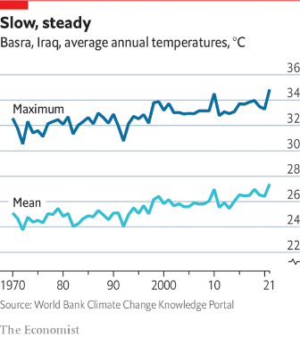
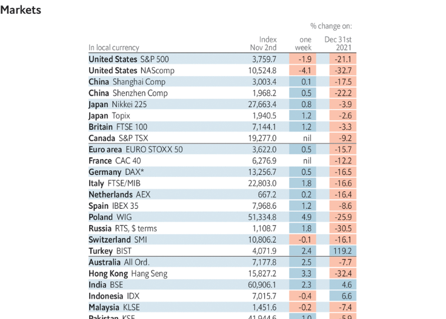
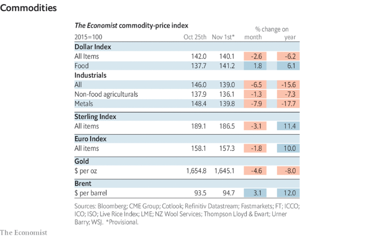

### 1. The world this week
#### 1.1 [Politics](https://www.economist.com/the-world-this-week/2022/11/03/politics)

#### 1.2 [Business](https://www.economist.com/the-world-this-week/2022/11/03/business)

#### 1.3 [KAL’s cartoon](https://www.economist.com/the-world-this-week/2022/11/03/kals-cartoon)
  

### 2. Leaders
#### 2.1 [Goodbye 1.5°C](https://www.economist.com/leaders/2022/11/03/the-world-is-missing-its-lofty-climate-targets-time-for-some-realism)

#### 2.2 [Now for the hard part](https://www.economist.com/leaders/2022/10/31/lula-will-be-brazils-next-president-now-for-the-hard-part)

#### 2.3 [Big tech, big trouble](https://www.economist.com/leaders/2022/11/03/big-tech-big-trouble)

#### 2.4 [Making a meritocracy](https://www.economist.com/leaders/2022/11/02/american-society-is-so-focused-on-race-that-it-is-blind-to-class)

#### 2.5 [Japanese turning](https://www.economist.com/leaders/2022/11/03/japans-bond-market-peg-could-snap)
  

### 3. Letters
#### 3.1 [On cocaine, Liz Truss, pop music, antidepressants, diets](https://www.economist.com/letters/2022/11/03/letters-to-the-editor)

### 4. By Invitation
#### 4.1 [France’s finance minister on how to fight inflation and preserve stability](https://www.economist.com/by-invitation/2022/10/28/frances-finance-minister-on-how-to-fight-inflation-and-preserve-stability)

#### 4.2 [Republicans should focus on kitchen-table issues, argues Governor Glenn Youngkin](https://www.economist.com/by-invitation/2022/10/26/republicans-should-focus-on-kitchen-table-issues-argues-governor-glenn-youngkin)

#### 4.3 [End life tenure for the Supreme Court’s judges, argues Eric Segall](https://www.economist.com/by-invitation/2022/10/24/end-life-tenure-for-the-supreme-courts-judges-argues-eric-segall)

### 5. Briefing
#### 5.1 [An inconvenient truth](https://www.economist.com/interactive/briefing/2022/11/05/the-world-is-going-to-miss-the-totemic-1-5c-climate-target)

### 6. Europe
#### 6.1 [It’s logical](https://www.economist.com/europe/2022/11/03/germanys-parliament-is-more-female-than-it-was)
  

#### 6.2 [Putin’s cold war](https://www.economist.com/europe/2022/11/01/keeping-ukraine-from-freezing-this-winter)

#### 6.3 [Matching the right](https://www.economist.com/europe/2022/11/03/the-social-democrats-hold-on-in-denmark)
  

#### 6.4 [Fake news and censorship](https://www.economist.com/europe/2022/11/03/as-turkey-imposes-a-harsh-disinformation-law-critics-fear-the-worst)

#### 6.5 [The €9m question](https://www.economist.com/europe/2022/11/03/marine-le-pen-says-sanctions-on-russia-are-not-working)

### 7. Britain
#### 7.1 [A winter of walkouts](https://www.economist.com/britain/2022/11/03/britain-faces-a-wave-of-industrial-action-this-winter)

#### 7.2 [Convenience v comfort](https://www.economist.com/britain/2022/11/01/why-government-ministers-dont-stick-to-security-rules)

#### 7.3 [The gathering gloom](https://www.economist.com/britain/2022/11/03/britains-next-recession-may-have-already-begun)
  

#### 7.4 [Donaldson’s dilemma](https://www.economist.com/britain/2022/10/31/the-good-friday-agreement-rests-on-the-dups-ability-to-compromise)

#### 7.5 [Good cop](https://www.economist.com/britain/2022/11/03/the-daunting-task-facing-the-new-head-of-the-metropolitan-police)

#### 7.6 [Go east](https://www.economist.com/britain/2022/11/03/young-britons-head-to-eastern-europe-to-train-as-doctors)

#### 7.7 [Diversity spreads out](https://www.economist.com/britain/2022/11/03/in-britain-immigrants-are-moving-beyond-the-big-cities)
  

#### 7.8 [Why small boats are a big problem](https://www.economist.com/britain/2022/11/02/why-small-boats-are-a-big-problem-for-britain)

### 8. United States
#### 8.1 [Following the money](https://www.economist.com/united-states/2022/11/03/spending-in-americas-midterms-is-breaking-records)

#### 8.2 [The golden mean](https://www.economist.com/united-states/2022/11/03/the-life-and-death-of-california-republicanism)

#### 8.3 [Off colour](https://www.economist.com/united-states/2022/11/01/the-supreme-court-seems-ready-to-toss-out-affirmative-action)

#### 8.4 [Holistic cow](https://www.economist.com/united-states/2022/11/03/how-affirmative-action-works-in-practice)

#### 8.5 [Obamacare’s slow victory](https://www.economist.com/united-states/2022/11/03/obamacares-slow-victory)

#### 8.6 [Bang average](https://www.economist.com/united-states/2022/11/03/are-democrats-chances-being-underplayed)
  

#### 8.7 [Crime and punishment](https://www.economist.com/united-states/2022/11/03/what-democrats-can-learn-from-the-midterm-campaigns)

### 9. Middle East & Africa
#### 9.1 [Powering Africa](https://www.economist.com/middle-east-and-africa/2022/11/03/africa-will-remain-poor-unless-it-uses-more-energy)
  
  

#### 9.2 [Rise of the clans](https://www.economist.com/middle-east-and-africa/2022/11/03/somali-clans-are-revolting-against-jihadists)
  

#### 9.3 [Swinging right](https://www.economist.com/middle-east-and-africa/2022/11/02/netanyahu-seems-on-track-to-be-israels-next-prime-minister)

#### 9.4 [Not quite over the goal line](https://www.economist.com/middle-east-and-africa/2022/11/02/qatar-races-to-ready-itself-for-an-unusual-world-cup)

### 10. The Americas
#### 10.1 [Hallelula](https://www.economist.com/the-americas/2022/11/03/luiz-inacio-lula-da-silva-will-oversee-a-more-divided-brazil)
  

#### 10.2 [Slum dunk](https://www.economist.com/the-americas/2022/11/03/argentinas-slum-policy-is-a-rare-bright-spot-in-the-country)
  

#### 10.3 [Lula’s new world](https://www.economist.com/the-americas/2022/11/03/lulas-foreign-policy-ambitions-will-be-tempered-by-circumstances)

### 11. Asia
#### 11.1 [Open wide your gates](https://www.economist.com/asia/2022/11/03/japan-and-south-korea-are-allowing-in-some-foreign-workers)
  

#### 11.2 [The unkindest cut](https://www.economist.com/asia/2022/11/03/indias-hair-industry-is-in-a-tangle)

#### 11.3 [Once more unto the breach](https://www.economist.com/asia/2022/11/03/a-spate-of-cyber-attacks-is-making-life-miserable-for-australians)

#### 11.4 [The colour of Islam](https://www.economist.com/asia/2022/11/03/indonesias-imams-are-doing-their-bit-for-the-environment)
  

#### 11.5 [Not enough to speak](https://www.economist.com/asia/2022/11/03/when-a-disaster-shakes-a-country-political-leaders-face-peril)

### 12. China
#### 12.1 [Preparing for a fight](https://www.economist.com/china/2022/11/03/xi-jinping-wants-ready-soldiers-and-loyal-generals)

#### 12.2 [Top guns for hire](https://www.economist.com/china/2022/11/03/former-military-pilots-from-the-west-are-being-lured-to-china)

#### 12.3 [Xi’s forever war](https://www.economist.com/china/2022/11/03/the-never-ending-campaign-against-graft-in-china)
  

#### 12.4 [The city that covid forgot](https://www.economist.com/china/2022/11/03/the-chinese-city-that-covid-forgot)

### 13. International
#### 13.1 [Bread-blocking bandits](https://www.economist.com/international/2022/11/02/how-men-with-guns-aggravate-global-hunger)
  
  
  

### 14. Special report
#### 14.1 [The challenge of the age](https://www.economist.com/special-report/2022/11/01/the-world-has-to-adapt-to-the-climate-change-it-will-not-avoid)
  

#### 14.2 [To those who have...](https://www.economist.com/special-report/2022/11/01/money-and-moderately-good-governance-make-climate-change-adaptation-easier)
  

#### 14.3 [Big things and little ones](https://www.economist.com/special-report/2022/11/01/small-climate-projects-cannot-take-the-place-of-all-large-ones)

#### 14.4 [Room at the bottom](https://www.economist.com/special-report/2022/11/01/a-lot-can-be-done-to-adapt-farming-to-near-term-climate-change)
  

#### 14.5 [Looking after their own](https://www.economist.com/special-report/2022/11/01/the-business-of-businesses-is-climate-change-adaptation)

#### 14.6 [Dream bigger](https://www.economist.com/special-report/2022/11/01/public-money-must-pave-the-way-for-private-investment-in-climate-change-adaptation)
  

#### 14.7 [Common sense](https://www.economist.com/special-report/2022/11/01/the-rich-world-is-wrong-to-think-that-climate-impacts-in-poor-countries-dont-matter)

### 15. Business
#### 15.1 [The new conglomerates](https://www.economist.com/business/2022/11/03/what-big-tech-and-buy-out-barons-have-in-common-with-ge)
  
  

#### 15.2 [Bad tech](https://www.economist.com/business/2022/10/31/what-went-wrong-with-snap-netflix-and-uber)
  

#### 15.3 [Twitter wants to charge users based on purchasing-power parity](https://www.economist.com/business/2022/11/03/twitter-wants-to-charge-users-based-on-purchasing-power-parity)
  

#### 15.4 [Singing for its supper](https://www.economist.com/business/2022/11/03/will-people-pay-8-a-month-for-twitter)
  

#### 15.5 [When the circus leaves town](https://www.economist.com/business/2022/11/03/fosuns-big-asset-sale-marks-the-end-of-an-era-in-chinese-business)
  

#### 15.6 [The play’s the thing](https://www.economist.com/business/2022/11/03/how-to-think-about-gamification)

#### 15.7 [Ties that blind](https://www.economist.com/business/2022/11/02/olaf-scholz-leads-a-blue-chip-business-delegation-to-china)

### 16. Finance & economics
#### 16.1 [From crisis to catastrophe](https://www.economist.com/finance-and-economics/2022/10/30/europes-energy-crisis-is-very-far-from-over)
  
  

#### 16.2 [Double trouble](https://www.economist.com/finance-and-economics/2022/11/03/even-recession-may-not-bring-down-europes-inflation)
  

#### 16.3 [Faster, higher, longer](https://www.economist.com/finance-and-economics/2022/11/02/the-fed-delivers-another-jumbo-rate-rise-and-its-far-from-done)

#### 16.4 [A few billion between friends](https://www.economist.com/finance-and-economics/2022/11/03/the-growing-popularity-of-a-strange-form-of-debt-diplomacy)

#### 16.5 [Red faces](https://www.economist.com/finance-and-economics/2022/11/03/financiers-pronouncements-on-china-do-not-match-their-actions)

#### 16.6 [Breaking the banks](https://www.economist.com/finance-and-economics/2022/11/01/xi-jinping-promises-financial-stability-he-is-not-delivering-it)

#### 16.7 [Biden’s billions](https://www.economist.com/finance-and-economics/2022/11/03/how-best-to-bring-back-manufacturing)

### 17. Science & technology
#### 17.1 [A new Great Game](https://www.economist.com/science-and-technology/2022/11/02/americas-defence-department-is-looking-for-rogue-geoengineers)

#### 17.2 [High anxiety](https://www.economist.com/science-and-technology/2022/11/02/anxiety-does-not-cause-bad-results-in-exams)

#### 17.3 [The constant gardeners](https://www.economist.com/science-and-technology/2022/11/02/farmer-giles-the-beetle)

#### 17.4 [In praise of introduced species](https://www.economist.com/science-and-technology/2022/11/02/alien-plants-and-animals-are-not-all-bad)

### 18. Culture
#### 18.1 [Building his case](https://www.economist.com/culture/2022/11/03/recep-tayyip-erdogan-has-given-istanbul-a-controversial-makeover)

#### 18.2 [Mystery lady](https://www.economist.com/culture/2022/11/03/josephine-teys-crime-capers-probed-the-dark-side-of-human-nature)

#### 18.3 [The Balanchine method](https://www.economist.com/culture/2022/11/03/the-life-and-times-of-george-balanchine)

#### 18.4 [The revolution will not be televised](https://www.economist.com/culture/2022/11/03/a-documentary-follows-bobi-wine-on-the-campaign-trail-in-2017-21)

#### 18.5 [Queen of economics](https://www.economist.com/culture/2022/11/03/two-new-biographies-explore-the-rise-and-reign-of-janet-yellen)

#### 18.6 [Not on the same page](https://www.economist.com/culture/2022/11/03/an-argument-is-being-waged-over-research-on-childrens-language)

### 19. Economic & financial indicators
#### 19.1 [Economic data, commodities and markets](https://www.economist.com/economic-and-financial-indicators/2022/11/03/economic-data-commodities-and-markets)
  
  
  
  

### 20. Graphic detail
#### 20.1 [The calm before the storm](https://www.economist.com/graphic-detail/2022/11/03/mild-autumn-weather-has-sent-european-gas-prices-plummeting)
  
  
  

### 21. The Economist explains
#### 21.1 [Has the Ukraine war killed off the ground-attack aircraft?](https://www.economist.com/the-economist-explains/2022/11/01/has-the-ukraine-war-killed-off-the-ground-attack-aircraft)

#### 21.2 [Why blue New York might turn redder in the midterms](https://www.economist.com/the-economist-explains/2022/11/02/why-blue-new-york-might-turn-redder-in-the-midterms)

### 22. Obituary
#### 22.1 [Warrior woman](https://www.economist.com/obituary/2022/11/03/carmen-callil-changed-british-reading-habits-for-ever)

