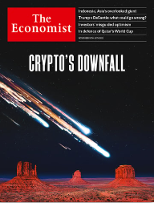
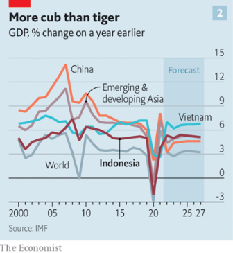
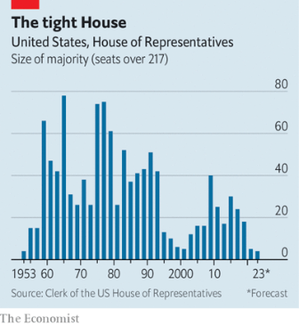
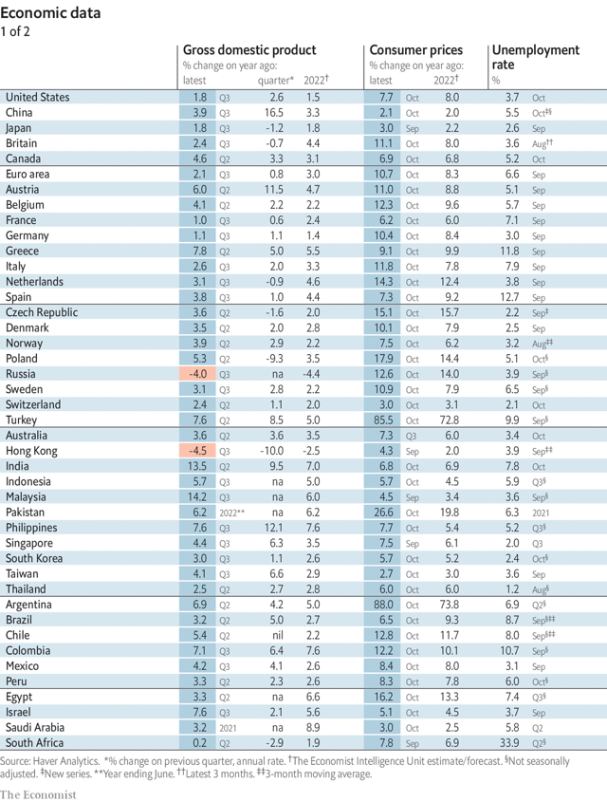

### 1. The world this week
#### 1.1 [Politics](https://www.economist.com/the-world-this-week/2022/11/17/politics)

#### 1.2 [Business](https://www.economist.com/the-world-this-week/2022/11/17/business)
  

#### 1.3 [KAL’s cartoon](https://www.economist.com/the-world-this-week/2022/11/17/kals-cartoon)
  

### 2. Leaders
#### 2.1 [Crypto’s downfall](https://www.economist.com/leaders/2022/11/17/is-this-the-end-of-crypto)

#### 2.2 [Why Indonesia matters](https://www.economist.com/leaders/2022/11/17/why-indonesia-matters)

#### 2.3 [False dawn](https://www.economist.com/leaders/2022/11/17/investors-are-becoming-too-optimistic-about-the-world-economy)

#### 2.4 [Keep calm and carry on](https://www.economist.com/leaders/2022/11/16/russia-needs-a-respite-so-the-west-must-help-ukraine-fight-on)

#### 2.5 [In defence of Qatar](https://www.economist.com/leaders/2022/11/17/in-defence-of-qatars-hosting-of-the-world-cup)

#### 2.6 [Splitting the bill](https://www.economist.com/leaders/2022/11/17/there-is-a-better-way-to-help-poor-countries-fight-climate-change)

### 3. Letters
#### 3.1 [Letters to the editor](https://www.economist.com/letters/2022/11/17/letters-to-the-editor)

### 4. By Invitation
#### 4.1 [Shirin Ebadi on the legal obstacles Iran’s protesters face](https://www.economist.com/by-invitation/2022/11/16/shirin-ebadi-on-the-legal-obstacles-irans-protesters-face)

#### 4.2 [Pieter Pauw on how rich countries should approach “loss and damage” finance](https://www.economist.com/by-invitation/2022/11/17/pieter-pauw-on-how-rich-countries-should-approach-loss-and-damage-finance)

### 5. Briefing
#### 5.1 [Thousand-island progressing](https://www.economist.com/briefing/2022/11/14/indonesia-is-poised-for-a-boom-politics-permitting)
  
  
  
  

#### 5.2 [Hold on for dear life](https://www.economist.com/briefing/2022/11/17/the-failure-of-ftx-and-sam-bankman-fried-will-leave-deep-scars)
  
  

#### 5.3 [EA games](https://www.economist.com/briefing/2022/11/17/what-sam-bankman-frieds-downfall-means-for-effective-altruism)
  

### 6. Europe
#### 6.1 [Second time unlucky](https://www.economist.com/europe/2022/11/17/emmanuel-macrons-tricky-second-term)
  

#### 6.2 [After Kherson](https://www.economist.com/europe/2022/11/17/ukraine-has-momentum-what-it-needs-now-are-munitions)
  

#### 6.3 [Shelter from the storm](https://www.economist.com/europe/2022/11/17/ingenious-ways-of-protecting-civilians-from-russian-bombs)

#### 6.4 [Not so nervous now](https://www.economist.com/europe/2022/11/17/germans-are-less-anxious-than-you-might-think)
  

#### 6.5 [Basque in the spotlight](https://www.economist.com/europe/2022/11/17/written-basque-may-be-1000-years-older-than-anyone-thought)

#### 6.6 [Can we manage?](https://www.economist.com/europe/2022/11/17/a-new-migration-crisis-is-brewing-in-europe)

### 7. Britain
#### 7.1 [Straps around the barrel](https://www.economist.com/britain/2022/11/13/strategic-command-wants-to-bind-britains-armed-forces)
  

#### 7.2 [Green wedge](https://www.economist.com/britain/2022/11/16/an-interview-with-britains-shadow-chancellor)

#### 7.3 [Le bromance?](https://www.economist.com/britain/2022/11/17/a-tentative-reset-of-britains-relationship-with-france)

#### 7.4 [On the fifth day, errands](https://www.economist.com/britain/2022/11/17/a-pilot-scheme-to-trail-the-four-day-workweek-in-britain)

#### 7.5 [BACC to the future](https://www.economist.com/britain/2022/11/17/why-its-time-for-britains-schools-to-kill-off-a-levels)

#### 7.6 [Transgressions](https://www.economist.com/britain/2022/11/17/britain-changes-tack-in-its-treatment-of-trans-identifying-children)

#### 7.7 [The new masculinity](https://www.economist.com/britain/2022/11/17/who-speaks-for-the-great-british-lad)

### 8. United States
#### 8.1 [Series reboot](https://www.economist.com/united-states/2022/11/16/donald-trump-declares-that-he-will-make-america-great-again-again)

#### 8.2 [Triumph of the normies](https://www.economist.com/united-states/2022/11/17/quantifying-the-trump-effect)
  

#### 8.3 [Do do run Ron](https://www.economist.com/united-states/2022/11/17/ron-desantis-may-be-republicans-best-chance-to-prevent-donald-trumps-return)

#### 8.4 [No but yes](https://www.economist.com/united-states/2022/11/11/where-abortion-was-on-the-ballot-americans-voted-to-protect-it)

#### 8.5 [Bucking the trend](https://www.economist.com/united-states/2022/11/17/oklahomas-gay-rodeo-illustrates-an-important-social-phenomenon)

#### 8.6 [Anger management](https://www.economist.com/united-states/2022/11/17/glenn-youngkin-is-a-kinder-gentler-trumpist)

### 9. Middle East & Africa
#### 9.1 [A rotten regime saved, for now, by gas](https://www.economist.com/middle-east-and-africa/2022/11/17/why-algerias-rotten-regime-has-been-lucky)

#### 9.2 [Artful dodgers](https://www.economist.com/middle-east-and-africa/2022/11/17/irans-protesters-are-painting-for-freedom)

#### 9.3 [The cup runneth over](https://www.economist.com/middle-east-and-africa/2022/11/17/qatars-neighbours-hope-for-a-world-cup-tourism-boom)

#### 9.4 [The parable of the African doughnut](https://www.economist.com/middle-east-and-africa/2022/11/17/food-inflation-in-africa-is-shrinking-portions)

#### 9.5 [Back in business](https://www.economist.com/middle-east-and-africa/2022/11/17/fifty-years-after-expulsion-asians-are-thriving-again-in-uganda)

### 10. The Americas
#### 10.1 [Another pot of white gold](https://www.economist.com/the-americas/2022/11/15/argentina-could-help-the-world-by-becoming-a-big-lithium-exporter)
  

#### 10.2 [Deep down in the crypto-dip](https://www.economist.com/the-americas/2022/11/17/el-salvadors-bitcoin-experiment-is-not-paying-off)
  

### 11. Asia
#### 11.1 [Elephants in the long grass](https://www.economist.com/asia/2022/11/17/how-the-rivalry-between-america-and-china-worries-south-east-asia)

#### 11.2 [One steppe forward](https://www.economist.com/asia/2022/11/17/old-politics-in-the-new-kazakhstan)

#### 11.3 [Oh Colombo](https://www.economist.com/asia/2022/11/17/sri-lankas-president-pushes-economic-stability-over-political-reform)

#### 11.4 [Modi and the judges](https://www.economist.com/asia/2022/11/17/indias-new-chief-justice-faces-a-trial-of-strength)

#### 11.5 [Speak softly, bring carrots](https://www.economist.com/asia/2022/11/17/can-japan-compensate-for-americas-tin-eared-asian-diplomacy)

#### 11.6 [Dethroning King Coal](https://www.economist.com/asia/2022/11/16/indonesias-tilt-at-king-coal)
  

### 12. China
#### 12.1 [Posters of protest](https://www.economist.com/china/2022/11/17/chinese-students-abroad-take-on-their-government)

#### 12.2 [Shaky relations](https://www.economist.com/china/2022/11/17/america-and-china-try-to-get-along)

#### 12.3 [Relax a little](https://www.economist.com/china/2022/11/17/china-tweaks-its-zero-covid-policy)
  

#### 12.4 [China’s steampunk covid response](https://www.economist.com/china/2022/11/17/chinas-steampunk-covid-response)

### 13. International
#### 13.1 [Changing the game](https://www.economist.com/international/2022/11/17/the-qatar-world-cup-shows-how-football-is-changing)

### 14. Business
#### 14.1 [Reinventing the wheels](https://www.economist.com/business/2022/11/14/the-race-to-reinvent-the-car-industry)
  

#### 14.2 [Chasing the ball](https://www.economist.com/business/2022/11/17/indias-hospitality-workers-head-to-the-world-cup)

#### 14.3 [Fleeing the nest](https://www.economist.com/business/2022/11/17/alternatives-to-twitter-see-an-influx-of-users)

#### 14.4 [After the party](https://www.economist.com/business/2022/11/17/ftxs-failure-and-softbanks-struggles-point-to-a-tech-investing-hangover)

#### 14.5 [Management balls](https://www.economist.com/business/2022/11/17/management-lessons-from-the-next-world-cup-winners)

#### 14.6 [League of ex-legends](https://www.economist.com/business/2022/11/17/from-ge-to-ftx-beware-the-icarus-complex)

### 15. Finance & economics
#### 15.1 [Worst of both worlds](https://www.economist.com/finance-and-economics/2022/11/15/even-a-global-recession-may-not-bring-down-inflation)
  
  
  

#### 15.2 [Crash watch](https://www.economist.com/finance-and-economics/2022/11/17/big-emerging-market-companies-worry-investors)
  

#### 15.3 [The tenacity of ESG](https://www.economist.com/finance-and-economics/2022/11/16/the-tenacity-of-esg-investing)

#### 15.4 [After the bust](https://www.economist.com/finance-and-economics/2022/11/17/only-a-revived-economy-can-save-chinas-property-industry)

### 16. Science & technology
#### 16.1 [Welcome to the vertiport](https://www.economist.com/science-and-technology/2022/11/16/a-new-type-of-air-terminal-opens-for-flying-taxis)

#### 16.2 [A white elephant flies](https://www.economist.com/science-and-technology/2022/11/16/the-worlds-most-pointless-rocket-has-been-launched-at-last)

#### 16.3 [A meteorite in the Cotswolds](https://www.economist.com/science-and-technology/2022/11/16/a-meteorite-in-the-cotswolds)

#### 16.4 [Lobster brisk](https://www.economist.com/science-and-technology/2022/11/16/protected-areas-affect-lobster-evolution)

### 17. Culture
#### 17.1 [Airs and graces](https://www.economist.com/culture/2022/11/17/the-classical-music-world-is-grappling-with-accessibility)

#### 17.2 [This is what we believe](https://www.economist.com/culture/2022/11/17/a-fascinating-readable-biography-of-friedrich-hayek)

#### 17.3 [Wise children](https://www.economist.com/culture/2022/11/17/peanuts-charles-schulzs-cartoon-probed-the-human-condition)

#### 17.4 [Clash of the titans](https://www.economist.com/culture/2022/11/17/lionel-messi-and-cristiano-ronaldo-have-forged-modern-football)

#### 17.5 [End of the road](https://www.economist.com/culture/2022/11/17/cormac-mccarthy-returns-with-two-new-novels)

#### 17.6 [Mum’s the word](https://www.economist.com/culture/2022/11/17/why-do-some-words-sound-similar-in-completely-unrelated-languages)

### 18. Economic & financial indicators
#### 18.1 [Economic data, commodities and markets](https://www.economist.com/economic-and-financial-indicators/2022/11/17/economic-data-commodities-and-markets)
  
  
  
  

### 19. Graphic detail
#### 19.1 [Poisoned chalices](https://www.economist.com/graphic-detail/2022/11/17/international-sporting-events-are-increasingly-held-in-autocracies)
  
  
  

### 20. The Economist explains
#### 20.1 [Who is Changpeng Zhao, the chief executive of Binance?](https://www.economist.com/the-economist-explains/2022/11/16/who-is-changpeng-zhao-the-chief-executive-of-binance)

#### 20.2 [Why is America debating prison labour?](https://www.economist.com/the-economist-explains/2022/11/11/why-is-america-debating-prison-labour)

### 21. Obituary
#### 21.1 [From friendship to haunting](https://www.economist.com/obituary/2022/11/17/for-hannah-pick-goslar-paths-crossed-in-an-extraordinary-way)

