### 1. The world this week
#### 1.1 [Politics](https://www.economist.com/the-world-this-week/2022/11/24/politics)

#### 1.2 [Business](https://www.economist.com/the-world-this-week/2022/11/24/business)
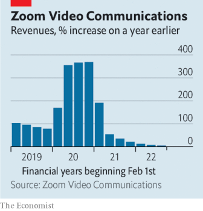  

#### 1.3 [KAL’s cartoon](https://www.economist.com/the-world-this-week/2022/11/24/kals-cartoon)
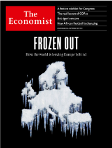  

### 2. Leaders
#### 2.1 [Frozen out](https://www.economist.com/leaders/2022/11/24/europe-faces-an-enduring-crisis-of-energy-and-geopolitics)

#### 2.2 [Disney’s surprise sequel](https://www.economist.com/leaders/2022/11/21/disney-brings-back-a-star-of-the-past-but-its-real-problem-is-the-script)

#### 2.3 [All we want](https://www.economist.com/leaders/2022/11/23/a-wish-list-of-centrist-proposals-for-the-lame-duck-congress)

#### 2.4 [Let them shout](https://www.economist.com/leaders/2022/11/24/russian-offshore-journalists-need-help-not-hindrance)

#### 2.5 [Green competition](https://www.economist.com/leaders/2022/11/24/cop27-was-disappointing-but-us-china-climate-diplomacy-is-thawing)

### 3. Letters
#### 3.1 [On climate change, Bangladesh](https://www.economist.com/letters/2022/11/24/letters-to-the-editor)

### 4. By Invitation
#### 4.1 [Bill Browder and Tony Leon argue that money, not morality, dictates South Africa’s support for Vladimir Putin](https://www.economist.com/by-invitation/2022/11/24/bill-browder-and-tony-leon-argue-that-money-not-morality-dictates-south-africas-support-for-vladimir-putin)

#### 4.2 [A Republican mayor from South Dakota decries the “Trump effect” on his party](https://www.economist.com/by-invitation/2022/11/19/a-republican-mayor-from-south-dakota-decries-the-trump-effect-on-his-party)

### 5. Briefing
#### 5.1 [Chilling prospects](https://www.economist.com/briefing/2022/11/24/the-costs-and-consequences-of-europes-energy-crisis-are-growing)
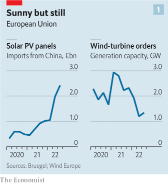  
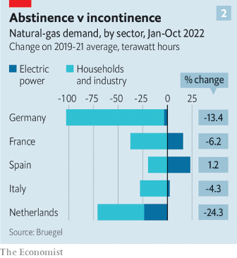  

### 6. Britain
#### 6.1 [Big fans](https://www.economist.com/britain/2022/11/24/why-britain-is-a-world-leader-in-offshore-wind)
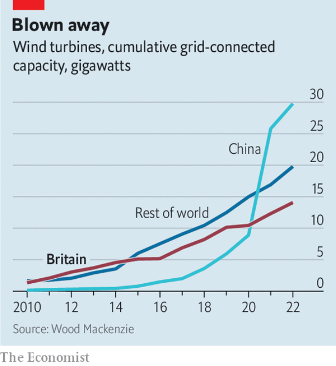  

#### 6.2 [Looking up](https://www.economist.com/britain/2022/11/24/britains-economic-outlook-is-very-gloomy)
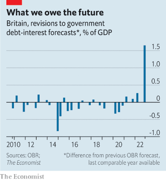  

#### 6.3 [Signs of the times](https://www.economist.com/britain/2022/11/24/what-do-street-names-tell-you-about-britain)

#### 6.4 [A long road](https://www.economist.com/britain/2022/11/23/scotlands-independence-movement-suffers-a-setback-at-the-supreme-court)

#### 6.5 [Out for blood](https://www.economist.com/britain/2022/11/24/waless-trade-in-leeches-and-maggots)

#### 6.6 [Another East End success](https://www.economist.com/britain/2022/11/24/british-bangladeshis-are-doing-astonishingly-well-at-school)
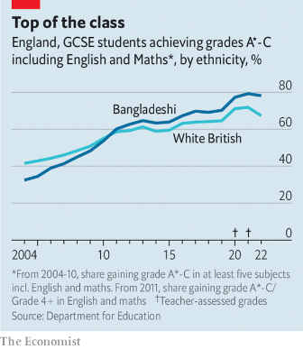  

#### 6.7 [Conservative realism](https://www.economist.com/britain/2022/11/24/it-is-easier-to-imagine-the-end-of-the-world-than-the-end-of-tory-rule)

### 7. Europe
#### 7.1 [The second front](https://www.economist.com/europe/2022/11/22/how-offshore-journalists-challenge-vladimir-putins-empire-of-lies)

#### 7.2 [And the band played on](https://www.economist.com/europe/2022/11/23/in-ukraine-living-as-normal-is-an-act-of-defiance)

#### 7.3 [The Pope’s nein](https://www.economist.com/europe/2022/11/24/reformist-german-catholic-bishops-get-a-dusty-response-from-the-vatican)

#### 7.4 [First reforms, then cash](https://www.economist.com/europe/2022/11/24/the-eu-is-withholding-aid-to-press-hungary-to-reform)

#### 7.5 [Mr Macron goes to Washington](https://www.economist.com/europe/2022/11/24/on-a-visit-to-america-frances-president-will-confront-new-problems)

#### 7.6 [Cut-and-paste politics](https://www.economist.com/europe/2022/11/24/european-politicians-should-steal-more-of-their-neighbours-best-ideas)

### 8. United States
#### 8.1 [Anybody’s thing](https://www.economist.com/united-states/2022/11/22/americas-federal-government-has-ruthlessly-crushed-organised-crime)

#### 8.2 [Orc invasion](https://www.economist.com/united-states/2022/11/24/why-its-hard-to-buy-deodorant-in-manhattan)
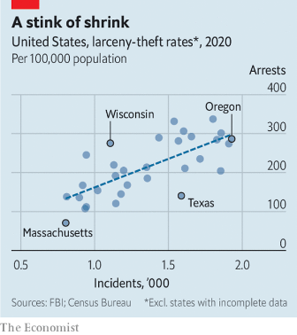  

#### 8.3 [The homeless decline](https://www.economist.com/united-states/2022/11/24/homelessness-is-declining-in-washington-dc)

#### 8.4 [Bench press](https://www.economist.com/united-states/2022/11/24/joe-biden-has-a-chance-to-rebalance-americas-judiciary)
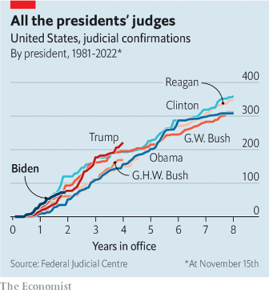  

#### 8.5 [Loan to values](https://www.economist.com/united-states/2022/11/24/racial-discrimination-in-mortgage-lending-has-declined-sharply-in-america)
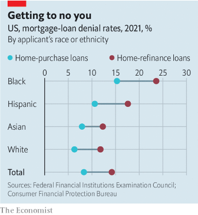  

#### 8.6 [Roll-up, roll-out](https://www.economist.com/united-states/2022/11/24/new-york-state-reckons-its-got-cannabis-legalisation-right)

#### 8.7 [When Dreamers are deferred](https://www.economist.com/united-states/2022/11/24/congress-should-act-now-to-protect-dreamers)

### 9. Middle East & Africa
#### 9.1 [Turmoil at home, jitters abroad](https://www.economist.com/middle-east-and-africa/2022/11/24/while-irans-turmoil-persists-jitters-spread-through-the-region)

#### 9.2 [Sects in the city](https://www.economist.com/middle-east-and-africa/2022/11/24/can-bahrains-division-between-sunnis-and-shias-be-healed)

#### 9.3 [Kicking ahead](https://www.economist.com/middle-east-and-africa/2022/11/24/how-do-budding-african-footballers-make-it-to-the-top)

#### 9.4 [Politics by other means](https://www.economist.com/middle-east-and-africa/2022/11/23/what-saudi-arabias-football-victory-means-for-the-middle-east)

#### 9.5 [Chocolate wars](https://www.economist.com/middle-east-and-africa/2022/11/21/why-the-african-cocoa-cartel-is-a-bad-idea)
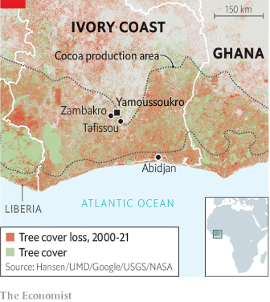  

### 10. The Americas
#### 10.1 [A divided country](https://www.economist.com/the-americas/2022/11/24/mexicos-president-wants-to-develop-the-poorer-south)
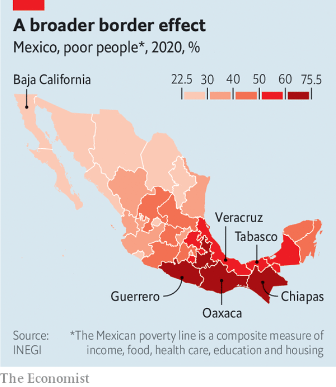  

#### 10.2 [Crying foul](https://www.economist.com/the-americas/2022/11/23/jair-bolsonaros-challenge-to-brazils-election-was-rejected)

#### 10.3 [The bard of Cuba](https://www.economist.com/the-americas/2022/11/24/pablo-milanes-a-great-musician-and-a-critic-of-cubas-regime-has-died)

### 11. Asia
#### 11.1 [Indian realism](https://www.economist.com/asia/2022/11/24/on-foreign-policy-india-is-reliably-unreliable)

#### 11.2 [Pakistan to the rescue](https://www.economist.com/asia/2022/11/24/how-pakistan-emerged-as-a-climate-champion)
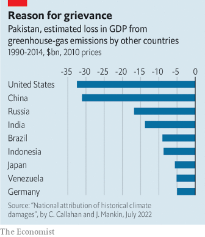  

#### 11.3 [Anwar Ibrahim gets the prize](https://www.economist.com/asia/2022/11/24/anwar-ibrahim-becomes-malaysias-prime-minister)

#### 11.4 [A storm in a satellite dish](https://www.economist.com/asia/2022/11/24/japans-oddball-populists)

#### 11.5 [Lessons from the doghouse](https://www.economist.com/asia/2022/11/24/australia-emerges-from-chinas-doghouse)

### 12. China
#### 12.1 [The road to co-operation](https://www.economist.com/china/2022/11/24/america-and-china-are-talking-again-about-climate-change)

#### 12.2 [Covid confusion](https://www.economist.com/china/2022/11/24/chinas-response-to-a-surge-in-covid-19-cases-is-muddled)
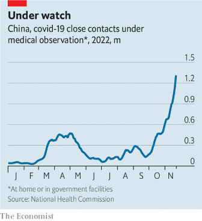  

#### 12.3 [Blessed are the meek](https://www.economist.com/china/2022/11/22/china-wants-to-sinicise-its-catholics)

#### 12.4 [China’s slowdown hurts the young](https://www.economist.com/china/2022/11/24/chinas-slowdown-is-hurting-the-young)

### 13. International
#### 13.1 [Hot tempers](https://www.economist.com/international/2022/11/20/a-new-un-fund-for-loss-and-damage-emerges-from-cop27)
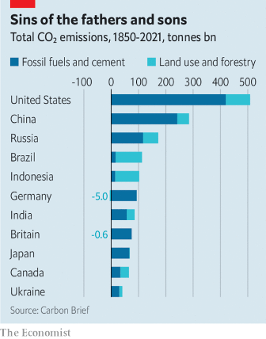  

### 14. Business
#### 14.1 [Giving up on China](https://www.economist.com/business/2022/11/24/multinational-firms-are-finding-it-hard-to-let-go-of-china)
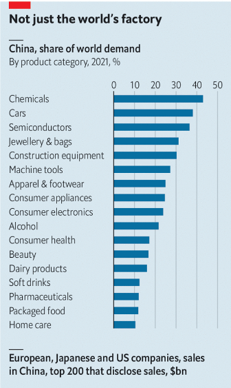  

#### 14.2 [Countdown to lift-off](https://www.economist.com/business/2022/11/24/indian-startups-join-the-space-race)

#### 14.3 [Hard bargains](https://www.economist.com/business/2022/11/24/germanys-biggest-trade-union-strikes-a-deal-on-pay)
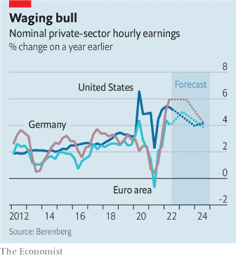  

#### 14.4 [Prime of life](https://www.economist.com/business/2022/11/20/amazon-makes-a-new-push-into-health-care)
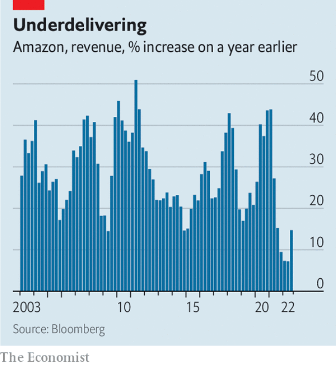  

#### 14.5 [How to do lay-offs right](https://www.economist.com/business/2022/11/24/how-to-do-lay-offs-right)

#### 14.6 [The impossible-to-replace CEO](https://www.economist.com/business/2022/11/23/what-disney-can-learn-from-elton-john)

### 15. Finance & economics
#### 15.1 [Xi’s big bang](https://www.economist.com/finance-and-economics/2022/11/22/xi-jinpings-big-bang-for-chinese-stockmarkets)
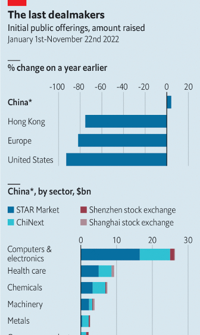  

#### 15.2 [Banking on them](https://www.economist.com/finance-and-economics/2022/11/24/western-officials-need-banks-help-to-keep-money-flowing-to-russia)

#### 15.3 [Cryptzero](https://www.economist.com/finance-and-economics/2022/11/23/how-crypto-goes-to-zero)

#### 15.4 [Hot like Minnesota](https://www.economist.com/finance-and-economics/2022/11/24/why-american-unemployment-needs-to-rise)
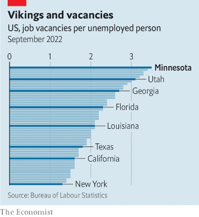  

#### 15.5 [The coming crunch](https://www.economist.com/finance-and-economics/2022/11/24/where-the-coming-housing-crunch-will-be-most-painful)
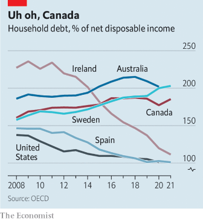  

#### 15.6 [Frightening tightening](https://www.economist.com/finance-and-economics/2022/11/24/why-europe-is-scared-of-quantitative-tightening)

#### 15.7 [Return of the rainmaker](https://www.economist.com/finance-and-economics/2022/11/24/weather-is-again-determining-economic-outcomes)

### 16. Science & technology
#### 16.1 [Building with bacteria](https://www.economist.com/science-and-technology/2022/11/23/adding-bacteria-can-make-concrete-greener)

#### 16.2 [Perseverance perseveres](https://www.economist.com/science-and-technology/2022/11/23/the-latest-news-from-mars)

#### 16.3 [Trust no one](https://www.economist.com/science-and-technology/2022/11/23/another-game-falls-to-an-ai-player)

#### 16.4 [Antibait](https://www.economist.com/science-and-technology/2022/11/23/an-electrical-device-on-a-fishing-line-repels-sharks-and-rays)

#### 16.5 [A new Roman “emperor”](https://www.economist.com/science-and-technology/2022/11/23/a-name-may-be-missing-from-the-annals-of-imperial-rome)

### 17. Culture
#### 17.1 [Tales of the megacity](https://www.economist.com/culture/2022/11/24/can-tokyos-charms-be-replicated-elsewhere)

#### 17.2 [House of horrors](https://www.economist.com/culture/2022/11/24/irans-women-prisoners-face-down-their-inquisitors)

#### 17.3 [Metre made](https://www.economist.com/culture/2022/11/23/the-heights-and-depths-of-humanitys-yearning-to-quantify)

#### 17.4 [Assimilation nation](https://www.economist.com/culture/2022/11/24/the-vanishing-delights-of-americas-jewish-delis)

#### 17.5 [Siege in the capital](https://www.economist.com/culture/2022/11/24/the-forgotten-tale-of-a-hostage-taking-in-washington-in-1977)

#### 17.6 [Iceberg, right ahead](https://www.economist.com/culture/2022/11/23/twenty-five-years-on-titanic-feels-like-a-prophecy)

### 18. Economic & financial indicators
#### 18.1 [Economic data, commodities and markets](https://www.economist.com/economic-and-financial-indicators/2022/11/24/economic-data-commodities-and-markets)
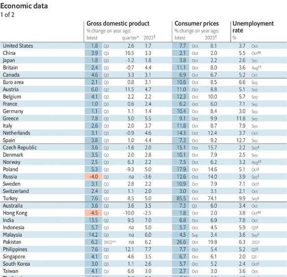  
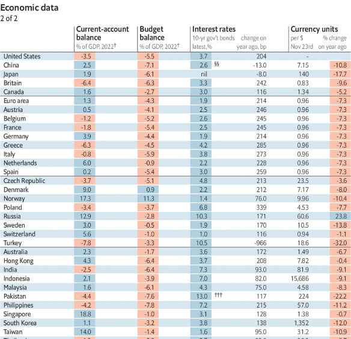  
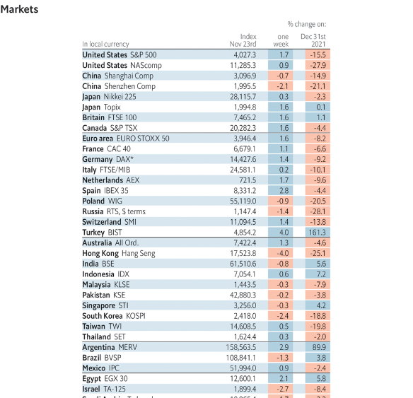  
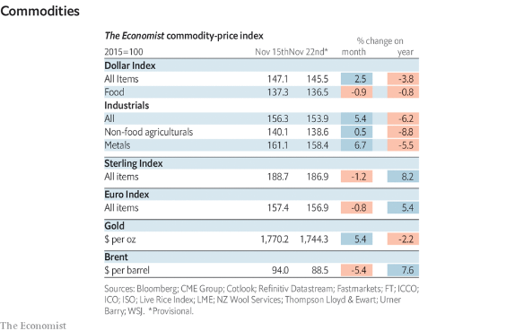  

### 19. Graphic detail
#### 19.1 [Victims of the energy weapon](https://www.economist.com/interactive/graphic-detail/2022/11/26/high-fuel-prices-could-kill-more-europeans-than-fighting-in-ukraine-has)

### 20. The Economist explains
#### 20.1 [What is long-termism?](https://www.economist.com/the-economist-explains/2022/11/22/what-is-long-termism)
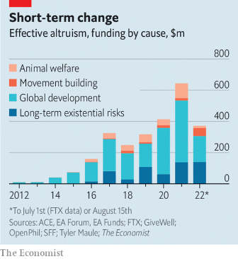  

#### 20.2 [How is Ukraine’s software industry weathering the war?](https://www.economist.com/the-economist-explains/2022/11/21/how-is-ukraines-software-industry-weathering-the-war)

### 21. Obituary
#### 21.1 [A mother’s rage](https://www.economist.com/obituary/2022/11/24/hebe-de-bonafini-lived-through-the-lives-of-her-sons)

