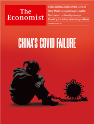
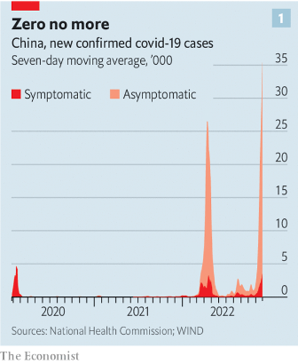

### 1. The world this week
#### 1.1 [Politics](https://www.economist.com/the-world-this-week/2022/12/01/politics)

#### 1.2 [Business](https://www.economist.com/the-world-this-week/2022/12/01/business)
  

#### 1.3 [KAL’s cartoon](https://www.economist.com/the-world-this-week/2022/12/01/kals-cartoon)
  

### 2. Leaders
#### 2.1 [China’s covid failure](https://www.economist.com/leaders/2022/12/01/xi-jinpings-zero-covid-policy-has-turned-a-health-crisis-into-a-political-one)

#### 2.2 [Will the cap fit?](https://www.economist.com/leaders/2022/11/30/the-wests-proposed-price-cap-on-russian-oil-is-no-magic-weapon)
  

#### 2.3 [CoD and chips](https://www.economist.com/leaders/2022/12/01/trustbusters-should-let-microsoft-buy-activision-blizzard)

#### 2.4 [The digital front](https://www.economist.com/leaders/2022/12/01/why-russias-cyber-attacks-have-fallen-flat)

#### 2.5 [The wounds of silence](https://www.economist.com/leaders/2022/12/01/sexual-problems-can-wreck-lives-yet-remedies-are-often-simple)

### 3. Letters
#### 3.1 [Letters to the editor](https://www.economist.com/letters/2022/12/01/letters-to-the-editor)

### 4. By Invitation
#### 4.1 [The Chinese government exercises control through local busybodies, explains Lynette H. Ong](https://www.economist.com/by-invitation/2022/12/01/the-chinese-government-exercises-control-through-local-busybodies-explains-lynette-h-ong)

#### 4.2 [The protests in China may change the way Xi Jinping runs the country, says Minxin Pei](https://www.economist.com/by-invitation/2022/11/30/the-protests-in-china-may-change-the-way-xi-jinping-runs-the-country-says-minxin-pei)

### 5. Briefing
#### 5.1 [Zero options](https://www.economist.com/briefing/2022/12/01/chinas-failing-covid-strategy-leaves-xi-jinping-with-no-good-options)
  
  
  

### 6. Britain
#### 6.1 [Wear and care](https://www.economist.com/britain/2022/11/28/britains-social-care-sector-is-in-even-worse-shape-than-its-health-service)
  

#### 6.2 [Few on pews](https://www.economist.com/britain/2022/11/30/christianity-is-a-minority-religion-in-england-and-wales)
  

#### 6.3 [Tory jarheads](https://www.economist.com/britain/2022/12/01/the-conservative-partys-addiction-to-brawling)

#### 6.4 [Here’s an idea](https://www.economist.com/britain/2022/12/01/does-britain-have-a-problem-with-r-and-d-spending)
  

#### 6.5 [Royal erosion](https://www.economist.com/britain/2022/12/01/the-elizabethan-era-is-not-yet-at-an-end)

#### 6.6 [Insulation nation](https://www.economist.com/britain/2022/11/28/britain-gets-serious-about-sealing-up-its-draughty-homes)
  

#### 6.7 [If you don’t like it, there’s the door](https://www.economist.com/britain/2022/12/01/emigration-is-in-the-air-for-britons)

### 7. Europe
#### 7.1 [Crimean War](https://www.economist.com/europe/2022/11/27/a-ukrainian-attempt-to-retake-crimea-would-be-bloody-and-difficult)
  

#### 7.2 [Big Viktor is watching](https://www.economist.com/europe/2022/12/01/how-hungary-used-citizens-covid-data-to-help-the-ruling-party)

#### 7.3 [Angela Merkel’s faded glory](https://www.economist.com/europe/2022/12/01/views-of-angela-merkels-16-years-in-power-have-become-harsher)

#### 7.4 [Unreasonably blue](https://www.economist.com/europe/2022/12/01/the-spanish-are-too-grumpy-about-their-politics)
  
  

#### 7.5 [So goes the blow](https://www.economist.com/europe/2022/12/01/europol-pulls-off-a-massive-cocaine-bust)

#### 7.6 [United States, divided Europe](https://www.economist.com/europe/2022/12/01/americas-green-subsidies-are-causing-headaches-in-europe)

### 8. United States
#### 8.1 [The conundrum of three-way nuclear deterrence](https://www.economist.com/united-states/2022/11/29/how-will-america-deal-with-three-way-nuclear-deterrence)
  

#### 8.2 [No harm intended](https://www.economist.com/united-states/2022/12/01/americas-syringe-exchanges-kill-drug-users)

#### 8.3 [To the winners, the spoilers](https://www.economist.com/united-states/2022/11/30/the-democrats-muster-an-orderly-leadership-succession)

#### 8.4 [Bodies, bodies, bodies](https://www.economist.com/united-states/2022/12/01/women-are-revitalising-americas-funeral-services-industry)

#### 8.5 [In vino veritas](https://www.economist.com/united-states/2022/12/01/a-winemakers-lawsuit-against-napa-county-is-about-more-than-sour-grapes)

#### 8.6 [Star dreck](https://www.economist.com/united-states/2022/12/01/elon-musk-is-showing-what-a-waste-of-time-twitter-can-be)

### 9. Middle East & Africa
#### 9.1 [Too poor to strike](https://www.economist.com/middle-east-and-africa/2022/11/29/irans-regime-is-using-threats-arrests-and-pay-rises-to-silence-workers)
  

#### 9.2 [Numbers is just a book in the Bible](https://www.economist.com/middle-east-and-africa/2022/12/01/as-religious-schools-in-israel-grow-maths-is-neglected)
  

#### 9.3 [Ranch of government](https://www.economist.com/middle-east-and-africa/2022/12/01/a-sofa-stuffed-with-cash-imperils-south-africas-president)

#### 9.4 [Mine craft](https://www.economist.com/middle-east-and-africa/2022/12/01/how-technology-is-helping-reduce-the-menace-of-landmines)

#### 9.5 [Brotherhood of bikers](https://www.economist.com/middle-east-and-africa/2022/12/01/kenyas-boda-boda-taxis-are-unruly-in-life-and-death)

### 10. The Americas
#### 10.1 [Oil be back](https://www.economist.com/the-americas/2022/11/27/president-joe-biden-starts-to-lift-sanctions-on-venezuela)
  

#### 10.2 [The coming swing to the right](https://www.economist.com/the-americas/2022/12/01/recent-left-wing-triumphs-in-latin-america-may-prove-short-lived)

### 11. Asia
#### 11.1 [When the chips are down](https://www.economist.com/asia/2022/12/01/americas-asian-allies-dislike-its-tech-war-on-china)

#### 11.2 [Across the Strait, a lockdown protest](https://www.economist.com/asia/2022/11/29/across-the-taiwan-strait-another-lockdown-protest)

#### 11.3 [Hail the chief](https://www.economist.com/asia/2022/12/01/pakistanis-turn-against-the-army)

#### 11.4 [Mongrel mobsters](https://www.economist.com/asia/2022/12/01/why-new-zealand-has-such-a-high-rate-of-gang-membership)

#### 11.5 [Pilgrim’s progress](https://www.economist.com/asia/2022/12/01/narendra-modi-is-about-to-fulfil-a-core-promise-to-hindus)

#### 11.6 [How the other half live](https://www.economist.com/asia/2022/11/29/what-two-crimes-reveal-about-violence-against-indian-women)
  

### 12. China
#### 12.1 [Echoes of the past](https://www.economist.com/china/2022/12/01/what-1989-can-teach-us-about-the-recent-protests-in-china)

#### 12.2 [Solidarity, of a sort](https://www.economist.com/china/2022/12/01/harsh-lockdowns-have-united-the-chinese)

#### 12.3 [Testing the party](https://www.economist.com/china/2022/12/01/students-are-often-at-the-heart-of-protests-in-china)

#### 12.4 [Lessons from a protest](https://www.economist.com/china/2022/12/01/lessons-from-a-chinese-protest)

### 13. International
#### 13.1 [Talking about it at last](https://www.economist.com/international/2022/12/01/the-taboos-around-sexual-health-are-weakening)

### 14. Business
#### 14.1 [America’s best firms…and the rest](https://www.economist.com/business/2022/11/27/the-new-winners-and-losers-in-business)

#### 14.2 [Game on or game over?](https://www.economist.com/business/2022/11/29/microsoft-activision-blizzard-and-the-future-of-gaming)
  

#### 14.3 [The hand on the tap](https://www.economist.com/business/2022/12/01/meet-the-man-who-may-decide-the-fate-of-german-industry)

#### 14.4 [Ins and outs](https://www.economist.com/business/2022/12/01/the-open-questions-of-hybrid-working)

#### 14.5 [The other gig economy](https://www.economist.com/business/2022/12/01/if-ticketmaster-is-a-greedy-capitalist-so-is-taylor-swift)

### 15. Finance & economics
#### 15.1 [Crude weapon](https://www.economist.com/finance-and-economics/2022/11/30/how-the-wests-price-cap-on-russian-oil-could-roil-energy-markets)
  

#### 15.2 [Uncle Sham](https://www.economist.com/finance-and-economics/2022/12/01/dubious-green-funds-are-rampant-in-america)

#### 15.3 [Laundry softener](https://www.economist.com/finance-and-economics/2022/12/01/the-eus-top-court-just-made-it-harder-to-uncover-dirty-money)
  

#### 15.4 [Vault face](https://www.economist.com/finance-and-economics/2022/12/01/why-central-banks-are-stockpiling-gold)
  

#### 15.5 [Fiscal feud](https://www.economist.com/finance-and-economics/2022/12/01/developing-countries-take-tax-talks-to-the-un)
  

#### 15.6 [PE-kaboo](https://www.economist.com/finance-and-economics/2022/12/01/has-private-equity-avoided-the-asset-price-crash)

#### 15.7 [I’ll do things for you](https://www.economist.com/finance-and-economics/2022/12/01/a-playbook-from-the-1980s-for-dealing-with-inflation)

### 16. Science & technology
#### 16.1 [A nest of wipers](https://www.economist.com/science-and-technology/2022/11/30/lessons-from-russias-cyber-war-in-ukraine)

#### 16.2 [Black hats, white hats, grey hats](https://www.economist.com/science-and-technology/2022/11/30/how-cybercriminals-have-been-affected-by-the-war-in-ukraine)

#### 16.3 [Ill winds](https://www.economist.com/science-and-technology/2022/11/29/air-pollution-can-drive-people-to-kill-themselves)

#### 16.4 [Enter lecanemab](https://www.economist.com/science-and-technology/2022/11/30/a-drug-for-alzheimers-disease-that-seems-to-work)

#### 16.5 [An amphibious dinosaur from the Cretaceous](https://www.economist.com/science-and-technology/2022/12/01/an-amphibious-dinosaur-from-the-cretaceous)

### 17. Culture
#### 17.1 [The algorithm’s mercy](https://www.economist.com/culture/2022/11/30/two-new-books-explore-the-upside-of-big-data-and-ai)

#### 17.2 [In the doge house](https://www.economist.com/culture/2022/12/01/la-serenissima-is-an-entertaining-ode-to-venice)

#### 17.3 [Art against war](https://www.economist.com/culture/2022/12/01/ukraines-modernist-art-has-defied-censorship-and-missiles)

#### 17.4 [Home truths](https://www.economist.com/culture/2022/12/01/animal-life-is-the-latest-book-from-a-thought-provoking-novelist)

#### 17.5 [Rise of the cyborgs](https://www.economist.com/culture/2022/11/30/the-translator-of-the-future-is-a-human-machine-hybrid)

#### 17.6 [Heaven with the gates off](https://www.economist.com/culture/2022/12/01/the-dream-and-nightmares-of-council-estates)

### 18. Economic & financial indicators
#### 18.1 [Economic data, commodities and markets](https://www.economist.com/economic-and-financial-indicators/2022/12/01/economic-data-commodities-and-markets)
  
  
  
  

### 19. Graphic detail
#### 19.1 [Margins matter](https://www.economist.com/graphic-detail/2022/12/01/the-world-cups-group-stage-bodes-well-for-spain-and-england)
  
  
  

### 20. The Economist explains
#### 20.1 [Why has America’s army recruitment plummeted?](https://www.economist.com/the-economist-explains/2022/11/29/why-has-americas-army-recruitment-plummeted)

#### 20.2 [Why are boys doing badly at school?](https://www.economist.com/the-economist-explains/2022/11/23/why-are-boys-doing-badly-at-school)
  

### 21. Obituary
#### 21.1 [An unlikely strongman](https://www.economist.com/obituary/2022/11/30/jiang-zemin-oversaw-a-wave-of-economic-change-but-not-much-political-reform)

