### 1. The world this week
#### 1.1 [Politics](https://www.economist.com/the-world-this-week/2022/12/08/politics)

#### 1.2 [Business](https://www.economist.com/the-world-this-week/2022/12/08/business)

#### 1.3 [KAL’s cartoon](https://www.economist.com/the-world-this-week/2022/12/08/kals-cartoon)
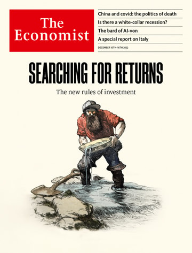  

### 2. Leaders
#### 2.1 [Free the north](https://www.economist.com/leaders/2022/12/08/how-to-invigorate-britains-second-tier-cities)

#### 2.2 [What is the plan?](https://www.economist.com/leaders/2022/12/07/china-is-loosening-its-covid-restrictions-at-great-risk)

#### 2.3 [Crying out for reform](https://www.economist.com/leaders/2022/12/08/why-italy-like-europe-is-crying-out-for-big-reform)

#### 2.4 [Charter fights](https://www.economist.com/leaders/2022/12/08/canadas-constitution-is-being-trampled-by-populists)

#### 2.5 [The new rules](https://www.economist.com/leaders/2022/12/08/investing-in-an-era-of-higher-interest-rates-and-scarcer-capital)

### 3. Letters
#### 3.1 [On Chinese students, FTX, Britain’s spending cuts, Kazakhstan, classical music, “When Harry Met Sally”](https://www.economist.com/letters/2022/12/08/letters-to-the-editor)

### 4. By Invitation
#### 4.1 [A former French ambassador on the paradox unveiled by the war in Ukraine](https://www.economist.com/by-invitation/2022/12/07/a-former-french-ambassador-on-the-paradox-unveiled-by-the-war-in-ukraine)

#### 4.2 [A crypto-exchange founder makes his case for decentralised finance](https://www.economist.com/by-invitation/2022/12/06/a-crypto-exchange-founder-makes-his-case-for-decentralised-finance)

### 5. Briefing
#### 5.1 [When the tide turns](https://www.economist.com/briefing/2022/12/08/rising-interest-rates-and-inflation-have-upended-investing)
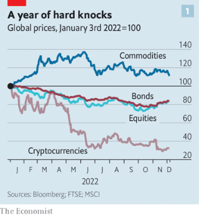  
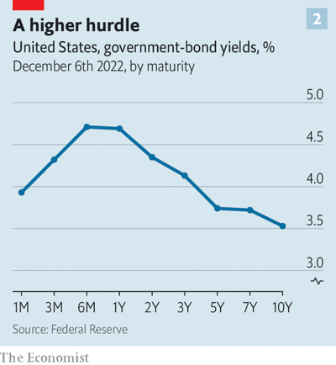  
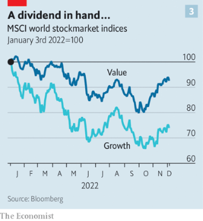  

### 6. Europe
#### 6.1 [The traffic-light at one](https://www.economist.com/europe/2022/12/07/germanys-ruling-coalition-marks-its-first-anniversary)
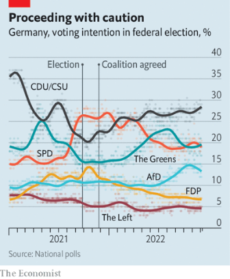  

#### 6.2 [The unhappy prince](https://www.economist.com/europe/2022/12/07/german-police-arrest-two-dozen-alleged-conspirators-in-a-hare-brained-plot-to-overthrow-the-government)

#### 6.3 [The battle for Bakhmut](https://www.economist.com/europe/2022/12/06/russia-is-hurling-troops-at-the-tiny-ukrainian-town-of-bakhmut)
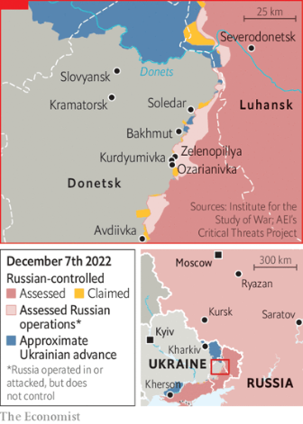  

#### 6.4 [The silence of the Russians](https://www.economist.com/europe/2022/12/08/in-moscow-all-dissent-is-muzzled)

#### 6.5 [Smart warfare](https://www.economist.com/europe/2022/12/08/ukraine-is-using-foreign-tech-to-mitigate-russian-destruction)

#### 6.6 [C’est easy-peasy](https://www.economist.com/europe/2022/12/08/why-the-french-are-mangling-their-own-language)

#### 6.7 [Cancel sculpture](https://www.economist.com/europe/2022/12/08/europe-is-grappling-with-its-dodgy-memorials-a-plinth-at-a-time)

### 7. Britain
#### 7.1 [The sputtering engine of the north](https://www.economist.com/britain/2022/12/08/manchester-lacks-the-power-to-change-its-fortunes)
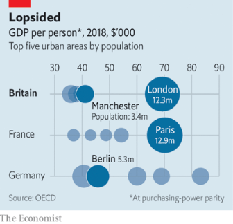  
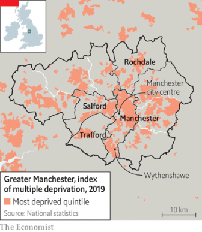  

#### 7.2 [A test of radicalism](https://www.economist.com/britain/2022/12/05/britains-labour-party-ponders-a-new-generation-of-social-rights)

#### 7.3 [Tapped out](https://www.economist.com/britain/2022/12/08/brewers-pray-for-england-to-stay-in-the-world-cup)

#### 7.4 [Traffic fights](https://www.economist.com/britain/2022/12/08/asylum-claims-by-albanians-spark-debate-over-a-landmark-british-law)

#### 7.5 [The family silver](https://www.economist.com/britain/2022/12/06/small-pension-funds-are-britains-likeliest-source-of-growth-capital)
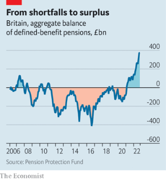  

#### 7.6 [Mind your manners (or go to jail)](https://www.economist.com/britain/2022/12/08/britains-actual-problem-with-free-speech)

### 8. United States
#### 8.1 [Last-minute bargains](https://www.economist.com/united-states/2022/12/08/what-to-expect-from-congresss-lame-duck-session)

#### 8.2 [Moore or less](https://www.economist.com/united-states/2022/12/08/the-supreme-court-searches-for-a-middle-way)

#### 8.3 [High deductibles](https://www.economist.com/united-states/2022/12/07/two-trump-organisation-companies-are-found-guilty-of-tax-fraud)

#### 8.4 [Cat got your tern](https://www.economist.com/united-states/2022/12/08/feral-house-cats-have-invaded-hawaii)

#### 8.5 [Beginnings and endings](https://www.economist.com/united-states/2022/12/03/young-americans-increasingly-end-their-own-lives)
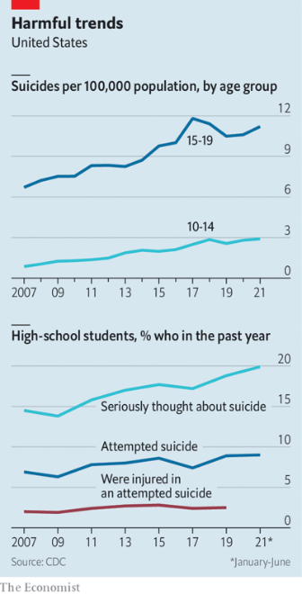  

#### 8.6 [Defender of the faith](https://www.economist.com/united-states/2022/12/08/what-democrats-and-republicans-can-learn-from-raphael-warnock)

### 9. Middle East & Africa
#### 9.1 [Arabs looking east](https://www.economist.com/middle-east-and-africa/2022/12/07/the-gulf-looks-to-china)
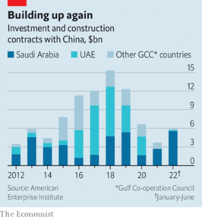  

#### 9.2 [Off with those scarves!](https://www.economist.com/middle-east-and-africa/2022/12/04/irans-rattled-government-may-be-backing-down)

#### 9.3 [To reap, perchance, per diem](https://www.economist.com/middle-east-and-africa/2022/12/08/what-tanzanias-per-diem-town-says-about-african-governance)

#### 9.4 [Sofa so good](https://www.economist.com/middle-east-and-africa/2022/12/08/cyril-ramaphosa-is-contesting-efforts-to-oust-him)

#### 9.5 [Lessons in poverty](https://www.economist.com/middle-east-and-africa/2022/12/08/one-of-the-worlds-poorest-countries-is-betting-big-on-schools)

### 10. The Americas
#### 10.1 [A bomb lodged in the constitution](https://www.economist.com/the-americas/2022/12/08/the-ticking-bomb-under-canadas-constitution)

#### 10.2 [Castillo the brief](https://www.economist.com/the-americas/2022/12/07/after-a-bungled-coup-attempt-perus-president-falls)

#### 10.3 [An adiós in troubled times](https://www.economist.com/the-americas/2022/12/08/latin-america-is-in-a-mess-but-it-still-has-strengths)

#### 10.4 [Peronist in peril](https://www.economist.com/the-americas/2022/12/07/cristina-fernandez-de-kirchner-is-found-guilty-of-corruption)

### 11. Asia
#### 11.1 [Gujaratification](https://www.economist.com/asia/2022/12/08/narendra-modis-tough-medicine)
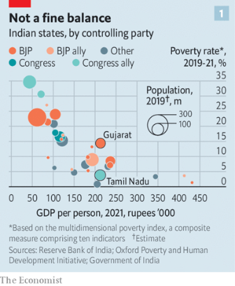  
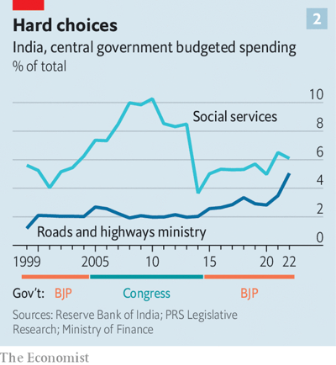  

#### 11.2 [Dead convicts and a peculiar murder](https://www.economist.com/asia/2022/12/08/dead-convicts-and-a-peculiar-murder-in-the-philippines)

#### 11.3 [Manga v webtoons](https://www.economist.com/asia/2022/12/08/japanese-manga-are-being-eclipsed-by-korean-webtoons)

#### 11.4 [Bad news for Bali](https://www.economist.com/asia/2022/12/08/indonesias-ban-on-extramarital-sex-represents-a-turn-for-the-worse)

#### 11.5 [Karma chameleon](https://www.economist.com/asia/2022/12/08/which-version-of-anwar-ibrahim-will-govern-malaysia)

#### 11.6 [China’s cash gift to the rest of Asia](https://www.economist.com/asia/2022/12/05/chinas-ban-on-gambling-is-a-cash-gift-to-the-rest-of-asia)

### 12. China
#### 12.1 [Dismantling the machine](https://www.economist.com/china/2022/12/06/china-is-dismantling-its-zero-covid-machine)

#### 12.2 [Obstinate elders](https://www.economist.com/china/2022/12/08/getting-chinas-old-people-vaccinated-has-been-slow-work)
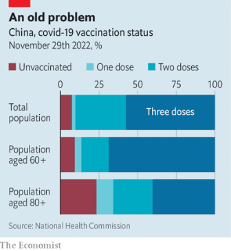  

#### 12.3 [Good, good, good](https://www.economist.com/china/2022/12/08/how-chinese-netizens-breached-the-great-firewall)

#### 12.4 [The politics of death in China](https://www.economist.com/china/2022/12/08/the-politics-of-death-in-china)

### 13. International
#### 13.1 [An uneven contest](https://www.economist.com/international/2022/12/08/chinas-deep-water-fishing-fleet-is-the-worlds-most-rapacious)
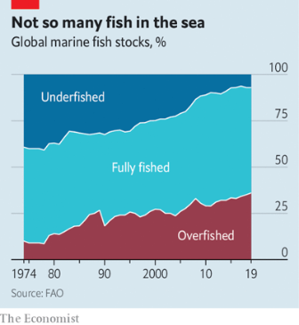  

### 14. Special report
#### 14.1 [Wanted: an Italian Thatcher](https://www.economist.com/special-report/2022/12/05/italys-new-government-needs-to-make-deep-economic-reforms)

#### 14.2 [The cost of vulnerability](https://www.economist.com/special-report/2022/12/05/external-shocks-have-hit-the-italian-economy-hard)
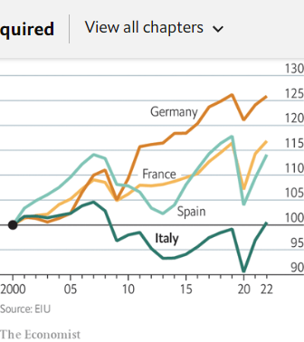  

#### 14.3 [Spreadeagled](https://www.economist.com/special-report/2022/12/05/why-is-italys-public-debt-burden-so-big)
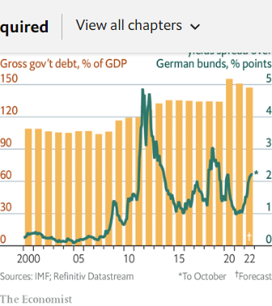  

#### 14.4 [Structural faults](https://www.economist.com/special-report/2022/12/05/italys-protected-sectors-need-exposure-to-more-competition)

#### 14.5 [Sunrise or sunset?](https://www.economist.com/special-report/2022/12/05/southern-italy-needs-private-enterprise-and-infrastructure)
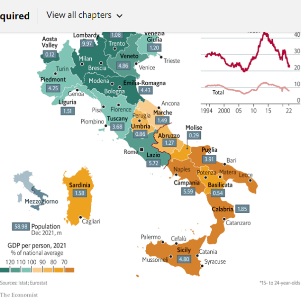  

#### 14.6 [Italy’s bane](https://www.economist.com/special-report/2022/12/05/political-instability-in-italy-has-always-affected-reform)
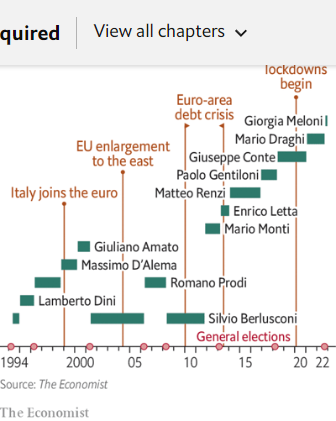  

#### 14.7 [The houses that Giuseppe sold](https://www.economist.com/special-report/2022/12/05/italy-is-trying-to-deal-with-its-demographic-decline)
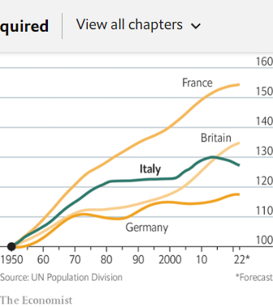  

#### 14.8 [A new reform spirit](https://www.economist.com/special-report/2022/12/05/italy-needs-to-learn-from-other-countries-on-structural-changes)

#### 14.9 [Sources and acknowledgments](https://www.economist.com/special-report/2022/12/07/sources-and-acknowledgments)

### 15. Business
#### 15.1 [The new age of AI](https://www.economist.com/business/2022/12/06/artificial-intelligence-is-permeating-business-at-last)
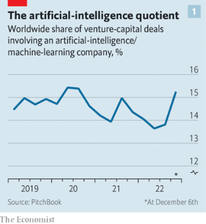  
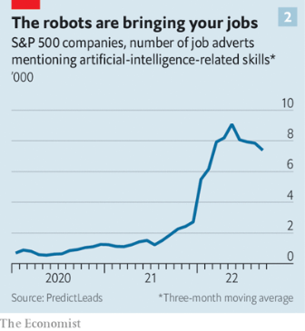  

#### 15.2 [The bard of AI-von](https://www.economist.com/business/2022/12/08/how-good-is-chatgpt)

#### 15.3 [The value of zero](https://www.economist.com/business/2022/12/08/what-next-for-chinas-covid-industrial-complex)

#### 15.4 [The scourge of title inflation](https://www.economist.com/business/2022/12/08/the-scourge-of-job-title-inflation)

#### 15.5 [Axeing questions](https://www.economist.com/business/2022/12/04/is-a-white-collar-recession-looming)
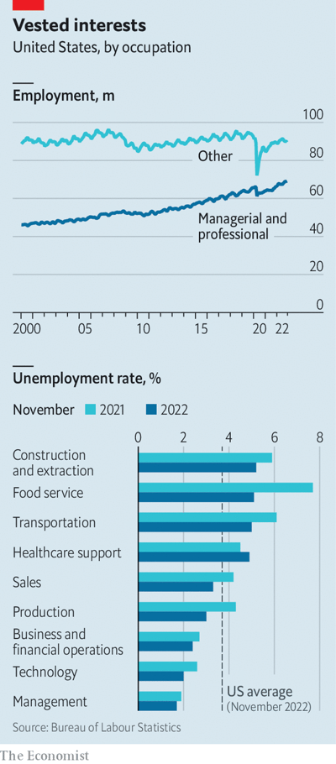  

#### 15.6 [Supercharging super-apps](https://www.economist.com/business/2022/12/08/the-rise-of-the-super-app)

### 16. Finance & economics
#### 16.1 [The incredible shrinking plan](https://www.economist.com/finance-and-economics/2022/12/05/can-you-afford-to-retire)
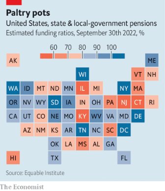  
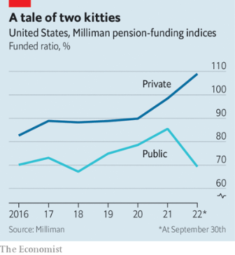  

#### 16.2 [The chips hit the fan](https://www.economist.com/finance-and-economics/2022/12/08/a-global-electronics-slump-is-driving-east-asia-to-the-wall)
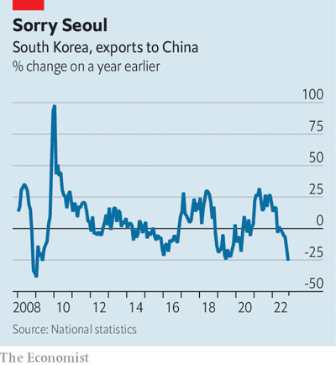  

#### 16.3 [The monetary marathon](https://www.economist.com/finance-and-economics/2022/12/07/inflation-is-falling-but-not-enough)
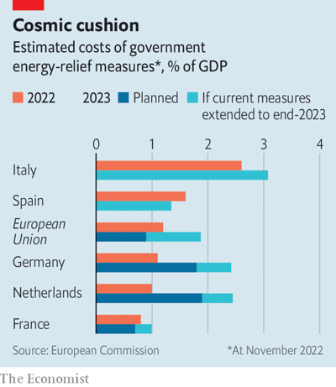  

#### 16.4 [Concrete jungle](https://www.economist.com/finance-and-economics/2022/12/08/europe-and-america-put-a-brave-face-on-a-growing-economic-rift)
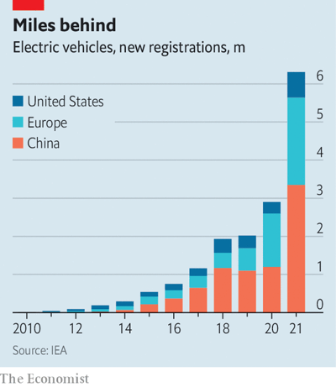  

#### 16.5 [Thrill bills](https://www.economist.com/finance-and-economics/2022/12/08/every-country-is-an-emerging-market-now)

#### 16.6 [The cost of impunity](https://www.economist.com/finance-and-economics/2022/12/08/tackling-sexual-harassment-could-bring-sizeable-economic-dividends)

### 17. Science & technology
#### 17.1 [Q-boats](https://www.economist.com/science-and-technology/2022/12/07/ukrainian-ingenuity-is-ushering-in-a-new-form-of-warfare-at-sea)

#### 17.2 [Silent synapses](https://www.economist.com/science-and-technology/2022/12/07/how-adult-brains-learn-the-new-without-forgetting-the-old)

#### 17.3 [Join the club](https://www.economist.com/science-and-technology/2022/12/07/a-new-explanation-for-ankylosaurs-clubbed-tails)

#### 17.4 [Cheers!](https://www.economist.com/science-and-technology/2022/12/07/a-find-by-a-student-in-ireland-plugs-a-gap-in-the-history-of-lager)

### 18. Culture
#### 18.1 [The good books](https://www.economist.com/culture/2022/12/06/these-are-the-economists-best-books-of-2022)

#### 18.2 [The midnight oil](https://www.economist.com/culture/2022/12/08/our-correspondents-wrote-about-polling-sanctions-and-economics)

### 19. Economic & financial indicators
#### 19.1 [Economic data, commodities and markets](https://www.economist.com/economic-and-financial-indicators/2022/12/08/economic-data-commodities-and-markets)
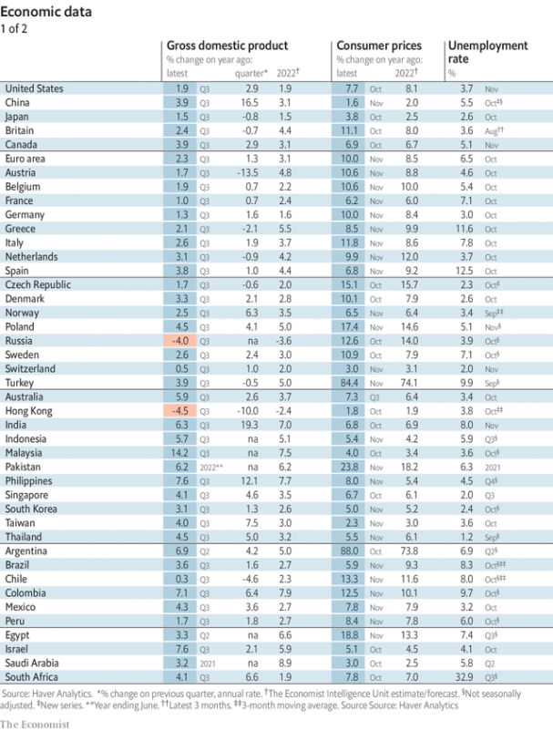  
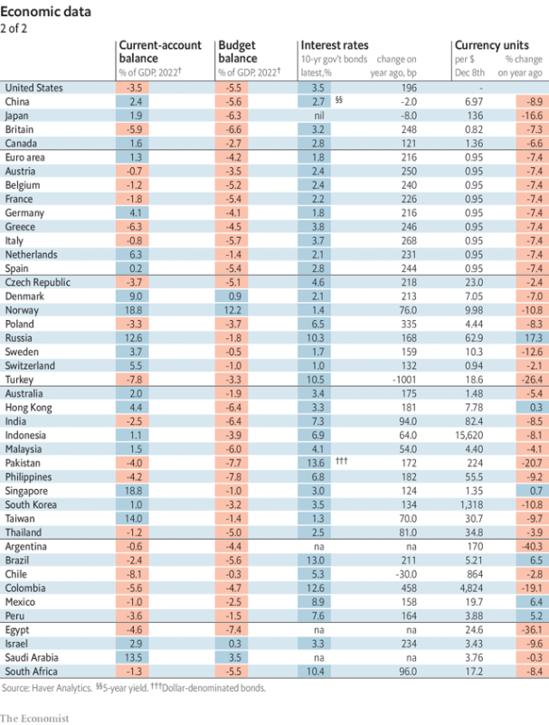  
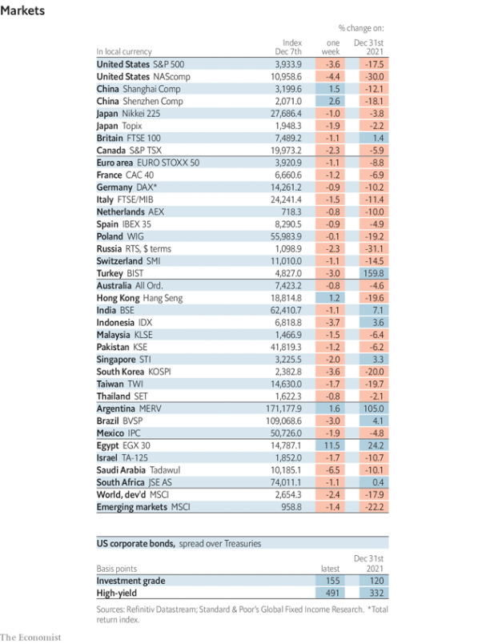  
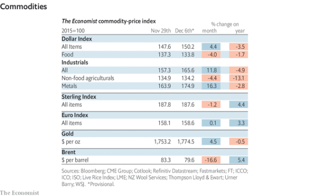  

### 20. Graphic detail
#### 20.1 [Lifting the veil](https://www.economist.com/graphic-detail/2022/12/08/protest-movements-as-deadly-as-irans-often-end-in-revolution-or-civil-war)
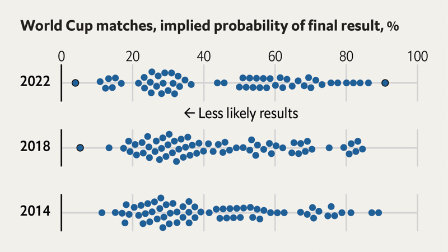  
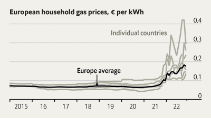  
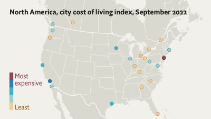  

### 21. The Economist explains
#### 21.1 [Why Darjeeling tea may face extinction](https://www.economist.com/the-economist-explains/2022/12/06/why-darjeeling-tea-may-face-extinction)

#### 21.2 [Can hydropower help ease Europe’s energy crisis?](https://www.economist.com/the-economist-explains/2022/12/05/can-hydropower-help-ease-europes-energy-crisis)
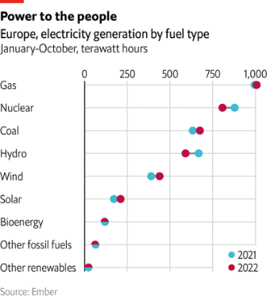  
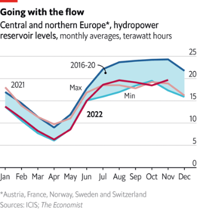  
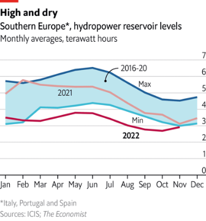  

### 22. Obituary
#### 22.1 [The shadow-lover](https://www.economist.com/obituary/2022/12/08/jay-pasachoff-travelled-the-world-to-catch-the-moon-eclipsing-the-sun)

