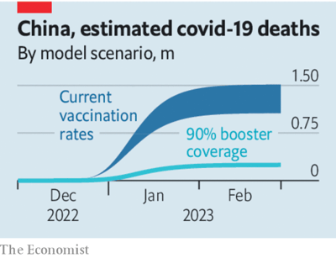
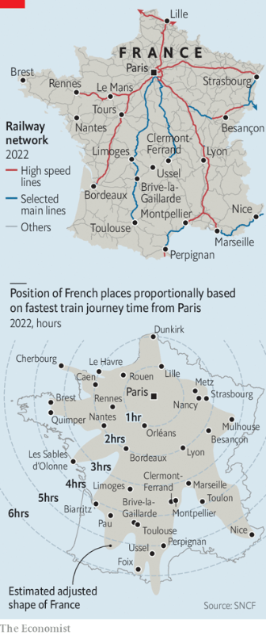
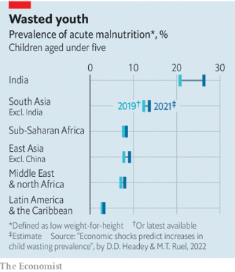

### 1. The world this week
#### 1.1 [Politics](https://www.economist.com/the-world-this-week/2022/12/15/politics)

#### 1.2 [Business](https://www.economist.com/the-world-this-week/2022/12/15/business)

#### 1.3 [KAL’s cartoon](https://www.economist.com/the-world-this-week/2022/12/15/kals-cartoon)
  

### 2. Leaders
#### 2.1 [A looming Russian offensive](https://www.economist.com/leaders/2022/12/15/a-looming-russian-offensive)

#### 2.2 [China’s covid wave could kill as many as 1.5m people](https://www.economist.com/leaders/2022/12/15/what-china-can-still-do-to-avoid-an-enormous-covid-death-toll)
  

#### 2.3 [Why are the rich world’s politicians giving up on economic growth?](https://www.economist.com/leaders/2022/12/14/why-are-the-rich-worlds-politicians-giving-up-on-economic-growth)
  

#### 2.4 [The French exception](https://www.economist.com/leaders/2022/12/15/the-french-exception)

#### 2.5 [How to save South Africa](https://www.economist.com/leaders/2022/12/15/how-to-save-south-africa)

### 3. Letters
#### 3.1 [Letters to the editor](https://www.economist.com/letters/2022/12/15/letters-to-the-editor)

### 4. By Invitation
#### 4.1 [Volodymyr Zelensky’s chief of staff on how to end war in Ukraine](https://www.economist.com/by-invitation/2022/12/15/volodymyr-zelenskys-chief-of-staff-on-how-to-end-war-in-ukraine)

#### 4.2 [Two health experts say China’s haste to re-open risks needless death and disruption](https://www.economist.com/by-invitation/2022/12/13/two-health-experts-say-chinas-haste-to-re-open-risks-needless-death-and-disruption)

#### 4.3 [Aaron Friedberg says the West should abandon efforts to integrate a hostile, revisionist China](https://www.economist.com/by-invitation/2022/12/12/aaron-friedberg-says-the-west-should-abandon-efforts-to-integrate-a-hostile-revisionist-china)

### 5. Briefing
#### 5.1 [Volodymyr Zelensky and his generals explain why the war hangs in the balance](https://www.economist.com/ukraines-fateful-winter)
  

#### 5.2 [Ukraine’s top soldier runs a different kind of army from Russia’s](https://www.economist.com/zaluzhny-profile)

#### 5.3 [“Anyone who underestimates Russia is headed for defeat”](https://www.economist.com/syrsky-interview)
  

### 6. Europe
#### 6.1 [Despite power cuts and blockades, Ukraine’s economy is coping](https://www.economist.com/europe/2022/12/14/despite-power-cuts-and-blockades-ukraines-economy-is-coping)

#### 6.2 [The war has worsened Ukraine’s demographic woes](https://www.economist.com/europe/2022/12/12/the-war-has-worsened-ukraines-demographic-woes)

#### 6.3 [Germany’s capital struggles to clean up its act](https://www.economist.com/europe/2022/12/15/germanys-capital-struggles-to-clean-up-its-act)

#### 6.4 [Ireland’s new prime minister is mocked before he starts](https://www.economist.com/europe/2022/12/15/irelands-new-prime-minister-is-mocked-before-he-starts)

#### 6.5 [France needs better slow trains, not just fast ones](https://www.economist.com/europe/2022/12/11/france-needs-better-slow-trains-not-just-fast-ones)
  

#### 6.6 [A corruption scandal leaves the EU reeling](https://www.economist.com/europe/2022/12/15/a-corruption-scandal-leaves-the-eu-reeling)

### 7. Britain
#### 7.1 [The strange case of Britain’s demise](https://www.economist.com/britain/2022/12/12/the-strange-case-of-britains-demise)
  

#### 7.2 [Britain’s economic record since 2007 ranks near the bottom among peer countries](https://www.economist.com/britain/2022/12/15/britains-economic-record-since-2007-ranks-near-the-bottom-among-peer-countries)

#### 7.3 [The British government and the unions dig in on train strikes](https://www.economist.com/britain/2022/12/13/the-british-government-and-the-unions-dig-in-on-train-strikes)
  
  

#### 7.4 [Why do Harry and Meghan wind people up?](https://www.economist.com/britain/2022/12/15/why-do-harry-and-meghan-wind-people-up)
  

### 8. United States
#### 8.1 [America’s unions are gentrifying](https://www.economist.com/united-states/2022/12/14/americas-unions-are-gentrifying)

#### 8.2 [What to make of the Twitter Files?](https://www.economist.com/united-states/2022/12/14/what-to-make-of-the-twitter-files)

#### 8.3 [Why catalytic-converter theft has soared in America](https://www.economist.com/united-states/2022/12/15/why-catalytic-converter-theft-has-soared-in-america)
  

#### 8.4 [Axe-throwing may be the friendliest new sport in America](https://www.economist.com/united-states/2022/12/15/axe-throwing-may-be-the-friendliest-new-sport-in-america)

#### 8.5 [A city experiments with paying people not to be annoying](https://www.economist.com/united-states/2022/12/15/a-city-experiments-with-paying-people-not-to-be-annoying)

#### 8.6 [E-cigarette taxes may reduce teenage drink-driving deaths](https://www.economist.com/united-states/2022/12/15/e-cigarette-taxes-may-reduce-teenage-drink-driving-deaths)

#### 8.7 [Republicans should leave Hunter Biden to his painting, and the Justice Department](https://www.economist.com/united-states/2022/12/15/republicans-should-leave-hunter-biden-to-his-painting-and-the-justice-department)

### 9. Middle East & Africa
#### 9.1 [The party of Nelson Mandela is imploding](https://www.economist.com/middle-east-and-africa/2022/12/13/the-party-of-nelson-mandela-is-imploding)
  

#### 9.2 [Commercial cattle-raiding is impoverishing Uganda’s herders](https://www.economist.com/middle-east-and-africa/2022/12/15/commercial-cattle-raiding-is-impoverishing-ugandas-herders)

#### 9.3 [China is helping Zimbabwe to build a surveillance state](https://www.economist.com/middle-east-and-africa/2022/12/15/china-is-helping-zimbabwe-to-build-a-surveillance-state)

#### 9.4 [Iraq’s new prime minister vows to clean up the country](https://www.economist.com/middle-east-and-africa/2022/12/15/iraqs-new-prime-minister-vows-to-clean-up-the-country)

#### 9.5 [Morocco’s World Cup success sparks a debate about Arab identity](https://www.economist.com/middle-east-and-africa/2022/12/13/moroccos-world-cup-success-sparks-a-debate-about-arab-identity)

### 10. The Americas
#### 10.1 [Argentina’s populist political movement is at its lowest ebb](https://www.economist.com/the-americas/2022/12/15/argentinas-populist-political-movement-is-at-its-lowest-ebb)
  

### 11. Asia
#### 11.1 [East Asia’s big beasts are getting on badly](https://www.economist.com/asia/2022/12/12/east-asias-big-beasts-are-getting-on-badly)
  

#### 11.2 [Japan’s most endangered languages face extinction](https://www.economist.com/asia/2022/12/15/japans-most-endangered-languages-face-extinction)

#### 11.3 [BTS takes on­ Kim Jong Un](https://www.economist.com/asia/2022/12/13/bts-takes-on-kim-jong-un)

#### 11.4 [Mongolians brave the cold to decry corruption](https://www.economist.com/asia/2022/12/15/mongolians-brave-the-cold-to-decry-corruption)

#### 11.5 [China’s frontier aggression has pushed India to the West](https://www.economist.com/asia/2022/12/15/chinas-frontier-aggression-has-pushed-india-to-the-west)

### 12. China
#### 12.1 [How Chinese people are dealing with the spread of covid-19](https://www.economist.com/china/2022/12/13/how-chinese-people-are-dealing-with-the-spread-of-covid-19)

#### 12.2 [What to make of China’s claims about covid](https://www.economist.com/china/2022/12/15/what-to-make-of-chinas-claims-about-covid)

#### 12.3 [Our model shows that China’s covid death toll could be massive](https://www.economist.com/china/2022/12/15/our-model-shows-that-chinas-covid-death-toll-could-be-massive)
  

#### 12.4 [The politics of Xi Jinping’s covid retreat](https://www.economist.com/china/2022/12/15/the-politics-of-xi-jinpings-covid-retreat)

### 13. International
#### 13.1 [The pandemic’s indirect effects on small children could last a lifetime](https://www.economist.com/international/2022/12/15/the-pandemics-indirect-effects-on-small-children-could-last-a-lifetime)
  

### 14. Business
#### 14.1 [Can the French nuclear industry avoid meltdown?](https://www.economist.com/business/2022/12/12/can-the-french-nuclear-industry-avoid-meltdown)
  
  

#### 14.2 [Why Mumbai’s old business district is so shabby](https://www.economist.com/business/2022/12/15/why-mumbais-old-business-district-is-so-shabby)

#### 14.3 [Tech lay-offs are the latest blow to office landlords](https://www.economist.com/business/2022/12/15/tech-lay-offs-are-the-latest-blow-to-office-landlords)
  

#### 14.4 [Big tech pushes further into finance](https://www.economist.com/business/2022/12/15/big-tech-pushes-further-into-finance)

#### 14.5 [German retailers aren’t feeling very festive](https://www.economist.com/business/2022/12/15/german-retailers-arent-feeling-very-festive)

#### 14.6 [The enduring value of an analogue technology](https://www.economist.com/business/2022/12/15/the-enduring-value-of-an-analogue-technology)

#### 14.7 [America’s biggest ports face a new kind of paralysis](https://www.economist.com/business/2022/12/15/americas-biggest-ports-face-a-new-kind-of-paralysis)

### 15. Finance & economics
#### 15.1 [How the West fell out of love with economic growth](https://www.economist.com/finance-and-economics/2022/12/11/how-the-west-fell-out-of-love-with-economic-growth)
  
  
  

#### 15.2 [The game is up for Sam Bankman-Fried](https://www.economist.com/finance-and-economics/2022/12/13/the-game-is-up-for-sam-bankman-fried)

#### 15.3 [America’s inflation fever may be breaking at last](https://www.economist.com/finance-and-economics/2022/12/13/americas-inflation-fever-may-be-breaking-at-last)
  

#### 15.4 [What an unusual auction says about the art market](https://www.economist.com/finance-and-economics/2022/12/15/what-an-unusual-auction-says-about-the-art-market)

#### 15.5 [Europe looks increasingly complacent about the winter ahead](https://www.economist.com/finance-and-economics/2022/12/15/europe-looks-increasingly-complacent-about-the-winter-ahead)
  

#### 15.6 [The struggle to put a carbon price on a flight](https://www.economist.com/finance-and-economics/2022/12/15/the-struggle-to-put-a-carbon-price-on-a-flight)

#### 15.7 [The insidious threats to central-bank independence](https://www.economist.com/finance-and-economics/2022/12/15/the-insidious-threats-to-central-bank-independence)

### 16. Science & technology
#### 16.1 [Controlled fusion is little nearer now than it was a week ago](https://www.economist.com/science-and-technology/2022/12/13/controlled-fusion-is-little-nearer-now-than-it-was-a-week-ago)

#### 16.2 [A UN biodiversity meeting is slugging it out in Montreal](https://www.economist.com/science-and-technology/2022/12/14/a-un-biodiversity-meeting-is-slugging-it-out-in-montreal)

#### 16.3 [Not enough is known about the science of pads and tampons](https://www.economist.com/science-and-technology/2022/12/14/not-enough-is-known-about-the-science-of-pads-and-tampons)
  

#### 16.4 [A study of ophidian clitorises suggests snakes are highly sexed](https://www.economist.com/science-and-technology/2022/12/14/a-study-of-ophidian-clitorises-suggests-snakes-are-highly-sexed)

### 17. Culture
#### 17.1 [Reading Sally Rooney in China](https://www.economist.com/culture/2022/12/15/reading-sally-rooney-in-china)

#### 17.2 [The Ottoman empire fell a century ago. Or did it?](https://www.economist.com/culture/2022/12/15/the-ottoman-empire-fell-a-century-ago-or-did-it)

#### 17.3 [And the word of 2022 is…](https://www.economist.com/culture/2022/12/14/and-the-word-of-2022-is)

#### 17.4 [Alice Neel’s art is at last getting the attention it deserves](https://www.economist.com/culture/2022/12/15/alice-neels-art-is-at-last-getting-the-attention-it-deserves)

### 18. Economic & financial indicators
#### 18.1 [Economic data, commodities and markets](https://www.economist.com/economic-and-financial-indicators/2022/12/15/economic-data-commodities-and-markets)
  
  
  
  

### 19. The Economist explains
#### 19.1 [What caused the demise of Boeing’s 747 airliner?](https://www.economist.com/the-economist-explains/2022/12/10/what-caused-the-demise-of-boeings-747-airliner)

#### 19.2 [How to design a perfect World Cup](https://www.economist.com/the-economist-explains/2022/12/14/how-to-design-a-perfect-world-cup)

### 20. Obituary
#### 20.1 [Squadron Leader Johnny Johnson longed to give Hitler a bloody nose](https://www.economist.com/obituary/2022/12/15/squadron-leader-johnny-johnson-longed-to-give-hitler-a-bloody-nose)

