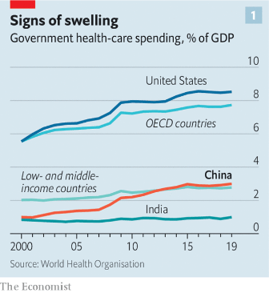
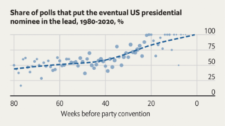

### 1. The world this week
#### 1.1 [The world this year](https://www.economist.com/the-world-this-week/2022/12/20/the-world-this-year)

#### 1.2 [KAL’s cartoon](https://www.economist.com/the-world-this-week/2022/12/20/kals-cartoon)
  

### 2. Leaders
#### 2.1 [Why 2022 mattered](https://www.economist.com/leaders/2022/12/20/what-2022-meant-for-the-world)

#### 2.2 [It has to be Ukraine](https://www.economist.com/leaders/2022/12/20/our-country-of-the-year-for-2022-can-only-be-ukraine)

#### 2.3 [A $44bn education](https://www.economist.com/leaders/2022/12/19/elon-musks-44bn-education-on-free-speech)

#### 2.4 [The year of the rate shock](https://www.economist.com/leaders/2022/12/20/the-year-of-the-rate-shock)
  

#### 2.5 [The laws of nature](https://www.economist.com/leaders/2022/12/20/why-climate-change-is-intimately-tied-to-biodiversity)

### 3. Letters
#### 3.1 [On needle-exchange programmes, Kenya, the EU, the Titanic, street names, job titles](https://www.economist.com/letters/2022/12/20/letters-to-the-editor)

### 4. By Invitation
#### 4.1 [Jaime Yassif on the need for better safeguarding of bioscience](https://www.economist.com/by-invitation/2022/12/19/jaime-yassif-on-the-need-for-better-safeguarding-of-bioscience)

### 5. Britain
#### 5.1 [A way in the world](https://www.economist.com/britain/2022/12/20/the-children-of-britains-eastern-european-immigrants-are-changing-the-country)

#### 5.2 [Scrooge-onomics](https://www.economist.com/britain/2022/12/20/the-inefficiencies-of-christmas)

#### 5.3 [Nursing a grievance](https://www.economist.com/britain/2022/12/19/british-nurses-launch-unprecedented-strikes)

#### 5.4 [Westminster’s other cathedral](https://www.economist.com/britain/2022/12/20/westminsters-other-cathedral)

### 6. Europe
#### 6.1 [Peace on Earth](https://www.economist.com/europe/2022/12/20/a-ukrainian-city-celebrates-despite-the-cold-and-the-russians)

#### 6.2 [No room in the middle](https://www.economist.com/europe/2022/12/20/pope-francis-has-failed-to-be-a-spiritual-mediator-in-ukraine)

#### 6.3 [The last taboo](https://www.economist.com/europe/2022/12/20/france-starts-a-debate-on-legalising-assisted-dying)

#### 6.4 [Balkan barricades](https://www.economist.com/europe/2022/12/20/kosovo-and-serbia-are-on-the-verge-of-conflict-again)
  

#### 6.5 [Food of the frauds](https://www.economist.com/europe/2022/12/20/why-europes-traditional-foods-are-not-always-what-they-seem)

### 7. United States
#### 7.1 [Care or confinement](https://www.economist.com/united-states/2022/12/19/is-forced-treatment-for-the-mentally-ill-ever-humane)

#### 7.2 [Move along](https://www.economist.com/united-states/2022/12/18/donald-trumps-popularity-with-republican-voters-is-sinking)
  

#### 7.3 [Disorder on the border](https://www.economist.com/united-states/2022/12/20/title-42-might-be-nixed)

#### 7.4 [Listen up](https://www.economist.com/united-states/2022/12/20/free-speech-is-not-in-peril-in-america)

### 8. Middle East & Africa
#### 8.1 [Finding faith in the fund](https://www.economist.com/middle-east-and-africa/2022/12/20/ghana-has-struck-a-preliminary-imf-deal-and-halted-debt-payments)
  

#### 8.2 [Shell companies](https://www.economist.com/middle-east-and-africa/2022/12/20/what-the-price-of-zanzibari-coconuts-says-about-african-development)

#### 8.3 [An election with no voters](https://www.economist.com/middle-east-and-africa/2022/12/20/a-farcical-election-pushes-tunisia-towards-one-man-rule)

### 9. The Americas
#### 9.1 [Man bites watchdog](https://www.economist.com/the-americas/2022/12/20/an-electoral-reform-in-mexico-will-make-elections-less-safe)

#### 9.2 [Lessons from Messi](https://www.economist.com/the-americas/2022/12/18/argentina-clinch-the-world-cup-after-beating-france-on-penalties)

### 10. Asia
#### 10.1 [Slum-mop billionaire](https://www.economist.com/asia/2022/12/20/can-indias-richest-man-remake-mumbais-biggest-slum)

#### 10.2 [Dumplings and skewers](https://www.economist.com/asia/2022/12/20/japans-cities-are-being-remade-for-an-ageing-population)

#### 10.3 [Moving house](https://www.economist.com/asia/2022/12/20/extreme-weather-is-making-parts-of-australia-uninhabitable)

### 11. China
#### 11.1 [A covid stress test](https://www.economist.com/china/2022/12/19/a-wave-of-covid-19-reveals-flaws-in-chinas-health-system)
  
  

#### 11.2 [Way back when](https://www.economist.com/china/2022/12/20/bertrand-russell-and-the-problem-of-china)

### 12. Christmas Specials
#### 12.1 [Time lords](https://www.economist.com/christmas-specials/2022/12/20/in-a-corner-of-java-live-the-amish-of-indonesia)

#### 12.2 [All uncreated men are equal](https://www.economist.com/christmas-specials/2022/12/20/should-we-care-about-people-who-need-never-exist)

#### 12.3 [The two Brazilian booms that bookmark the history of the car](https://www.economist.com/christmas-specials/2022/12/20/what-brazils-19th-century-rubber-crash-could-teach-todays-oil-drillers)

#### 12.4 [Use your loaf](https://www.economist.com/christmas-specials/2022/12/20/how-food-affects-the-mind-as-well-as-the-body)

#### 12.5 [Paws for thought](https://www.economist.com/interactive/christmas-specials/2022/12/20/what-makes-certain-dogs-popular-in-certain-countries)

#### 12.6 [When money dies](https://www.economist.com/christmas-specials/2022/12/20/the-great-inflation-of-the-1500s-is-echoing-eerily-today)
  

#### 12.7 [Going off grid](https://www.economist.com/interactive/christmas-specials/2022/12/20/the-decline-of-the-city-grid)

#### 12.8 [Batter up](https://www.economist.com/christmas-specials/2022/12/20/why-cricket-and-america-are-made-for-each-other)

#### 12.9 [The wibbly-wobbly circle of life](https://www.economist.com/christmas-specials/2022/12/20/deadly-dirty-indispensable-the-nitrogen-industry-has-changed-the-world)
  

#### 12.10 [The weight of the world](https://www.economist.com/christmas-specials/2022/12/20/the-economics-of-thinness)
  

#### 12.11 [The myth of the holy cow](https://www.economist.com/christmas-specials/2022/12/20/indias-movement-to-protect-cows-is-rooted-in-politics-not-religion)

#### 12.12 [Complex saviours](https://www.economist.com/christmas-specials/2022/12/20/the-new-tech-worldview)

#### 12.13 [The three knife trilogy](https://www.economist.com/christmas-specials/2022/12/20/emigrants-from-a-small-corner-of-china-are-making-an-outsize-mark-abroad)

#### 12.14 [Hot spot](https://www.economist.com/interactive/christmas-specials/2022/12/20/how-will-the-haj-change-as-global-temperatures-rise)

#### 12.15 [Taking the mickey](https://www.economist.com/christmas-specials/2022/12/20/a-treasure-trove-of-hollywood-intellectual-property-is-heading-for-the-public-domain)

#### 12.16 [Through a crystal curtain](https://www.economist.com/christmas-specials/2022/12/19/the-chinese-celebrate-tang-poetry-as-a-pinnacle-of-their-culture)

#### 12.17 [Secrets of the shallows](https://www.economist.com/christmas-specials/2022/12/20/a-megadrought-has-revealed-a-possible-mafia-murder-mystery)

### 13. Business
#### 13.1 [When brown meets green](https://www.economist.com/business/2022/12/19/why-the-gulfs-oil-powers-are-betting-on-clean-energy)
  
  

#### 13.2 [Parting of the clouds](https://www.economist.com/business/2022/12/20/airlines-are-closing-in-on-their-pre-covid-heights)

#### 13.3 [A thaw, and lots of frost](https://www.economist.com/business/2022/12/20/america-tries-to-nobble-chinas-tech-industry-again)

#### 13.4 [Making the most of LinkedIn](https://www.economist.com/business/2022/12/20/how-to-make-the-most-of-linkedin)

#### 13.5 [The sovereign of savoir-faire](https://www.economist.com/business/2022/12/20/how-bernard-arnault-became-the-worlds-richest-person)

### 14. Finance & economics
#### 14.1 [Time for a party](https://www.economist.com/finance-and-economics/2022/12/18/2022s-unlikely-economic-winners)
  

#### 14.2 [Zero zero-covid](https://www.economist.com/finance-and-economics/2022/12/20/chinas-leaders-ponder-an-economy-without-lockdowns-or-crackdowns)

#### 14.3 [Triumph of the Luddites](https://www.economist.com/finance-and-economics/2022/12/20/the-pandemic-and-the-triumph-of-the-luddites)
  

#### 14.4 [No time like the present](https://www.economist.com/finance-and-economics/2022/12/20/the-bank-of-japan-shocks-investors)
  

#### 14.5 [Paper tigers](https://www.economist.com/finance-and-economics/2022/12/20/indias-stockmarkets-are-roaring-they-also-have-serious-faults)

#### 14.6 [Arthur Burns, reconsidered](https://www.economist.com/finance-and-economics/2022/12/20/the-federal-reserves-great-anti-hero-deserves-a-second-look)

### 15. Science & technology
#### 15.1 [Enlightened computing](https://www.economist.com/science-and-technology/2022/12/20/artificial-intelligence-and-the-rise-of-optical-computing)

#### 15.2 [Trust no one](https://www.economist.com/science-and-technology/2022/12/20/a-better-way-to-process-encrypted-data)

#### 15.3 [Layering it on](https://www.economist.com/science-and-technology/2022/12/20/a-golden-sandwich-that-demists-your-windscreen)

### 16. Culture
#### 16.1 [Heart of darkness](https://www.economist.com/culture/2022/12/20/francisco-goyas-vision-of-war-is-powerful-and-urgent)

#### 16.2 [Rogues’ gallery](https://www.economist.com/culture/2022/12/20/a-delightful-world-history-told-through-influential-families)

#### 16.3 [The year of the underdogs](https://www.economist.com/culture/2022/12/20/the-year-of-the-underdogs)

### 17. Economic & financial indicators
#### 17.1 [Economic data, commodities and markets](https://www.economist.com/economic-and-financial-indicators/2022/12/20/economic-data-commodities-and-markets)
  
  
  
  

### 18. Graphic detail
#### 18.1 [The year of Ukraine](https://www.economist.com/graphic-detail/2022/12/20/war-replaces-disease-as-the-worlds-most-newsworthy-subject)
  
  
  

### 19. The Economist explains
#### 19.1 [Is Russia running out of ammunition?](https://www.economist.com/the-economist-explains/2022/12/20/is-russia-running-out-of-ammunition)

#### 19.2 [How to understand 2022 in memes](https://www.economist.com/the-economist-explains/2022/12/14/how-to-understand-2022-in-memes)

### 20. Obituary
#### 20.1 [The endless quest](https://www.economist.com/obituary/2022/12/20/daniel-brushs-drive-to-understand-beauty-led-him-to-the-life-of-a-hermit)

