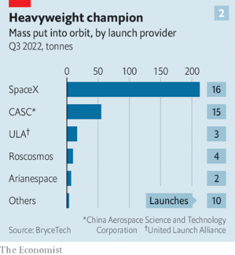
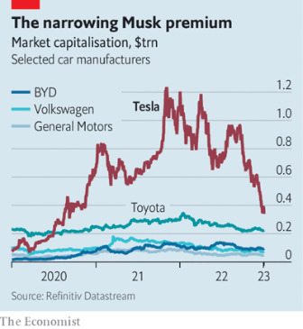
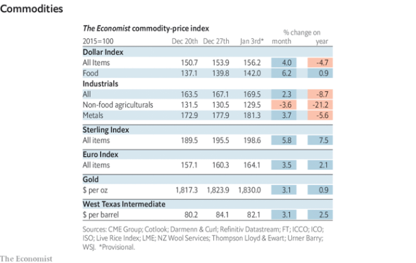

### 1. The world this week
#### 1.1 [Politics and business](https://www.economist.com/the-world-this-week/2023/01/05/politics-and-business)

#### 1.2 [KAL’s cartoon](https://www.economist.com/the-world-this-week/2023/01/05/kals-cartoon)
  

### 2. Leaders
#### 2.1 [A realistic path to a better relationship between Britain and the EU](https://www.economist.com/leaders/2023/01/05/a-realistic-path-to-a-better-relationship-between-britain-and-the-eu)

#### 2.2 [How China’s reopening will disrupt the world economy](https://www.economist.com/leaders/2023/01/05/how-chinas-reopening-will-disrupt-the-world-economy)

#### 2.3 [Why the gusty North Sea could give Europe an industrial edge](https://www.economist.com/leaders/2023/01/05/why-the-gusty-north-sea-could-give-europe-an-industrial-edge)

#### 2.4 [Starlink’s performance in Ukraine has ignited a new space race](https://www.economist.com/leaders/2023/01/05/starlinks-performance-in-ukraine-has-ignited-a-new-space-race)

#### 2.5 [What the Kevin McCarthy saga means for America’s Congress](https://www.economist.com/leaders/2023/01/04/what-the-kevin-mccarthy-saga-means-for-americas-congress)

### 3. Letters
#### 3.1 [Letters to the editor](https://www.economist.com/letters/2023/01/05/letters-to-the-editor)

### 4. By Invitation
#### 4.1 [Paschal Donohoe on how the euro will thrive in spite of the war in Ukraine](https://www.economist.com/by-invitation/2023/01/04/paschal-donohoe-on-how-the-euro-will-thrive-in-spite-of-the-war-in-ukraine)

### 5. Briefing
#### 5.1 [How Elon Musk’s satellites have saved Ukraine and changed warfare](https://www.economist.com/briefing/2023/01/05/how-elon-musks-satellites-have-saved-ukraine-and-changed-warfare)
  
  

### 6. Europe
#### 6.1 [A Russian warlord’s savagery is sending a loud message to Moscow](https://www.economist.com/europe/2023/01/04/a-russian-warlords-savagery-is-sending-a-loud-message-to-moscow)
  

#### 6.2 [France reviews its hunting rules](https://www.economist.com/europe/2023/01/05/france-reviews-its-hunting-rules)

#### 6.3 [Why Poland loves to hate Germany](https://www.economist.com/europe/2023/01/05/why-poland-loves-to-hate-germany)

#### 6.4 [Fifty years ago, the EU cracked the secret of its current success](https://www.economist.com/europe/2023/01/05/fifty-years-ago-the-eu-cracked-the-secret-of-its-current-success)

### 7. Britain
#### 7.1 [Assembling a better British relationship with Europe](https://www.economist.com/britain/2023/01/05/assembling-a-better-british-relationship-with-europe)
  
  

#### 7.2 [Scotland’s new gender-reform law presents Rishi Sunak with a dilemma](https://www.economist.com/britain/2023/01/05/scotlands-new-gender-reform-law-presents-rishi-sunak-with-a-dilemma)

#### 7.3 [Britain’s offshore wind farms attract tourists](https://www.economist.com/britain/2023/01/05/britains-offshore-wind-farms-attract-tourists)

#### 7.4 [Britons in their thirties are stuck in a dark age](https://www.economist.com/britain/2023/01/05/britons-in-their-thirties-are-stuck-in-a-dark-age)

### 8. United States
#### 8.1 [Chicago’s woes are over-hyped](https://www.economist.com/united-states/2023/01/05/chicagos-woes-are-over-hyped)

#### 8.2 [Eric Adams and Kathy Hochul have grand plans for New York City](https://www.economist.com/united-states/2023/01/05/eric-adams-and-kathy-hochul-have-grand-plans-for-new-york-city)

#### 8.3 [Republicans struggle to elect a speaker of the House](https://www.economist.com/united-states/2023/01/04/republicans-struggle-to-elect-a-speaker-of-the-house)

#### 8.4 [Pay-transparency laws do not work as advertised](https://www.economist.com/united-states/2023/01/05/pay-transparency-laws-do-not-work-as-advertised)
  

#### 8.5 [The great mystery of American politics](https://www.economist.com/united-states/2023/01/05/the-great-mystery-of-american-politics)

### 9. Middle East & Africa
#### 9.1 [Israel’s new government will test the ties with Arab states](https://www.economist.com/middle-east-and-africa/2023/01/03/israels-new-government-will-test-the-ties-with-arab-states)
  

#### 9.2 [Sudan’s troubled east is a microcosm of a wider crisis](https://www.economist.com/middle-east-and-africa/2023/01/05/sudans-troubled-east-is-a-microcosm-of-a-wider-crisis)
  

#### 9.3 [Women in the Middle East are leading a revolt against prudish men](https://www.economist.com/middle-east-and-africa/2023/01/05/women-in-the-middle-east-are-leading-a-revolt-against-prudish-men)

### 10. The Americas
#### 10.1 [Brazil’s new president faces a fiscal crunch and a fickle Congress](https://www.economist.com/the-americas/2022/12/31/brazils-new-president-faces-a-fiscal-crunch-and-a-fickle-congress)
  

### 11. Asia
#### 11.1 [Reinventing the Indo-Pacific](https://www.economist.com/asia/2023/01/04/reinventing-the-indo-pacific)
  

#### 11.2 [A historic transfer of power in the South Pacific](https://www.economist.com/asia/2023/01/05/a-historic-transfer-of-power-in-the-south-pacific)

#### 11.3 [Postponing India’s census is terrible for the country](https://www.economist.com/asia/2023/01/05/postponing-indias-census-is-terrible-for-the-country)

#### 11.4 [Pakistan and China find they have little leverage with the Taliban](https://www.economist.com/asia/2023/01/05/pakistan-and-china-find-they-have-little-leverage-with-the-taliban)

### 12. China
#### 12.1 [China is overwhelmed, yet an even bigger covid wave may be coming](https://www.economist.com/china/2023/01/05/china-is-overwhelmed-yet-an-even-bigger-covid-wave-may-be-coming)
  
  

#### 12.2 [The Chinese Communist Party plans to avoid a zero-covid reckoning](https://www.economist.com/china/2023/01/05/the-chinese-communist-party-plans-to-avoid-a-zero-covid-reckoning)

### 13. International
#### 13.1 [The death of Pope Benedict removes a problem for liberal Catholics](https://www.economist.com/international/2023/01/02/the-death-of-pope-benedict-removes-a-problem-for-liberal-catholics)
  

#### 13.2 [Pope Benedict XVI was an iron fist in a white glove](https://www.economist.com/international/2022/12/31/pope-benedict-xvi-was-an-iron-fist-in-a-white-glove)

### 14. Business
#### 14.1 [Can the North Sea become Europe’s new economic powerhouse?](https://www.economist.com/business/2023/01/01/can-the-north-sea-become-europes-new-economic-powerhouse)

#### 14.2 [How to have the most productive working day of your life](https://www.economist.com/business/2023/01/04/how-to-have-the-most-productive-working-day-of-your-life)

#### 14.3 [A scandal rocks India’s pharmaceutical industry](https://www.economist.com/business/2023/01/05/a-scandal-rocks-indias-pharmaceutical-industry)

#### 14.4 [Investors conclude that Tesla is a carmaker, not a tech firm](https://www.economist.com/business/2023/01/04/investors-conclude-that-tesla-is-a-carmaker-not-a-tech-firm)
  

#### 14.5 [How to avoid flight chaos](https://www.economist.com/business/2023/01/05/how-to-avoid-flight-chaos)

### 15. Finance & economics
#### 15.1 [What the great reopening means for China—and the world](https://www.economist.com/finance-and-economics/2023/01/02/what-the-great-reopening-means-for-china-and-the-world)
  
  
  

#### 15.2 [Imagine an India without hawkers](https://www.economist.com/finance-and-economics/2023/01/05/imagine-an-india-without-hawkers)

#### 15.3 [Sam Bankman-Fried pleads not guilty](https://www.economist.com/finance-and-economics/2023/01/03/sam-bankman-fried-pleads-not-guilty)

#### 15.4 [Will investors have another awful year in 2023?](https://www.economist.com/finance-and-economics/2023/01/05/will-investors-have-another-awful-year-in-2023)

### 16. Science & technology
#### 16.1 [All around the world, covid surveillance is faltering](https://www.economist.com/science-and-technology/2023/01/04/all-around-the-world-covid-surveillance-is-faltering)

#### 16.2 [Acidifying the air may protect against covid](https://www.economist.com/science-and-technology/2023/01/04/acidifying-the-air-may-protect-against-covid)

#### 16.3 [Papers and patents are becoming less disruptive](https://www.economist.com/science-and-technology/2023/01/04/papers-and-patents-are-becoming-less-disruptive)
  

### 17. Culture
#### 17.1 [Alexander the Great and the birth of the modern world](https://www.economist.com/culture/2023/01/05/alexander-the-great-and-the-birth-of-the-modern-world)

#### 17.2 [“As Gods” is a valuable primer on a controversial science](https://www.economist.com/culture/2023/01/05/as-gods-is-a-valuable-primer-on-a-controversial-science)

#### 17.3 [“The Thing in the Snow” is a weird but wonderful novel](https://www.economist.com/culture/2023/01/05/the-thing-in-the-snow-is-a-weird-but-wonderful-novel)

#### 17.4 [For the Tudors, love was an elaborate game](https://www.economist.com/culture/2023/01/04/for-the-tudors-love-was-an-elaborate-game)

### 18. Economic & financial indicators
#### 18.1 [Economic data, commodities and markets](https://www.economist.com/economic-and-financial-indicators/2023/01/05/economic-data-commodities-and-markets)
  
  
  
  

### 19. Graphic detail
#### 19.1 [America’s 117th Congress accomplished a lot. So did its recent predecessors](https://www.economist.com/graphic-detail/2023/01/03/americas-117th-congress-accomplished-a-lot-so-did-its-recent-predecessors)
  
  
  

### 20. The Economist explains
#### 20.1 [Who is Andrew Tate, the misogynist hero to millions of young men?](https://www.economist.com/the-economist-explains/2022/12/30/who-is-andrew-tate-the-misogynist-hero-to-millions-of-young-men)

### 21. Obituary
#### 21.1 [Pelé went from poverty to football superstardom](https://www.economist.com/obituary/2022/12/30/pele-went-from-poverty-to-football-superstardom)

