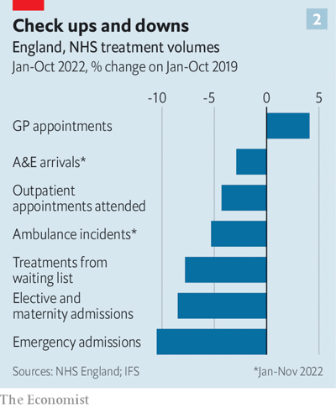

### 1. The world this week
#### 1.1 [Politics](https://www.economist.com/the-world-this-week/2023/01/12/politics)

#### 1.2 [Business](https://www.economist.com/the-world-this-week/2023/01/12/business)
  

#### 1.3 [KAL’s cartoon](https://www.economist.com/the-world-this-week/2023/01/12/kals-cartoon)
  

### 2. Leaders
#### 2.1 [The destructive new logic that threatens globalisation](https://www.economist.com/leaders/2023/01/12/the-destructive-new-logic-that-threatens-globalisation)

#### 2.2 [The West should supply tanks to Ukraine](https://www.economist.com/leaders/2023/01/11/the-west-should-supply-tanks-to-ukraine)

#### 2.3 [How Brazil should deal with the bolsonarista insurrection](https://www.economist.com/leaders/2023/01/12/how-brazil-should-deal-with-the-bolsonarista-insurrection)

#### 2.4 [America’s trustbusters plan to curtail the use of non-compete clauses. Good](https://www.economist.com/leaders/2023/01/12/americas-trustbusters-plan-to-curtail-the-use-of-non-compete-clauses-good)

#### 2.5 [Fixing Britain’s health service means fixing its family doctors](https://www.economist.com/leaders/2023/01/12/fixing-britains-health-service-means-fixing-its-family-doctors)
  

### 3. Letters
#### 3.1 [Letters to the editor](https://www.economist.com/letters/2023/01/12/letters-to-the-editor)

### 4. By Invitation
#### 4.1 [Daleep Singh on America’s economic statecraft](https://www.economist.com/by-invitation/2023/01/11/daleep-singh-on-americas-economic-statecraft)

### 5. Briefing
#### 5.1 [Globalisation, already slowing, is suffering a new assault](https://www.economist.com/briefing/2023/01/12/globalisation-already-slowing-is-suffering-a-new-assault)
  
  

### 6. Europe
#### 6.1 [Emmanuel Macron unveils his pension reforms](https://www.economist.com/europe/2023/01/10/emmanuel-macron-unveils-his-pension-reforms)
  

#### 6.2 [The war has devastated Ukraine’s environment, too](https://www.economist.com/europe/2023/01/12/the-war-has-devastated-ukraines-environment-too)

#### 6.3 [Might Turkey seize a tiny Greek island?](https://www.economist.com/europe/2023/01/12/might-turkey-seize-a-tiny-greek-island)
  

#### 6.4 [Turkey is on the point of banning the main Kurdish opposition party](https://www.economist.com/europe/2023/01/12/turkey-is-on-the-point-of-banning-the-main-kurdish-opposition-party)

#### 6.5 [The Armenians of Nagorno-Karabakh have been blockaded by Azerbaijan](https://www.economist.com/europe/2023/01/12/the-armenians-of-nagorno-karabakh-have-been-blockaded-by-azerbaijan)
  

### 7. Britain
#### 7.1 [General practitioners are a big part of Britain’s health-care crisis](https://www.economist.com/britain/2023/01/09/general-practitioners-are-a-big-part-of-britains-health-care-crisis)
  
  

#### 7.2 [How many excess deaths in England are associated with A&E delays?](https://www.economist.com/britain/2023/01/11/how-many-excess-deaths-in-england-are-associated-with-a-and-e-delays)
  

#### 7.3 [Prince Harry’s autobiography is an ill-advised romp](https://www.economist.com/britain/2023/01/10/prince-harrys-autobiography-is-an-ill-advised-romp)

#### 7.4 [Lower gas prices will provide only limited relief to Britons](https://www.economist.com/britain/2023/01/12/lower-gas-prices-will-provide-only-limited-relief-to-britons)

#### 7.5 [What the failure of Virgin Orbit means for Britain’s space ambitions](https://www.economist.com/britain/2023/01/12/what-the-failure-of-virgin-orbit-means-for-britains-space-ambitions)

#### 7.6 [The longed-for transformation of English farming isn’t happening](https://www.economist.com/britain/2023/01/12/the-longed-for-transformation-of-english-farming-isnt-happening)
  

#### 7.7 [British museums and galleries are dealing with the past, clumsily](https://www.economist.com/britain/2023/01/11/british-museums-and-galleries-are-dealing-with-the-past-clumsily)

### 8. United States
#### 8.1 [After a spectacularly chaotic start for Congress, more discord looms](https://www.economist.com/united-states/2023/01/12/after-a-spectacularly-chaotic-start-for-congress-more-discord-looms)

#### 8.2 [What California’s deadly storms reveal about the state’s climate future](https://www.economist.com/united-states/2023/01/11/what-californias-deadly-storms-reveal-about-the-states-climate-future)

#### 8.3 [America’s army has launched a scheme to slim down its recruits](https://www.economist.com/united-states/2023/01/12/americas-army-has-launched-a-scheme-to-slim-down-its-recruits)

#### 8.4 [Polyamory is getting slivers of legal recognition in America](https://www.economist.com/united-states/2023/01/12/polyamory-is-getting-slivers-of-legal-recognition-in-america)

#### 8.5 [America’s culture wars extend into medicine](https://www.economist.com/united-states/2023/01/08/americas-culture-wars-extend-into-medicine)
  
  

#### 8.6 [How rappers are strengthening Donald Trump’s movement](https://www.economist.com/united-states/2023/01/12/how-rappers-are-strengthening-donald-trumps-movement)

### 9. Middle East & Africa
#### 9.1 [After eight dismal years, Nigeria prepares to replace President Buhari](https://www.economist.com/middle-east-and-africa/2023/01/09/after-eight-dismal-years-nigeria-prepares-to-replace-president-buhari)
  
  

#### 9.2 [Ethiopia’s war in Tigray has ended, but deep faultlines remain](https://www.economist.com/middle-east-and-africa/2023/01/12/ethiopias-war-in-tigray-has-ended-but-deep-faultlines-remain)
  

#### 9.3 [Kenya’s blood shortage and the kicking of an aid addiction](https://www.economist.com/middle-east-and-africa/2023/01/12/kenyas-blood-shortage-and-the-kicking-of-an-aid-addiction)

#### 9.4 [Protests have subsided in Iran, but clerics cannot yet proclaim victory](https://www.economist.com/middle-east-and-africa/2023/01/12/protests-have-subsided-in-iran-but-clerics-cannot-yet-proclaim-victory)

#### 9.5 [A century-old choice created one of the Gulf’s oddest geopolitical features](https://www.economist.com/middle-east-and-africa/2023/01/12/a-century-old-choice-created-one-of-the-gulfs-oddest-geopolitical-features)
  

#### 9.6 [The Arab world’s rulers have turned journalists into courtiers](https://www.economist.com/middle-east-and-africa/2023/01/13/the-arab-worlds-rulers-have-turned-journalists-into-courtiers)

### 10. The Americas
#### 10.1 [A copycat insurrection in Brazil, and its troubling aftermath](https://www.economist.com/the-americas/2023/01/12/a-copycat-insurrection-in-brazil-and-its-troubling-aftermath)

#### 10.2 [Erotic statues in Peru are challenging taboos](https://www.economist.com/the-americas/2023/01/12/erotic-statues-in-peru-are-challenging-taboos)

#### 10.3 [Latin American cities are becoming far nicer for poorer inhabitants](https://www.economist.com/the-americas/2023/01/12/latin-american-cities-are-becoming-far-nicer-for-poorer-inhabitants)
  

### 11. Asia
#### 11.1 [Japan pivots back to nuclear power](https://www.economist.com/asia/2023/01/12/japan-pivots-back-to-nuclear-power)
  

#### 11.2 [Myanmar’s generals are deeply superstitious](https://www.economist.com/asia/2023/01/12/myanmars-generals-are-deeply-superstitious)

#### 11.3 [India’s rocketing internet-user growth has stalled](https://www.economist.com/asia/2023/01/12/indias-rocketing-internet-user-growth-has-stalled)

#### 11.4 [South Korea’s travel spat with China](https://www.economist.com/asia/2023/01/12/south-koreas-travel-spat-with-china)

#### 11.5 [Abe Shinzo’s assassin achieved his political goals](https://www.economist.com/asia/2023/01/12/abe-shinzos-assassin-achieved-his-political-goals)

#### 11.6 [The mirage of peace and prosperity in Kashmir](https://www.economist.com/asia/2023/01/10/the-mirage-of-peace-and-prosperity-in-kashmir)

### 12. China
#### 12.1 [Covid is complicating China’s efforts to re-engage with the world](https://www.economist.com/china/2023/01/10/covid-is-complicating-chinas-efforts-to-re-engage-with-the-world)
  
  

#### 12.2 [The cult of Li Wenliang, the doctor who spotted covid-19](https://www.economist.com/china/2023/01/12/the-cult-of-li-wenliang-the-doctor-who-spotted-covid-19)

#### 12.3 [China is still punishing those who protested against zero-covid](https://www.economist.com/china/2023/01/12/china-is-still-punishing-those-who-protested-against-zero-covid)

#### 12.4 [Many Chinese villagers seem ready to move on from covid-19](https://www.economist.com/china/2023/01/12/many-chinese-villagers-seem-ready-to-move-on-from-covid-19)

### 13. International
#### 13.1 [The age of the grandparent has arrived](https://www.economist.com/international/2023/01/12/the-age-of-the-grandparent-has-arrived)
  
  
  

### 14. Business
#### 14.1 [How technology is redrawing the boundaries of the firm](https://www.economist.com/business/2023/01/08/how-technology-is-redrawing-the-boundaries-of-the-firm)
  
  
  
  
  

#### 14.2 [Investments in ports foretell the future of global commerce](https://www.economist.com/interactive/business/2023/01/14/investments-in-ports-foretell-the-future-of-global-commerce)

#### 14.3 [German companies fret about a new supply-chain law](https://www.economist.com/business/2023/01/12/german-companies-fret-about-a-new-supply-chain-law)

#### 14.4 [The priciest cars are selling fast](https://www.economist.com/business/2023/01/12/the-priciest-cars-are-selling-fast)
  

#### 14.5 [A humiliating incident on an Air India flight triggers outrage](https://www.economist.com/business/2023/01/12/a-humiliating-incident-on-an-air-india-flight-triggers-outrage)

#### 14.6 [How to unlock creativity in the workplace](https://www.economist.com/business/2023/01/12/how-to-unlock-creativity-in-the-workplace)

#### 14.7 [Go to Texas to see the anti-green future of clean energy](https://www.economist.com/business/2023/01/12/go-to-texas-to-see-the-anti-green-future-of-clean-energy)

### 15. Finance & economics
#### 15.1 [What America’s protectionist turn means for the world](https://www.economist.com/finance-and-economics/2023/01/09/what-americas-protectionist-turn-means-for-the-world)
  

#### 15.2 [The dollar could bring investors a nasty surprise](https://www.economist.com/finance-and-economics/2023/01/12/the-dollar-could-bring-investors-a-nasty-surprise)
  

#### 15.3 [The energy crisis and Europe’s astonishing luck](https://www.economist.com/finance-and-economics/2023/01/11/the-energy-crisis-and-europes-astonishing-luck)
  

#### 15.4 [Has economics run out of big new ideas?](https://www.economist.com/finance-and-economics/2023/01/12/has-economics-run-out-of-big-new-ideas)

#### 15.5 [The hunt for FTX’s missing riches](https://www.economist.com/finance-and-economics/2023/01/10/the-hunt-for-ftxs-missing-riches)

#### 15.6 [Warnings from history for a new era of industrial policy](https://www.economist.com/finance-and-economics/2023/01/11/warnings-from-history-for-a-new-era-of-industrial-policy)

### 16. Science & technology
#### 16.1 [Proving a photo is fake is one thing. Proving it isn’t is another](https://www.economist.com/science-and-technology/2023/01/09/proving-a-photo-is-fake-is-one-thing-proving-it-isnt-is-another)

#### 16.2 [A praying mantis attacks a nestling](https://www.economist.com/science-and-technology/2023/01/11/a-praying-mantis-attacks-a-nestling)

#### 16.3 [Wasp larvae that eat aphids alive may save apple crops](https://www.economist.com/science-and-technology/2023/01/11/wasp-larvae-that-eat-aphids-alive-may-save-apple-crops)

#### 16.4 [What causes elephant poaching?](https://www.economist.com/science-and-technology/2023/01/11/what-causes-elephant-poaching)

#### 16.5 [Roman civil engineering has lessons for the modern world](https://www.economist.com/science-and-technology/2023/01/11/roman-civil-engineering-has-lessons-for-the-modern-world)

### 17. Culture
#### 17.1 [To their critics, Mexican drug ballads glorify violence](https://www.economist.com/culture/2023/01/11/to-their-critics-mexican-drug-ballads-glorify-violence)

#### 17.2 [Cinema meets radicalism in “Picture in the Sand”](https://www.economist.com/culture/2023/01/12/cinema-meets-radicalism-in-picture-in-the-sand)

#### 17.3 [The quest for the perfect chip](https://www.economist.com/culture/2023/01/09/the-quest-for-the-perfect-chip)

#### 17.4 [“For Blood and Money” charts a race to develop a blockbuster drug](https://www.economist.com/culture/2023/01/11/for-blood-and-money-charts-a-race-to-develop-a-blockbuster-drug)

#### 17.5 [How Cambodian music survived the horrors of the Khmers Rouges](https://www.economist.com/culture/2023/01/12/how-cambodian-music-survived-the-horrors-of-the-khmers-rouges)

#### 17.6 [The truth about Stone Mountain’s giant Confederate memorial](https://www.economist.com/culture/2023/01/12/the-truth-about-stone-mountains-giant-confederate-memorial)

### 18. Economic & financial indicators
#### 18.1 [Economic data, commodities and markets](https://www.economist.com/economic-and-financial-indicators/2023/01/12/economic-data-commodities-and-markets)
  
  
  
  

### 19. Graphic detail
#### 19.1 [Antidepressants are over-prescribed, but genuinely help some patients](https://www.economist.com/graphic-detail/2023/01/10/antidepressants-are-over-prescribed-but-genuinely-help-some-patients)
  
  
  

### 20. The Economist explains
#### 20.1 [What is the House Freedom Caucus?](https://www.economist.com/the-economist-explains/2023/01/09/what-is-the-house-freedom-caucus)

#### 20.2 [What is a tank—and does France’s gift to Ukraine fit the bill?](https://www.economist.com/the-economist-explains/2023/01/05/what-is-a-tank-and-does-frances-gift-to-ukraine-fit-the-bill)

### 21. Obituary
#### 21.1 [Vivienne Westwood sowed never-ending revolution all through the fashion world](https://www.economist.com/obituary/2023/01/11/vivienne-westwood-sowed-never-ending-revolution-all-through-the-fashion-world)

